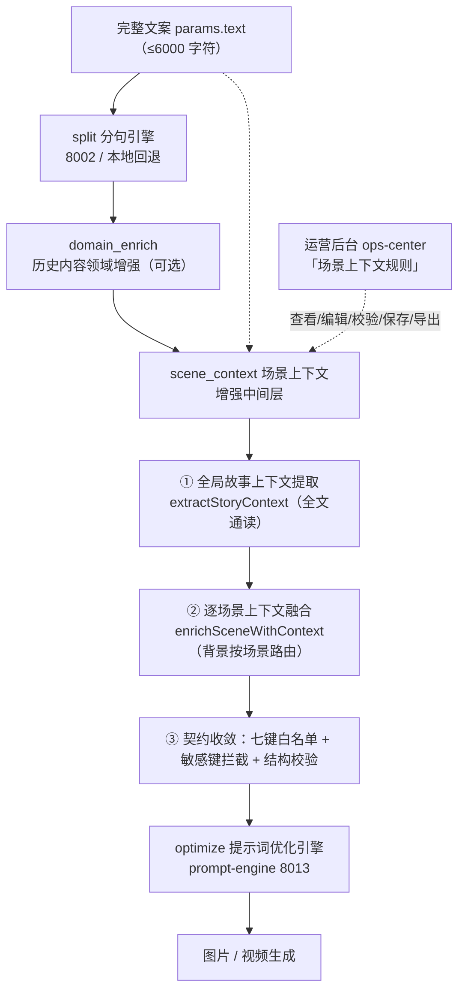

# PROJECT-003：多平台一键发布 — PRD> **立项日期**: 2026-06-03> **最后更新**: 2026-08-27> **当前版本**: v2.3.60 (2026-08-27) | **上一版本**: v2.3.59 (2026-08-27)> **功能文档**: [PRD-MODEL-PROVIDER-TEST-REAL-CALL.md](./PRD-MODEL-PROVIDER-TEST-REAL-CALL.md)（模型设置测试按钮-真实API调用验证） | [PRD-SERVICE-STATUS-PANEL-2026-09-12.md](./PRD-SERVICE-STATUS-PANEL-2026-09-12.md)（侧边栏服务状态面板：六服务真实状态 + 客户端登录态） | [PRD-SIDEBAR-BOTTOM-USER-MENU-2026-09-14.md](./PRD-SIDEBAR-BOTTOM-USER-MENU-2026-09-14.md)（侧边栏底部用户菜单：登录区下移为可展开 banner + 设置/升级 Pro 并入菜单 + 服务信息上移 + 模块导航右上角占位入口移除） | [PRD-SIDEBAR-UPDATE-ENTRY-2026-09-14.md](./PRD-SIDEBAR-UPDATE-ENTRY-2026-09-14.md)（侧边栏「新版本」入口：运行时更新提示 + 点击退出应用并安装 + 全局更新弹窗下线） | [PRD-FRONTEND-UI-CONSISTENCY-P0-2026-09-17.md](./PRD-FRONTEND-UI-CONSISTENCY-P0-2026-09-17.md)（前端 UI/UE 一致性 P0：危险操作门禁 + 侧边栏 token 化 + 统一空态 + 主页整改 + 路由登记制，PR #1899 已合并） | [PRD-FRONTEND-UI-CONSISTENCY-P1-2026-09-18.md](./PRD-FRONTEND-UI-CONSISTENCY-P1-2026-09-18.md)（P1 批次：T0-6a 壳态收敛补录 + T1-1 token 结构收敛与 Gate 14 + T1-3 内联样式清零分批规格）> **产品定位**: 为内容生产者提供"采集 → 改写 → 发布"全流程闭环的一键发布桌面工具> **目标用户**: 自媒体运营者、MCN 机构、企业内容团队> **技术架构**: Electron 33 + Vue 3 + Python FastAPI + RpaViewManager RPA（Monorepo）> **需求确认**: ✅ CEO 已签字（见 [REQUIREMENTS-SIGNOFF.md](./REQUIREMENTS-SIGNOFF.md)）> **市场调研**: [MARKET-RESEARCH.md](./MARKET-RESEARCH.md) | **设计评审**: [DESIGN-REVIEW.md](./DESIGN-REVIEW.md)---## 一、产品概述### 1.1 核心价值内容生产者每天需要在多个平台发布相同或相似的内容。手动操作耗时、易出错、格式不统一。PROJECT-003 提供：1. **统一入口**：一个桌面应用管理所有平台的发布2. **自动适配**：通过 RPA 自动化填表发布，适配各平台 UI3. **异步队列**：后台批量发布，实时追踪状态4. **Cookie 管理**：安全存储各平台登录凭证5. **定时发布**：设定时间自动发布6. **平台分类**：短视频/图文/混合三类，发布策略自动适配7. **单 RPA 引擎**：RpaViewManager（Electron 原生 executeJavaScript）统一引擎### 1.2 产品边界| 范围 | 说明 ||------|------|||| ✅ 微信公众号 | RPA 发布，支持草稿编辑 → 群发 |||| ✅ 知乎 | RPA 文章发布 + 话题标签 |||| ✅ 微博 | RPA 图文发布 |||| ✅ 抖音 | RPA 图文/视频发布 |||| ✅ 小红书 | RPA 标题+正文+标签 |||| ✅ 视频号 | RPA 视频/图文发布 |||| ✅ 快手 | RPA 视频/图文发布 |||| ✅ 今日头条 | RPA 图文/视频发布 |||| ✅ YouTube | RPA 视频发布 |||| ✅ TikTok | RPA 视频发布 |||| ✅ Twitter/X | RPA 图文发布 |||| ✅ B站 | API+RPA 双模式，专栏/视频发布 |||| ✅ Instagram | RPA 图片/视频/Reels 发布 |||| ✅ Facebook | RPA 图文/视频/链接发布 |||| ✅ 包含 | AI 视频/图像/音频创作（OpenMontage 集成）、Pipeline 管线编排、Remotion 渲染 |||| ✅ 不包含 | 掘金、CSDN（由 PROJECT-002 负责）、✅ 内容聚合改写（Phase 1 集成中，PR #1496） |---## 二、平台策略### 2.1 平台支持矩阵| 平台 | 优先级 | 技术路线 | 状态 ||------|--------|----------|------|| **微信公众号** | P0 | RPA | ✅ v1.0.0 || **抖音** | P0 | API + RPA 双模式（API 优先，RPA 降级） | ✅ v1.2.0 || **知乎** | P1 | RPA | ✅ v1.0.0 || **微博** | P2 | RPA | ✅ v1.0.0 || **B站** | P1 | RPA + API | ✅ v2.0.0 || **小红书** | P1 | RPA | ✅ v2.0.0 || **抖音** | P2 | RPA | ✅ v1.0.0 || **小红书** | P4 | RPA | ✅ v1.0.0 || **视频号** | P1 | RPA | ✅ v1.0.2 || **快手** | P1 | RPA | ✅ v1.0.2 || **今日头条** | P1 | RPA | ✅ v1.0.3 || **YouTube** | P1 | RPA | ✅ v1.0.3 || **TikTok** | P1 | RPA | ✅ v1.0.3 || **Twitter/X** | P2 | RPA | ✅ v1.3.0 || **B站** | P1 | API+RPA 双模式 | ✅ v1.0.13 || **Instagram** | P2 | RPA | ✅ v1.3.0 || **Facebook** | P2 | RPA | ✅ v1.3.0 || **百家号** | P1 | RPA | ✅ v1.1.0 |### 2.2 技术路线所有平台支持 **RpaViewManager**（Electron 原生 executeJavaScript）模拟浏览器操作，通过 Cookie 保持登录状态。所有平台统一使用 **RpaViewManager**（隐藏 BrowserWindow + executeJavaScript），无需独立浏览器进程。Electron 主进程直接管理 RPA 引擎和任务队列，Python 后端仅供 API 模式使用。**统一发布路由：**1. **RpaViewManager executeJavaScript RPA** — 所有平台（隐藏 BrowserWindow + CDP 文件上传）2. **Python 后端 API** — 预留，B 站 API 模式**三种认证模式：**1. **独立窗口登录** — 独立 BrowserWindow 承载 WebContentsView（AuthViewManager，2026-09-08 由内嵌改为独立窗口，修复账号页顶部多层重叠）2. **隐藏 BrowserWindow 静默验证** — 后台恢复 Cookie 检测登录态（loginSilent）3. **扫码登录** — 二维码自动检测（QrCodeLogin）### 2.3 用户认证与账号管理 (User Auth & Account Management)用户认证系统管理所有平台的登录凭证，支持 Cookie/Token/OAuth 三种认证模式。| Feature | Description | Priority | Status ||---------|-------------|----------|--------|| Platform Binding | Cookie/Token/OAuth account binding | P0 | Done || Secure Storage | AES-256-GCM encrypted store | P0 | Done || OAuth 2.0 | YouTube/TikTok OAuth flow | P2 | Done || QR Login | Auto-detect + scan to login | P2 | Done || Multi-account | Multiple accounts per platform | P1 | Done || Expiry Monitor | Auto-detect cookie expiration | P1 | Done || Re-login | One-click re-login flow | P1 | Done |---## 三、功能需求### 3.1 核心功能#### F1：平台账号管理| 子功能 | 描述 | 状态 ||--------|------|------|| 添加平台 | 选择平台类型，打开浏览器窗口完成登录 | ✅ || Cookie 加密 | 所有 Cookie AES-256-GCM 加密存储 | ✅ || 登录状态检测 | 每 30 分钟定期检测 Cookie 是否过期（login-status-monitor，v2.3.43），支持一键重新登录 | ✅ v2.3.43 || 多账号支持 | **同平台管理多个账号**，侧栏下拉切换，发布时选账号 | ✅ || 默认账号 | 每个平台可设默认账号，发布时自动使用 | ✅ || 扫码登录 | 微信生态平台二维码自动检测+扫码登录（img/canvas 策略） | ✅ || OAuth 2.0 认证 | YouTube/TikTok/微博/抖音 API Token 授权 | ✅ || 独立窗口登录 | 独立 BrowserWindow 承载 WebContentsView 登录，凭证捕获能力不变（2026-09-08 由内嵌改为独立窗口） | ✅ |#### F2：内容发布| 子功能 | 描述 | 状态 ||--------|------|------|| 单篇发布 | 手动输入标题 + 内容 → 选择平台 + 账号 → 发布 | ✅ || 批量发布 | 选择多平台 → 一次点击全部发布 | ✅ || **多账号同时发** | **同平台选多个账号，一次发到所有账号** | ✅ || 定时发布 | 设置发布时间 → 后台定时任务执行（持久化，重启恢复） | ✅ || 富文本编辑器 | Quill 编辑器，支持格式、图片、排版 | ✅ || 批量编辑模式 | 多篇文章同时编辑，每篇独立选平台+定时 | ✅ || 批量复制 | 复制已有文章作为模板 | ✅ |#### F3：发布任务管理| 子功能 | 描述 | 状态 ||--------|------|------|| 任务队列 | 并发3任务执行 + 自动重试（可配置） | ✅ || 任务中断恢复 | 进程崩溃后恢复未完成队列（JSON 持久化） | ✅ || 任务取消 | 取消等待中或执行中的任务 | ✅ || 实时进度 | IPC 推送发布进度（当前阶段/结果/错误） | ✅ || 结果通知 | 成功/失败通知 + 托盘闪烁告警 | ✅ || 重试机制 | 失败自动重试，通知重试进度 | ✅ |#### F4：分屏监控| 子功能 | 描述 | 状态 ||--------|------|------|| 多分屏布局 | 2/3/4/6 分屏实时监控多平台 | ✅ || 独立 Session | 每个 tab 独立 Cookie/Session 隔离 | ✅ || 实时回调 | HTTP POST 回调服务器（可配置端口，默认 :16521），59s 心跳（低于 60s 避免负载均衡断开） | ✅ || 评论/数据监控 | 回调记录自动写入 SQLite，前端实时展示 | ✅ |#### F5：内容采集| 子功能 | 描述 | 状态 ||--------|------|------|| 剪贴板导入 | 从剪贴板粘贴内容，自动提取标题+正文 | ✅ || URL 内容采集 | 输入链接自动提取 og:title/description/image | ✅ || 浏览器渲染采集 | HTTP 采集（P2-E 已移除 Playwright 降级） | ✅ || 草稿箱 | 保存/编辑/删除草稿，一键跳转到发布页 | ✅ |#### F6：发布历史与统计| 子功能 | 描述 | 状态 ||--------|------|------|| 历史记录 | SQLite 持久化发布历史 | ✅ || 统计看板 | 总发布数、各平台分布、成功率、趋势图 | ✅ || 历史筛选 | 按平台/时间/状态筛选 | ✅ || 发布后监控 | 发布完成后自动轮询平台审核状态 | ✅ |#### F6：视频创作（v2.0.0 — OpenMontage 集成）| 子功能 | 描述 | 状态 ||--------|------|------|| AI 视频生成 | 15+ 提供商：Hunyuan/Kling/Runway/VEO/WAN/CogVideo/MiniMax/Grok/HeyGen 等 | ✅ Phase 1-3 || AI 图像生成 | 14 提供商：Flux/DALL-E/Grok/Imagen/Recraft/Pixabay/Pexels/本地扩散 | ✅ Phase 1-3 || 语音合成 TTS | 5 提供商：ElevenLabs/OpenAI/豆包/Google/Piper（原 PRD 称 7 个，实际实现 5 个） | ✅ Phase 1-3（5/7） || 音乐生成 | 5 种：Suno/Pixabay/Freesound/音乐库/生成器 | ✅ Phase 1-3 || 视频分析 | 场景检测/人脸跟踪/帧采样/转写/视频理解 | ✅ Phase 4 || 绿幕合成/增强 | 绿幕处理/字幕生成/屏幕录制/人脸修复 | ✅ Phase 5 || Pipeline 编排 | 13 种视频制作管线（解释/电影/口播/数字人等） | ✅ Phase 6+7 || Remotion 渲染 | 13 种 Composition，Electron 后端渲染 | ✅ v1.0.0 || 图片提示词统一优化 | 所有图片提示词统一经 prompt-engine（8013）完成风格检测 → 改写 → 输出校验；Story2Video optimize 阶段不再直连默认 LLM（详见 PRD-video-creation §3.1.2.1） | ✅ 2026-08-09 |
| Python 聚合采集 | 后端 aggregation API（多源采集+AI改写），Phase 1 已集成 | ✅ v2.3.60 (PR #1496) |
| 视频提示词统一优化 | 所有视频提示词的产出/改写/校验统一经 prompt-engine（8013）`domain=video`：videogen `videogen_generate` 前批量优化（数量/空项 fail-closed，未注入 PromptBridge 明确失败）、Story2Video 混合模式视频场景提示词改写后再提交 `generateVideo`（失败按混合语义回退图片轮播）；结构化 video 字段（shot/camera/motion_intensity/scene_transition/continuity_token）；契约文件 `video-prompt-engine-contract.js` 与图片契约分文件分命名（详见 PRD-video-creation §3.1.2.2） | ✅ 2026-08-12 || 视频创作历史本地模式 | 未登录可查看本机创作历史（本地只读 IPC 通道放行 + owner 隔离回退 __legacy__ + 本地模式提示条 + 失败原因可操作建议；详见 PRD-video-creation §3.1.4.1） | ✅ 2026-08-09 || Agnes 视频生成适配 | agnes-video-v2.0：提交 POST /v1/videos；状态查询 GET /agnesapi（域名根，非 /v1/agnesapi，2026-08-10 修复）；callAdapter 以 { videoId, taskId } 对象调用 getVideoStatus；流水线 merge 兼容 generate/merge/animate 上下文键（PR #476） | ✅ 2026-08-10 || videogen 生成选项生效 | animation/character-animation/avatar-spokesperson/hybrid 的生成参数（numFrames/frameRate/width/height + storyboard duration）经 stageOptions 真实作用于最终合成视频；2026-08-10 修复参数契约（num_frames 下划线丢失→双写）+ duration→帧数映射（PR 待合） | ✅ 2026-08-10 |#### F7：数据存储（SQLite）| 子功能 | 描述 | 状态 ||--------|------|------|| 账号存储 | accounts 表（含多账号、默认标记） | ✅ || 发布历史 | publish_history 表 | ✅ || 定时任务 | scheduled_tasks 表 | ✅ || 回调日志 | callback_logs 表 | ✅ || 批量任务 | batch_jobs 表 | ✅ || 设置存储 | settings 键值表（含队列状态持久化） | ✅ |#### F11：内容智能（v2.0.0）| 子功能 | 描述 | 状态 ||--------|------|------|| 热点趋势 | 实时热点话题追踪与推荐 | ✅ || 标题助手 | AI 生成/优化标题 | ✅ || 标签推荐 | 智能标签生成 | ✅ || 爆款分析 | 分析平台爆款内容特征 | ✅ v2.3.43（orchestrator + 本地 fallback） || AI Writer | AI 辅助写作面板 | ✅ || 关键词监控 | 监控关键词在各平台的表现 | ✅ |#### F12：多平台实时监控（v2.0.0）| 子功能 | 描述 | 状态 ||--------|------|------|| 多分屏布局 | 2/3/4/6 分屏实时监控 | ✅ || 独立 Session | 每个 tab 独立 Cookie/Session | ✅ || 实时回调 | HTTP POST 回调，59s 心跳 | ✅ |#### F13：评论管理（v2.0.0）| 子功能 | 描述 | 状态 ||--------|------|------|| 评论聚合 | 多平台评论统一管理 | ✅ v2.3.43（webview + IPC comment:list） || 评论回复 | 在应用内直接回复 | ✅ v2.3.43（IPC comment:reply + 后台轮询 comment:start-polling） |#### F14：云端发布（v2.0.0）| 子功能 | 描述 | 状态 ||--------|------|------|| 远程发布 API | HTTP API 触发发布 | ✅ || 任务队列 | 异步发布队列 | ✅ |#### F15：Pro 版本（v2.0.0）| 子功能 | 描述 | 状态 ||--------|------|------|| 许可证管理 | 离线验证 + 限时试用 | ✅ || 功能门禁 | Pro 功能按 license 解锁 | ✅ || 支付集成 | 支付宝/微信支付（当前为模拟模式，真实 SDK 预留接口） | ✅ 模拟模式 |#### F16：插件系统（v2.0.0）| 子功能 | 描述 | 状态 ||--------|------|------|| 插件 manifest | 声明式配置 | ✅ || 动态加载 | 运行时热加载 | ✅ || 生命周期钩子 | beforePublish/afterPublish + onLoad/onEnable/onDisable/onUnload | ✅ v2.3.43 |#### F17：日历与计划（v2.0.0）| 子功能 | 描述 | 状态 ||--------|------|------|| 发布日历 | 日历视图展示计划 | ✅ || 内容收藏 | 草稿/模板管理 | ✅ || 定时调度 | setTimeout 单次定时 + 持久化队列（非 cron，重启恢复） | ✅ setTimeout 模式 |#### F8：系统功能| 子功能 | 描述 | 状态 ||--------|------|------|| 系统托盘 | 最小化到托盘，后台运行，托盘菜单 | ✅ || 全局快捷键 | 6组快捷键：发布/监控/看板/采集/首页/退出 | ✅ || 自动更新 | 启动检测 GitHub Release，后台下载静默安装 | ✅ || 首次运行引导 | 自动检测 Python 依赖 | ✅ || 数据迁移 | JSONL → SQLite 迁移（migrateFromJsonl，v2.3.43 实现） | ✅ v2.3.43 || 静默登录验证 | 隐藏 BrowserWindow 后台验证 Cookie 有效性（loginSilent） | ✅ |#### F9：平台分类（v1.2.0, v2.3.43 完整实现）| 子功能 | 描述 | 状态 ||--------|------|------|| 平台分类枚举 | `PlatformCategory`：VIDEO / IMAGE_TEXT / MIXED（v2.3.43） | ✅ v2.3.43 || 分类映射 | 15 平台自动归类到三类（抖音/快手/视频号/B站/YouTube/TikTok=VIDEO） | ✅ v2.3.43 || API 透传 | `/api/platforms` + `platform:definitions` IPC 返回 content_categories 字段 | ✅ v2.3.43 || 前端显示 | platform store 暴露 getContentCategory / getPlatformsByContentCategory | ✅ v2.3.43 |#### F10：Electron 原生 RPA 引擎（v1.2.0）| 子功能 | 描述 | 状态 ||--------|------|------|| RpaViewManager | 隐藏 BrowserWindow + executeJavaScript RPA 引擎（P2-E 统一引擎） | ✅ || CDP 文件上传 | `DOM.setFileInputFiles` 绕过浏览器安全限制上传文件 | ✅ || DOM 操作工具集 | `_waitForElement` / `_fillInput` / `_click` / `_waitForCondition` | ✅ || 网络响应监控 | webRequest.onCompleted 网络响应监听 | ✅ || Playwright → RpaViewManager 全量迁移 | 15 平台从 Playwright 统一迁移到 RpaViewManager | ✅ || 每账号 Session 隔离 | `session.fromPartition()` 独立 Cookie 分区 | ✅ || 进度事件上报 | IPC rpa:progress → 前端实时展示 | ✅ || CDP/JS 双文件上传 | 大文件走 CDP，CDP 失败回退 JS File API / DataTransfer（v2.3.43） | ✅ v2.3.43 |#### F1a：内容编辑字段规范| 字段 | 最大长度 / 格式 | 说明 ||------|---------------|------|| **标题** | 各平台上限不同（微信 64、抖音 55、B站 80、微博 140） | 发布时按平台自动截断，超出字符弹窗警告 || **正文/HTML** | 30,000 字符 | HTML 白名单：p/br/strong/em/a/img/ul/ol/li/blockquote/h2-h4；自动过滤 script/style/iframe || **标签** | 每平台 2-10 个，每标签 ≤30 字符 | 自动去重、按平台上限截断，无合法标签时生成默认标签 || **封面图** | JPEG/PNG，≤5MB，1920×1080 以内 | sharp 中心裁剪 + 质量 85% 压缩；视频号/快手需 1:1 自动补边 || **视频** | MP4/H.264，≤4GB（平台差异：B站 8GB，抖音 2GB） | 超过平台上限时弹窗提示，不自动压缩 || **多图上传** | 每篇 ≤9 张，格式同封面图 | 按平台顺序上传，失败时跳过不阻塞发布 |**平台标题上限配置（config/platforms.yaml）：**`yamlplatforms:  wechat_mp: { title_max: 64, body_max: 30000, tags_max: 8, tag_length: 30, image_max: 9, video_max_mb: 1024 }  douyin:    { title_max: 55, body_max: 2000,  tags_max: 10, tag_length: 30, image_max: 35, video_max_mb: 2048 }  bilibili:  { title_max: 80, body_max: 20000, tags_max: 10, tag_length: 30, video_max_mb: 8192 }  # ... 其他平台`**发布前校验流程：**1. 读取目标平台配置 platforms.yaml 获取字段上限2. 对标题/正文/标签逐项校验，超限自动截断并记录日志3. 封面图自动压缩（sharp），视频仅检查大小不自动转换4. 校验失败项汇总弹窗，用户确认后继续或取消### 3.2 非功能需求|| 需求 | 指标 | 状态 |||------|------|------|| 并发发布 | 3 任务并发执行（maxConcurrent=3），每 RPA Tab ~80MB 内存，3 并发 + 主进程 < 500MB | ✅ || 离线运行 | 安装包自带 Chromium，无需联网；自动更新网络失败静默 | ✅ || 任务持久化 | SQLite 持久化队列状态，崩溃自动恢复 | ✅ ||| 数据加密 | Cookie AES-256-GCM 加密存储 | ✅ ||| 存储引擎 | SQLite（better-sqlite3） | ✅ ||| 跨平台 | Windows + Linux（macOS 待支持） | ✅ ||| 代码规范 | ESLint v9 flat config + Prettier，0 errors / 0 warnings | ✅ Phase C3 ||| 自动构建 | GitHub Actions 双平台 CI + 自动 Release | ✅ ||| 自动更新 | electron-updater，从 GitHub Release 拉取 | ✅ |#### 错误分类| 分类 | 编码 | 处理策略 ||------|------|---------|| 认证过期 | AUTH_EXPIRED | 检测到过期 -> 弹窗重新登录 || 网络超时 | NETWORK_TIMEOUT | 重试 3 次(指数退避) -> 最终报错 || 平台拒绝 | PLATFORM_REJECT | 不重试，记录原因到 task || RPA 失败 | RPA_FAILED | 截图保存 -> 降级 -> 人工接管 || 校验失败 | VALIDATION_FAILED | 弹窗提示具体原因 |#### 审计日志每次发布操作记录到 SQLite audit_log 表：| 字段 | 说明 ||------|------|| id(UUID), timestamp, user | 操作标识 || platform, account_id, action | 发布/重试/取消/删除 || content_hash(SHA-256), result | 成功/失败/部分 || error_code, duration_ms, metadata(JSON) | 错误分类/耗时/上下文 |保留策略：本地 90 天，超期自动归档。### 3.3 并发与资源约束 (Concurrency & Resource Constraints)系统资源约束定义了并发发布的最大容量，确保在有限硬件资源下稳定运行。| Resource | Limit | Notes ||----------|-------|-------|| Concurrent RPA tabs | Max 6 | 2/3/4/6 layout, ~400MB RAM per tab || Concurrent tasks | Max 3 per run | TaskQueue maxConcurrent=3 || Publish interval | 5 min min | Configurable per platform || Batch queue | No hard limit | Memory-bound, ~1MB per task || Electron main mem | ~200MB idle | Chromium + 25 services || WebSocket port | 16521 | Single instance, fallback on conflict || API timeout | Default 120s | Video platforms 300s |#### Rate Limiting（频率限制）- Per-platform: max 10 publishes/minute- Accounts: max 3 logins/minute per platform- API calls: respect upstream rate limits (TikHub, etc.)- Queue: tasks wait if limit exceeded---## 四、技术架构### 4.1 架构图```┌──────────────────────────────────────────────────┐│              apps/desktop/electron/               ││              Electron Shell + Vue 3 UI            ││  ┌──────────┐  ┌──────────┐  ┌──────────┐  ┌───────────┐│  │ 发布界面   │  │ 账号管理  │  │ 统计看板  │  │ 采集/监控  ││  └─────┬────┘  └────┬─────┘  └─────┬────┘  └──────┬────┘│        │            │              │              ││  ┌─────┴────────────┴──────────────┴─────┐│  │        IPC Bridge (preload.js)        ││  └────────────────┬──────────────────────┘│                   ││  ┌────────────────┼──────────────────────┐│  │    Task Queue  │   Scheduler          ││  │  (并发3,持久化)  │  (定时/恢复)          ││  │  @shared-utils                        ││  └────────────────┴──────────────────────┘│                   ││  ┌────────────────┴──────────────────────┐│  │     Publisher Registry                 ││  │   13 platforms (+B站)                  ││  │   + API+RPA 双模式                     ││  │   + OAuth 2.0 (YT/TT)                 ││  └────────────────┴──────────────────────┘│                   ││  ┌────────────────┴──────────────────────┐│  │     RPA Engine（统一引擎）               ││  │                                       ││  │  ┌─────────────────────────────┐      ││  │  │  RpaViewManager (Electron)  │      ││  │  │  15 platforms + B站         │      ││  │  │  隐藏 BrowserWindow         │      ││  │  │  + executeJavaScript        │      ││  │  │  + CDP 文件上传              │      ││  │  └─────────────────────────────┘      ││  │                                       ││  │  + WebviewManager（分屏）             ││  │  + QrCodeLogin（扫码登录）            ││  │  + CallbackServer（回调 :16521，config.yaml 可配）      ││  └───────────────────────────────────────┘││  ┌──────────────────────────────────────┐│  │  SQLite (better-sqlite3)             ││  │  ├─ accounts（含多账号）               ││  │  ├─ publish_history                  ││  │  ├─ scheduled_tasks                  ││  │  ├─ batch_jobs                       ││  │  ├─ callback_logs                    ││  │  └─ settings（队列持久化）              ││  └──────────────────────────────────────┘││  ┌──────────────────────────────────────┐│  │  System / UX                         ││  │  ├─ SystemTray（托盘）                ││  │  ├─ HotKeys（6组快捷键）               ││  │  ├─ AutoUpdater                      ││  │  └─ UrlCollector（URL采集）            ││  └──────────────────────────────────────┘└──────────────────────────────────────────────────┘```### 4.2 Monorepo 目录结构```multi-publish/├── apps/desktop/                # Electron 桌面应用│   ├── electron/                # Electron 主进程 + IPC│   │   ├── main.js              # 入口：窗口管理、IPC 注册│   │   ├── preload.js           # 预加载脚本（contextBridge）│   │   ├── store.js             # SQLite 统一存储（better-sqlite3）│   │   ├── webview-manager.js   # 分屏监控（P0）│   │   ├── auth-view-manager.js # 独立窗口登录（BrowserWindow + WebContentsView）│   │   ├── rpa-view-manager.js  # executeJavaScript RPA 引擎（v1.2.0）│   │   ├── callback-server.js   # 实时回调（P1）│   │   ├── qrcode-login.js      # 扫码登录（P2）│   │   ├── oauth-manager.js     # OAuth 2.0 认证│   │   ├── batch-manager.js     # 批量发布管理器│   │   ├── url-collector.js     # URL 内容采集│   │   ├── hotkeys.js           # 全局快捷键│   │   ├── system-tray.js       # 系统托盘│   │   ├── python-bridge.js     # Python 后端子进程管理│   │   ├── task-queue.js → packages/shared-utils│   │   ├── scheduler.js         # 定时发布│   │   ├── publish-history.js   # 发布记录│   │   ├── publish-monitor.js   # 发布后状态监控│   │   ├── account-state-restorer.js  # 账号状态恢复│   │   ├── credential-store.js  # 凭证加密存储│   │   ├── video-uploader.js    # 视频分片上传│   │   ├── content-aggregator-bridge.js  # 001 集成│   │   ├── api-platform-adapter.js  # API 模式适配器│   │   ├── auto-updater.js      # electron-updater│   │   └── first-run.js         # 首次运行引导│   ├── src/                     # Vue 3 前端│   │   ├── views/               # 页面：Home/Dashboard/Publish/Accounts/Collection/Monitor/FirstRun│   │   ├── components/          # 组件：ArticleEditor│   │   ├── api/                 # API 封装（publisher.js）│   │   ├── router/              # Vue Router│   │   ├── styles/              # Cohere 风格 CSS│   │   └── App.vue├── packages/│   ├── rpa-engine/              # RPA 引擎（独立 npm 包）│   │   ├── src/playwright-manager.js  # （已移除，P2-E）│   │   ├── src/cookie-store.js        # Cookie 存储│   │   ├── src/publishers/            # 平台注册（P2-E 简化）│   │   │   └── registry.js            # 平台注册 stub（已迁移到 RpaViewManager）│   │   └── package.json│   ├── shared-utils/          # 共享工具库│   │   ├── src/task-queue.js    # 任务队列（并发3+持久化）│   │   ├── src/aggregator-bridge.js  # 001 集成│   │   ├── src/format-adapter.js     # 格式适配器│   │   ├── src/cover-processor.js    # 封面处理│   │   └── package.json│   │   ├── src/aggregator-bridge.js  # PROJECT-001 集成│   │   └── package.json│   └── python-backend/        # Python 后端（FastAPI）│       ├── src/server.py        # FastAPI 入口│       ├── src/multi_publish/   # 核心模块│       │   ├── core/            # PublisherManager / QueryWorker / TaskScheduler│       │   └── publishers/      # Python 发布器（插件化）│       │       ├── platform_registry.py  # 动态注册表（JSON 驱动发现）│       │       ├── platforms.json        # 外部配置，新增平台只需加一行│       │       ├── base.py              # BasePublisher + async_retry│       │       ├── douyin.py            # 抖音（API+RPA 双模式）│       │       └── wechat_mp.py         # 微信公众号（RPA）│       └── pyproject.toml├── package.json               # 根 workspaces 配置└── .github/workflows/build.yml # CI/CD```### 4.3 发布器接口规范```javascript// 发布结果接口// interface PublishResult { success, error, partialResult, platformData, durationMs }class BaseRpaPublisher {  constructor() { /* 加载 Cookie, 初始化浏览器 Context */ }  async publishArticle({ title, content, coverUrl }) {    /* 登录态检查 → 导航到创作页 → 填写内容 → 发布 → 返回结果 */  }  async checkLoginStatus() { /* 打开平台检查 Cookie 是否有效 */ }  async cleanup() { /* 关闭浏览器 Context */ }  onProgress(callback) { /* 注册进度回调 */ }}// 所有平台发布器继承 BaseRpaPublisher，差异化部分覆盖```### 4.4 内容字段规范 (Content Field Specification)各平台对发布内容有不同字段限制。发布器在发送前自动按目标平台规则校验并截断/转换内容。| Field | Max Length | Format | Per-Platform Notes ||-------|-----------|--------|-------------------|| Title | 64 chars | Plain text, no HTML | WeChat(64), Weibo(140), Bilibili(80) || Content | 10000 chars | Markdown or HTML | WeChat public(20000), Weibo(10000) || Tags | 10 per article | Comma-separated | Douyin(10), Weibo(2), Bilibili(12) || Cover | 10MB max | JPG/PNG/WebP 16:9 | Douyin(9:16), WeChat(16:9) || Video | 500MB max | MP4/H.264 | Douyin(15min), Bilibili(4h) |#### Content Format Rules（内容格式规则）- HTML allowed tags: p, br, strong, em, a, img, blockquote- Script/iframe/object tags stripped before publish- External images auto-download and re-upload to platform CDN- Markdown converted to per-platform format via format-adapter---## 五、首次使用流程首次启动时，系统自动执行以下步骤：### 5.1 环境检测- [自动] 检测 Python 3.12+ → 安装 pip 依赖- [自动] 检测 Remotion 渲染引擎 → 安装缺失的 node_modules 依赖### 5.2 平台账号登录通过独立登录窗口（BrowserWindow 承载 WebContentsView）登录各发布平台，支持扫码登录（微信生态），Cookie 自动 AES-256-GCM 加密保存。### 5.3 模型服务商配置（必选）在「模型服务商设置」页配置 AI 模型的 API Key。支持 7 类模型：| 类别 | 用途 | 预设服务商 ||------|------|----------|| 推理模型 (LLM) | AI 写稿、标题生成、内容智能 | Anthropic / OpenAI / Gemini / OpenRouter / Ollama / 豆包 / DeepSeek || TTS 语音 | 视频配音、语音合成 | ElevenLabs / OpenAI TTS / 豆包 TTS / Google TTS / Piper || 语音识别 | 字幕生成、语音转文字 | OpenAI Whisper / Google STT / 豆包语音识别 / 百度语音识别 / 本地 Whisper || 图片生成 | 封面图、配图、AI 图像 | Flux / DALL-E / Recraft / Imagen / Grok Image / Pixabay / Pexels / 本地扩散 / ComfyUI || 视频模型 | AI 视频生成 | 混元 / CogVideo / Grok Video / HeyGen / Kling / Runway / Veo / Wan / MiniMax / LTX / Seedance / Higgsfield || 多模态模型 | 一个 API Key 覆盖文字推理/TTS/生图/视频等多个能力 | MiniMax（能力：文字推理 / TTS语音 / 生图 / 生成视频） |每个类别可添加多个服务商，并选择一个设为默认。### 5.4 模型类别与功能关联| 功能模块 | 依赖模型类别 | 说明 ||----------|------------|------|| AI 写稿 | 推理模型 | 视频脚本、文章改写、标题生成 || 标题助手 | 推理模型 | AI 生成/优化标题 || 内容智能 | 推理模型 | 内容分析、关键词提取、摘要生成 || 视频配音 | TTS 语音 | 文本转语音、多语言配音 || 字幕生成 | 语音识别 | 音频/视频转文字、字幕文件生成 || 封面生成 | 图片生成 | AI 生成封面图、配图 || 视频生成 | 视频模型 | 文本/图片生成视频片段 |### 5.5 开始使用完成引导后进入首页，即可使用发布、视频创作、内容智能等全部功能。> 详细流程见：**第 7-11 节**（视频创作 / 内容采集 / 内容智能 / 发布日历 / 云端发布）## 六、发布流程### 6.1 单平台发布1. 在富文本编辑器撰写文章（标题 + 正文 + 封面图）2. 选择目标平台3. 点击发布 → 任务加入队列 → RpaViewManager 自动化执行 → 结果通知### 6.2 多平台批量发布1. 撰写一篇文章2. 勾选多个平台（如微信+知乎+微博）3. 点击发布 → 每个平台依次执行 → 实时进度推送### 6.3 定时发布**约束：** 最大提前 30 天，同平台间隔 >= 5 分钟，使用本地时区，断网标记 missed。1. 撰写文章 + 选择平台2. 勾选「定时发布」→ 设置时间3. 到点时自动执行，支持 App 关闭后重启恢复4. 任务持久化在 `tasks/scheduled-tasks.jsonl`### 6.4 多平台批量发布（v1.1.0）1. 撰写一篇文章2. 勾选 2-10 个平台3. 点击发布 → 每个平台依次执行（队列顺序） → 失败自动重试 2 次 → 全部完成4. 发布失败平台不影响其他平台继续执行---### 6.5 发布回滚与降级策略#### 回滚策略| 场景 | 处理方式 | 数据安全 ||------|---------|---------|| **RPA 发布失败**（表单提交时报错） | 标记发布任务为 ailed，保留预填草稿截图，返回错误信息 | 内容保留在草稿箱，不自动重试 || **半成功状态**（标题已填但图片未传） | 检测 DOM 中的已填字段，匹配 last_successful_step → 从断点恢复 | SQLite 记录每步状态 {step, status, snapshot} || **API 发布失败**（B站 API 400） | 捕获 HTTP 状态码 + 错误体 → 自动切换 RPA 降级 | 降级标记记录在 task 中 || **平台拒绝**（审核不通过） | 读取审核状态 → denied，原内容保留可编辑重新发布 | 原文不删除，随 task 存档 || **用户取消发布** | 中断当前步骤 → 已提交部分不做回滚（平台侧无撤回 API） | 仅停止当前操作，后续步骤取消 |#### 降级策略1. **API → RPA 降级**：抖音/B站 优先走 API，API 连续失败 3 次后自动切换 RPA 模式2. **RPA → 人工降级**：RPA 连续失败 2 次（相同平台）→ 弹窗提示手动发布，提供预填草稿截图3. **跨平台降级**：批量发布中某个平台失败 → 标记失败，不影响其他平台继续发布#### 状态机（发布任务）`pending → publishing → { success | failed | partial | denied | cancelled }                              ↓                        (partial 可恢复)`## 七、视频创作流程### 7.1 图片轮播（原 Story2Video 文案成片）```进入「视频创作」→ 选择「图片轮播」    │    ├─ 输入完整视频文案    │   └─ 可选：点击「AI 写稿」自动生成脚本    ├─ 8002 smart-sentence-splitter 生成场景边界    │   └─ 仅服务不可用时使用本地 TypeScript 场景降级    ├─ 每个场景在本地二次切分为字幕页    ├─ 逐场景生成图片、TTS，并由 prompt-engine 优化图片提示词    ├─ 选择图片风格、提示词风格、语音模型与音色    ├─ 点击「启动流水线」    │   ├─ Electron StageExecutor 编排六阶段流水线    │   ├─ ffmpeg 合成，ffprobe 真实 TTS 时长驱动字幕时间轴    │   ├─ 以阶段清单显示文案拆分、内容增强、提示词、素材、合成、发布状态    │   └─ 渲染完成 → 预览/保存；发布阶段未启用时明确显示跳过    └─ 仅对明确的图片 Content Policy 拒绝按场景安全化重试（最多 5 次总尝试）；耗尽后进入“需要处理”，用户取消旧运行、修改文案后重新启动```#### 7.1.1 场景、字幕与 TTS 同步合同| 合同 | 要求 ||------|------|| 场景层 | 8002 返回的 `scenes` 是图片、视频提示词和逐场景 TTS 的唯一边界，Multi-Publish 不得再次改写 || 降级 | 只允许连接拒绝、超时、连接重置或服务未运行等不可用错误降级；业务错误和缺少 `scenes` 的非法响应必须失败 || 字幕层 | 本地 TypeScript 在每个场景内部独立二次分页，目标每页 8-15 字，字幕不得跨场景，拼接后必须保持场景原文 || 时间轴 | ffprobe 的逐场景真实音频时长是权威值；字幕区间连续、互不重叠，首屏从 0 开始，末屏精确结束 || 场景时长与动效 | 场景成片时长跟随 ffprobe 真实旁白音频（`-shortest`），不强制截断旁白；`defaultSceneDuration`（内部默认 6 秒，UI 不暴露）仅作音频时长不可探测时的回退。图片动效按“有效时长 = audioDuration || reportedDuration || defaultSceneDuration”归一化（zoompan `d=总帧数` + 进度 `min(1, on/T)`），短场景不切走、长场景不定格 || 来源追踪 | 持久化 `sceneSource`、`subtitleSource`、`degraded`、`fallbackReason`、`subtitleBlocks`、`subtitleTimeline` |Story2Video 的句长、时长、语速、场景字数、句界和单句溢出参数必须映射到 8002 `SplitRequest.config.sentence_tokenizer/scene`，字幕参数只在本地消费。8002 的兼容字段 `min_words/max_words` 在中文场景算法中按字数/字符数计量。当前 TTS Provider 没有统一的词级时间戳，因此字幕同步是“真实总时长 + 文本/标点权重”的分页近似同步，不宣称逐词精准对齐。
| 视频画面无文字伪影防护 | 三层防护机制防止视频模型在画面中生成文字/字幕/水印伪影：(1) prompt-engine `generic.py` 视频策略新增 "Zero Text Artifacts (HIGHEST PRIORITY)" 强制段落，要求所有输出 prompt 以 "clean frame, no text, no subtitles, no watermarks, no logos" 结尾；(2) `videogen-stages.js` 的 `buildConceptPrompt` 和 `buildStoryboardPrompt` 系统提示注入【最高优先级约束】；(3) `video-prompt-engine-contract.js` 新增 `BUILT_IN_VIDEO_NO_TEXT_NEGATIVE` 内置负面提示词常量，自动合并到所有视频优化请求的 `negative_prompt` 字段。已知受影响模型：MiniMax、Seedance、Kling 等会在画面中随机生成乱码文字/伪字幕。详见 PRD-video-content-fidelity §无文字伪影防护 | ✅ 2026-08-13 |
| 文化地域/人种锚定 | 防止视频模型生成与文案背景冲突的人种面孔（如中国古代题材出现西方脸）。三层锚定：(1) `videogen-stages.js` 的 `buildConceptPrompt` 强制从原文推断时代/文化/人种并写入角色 visual 标签与 visual_style，明确禁止金发碧眼/西方面孔/西方服饰；(2) `buildStoryboardPrompt` 每个场景 prompt 必须包含时代/文化/人种锚定（如 "ancient Chinese (Eastern Han dynasty), East Asian Han Chinese faces, period-appropriate Hanfu and armor"）；(3) prompt-engine `generic.py` 视频策略 Fact-Fidelity 增加 Cultural & Ethnicity Anchoring 约束。详见 PRD-video-content-fidelity §文化锚定 | ✅ 2026-08-13 |
| 视频画面无文字伪影防护 | 三层防护机制防止视频模型在画面中生成文字/字幕/水印伪影：(1) prompt-engine `generic.py` 视频策略新增 "Zero Text Artifacts (HIGHEST PRIORITY)" 强制段落，要求所有输出 prompt 以 "clean frame, no text, no subtitles, no watermarks, no logos" 结尾；(2) `videogen-stages.js` 的 `buildConceptPrompt` 和 `buildStoryboardPrompt` 系统提示注入【最高优先级约束】；(3) `video-prompt-engine-contract.js` 新增 `BUILT_IN_VIDEO_NO_TEXT_NEGATIVE` 内置负面提示词常量，自动合并到所有视频优化请求的 `negative_prompt` 字段。已知受影响模型：MiniMax、Seedance、Kling 等会在画面中随机生成乱码文字/伪字幕。详见 PRD-video-content-fidelity §无文字伪影防护 | ✅ 2026-08-13 |
分句本身是纯文本驱动（语义/标点/可读性上限），不依赖时长；时长只用于时间戳分摊估算（音频生成前的预览值）。
- **顿号枚举单元整体保护（v1.1）**：切分锚点顿号优先级最低（更高优先级标点 → 空格 → 顿号兜底）；
  锚点落在顿号上时切分点前移到枚举单元结束之后（枚举 = 顿号分隔项 + 和/及/与 连接末项；结束于更高优先级标点、
  谓词/主语引导词（那/这/我/就/便/都/也/很/更/将/会/要/能/可/是/有/为，启发式）或片段尾），
  头块 ≤ max_chars 才生效——避免主语枚举被撕裂（如 `柴火、盐巴和香料` 不得切成 `柴火` + `盐巴和香料`）。
- **字幕时间戳真实对齐（立项，OpenSpec `openspec/changes/subtitle-audio-alignment/`）**：
  分句保持纯文本驱动；时间戳来源三级：Tier 1 TTS 词边界事件（当前 MiniMax t2a_v2 不提供，预留）；
  Tier 2 对生成的旁白音频做 ASR 强制对齐（faster-whisper word_timestamps / aeneas，按分句结果聚合词级时间）；
  Tier 3 现状比例估算（仅音频生成前的预览，标注为估算）。渲染期用真实对齐结果替换估算时间戳。
**Tier 2 ASR 对齐（已实施，2026-08-12）**：`packages/audio-aligner/`（FastAPI :8004，faster-whisper base，词级时间戳）+ `story2video-engine/src/subtitle-aligner.ts`（词级时间 → 分句块聚合：Levenshtein 容差匹配、区间连续 half-up、失败块回退估算并告警）+ `aligner-bridge.js`（BasePythonBridge 模式）。真实 E2E：edge-tts 合成旁白 → 55 词 / 15.72s（ffprobe 一致）→ 7 字幕块 100% 命中真实时间。**停顿吸附（silence-snap，2026-08-12）**：aligner 用 ffmpeg silencedetect 独立检测停顿区间，
把落在/覆盖停顿的词起点吸附到停顿结束（`lead_tolerance=0.30s`），修复 whisper 功能词吸收停顿导致的提前
（实测 `那` 4.40→4.82、`处` 6.92→7.03、`慢慢` 13.74→14.08，全部对齐静音结束）；块级时间定位因此与 ASR 解耦、
由音频停顿独立锚定，<200ms 验收按块级粒度达成（词级绝对误差仍可人工抽样）。stage 接线（已接入，2026-08-12）：`story2video-stages.js` TTS 资产生成后调用 `alignScenes`（并发 2 路，
fail-open），每场景附加 `subtitleTimeline`（真实词级时间 + charTimings）与 `subtitleAlign = { aligned, method, coverage, reason, elapsedMs }`
（随场景持久化，`aligner_unavailable`/`asr_no_words`/超时等失败保留估算时间轴）；aligner 未部署时 fail-fast 跳过（不 spawn、不阻塞流水线）。


**字幕分割质量护栏（双实现共享，splitter v0.14.2 起）**：
- **min_chars 不变量**：每块清理后长度 ≥ min_chars；例外（独立短句/标点或空格边界短片段/≤3 字合法短尾）必须在共享向量 `subtitle_segmentation_vectors.json` 的 `short_block_exceptions` 中显式声明（含 reason）；无标点硬切产生的孤悬尾块视为违规，按 Step 3/6 平衡切分（如 15+4 → 11+8）；
- **语义引导词优先（v1.2.4）**：`已经`、`依然` 等成词副词优先把切点前移到副词前，让前块带走完整名词短语、后块以副词开头（如 `底层农民的实际负担｜依然重得吓人`）；5-6 字语义短尾必须在共享向量 `short_block_exceptions` 显式声明。
- **时间戳严格连续**：proportional/equal 均要求 `start_i == round(start_{i-1} + duration_{i-1}, 2)`（舍入后累加），禁止 0.01s 级间隙/重叠；`start_time`/`duration` 保留 2 位小数（**四舍五入 half-up**，`floor(x*100+0.5)/100` 与 `Math.round(x*100)/100` 语义一致，禁止 Python 原生 `round()`——银行家舍入会在 .xx5 边界与 TS 产生 0.01s 级分歧）；
- **向量双轨管理（防自证陷阱）**：`expected_blocks` 必须为手工真值（按规范人工推导后再与实现输出核对），禁止直接把实现输出写入向量——否则实现与向量共同漂移，测试失去拦截力。
#### 7.1.2 文案边界与用户提示合同| 合同 | 要求 ||------|------|| 文案输入 | Story2Video 只接受文案输入；按 Unicode code point 计数，最多 6,000 个中文、英文或 emoji 字符；不以场景数量限制用户输入 || 前后端一致性 | Renderer 在调用 IPC 前拦截超限文案，主进程 normalizer 以同一 6,000 字符规则再次校验；后端直接调用不得绕过该限制 || 反馈呈现 | Story2Video 的编排错误、文件校验错误与结果页错误统一使用应用内模态框；页面不重复渲染同一错误，也不得直接显示服务端技术错误 || 本地化 | 消息以稳定的消息键和参数存储，默认中文；当前提供中文和英文目录，未知技术错误必须回退到友好的本地化通用说明 |#### 7.1.3 故事讲述自动执行与表单边界`story2video-compose` 是历史、IPC、项目清单和执行器使用的稳定机器 ID，**不得改名**；仅产品显示层使用 locale资源，默认中文显示“故事讲述”，英文显示“Story Telling”（2026-08-14 更名，原名“全能创作 / Omni Creation”，再早“图片轮播 / Image Carousel”）。所有阶段、类别、状态和操作文字必须使用同一套 localekey，未知内部 ID 只能回退为原始 ID。| 范围 | 产品合同 ||------|----------|| 六阶段 | 文案拆分 → 内容增强 → 画面提示词优化 → 图片/视频/旁白生成 → 合成轮播视频 → 发布（未启用时明确为 `skipped`）。用户确认后固定 `autoAdvance=true` 与 `checkpointPolicy='none'`，不提供人工 checkpoint、继续或推进操作。 || 运行反馈 | 图片轮播只使用条目式阶段清单显示 `pending/running/completed/skipped/failed/needs_user_input` 与可读摘要；不渲染 S2V 百分比进度作为反馈。取消入口保留。 || 进度区固定（2026-08-09） | 流水线运行/结束期间，**进度头部固定**：进度条 + 百分比 + 已用时（+ 完成摘要）使用 `position: sticky; top: 0` 固定在主内容区（`.cohere-main`）顶部，不随页面滚动离开视口；背景使用主题 `--bg`（明暗主题一致），贴顶时底部圆角 + 轻阴影与阶段明细分隔。阶段明细列表（stage-item）仍随内容正常滚动，避免整块进度区（阶段较多时）遮挡下方输入/配置区。 || 内容政策耗尽 | `needs_user_input` 不是可推进的通用 checkpoint。用户必须先取消旧运行，再以修改后的文案创建新运行；不得在原 run 上继续、恢复或用占位图伪造成功。 || 受控默认 | 分句语言默认“自动识别”；音调、并发数和创意强度不在图片轮播表单展示，只能使用版本化、可审计、可回滚的受控默认值。 || 两类风格 | 图片风格决定图片供应商输出的视觉审美；提示词风格决定优化器如何组织、表达画面提示词。两项必须同时保留，不能因枚举相似而合并。 |

#### 7.1.3a 创作模式（全自动 / 分镜素材自选）与历史提示词翻译（2026-08-12 新增，08-13 术语统一 + 历史列表翻译预览；2026-08-17 自动翻译与合成并行）

##### 一、需求概述

1. **更名**：流水线展示名「图片轮播 / Image Carousel」→「全能创作 / Omni Creation」（2026-08-12）→「故事讲述 / Story Telling」（2026-08-14），配置标题、权限提示、模式摘要等用户可见文案同步（i18n zh/en），机器 ID `story2video-compose` 不变。
2. **创作模式**：在「视频增强」配置区新增「创作模式」单选，两项：`全自动（推荐）`（默认，即现有流水线）/ `分镜素材自选`。选择自选时显示成本提示，并出现「素材模式」单选：`全部图片轮播` / `视频+图片轮播`。
3. **分镜素材自选流程**：与全自动前段一致（文案拆分 → 内容增强 → 场景上下文 → 提示词优化 → AI 视频场景选择 → 素材生成），素材生成阶段按模式产出候选（每场景多张图片 / 图片+视频），**不生成 TTS、不合成**，以 `scene_asset_selection` 检查点暂停；用户逐场景单选后提交 → 进入 `finalize_assets` 阶段生成旁白并组装最终素材 → 合成 → 发布。
4. **历史提示词翻译**：界面语言非 en（当前 zh）时，流水线在提示词优化后按场景生成优化后提示词的本国语言翻译（`promptTranslation`），随分段持久化；项目详情（ResultView 分段编辑）的「画面提示词」文本框下方只读展示翻译，不可修改。

**提示词翻译调度补充（2026-08-17）**：翻译为只读增强，不再阻塞自动模式或手动选材模式的 optimize/generate_assets；optimize 统一写入 JSON-safe 的 `prompt_translations_pending`，compose 开始时与 `composeVideo` 并行执行。每批最多 3 项、单批预算 25 秒、总预算约 60 秒；翻译失败、超时、空/非法响应均 fail-open，合成成功优先。有效结果按场景 `index` 回填 `promptTranslation`，未完成项保留 `null` 和 pending 供重试/恢复；英文界面不创建任务。手动模式候选 checkpoint 允许暂时没有翻译，候选确认仍只提交 `index + candidateId`，翻译 apply 不得覆盖候选、选择、媒体或 TTS 字段。结果页/历史页继续只读显示合法非空翻译，不显示内部诊断或技术错误。

##### 二、数据校验（配置契约）

| 字段 | 类型/枚举 | 默认 | 校验 |
|------|----------|------|------|
| `creation.mode` | `auto` \| `manual` | `auto` | 非法枚举 normalizer 拒绝，流水线不启动 |
| `creation.materialMode` | `all-images` \| `video-image` | `all-images` | 非法枚举拒绝；仅 manual 生效 |
| `uiLocale` | 字符串（≤16） | `en`（缺失不触发翻译） | renderer 恒提交 `getAppLocale()` |
| 前端 `s2vConfig.creationMode` / `manualMaterialMode` | 同上 | `auto` / `all-images` | 纳入 lastOptions 持久化白名单与恢复枚举校验（`S2V_RESTORE_ENUM_OPTIONS`），非法回退 data() 默认 |

- 旧快照/旧配置无 `creation` 段 → 按 `auto` 处理，行为不变。
- 新配置经 `stageOptions.generate_assets.creationMode / manualMaterialMode` 与 `stageOptions.finalize_assets.creationMode` 下发执行器；`_safeOptions` 项目持久化白名单同步新增两个键。

##### 三、流程与功能逻辑

1. **manual 阶段清单**：`split → domain_enrich → scene_context → optimize → select_video_scenes → generate_assets → finalize_assets → compose → publish`（`finalize_assets` 仅 manual 插入，auto 不出现；前端默认阶段表按 creationMode 动态插入）。
2. **候选生成（generate_assets manual 分支）**：
   - `all-images`：每场景 **2 张图片**（同一优化提示词两次独立调用，经 `persistCandidateCopy` 落盘到 `candidates/scene_<index>_<seq>` 独立路径，避免同 index 覆盖）。
   - `video-image`：AI 视频场景（沿用 `select_video_scenes` 的 `videoMode=off/fixed/ai-judged` 判定）额外生成 **1 个视频**（同一提示词，2 图 + 1 视频）；其余场景 2 图。`videoMode=off` 或 `manual+all-images` 时无视频候选。
   - **视频候选有界并行（2026-08-13 与全自动对齐）**：视频场景的视频候选与全自动同一机制——请求并发默认 2，经视频 provider 预算收敛（`rate_per_minute` > 静态表 > 类别默认，`maxConcurrent` 封顶）；视频场景之间并行生成，图片候选与视频候选**并行启动**（不再等待视频全部完成）。此前视频串行且图片必须等视频全部完成后才开始，2 个视频场景实测纯视频阶段 11+ 分钟无图片产出。失败回退（视频失败场景仅 2 图）、同场景 2 图 seq 0→1 顺序生成、候选清单结构、`scene_asset_selection` 检查点与 finalize 流程均不变。
   - **瞬时失败有界重试（2026-08-13 明确）**：视频生成失败先经**有界瞬时重试**再回退——瞬时类错误（超时 / 网络 / 限流 429 / 「队列满 queue is full」）按分类重试：瞬时最多 3 次（退避 800ms×attempt）、限流与队列满最多 4 次（退避 2.5s×attempt）；非瞬时错误（配置错误、内容政策等）不重试、立即回退。重试耗尽后该场景回退仅 2 图候选，不中断流水线（auto 路径同机制，回退为图片轮播并补图）。分类判定统一走 `isTransientErrorLike` / `isRateLimitErrorLike`（`story2video-stages.js`），调度层 `withModelBudget`/governor 另行负责 RPM 排队与 429 冷却，与本重试分层。
   - **跳过 TTS**；任一场景候选数为 0 → 阶段失败（可读错误列出缺素材场景）；内容政策 `needs_user_input` 整体失败（与全自动一致）。
   - 输出候选清单 `context.generate_assets.candidates`（每场景 `{ index, text, prompt, promptTranslation, subtitleBlocks, sceneSource, subtitleSource, candidates: [{ id, kind, path, seq, meta }] }`），以 `checkpoint: 'scene_asset_selection'` 暂停并持久化 paused 快照（含 checkpoint，应用重启可恢复到选择面板）。
3. **选择交互**：
   - 每场景单选；默认规则：有视频候选 → 默认选中视频；纯图 → 默认第 1 张（seq 最小）。
   - 全部场景均有选择后「确认选择并继续（生成旁白 + 合成）」才可点击。
   - 提交经新 IPC `pipeline:confirmSceneAssets(runId, selections)`（selections 为 `[{index, candidateId}]` 纯 JSON）；校验：run 处于 scene_asset_selection 暂停点、覆盖全部场景、index 唯一、candidateId 属于该场景候选清单；非法返回 `INVALID_SCENE_ASSET_SELECTION` 且不写入。合法写入 `context.scene_asset_selection` 后推进 `finalize_assets → compose → publish`（double-click 由推进锁防重入）。
4. **finalize_assets 阶段**：校验选择完整合法 → 为所选场景生成 TTS（逐场景 `partialTts` 断点续跑）→ 组装与全自动兼容的最终素材清单（scenes 含 `imagePath` 或 `videoPath` + `audioPath` + `promptTranslation`）→ `alignScenes` 字幕时间戳对齐 → 写回 `context.generate_assets` 供 compose 使用；TTS 失败 fail closed 可重试。
5. **暂停恢复**：`resumeOrchestration` 对 `paused + checkpoint.type='scene_asset_selection'` 恢复为 paused（保留 checkpoint/候选，不重跑 generate_assets），前端回到选择面板；确认后继续。
6. **提示词翻译**：optimize 阶段完成后，`uiLocale !== 'en'` 时仅登记 `context.prompt_translations_pending`；自动模式直接进入素材生成，手动模式直接生成候选并进入 `scene_asset_selection` checkpoint。用户确认手动候选后，compose 阶段与视频合成并行调用默认 LLM，按 stable `index` 写入 `context.prompt_translations.items`、最终 scenes 和 compose segments（每批最多 3 条，单批 25 秒、总预算约 60 秒；单项失败置 null，fail-open 不阻塞）；不得重建 candidates/selection 或改动 candidateId、媒体路径、TTS。结果经 project-service 持久化（≤20000 字符）；旧项目无该字段时不显示翻译块。

##### 四、交互与显示项

| 位置 | 显示项 | 交互 |
|------|--------|------|
| 视频增强配置区 | 「创作模式」单选（全自动（推荐）/ 分镜素材自选） | 默认全自动；切换即生效并保存 lastOptions |
| 视频增强配置区 | 成本提示（自选时）：「选择「分镜素材自选」模式后，每个分镜段落将生成多张图片和 1 个视频供您选择。Token 或积分消耗将大量增加，建议先用短文案测试后，再用于真实创作。」 | 只读提示（data-testid `s2v-creation-mode-hint`） |
| 视频增强配置区 | 「素材模式」单选（全部图片轮播 / 视频+图片轮播）+ 说明（全部图片轮播：每个场景生成 2 张图片供您选择；视频+图片轮播：AI 视频场景生成 2 张图片 + 1 个视频供您选择（同一提示词），其余场景生成 2 张图片） | 仅自选模式显示 |
| 视频增强配置区 | 「视频增强模式」（纯图片轮播/固定比例/AI 智能选择）+ 视频生成器 | manual+全部图片轮播 时隐藏（不生成 AI 视频） |
| 视频增强配置区 | 「单段视频短于分镜时长的处理」（循环播放/播放完停止） | 仅在视频增强模式（固定比例/AI 智能选择）下显示；默认循环播放 |
| 运行中 | `SceneAssetSelection` 面板（data-testid `scene-asset-selection`）：每场景候选缩略图（图片 img / 视频 video 元素，经 `story2videoCreateShareUrl` 生成媒体 URL）、单选、默认选中徽标（「默认选中视频」/「默认选中第 1 张图片」）、确认按钮（禁用直到全部选择）；**素材放大预览（2026-08-13 新增）**：点击图片/视频缩略图（`sas-preview-<scene>-<id>`，图片悬停显示放大镜遮罩）→ 打开 `UiModal` 大图预览/视频播放（图片 `max-width:100%`、`max-height:70vh`；视频 `controls autoplay playsinline`），标题按类型显示「图片预览/视频预览」，正文含「场景 n · 图片 m/视频」元信息与关闭提示；遮罩点击/× 关闭（`preview=null`）；**左右箭头循环切换（2026-08-13 新增）**：媒体两侧 ◀/▶ 按钮（data-testid `sas-preview-prev/next`，aria-label「上一个素材/下一个素材」），在全部素材（按场景 index 升序、场景内按候选顺序，图片+视频混合）间前后**跨场景循环**切换——第一条的上一条为最后一条、最后一条的下一条为第一条（`(idx±1+len)%len`）；元信息显示「第 N/M 个素材」；单候选时按钮禁用 | 缩略图点击 `openPreview(scene, candidate)` 打开预览（不改变单选，radio 选择独立）；`previewPrev()/previewNext()` 在全部素材有序列表 `allCandidates`（跨场景）中循环切换（切换后图片/视频元素随之更换，视频自动播放）；**选定状态切换（2026-08-13 新增）**：预览媒体下方按钮（data-testid `sas-preview-toggle`，aria-pressed 同步）显示当前素材「已选定/未选定」（`previewSelected = selected[scene.index] === candidate.id`）；点击切换：未选定→已选定（同场景原已选定素材自动取消，单值语义，与单选 radio 一致）、已选定→未选定（该场景变为无选定，确认按钮随 allSelected 禁用）；`closePreview()` 关闭；键盘 Enter 也可打开（图片缩略图 `role=button` + `tabindex=0`） |
| 历史/暂停 | 已暂停任务点击「从断点继续」→ 回到选择面板（不自动推进） | resumeOrchestration 返回 paused |
| 断点恢复错误提示（2026-08-31） | 点击「从断点继续」失败时，resumeOrchestration 返回的错误码（RUN_SNAPSHOT_NOT_FOUND/RUN_NOT_FAILED/RUN_NOT_ORCHESTRATOR/STAGE_NOT_FOUND）必须经 resolveMessageKey 映射到具体本地化文案（zh/en 成对），PIPELINE_USER_INPUT_REQUIRED 回退「需要用户输入」；不得回退通用「当前操作未能完成」吞掉真实原因 | resumeOrchestration 返回 {success:false, error, errorCode} → 前端映射具体文案 |
| 项目详情（ResultView） | 分段「画面提示词」文本域下方只读翻译块（data-testid `segment-prompt-translation`，标签「中文翻译」） | 只读；界面语言 en 或无翻译时不显示 |

##### 五、提示文字清单（zh / en）

| Key | zh | en |
|-----|----|----|
| creationMode.label | 创作模式 | Creation Mode |
| creationMode.auto | 全自动（推荐） | Fully automatic (recommended) |
| creationMode.manual | 分镜素材自选 | Manual scene asset selection |
| creationMode.hint | 选择「分镜素材自选」模式后，每个分镜段落将生成多张图片和 1 个视频供您选择。Token 或积分消耗将大量增加，建议先用短文案测试后，再用于真实创作。 | In "Manual scene asset selection" mode, each storyboard segment generates multiple images and 1 video for you to choose from. Token or credit consumption will increase significantly. Test with a short script first, then use it for real projects. |
| creationMode.materialModeLabel | 素材模式 | Material Mode |
| creationMode.materialAllImages | 全部故事讲述 | Story telling only |
| creationMode.materialVideoImage | 视频+故事讲述 | Video + story telling |
| creationMode.materialAllImagesHint | 每个场景生成 2 张图片供您选择。 | Each scene generates 2 images for you to choose from. |
| creationMode.materialVideoImageHint | AI 视频场景生成 2 张图片 + 1 个视频供您选择（同一提示词），其余场景生成 2 张图片。 | AI-video scenes generate 2 images + 1 video (same prompt) for you to choose from; other scenes generate 2 images. |
| shortVideoHandling.label | 单段视频短于分镜时长的处理 | Handle short AI video clips |
| shortVideoHandling.loop | 循环播放 | Loop playback |
| shortVideoHandling.stopAtEnd | 播放完停止 | Stop at end |
| shortVideoHandling.hint | 仅在视频增强模式（固定比例/AI 智能选择）下生效。选择播放完停止时，AI 视频播放到最后一帧后将定格并慢慢放大。 | Only applies in video enhancement mode (Fixed ratio / AI selected). When Stop at end is chosen, the AI video will freeze on the last frame and slowly zoom in. |
| sceneAssetSelection.title | 选择分镜素材 | Choose Scene Assets |
| sceneAssetSelection.confirm | 确认选择并继续（生成旁白 + 合成） | Confirm and continue (narration + compose) |
| sceneAssetSelection.defaultVideoHint | 默认选中视频 | Video selected by default |
| sceneAssetSelection.defaultFirstImageHint | 默认选中第 1 张图片 | First image selected by default |
| sceneAssetSelection.clickToPreviewHint | 点击缩略图可放大预览 | Click a thumbnail to enlarge and preview |
| sceneAssetSelection.previewImageTitle | 图片预览 | Image Preview |
| sceneAssetSelection.previewVideoTitle | 视频预览 | Video Preview |
| sceneAssetSelection.previewCloseHint | 点击关闭或按 × 退出预览 | Click outside or press × to close preview |
| sceneAssetSelection.previewAriaLabel | 放大预览 {label} | Enlarge preview {label} |
| pipelines.stages.finalize_assets | 旁白与素材定稿 | Finalize Narration and Assets |
| pipelines.stages.scene_context | 场景上下文 | Scene Context |
| pipelines.names.story2video-compose | 故事讲述 | Story Telling |
| pipelines.descriptions.story2video-compose | 将文案自动生成故事讲述视频（故事讲述 + 可选 AI 视频混合） | Turn your script into a Story Telling video (story telling with optional AI video blend) |

##### 六、成本与限制提示

- 分镜素材自选模式下，图片调用数 = 场景数 × 2（全自动为场景数 × 1），视频场景额外 1 次视频生成；Token/积分消耗大幅增加，UI 强制提示「建议先用短文案测试后，再用于真实创作」。
- 视频+图片轮播的 AI 视频场景判定沿用「视频增强模式」（关闭/固定比例/AI 智能选择）现有语义与比例约束；未配置视频生成器时按现有 fail-closed 语义引导设置。

##### 7.1.3a-2 单段视频短于分镜时长的处理（2026-08-18 新增）

> 背景：AI 视频模型生成的视频时长通常为 4-6 秒，而分镜场景时长可能为 8-15 秒甚至更长。原有行为是在场景时长内循环播放这段短视频（一遍可达 2-3 次循环），用户无法选择其他处理方式。本轮新增「播放完停止」选项，允许视频播放一次后定格最后一帧并慢慢放大，营造定格绘画效果。

###### 一、需求概述

1. **新增高级选项**：在「视频增强」配置区的【高级】区域，新增下拉选择「单段视频短于分镜时长的处理」，两个选项：`循环播放`（默认）/ `播放完停止`。
2. **播放完停止模式**：AI 视频播放到最后一帧后停止，不再循环；然后对最后一帧应用 zoom-in 动效（慢慢放大），持续时间为场景剩余时长（即场景时长 - 视频实际时长），与图片动效中的「慢慢放大」效果一致。
3. **生效范围**：仅在「视频增强模式」为 `固定比例（成品前段 AI 视频）` 或 `AI 智能选择（最精彩场景）` 时生效。视频增强模式为 `纯图片轮播` 时不显示该选项。
4. **视频增强模式标签变更**：原 `关闭（纯图片轮播）` 改为 `纯图片轮播`，去除括号说明，多语言同步。

###### 二、数据校验（配置契约）

| 字段 | 类型/枚举 | 默认 | 校验 | 说明 |
|------|----------|------|------|------|
| `shortVideoHandling` | `'loop'` \| `'stop-at-end'` | `'loop'` | 枚举白名单校验；非法值回退 `'loop'` | 前端 `S2V_RESTORE_ENUM_OPTIONS` 白名单包含 |
| `videoMode` | `'off'` \| `'fixed'` \| `'ai-judged'` | `'off'` | 枚举校验（已有） | 决定 `shortVideoHandling` 是否可见 |

- **可见性条件**：`shortVideoHandling` 仅在 `videoMode === 'fixed'` 或 `videoMode === 'ai-judged'` 时显示。`videoMode === 'off'` 时整个选项隐藏（不生成 AI 视频，该选项无意义）。
- **持久化**：`shortVideoHandling` 纳入 `lastOptions` 持久化白名单，用户选择后跨运行保持。
- **旧配置兼容**：旧快照/旧配置无 `shortVideoHandling` 字段时，normalizer 默认填充 `'loop'`，行为与变更前一致。
- **配置传递链**：`renderer (s2vConfig.shortVideoHandling)` -> `IPC` -> `pipeline-engine.js (stageOptions)` -> `stage-executor.js (composeOptionKeys)` -> `story2video-compose-engine.js (options.shortVideoHandling)`。

###### 三、流程与功能逻辑

1. **compose engine 判定逻辑**（`story2video-compose-engine.js` `_encodeVideoSegmentOnce`）：
   - 检查 `opts.shortVideoHandling === 'stop-at-end'` 且 `videoMode` 为 `'fixed'` 或 `'ai-judged'`（`aiVideoMode` 为 true）。
   - 满足条件时，用 `ffprobe` 探测源视频实际时长（`_probeVideoDuration`）。
   - 探测成功且源视频时长 < 场景时长（`targetDuration`）-> 进入播放完停止模式。
   - 探测失败 -> 回退到循环播放（`-stream_loop -1`），避免旧 provider 的非标准媒体导致成片提前结束。
   - 源视频时长 >= 场景时长 -> 只裁剪不循环（`-shortest`），不追加末帧尾段。

2. **ffmpeg 滤镜链（播放完停止 + 短视频）**：
   - 去掉 `-stream_loop -1`（不再循环）。
   - 用 `split` 将视频流分为两路：`videoBodySrc`（完整视频）和 `videoTailSrc`（末帧）。
   - `videoBodySrc`：`trim=duration=<源视频时长>`，取完整视频段。
   - `videoTailSrc`：`trim=start=<末帧时间>:duration=<1/fps>`，取最后一帧 -> `select=eq(n,0)` 固定帧 -> `zoompan` 动效（`1+0.25*min(1,on/72)`，即 72 帧内从 1.0 放大到 1.25）。
   - 两路 `concat=n=2:v=1:a=0` 拼接，叠加字幕/水印等 overlay 滤镜。

3. **时长控制**：
   - 有 `padTo`（min-duration 场景）：使用 `-t <padTo>` + `-af apad` 静音补齐尾部，不使用 `-shortest`。
   - 无 `padTo` 但有 `targetDuration`：使用 `-t <targetDuration>` + `-shortest`，确保合成时长与场景时长一致。

4. **zoom-in 动效参数**：
   - 复用图片动效的 `buildImageEffectFilter('zoom-in', ...)` 函数。
   - 放大比例：1.0 -> 1.25（72 帧内线性增长，`1+0.25*min(1,on/72)`）。
   - 尾段帧数：`tailDuration * fps`，其中 `tailDuration = targetDuration - sourceVideoDuration`。

###### 四、交互与显示项

| 位置 | 显示项 | 交互 | 条件 |
|------|--------|------|------|
| 视频增强配置区【高级】 | 下拉选择「单段视频短于分镜时长的处理」（data-testid `s2v-short-video-handling`） | 两项：`循环播放`（默认）/ `播放完停止`；选择即生效并保存 lastOptions | 仅 `videoMode === 'fixed'` 或 `'ai-judged'` 时显示 |
| 视频增强配置区【高级】 | 提示文字（data-testid 同上区域） | 只读提示，说明生效范围和播放完停止效果 | 随选项一起显示 |
| 摘要区（视频模式摘要） | 播完停止标记 | 当 `shortVideoHandling === 'stop-at-end'` 时，视频模式摘要追加 ` · 播完停止` | 仅 `videoMode !== 'off'` 时 |

###### 五、提示文字清单（zh / en）

| Key | zh | en |
|-----|----|----|
| shortVideoHandling.label | 单段视频短于分镜时长的处理 | Handle short AI video clips |
| shortVideoHandling.loop | 循环播放 | Loop playback |
| shortVideoHandling.stopAtEnd | 播放完停止 | Stop at end |
| shortVideoHandling.hint | 仅在视频增强模式（固定比例/AI 智能选择）下生效。选择播放完停止时，AI 视频播放到最后一帧后将定格并慢慢放大。 | Only applies in video enhancement mode (Fixed ratio / AI selected). When Stop at end is chosen, the AI video will freeze on the last frame and slowly zoom in. |

###### 六、测试覆盖

| 测试场景 | 预期行为 | 测试文件 |
|----------|----------|----------|
| 默认循环模式 | `-stream_loop -1`，无 `tpad=stop_mode=clone` | `story2video-compose-engine.test.js` |
| 播放完停止 + 短视频 | 无 `-stream_loop`；filter 含 `concat=n=2:v=1:a=0`、`select=eq(n,0)`、`zoompan`；`-t` + `-shortest` + `-map [videoOut]` | 同上 |
| 播放完停止 + 视频足够长 | 无 `-stream_loop`；`-vf` 裁剪，无 `tpad`；`-shortest` | 同上 |
| 播放完停止 + 探测失败 | 回退 `-stream_loop -1`，无 `tpad` | 同上 |
| min-duration + 播放完停止 | 无 `-stream_loop`；`-t <padTo>` + `-af apad`，无 `-shortest` | 同上 |
| 默认循环（无 shortVideoHandling） | 行为与变更前一致 | 同上 |

##### 7.1.3a-1 等待态 UX 反馈（2026-08-13 新增）

> 背景：分镜素材自选模式在 `scene_asset_selection` 检查点暂停等待用户选择时，进度区阶段直接渲染引擎原始状态值 `paused`（未本地化、灰色待定样式），素材选择面板位于页面底部首屏之外且无任何提示，用户易误判为出错/卡死，且在「只有取消按钮可见」的情况下存在误取消整条流水线的风险。本轮补齐「等待态语义展示 + 注意力引导」。

###### 1. 功能逻辑
- 引擎契约不变：检查点命中时 `run.status='paused'`、`stage.status='paused'`、`checkpoint.type='scene_asset_selection'`（pipeline-engine.js:1974-1978），paused 快照/断点恢复语义保持不变（渲染层归一，不引入新状态值）。
- 阶段状态渲染（StageProgress.vue）：`paused` 映射为「等待」语义——图标 `⏸`、样式类 `waiting paused`（复用 waiting 视觉变量 + 图标呼吸动画），标签按检查点区分：
  - `checkpoint.type === 'scene_asset_selection'` → 「等待选择素材」（i18n 键 `create.story2video.selectionWait.stageLabel`）；
  - 无该检查点（手动暂停）→ 「已暂停」（i18n 键 `pipelines.statuses.paused`）。
- 检查点激活（`sceneAssetSelectionActive === true`）时：
  - StageProgress 下方渲染引导横幅（data-testid `s2v-selection-banner`，`role="status"`）：文案带场景总数（`sceneAssetCandidates.length`，经 vue-i18n MessageFunction `ctx.named('count')` 插值）+「去选择素材」主按钮（data-testid `s2v-selection-go`）。
  - 点击按钮 → `scrollToSceneAssetPanel()`：`scrollIntoView({behavior:'smooth', block:'center'})` 滚动到面板容器（ref `sceneAssetPanel`）并附加约 2s 注意力高亮（class `s2v-scene-asset-panel-attention`）。
  - 首次激活自动引导：watch `sceneAssetSelectionActive` 首次变 true 时（一次性 `selectionGuided` 标记）`$nextTick` 后自动执行同一滚动+高亮；`sceneAssetSelectionActive` 变 false（确认/取消/终态）时重置标记，下一次检查点激活再次引导；同一次等待中不重复打扰。
  - 素材选择面板位置提升：从底部 action-bar 的 `.running-controls` 上移到 StageProgress 之后、输入区之前（`pipeline-detail` 内，data-testid `s2v-scene-asset-panel` 包裹 `SceneAssetSelection`），等待选择时与进度区同屏可及。
- 运行控制区：检查点激活且有 `orchestrationRunId` 时显示等待文案（data-testid `s2v-selection-waiting-text`）；「✕ 取消」按钮（data-testid `s2v-cancel-trigger`）改经二次确认 UiModal（`s2v-cancel-confirm-body` / `s2v-cancel-confirm-ok`）后执行既有 `cancelPipeline()`。

###### 2. 数据校验与边界
- 场景数插值：`{count}` 必须为非负整数（`sceneAssetCandidates.length`）；candidates 缺失/非数组按 0 处理——无候选时面板显示「素材生成中」空态，横幅仍显示但数量为 0。
- 自动滚动防护：仅当面板容器存在且 `scrollIntoView` 方法可用时调用（jsdom/低版本环境容错）；高亮定时器 2s 单飞，重复调用先清旧定时器再重启。
- 一次性引导标记：仅 `selectionGuided=false` 时触发；同一次等待中 3s 轮询刷新不得重复滚动。
- 取消二次确认：确认才调用 `cancelPipeline()`（重置 `sceneAssetSelectionActive/candidates/selectionGuided/sceneAssetAttention/cancelConfirmDialog`）；关闭对话框不终止流水线。

###### 3. 交互逻辑
- 自动滚动/横幅按钮 → 面板进入可视区 + 2s 高亮 → 用户逐场景单选 → 「确认选择并继续」→ 既有 `confirmSceneAssetSelections` 流程（校验/推进契约不变）。
- 用户手动向下滚动后，后续轮询刷新不强制拉回（一次性标记已置位）。
- 手动暂停场景（无 scene_asset_selection 检查点）不显示横幅/面板/等待文案，保留既有「▶ 继续 / ⏸ 暂停」按钮语义。

###### 4. 显示项与提示文字
- 阶段状态：`⏸` +「等待选择素材」（自选检查点）/「已暂停」（手动暂停）。
- 引导横幅（`s2v-selection-banner`）：「分镜素材已生成，请为每个分镜选择最终素材（共 N 个场景）。」+ 按钮「去选择素材」。
- 运行控制区（`s2v-selection-waiting-text`）：「⏳ 等待您选择分镜素材，确认后将生成旁白并合成视频。」
- 取消确认框：标题「取消流水线」；正文「素材选择尚未完成，取消将终止本次创作，已生成的候选素材不会保留。确定取消吗？」；按钮「继续选择」/「确认取消」。
- i18n 键（zh/en 成对，CI Gate 7）：`create.story2video.selectionWait.{stageLabel,banner,goSelect,controlText,cancelTitle,cancelBody,cancelKeep,cancelConfirm}`；`banner` 为 MessageFunction 插值（`ctx.named('count')`），fallback 文案不含占位符。
- 回归保护测试：`StageProgress.test.js`（paused 等待选择素材/手动暂停/waiting_approval 不回归）、`CreateView.test.js`（横幅+面板+等待文案出现、首激活自动滚动一次、后续轮询不重复、无检查点不显示、取消二次确认）、`SceneAssetSelection.test.js`（组件基线不回归）。

#### 7.1.4 TTS 音色、个人克隆与隐私边界创作端按“已启用 provider → model → 音色目录”选择，不接受任意手填音色 ID。优先调用具备能力且已认证的provider adapter `listVoices`，把规范化的内置音色/目录和当前选择缓存到**当前用户**的 SQLite 设置；默认选择的作用域是“用户 + provider + model”，新建运行可恢复该默认，但历史项目始终使用自己的版本化运行快照。目录必须显示`ready`、`cached`、`refreshing`、`stale`、`unavailable` 或 `unsupported` 状态；显式刷新或缓存失效才重新请求 provider，刷新失败只能明确回退到最后一次兼容的缓存或内置目录，不能伪造可用音色。- **ElevenLabs 用户克隆**：仅在该 provider/model 的能力数据与 adapter 合同均已验证时，用户可新增、删除和设为默认。  只有用户明确授权且远端 `cloneVoice` 成功后，可信主进程才可将已完成格式、大小、时长和完整性校验的样本 `Buffer` 写入  owner-scoped 私有 `userData/voice-clone-samples/<owner-hash>/<storage-id>`；授权缺失、远端失败、取消或校验失败均不得创建长期样本目录。  SQLite registry 仅保存 clone 的最小元数据、用户归属与默认选择，以及受限 `sampleStorage.relativeDir`、`sampleCount`；`relativeDir`  只能指向该 owner 的受控相对目录，严禁记录原始源路径、源文件名、音频字节、data URL 或绝对路径。删除时先删除远端音色，成功后标记  `remote_deleted` 并清理本地样本；若本地清理失败，必须保留 `remote_deleted` 以便重试，重试不得再次删除远端音色。  文件格式、大小、时长和模型限制必须来自该 provider/model 的版本化 capability 数据，不能写成跨供应商的固定规则。- **音色目录错误分类合同（2026-08-09）**：目录获取失败必须按原因分类而非一律「暂时失败」——配置类（未配置/无效 API Key、认证失败  `401/unauthorized`、服务商/适配器缺失、适配器初始化失败）返回 `VOICE_CATALOG_CONFIG_UNAVAILABLE`，前端文案  「当前语音服务商配置不可用，请在模型设置中检查并配置后重试。」且**不显示**「刷新音色列表」按钮（重试无效）；  adapter 方法不支持返回 `VOICE_CATALOG_UNSUPPORTED`（「暂不支持音色列表与克隆功能」）；网络/超时/未知返回  `VOICE_CATALOG_UNAVAILABLE`（「请稍后重试」），提供「刷新音色列表」按钮以 `refresh: true` 重拉。失败响应携带  **脱敏** `detail`（≤200 字符；Bearer/token/api key/secret/sk- 模式只回显分类短语 `upstream-auth-error`，先脱敏后截断），  目录失败路径与 IPC catch 必须记录日志（provider/model/脱敏原因，不记录密钥）；select/clear 失败路径同样经友好映射，  **不得**向用户直显技术错误码。- **多模态模型承担 TTS 能力（2026-08-09）**：当「语音生成器」选择 `minimax-multimodal` 时，「provider → model → 音色目录」链路按 `capability_models.tts`（`speech-2.8-turbo`）走音色目录白名单与克隆合同（详见 7.4.1.1）；前端语音模型下拉只展示 TTS 能力模型，系统音色列表、默认音色、克隆与本地管理能力与 `minimax-tts` 完全一致；未声明 tts 能力的多模态 provider 目录请求 fail-closed 返回 `VOICE_MODEL_MISMATCH`。- **Doubao 个人槽位**：当前配置与 TTS adapter 的已注册/已验证调用合同不证明已经把用户个人槽位同步到本地，也不允许本地创建或伪造槽位。  UI 必须提示用户先在供应商官方控制台创建/管理音色，再点击“刷新音色目录”并仅在有官方 API 证据及已验证的  `listVoices` adapter 后选择；证据缺失时显示 `unsupported`/`unavailable`，不显示假列表。- **多模态模型克隆（2026-08-09，与 7.4.1.1 同合同）**：当语音生成器选择多模态模型（如 `minimax-multimodal`）时，克隆链路的 provider 能力校验与音色目录一致——`category=multimodal` 且 capabilities **包含 tts** 才放行，模型匹配同时认 `models` 与 `capability_models.tts`；未声明 tts 能力的多模态模型返回 `VOICE_CLONE_MODEL_MISMATCH`（文案「所选语音模型与克隆配置不一致，请检查模型设置」），不调用 adapter、不落样本、不写 registry。删除本地克隆音色为纯本地管理（MiniMax 无远端删除端点），与 provider 类别无关。- **音色克隆区域交互合同**：  - 入口按钮文案固定为「选择本地音频文件」（已选样本后为「重新选择音频文件」）；上传要求提示由主进程返回的    `getRequirements` 数据驱动渲染（格式 mp3/m4a/wav、时长 10s–5min、大小 ≤20MB），提示必须显示真实数值，不得把    函数/方法引用渲染为文本（回归：模板中调用 `s2vVoiceCloneHint()`）。  - **授权勾选已移除（2026-08-07 需求调整）**：不再要求用户勾选「我确认已取得样本上传、使用和克隆的权利，并已作出明确同意。」；选择样本 + 填写克隆音色名称即可添加。IPC/服务层 `consent` 内部契约保持不变（renderer 恒传 `true`，fail-closed 防御不变），仅移除前端勾选 UI 与关联状态/校验；添加按钮可用条件 = 已选样本 + 名称非空 + 非加载中。
  - 克隆链路全部错误码必须映射为友好本地化文案：`VOICE_CLONE_SAMPLE_INVALID / SAMPLE_DURATION_INVALID /    SAMPLE_EXTENSION_UNSUPPORTED / SAMPLE_TOO_LARGE / TOTAL_SIZE_EXCEEDED / TOTAL_DURATION_EXCEEDED /    PROVIDER_UNAVAILABLE / UNAVAILABLE / UNSUPPORTED / DIALOG_UNAVAILABLE / DUPLICATE_ID / MODEL_MISMATCH /    NOT_FOUND / REGISTRY_INVALID / ROLLBACK_REQUIRED / SELECTION_UNAVAILABLE / STORE_UNAVAILABLE /    STORAGE_UNAVAILABLE / INVALID_ARGUMENTS`；未知错误回退通用文案，**不得**显示“无法加载音色列表”这类误导性提示。#### 7.1.5 图片内容政策恢复与审计边界只允许结构化 `CONTENT_POLICY` 或 provider 明确的安全拒绝信号进入重写循环；认证、限流、网络、超时、配置和未知 4xx/5xx 必须原样失败，**不得**改写重试。每个场景最多 5 次总图片尝试，重写仅安全化可疑描述而不扩大主题。审计只保存场景序号、尝试次数、provider/model、提示词版本哈希和非敏感安全摘要，严禁保存原始 prompt、密钥或完整 provider 错误体。第 5 次拒绝后显示友好的“可能存在内容风险，请修改文案后重新启动”说明，并遵循 7.1.3 的取消旧 run 与新建 run 合同。**空响应重试合同（2026-08-07 修订）**：部分供应商（如 MiniMax Image）在内容安全拒绝或瞬时故障时返回 HTTP 200 但无图片（`image_urls` 为空）。此类「空结果」此前在重试循环外才被发现，一次性报「did not return a supported image binary」导致整段失败。现修订为：adapter 对空 `image_urls` 必须显式抛 `ProviderError`（状态信息含内容安全信号 → `CONTENT_POLICY`，否则 `PROVIDER_ERROR`），asset-generator 在重试循环**内**校验图片结果（无 buffer 且无 URL 即视为空结果）：前 2 次同提示词重试（瞬时故障），第 3 次起切内容安全改写，第 5 次仍空 → `needs_user_input`（`reason=empty_result`），提示「图片生成多次未返回结果（可能是内容安全策略或服务波动），请修改文案后重试或稍后再试」。空结果重试与 7.1.7 的限流/瞬时重试解耦，不进入 governor 层之外的额外限流退避。**emptyResult 标记（2026-08-09 Bug 反哺）**：无明确内容安全信号的空图（如 `status_msg="success"` 但无图）必须由 adapter 在 `ProviderError` 上设置 `emptyResult=true`——上层 `runContentPolicyImageRetry` 以 `error.emptyResult === true` 识别空结果并进入「同提示词重试→改写→`needs_user_input(empty_result)`」路径。缺失该标记（历史真实根因：27 场景任务 Image #2 空图 → 26/27 成功仍整线 failed）会被误判为普通 `PROVIDER_ERROR` 立即失败；含内容安全信号的 `CONTENT_POLICY` 分支不设标记（走 5 次安全改写路径）。回归：adapter 空图标记/不标记 2 例 + image-retry `empty_result` 分支 + 全链路 85 用例。
**敏感改写优化点 1-6（2026-08-30）**：在既有 5 次改写重试基础上，对改写策略做 6 项增强（详见 `01-docs/ARCH-SENSITIVE-REWRITE-STRATEGY-2026-08-30.md` §八）：

| 优化点 | 合同要求 |
|--------|---------|
| ① 语义保留度接入重试循环 | LLM 改写结果计算 `estimateSemanticRetention`，记录到该次尝试审计（`attempts[i].semanticRetention`，保留 3 位小数，仅 `Number.isFinite` 时写入）；多轮改写选保留度最高的安全结果。 |
| ② 敏感类型连续拒绝升级 LLM | 同一敏感类型连续拒绝 ≥2 次说明模板改写无效，直接升级 LLM 改写；每轮 LLM 结果二次过 `validateRewriteSafety`，仍含高危词弃用。 |
| ③ LLM 多轮改写降级 | 三轮改写指令 `safe_rewrite`→`abstract_rewrite`→`minimal_rewrite`，逐级降级；单轮异常不阻断后续；`round` 参数传给 LLM 调整改写指令。 |
| ④ `aggregateContentPolicyStats` 数据驱动统计 | 从审计数组聚合 `total`/`successRate`/`avgSemanticRetention`/`byType`（count/ratio/successRate/needsUserInputRate/avgSemanticRetention，按 count 降序），反哺信号词库与改写模板。 |
| ⑤ 改写模板按 provider 定制 + 中文指令 | 新增 `CONTENT_POLICY_REWRITE_STRATEGIES_BY_PROVIDER`（minimax 简洁版 / stable-diffusion 详细版）与 `CONTENT_POLICY_REWRITE_STRATEGIES_ZH`（中文指令）；指令优先级：zh 语言→中文，否则 provider 定制→通用→unknown。 |
| ⑥ 场景上下文保留角色/风格 | 改写时注入 `Keep the same character` / `Keep the visual style`；`resolveSceneContextForRewrite` 从 `scene.context` 提取 `character` 与 `setting`（映射 `style`），仅在非空时返回。 |
**敏感改写优化点 7-8 与增强（2026-08-30 优化点 1-8 全量）**：在既有优化点 1-6 基础上，新增 2 项并增强既有项：

| 优化点 | 合同要求 |
|--------|---------|
| ① 增强：语义保留度算法 | `estimateSemanticRetention` 升级：中文用双字 n-gram（bigram）、英文用词干化（剥离 -ing/-ed/-es/-s 后缀），提升中文/同义词场景保留度估算准确性；保留原关键词重叠兜底。 |
| ② 增强：改写预检闭环 | 新增 `preflightRewriteSafety` + `EXTENDED_SENSITIVE_WORDS` 扩展敏感词库，改写版发送前本地预检；仍含高危词则弃用并触发下一轮改写，减少无效重试。 |
| ③ 增强：敏感类型识别映射表 | `classifyContentPolicyType(signal, provider)` 新增可选 provider 参数，先查 `SENSITIVE_TYPE_SIGNAL_MAP`（minimax-image/openai-image/stable-diffusion 维度）映射表，未命中回退文本分类，降低 unknown 兜底率。 |
| ④ 增强：negative_prompt 联动 | 新增 `buildNegativePrompt(sensitiveType)` 按敏感类型生成 negative_prompt（violence→no blood/no weapons 等），正向保留原文语义、负向排除敏感内容。 |
| ⑤ 增强：LLM 改写成本预算 | 新增 `LLM_REWRITE_MAX_CALLS_PER_SCENE`（默认 2）每场景调用上限 + 模块级哈希缓存（key 绑定 rewriteWithLLM 引用），同 prompt 复用避免无谓消耗 LLM 额度；超过上限回退模板改写。 |
| ⑥ 增强：审计统计反哺 | `aggregateContentPolicyStats` 新增 `suggestions` 字段：低成功率类型（count≥2 且 successRate<0.5）生成改写指令增强建议；高频 unknown（count≥3）生成信号词补充建议；反哺为可选建议，不改审计数据。 |
| ⑦ 新增：改写指令语言匹配 | `buildContentPolicySafePrompt` 未显式指定 `language` 时，按原文自动检测（`detectPromptLanguage`，中文占比>0.4 判 zh）；中文原文用中文指令、英文原文用英文指令。 |
| ⑧ 新增：严重度差异化改写强度 | `buildContentPolicySafePrompt` 依据 `CONTENT_POLICY_SEVERITY`：severe 类型（political/minor/selfharm）追加更强改写指令（严格排除敏感元素），mild 类型保守改写保留更多语义。 |

**数据约束**：改写前后 prompt 仍只存 SHA-256 哈希，严禁明文；`semanticRetention` 仅记录数值不记录 prompt。**回归测试**：`story2video-image-retry.test.js` 优化点 1-6 各 1 例 + `story2video-stages.test.js` sceneContext 透传断言。


**敏感改写优化点 1-6（2026-08-30）**：在既有 5 次改写重试基础上，对改写策略做 6 项增强（详见 `01-docs/ARCH-SENSITIVE-REWRITE-STRATEGY-2026-08-30.md` §八）：

| 优化点 | 合同要求 |
|--------|---------|
| ① 语义保留度接入重试循环 | LLM 改写结果计算 `estimateSemanticRetention`，记录到该次尝试审计（`attempts[i].semanticRetention`，保留 3 位小数，仅 `Number.isFinite` 时写入）；多轮改写选保留度最高的安全结果。 |
| ② 敏感类型连续拒绝升级 LLM | 同一敏感类型连续拒绝 ≥2 次说明模板改写无效，直接升级 LLM 改写；每轮 LLM 结果二次过 `validateRewriteSafety`，仍含高危词弃用。 |
| ③ LLM 多轮改写降级 | 三轮改写指令 `safe_rewrite`→`abstract_rewrite`→`minimal_rewrite`，逐级降级；单轮异常不阻断后续；`round` 参数传给 LLM 调整改写指令。 |
| ④ `aggregateContentPolicyStats` 数据驱动统计 | 从审计数组聚合 `total`/`successRate`/`avgSemanticRetention`/`byType`（count/ratio/successRate/needsUserInputRate/avgSemanticRetention，按 count 降序），反哺信号词库与改写模板。 |
| ⑤ 改写模板按 provider 定制 + 中文指令 | 新增 `CONTENT_POLICY_REWRITE_STRATEGIES_BY_PROVIDER`（minimax 简洁版 / stable-diffusion 详细版）与 `CONTENT_POLICY_REWRITE_STRATEGIES_ZH`（中文指令）；指令优先级：zh 语言→中文，否则 provider 定制→通用→unknown。 |
| ⑥ 场景上下文保留角色/风格 | 改写时注入 `Keep the same character` / `Keep the visual style`；`resolveSceneContextForRewrite` 从 `scene.context` 提取 `character` 与 `setting`（映射 `style`），仅在非空时返回。 |

**数据约束**：改写前后 prompt 仍只存 SHA-256 哈希，严禁明文；`semanticRetention` 仅记录数值不记录 prompt。**回归测试**：`story2video-image-retry.test.js` 优化点 1-6 各 1 例 + `story2video-stages.test.js` sceneContext 透传断言。

**代码级合同（2026-08-30，与实现对齐）**：

- **改写指令选择优先级**（`buildContentPolicySafePrompt`）：`language='zh'` → 用 `CONTENT_POLICY_REWRITE_STRATEGIES_ZH`（中文指令，避免中英混杂）；否则按 `provider`（小写）查 `CONTENT_POLICY_REWRITE_STRATEGIES_BY_PROVIDER`，命中则用 provider 定制指令，未命中回退 `CONTENT_POLICY_REWRITE_STRATEGIES` 通用表，再兜底 `unknown`。provider 定制表仅内置 `minimax`（简洁指令）与 `stable-diffusion`（详细指令），其余 provider 一律走通用表。
- **LLM 多轮改写指令**（`asset-generator.js` 默认 `rewriteWithLLM`）：`safe_rewrite`＝替换敏感人物/动作/细节为象征性非特定身份替代、保留场景背景/时代/地域/角色/视觉风格等非敏感信息；`abstract_rewrite`＝将整个场景抽象化为隐喻/象征性表达，完全移除可能被判定为敏感的具体人物/动作/细节，仅保留氛围与视觉基调；`minimal_rewrite`＝仅做最小必要改写、只替换触发判定的敏感词、其余原样保留。`round` 同时写入 LLM userContent（`改写轮次：<round>`）。
- **敏感类型连续拒绝计数**：仅当 `classifyContentPolicyType` 结果与上一轮相同才累计（`sensitiveTypeRejections++`），类型切换则重置为 1；`≥2` 且配置了 `rewriteWithLLM` 时，即使模板改写自检通过也升级 LLM 改写。
- **语义保留度写入时机**：仅 LLM 改写成功（`rewriteWithLLMFallback` 返回非空）且 `Number.isFinite(retention)` 时，才把 `Number(retention.toFixed(3))` 写入 `attempts[attempts.length-1].semanticRetention`；模板改写路径不写该字段。
- **`resolveSceneContextForRewrite` 角色/风格映射**（`story2video-stages.js`）：从 `scene.context`（对象）取 `character`（字符串）与 `setting`（字符串），`setting` 映射为 `style`；仅当 `character`/`setting` 非空才写入返回对象，避免空字段污染下游断言；`contextBlock`/`anchors` 均空且无角色/风格时返回 `undefined`（不注入）。
- **`aggregateContentPolicyStats` 输入/输出**：输入为 `createContentPolicyAudit` 产出的审计数组（只含哈希与元数据）；`byType` 按 `count` 降序，`ratio`/`successRate`/`needsUserInputRate`/`avgSemanticRetention` 均保留 3 位小数；`outcome` 为 `success`/`needs_user_input` 分别计入成功与交用户计数。


**敏感类型分级（2026-08-30 方案层 1 增强）**：`classifyContentPolicyType` 把内容安全信号归为 `violence/sexual/portrait/political/minor/selfharm/unknown` 七类，`CONTENT_POLICY_SEVERITY` 表标注各类型严重度（`political/minor/selfharm` 为 severe，其余 mild）。严重度仅用于改写指令强度参考，**不用于「直接交用户」决策**——所有敏感类型都走自动改写（模板→LLM 升级），仅当自动改写全部失败才交用户（2026-08-30 用户决策：程序/LLM 自动解决）。

**改写自检与 LLM 改写升级（2026-08-30 方案层 3 增强）**：改写前用 `validateRewriteSafety` 扫描原文是否含高危敏感词（child/minor/self-harm/suicide/gore/nudity 等）。若原文含高危词，模板改写版会把原文拼入（`Scene source to adapt`）必然仍含，此时**升级 LLM 改写**（应用内 `aiGenerator.generateWithDefault('llm')` 真正替换敏感内容、保留原意），而非直接交用户；LLM 改写结果仍需安全校验，仍含高危词才交用户。未配置 LLM 时退化为交用户兜底。

**结构化审计（2026-08-30 方案层 4 增强）**：内容政策 `needs_user_input` 时，asset-generator 调用 `createContentPolicyAudit` 记录敏感类型/尝试次数/provider/model/结果，改写前后 prompt 只存 SHA-256 哈希，严禁明文（遵循 §7.1.5 审计边界合同）。

**auto 路径 sceneContext 透传（2026-08-30 方案层 2 增强）**：`generate_assets` auto 路径与 manual 分镜路径统一经 `resolveSceneContextForRewrite` 从 `scene_context` 提取逐场景 `contextBlock`（时代/地域/角色/视觉风格）与 `anchors`（一致性锚点），改写时注入以保留原文背景，避免背景漂移。

**MiniMax `input new_sensitive` 信号识别（2026-08-30 复盘 mtequszp_enqn）**：MiniMax 图片服务对含敏感内容的提示词在 `base_resp.status_msg` 返回 `input new_sensitive`，该信号不含 `content_policy`/`moderation_*` 等标准词。`hasStrictContentPolicySignal`（provider-error.js）此前只识别英文标准信号词，导致该错误被归为普通 `PROVIDER_ERROR` 立即失败——整条 `generate_assets` 阶段因单张图被拒而失败（69/70 场景有图有音频仍整体失败）。现修订为：`hasStrictContentPolicySignal` 同时识别 `input new_sensitive` / `new_sensitive` 为内容安全信号，进入自动改写提示词重试路径。**改写进度与提示**：改写发生时进度提示从「正在生成图片 x/y」切换为「正在改写敏感提示词并重试」（`stageProgress.assetsImageRewriting`），前端底部触发一次非弹窗 toast「检测到敏感内容，已自动调整提示词重新生成图片」（`contentPolicyRewriteToast`，仅首次触发避免重复弹窗）。回归：provider-error 识别 `input new_sensitive`、image-retry 改写重试成功/失败转 checkpoint、minimax-image 分类为 `CONTENT_POLICY`、stages 改写进度上报、StageProgress 改写提示文案、CreateView toast 触发。#### 7.1.6 运营配置与交付边界独立运营后台位于 `D:\Data\projects\ops-center`。截至 2026-08-03，尚未确认 Multi-Publish 与其已有可用的运行时配置分发、鉴权或回滚合同；本任务不接入 OpsCenter，不能把本地受控默认值、本文需求或测试计划描述为已联通、已发布或已交付。后续必须在独立任务中定义配置版本、授权、分发、回滚和端到端验收。本文图片轮播需求是目标合同，不代替真实 provider、Electron 打包、工作树、PR 或发布状态证据。#### 7.1.7 生成限流与瞬时错误重试合同实测根因（2026-08-06 复现）：约 1,400+ 字的长文案经拆分会产生 20+ 场景；「画面提示词优化」按并发 3 批量调用默认 LLM，会触发 MiniMax 免费额度限流（429 / "You've reached the API rate limit for free users"），单场景失败导致整条流水线失败，前端此前只显示通用文案「当前操作未能完成，请稍后再试。」。| 合同 | 要求 ||------|------|| 错误分类 | 限流（`RATE_LIMITED` / HTTP 429 / 文案含 rate limit、限流、额度）；瞬时（超时、网络断开、`TIMEOUT`、`NETWORK_ERROR`）；其余一律非瞬时。 || 重试边界 | 限流使用更长退避（2500ms×attempt，最多 4 次，总等待约 15s）；超时/网络使用 800ms×attempt，最多 3 次；非瞬时错误不重试、立即失败。适用于「提示词优化」逐场景调用与「图片/视频/旁白生成」的图片/TTS 调用。 || 与内容政策解耦 | 限流/瞬时错误只做带退避的原样重试，**绝不**进入 7.1.5 的提示词安全化改写循环；`CONTENT_POLICY` 拒绝仍按 5 次改写后 `needs_user_input` 处理。 || 结果形状 | 图片/TTS 的瞬时失败以 `{ code: -1, message }` 返回时同样参与重试；重试耗尽后按原样失败，不得降级为占位图或静音（除非显式 opt-in）。 || 用户提示 | 限流失败必须映射为稳定的 `story2video.rate_limited` 本地化消息（默认中文），提示「生成受频率或额度限制，请稍等片刻后重试；若持续出现，请检查对应模型账号的套餐额度」，并从错误文本提取场景号（如「第 22 个场景」）展示；不得再显示通用「当前操作未能完成」。 || 空响应重试（2026-08-07 修订） | 供应商返回 200 但内容缺失（`Missing audio data in response` / 生图空 `image_urls` / `returned no ... result` / `empty response`）归为 `transient`，governor 短退避重试（TRANSIENT_RETRIES=2）；TTS 空音频不再导致 generate_assets 整段失败。 || 断点提示文案（2026-08-07 修订） | resumeHint 中文改为「可从上一步失败的阶段继续生成；遇到暂时的服务繁忙或网络波动时，会自动等待片刻后重试。」（去掉用户不理解的「瞬时错误/冷却」术语），英文同步。 || 数据约束 | 重试总时长有界（限流 ≈15s、瞬时 ≈4.8s），不允许无限重试或长阻塞；错误文案只展示场景号与友好原因，不展示 provider 原始错误体/request id。 |#### 7.1.8 API 并发控制、排队与断点恢复合同多数模型 API 有每分钟调用频率限制；coding plan / token plan 用户还有每 5 小时与每周的 token 额度。主进程新增统一网关 `ApiUsageGovernor`，挂在 provider 调用唯一出口 `AIGenerator.generate()`（覆盖文字推理 llm / TTS / 生图 image / 生视频 video / audio），所有流水线与功能共享同一套限流策略。| 合同 | 要求 ||------|------|| 并发控制 | 每 provider（type:provider[:model]）独立并发信号量：llm/tts/image/audio 默认 2，video 默认 1；超并发请求进入有界队列（默认最多等待 30s），不得无界堆积。 || 频率限制 | 每 provider 滑动窗口 RPM（默认 llm 30、tts/image 10、video 4）；超预算时排队等待窗口释放，等待超过 30s 返回明确限流提示。收到 429 后按 0.75 系数下调该 provider 的 RPM 预算，成功后缓慢恢复。 || 排队机制 | 排队顺序 FIFO；超时出队时返回 `RATE_LIMITED` 友好错误，不静默丢弃。 || 重试分级 | 限流（429 / `RATE_LIMITED`）：冷却（默认 30s，支持 `Retry-After`）+ 退避，最多 `retry429` 次（默认 3）；超时/网络（`TIMEOUT`/`NETWORK_ERROR`）：500ms×attempt 最多 2 次；额度耗尽（402 / `QUOTA_EXCEEDED` / 余额·配额·token 文案）：**不重试**，立即给出明确原因；其余错误不重试。 || token 额度窗口 | 可通过 `setTokenWindows` 为 provider 配置 5 小时/每周 token 上限，按响应的 `usage.total_tokens`（或 `prompt/completion`）累计；超限返回 `QUOTA_EXCEEDED`，文案标明窗口（“每 5 小时/每周”）与上限，不无限等待。 || 冷却交互 | 冷却期内新请求等待（≤45s）；等待不足则直接给出“约 N 秒后重试”的友好提示。 || 用户提示 | `429/频率限制` → `story2video.rate_limited`（“生成受频率或额度限制（第 N 个场景）…”）；额度耗尽 → `story2video.quota_exceeded`（“模型 API 的额度或余额已用完…请检查套餐额度，或更换模型后从断点继续”）。所有提示多语言，默认中文；不展示 provider 原始错误体/request id。 |**断点恢复合同（从失败阶段继续）**| 合同 | 要求 ||------|------|| 快照持久化 | 编排流水线失败时，把 `{ runId, pipeline, currentStage, stages, context, params, error }` 原子写入 `userData/run-state/<runId>.json`；只存纯 JSON 结构化上下文，不含密钥；成功后（或恢复成功后）清理快照。 || 恢复入口 | 失败弹窗提供「从断点继续」按钮（内容政策失败除外）；主进程 `pipeline:resumeOrchestration` 从内存 history 或磁盘快照重建运行，`currentStage` 回到失败阶段，前序阶段输出与已完成资源直接复用，随后后台自动推进。 || 场景级续传 | 提示词优化与资源生成阶段把部分结果写入 context（`optimize_resume` / `generate_assets.resume.completed`）；恢复时跳过已完成场景，不重复消耗 LLM/图片/TTS 额度。 || 失败类型规避 | 限流失败：恢复时由网关冷却自动等待后再继续；额度失败：恢复前用户需先确认/补充额度（提示文案引导），系统不自动重试；内容政策失败：不允许原样恢复，必须修改文案后重新启动；未知/瞬态失败：直接恢复。 || 交互 | 恢复期间按钮显示「正在恢复…」；恢复成功即重新显示阶段清单并恢复 3s 轮询；恢复失败以明确原因重新弹窗。 |#### 7.1.9 流水线进度细化与信息视觉化合同流水线运行期必须提供持续、细化的进度反馈，避免长耗时阶段让用户焦虑或误判卡死。| 展示项 | 内容 | 数据来源与约束 ||--------|------|----------------|| 文案拆分 | 完成后显示「拆分为了 N 个场景」 | `context.split`（数组或 `{scenes:[...]}`）长度；仅 completed/running 阶段显示 || 提示词优化 | 运行中实时显示「共 N 个场景，已完成 M 个」 | `context.optimize_progress = { done, total }`，每场景完成后主进程实时写入；`done`/`total` 必须为非负整数且 `done ≤ total`，非法值不展示 || 图片/视频/旁白生成 | 运行中实时显示「图片 a/b · 视频 c/d · 旁白 e/f」（有视频时）或「图片 a/b · 旁白 c/d」（纯图模式） | `context.assets_progress = { imagesDone, imagesTotal, videosDone, videosTotal, ttsDone, ttsTotal }`；图片/视频/TTS 各自完成即写入；含断点续传复用场景；非法值不展示 || 视频合成（compose） | 运行中显示子进度条（mini bar）+「正在合成片段 k/N · p%」；非片段阶段显示「视频合成 p%」 | `context.compose_progress = { phase, percent, segmentsDone, segmentsTotal, message? }`（2026-08-09 新增，见下方详细合同）；percent 单调不降、0-100 整数；失败冻结 <100；历史 run 无该字段时不渲染 || 阶段耗时 | 每阶段显示「X 分 Y 秒」（running/completed/failed） | 主进程每阶段 `startedAt`/`completedAt`（推进时写入）；渲染层 1s 时钟刷新 running 阶段，不依赖轮询 || 整体进度 | 阶段清单顶部细进度条 + 百分比 + 「已用时 X 分 Y 秒」 | 完成阶段数/总阶段数；已用时 = 流水线各步骤实际执行耗时总和（主进程 `run.activeMs` 累计，2026-08-10 起），运行中本地每秒补当前执行段增量；旧数据（无 `activeMs`）回退墙钟 `createdAt` 计算 || 完成汇总 | 「完成时间共 X 分 Y 秒 · 文件大小 Z M」 | 时长使用步骤执行耗时累计 `activeMs`（旧数据回退快照 `endedAt - createdAt`）+ `outputSizeBytes`（主进程对成片 `statSync`，仅 completed 且存在成片时返回；stat 失败显示 null 不展示）；预览页通过路由 `durationMs`/`sizeBytes` 透传；项目持久化新增 `outputSizeBytes` 供历史展示 |- **数据校验**：进度与汇总均为展示增强，任何字段缺失/非法不得阻断流水线；`outputSizeBytes` 只读 stat，不改变文件。- **本地化**：全部展示文案使用 locale 资源，默认中文，英文同步（`story2video.elapsed/summaryDuration/summaryFileSize/splitSceneCount/optimizeProgress/assetsProgress/durationMinSec/durationSec`；`compose` 子进度沿用 `translateWithLocaleFallback` 内联 fallback：`story2video.composeSegments` / `story2video.composeProgress`）。- **交互**：纯信息展示，不新增操作入口；「已用时」与 running 阶段耗时每秒刷新，完成/失败后停止。已用时口径变更见 7.1.9.2 详细合同（2026-08-10）。##### 7.1.9.1 视频合成子进度详细合同（2026-08-09 新增）**背景**：compose（视频合成）为六阶段中耗时占比最大的环节（逐场景 ffmpeg 合成 + 拼接 + 旁白合并 + 可选 BGM/转码 + 校验），此前仅显示「进行中」与耗时；本变更补齐子百分比进度条，与 optimize（场景 x/y）、generate_assets（图片/旁白 x/y）的子进度对称。**数据契约**：`context.compose_progress`（引擎 `Story2VideoComposeEngine.compose` 通过 `onProgress` 回调发射 → 执行器 `StageExecutor` 字段级校验后写入 `run.context` → renderer 3s 轮询 `pipelineGetRunContext` 读取）。| 字段 | 类型 | 取值范围/约束 | 语义 ||------|------|--------------|------|| `phase` | string | `preflight` \| `validated` \| `segments` \| `concat` \| `narration` \| `bgm` \| `webm` \| `verify` \| `done` | 当前子阶段 || `percent` | number | 整数，单调不降，0-100 | 合成总进度百分比 || `segmentsDone` | number | 0–segmentsTotal 整数 | 已完成视频片段数（仅 segments 阶段展示） || `segmentsTotal` | number | ≥1 整数，恒等于场景数 | 总片段数 || `message` | string | 可选 | 非 UI 提示（日志/测试 hint），前端不得直接渲染 |**阶段权重（percent 映射）**：| 阶段 | percent | 说明 ||------|---------|------|| preflight | 0 | 素材路径/大小校验通过后、开始 probe 音频时长 || validated | 3 | 预检全部通过（媒体可读、尺寸/时长限额、分辨率合法） || segments（k 个片段已完成，共 N 个） | 3 + 72·k/N（k=N 精确 75） | 每个片段 ffmpeg 合成完成即更新一次；片段粒度，非帧级实时 || concat | 87 | 拼接（含 >8 段 chunked 递归合成；权重拓宽避免长视频停滞） || narration | 89 | 旁白合并为独立音频 || bgm | 92 | 可选：BGM 混音 || webm | 95 | 可选：WebM 转码 || verify | 98 | 输出非空 + ffmpeg 可解码校验 || done | 100 | 仅成功 return 前发射 |**功能逻辑**：- 引擎侧 `normalizeComposeProgressUpdate` 归一化（percent 取整并钳制 [0,100]；`segmentsTotal` ≥1 整数；`segmentsDone` ∈ [0, total]）；发射端保证 percent 单调不降（低于上次发射值忽略）。- **失败语义**：全部失败路径（片段生成/拼接/旁白合并/BGM/webm/校验/持久化失败）不发射新值，percent 冻结在最后有效值（<100）；`percent === 100` 与 `code === 0` 一一对应，杜绝假成功信号。- 执行器侧 fail-closed：回调内字段级校验（phase 为已知枚举；percent 有限且 [0,100]；segmentsTotal/done 整数且范围正确），任一非法丢弃该次更新，绝不向 renderer 下发非法值；结构为纯原始值对象（IPC structuredClone 安全）。- 可选步骤（无 BGM / 非 webm）按实际路径跳变，单调性保持；`message` 仅测试/日志使用。**交互逻辑**：- compose 阶段 running 且 `compose_progress.percent` 合法（有限且 0-100）时，阶段条目内渲染子进度条（mini bar，宽 100%，高 4px，`data-testid="story2video-stage-compose-progress"`）+ 阶段详情文案。- 数据经现有 3s 轮询链路下发（不新增 IPC 通道）；子进度条宽度由 `width: p%` 驱动，`.stage-sub-fill` 0.3s 过渡平滑；`role="progressbar"` + `aria-valuenow/min/max` 无障碍语义。- 无 `compose_progress` 字段（历史 run / 旧数据 / 引擎不可用早退）→ 不渲染子进度条与文案，阶段清单保持原状（安全降级）。- 失败/取消时阶段变 failed/cancelled → 子进度条消失（`stageDetailText` 返回空），与 optimize/assets 现有失败行为一致。**显示项**：- 子进度条：仅 compose running 时显示，宽度 = percent，颜色沿用 `--primary`。- 阶段详情文案（`stageDetailText`）：  - `phase === 'segments'` 且 `segmentsTotal > 0`：「正在合成片段 k/N · p%」（en：`Composing segment k/N · p%`）  - 其余 phase：「视频合成 p%」（en：`Composing p%`）  - compose completed 且保留 `compose_progress` 时显示「视频合成 100%」；无数据则空。**提示文字**（内联 fallback，zh/en）：- `story2video.composeSegments`：`正在合成片段 {k}/{N} · {p}%` / `Composing segment {k}/{N} · {p}%`- `story2video.composeProgress`：`视频合成 {p}%` / `Composing {p}%`- 引擎侧 message（非 UI）：`正在准备视频合成素材` / `素材校验完成` / `开始合成视频片段` / `正在合成视频片段 k/N` / `正在拼接视频片段` / `正在合并旁白音频` / `正在混入背景音乐` / `正在转码 WebM 输出` / `正在校验输出视频` / `视频合成完成`。**边界场景**：1. 片段 i 失败提前 return：percent 冻结在 `3 + 72·(i-1)/N`（≤75），无 done，阶段 failed 后前端隐藏。2. 拼接/旁白/BGM/webm/校验/持久化失败：分别冻结在 87/89/92/95/98，无 done。3. 引擎不可用 / scenes 为空 / resolution 非法 / 输入超限：首个 emit 前返回，`compose_progress` 保持 undefined，前端不渲染。4. N=1：3 → 75 → 快速 100，无中间停滞。5. 暂停/恢复：`checkpointPolicy:'none'` 下 compose 不暂停；手动 pause 不中断当前 ffmpeg；断点恢复后 compose 重新执行并从头发射进度（前序阶段产物复用）。6. 并发多 run：context 按 run 隔离，无串扰。7. 结果页单段重试 `renderSegment`：独立引擎调用、无 context，不写 `compose_progress`。8. 段内 30s 超时（既有约束）：段进度以段为单位，非帧级实时（记入后续演进）。9. IPC 载荷：`compose_progress` ≤ 5 字段，3s 轮询无压力；字段级校验为最后防线。**后续演进（v1 不做）**：ffmpeg `-progress pipe:1` 段内实时百分比（需将 `_createSegment` 从 execFileAsync 改为 spawn + 进度解析，涉及 Windows timeout/maxBuffer/错误语义重构，独立 PR 评估）；chunked 拼接（>8 段）在 75→87 区间的段级 onStep 插值。##### 7.1.9.2 「已用时」= 步骤执行耗时总和详细合同（2026-08-10 新增）**背景**：流水线支持暂停、失败后从断点恢复（可跨天）、人工检查点等机制，原「已用时」按墙钟（`endedAt - createdAt` / 运行中 `now - createdAt`）计算，会把暂停、等待与失败→恢复之间的空闲时间全部计入。用户实证：一个可从断点继续的任务显示「已用时 1245 分 33 秒」（约 20 小时），与实际执行时间严重不符。本次将口径改为**各步骤实际执行耗时之和**。**数据模型**：| 字段 | 载体 | 语义 | 持久化 ||------|------|------|--------|| `run.activeMs` | 主进程 run 对象 | 已结算的步骤执行耗时累计（毫秒），各执行段之和 | 随 `run-state-store` 快照持久化（`version` 保持 1，纯增量字段），失败/取消/运行中快照均携带 || `run._activeSegmentStartedAt` | 主进程 run 对象（瞬时） | 当前在飞执行段起点（`Date.now()`）；无执行器在飞时为 `null` | **不落盘**（防应用崩溃后把停机时间误计为执行时间） || `activeMs` / `activeSegmentStartedAt` / `elapsedActiveMs` | `pipeline:getRunContext` 快照返回 | 主进程权威值：`activeMs` 已结算累计；`activeSegmentStartedAt` 在飞段起点 ISO；`elapsedActiveMs = activeMs + 在飞段增量`（仅 running） | IPC 增量字段，向后兼容（旧 renderer 忽略） || `story2videoRunMeta.activeMs` / `activeSegmentStartedAt` | 前端 | 从轮询快照透传，驱动「已用时」展示 | 内存态 |**流程（数据链路）**：1. 流水线启动（`start()` / `startOrchestrated()`）：run 初始化 `activeMs = 0`、`_activeSegmentStartedAt = null`。2. 每阶段执行（`_executeStage`）：进入执行器前记录 `execStartedAt` 并写入 `run._activeSegmentStartedAt`；执行器返回（**成功/失败/取消/异常均覆盖**，`finally` 保证）后结算 `run.activeMs += max(0, now - execStartedAt)` 并清空在飞段标记。**本处是唯一累计点**，不得再从阶段时间线二次累计。3. 暂停/检查点等待/失败→恢复空闲：执行器未运行，无累计，天然不计入。4. 断点恢复（`resumeOrchestration`）：从快照继承 `activeMs`，在飞段从恢复时刻重新起算（不落盘、不膨胀）。5. 运行中轮询（3s）：`getRunSnapshot` 返回 `activeMs`/`activeSegmentStartedAt`/`elapsedActiveMs`；前端每秒用「`activeMs` + 本地补当前执行段增量」平滑刷新，完成/失败/取消后定格。6. 终态：`pipeline:complete` 事件 `totalDuration`、完成汇总、结果页 `durationMs` 统一使用累计口径；`executeStage` / `advanceToNextCheckpoint` 的完成响应额外返回 `activeMs`，供「检查点确认直接完成」路径在未及轮询时取到终态权威值（前端 `applyOrchestrationOutcome` 以 `outcome.activeMs` 覆盖轮询缓存）。**数据校验**：- `activeMs` 仅接受有限非负数值；`activeSegmentStartedAt` 仅接受可解析 ISO 时间；任一非法视为旧数据（回退墙钟），不阻断展示。**存在性守卫**：`null`/`undefined` 均视为「无累计数据」并回退（`Number(null)===0` 陷阱——必须显式排除，禁止把旧数据误显示为 0 秒）。- 在飞段增量 `max(0, now - segmentStart)` 钳制非负；运行中 3s 轮询的权威值自愈本地 1s 补差可能产生的 ≤3s 漂移。- `elapsedActiveMs` 为瞬时值，只读展示，**不写入持久化**（持久化只存 `activeMs`）。**功能逻辑**：- 主进程 `_computeElapsedMs(run)`：running 且存在在飞段 → `activeMs + 增量`；否则 → `activeMs`；无 `activeMs`（旧 run）→ 0（不参与编排展示，由前端回退链处理）。- 前端 `orchestrationElapsedMs` 回退链：① `meta.activeMs` 有限 → `activeMs +（running 且有 activeSegmentStartedAt ? now - segStart : 0）`；② 无 `activeMs` → 墙钟 `endedAt - createdAt`（旧数据展示，避免为空）。- `orchestrationSummary` 与结果页 `query.durationMs`：优先 `activeMs`，旧数据回退墙钟。**交互逻辑**：- 运行中：每秒刷新（沿用 `stageClockTick` 1s 时钟），展示「已用时 X 分 Y 秒」；暂停期间本地补差停止（`pipelineRunStatus.status !== 'running'` 时不补），以主进程轮询值为准。- 完成/失败/取消：定格为终态累计值，停止计时。- 纯信息展示，不新增操作入口；不改变阶段条目自身的「阶段耗时」（仍按 `startedAt`/`completedAt` 展示，语义不变）。**显示项**：- 进度头部（sticky）：进度条 + 百分比 + 「已用时 X 分 Y 秒」（`data-testid="story2video-orchestration-progress"`）。- 完成汇总（sticky 下方，仅 ended）：「完成时间共 X 分 Y 秒 · 文件大小 Z M」（`data-testid="story2video-orchestration-summary"`）。- 结果页：`durationMs` 路由参数展示同口径时长。**提示文字**（locale，zh/en）：- `story2video.elapsed`：`已用时 {duration}` / `Elapsed {duration}`- `story2video.summaryDuration`：`完成时间共 {duration}` / `Finished in {duration}`- `story2video.summaryFileSize`：`文件大小 {size} M` / `Size {size} MB`- `story2video.durationMinSec`：`{minutes} 分 {seconds} 秒` / `{minutes}m {seconds}s`；`story2video.durationSec`：`{seconds} 秒` / `{seconds}s`**边界场景**：1. 暂停 2 小时后恢复并完成（步骤合计 3 分钟）：「已用时」≈ 3 分钟，不含 2 小时等待。2. 失败后 7 天从断点继续完成：已用时 = 两段执行之和，不显示 7 天墙钟。3. 失败重试多次执行段：同一步骤多次执行段全部累计（5 分钟失败段 + 8 分钟重试成功段 = 13 分钟）。4. 应用重启后断点恢复：历史累计随快照继承，续跑继续累加，不从 0 开始。5. 执行器异常：`finally` 保证该段照常累计，不丢段。6. 旧快照/旧历史（无 `activeMs`）：回退墙钟展示，不显示 0 或空。7. state_machine 旧模式：无编排累计，不参与「已用时」展示（前端回退链兜底），行为不回归。8. 暂停瞬间执行器仍在后台跑：该段实际消耗资源，仍累计（语义为「真实执行时间」）；用户看到的已用时在暂停后由轮询定格。9. IPC 载荷：新增 3 个字段（`activeMs`/`activeSegmentStartedAt`/`elapsedActiveMs`），3s 轮询无压力；字段校验为最后防线。#### 7.1.10 图片轮播选项持久化合同（上次使用的选项）| 合同 | 要求 ||------|------|| 存储 | 主进程 owner-scoped SQLite（`store:set-setting` / `store:get-setting`），键 `story2video.lastOptions.v1`；按当前登录用户隔离，切换账号不串档。 || 保存范围 | `s2vConfig`（图片风格/提示词风格/动效/字幕/分句/语音/音色/发布等全部选项）与 `s2vOutputConfig`（比例与分辨率/帧率/格式）；**不保存** `pipelineText` 文案内容（隐私边界，文案不属选项）。 || 保存时机 | ① 选项变更后 1s 防抖自动保存；② 点击「启动流水线」成功时立即保存；③ 离开页面前 flush 未落盘变更。 || 恢复时机 | 进入/选择【图片轮播】且 provider 加载完成后自动恢复（`mounted` 已选该流水线或 `selectPipeline` 选中 story2video-compose 时触发；**2026-08-09 Bug 反哺**：组件挂载时 `selectedPipeline` 为 null、`loadPipelines` 不设置它，restore 的编排守卫使恢复从未执行——保存成功但重启后不恢复，修复为选中流水线时主动恢复）；生命周期内**只恢复一次**（`_s2vRestoredOnce`），同会话切走再切回不覆盖当前编辑；恢复为浅层合并 + 类型守卫：仅接受与默认值类型一致的键，数组/对象深拷贝防引用共享。 || provider 失效处理 | 已不启用（未配置/已删除）的 voice/image provider 及其 model/voiceId **不回填**；语音目录在恢复后重新拉取以校正音色选择。 || 重置 | 「恢复默认选项」按钮将选项重置为初始默认并清除已存快照；语音/音色随后按用户默认恢复。 || 版本 | 快照携带 `version:1` 与 `savedAt`，为未来迁移预留；非法/损坏快照静默忽略，回退默认值，不阻塞页面。 || 失败降级 | 读写失败不影响页面功能（catch 静默）；不显示技术错误。 |**补充优化（需求方确认后可选）**：恢复时可同时恢复上次「输入方式」Tab（文案/图片/视频）；后续可扩展为每条流水线各自维护选项快照（当前仅图片轮播）；多账号场景下可为快照增加「账号 + 流水线」双维度键。#### 7.1.11 参数表单 UE 合同（分组折叠 + 反馈）| 合同 | 要求 ||------|------|| 分组 | 图片轮播参数按「基础 / 画面 / 声音 / 高级 / 模板与输出 / 发布」分组，`<details>` 折叠；每组标题栏显示本地化名称 + 实时摘要（如“声音：MiniMax · speech-2.8-turbo · 已选音色”）。 || 默认展开 | 基础展开，画面/声音/高级/发布默认折叠；发布关闭时摘要显示“不发布”。 || 折叠持久化 | 折叠状态随 `story2video.lastOptions.v1.ui.expandedGroups` 保存/恢复（字符串数组 + 已知组校验，非法值忽略回退默认）。 || 轻提示 | 选项自动保存（防抖 1s）后显示「选项已保存 ✓」（1.6s 淡出）；进入页面恢复上次选项后显示「已恢复上次的选项设置」。 || 执行控制 | 操作栏（启动流水线/取消/恢复默认选项）sticky 固定在表单底部可视区；运行期进度与阶段清单保持可见。 || 声音克隆 | 音色克隆面板内层折叠（默认收起，展开显示上传区、格式/时长/大小要求）；样本上传不再要求页面授权勾选（2026-08-07 调整）。 || 本地化 | 组名、摘要、提示全部走 locale，默认中文，英文同步。 || 校验边界 | 纯展示层改动：不改动 `s2vConfig` 数据结构与 IPC 契约；折叠状态类型/键校验失败仅回退默认，不阻塞。 |#### 7.1.12 模型服务异常检测、有界超时与执行日志合同（2026-08-07）**背景**：实测发现部分 provider（如 agnes-llm）单次请求可挂起 2-3 分钟甚至更久（fetch 级无超时），「提示词优化」阶段因此看似卡死（单阶段实测 476s）。为避免用户无法区分「模型自身问题」与「程序 bug」，系统必须：① 给所有 provider 调用加有界超时；② 检测慢响应/超时/网络错误并记为结构化异常快照；③ 下发给前端展示友好提示；④ 把每次运行的阶段/耗时写入应用日志便于用户/官方/AI 定位。| 合同 | 要求 ||------|------|| 有界超时 | `callAdapter` 兜底超时：视频类 provider 10 分钟，其余类别 2 分钟；`params.timeoutMs` 显式传入时优先（必须为正数）。超时抛 `ProviderError(TIMEOUT)`，按瞬时错误进入既有冷却/重试链路，不让单次挂起请求无限阻塞流水线。 || 慢响应阈值 | 超过类别阈值即记为异常：llm/tts/audio 30s、image 60s、video 120s、未知类别 60s。成功但超阈值（慢响应）同样记录。 || 异常上报 | `providerAnomalyBus.report({ providerId, category, model, latencyMs, kind })`；kind ∈ `slow` / `timeout` / `network`。超时（TIMEOUT）与网络错误（NETWORK_ERROR）在失败路径上报；成功但慢响应在成功路径上报。 || 快照 | 仅内存、按 provider 去重保留最新、最多 5 条、按最近更新时间倒序；重启即清空，不落库、不膨胀。 || 下发 | `pipeline:getRunContext` 在存在异常时附带 `providerWarnings` 数组；无异常时不附加该字段，保持返回结构稳定。 || 前端展示 | 流水线详情页顶部显示非阻塞警告横幅（role=alert）：「检测到模型服务响应异常：{provider}（{秒} 秒）、…。流水线已自动重试；若反复出现，建议到【模型设置】切换模型或检查该服务商。」横幅随轮询实时更新，运行结束/取消时清空。 || 数据校验 | `providerWarnings` 非数组/空数组视为无异常；latencyMs 非数值按 0 处理；横幅纯展示，不阻断流水线、不改变运行逻辑。 || 本地化 | 横幅文案走 i18n（默认中文，英文同步），不做硬编码英文。 || 执行日志 | pipeline-engine 在每阶段开始/结束记录 INFO 日志（runId、pipeline、stage、序号/总数、success、duration_ms）；运行终态（completed/failed/cancelled）记录 INFO/WARN 日志（总耗时、错误摘要截断 ≤500 字符，不含敏感原文）；配合既有 provider 调用日志（model_provider_logs）定位「模型自身问题」。 || 优化进度前置 | 提示词优化阶段一开始即写入 `context.optimize_progress = { done, total }`（done 从断点续传已完成数开始，total 为场景总数），前端在阶段执行期间即可显示「共 N 个场景，已完成 M 个」，不再等阶段结束才出现；非法值不展示。 |#### 7.1.13 弹窗标题、操作反馈与提示信息规范（2026-08-08）**背景**：① 弹窗标题出现「{流水线名} 提示」（如「图片轮播 提示」）重复流水线名词；②「选项已保存」toast 作为操作栏 flex 子项挤占【启动流水线】按钮位置；③ 媒体文件校验失败只提示「所选文件不符合要求」，未指出具体原因；④ 用户需要选择音频操作附近看到文件要求说明。| 合同 | 要求 ||------|------|| 弹窗标题 | 提示类弹窗标题统一为「提示」（英文「Notice」），不得携带流水线名词前缀（`getStory2VideoNotificationUiText` 的 `dialogTitle` 固定返回「提示」/「Notice」）。适用于视频创作页错误/删除确认/模板删除确认对话框与结果页通知对话框。 || 标题类型盘点 | 其余弹窗标题保持业务语义标题：功能类（添加服务商/编辑服务商/添加账号/账号代理/分组管理/设置/添加监控）、确认类（确认删除）、状态类（审批门/{类型} · 审批、📦 发现新版本）、系统类（启动失败）。不在此次改动范围。 || 选项保存反馈 | 「选项已保存 ✓」「已恢复上次的选项设置」toast 使用绝对定位（`position:absolute`，位于操作栏上方 `bottom:calc(100%+10px)`、右对齐），不参与 flex 布局、不挤占【启动流水线】按钮位置；1.6s 自动消失。 || 媒体格式提示 | 校验失败按原因细分并插值具体值：格式不支持 →「不支持 {extension} 格式。{kindLabel}仅支持：{extensions}。」；大小超限 →「{kindLabel}文件大小超出限制：最大 {maxMb}MB，当前文件约 {actualMb}MB，请压缩后重试。」；文件不可读 →「无法读取所选{kindLabel}文件，请确认文件未被占用或已损坏后重试。」。 || 主进程失败透传 | 主进程导入拒绝（`不支持的媒体格式`/`媒体文件超过大小上限`/`媒体文件不存在或不可读` 等）由 renderer `resolveMediaImportFailure` 映射为对应细分提示；无具体消息时回退通用 MEDIA_INVALID。同一操作只弹一个对话框（批量旁白逐文件失败不重复弹笼统提示）。 || 文件要求提示 | 各文件选择控件附近常驻显示要求说明：图片「支持 jpg / jpeg / png / webp，单个文件最大 10MB」；旁白音频「wav / m4a / mp3，最大 50MB」；背景音乐「wav / m4a / mp3，最大 15MB」；视频素材「mp4 / mov / webm / mkv / avi，最大 512MB」。文案走 i18n（`create.story2video.mediaRequirements*`）。 || 数据校验 | `validateStory2VideoFile` 与主进程 `importUserSelectedMedia` 规则保持一致（扩展名白名单、按类别大小上限）；`actualMb`/`maxMb` 非数值时按 0 处理，非法参数不展示具体数值但保留友好文案。 || 本地化 | 全部新增/调整文案提供中英文，默认中文；未知技术错误仍回退友好通用说明（PRD 7.1 反馈呈现合同）。 || 提示信息梳理 | 本轮整体梳理提示/错误信息：媒体校验类已细化（见上）；限流/额度/内容政策/权限/模型配置类已有专属文案与分类（`resolveMessageKey`）；其余瞬时失败保留「请稍后再试」类通用文案作为兜底，不暴露技术细节。 |#### 7.1.14 视频预览：分段图片与文件下载合同（2026-08-08）**背景**：① 视频预览页【分段编辑】区域的每段图片显示不出来；② 点击【下载视频】等下载按钮无反应、无保存对话框。| 合同 | 要求 ||------|------|| 分段图片显示 | 本机媒体服务 `Story2VideoMediaServer` 的 Content-Type 映射必须包含图片类型（`.png→image/png`、`.jpg/.jpeg→image/jpeg`、`.webp→image/webp`、`.gif→image/gif`）；响应带 `X-Content-Type-Options: nosniff`，若返回 `application/octet-stream`，Chromium 会拒绝渲染 ``（分段图片显示不出来的根因）。视频/音频类型保持不变（mp4/webm/mp3/m4a/wav 等）。 || 下载交互 | 所有「下载」入口（下载视频、下载裁剪片段、下载旁白、分段下载图片/音频/视频）统一走主进程 `story2video:save-as`：弹系统保存对话框（`dialog.showSaveDialog`，默认文件名 + 类型过滤器）→ 校验文件在受控媒体根内且可读 → `fs.copyFileSync` 复制到用户选择位置 → 成功提示「文件已保存。」，取消不提示。 || 禁止方案 | renderer 的 `<a download>` 对跨源/本地 HTTP 媒体 URL（`http://127.0.0.1:<port>/media/<token>`）无效——`download` 属性对跨源 URL 被忽略，点击会静默失败；不得用该方法下载媒体文件。 || 数据校验 | `save-as` 参数为 `{ filePath, suggestedName }`；`filePath` 必须通过 `resolveReadableFile` 白名单校验（受控媒体根 + canonical 路径 + 非符号链接 + 文件非空）；`suggestedName` 只取 `basename` 并截断 120 字符，防路径注入。 || 反馈 | 保存成功显示「文件已保存。」（`SAVE_COMPLETED`，i18n 中英文）；保存对话框取消返回 `cancelled` 不提示；失败弹「当前操作未能完成，请稍后再试。」（`OPERATION_FAILED`）。 || 新 IPC | `story2video:save-as`（preload `story2videoSaveAs`，renderer API `story2videoSaveAs(filePath, suggestedName)`）。 |#### 7.1.15 MiniMax 异步 T2A 与资源进度前置合同（2026-08-08）**背景**：图片轮播默认 TTS 模型为 `speech-2.8-turbo`（T2A Async 异步模型），但 adapter 一直调用同步端点 `/t2a_v2`——异步模型在同步端点返回 200 但不含 `data.audio`，抛「Missing audio data in response」并被当作瞬时错误反复重试后整段失败（弹「当前操作未能完成，请稍后再试。」）。同时「生成图片与旁白」的进度数字在首个资源完成前不显示（图片生成需 16-30s）。| 合同 | 要求 ||------|------|| 异步模型路由 | `speech-2.8-turbo` / `speech-2.8-hd` / `speech-02-hd` / `speech-02-turbo` 为异步 T2A 模型（官方「异步语音合成」支持模型表），`synthesize` 走异步流程；`speech-2.6-*` 走同步 `/t2a_v2`。 || 官方音色 | 系统音色（在 `MINIMAX_SYSTEM_VOICES` 列表内）使用用户配置的模型（默认 `speech-2.8-turbo`）走 `/t2a_async_v2`。 || 克隆音色模型 | 克隆（复刻）音色（voice_id 不在系统音色列表）必须使用 `speech-02-hd` 模型走 `/t2a_async_v2`——官方模型表中 `speech-02-hd` 是唯一标注「复刻相似度」的模型；用 `speech-2.8-turbo` 等会报「invalid params, voice id wrong」。 || 克隆创建 | 快速复刻接口 `/v1/voice_clone` 请求体必须携带 `model: 'speech-2.8-hd'`（官方文档示例）；请求体为 `{ file_id, voice_id, model }`。 || 异步流程 | ① POST `/t2a_async_v2`（body：`model/text/language_boost=auto/voice_setting{voice_id,speed,vol,pitch}/audio_setting{format,audio_sample_rate,bitrate,channel}`）→ `data.task_id`；② 轮询 GET `/query/t2a_async_query_v2?task_id=...` 直至返回 `data.file_id`（或直接 `data.audio` hex）；③ GET `/files/retrieve_content?file_id=...` 下载音频二进制。 || 轮询边界 | 默认 90s 超时、1s 间隔（可注入 `asyncPollTimeoutMs`）；查询响应带 `error`/`status=failed`/`base_resp.status_code≠0` 立即失败；超时抛 `ProviderError(TIMEOUT)`（归入瞬时错误自动重试）。 || 进度前置 | 「生成图片与旁白」阶段开始即写入 `context.assets_progress={imagesDone:0,imagesTotal:N,ttsDone:0,ttsTotal:M}`，前端立即显示「图片 0/N · 旁白 0/M」，首个资源完成后实时递增；非法值不展示。 || 数据校验 | `task_id`/`file_id` 缺失抛 `ProviderError(PROVIDER_ERROR)`；下载结果为空 Buffer 抛 PROVIDER_ERROR；同步路径行为不变。 || 查询响应层级（2026-08-08 二次修订） | 官方查询接口把 `status`/`file_id`/`task_id` 放在响应**顶层**（`{ task_id, status, file_id, base_resp }`），历史实现只读 `data.*` 导致任务永远显示 pending 直至 90s 超时（旁白 0/1 的第二层根因）。轮询解析必须**顶层与 `data.*` 双层兼容**：`status` 取 `data?.status ?? nested?.status`，`file_id` 同理；`status=success` + `file_id` 才下载，`processing` 继续轮询，`failed`/`expired` 立即失败。真实验证：修复后 `synthesize success（约 13s）`，成片正常生成。 |#### 7.1.16 克隆音色 voice_id 合规与失效回退合同（2026-08-08）**背景**：真实链路排查「旁白 0/1」——图片正常、仅 TTS 合成失败，provider 日志为 `invalid params, voice id wrong`。根因：用户选中的克隆音色 `voice_id="01"` 不符合 MiniMax 官方「音色快速复刻」对自定义 voice_id 的约束（长度 `[8,256]`、**首字符必须为英文字母**、仅允许数字/字母/`-`/`_`、末位不可为 `-`/`_`、不可与已有 id 重复），旧版 `cloneVoice` 用 `name.replace(/[^a-zA-Z0-9_]/g,'').slice(0,32)` 生成 id（如 "01"）导致复刻/合成被平台拒绝。官方文档：`/api-reference/voice-cloning-clone`、`/guides/speech-voice-clone`、`/faq/system-voice-id`。| 合同 | 要求 ||------|------|| voice_id 生成 | `MinimaxTtsAdapter.cloneVoice` 必须用 `buildMiniMaxCloneVoiceId(name)` 生成合规 id：`MiniMax` 前缀（保证首字母）+ 清洗后的名称 + 随机后缀，长度落在 `[8,256]`、末位非 `-/_`；平台回显 id 不合规时回退本次生成值。 || 合法性校验 | 新增 `isValidMiniMaxCloneVoiceId(id)`（长度/首字母/字符集/末位）；由 `tts-voice-clone-service.isProviderCloneVoiceIdValid` 对 `minimax-tts` / `minimax` / `minimax-multimodal` 应用（其他 provider 恒合法）。 || 存量数据自愈 | `listClones` 对非法克隆 id 标记 `invalid: true`；`tts-voice-service._buildCatalogResponse` 将非法克隆**移出可选项**、放入响应 `invalidVoices` 供前端展示；用户偏好若指向失效克隆（如 "01"）→ `isSafePreference` 不命中 → **自动回退默认音色**（旁白合成恢复正常）。 || 前端展示 | 音色下拉对失效克隆显示「{名称}（已失效，请重新克隆）」且禁用；克隆面板列表显示「已失效，请重新克隆」徽标、「设为默认」按钮禁用（删除仍可用，便于清理旧记录）。 || 提示文字 | 无需新增错误码：失效克隆通过禁用项与徽标提示；用户需删除旧克隆后重新上传音频克隆（新 id 自动合规）。 || 验收标准 | ① 旧注册表 `voice_id="01"` 的克隆在音色下拉中显示「已失效」且不可选，默认音色被自动选中；② 重新克隆（合法 id）后可正常选择并合成；③ 真实流水线「生成图片与旁白」旁白 `x/1` 不再因 voice id 报错（provider 日志无 `voice id wrong`）。 |#### 7.1.17 提示词优化输出净化与无实质内容守卫（2026-08-09）**背景**：真实链路「图片轮播」文案输入「12」，提示词优化阶段输出的图片提示词为 `<think>……</think>\n\nA man in his late thirties stands at a crossroads……`——带推理能力的 LLM（MiniMax-M3/M2.7 等）在 OpenAI 兼容接口下把思考过程以 `<think>` 块放进 `content`，系统原样当提示词；同时纯数字文案被模型凭空编造出与原文无关的场景。| 合同 | 要求 ||------|------|| 思考块剥离（Adapter 层） | `minimax-llm.js` 必须对 `chatCompletion` 的 `content` 应用 `stripThinkingBlocks`（剥离成对 `<think>...</think>` 与未闭合 `<think>` 至结尾）；`streamChat` 用状态机抑制跨 chunk 思考块；纯思考无答案时返回空 content。工具导出供测试。 || 输出净化（阶段层） | `story2video-stages OPTIMIZE` 对 LLM 返回内容二次净化（`sanitizeOptimizedPrompt`），不依赖具体 adapter；净化后为空 → 视为失败（原 empty prompt 错误）。 || 无实质内容守卫 | `hasMeaningfulText(text)`：去掉空白/标点/符号后为空、或**为单个纯数字**（如「1」）→ 跳过 LLM 优化，`optimized_prompt` 用原文，标记 `skipped_optimize: true`，`providerId/model` 为 null；**2 位及以上纯数字（如「81」「1949」，方案B 2026-08-09）与单字中文（如「一」「猫」）视为有意义，正常走 prompt-engine 优化**。后续「生成图片与旁白」读取 `optimized_prompt` 不受影响。 || 过短拒绝回退（方案B 配套） | prompt-engine 最小长度校验拒绝（422 `Too short`）时**回退原文并继续运行**：`optimized_prompt` 用原文、`skipped_optimize: true`、`optimize_note: 'prompt_engine_too_short_use_original'`，不使整条流水线失败；非过短校验拒绝（如非法风格）仍按失败处理。**判定词表（2026-08-09 Bug 反哺）**：真实链路中文文案为「描述太简短了（N 字），建议更详细描述画面」，判定正则必须覆盖 `too short | 太短 | 太简短 | 过短 | must be at least | min[_ -]?length | shorter than`（中文变体缺失曾导致回退未命中、整条流水线失败）；回归含真实中文文案端到端回退用例。 || 回归测试 | ① `stripThinkingBlocks` 成对/未闭合/纯思考/无思考；② chatCompletion/streamChat 思考块剥离；③ OPTIMIZE 对含 think 的 content 净化；④ 纯数字文案跳过优化用原文（+6 用例）。 || 验收标准 | ① 文案「1」运行流水线，优化阶段不出现 `<think>` 内容、不编造人物场景，图片用原文「1」生成；② 文案「81」「1949」等 2 位及以上数字正常走 prompt-engine 优化（优化结果不含思考块）；③ 正常文案优化结果不含思考块；④ 真实 provider（如 MiniMax-M2.7/M3）验证成图提示词纯净。 |#### 7.1.18 历史记录可见性与运行状态合同（2026-08-09）**背景**：失败/已取消/运行中的流水线任务被用户误以为「从历史记录消失」——历史页默认 tab 是「渲染记录」（只含成功保存项目的渲染），失败/取消任务只在「流水线记录」tab。| 合同 | 要求 ||------|------|| 任务落库 | 失败/取消：`_finalizeRun` 写内存 `_history` + `runStateStore.saveFailed` 持久化（跨重启可见）；运行中任务经 `getHistory()` 从 `_runs` 实时返回；成功任务额外经 story2videoProjectService 保存项目。 || 历史页可见性 | 存在运行中/失败/已取消任务时，进入历史页自动切到「流水线记录」tab；「渲染记录」tab 顶部显示提示横幅（N 条运行中、M 条失败或已取消，点击跳转）。 || 状态展示 | 状态文案：completed=已完成 / running=运行中 / failed=生成失败 / cancelled=已取消 / paused=已暂停；取消任务必须保留并显示「已取消」，不得消失。 || 运行中进度 | 流水线记录卡片显示总进度条（优先 `run.progress`，否则按 stage 完成比例计算）与每 stage 状态标记（✓ 已完成 / ⟳ 进行中 / ✕ 失败）；每 5s 轮询刷新，与流水线详情页状态一致。 || 跳转 | 点击运行中/失败/已取消卡片 → 跳回创作页（CreateView 恢复查看/断点继续）；点击已完成卡片 → 视频预览页。 || 分段重试反馈 | 「重试图片/视频」点击后按钮显示「重试中...」（loading 禁用）；成功后重新解析分段图片媒体 URL（`refreshSegmentImageUrls`），保证新图立即显示；失败也尝试刷新（服务端可能部分更新）并弹出友好错误。 || 验收标准 | ① 流水线失败后弹窗点「知道了」，历史页能看到该任务（状态「生成失败」）；② 点「从断点继续」后任务恢复运行并显示进度；③ 取消流水线后历史页显示「已取消」；④ 分段编辑重试图片，按钮有「重试中...」反馈且新图片立即显示；⑤ 应用重启后失败/取消任务仍在历史中。 |#### 7.1.19 参数治理与隐藏工程默认值合同（2026-08-09）**背景**：图片轮播前端 `s2vConfig` 存在「存在但不可控」的隐藏字段（无 UI、恒默认值），既增加契约表面积又制造假配置项。本变更移除 3 个死字段（voicePitch / creativeLevel / splitBaseWordsPerSecond），并把系统管理参数清单、UI-后端边界、双源结构成文。**1. 前端死字段移除（本变更）**| 字段 | 原默认 | 处置 | 兜底来源 ||------|--------|------|---------|| `voicePitch` | 0 | 前端 s2vConfig 移除，提交不再传 `voice.pitch` | normalizer 契约默认 0（`story2video-text-config.js` voice.pitch） || `creativeLevel` | 5 | 前端 s2vConfig 移除，提交不再传 `optimize.creativeLevel` | normalizer 契约默认 5（`story2video-text-config.js` optimize.creativeLevel 1-10；prompt-engine-contract 为第二层兜底） || `splitBaseWordsPerSecond` | 3.3 | 前端 s2vConfig 移除（提交仍按语言表显式下发） | `getLanguageBaseWordsPerSecond`（zh 4.5 / en 2.8 / 其余 3.3）；normalizer 缺省同源兜底 |- 行为等价性：pipeline `run.params` 先经 `normalizeStory2VideoTextParams` 归一化，下游（stages/resolveRuntimeStageOptions/prompt-engine-contract/project-service）读的都是归一化值（pitch 恒 0、creative_level 恒 5），与前端是否显式提交无关（双模型分析确认无遗漏消费点）。- 快照兼容：`_applyS2VSnapshot` 按当前默认键白名单应用，旧快照中的已移除键自动忽略；`splitTargetSeconds` 陈旧值仍按主控字数自愈。- 测试：CreateView（字段不存在 + 提交不携带 + 恢复忽略）、UE 契约（字段不存在）、text-config（缺省 → 默认 0/5 兜底）。**2. 系统管理参数完整清单（前端不暴露 UI；开放 UI 前须评估契约影响）**| 参数 | 默认值 | 说明 ||------|--------|------|| `voicePitch` | 0 | 归一化顶层 `voicePitch`/`voice.pitch`；TTS pitch；R1 已移除前端字段 || `creativeLevel` | 5 | `optimize.creative_level` 1-10；prompt-engine 使用；R1 已移除前端字段 || `concurrency` | 3 | generate_assets 并发（成本/速度）；normalizer 默认 3、范围 1-8；**R2 已移除前端字段**（旧快照中的非默认 concurrency 值不再恢复，回落契约默认 3） || `splitBaseWordsPerSecond` | 语言表 | 不暴露 UI，值由语言表派生，随提交下发；R1 已移除前端字段 || `splitSpeechRate` | 1（恒被 voice.speed 覆盖） | normalizer 硬覆盖为 `voice.speed`（单一来源，不校验独立值）；**R2 已移除前端字段与提交** || `splitMinWords/MaxWords` | 10/50 | 分镜字数 clamp 边界（内部消费） || `splitSubtitleMinChars/MaxChars/Timing` | 8/15/proportional | 字幕分页参数（v1.2 起透传 8002 `config.subtitle.min_chars_per_block/max_chars_per_block/time_calculation_method`；8002 不可用时本地 v1.2 镜像消费同一参数） || `splitEnforceSentenceBoundary` / `splitOverflowToNext` | true | 分句内部策略 || `autoAdvance` / `background` / `checkpointPolicy:'none'` | true/true/none | 全自动编排固定参数（提交 params 字面量携带）；**R2 已移除 autoAdvance 前端字段** || `watermarkConfig` 内部项（fontSize/opacity/color/position） | 24/0.6/white/bottom-right | 模板持有（见 4） |**3. UI-后端边界**| 参数 | 前端 | 后端边界 ||------|------|---------|| fps | 产品子集 24/30/60（`activeOutputConfig.fps` 下拉） | 技术边界 1..120（compose 引擎 clampNumber） || splitMaxSentenceLength | 20-1000，默认 200 | YAML `max_sentence_length` 200 || negativePrompt | ≤500 字符（maxlength） | optimize.negative_prompt 字符串 || splitTargetCharsPerScene | 10-50（主控） | 1..200 整数；targetSeconds 反推 1..60 |**4. watermark / subtitle 双源结构说明（模板-提交协调，非冗余）**- **watermark**：UI 文本字段 `watermarkText`（用户输入）+ 样式对象 `watermarkConfig`（position/fontSize/opacity/color，模板/默认持有）。提交时合成 `watermark = { ...watermarkConfig, enabled: Boolean(text), text }`；引擎双源兼容（`options.watermarkText || config.text`）。职责：UI 只管文字，样式由系统/模板管理。- **subtitle**：UI 选择字段 `subtitleSize`/`subtitleStyleName` + 模板对象 `subtitleStyle`（含 color，`applyS2VTemplate` 写入）。提交时合成 `subtitle = { enabled, size, style, color }`。职责：UI 选字号/样式，color 由模板持有。- 二者均为「UI 字段 + 样式对象」协调结构，禁止后续合并为单个扁平字段（会破坏模板应用与恢复兼容）。**5. 后续清理候选（R2 已处理项 + 剩余）**- ✅ `split.speechRate` 死提交字段（normalizer 硬覆盖为 voice.speed）→ **R2 已移除前端字段与提交**（2026-08-09）。- ✅ `concurrency` / `autoAdvance` 前端字段 → **R2 已移除**（concurrency 由契约默认 3 兜底、autoAdvance 由 params 字面量提供）。- ✅ `baseWordsPerSecond` 非语言感知疑虑 → **已核实无桌面缺口**（2026-08-09）：`resolveRuntimeStageOptions`（pipeline-engine.js，函数锚）以 normalizer 的 `stageOptions.split.base_words_per_second`（zh 4.5 / en 2.8 / 其余 3.3）恒覆盖 bundled/YAML 静态默认 3.3；契约测试 `pipeline-story2video-contract.test.js`「语言感知基准语速覆盖静态默认」锁定 zh→4.5 / en→2.8 / auto→3.3（覆盖语义由 zh/en 档承担）。Python YAML 3.3 保留为仅影响绕过 JS 语言表的直接 Python 调用的既有行为说明。- 剩余候选：`project-service._safeOptions` 保留 `voicePitch`（读归一化参数，回读安全）→ 治理目标下可保留并注明；B 类参数运营化（枚举/目录/限额转 ops-center，需 pipeline_configs 基础设施）→ 独立立项。#### 7.1.20 输出分辨率能力开关（4K，运营后台）（2026-08-09）**背景**：4K（3840×2160）输出在「2x 中间分辨率 zoompan」下会产生 7680×4320（8K）中间画布，内存/编码时长爆炸（E2E-PENDING 待办 D 同类，27 场景 run 曾因 4K 中间 30s 超时失败）；且图片生成只传 `aspect_ratio`（provider 原生分辨率生成后放大），并非真 4K。因此 4K 作为**运营后台能力开关**（默认关闭）：关闭时前端所有流程不出现 4K、引擎 fail-closed 拒绝 4K。**1. 配置与下发流程**| 项 | 说明 ||----|------|| 配置键 | `videoCreation.maxOutputResolution`：`'1080p'`（默认，禁止 4K）\| `'4k'`（开启） || 优先级 | 环境变量 `MAX_OUTPUT_RESOLUTION`（部署/调试覆盖）→ store 运营配置（`store:get-setting`）→ 默认 `1080p` || 写入方 | 运营后台/管理员通过 `storeSetSetting('videoCreation.maxOutputResolution', '4k')` 或启动环境变量开启；前端不提供用户开关 || 读取方 | 主进程容器（compose 引擎构造注入）+ renderer（CreateView mount 时 `storeGetSetting` 读取，失败回退 `1080p`） || 判定语义 | 以**像素面积**为界：`1080p` 档允许 ≤ 1920×1080 面积（含 720×1280 / 1080×1920 / 1080×1440 竖屏），`4k` 档允许 ≤ 3840×2160 面积 |**2. 数据校验（引擎 fail-closed）**| 校验 | 规则 ||------|------|| 能力上限 | `validateResolutionCapability(resolution, maxKey)`：面积 > 上限 → 拒绝；`compose()` 与 `renderSegment()` 入口均校验 || 未知配置值 | 一律按 `1080p`（fail-closed），不因拼写错误放行 4K || 非法分辨率 | 沿用 `parseResolution`（160..7680 钳制 + 像素上限 7680×4320）后进入能力校验 || 错误返回 | `{ code: -1, message: '输出分辨率 {W}x{H} 超出当前允许上限（{MAX}，MAX_OUTPUT_RESOLUTION=4k 或运营配置 videoCreation.maxOutputResolution=4k 可开启 4K）' }` |**3. 功能逻辑**| 模块 | 逻辑 ||------|------|| compose 引擎 | 构造注入 `maxOutputResolution`；`compose()` / `renderSegment()` 入口能力校验；`computeWorkResolution` 长边封顶 3840 且按比例缩放（4K 输出不再产生 8K/方形中间画布） || 前端单点 | `src/story2video/output-resolution.js`：`OUTPUT_RESOLUTION_OPTIONS` 全量 5 档、`getOutputResolutionOptions(maxKey)` 过滤、`normalizeResolution(res, maxKey)` 归一化（超限/非法回退到最高允许档） || CreateView | 两处分辨率 `<select>`（图片轮播「比例与分辨率」+ 普通流水线「输出设置 分辨率」）均渲染 `outputResolutionOptions`；模板应用与「上次选项」恢复经 `normalizeResolution` 归一化 || 历史/模板 | 历史快照或模板含 4K 且开关关闭 → 归一化到 1920×1080，不残留 4K |**4. 交互逻辑与显示项**| 开关状态 | 显示项 | 行为 ||----------|--------|------|| `1080p`（默认） | 分辨率下拉仅 4 档（720×1280 / 1920×1080 / 1080×1920 / 1080×1440），无 3840×2160 | 模板/历史含 4K 自动归一化；提交 4K 被引擎拒绝（提示见上） || `4k` | 下拉含 3840×2160（5 档） | 4K 全链路可用（compose 中间分辨率仍封顶 3840） || 读取失败/未知值 | 按 `1080p` | 前端不出现 4K，引擎拒绝 4K |**5. 配套修复（同次交付）**| 项 | 说明 ||----|------|| 片段编码超时 | `computeSegmentEncodeTimeoutMs` 按「时长×帧率」估算（最低 30s / 上限 5min），替代固定 30s，避免 4K 中间 zoompan 慢速编码被误杀 || 编码降档重试 | `_createSegment` 失败时工作分辨率逐级降档（2x → 1.5x → 1x），全部失败才抛错 || 提示词优化回退 | prompt-engine 剥离 `<think>` 推理块，仅返回推理时回退原文（详见 7.1.17；配套 prompt-engine 提交 036dc7d / 1cf449c / 61ad3b2 / 3988d54） |**6. 验收标准**① 默认（无配置）：前端两处分辨率下拉无 4K、页面无「3840×2160 / 4K」文案；② 模板/历史含 4K 时打开归一化 1920×1080；③ 直接提交 4K（绕过前端）被引擎拒绝并返回明确提示；④ `MAX_OUTPUT_RESOLUTION=4k` 或 store 配置 `4k` 后，前端出现 4K 选项且引擎放行；⑤ compose 4K 输出中间分辨率封顶 3840（无 8K 画布）；⑥ 全部回归：engine 82 / CreateView 108 / output-resolution 8 / 容器 27 测试通过。#### 7.1.21 运行中任务持久化与托盘后台运行合同（2026-08-09）**背景**：运行中任务此前只存在主进程内存 `_runs`；应用退出/重启（含 taskkill /F 强杀）后运行中任务**彻底丢失**（不落盘、历史不可见、无法续跑）。本变更实现两件事：1. **方案B（持久化）**：运行中编排流水线阶段级落盘 running 快照 + 退出兜底保存，重启后历史仍显示「运行中」任务并可「从断点继续」。2. **方案A（托盘后台）**：关闭窗口时若有运行中任务且托盘可用，隐藏到托盘（进程不退出、后台继续生成），托盘可恢复窗口/退出。| 合同 | 要求 ||------|------|| 运行中快照 | `RunStateStore.saveRunning(run)` 落盘 `status='running'`、`endedAt=null`、`error=null` 的编排快照（owner 隔离语义同失败快照）；`saveFailed` 重构为共用 `_write(run, status)`。 || 阶段级 checkpoint | `startOrchestrated` 启动即写一次；`_executeStage` 在 `stageExecutor.execute` **执行前**写一次（阶段级原子性：中断后从当前阶段重新执行，不产生半完成状态）。 || 退出兜底 | `PipelineEngine.saveRunningState()` 遍历内存中 `orchestrationMode='orchestrator' && status='running'` 的运行逐个落盘；`shutdown.js performShutdown` **最先**调用（先于热键/调度器/队列清理）。 || 完成清理 | 编排 run 进入 `completed` 时 `runStateStore.remove(run.id)` 清理 running 快照（防已完成任务以「运行中」重现历史）；failed/cancelled 由 `saveFailed` 覆盖同文件。 || 历史合并 | `getHistory()` 合并 `listFailed()`（failed/cancelled）+ `listRunning()`（仅 running）；按 runId 与内存条目去重。应用重启后 `listRunning()` 返回的 `status=running` 快照自动归一化为 `paused`（因进程已不存在），同时从 `currentStage` 计算 `pausedStage`（阶段名），前端可展示「暂停环节：xxx」。内存中真正在运行的 run 保持 `running` 不变。 || 断点恢复 | `resumeOrchestration` 支持 `status='running'` 快照（从中断阶段重建并自动续跑）；失败快照仍要求带 `error`；内存中已 running 的 run 幂等返回 `{ success, runId, alreadyRunning: true }` 不重复创建。 || 窗口关闭→托盘 | `window.js` 主窗口 `close` 事件：托盘可用（`systemTray.isAvailable()`）且 `pipelineEngine.hasRunningOrchestration()` → `preventDefault + hide()`（进程继续后台运行）；任一条件不满足照旧关闭退出。 || 托盘可用性 | dev 模式 `dist/assets/icon.png` 缺失时回退内嵌 32×32 占位图标（base64），保证 dev 下托盘可用；headless/无托盘环境仍优雅降级。 || 托盘退出 | 菜单「退出」改走 `app.quit()`（触发 before-quit → 运行态落盘 + 服务清理），不再 `tray.destroy + mainWindow.destroy`（会绕过清理丢失运行态）。 || 前端历史 | running/paused 历史卡片显示「继续生成」按钮（与 failed 的「从断点继续」并列）；paused 卡片额外显示「暂停环节：xxx」提示；点击运行中/暂停/失败/已取消卡片 → 跳回创作页（CreateView 恢复查看/断点继续）；点击已完成卡片 → 视频预览页。 || 数据校验 | `saveRunning` 拒绝空 runId（与 saveFailed 一致）；运行中快照上下文保持纯 JSON（可序列化失败即跳过并告警，不阻塞运行）。 || 提示文字 | 窗口隐藏时主进程日志「运行中有流水线任务，窗口隐藏到托盘继续后台执行」；前端 running 卡片按钮「继续生成」/恢复中「恢复中...」。 || 跨平台（macOS 前瞻） | 窗口关闭行为收敛到 `services/window-close-policy.js`（`shouldHideToTrayOnClose`）：**darwin 不拦截 close**——关闭窗口不退出应用是 macOS 系统约定（进程留在 Dock、任务继续后台运行，`window-all-closed` 在 darwin 不退出、Dock 点击经 `app.on('activate')` 重建窗口）；win32/linux 维持「运行任务+托盘可用 → 隐藏托盘」。托盘图标按平台回退：darwin 使用 16×16 模板图标（`setTemplateImage(true)`，菜单栏明暗自动适配），其余平台用 32×32 占位图。快照原子写入收敛到 `run-state-store.atomicWriteFileSync`：POSIX `renameSync` 原子覆盖优先、Windows `EEXIST/EPERM/EACCES/EBUSY` 回退 `copyFileSync` 覆盖 + 清理临时文件。 || 验收标准 | ① 启动流水线后强杀进程重启，历史出现「已暂停」任务（非「运行中」），卡片显示暂停环节名，点击可断点续跑；② 关闭窗口（有运行任务）进程不退出、任务继续，托盘可恢复窗口；③ 无运行任务关闭窗口正常退出；④ 完成后重启历史无「已暂停」残留；⑤ 失败/取消语义不变；⑥（macOS，真机待验收）关闭窗口任务继续后台运行、Dock 点击恢复窗口、菜单栏图标为模板图标且明暗适配。 |#### 7.1.22 本地克隆音色删除/设为默认与媒体导入反馈合同（2026-08-09）**背景**：图片轮播流水线 3 个体验缺陷：① 删除本地克隆音色（含 7.1.16 前存量非法 id「01」）恒弹「音色克隆服务暂时不可用，请稍后重试」——`_deleteCloneLocked` 无条件要求远端 `deleteVoice`，而 MiniMax adapter 未实现该 API（官方 clone API 无删除端点），删除本应是**本地管理**操作（移除 registry 记录 + 本地样本 + 偏好）；② 克隆音色「设为默认」点击无反应（前端并发守卫静默丢弃结果）且无默认状态显示；③ 选择背景音乐本地音频弹「无法读取所选文件，请确认文件未被占用或已损坏后重试」——失败原因被折叠为笼统文案且未指明是背景音乐文件。##### A. 本地克隆音色删除合同（本地管理语义）| 合同 | 要求 ||------|------|| 删除语义 | 删除本地克隆音色 = 移除本地 registry 记录 + 清理 owner-scoped 本地样本目录 + 清理指向该克隆的音色偏好；**不得**因远端删除 API 缺失而失败。 || 远端删除可选 | 仅当 adapter 支持 `deleteVoice`（如 ElevenLabs `DELETE /v1/voices/{id}`）时先执行远端删除，沿用 PENDING→REMOTE_DELETED 状态机；远端失败仍返回 `VOICE_CLONE_PROVIDER_UNAVAILABLE`（可重试）。 || 能力判定 | `ModelProviderManager.supportsAdapterMethod(providerId, method)`：与 `callAdapter` 使用相同 provider 数据与 adapter 缓存（避免缓存污染），不校验 API Key 有效性（能力是静态契约），任何异常返回 false 不抛异常。 || 兼容回退 | 调用方无 `supportsAdapterMethod` 时回退旧行为（尝试远端删除），保证向后兼容。 || 本地失败语义 | 本地 registry 写入 / 样本清理 / 偏好清理任一失败：返回 `VOICE_CLONE_STORE_UNAVAILABLE` / `VOICE_CLONE_STORAGE_UNAVAILABLE`，不静默成功。 || 提示文字 | 删除成功无额外提示（列表项移除即反馈）；远端不支持时**不得**提示「音色克隆服务暂时不可用」。 |##### B. 克隆音色设为默认合同（交互与显示）| 合同 | 要求 ||------|------|| 点击流程 | 克隆列表「设为默认」→ 先同步 `s2vConfig.voiceId`（下拉框立即反映）→ IPC `tts-voice:select` 保存偏好 → 成功回写 `s2vPersistedVoiceId`；并发守卫不再静默丢弃（旧请求被新请求覆盖时仍丢弃，防竞态）。 || 默认状态显示 | 克隆行按 `voice.id === s2vConfig.voiceId` 显示「默认」徽标（蓝底）+ 行高亮；当前默认克隆的按钮文案变「已设为默认」且禁用（重复选择无意义）。 || 无效克隆 | `invalid: true`（存量非法 id）显示「已失效，请重新克隆」徽标，「设为默认」按钮禁用；删除仍可用（本地清理语义）。 || 主进程能力 | 有效克隆在目录响应 `voices` 中（`_buildCatalogResponse` 合并 USER_CLONE），`selectVoice` 校验通过即可保存偏好；无效克隆进 `invalidVoices` 不可选。 || 数据校验 | `voice.id` 必须存在于 `s2vVoiceOptions`（目录 + 克隆合并去重），不存在返回「所选音色不在当前目录中」；无效克隆按钮禁用不触发调用。 |##### C. 媒体导入失败反馈细分合同| 合同 | 要求 ||------|------|| 类别宾语 | `resolveMediaImportFailure(result, kindLabel)` 全部细分分支携带 `kindLabel`（图片/旁白音频/背景音乐/视频素材，`story2videoKindLabel(kind)` 统一映射）；主进程拒绝与 IPC 异常两条路径均透传。 || 通道放行（系统根因） | `story2video:import-media` 加入主进程 `PUBLIC_CHANNELS`（license-access-control.js）与 preload `PUBLIC_METHODS`（access-control.js）：本地媒体导入是纯设备本地操作（webUtils 解析用户选择路径 → 受控临时目录复制，kind/扩展名/大小校验 + withSenderCheck 可信来源），未登录/未激活许可证也必须可用——此前被按 authenticated 收紧，未登录返回 code:-3「当前许可证无权访问」→ 媒体导入完全不可用（与历史记录 bug PR #428 同类）。 || File 透传（系统根因） | `electron-bridge.invoke` 的 `toPlainIpcValue` 对 File/Blob **原样透传**（contextBridge 原生支持；`webUtils.getPathForFile` 依赖真实 File 对象），禁止 JSON 序列化（`JSON.stringify(File)` = `{}` → 路径丢失 → 误报「无法读取所选文件」）；其余对象仍按纯 JSON 脱壳（防 reactive proxy）。 || 路径解析失败 | preload `webUtils.getPathForFile` 拿不到 File 本地路径（返回「无法读取媒体文件路径」）→ `MEDIA_PATH_UNRESOLVED`（`story2video.media_path_unresolved`）：文案「无法获取所选{kindLabel}文件的本地路径，请重新选择文件后再试；若持续出现请重启应用。」——不暗示文件损坏。 || 文件不可读/被占用 | 主进程「媒体文件不存在或不可读」「媒体文件被占用，请关闭占用程序后重试」及 EBUSY/EPERM/EACCES 原始错误 → `MEDIA_UNREADABLE`：「无法读取所选{kindLabel}文件，请确认文件未被占用或已损坏后重试。」 || 有界重试 | `importUserSelectedMedia` 复制文件对 EBUSY/EPERM/EACCES 做 ≤3 次短退避（150ms×n）重试；持续占用回传可读中文原因；非占用类错误原样抛出，禁止无限重试。 || 无法识别 | 未匹配任何原因回退 `MEDIA_INVALID`（不泄露内部错误文本）。 || 面板防撑宽（2026-08-09 追加） | 展开「音色复制 / 克隆」面板不得把界面撑宽：`.config-grid` 轨道 `minmax(min(200px,100%),1fr)`（窄容器可收缩）+ 网格/flex 子项 `min-width:0` + 克隆名 `.voice-clone-row > span { overflow-wrap:anywhere }`——长不可断内容（MiniMax 生成的克隆 voice_id、长名称）换行而非溢出；回归：真实 chromium 断言（修复前 97px 溢出 → 修复后 0）+ CSS 契约测试（`voice-clone-layout-regression.test.js`）。 || 提示文字（中/英） | `MEDIA_PATH_UNRESOLVED`：zh「无法获取所选{kindLabel}文件的本地路径，请重新选择文件后再试；若持续出现请重启应用。」en「Could not resolve the local path of the selected {kindLabel} file. Choose it again; if this keeps happening, restart the app.」 || 验收标准 | ① MiniMax 本地克隆「01」点删除 → 列表移除、无「服务不可用」提示、偏好清理、样本目录删除（服务层 33 用例）；② 有效克隆点「设为默认」→ 下拉同步、出现「默认」徽标、按钮变「已设为默认」（CreateView 用例）；③ 选择正常背景音乐 mp3 → 成功显示受控路径且无错误弹窗（真实 Electron 验证：`setInputFiles` 真实 mp3 → bgmPath=selected-media 受控路径、无对话框）；文件被占用/损坏 → 弹「无法读取所选背景音乐文件…」；无法解析路径 → 弹「无法获取所选背景音乐文件的本地路径…」；④ 未登录/未激活许可证下媒体导入可用（license-access-control 用例 + 真实 Electron code 0）；⑤ 既有 7.1.16 无效克隆「删除仍可用」语义保持。 |#### 7.1.23 视频创作 UI 设计系统与代码-设计分离合同（2026-08-10）**背景**：视频创作模块 8 个 UI 文件（CreateView.vue 3428 行、CreateHistory.vue 305 行、ResultView.vue 774 行、ReplayTimeline.vue 576 行、ApprovalGateModal.vue 368 行、BoardStageIndicator.vue 170 行、PipelineBrowser.vue 137 行、ProjectCard.vue 182 行）存在严重的样式碎片化问题：57 个硬编码 hex 颜色值、跨文件颜色体系不统一（Cohere 设计系统 vs Element Plus 色系混用）、CSS 变量定义分散、无统一的设计令牌体系。经深度分析后实施代码与设计分离重构。##### A. 设计令牌体系（Design Tokens）| 令牌类别 | 变量前缀 | 示例 | 说明 ||----------|----------|------|------|| 流水线分类色 | --pipe-* | --pipe-generated: #3b82f6 | 7 种流水线类型各自的品牌色（border + badge bg + text） || 稳定性色 | --stability-* | --stability-production: #22c55e | production/beta/experimental 三级 || 状态语义色 | --status-* | --status-completed-bg: #d1fae5 | completed/failed/cancelled/running/pending/waiting/needs-user-input 各自的 bg + text || 阶段时间线色 | --stage-* | --stage-active-bg | done/active/waiting/failed/pending 阶段状态 || Banner/Notice 色 | --banner-* | --banner-warning-bg: #fef3c7 | warning/info/success 三类提示 || 成本标签色 | --cost-* | --cost-low: #10b981 | low/medium/high 三级成本 || 历史记录色 | --history-* | --history-running-border: #93c5fd | 运行中边框、进度条、提示 || 语音克隆色 | --clone-* | --clone-invalid-bg: #fef3c7 | 无效/默认克隆的徽标色 |##### B. Token 文件结构| 文件 | 位置 | 职责 ||------|------|------|| cohere-design-system.css | src/styles/ | 全局基础令牌（颜色、间距、圆角、布局） || ideo-creation-tokens.css | src/styles/ | 视频创作专用令牌（流水线分类色、状态色、Banner 色等），继承全局令牌 || main.js | src/ | 按顺序导入两个样式文件 |##### C. 暗色模式支持ideo-creation-tokens.css 内含 [data-theme="dark"] 完整覆盖层：- 所有 --status-*-bg 切换为暗色背景- 所有 --status-*-text 切换为亮色文字- Banner 色系适配暗色对比度- 语音克隆徽标适配暗色- 不依赖外部暗色主题库，纯 CSS 变量驱动##### D. 硬编码颜色消除进度| 文件 | 优化前 | 优化后 | 说明 ||------|--------|--------|------|| CreateView.vue | 57 个唯一 hex | 11 个（均为 var() fallback） | 核心组件，消除 80% 硬编码 || CreateHistory.vue | 24 个 | 2 个（均为 var() fallback） | 历史记录页 || ResultView.vue | 8 个 | 0 个 | 结果预览页完全使用令牌 || ReplayTimeline.vue | 18 个 | 8 个（均为 var() fallback） | 回放时间线 || ApprovalGateModal.vue | 13 个 | 未改（Element Plus 色系独立） | 审批弹窗 || BoardStageIndicator.vue | 7 个 | 未改（Element Plus 色系独立） | 阶段指示器 || PipelineBrowser.vue | 14 个 | 未改（与 CreateView 同色系） | 流水线浏览 || ProjectCard.vue | 12 个 | 未改（Element Plus 色系独立） | 项目卡片 |##### E. 数据校验与边界| 校验项 | 合同 ||--------|------|| Token 定义完整性 | ideo-creation-tokens.css 必须覆盖所有 --status-*、--pipe-*、--stability-* 变量；缺失变量导致 CSS 回退到硬编码色时，CI 视觉回归应捕获差异 || 暗色模式对比度 | 暗色模式下所有文字色与背景色对比度 >= 4.5:1（WCAG AA）；Banner 提示文字 >= 3:1 || var() fallback 一致性 | --status-completed-bg 的 fallback #d1fae5 必须与 Token 定义值一致；修改 Token 时必须同步更新所有 fallback || 导入顺序 | ideo-creation-tokens.css 必须在 cohere-design-system.css 之后导入，确保全局 Token 先定义 || Scoped 样式隔离 | CreateView.vue 等组件的 <style scoped> 中引用 ar(--xxx) 时，Token 定义必须在全局作用域（:root），不能在 scoped 内定义 |##### F. 流程与交互逻辑| 功能模块 | 交互逻辑 | 显示项 ||----------|----------|--------|| 流水线卡片网格 | 7 种分类各有独立品牌色 border-left + badge；hover 时 translateY(-2px) + border-color: var(--primary) | 卡片标题、描述、阶段数、成本标签、可用性徽标、稳定性圆点 || 阶段时间线 | sticky 进度条 + 各阶段状态色；running 阶段蓝色高亮；failed 阶段红色 | 进度百分比、已用时、完成摘要、各阶段名+状态+耗时 || S2V 配置面板 | 5 个折叠区（基础/画面/声音/高级/发布）；每个区 summary 显示当前配置摘要 | 各表单项标签+值+提示文字 || 历史记录 | 渲染记录 tab + 流水线记录 tab；运行中任务蓝色边框 + 提示横幅 | 任务名、状态徽标、时间、阶段进度条 || 错误弹窗 | 错误消息 + 详情 + 恢复按钮（可恢复场景）/ 关闭按钮（不可恢复场景） | 错误文案、恢复提示、内容政策提示 |##### G. 验收标准1. 所有 ideo-creation-tokens.css 中定义的 Token 在 CreateView.vue、CreateHistory.vue、ResultView.vue 的 CSS 中被引用2. CreateView.vue <style scoped> 中唯一剩余的 hex 值均为 ar(--xxx, #fallback) 格式的 fallback 值3. 暗色模式（[data-theme="dark"]）下所有状态色、Banner 色、历史记录色正确显示4. Vite build 无编译错误；195 个相关测试全部通过5. 视觉回归测试（如有基线截图）无意外差异#### 7.1.24 视频创作模块 UI/UX 深度优化（2026-08-10）**背景**：在 7.1.23 设计令牌体系基础上，对视频创作模块 8 个前端文件（共 6099 行）进行 UI/UX 深度优化，覆盖可访问性、交互体验、视觉一致性、加载状态、空状态等维度。##### A. 可访问性（Accessibility）| 优化项 | 优化前 | 优化后 | 影响文件 ||--------|--------|--------|----------|| 流水线卡片键盘导航 | 仅支持鼠标点击 | tabindex="0" + role="button" + @keydown.enter | CreateView.vue, PipelineBrowser.vue || 流水线卡片 ARIA 标签 | 无 aria-label | :aria-label="pipelineName(p.name)" | CreateView.vue, PipelineBrowser.vue || 历史记录卡片键盘导航 | 仅支持鼠标点击 | tabindex="0" + role="button" + @keydown.enter | CreateHistory.vue || 焦点可见性 | 无 focus 样式 | .pipeline-card:focus-visible, .render-card:focus-visible, .history-item:focus-visible 统一 outline: 2px solid var(--primary) | CreateView.vue, CreateHistory.vue, PipelineBrowser.vue |##### B. 视觉一致性| 优化项 | 优化前 | 优化后 | 说明 ||--------|--------|--------|------|| 页面布局 | CreateView: padding 24px, max-width 1100px; CreateHistory: padding 24px 32px, max-width 1080px | 统一为 padding: 24px 32px, max-width: 1080px | 两页面布局对齐 || 页面标题间距 | CreateView: margin-bottom 24px; CreateHistory: margin-bottom 20px | 统一为 margin-bottom: 20px | 标题下方间距一致 || H1 字号 | CreateView: 24px; CreateHistory: 26px | 统一为 24px | 标题字号一致 || 流水线卡片圆角 | CreateView: 12px; PipelineBrowser: 8px; CreateHistory: 10px | 统一为 12px | 卡片圆角一致 || 流水线卡片内边距 | CreateView: 20px; PipelineBrowser: 16px; CreateHistory: 16px 20px | 统一为 16px 20px | 卡片内边距一致 || 进度条过渡动画 | 无过渡 | transition: width 0.4s cubic-bezier(0.4, 0, 0.2, 1) | 进度条平滑过渡 || BoardStageIndicator 样式隔离 | <style>（全局泄漏） | <style scoped> | 防止 CSS 污染 |##### C. 设计令牌扩展| 新增令牌类别 | 变量前缀 | 示例 | 说明 ||-------------|----------|------|------|| Upload Zone 拖拽反馈 | --upload-zone-* | --upload-zone-hover-border: var(--primary) | 上传区域拖拽时的边框和背景色 || 骨架屏加载 | --skeleton-* | --skeleton-bg: #e5e7eb | 骨架屏背景和微光动画色 |##### D. 上传区域交互增强| 交互状态 | 视觉反馈 | CSS 类 ||----------|----------|--------|| 默认 | 2px dashed border | .upload-zone || 拖拽悬停 | 边框变为主题色 + 浅色背景 | .upload-zone.drag-over || 按下 | 边框变为主题色 + 浅色背景 | .upload-zone:active |##### E. 空状态优化| 位置 | 优化前 | 优化后 ||------|--------|--------|| 渲染记录为空 | "暂无渲染记录" + 按钮 | 🎬 图标 + "暂无渲染记录" + 提示文字 + 按钮 || 流水线记录为空 | "暂无流水线运行记录" + 按钮 | 🔄 图标 + "暂无流水线运行记录" + 提示文字 + 按钮 || 错误弹窗（不可恢复） | 仅错误消息 + 关闭按钮 | 错误消息 + 关闭按钮 + "如问题持续出现，请检查日志或重新启动流水线" 提示 |##### F. 骨架屏加载样式| 样式类 | 用途 | 动画 ||--------|------|------|| .skeleton | 骨架屏基础容器 | 微光动画（shimmer） || .skeleton-text | 文字行骨架 | 14px 高度 || .skeleton-card | 卡片骨架 | 120px 高度 + 12px 圆角 |##### G. 数据校验与边界| 校验项 | 合同 ||--------|------|| ARIA 标签完整性 | 所有可交互卡片必须有 aria-label，且值为用户可见的名称文本 || 键盘导航 | Tab 键可聚焦所有可交互卡片，Enter 键可激活 || 焦点可见性 | focus-visible 样式必须使用 outline（不改变布局），颜色为 var(--primary) || 样式隔离 | BoardStageIndicator.vue 必须使用 scoped 样式，防止全局 CSS 污染 || 骨架屏 Token | --skeleton-bg 和 --skeleton-shimmer 必须在 :root 和 [data-theme="dark"] 中同时定义 |##### H. 验收标准1. 所有可交互卡片（pipeline-card、render-card、pipeline-card、history-item）支持 Tab 键聚焦 + Enter 键激活2. Tab 键聚焦时显示 2px solid var(--primary) 焦点环3. 页面布局、卡片圆角、卡片内边距在 CreateView 和 CreateHistory 中完全一致4. 进度条过渡动画为 0.4s cubic-bezier(0.4, 0, 0.2, 1)5. 上传区域拖拽悬停时边框变为主题色6. 空状态显示图标 + 提示文字 + 操作按钮7. BoardStageIndicator 使用 scoped 样式8. 158 个相关测试全部通过9. Vite build 无编译错误#### 7.1.25 视频+图片轮播混合流水线（AI 视频片段 + 图片轮播组合，2026-08-11）**背景与目标**：当前 Story2Video 流水线只有「图片轮播」一种视觉形态；AI 视频（videogen 体系）与图片轮播是两套独立流水线。混合模式把两者整合进同一流水线：只把「最值得动态化」的场景（约占总时长 20%-40%）交给 AI 视频生成，其余场景继续图片轮播，在表现力与成本（Token/额度/耗时）之间取得平衡。用户可选两种控制方式：| 模式 | 语义 | 默认参数 ||------|------|----------|| `off`（默认） | 纯图片轮播，行为与旧版完全一致 | — || `fixed`（固定比例） | 成片**前段**按顺序累计约 20%-30%（默认 25%）时长的场景使用 AI 视频 | fixedRatio=25（范围 10-50，步进 5） || `ai-judged`（AI 智能选择） | LLM 依据场景文案/提示词评估「精彩度（excitement）」，选出适合 AI 视频的场景，总时长占比约束在区间内 | minRatio=20 / maxRatio=40（min 5-50、max 10-80，步进 5），maxScenes=3（1-12） |**数据校验（normalizer 白名单，story2video-text-config.js）**：| 字段 | 类型/枚举 | 默认 | 边界 | 失败行为 ||------|-----------|------|------|----------|| `video.mode` | off/fixed/ai-judged | off | — | 非法值报错「video.mode 值无效」，流水线不启动 || `video.provider` | string id | '' | 空=运行时解析默认视频生成器；非空须匹配 `[a-zA-Z0-9._:@/-]+` | 非法字符报错「video.provider 格式无效」 || `video.model` | string id | '' | 同上 | 同上 || `video.fixedRatio` | int % | 25 | 10-50 | 越界报错「video.fixedRatio 必须在 10-50 范围内」 || `video.minRatio` | int % | 20 | 5-80 | 越界报错 || `video.maxRatio` | int % | 40 | 5-80 | 越界报错 || `video.maxScenes` | int | 3 | 1-12 | 越界报错 || minRatio ≤ maxRatio | — | — | — | 违反报错「video.minRatio 不能大于 video.maxRatio」 || 未知字段 | — | — | — | 忽略，不污染归一化结果 || 顶层扁平参数 | `params.videoMode/videoProvider/videoModel` | — | 兼容旧调用方 | 与 story2videoTextConfig.video 同源归一化 |**流水线流程（阶段顺序）**：```split → domain_enrich → optimize → select_video_scenes（新增） → generate_assets（扩展） → compose（扩展） → publish```1. **select_video_scenes**（type `story2video_select_video_scenes`）：   - 输入：`context.optimize`（优化后的逐场景提示词）+ `context.split/domain_enrich`（逐场景文案）+ video 配置。   - `off`：直接输出空 plan（`{ mode:'off', scenes:[], ratio:0, selectedCount:0 }`），不校验视频生成器。   - `fixed`：按场景顺序累计估算时长（每场景时长 = sentence.duration 优先，否则 split.targetSeconds 默认 6s），标记累计占比首次达到 fixedRatio% 的场景（含边界场景）；至少标记 1 个场景。   - `ai-judged`：默认 LLM 输入场景列表（index/text/prompt/seconds + 区间与数量约束），要求返回严格 JSON 数组 `[{index, video, excitement(1-10), reason}]`；逐条校验 index 合法（越界/重复/非 JSON → fail closed，提示「AI 智能选择结果无法解析，请重试或改用固定比例模式」）。   - **比例钳制**：按 excitement 降序排列候选；超 maxRatio 从低 excitement 剔除；不足 minRatio 按高 excitement 补入；受 maxScenes 截断；全部剔除后保留最高 excitement 单场景（保证开启混合模式必有 ≥1 个视频场景）。   - **前置校验**：mode ≠ off 时必须解析视频生成器（显式 provider/model 优先，否则 `_modelProviderManager.getDefault('video')`）；解析失败 fail closed：「视频生成器未配置，请在设置中添加支持视频生成的模型（视频增强模式需要视频生成能力）」。   - 输出 `context.video_plan = { mode, provider, model, scenes:[{index,useVideo,excitement,reason,seconds}], ratio, selectedCount, totalSeconds }`。2. **generate_assets（扩展）**：   - 视频场景（useVideo=true）：串行调用视频适配器 `generateVideo({prompt, model, width, height, numFrames, frameRate})` → 轮询 `getVideoStatus`（间隔 10s，上限 10 分钟）→ 下载到 `%TEMP%/story2video/videoscenes/<runId>/scene_video_<index>.mp4`；**不再生成图片**（省额度）。   - 视频生成失败：回退图片轮播（复用已生成图片或补生成图），不中断整条流水线；补图也失败则按既有 allowPartialAssets 语义处理。   - 图片场景与 TTS：行为与旧版一致（并发、RPM 预算、内容政策检查点、断点续传均保留）。   - 断点续传快照 `completed` 项新增 `videoPath`；旧快照无该字段兼容。   - 子进度：`assets_progress` 新增 `videosDone/videosTotal`（视频场景数）；前端在 videosTotal>0 时展示「图片 x/y · 视频 a/b · 旁白 x/y」。3. **compose（扩展）**：   - 场景画面源：AI 视频场景 `videoPath`（kind video，mp4/mov/webm/mkv/avi，≤512MB，必须在允许根内）或图片场景 `imagePath` 二选一，`audioPath` 必有；双源冲突时 videoPath 优先；源不可读/越界 → 明确错误「Scene media path is not allowed or unreadable at index N」。   - 视频片段编码：AI 视频 `-stream_loop -1`（覆盖「视频短于旁白」）→ 等比缩放 + 黑边补齐（`scale=force_original_aspect_ratio=decrease,pad=...`）→ 帧率归一化 → 字幕/水印滤镜 → 按片段有效时长（follow-audio 跟随旁白 / min-duration 静音补齐语义不变）→ 混入 TTS → 降档重试（2x/1.5x/1x）。   - 片段记录新增 `mediaKind: 'video' | 'image'`；转场拼接/BGM/WebM 转码/校验全部复用既有管线。**功能逻辑与成本控制**：- 视频生成并发默认 2（2026-08-13 评估，系统管理不暴露 UI；受 provider rpm 预算上限约束），图片/旁白与视频三路并行启动（见 7.1.35）；`maxScenes` 兜底限制视频生成数量，避免长视频超预算。- 分辨率：优先输出 size（如 720x1280），否则按宽高比映射默认档（16:9→1280x720、9:16→720x1280、1:1→1024x1024、4:3→1280x960、3:4→960x1280）；生成后统一 scale 到目标分辨率。- 帧数：按场景估算时长取档（≤5s→121、≤8s→201、≤10s→241、其余 441，24fps 近似 8n+1 规则）。**交互逻辑与显示项（CreateView）**：| 控件 | 位置 | 选项/说明 | testid ||------|------|-----------|--------|| 视频增强模式 | 新折叠区「视频增强」（画面区之后） | 关闭（纯图片轮播）/ 固定比例（成片前段 AI 视频）/ AI 智能选择（最精彩场景） | s2v-video-mode || 视频生成器 | 同区，mode≠off 时显示 | 已启用且已配置的视频能力 provider 下拉；空列表提示「未找到可用的视频生成器，请先在「模型服务商」中配置并启用支持视频生成的模型」 | s2v-video-provider || AI 视频占比（fixed） | 同区，mode=fixed 时显示 | 滑杆 10-50 步进 5，默认 25；提示「成片前约 X% 时长的场景使用 AI 视频（建议 20%-30%）」 | s2v-video-fixed-ratio || AI 视频占比区间（ai-judged） | 同区，mode=ai-judged 时显示 | 最少 5-50、最多 10-80 双滑杆，默认 20/40；提示「AI 根据场景精彩度自动选择视频片段，总占比控制在区间内（默认 20%-40%）；可生成场景数上限 3 个」 | s2v-video-min-ratio / s2v-video-max-ratio || 折叠区摘要 | 视频增强区标题右侧 | 关闭 / 固定 25% / AI 判断 20%-40% | — || 阶段时间轴 | 阶段清单 | 新增 `select_video_scenes` 阶段（optimize 与 generate_assets 之间） | story2video-stage-select_video_scenes || 阶段详情文案 | select_video_scenes 完成/运行 | 「已选 N 个 AI 视频场景（约 X%）」；off 模式显示「纯图片轮播模式」 | — || generate_assets 详情 | 资源生成中 | videosTotal>0 时「图片 x/y · 视频 a/b · 旁白 x/y」，否则维持旧文案 | — |**提示文字清单**：- 配置区成本提示：「AI 视频更贵也更慢，仅用于最值得动态化的场景；其余场景继续图片轮播，节省额度。」- select_video_scenes 失败（未配置视频生成器）：「视频生成器未配置，请在设置中添加支持视频生成的模型（视频增强模式需要视频生成能力）」。- ai-judged 解析失败：「AI 智能选择结果无法解析，请重试或改用固定比例模式」。- 默认 LLM 不可用（ai-judged 需要 LLM 评估）：「默认 LLM 不可用，AI 智能选择需要先完成模型设置」。**真实运行稳定性与错误可诊断性（2026-08-11 补充）**：- compose 的 xfade/acrossfade 合并编码超时 SHALL 按输出时长动态计算（`computeMergeEncodeTimeoutMs` = max(2 分钟, 输出时长×3 + 2 分钟)），不得使用固定 120s——长视频（≥2 分钟成片、27 场景约 337s）的 chunk 合并会全量重编码超过 2 分钟，固定超时会导致 compose 偶发失败。回归：真实 27 场景成片（334.4s/52.9MB）须可稳定产出。- 视频 provider 的**业务错误响应**（HTTP 200 + 业务错误码，如 MiniMax `base_resp.status_code=2056`「已达到 Token Plan 用量上限」）SHALL 在 adapter 层解析为可读错误并映射 `QUOTA_EXCEEDED`，禁止误报为 `Missing task_id in response`；generateVideo 与 getVideoStatus 均须覆盖。真实用户遇到额度用尽时应看到明确提示（升级 Token Plan / 补充用量），而非误导性技术错误。**降级与失败策略**：1. 视频 provider 未配置 → select_video_scenes fail closed（不进入资源生成）。2. 单个视频场景生成失败 → 回退图片轮播（复用/补生成图）；视频不中断整条流水线。3. 视频全部失败 → 成片退化为图片轮播；若 allowPartialAssets 关闭且图片也失败 → 既有失败语义（断点续跑记录已完成场景）。4. `off` 模式：全链路零变化（新增阶段直接输出空 plan，不调用 LLM/视频 provider）。**验收标准**：1. `video.mode='off'` 时流水线行为与旧版一致（阶段多一步 select_video_scenes 但快速通过）。2. fixed 模式：前段场景按顺序标记，实际占比落在 [10,50] 且记录 actualRatio。3. ai-judged 模式：LLM 选择结果满足 [minRatio, maxRatio] ∩ maxScenes，越界自动钳制；解析失败 fail closed。4. 混合成片：视频场景片段以 AI 视频为基底（mediaKind='video'），图片场景 zoompan（mediaKind='image'），顺序与场景一致，字幕/BGM/转场正常。5. 断点续跑：已完成视频场景复用本地 videoPath，不重复调用视频生成。6. 前端构建无编译错误；相关单测/集成测试全绿。#### 7.1.26 视频创作子组件 CSS 代码-设计分离扩展（2026-08-11）**背景**：在 7.1.23 设计令牌体系基础上，继续将视频创作模块剩余 4 个子组件的内联 scoped CSS 提取到独立 CSS 文件，实现代码与设计的彻底分离。此前 CreateView.vue 和 CreateHistory.vue 已完成分离（见 7.1.23），本次覆盖 PipelineSelector、StageProgress、ConfigSummary、ErrorDialog 四个子组件。##### A. CSS 文件提取清单| 组件 Vue 文件 | 提取的 CSS 文件 | CSS 行数 | 移除的 scoped 样式行数 | 职责 ||---------------|----------------|----------|----------------------|------|| PipelineSelector.vue | src/styles/pipeline-selector.css | 192 行 | ~193 行 | 流水线选择卡片网格布局、卡片悬停/聚焦样式、分类徽标、可用性/稳定性指示器、响应式断点 || StageProgress.vue | src/styles/stage-progress.css | 192 行 | ~193 行 | 阶段时间线进度条、阶段状态色（done/active/waiting/failed/pending）、粘性头部、compose 子进度条 || ConfigSummary.vue | src/styles/config-summary.css | 70 行 | ~70 行 | S2V 配置面板折叠区摘要、表单项标签/值/提示文字排版、折叠区 summary 摘要行 || ErrorDialog.vue | src/styles/error-dialog.css | 147 行 | ~144 行 | 错误弹窗容器、错误消息/详情区域、恢复按钮/关闭按钮样式、内容政策提示区 |##### B. 导入机制所有提取的 CSS 文件通过 Vue 单文件组件的 `<style src="...">` 机制导入，不改变运行时行为：```vue<!-- 示例：PipelineSelector.vue --><style src="../../styles/pipeline-selector.css" scoped></style>```- **Vite 构建**：`<style src="...">` 在 Vite 构建时自动解析并注入，行为等同于内联 `<style>` 块- **作用域隔离**：`scoped` 属性保留，确保 CSS 只作用于当前组件 DOM- **无 HMR 影响**：Vite HMR 对外部 CSS 文件的热更新与内联样式一致##### C. 设计令牌引用提取后的 CSS 文件继续引用 7.1.23 定义的设计令牌（video-creation-tokens.css），主要引用：| 令牌类别 | 引用变量示例 | 使用位置 ||----------|-------------|----------|| 阶段时间线色 | --stage-done-bg, --stage-active-bg, --stage-waiting-bg, --stage-failed-bg, --stage-pending-bg | StageProgress.vue 进度条 || 状态语义色 | --status-completed-bg, --status-failed-bg | PipelineSelector.vue 状态徽标 || 流水线分类色 | --pipe-story2video, --pipe-image-carousel 等 | PipelineSelector.vue 卡片边框 || Banner/Notice 色 | --banner-warning-bg, --banner-info-bg | ErrorDialog.vue 提示区 || 全局令牌 | --primary, --text-primary, --text-secondary, --border-color | 所有 CSS 文件 |##### D. 暗色模式兼容所有提取的 CSS 文件在 video-creation-tokens.css 的 `[data-theme="dark"]` 覆盖层中已有对应暗色值。CSS 文件本身不包含独立的暗色模式定义，完全依赖 Token 层驱动。##### E. 数据校验与边界| 校验项 | 合同 ||--------|------|| scoped 作用域 | 每个 Vue 组件必须保留 scoped 属性，防止全局 CSS 污染 || CSS 文件路径 | `<style src="...">` 路径必须使用相对路径，从 Vue 文件位置到 src/styles/ || Token 完整性 | 提取后的 CSS 文件引用的所有 var(--xxx) 必须在 video-creation-tokens.css 中有定义 || 构建验证 | vite build 无编译错误，CSS 文件正确打包进产物 || 测试覆盖 | 所有受影响组件的单元测试必须通过（Vitest） |##### F. 流程与交互逻辑（保持不变）CSS 提取不改变任何组件的功能逻辑、交互逻辑或显示项。以下为受影响组件的核心交互摘要：| 组件 | 核心交互 | 显示项 ||------|----------|--------|| PipelineSelector | 点击卡片选择流水线、Enter 键激活、hover 高亮 | 流水线名称、描述、阶段数、成本标签、可用性徽标、稳定性圆点 || StageProgress | 阶段时间线自动滚动到活跃阶段、粘性头部固定 | 进度百分比、已用时、完成摘要、各阶段名+状态+耗时、compose 子进度 || ConfigSummary | 折叠区展开/收起、摘要行显示当前配置 | 基础/画面/声音/高级/发布 各区的配置摘要 || ErrorDialog | 恢复按钮点击后重试、关闭按钮关闭弹窗 | 错误消息、错误详情、恢复提示、内容政策提示 |##### G. 验收标准1. 4 个 Vue 组件的 `<style>` 块均已替换为 `<style src="..." scoped>` 引用2. 4 个独立 CSS 文件存在于 src/styles/ 目录3. Vite build 无编译错误4. 所有受影响组件的单元测试通过5. 组件运行时样式与提取前完全一致（无视觉回归）6. 暗色模式下所有组件样式正确显示#### 7.1.27 视频创作历史记录已暂停状态修复（2026-08-11）**背景**：视频创作历史记录中，因执行失败而暂停的任务状态显示为「进行中」而非「已暂停」，且缺少「暂停环节」信息。根因有二：(1) `CreateView.vue` 的 `loadHistory()` 方法缺少 stale running 检测逻辑（注释声称"已由 composable 处理"但实际未引用 composable）；(2) `usePipelineHistory.js` composable 的 `filteredHistory` 筛选器未将 `failed` 状态合并到「已暂停」筛选中。##### A. 数据层修复| 修复项 | 文件 | 变更内容 ||--------|------|----------|| stale running 检测 | `CreateView.vue` L2720+ | `updatedAt` 超过 30 分钟仍为 `running` 的任务，自动转换为 `paused` 状态，并从 `stages` 中推断 `pausedStage` || failed pausedStage 填充 | `CreateView.vue` L2735+ | `failed` 状态且无 `pausedStage` 的任务，从 `stages` 中查找 `status === 'failed'` 的阶段，或首个未完成阶段，填充 `pausedStage` || 筛选器合并 | `usePipelineHistory.js` L49 | `filteredHistory` 的 `paused` 筛选条件新增 `\|\| item.status === 'failed'`，确保「已暂停」筛选同时显示 failed 项 || 列表排序 | `CreateView.vue` L2751+ | 历史列表按 running → projects → paused → failed → other 排序，分组更清晰 |##### B. 状态映射规则| 原始状态 | 转换条件 | 显示状态 | 状态标签 | 状态图标 | 状态色 ||----------|----------|----------|----------|----------|--------|| `running` | `updatedAt` > 30 分钟 | `paused` | 已暂停 | ⏸ | 橙色 || `failed` | — | `failed` | 执行失败 | ✕ | 红色 || `failed` | — | `failed` | 暂停环节：{pausedStage} | ⚠ | 红色提示条 || `paused` | — | `paused` | 已暂停 | ⏸ | 橙色 || `paused` | 有 `pausedStage` | `paused` | 暂停环节：{pausedStage} | ⏸ | 橙色提示条 |##### C. 流程逻辑```loadHistory()  ├── Promise.allSettled([story2videoListProjects(), pipelineHistory()])  ├── 合并 projects + runs（去重 projectId）  ├── [NEW] stale running 检测：  │     for each run where status === 'running':  │       if (now - updatedAt > 30min):  │         run.status = 'paused'  │         run.pausedStage = 推断的阶段名  ├── [NEW] failed pausedStage 填充：  │     for each run where status === 'failed' && !pausedStage:  │       run.pausedStage = 失败阶段名（从 stages 推断）  ├── 排序：running → projects → paused → failed → other  └── 渲染历史列表```##### D. 交互逻辑| 用户操作 | 触发条件 | 行为 ||----------|----------|------|| 筛选「已暂停」 | `historyFilter === 'paused'` | 同时显示 `status === 'paused'` 和 `status === 'failed'` 的记录 || 点击 failed 项 | `status === 'failed' && resumable` | 触发 `resume-history` 事件，从断点继续 || 点击 failed 项 | `status === 'failed' && !resumable` | 打开详情页 || 点击 paused 项 | `status === 'paused'` | 触发 `resume-history` 事件 |##### E. 显示项| 显示项 | 位置 | 条件 ||--------|------|------|| 状态标签 | 卡片右上角 | 始终显示 || 状态图标 | 标签左侧 | 始终显示（⟳/✕/⏸/✓/—） || 暂停环节提示 | 标签下方 | `status === 'paused' && pausedStage` || 失败环节提示 | 标签下方 | `status === 'failed' && pausedStage` || 错误信息 | 失败提示内 | `status === 'failed' && !pausedStage && error` || 阶段进度条 | 卡片底部 | `status === 'running' \|\| 'paused'` 且有 stages || 操作按钮 | 卡片右下角 | failed/paused → 「从断点继续」；running → 「继续生成」 |##### F. 数据校验| 校验项 | 规则 ||--------|------|| stale running 阈值 | 30 分钟（`STALE_RUNNING_THRESHOLD_MS = 30 * 60 * 1000`） || pausedStage 推断优先级 | `stages.find(s => s.status === 'failed')` → `stages.find(s => s.status !== 'completed')` → `stages[last]` || 可恢复判断 | `status ∈ {failed, paused}` && 有 `id/runId` && 错误不含 `needs_user_input\|content_policy` || 筛选器一致性 | `CreateView.vue` 和 `usePipelineHistory.js` 的 `filteredHistory` 逻辑必须一致 |##### G. 验收标准1. stale running 任务（updatedAt > 30min）自动显示为「已暂停」+ 暂停环节2. failed 任务显示「执行失败」+ 失败环节（`pausedStage`）3. 「已暂停」筛选器同时显示 paused 和 failed 记录4. 历史列表按 running → projects → paused → failed → other 排序5. `CreateView.vue` 和 `usePipelineHistory.js` 的筛选逻辑一致6. 所有受影响测试通过#### 7.1.28 视频创作模块代码-设计分离（2026-08-11）**背景**：视频创作模块的样式代码此前分散在 Vue SFC 的 `<style scoped>` 块和独立 CSS 文件中，不利于统一设计语言和维护。本次将所有组件样式提取到独立 CSS 文件，实现代码与设计的彻底分离。##### A. 文件变更清单| 变更类型 | 文件 | 说明 ||----------|------|------|| 新增 | `apps/desktop/src/styles/history-page.css` | CreateHistory.vue scoped style 提取（76行） || 修改 | `apps/desktop/src/views/CreateHistory.vue` | 移除 `<style scoped>` 块，添加 `import history-page.css` || 新增 | `apps/desktop/src/views/create-view-utils.js` | 共享工具函数（formatDuration、stageStateClass 等） || 已有 | `apps/desktop/src/styles/create-view.css` | CreateView.vue 样式（293行，此前已提取） || 已有 | `apps/desktop/src/styles/history-panel.css` | CreateViewHistory.vue 样式（此前已提取） |##### B. 样式文件职责| CSS 文件 | 对应组件 | 行数 | 职责 ||----------|----------|------|------|| `create-view.css` | CreateView.vue | 293 | 页面布局、流水线卡片、配置面板、编排进度 || `history-panel.css` | CreateViewHistory.vue | 138 | 历史记录卡片、状态色条、进度段、操作按钮 || `history-page.css` | CreateHistory.vue | 76 | 独立历史页面、渲染/流水线列表、骨架屏 |##### C. 共享工具函数（create-view-utils.js）| 函数 | 用途 ||------|------|| `formatDuration(ms)` | 毫秒转X分Y秒 || `formatTime(iso)` | ISO 时间转本地化字符串 || `humanName(name)` | kebab-case 转 Title Case || `historyStatusLabel(status)` | 状态码转中文标签 || `cloneForIpc(value)` | JSON 序列化脱壳（IPC 安全） || `categoryLabel(cat)` | 流水线分类标签 || `costLabel(cost)` | 消耗等级标签 || `getStability(name)` | 流水线稳定性等级 || `stageStateClass(status, stage, i)` | 阶段状态转 CSS 类 || `stageStateIcon(status, stage, i)` | 阶段状态转图标 || `getStory2VideoOutputAspectRatio(resolution)` | 分辨率转宽高比 || `prioritizeStory2VideoPipeline(pipelines)` | story2video-compose 优先排序 |##### D. 设计原则1. **单一来源**：每个 CSS 类只在一个文件中定义，无重复2. **组件隔离**：每个组件的样式独立文件，通过 import 引入3. **设计令牌复用**：所有颜色、间距、圆角使用 CSS 变量4. **响应式**：关键组件包含 `@media (max-width: 720px)` 断点5. **动画一致性**：统一使用 `cubic-bezier(0.4, 0, 0.2, 1)` 缓动函数##### E. 验收标准1. 所有 Vue SFC 中无 `<style>` 块（样式全部外置）2. `create-view-utils.js` 可被任意组件 import3. `vite build` 通过4. 视觉无回归#### 7.1.29 视频创作代码-设计分离测试适配（2026-08-11）**背景**：7.1.28 将 CreateView.vue 的 `<style scoped>` 块提取到 `create-view.css`，PipelineSelector 子组件从 CreateView 内联模板中独立出来。两处变更导致 3 个测试文件的断言失效，CI 出现 5 个 check 失败（electron-tests、QG Coverage、QG Desktop Shards 2/2、gui-test、QG Browser E2E）。##### A. 失败根因与修复| 测试文件 | 失败断言 | 根因 | 修复 ||----------|----------|------|------|| `electron/tests/voice-clone-layout-regression.test.js:79-86` | `expect(source).toContain('minmax(min(200px, 100%), 1fr)')` 等 6 条 CSS 规则 | 直接读 `CreateView.vue` 源码找 CSS，提取后规则在 `create-view.css` | 断言指向 `src/styles/create-view.css` || `tests/e2e-smoke.js:141-142` | `assert(cvContent.includes('pipeline-grid'))` 等 | 直接读 `CreateView.vue` 源码找 class，PipelineSelector 子组件独立后 class 在 `PipelineSelector.vue` | 断言改为读 `PipelineSelector.vue` || E2E `/create` 路由（15 failed） | 流水线卡片渲染、详情渲染 | pre-existing：E2E 环境 IPC mock 未完整覆盖 pipeline:list 响应 | 非本次引入，已在 main 分支存在 |##### B. 测试适配原则1. **CSS 契约测试**：当样式从 Vue SFC 提取到独立 CSS 文件时，CSS 契约断言必须同步指向 CSS 文件2. **组件拆分测试**：当模板结构从父组件提取到子组件时，源码级检查必须指向子组件文件3. **pre-existing 失败标记**：CI 失败需区分「本次引入」和「pre-existing」，pre-existing 不阻塞合入##### C. 回归验证- `voice-clone-layout-regression.test.js`：2 tests passed ✅- `e2e-smoke.js`：29/29 checks passed ✅- 单元测试：6908 passed, 1 failed → 修复后 6917 passed ✅#### 7.1.30 BasePythonBridge 懒启动自愈（2026-08-11）**背景**：视频创作流水线依赖 Python Bridge（SplitterBridge、PromptBridge）提供后台服务。此前当 Bridge 进程意外退出后，业务调用方直接抛出 xxx is not running 错误。本次在 BasePythonBridge 基类中新增 nsureRunning() 方法，实现懒启动自愈。**核心变更**：| 文件 | 变更 ||------|------|| ase-python-bridge.js | 新增 nsureRunning() 方法（L281-293）；_post() 方法改为 async，未运行时自动调用 nsureRunning() || prompt-bridge.js | optimize() / optimizeBatch() 前置调用 wait this.ensureRunning() || splitter-bridge.js | 同上模式 |**ensureRunning() 行为**：- 已运行 → 直接返回- 未运行 → 自动调用 	his.start() 启动子进程- 并发调用 → 共享同一 _starting Promise，不重复 spawn- 启动失败 → 抛出 lazy-start failed 错误**影响**：用户在 Bridge 未启动或崩溃后调用视频创作功能时，系统自动恢复而非报错。#### 7.1.31 prompt-engine 上下文增强与 maxLength 默认值调整（2026-08-11）**背景**：optimize 阶段调用 prompt-engine 优化图片提示词时，仅传递单场景文案，缺少完整文案上下文和场景类型信息，导致 LLM 生成的提示词与原文意图脱节。同时 maxLength 默认值 300 偏低，长文案场景截断严重。**核心变更**：| 文件 | 变更 ||------|------|| story2video-stages.js | 新增 uildOptimizeContext(scenes, options) 函数；optimize 阶段请求构造时注入上下文 || story2video-text-config.js | maxLength 默认值从 300 调整为 500 |**buildOptimizeContext 行为**：1. **完整文案收集**：遍历所有场景，通过 getScenePromptSeed() 收集场景文本，用 ； 拼接为 ull_text 字段2. **上下文继承**：从 options.context 继承已有上下文（如 synopsis）；若 options.context 为字符串则映射为 synopsis3. **场景类型推断**：基于关键词自动推断场景类型   - 含「对比/vs/而不是/相反」→ 对比场景   - 含「特写/细节/精致/纹理」→ 细节场景   - 含「全景/街道/市场/宫殿」→ 全景场景   - 场景数 > 3 且未匹配 → 全景场景4. **请求注入**：optimize 阶段调用 uildPromptEngineOptimizeRequest 时，将 optimizeContext 作为 context 参数传入**maxLength 调整**：- 默认值 300 → 500，对齐 Prompt 引擎与 Story2Video 配置- 范围仍为 50–2000，前端 s2vConfig 不暴露该字段**数据校验**：| 校验项 | 合同 ||--------|------|| full_text 非空 | uildOptimizeContext 仅在至少一个场景有有效文本时设置 ull_text || scene_type 白名单 | 推断值仅限 对比场景 / 细节场景 / 全景场景 三种，不传无效值 || context 合并语义 | options.context 为对象时 Object.assign 合并（新值覆盖同名键），为字符串时映射为 synopsis || maxLength 边界 | 50 ≤ maxLength ≤ 2000，非法值被 umberValue 边界收敛 |**回归保护**：1. story2video-text-config.test.js：断言 max_length: 500（默认值 + 显式覆盖两种场景）2. story2video-stages.test.js：覆盖 buildOptimizeContext 的关键词推断、上下文继承、空场景处理**影响**：LLM 收到完整文案上下文后生成更贴合原文的图片提示词；maxLength 放宽减少长文案截断。#### 7.1.32 场景上下文增强中间层（scene_context，2026-08-11）**背景与问题**：分句引擎（8002/本地）只产出「场景自身文字」，图片提示词优化引擎（prompt-engine 8013）仅凭单场景文字生成提示词；当场景文字缺少时代/地域/文化锚点时产生**背景漂移**（如全文讲中国唐代，场景仅写「一个老妇人在做饭」，生成结果可能变成西方老太太在西式现代厨房用电烤箱做饭）。**功能**：在 `split → domain_enrich` 之后、`optimize` 之前新增 `scene_context` 阶段（场景上下文增强中间层）：1. **全局故事上下文提取**（读完整文案，规则驱动、可测试）：题材（genre）、时代/朝代（era/dynasty，16 朝代规则表）、文化地域（culture/region，中/日/欧/美/阿/埃/印/韩）、场景设定（setting）、昼夜·季节（time）、角色（characters+修饰语）、时代道具（props，ancient/modern 互斥）、视觉风格（visualStyle）、叙事语气（tone）、一句话梗概（summary）、一致性锚点（anchors）、负面锚点（negativeAnchors）。2. **逐场景上下文融合**：全局锚点合并进每个场景，生成上下文块（如「中国唐朝（618-907）时期长安民居厨房中，一个老妇人在做饭；使用土灶、柴火、陶罐」）与时代负面锚点（做饭 × 古代 → 电烤箱/微波炉/西式现代厨房）。3. **提示词优化注入**：optimize 请求 context 使用场景上下文块，映射 prompt-engine 已知键（synopsis/full_text/setting/narrative_intent/scene_type/character_list/character 七键白名单）；时代负面锚点合并进 `negative_prompt`（≤500）。4. **配置**：`scene_context.enabled/maxSummaryLength/maxAnchors/includeNegativeAnchors/contextBlockMaxChars`（默认 true/300/8/true/400）。**流程**：`split → domain_enrich → scene_context → optimize → select_video_scenes → generate_assets → compose → publish`。**数据校验**：| 校验项 | 合同 ||--------|------|| 输入场景数组 | 非空，否则阶段 fail closed（「场景上下文增强需要非空场景数组」） || 完整文案 | params.text 优先；图片/音频模式无文案时由场景文本拼接推导并标记 degraded（no_full_text_scene_derived） || 上下文白名单键 | 发送 prompt-engine 仅允许 7 键，防字段漂移 || 敏感凭据拦截 | context 发送前执行 assertNoSensitiveContext（api_key/token/secret 等键名拒绝） || 配置边界 | maxSummaryLength 50–1000、maxAnchors 1–20、contextBlockMaxChars 50–1000（text-config 层越界拒绝，引擎层收敛） || negative_prompt 合并 | 用户负面提示 + 场景时代负面锚点去重合并，超 500 字符截断 || 规则异常 | 降级透传（metadata.degraded=true + fallbackReason），不阻断流水线 |**功能逻辑**：- 时代互斥：era=ancient 只输出古代道具（土灶/柴火/陶罐…）；era=modern 只输出现代道具；mixed/general 不编造时代。- 负面锚点互斥：ancient → 排除电烤箱/微波炉/西式现代厨房/现代电器等；modern → 排除油灯/土灶/马车/长袍/宫殿等。- 无关键词文案：genre=general、era=mixed、culture 为空、无时代负面锚点，上下文块仅基于场景文字（等价旧行为，保证不回归）。- 多文化命中：按证据数排序保留多候选（multiCandidates）并带置信度。- 用户显式配置的 optimize.context 只补齐空白键，不被场景上下文覆盖。**交互逻辑**：- 提交文案后自动执行，无需用户操作；阶段进度走通用流水线进度。- 上下文增强结果写入 `context.scene_context`（story/scenes/metadata），历史记录与调试日志可见。- 失败按上表降级/失败语义处理，错误信息进入流水线错误提示。**显示项与提示文字**：- 流水线阶段名：「场景上下文增强」（scene_context）。- 优化进度沿用「共 N 个场景，已完成 M 个」。- 失败提示：「场景上下文增强失败：{原因}（已降级，按原文继续生成）」；输入缺失（fail closed）：「场景上下文增强需要非空文案与场景数组」。- 无独立 UI 面板；分析结果（题材/时代/地域/锚点等）经历史记录/调试日志展示。**验收标准**：1. 唐代全文 + 「一个老妇人在做饭」场景 → 上下文块含 唐代/中国/土灶/柴火，负面锚点含 电烤箱/西式现代厨房（自动化断言）。2. 普通现代文案 → 不套用古代设定、无时代负面锚点。3. optimize 请求 context 仅含白名单七键，经过敏感键拦截。4. 配置越界：text-config 层 fail closed，引擎层边界收敛。5. 规则异常降级透传、空场景输入 fail closed。6. 流水线阶段顺序含 scene_context，旧行为不回归。#### 7.1.33 视频创作模块 UI/UX 优化与代码-设计分离（2026-08-11）**背景与问题**：视频创作模块经过多轮迭代，CSS 文件命名出现混淆（`create-history.css` vs `create-view-history.css`），两套历史记录实现（独立页面 `CreateHistory.vue` 与面板 `CreateViewHistory.vue`）的样式组织需要规范化。为提升代码可维护性和团队协作效率，进行 CSS 命名规范化与代码-设计分离完善。**功能**：1. **CSS 文件命名规范化**：   - `create-history.css` → `history-page.css`（独立历史页面样式）   - `create-view-history.css` → `history-panel.css`（CreateView 内嵌历史面板样式）   - 消除「create-history」与「create-view-history」的命名混淆2. **代码-设计分离完善**：   - 所有视频创作模块 CSS 样式已从 Vue 文件的 `<style scoped>` 提取到独立 CSS 文件   - CSS 文件职责明确：`video-creation-tokens.css`（设计 token）、`pipeline-selector.css`（流水线选择器）、`stage-progress.css`（阶段进度）、`history-page.css`（独立历史页）、`history-panel.css`（内嵌历史面板）、`create-view.css`（主视图）   - Design Tokens 独立管理，支持亮色/暗色模式切换**文件变更**：| 变更类型 | 文件路径 | 说明 ||---------|---------|------|| 重命名 | `apps/desktop/src/styles/create-history.css` → `history-page.css` | 消除命名混淆 || 重命名 | `apps/desktop/src/styles/create-view-history.css` → `history-panel.css` | 消除命名混淆 || 修改 | `apps/desktop/src/views/CreateHistory.vue` | 更新 import 路径 || 修改 | `apps/desktop/src/views/CreateViewHistory.vue` | 更新 import 路径 || 修改 | `01-docs/PRD.md` | 更新文件引用 || 修改 | `01-docs/PRD-video-creation.md` | 更新文件引用 |**CSS 文件职责映射**：| CSS 文件 | 组件 | 职责 ||---------|------|------|| `video-creation-tokens.css` | 全局引入 | 设计 token（颜色、状态、动画） || `create-view.css` | CreateView.vue | 主视图布局、流水线配置、操作栏 || `pipeline-selector.css` | PipelineSelector.vue | 流水线选择卡片、骨架屏、错误状态 || `stage-progress.css` | StageProgress.vue | 阶段进度条、阶段项样式 || `history-page.css` | CreateHistory.vue | 独立历史页面、渲染/流水线列表 || `history-panel.css` | CreateViewHistory.vue | 历史记录卡片、状态色条、进度段 || `config-summary.css` | ConfigSummary.vue | 配置摘要展示 || `error-dialog.css` | ErrorDialog.vue | 错误弹窗样式 |**验收标准**：1. 所有 CSS 文件导入路径正确，Vite HMR 无报错2. 页面渲染正常，样式无丢失3. PRD 和相关文档中的文件引用已更新4. CSS 文件命名清晰，无混淆**影响**：提升代码可维护性，消除命名歧义，为后续组件拆分奠定基础。**影响**：提升图片/视频生成的故事背景准确性、一致性与连贯性；真实生成效果依赖 prompt-engine 与厂商模型行为，属外部验收边界。#### 7.1.34 视频创作模块 UI/UX 深度优化 — 设计令牌、按钮统一、空状态增强（2026-08-11）**背景与问题**：7.1.33 完成了 CSS 命名规范化和代码-设计分离，但存在以下可见的 UI/UX 问题：1. **按钮样式混用**：tn-secondary（create-view）、history-btn（history-panel）、原生 <button> 三种风格并存2. **空状态简陋**：仅有文字+按钮，缺少图标动画和引导文案3. **暂停状态语义不清**：paused 复用 --status-waiting-* token，语义混淆4. **CSS 重复定义**：history-page.css 和 history-panel.css 重复定义 loading/empty/spinner/progress 样式5. **视觉层次不足**：pipeline-card 和 history-item 的 hover 阴影和间距不够突出6. **响应式不完整**：history-page.css 缺少 @media 断点**功能**：##### 1. 设计令牌补全- 新增 --status-paused-bg（light: #fef3c7，dark: #3a2a10）和 --status-paused-text（light: #92400e，dark: #fbbf24）- paused 状态从 --status-waiting-* 迁移至独立 --status-paused-*，语义清晰##### 2. 统一按钮组件（video-creation-buttons.css）| 按钮类型 | CSS 类 | 用途 | 样式特征 ||---------|--------|------|---------|| 主按钮 | .s2v-btn-primary | 启动流水线等关键操作 | 蓝色背景 + 白字 + 阴影 + hover 上浮 || 次要按钮 | .s2v-btn-secondary | 取消、重试等辅助操作 | 边框 + 透明背景 + hover 蓝色 || 幽灵按钮 | .s2v-btn-ghost | 预览、查看详情等轻量操作 | 无边框 + hover 蓝色背景 || 危险按钮 | .s2v-btn-danger | 删除等破坏性操作 | 红色边框 + hover 红色填充 || 恢复按钮 | .s2v-btn-resume | 暂停/失败任务恢复 | 蓝色边框 + hover 蓝色填充 || 小尺寸变体 | .s2v-btn-sm | 所有按钮的小尺寸版本 | 缩小 padding 和 font-size || 图标按钮 | .s2v-btn-icon | 纯图标操作 | 32x32 方形 + 边框 |**交互逻辑**：- 所有按钮 :disabled 状态统一：opacity: 0.5; cursor: not-allowed; transform: none- 所有按钮 :focus-visible 统一：outline: 2px solid var(--primary); outline-offset: 2px- 暗色模式适配：阴影颜色和背景色自动调整##### 3. 空状态设计增强**渲染记录空状态**：- 图标：🎬（56px，opacity 0.35，浮动动画 3s 循环）- 标题：「暂无渲染记录」（16px, font-weight 600）- 引导文案：「创作你的第一个视频，记录将在这里显示」（13px, 最大宽度 320px）- 操作按钮：「去创作」**流水线记录空状态**：- 图标：🔄（同上动画）- 标题：「暂无流水线运行记录」- 引导文案：「选择创作模式开始流水线，运行记录将在这里显示」- 操作按钮：「浏览流水线」**内嵌历史面板空状态**：- 图标：📋（56px，浮动动画）- 标题：「暂无创作记录」- 引导文案：「开始创作后，记录将在此显示」**空状态动画**：@keyframes empty-float { 0%, 100% { transform: translateY(0); } 50% { transform: translateY(-6px); } }##### 4. 共享样式提取（video-creation-shared.css）消除 history-page.css 和 history-panel.css 的重复定义，提取为带 s2v- 前缀的共享组件：| 共享类名 | 用途 | 替代的重复定义 ||---------|------|--------------|| .s2v-loading | 加载状态容器 | .loading-state (×2) || .s2v-spinner | 加载旋转图标 | .spinner (×2) || .s2v-empty | 空状态容器 | .empty-state (×2) || .s2v-empty-icon | 空状态图标 | .empty-state-icon / .empty-icon || .s2v-empty-title | 空状态标题 | 新增 || .s2v-empty-hint | 空状态引导文案 | .empty-state-hint / .empty-hint || .s2v-progress-bar | 进度条 | .progress-bar (×3) || .s2v-progress-fill | 进度条填充 | .progress-fill (×3) || .s2v-error-banner | 错误提示横幅 | .history-error || .s2v-status-dot | 状态圆点 | .pipeline-status-dot || .s2v-status-badge | 状态标签 | .pipeline-status / .render-status || .s2v-stage-tag | 阶段标签 | .stage-tag |##### 5. 视觉层次优化**pipeline-card（history-page.css）**：- hover 阴影： 2px 12px →  6px 24px rgba(0,0,0,0.1)- hover 位移：-1px → -2px- 内边距：16px 20px → 18px 22px- 名称字体：14px → 15px + letter-spacing: -0.01em**history-item（history-panel.css）**：- hover 阴影： 4px 16px →  8px 28px rgba(0,0,0,0.12)- hover 位移：-2px → -3px- 名称字体：14px → 15px##### 6. 响应式补全history-page.css 新增 @media (max-width: 720px)：- 页面内边距：24px 32px → 16px- 标题字号：24px → 20px- 标签页溢出滚动- pipeline-card 纵向排列- render-card 纵向排列 + 操作栏右对齐**文件变更**：| 变更类型 | 文件路径 | 说明 ||---------|---------|------|| 新增 | pps/desktop/src/styles/video-creation-buttons.css | 统一按钮组件样式 || 新增 | pps/desktop/src/styles/video-creation-shared.css | 历史记录共享样式 || 修改 | pps/desktop/src/styles/video-creation-tokens.css | 新增 paused token || 修改 | pps/desktop/src/styles/history-page.css | 视觉优化 + 响应式 + paused token || 修改 | pps/desktop/src/styles/history-panel.css | 视觉优化 + paused token || 修改 | pps/desktop/src/views/CreateViewHistory.vue | 按钮迁移至统一类名 || 修改 | pps/desktop/src/views/CreateHistory.vue | 标签页添加 s2v-btn-ghost || 修改 | pps/desktop/src/main.js | 新增 CSS 导入 |**验收标准**：1. 所有按钮风格统一，hover/disabled/focus 状态一致2. 空状态有图标动画 + 引导文案，视觉层次清晰3. paused 状态使用独立 token，不与 waiting 混淆4. 共享样式无重复定义，CSS 文件体积减少5. pipeline-card 和 hover 效果增强，视觉层次提升6. 移动端（<720px）布局正常7. 暗色模式下所有新样式正常显示8. Vite HMR 无报错**影响**：提升视频创作模块的视觉一致性和用户体验，为后续组件拆分奠定基础。#### 7.1.33 视频提示词统一走 prompt-engine video 领域（2026-08-12）
| 视频提示词统一优化 | 所有视频提示词的产出/改写/校验统一经 prompt-engine（8013）`domain=video`：videogen `videogen_generate` 前批量优化（数量/空项 fail-closed，未注入 PromptBridge 明确失败）、Story2Video 混合模式视频场景提示词改写后再提交 `generateVideo`（失败按混合语义回退图片轮播）；结构化 video 字段（shot/camera/motion_intensity/scene_transition/continuity_token）；契约文件 `video-prompt-engine-contract.js` 与图片契约分文件分命名（详见 PRD-video-creation §3.1.2.2） | ✅ 2026-08-12 || 视频创作历史本地模式 | 未登录可查看本机创作历史（本地只读 IPC 通道放行 + owner 隔离回退 __legacy__ + 本地模式提示条 + 失败原因可操作建议；详见 PRD-video-creation §3.1.4.1） | ✅ 2026-08-09 || Agnes 视频生成适配 | agnes-video-v2.0：提交 POST /v1/videos；状态查询 GET /agnesapi（域名根，非 /v1/agnesapi，2026-08-10 修复）；callAdapter 以 { videoId, taskId } 对象调用 getVideoStatus；流水线 merge 兼容 generate/merge/animate 上下文键（PR #476） | ✅ 2026-08-10 || videogen 生成选项生效 | animation/character-animation/avatar-spokesperson/hybrid 的生成参数（numFrames/frameRate/width/height + storyboard duration）经 stageOptions 真实作用于最终合成视频；2026-08-10 修复参数契约（num_frames 下划线丢失→双写）+ duration→帧数映射（PR 待合） | ✅ 2026-08-10 |#### F7：数据存储（SQLite）| 子功能 | 描述 | 状态 ||--------|------|------|| 账号存储 | accounts 表（含多账号、默认标记） | ✅ || 发布历史 | publish_history 表 | ✅ || 定时任务 | scheduled_tasks 表 | ✅ || 回调日志 | callback_logs 表 | ✅ || 批量任务 | batch_jobs 表 | ✅ || 设置存储 | settings 键值表（含队列状态持久化） | ✅ |#### F11：内容智能（v2.0.0）| 子功能 | 描述 | 状态 ||--------|------|------|| 热点趋势 | 实时热点话题追踪与推荐 | ✅ || 标题助手 | AI 生成/优化标题 | ✅ || 标签推荐 | 智能标签生成 | ✅ || 爆款分析 | 分析平台爆款内容特征 | ✅ v2.3.43（orchestrator + 本地 fallback） || AI Writer | AI 辅助写作面板 | ✅ || 关键词监控 | 监控关键词在各平台的表现 | ✅ |#### F12：多平台实时监控（v2.0.0）| 子功能 | 描述 | 状态 ||--------|------|------|| 多分屏布局 | 2/3/4/6 分屏实时监控 | ✅ || 独立 Session | 每个 tab 独立 Cookie/Session | ✅ || 实时回调 | HTTP POST 回调，59s 心跳 | ✅ |#### F13：评论管理（v2.0.0）| 子功能 | 描述 | 状态 ||--------|------|------|| 评论聚合 | 多平台评论统一管理 | ✅ v2.3.43（webview + IPC comment:list） || 评论回复 | 在应用内直接回复 | ✅ v2.3.43（IPC comment:reply + 后台轮询 comment:start-polling） |#### F14：云端发布（v2.0.0）| 子功能 | 描述 | 状态 ||--------|------|------|| 远程发布 API | HTTP API 触发发布 | ✅ || 任务队列 | 异步发布队列 | ✅ |#### F15：Pro 版本（v2.0.0）| 子功能 | 描述 | 状态 ||--------|------|------|| 许可证管理 | 离线验证 + 限时试用 | ✅ || 功能门禁 | Pro 功能按 license 解锁 | ✅ || 支付集成 | 支付宝/微信支付（当前为模拟模式，真实 SDK 预留接口） | ✅ 模拟模式 |#### F16：插件系统（v2.0.0）| 子功能 | 描述 | 状态 ||--------|------|------|| 插件 manifest | 声明式配置 | ✅ || 动态加载 | 运行时热加载 | ✅ || 生命周期钩子 | beforePublish/afterPublish + onLoad/onEnable/onDisable/onUnload | ✅ v2.3.43 |#### F17：日历与计划（v2.0.0）| 子功能 | 描述 | 状态 ||--------|------|------|| 发布日历 | 日历视图展示计划 | ✅ || 内容收藏 | 草稿/模板管理 | ✅ || 定时调度 | setTimeout 单次定时 + 持久化队列（非 cron，重启恢复） | ✅ setTimeout 模式 |#### F8：系统功能| 子功能 | 描述 | 状态 ||--------|------|------|| 系统托盘 | 最小化到托盘，后台运行，托盘菜单 | ✅ || 全局快捷键 | 6组快捷键：发布/监控/看板/采集/首页/退出 | ✅ || 自动更新 | 启动检测 GitHub Release，后台下载静默安装 | ✅ || 首次运行引导 | 自动检测 Python 依赖 | ✅ || 数据迁移 | JSONL → SQLite 迁移（migrateFromJsonl，v2.3.43 实现） | ✅ v2.3.43 || 静默登录验证 | 隐藏 BrowserWindow 后台验证 Cookie 有效性（loginSilent） | ✅ |#### F9：平台分类（v1.2.0, v2.3.43 完整实现）| 子功能 | 描述 | 状态 ||--------|------|------|| 平台分类枚举 | `PlatformCategory`：VIDEO / IMAGE_TEXT / MIXED（v2.3.43） | ✅ v2.3.43 || 分类映射 | 15 平台自动归类到三类（抖音/快手/视频号/B站/YouTube/TikTok=VIDEO） | ✅ v2.3.43 || API 透传 | `/api/platforms` + `platform:definitions` IPC 返回 content_categories 字段 | ✅ v2.3.43 || 前端显示 | platform store 暴露 getContentCategory / getPlatformsByContentCategory | ✅ v2.3.43 |#### F10：Electron 原生 RPA 引擎（v1.2.0）| 子功能 | 描述 | 状态 ||--------|------|------|| RpaViewManager | 隐藏 BrowserWindow + executeJavaScript RPA 引擎（P2-E 统一引擎） | ✅ || CDP 文件上传 | `DOM.setFileInputFiles` 绕过浏览器安全限制上传文件 | ✅ || DOM 操作工具集 | `_waitForElement` / `_fillInput` / `_click` / `_waitForCondition` | ✅ || 网络响应监控 | webRequest.onCompleted 网络响应监听 | ✅ || Playwright → RpaViewManager 全量迁移 | 15 平台从 Playwright 统一迁移到 RpaViewManager | ✅ || 每账号 Session 隔离 | `session.fromPartition()` 独立 Cookie 分区 | ✅ || 进度事件上报 | IPC rpa:progress → 前端实时展示 | ✅ || CDP/JS 双文件上传 | 大文件走 CDP，CDP 失败回退 JS File API / DataTransfer（v2.3.43） | ✅ v2.3.43 |#### F1a：内容编辑字段规范| 字段 | 最大长度 / 格式 | 说明 ||------|---------------|------|| **标题** | 各平台上限不同（微信 64、抖音 55、B站 80、微博 140） | 发布时按平台自动截断，超出字符弹窗警告 || **正文/HTML** | 30,000 字符 | HTML 白名单：p/br/strong/em/a/img/ul/ol/li/blockquote/h2-h4；自动过滤 script/style/iframe || **标签** | 每平台 2-10 个，每标签 ≤30 字符 | 自动去重、按平台上限截断，无合法标签时生成默认标签 || **封面图** | JPEG/PNG，≤5MB，1920×1080 以内 | sharp 中心裁剪 + 质量 85% 压缩；视频号/快手需 1:1 自动补边 || **视频** | MP4/H.264，≤4GB（平台差异：B站 8GB，抖音 2GB） | 超过平台上限时弹窗提示，不自动压缩 || **多图上传** | 每篇 ≤9 张，格式同封面图 | 按平台顺序上传，失败时跳过不阻塞发布 |**平台标题上限配置（config/platforms.yaml）：**`yamlplatforms:  wechat_mp: { title_max: 64, body_max: 30000, tags_max: 8, tag_length: 30, image_max: 9, video_max_mb: 1024 }  douyin:    { title_max: 55, body_max: 2000,  tags_max: 10, tag_length: 30, image_max: 35, video_max_mb: 2048 }  bilibili:  { title_max: 80, body_max: 20000, tags_max: 10, tag_length: 30, video_max_mb: 8192 }  # ... 其他平台`**发布前校验流程：**1. 读取目标平台配置 platforms.yaml 获取字段上限2. 对标题/正文/标签逐项校验，超限自动截断并记录日志3. 封面图自动压缩（sharp），视频仅检查大小不自动转换4. 校验失败项汇总弹窗，用户确认后继续或取消### 3.2 非功能需求|| 需求 | 指标 | 状态 |||------|------|------|| 并发发布 | 3 任务并发执行（maxConcurrent=3），每 RPA Tab ~80MB 内存，3 并发 + 主进程 < 500MB | ✅ || 离线运行 | 安装包自带 Chromium，无需联网；自动更新网络失败静默 | ✅ || 任务持久化 | SQLite 持久化队列状态，崩溃自动恢复 | ✅ ||| 数据加密 | Cookie AES-256-GCM 加密存储 | ✅ ||| 存储引擎 | SQLite（better-sqlite3） | ✅ ||| 跨平台 | Windows + Linux（macOS 待支持） | ✅ ||| 代码规范 | ESLint v9 flat config + Prettier，0 errors / 0 warnings | ✅ Phase C3 ||| 自动构建 | GitHub Actions 双平台 CI + 自动 Release | ✅ ||| 自动更新 | electron-updater，从 GitHub Release 拉取 | ✅ |#### 错误分类| 分类 | 编码 | 处理策略 ||------|------|---------|| 认证过期 | AUTH_EXPIRED | 检测到过期 -> 弹窗重新登录 || 网络超时 | NETWORK_TIMEOUT | 重试 3 次(指数退避) -> 最终报错 || 平台拒绝 | PLATFORM_REJECT | 不重试，记录原因到 task || RPA 失败 | RPA_FAILED | 截图保存 -> 降级 -> 人工接管 || 校验失败 | VALIDATION_FAILED | 弹窗提示具体原因 |#### 审计日志每次发布操作记录到 SQLite audit_log 表：| 字段 | 说明 ||------|------|| id(UUID), timestamp, user | 操作标识 || platform, account_id, action | 发布/重试/取消/删除 || content_hash(SHA-256), result | 成功/失败/部分 || error_code, duration_ms, metadata(JSON) | 错误分类/耗时/上下文 |保留策略：本地 90 天，超期自动归档。### 3.3 并发与资源约束 (Concurrency & Resource Constraints)系统资源约束定义了并发发布的最大容量，确保在有限硬件资源下稳定运行。| Resource | Limit | Notes ||----------|-------|-------|| Concurrent RPA tabs | Max 6 | 2/3/4/6 layout, ~400MB RAM per tab || Concurrent tasks | Max 3 per run | TaskQueue maxConcurrent=3 || Publish interval | 5 min min | Configurable per platform || Batch queue | No hard limit | Memory-bound, ~1MB per task || Electron main mem | ~200MB idle | Chromium + 25 services || WebSocket port | 16521 | Single instance, fallback on conflict || API timeout | Default 120s | Video platforms 300s |#### Rate Limiting（频率限制）- Per-platform: max 10 publishes/minute- Accounts: max 3 logins/minute per platform- API calls: respect upstream rate limits (TikHub, etc.)- Queue: tasks wait if limit exceeded---## 四、技术架构### 4.1 架构图```┌──────────────────────────────────────────────────┐│              apps/desktop/electron/               ││              Electron Shell + Vue 3 UI            ││  ┌──────────┐  ┌──────────┐  ┌──────────┐  ┌───────────┐│  │ 发布界面   │  │ 账号管理  │  │ 统计看板  │  │ 采集/监控  ││  └─────┬────┘  └────┬─────┘  └─────┬────┘  └──────┬────┘│        │            │              │              ││  ┌─────┴────────────┴──────────────┴─────┐│  │        IPC Bridge (preload.js)        ││  └────────────────┬──────────────────────┘│                   ││  ┌────────────────┼──────────────────────┐│  │    Task Queue  │   Scheduler          ││  │  (并发3,持久化)  │  (定时/恢复)          ││  │  @shared-utils                        ││  └────────────────┴──────────────────────┘│                   ││  ┌────────────────┴──────────────────────┐│  │     Publisher Registry                 ││  │   13 platforms (+B站)                  ││  │   + API+RPA 双模式                     ││  │   + OAuth 2.0 (YT/TT)                 ││  └────────────────┴──────────────────────┘│                   ││  ┌────────────────┴──────────────────────┐│  │     RPA Engine（统一引擎）               ││  │                                       ││  │  ┌─────────────────────────────┐      ││  │  │  RpaViewManager (Electron)  │      ││  │  │  15 platforms + B站         │      ││  │  │  隐藏 BrowserWindow         │      ││  │  │  + executeJavaScript        │      ││  │  │  + CDP 文件上传              │      ││  │  └─────────────────────────────┘      ││  │                                       ││  │  + WebviewManager（分屏）             ││  │  + QrCodeLogin（扫码登录）            ││  │  + CallbackServer（回调 :16521，config.yaml 可配）      ││  └───────────────────────────────────────┘││  ┌──────────────────────────────────────┐│  │  SQLite (better-sqlite3)             ││  │  ├─ accounts（含多账号）               ││  │  ├─ publish_history                  ││  │  ├─ scheduled_tasks                  ││  │  ├─ batch_jobs                       ││  │  ├─ callback_logs                    ││  │  └─ settings（队列持久化）              ││  └──────────────────────────────────────┘││  ┌──────────────────────────────────────┐│  │  System / UX                         ││  │  ├─ SystemTray（托盘）                ││  │  ├─ HotKeys（6组快捷键）               ││  │  ├─ AutoUpdater                      ││  │  └─ UrlCollector（URL采集）            ││  └──────────────────────────────────────┘└──────────────────────────────────────────────────┘```### 4.2 Monorepo 目录结构```multi-publish/├── apps/desktop/                # Electron 桌面应用│   ├── electron/                # Electron 主进程 + IPC│   │   ├── main.js              # 入口：窗口管理、IPC 注册│   │   ├── preload.js           # 预加载脚本（contextBridge）│   │   ├── store.js             # SQLite 统一存储（better-sqlite3）│   │   ├── webview-manager.js   # 分屏监控（P0）│   │   ├── auth-view-manager.js # 独立窗口登录（BrowserWindow + WebContentsView）│   │   ├── rpa-view-manager.js  # executeJavaScript RPA 引擎（v1.2.0）│   │   ├── callback-server.js   # 实时回调（P1）│   │   ├── qrcode-login.js      # 扫码登录（P2）│   │   ├── oauth-manager.js     # OAuth 2.0 认证│   │   ├── batch-manager.js     # 批量发布管理器│   │   ├── url-collector.js     # URL 内容采集│   │   ├── hotkeys.js           # 全局快捷键│   │   ├── system-tray.js       # 系统托盘│   │   ├── python-bridge.js     # Python 后端子进程管理│   │   ├── task-queue.js → packages/shared-utils│   │   ├── scheduler.js         # 定时发布│   │   ├── publish-history.js   # 发布记录│   │   ├── publish-monitor.js   # 发布后状态监控│   │   ├── account-state-restorer.js  # 账号状态恢复│   │   ├── credential-store.js  # 凭证加密存储│   │   ├── video-uploader.js    # 视频分片上传│   │   ├── content-aggregator-bridge.js  # 001 集成│   │   ├── api-platform-adapter.js  # API 模式适配器│   │   ├── auto-updater.js      # electron-updater│   │   └── first-run.js         # 首次运行引导│   ├── src/                     # Vue 3 前端│   │   ├── views/               # 页面：Home/Dashboard/Publish/Accounts/Collection/Monitor/FirstRun│   │   ├── components/          # 组件：ArticleEditor│   │   ├── api/                 # API 封装（publisher.js）│   │   ├── router/              # Vue Router│   │   ├── styles/              # Cohere 风格 CSS│   │   └── App.vue├── packages/│   ├── rpa-engine/              # RPA 引擎（独立 npm 包）│   │   ├── src/playwright-manager.js  # （已移除，P2-E）│   │   ├── src/cookie-store.js        # Cookie 存储│   │   ├── src/publishers/            # 平台注册（P2-E 简化）│   │   │   └── registry.js            # 平台注册 stub（已迁移到 RpaViewManager）│   │   └── package.json│   ├── shared-utils/          # 共享工具库│   │   ├── src/task-queue.js    # 任务队列（并发3+持久化）│   │   ├── src/aggregator-bridge.js  # 001 集成│   │   ├── src/format-adapter.js     # 格式适配器│   │   ├── src/cover-processor.js    # 封面处理│   │   └── package.json│   │   ├── src/aggregator-bridge.js  # PROJECT-001 集成│   │   └── package.json│   └── python-backend/        # Python 后端（FastAPI）│       ├── src/server.py        # FastAPI 入口│       ├── src/multi_publish/   # 核心模块│       │   ├── core/            # PublisherManager / QueryWorker / TaskScheduler│       │   └── publishers/      # Python 发布器（插件化）│       │       ├── platform_registry.py  # 动态注册表（JSON 驱动发现）│       │       ├── platforms.json        # 外部配置，新增平台只需加一行│       │       ├── base.py              # BasePublisher + async_retry│       │       ├── douyin.py            # 抖音（API+RPA 双模式）│       │       └── wechat_mp.py         # 微信公众号（RPA）│       └── pyproject.toml├── package.json               # 根 workspaces 配置└── .github/workflows/build.yml # CI/CD```### 4.3 发布器接口规范```javascript// 发布结果接口// interface PublishResult { success, error, partialResult, platformData, durationMs }class BaseRpaPublisher {  constructor() { /* 加载 Cookie, 初始化浏览器 Context */ }  async publishArticle({ title, content, coverUrl }) {    /* 登录态检查 → 导航到创作页 → 填写内容 → 发布 → 返回结果 */  }  async checkLoginStatus() { /* 打开平台检查 Cookie 是否有效 */ }  async cleanup() { /* 关闭浏览器 Context */ }  onProgress(callback) { /* 注册进度回调 */ }}// 所有平台发布器继承 BaseRpaPublisher，差异化部分覆盖```### 4.4 内容字段规范 (Content Field Specification)各平台对发布内容有不同字段限制。发布器在发送前自动按目标平台规则校验并截断/转换内容。| Field | Max Length | Format | Per-Platform Notes ||-------|-----------|--------|-------------------|| Title | 64 chars | Plain text, no HTML | WeChat(64), Weibo(140), Bilibili(80) || Content | 10000 chars | Markdown or HTML | WeChat public(20000), Weibo(10000) || Tags | 10 per article | Comma-separated | Douyin(10), Weibo(2), Bilibili(12) || Cover | 10MB max | JPG/PNG/WebP 16:9 | Douyin(9:16), WeChat(16:9) || Video | 500MB max | MP4/H.264 | Douyin(15min), Bilibili(4h) |#### Content Format Rules（内容格式规则）- HTML allowed tags: p, br, strong, em, a, img, blockquote- Script/iframe/object tags stripped before publish- External images auto-download and re-upload to platform CDN- Markdown converted to per-platform format via format-adapter---## 五、首次使用流程首次启动时，系统自动执行以下步骤：### 5.1 环境检测- [自动] 检测 Python 3.12+ → 安装 pip 依赖- [自动] 检测 Remotion 渲染引擎 → 安装缺失的 node_modules 依赖### 5.2 平台账号登录通过独立登录窗口（BrowserWindow 承载 WebContentsView）登录各发布平台，支持扫码登录（微信生态），Cookie 自动 AES-256-GCM 加密保存。### 5.3 模型服务商配置（必选）在「模型服务商设置」页配置 AI 模型的 API Key。支持 7 类模型：| 类别 | 用途 | 预设服务商 ||------|------|----------|| 推理模型 (LLM) | AI 写稿、标题生成、内容智能 | Anthropic / OpenAI / Gemini / OpenRouter / Ollama / 豆包 / DeepSeek || TTS 语音 | 视频配音、语音合成 | ElevenLabs / OpenAI TTS / 豆包 TTS / Google TTS / Piper || 语音识别 | 字幕生成、语音转文字 | OpenAI Whisper / Google STT / 豆包语音识别 / 百度语音识别 / 本地 Whisper || 图片生成 | 封面图、配图、AI 图像 | Flux / DALL-E / Recraft / Imagen / Grok Image / Pixabay / Pexels / 本地扩散 / ComfyUI || 视频模型 | AI 视频生成 | 混元 / CogVideo / Grok Video / HeyGen / Kling / Runway / Veo / Wan / MiniMax / LTX / Seedance / Higgsfield || 多模态模型 | 一个 API Key 覆盖文字推理/TTS/生图/视频等多个能力 | MiniMax（能力：文字推理 / TTS语音 / 生图 / 生成视频） |每个类别可添加多个服务商，并选择一个设为默认。### 5.4 模型类别与功能关联| 功能模块 | 依赖模型类别 | 说明 ||----------|------------|------|| AI 写稿 | 推理模型 | 视频脚本、文章改写、标题生成 || 标题助手 | 推理模型 | AI 生成/优化标题 || 内容智能 | 推理模型 | 内容分析、关键词提取、摘要生成 || 视频配音 | TTS 语音 | 文本转语音、多语言配音 || 字幕生成 | 语音识别 | 音频/视频转文字、字幕文件生成 || 封面生成 | 图片生成 | AI 生成封面图、配图 || 视频生成 | 视频模型 | 文本/图片生成视频片段 |### 5.5 开始使用完成引导后进入首页，即可使用发布、视频创作、内容智能等全部功能。> 详细流程见：**第 7-11 节**（视频创作 / 内容采集 / 内容智能 / 发布日历 / 云端发布）## 六、发布流程### 6.1 单平台发布1. 在富文本编辑器撰写文章（标题 + 正文 + 封面图）2. 选择目标平台3. 点击发布 → 任务加入队列 → RpaViewManager 自动化执行 → 结果通知### 6.2 多平台批量发布1. 撰写一篇文章2. 勾选多个平台（如微信+知乎+微博）3. 点击发布 → 每个平台依次执行 → 实时进度推送### 6.3 定时发布**约束：** 最大提前 30 天，同平台间隔 >= 5 分钟，使用本地时区，断网标记 missed。1. 撰写文章 + 选择平台2. 勾选「定时发布」→ 设置时间3. 到点时自动执行，支持 App 关闭后重启恢复4. 任务持久化在 `tasks/scheduled-tasks.jsonl`### 6.4 多平台批量发布（v1.1.0）1. 撰写一篇文章2. 勾选 2-10 个平台3. 点击发布 → 每个平台依次执行（队列顺序） → 失败自动重试 2 次 → 全部完成4. 发布失败平台不影响其他平台继续执行---### 6.5 发布回滚与降级策略#### 回滚策略| 场景 | 处理方式 | 数据安全 ||------|---------|---------|| **RPA 发布失败**（表单提交时报错） | 标记发布任务为 ailed，保留预填草稿截图，返回错误信息 | 内容保留在草稿箱，不自动重试 || **半成功状态**（标题已填但图片未传） | 检测 DOM 中的已填字段，匹配 last_successful_step → 从断点恢复 | SQLite 记录每步状态 {step, status, snapshot} || **API 发布失败**（B站 API 400） | 捕获 HTTP 状态码 + 错误体 → 自动切换 RPA 降级 | 降级标记记录在 task 中 || **平台拒绝**（审核不通过） | 读取审核状态 → denied，原内容保留可编辑重新发布 | 原文不删除，随 task 存档 || **用户取消发布** | 中断当前步骤 → 已提交部分不做回滚（平台侧无撤回 API） | 仅停止当前操作，后续步骤取消 |#### 降级策略1. **API → RPA 降级**：抖音/B站 优先走 API，API 连续失败 3 次后自动切换 RPA 模式2. **RPA → 人工降级**：RPA 连续失败 2 次（相同平台）→ 弹窗提示手动发布，提供预填草稿截图3. **跨平台降级**：批量发布中某个平台失败 → 标记失败，不影响其他平台继续发布#### 状态机（发布任务）`pending → publishing → { success | failed | partial | denied | cancelled }                              ↓                        (partial 可恢复)`## 七、视频创作流程### 7.1 图片轮播（原 Story2Video 文案成片）```进入「视频创作」→ 选择「图片轮播」    │    ├─ 输入完整视频文案    │   └─ 可选：点击「AI 写稿」自动生成脚本    ├─ 8002 smart-sentence-splitter 生成场景边界    │   └─ 仅服务不可用时使用本地 TypeScript 场景降级    ├─ 每个场景在本地二次切分为字幕页    ├─ 逐场景生成图片、TTS，并由 prompt-engine 优化图片提示词    ├─ 选择图片风格、提示词风格、语音模型与音色    ├─ 点击「启动流水线」    │   ├─ Electron StageExecutor 编排六阶段流水线    │   ├─ ffmpeg 合成，ffprobe 真实 TTS 时长驱动字幕时间轴    │   ├─ 以阶段清单显示文案拆分、内容增强、提示词、素材、合成、发布状态    │   └─ 渲染完成 → 预览/保存；发布阶段未启用时明确显示跳过    └─ 仅对明确的图片 Content Policy 拒绝按场景安全化重试（最多 5 次总尝试）；耗尽后进入“需要处理”，用户取消旧运行、修改文案后重新启动```#### 7.1.1 场景、字幕与 TTS 同步合同| 合同 | 要求 ||------|------|| 场景层 | 8002 返回的 `scenes` 是图片、视频提示词和逐场景 TTS 的唯一边界，Multi-Publish 不得再次改写 || 降级 | 只允许连接拒绝、超时、连接重置或服务未运行等不可用错误降级；业务错误和缺少 `scenes` 的非法响应必须失败 || 字幕层 | 本地 TypeScript 在每个场景内部独立二次分页，目标每页 8-15 字，字幕不得跨场景，拼接后必须保持场景原文 || 时间轴 | ffprobe 的逐场景真实音频时长是权威值；字幕区间连续、互不重叠，首屏从 0 开始，末屏精确结束 || 场景时长与动效 | 场景成片时长跟随 ffprobe 真实旁白音频（`-shortest`），不强制截断旁白；`defaultSceneDuration`（内部默认 6 秒，UI 不暴露）仅作音频时长不可探测时的回退。图片动效按“有效时长 = audioDuration || reportedDuration || defaultSceneDuration”归一化（zoompan `d=总帧数` + 进度 `min(1, on/T)`），短场景不切走、长场景不定格 || 来源追踪 | 持久化 `sceneSource`、`subtitleSource`、`degraded`、`fallbackReason`、`subtitleBlocks`、`subtitleTimeline` |Story2Video 的句长、时长、语速、场景字数、句界和单句溢出参数必须映射到 8002 `SplitRequest.config.sentence_tokenizer/scene`，字幕参数只在本地消费。8002 的兼容字段 `min_words/max_words` 在中文场景算法中按字数/字符数计量。当前 TTS Provider 没有统一的词级时间戳，因此字幕同步是“真实总时长 + 文本/标点权重”的分页近似同步，不宣称逐词精准对齐。#### 7.1.2 文案边界与用户提示合同| 合同 | 要求 ||------|------|| 文案输入 | Story2Video 只接受文案输入；按 Unicode code point 计数，最多 6,000 个中文、英文或 emoji 字符；不以场景数量限制用户输入 || 前后端一致性 | Renderer 在调用 IPC 前拦截超限文案，主进程 normalizer 以同一 6,000 字符规则再次校验；后端直接调用不得绕过该限制 || 反馈呈现 | Story2Video 的编排错误、文件校验错误与结果页错误统一使用应用内模态框；页面不重复渲染同一错误，也不得直接显示服务端技术错误 || 本地化 | 消息以稳定的消息键和参数存储，默认中文；当前提供中文和英文目录，未知技术错误必须回退到友好的本地化通用说明 |#### 7.1.3 故事讲述自动执行与表单边界`story2video-compose` 是历史、IPC、项目清单和执行器使用的稳定机器 ID，**不得改名**；仅产品显示层使用 locale资源，默认中文显示“故事讲述”，英文显示“Story Telling”（2026-08-14 更名，原名“全能创作 / Omni Creation”，再早“图片轮播 / Image Carousel”）。所有阶段、类别、状态和操作文字必须使用同一套 localekey，未知内部 ID 只能回退为原始 ID。| 范围 | 产品合同 ||------|----------|| 六阶段 | 文案拆分 → 内容增强 → 画面提示词优化 → 图片/视频/旁白生成 → 合成轮播视频 → 发布（未启用时明确为 `skipped`）。用户确认后固定 `autoAdvance=true` 与 `checkpointPolicy='none'`，不提供人工 checkpoint、继续或推进操作。 || 运行反馈 | 图片轮播只使用条目式阶段清单显示 `pending/running/completed/skipped/failed/needs_user_input` 与可读摘要；不渲染 S2V 百分比进度作为反馈。取消入口保留。 || 进度区固定（2026-08-09） | 流水线运行/结束期间，**进度头部固定**：进度条 + 百分比 + 已用时（+ 完成摘要）使用 `position: sticky; top: 0` 固定在主内容区（`.cohere-main`）顶部，不随页面滚动离开视口；背景使用主题 `--bg`（明暗主题一致），贴顶时底部圆角 + 轻阴影与阶段明细分隔。阶段明细列表（stage-item）仍随内容正常滚动，避免整块进度区（阶段较多时）遮挡下方输入/配置区。 || 内容政策耗尽 | `needs_user_input` 不是可推进的通用 checkpoint。用户必须先取消旧运行，再以修改后的文案创建新运行；不得在原 run 上继续、恢复或用占位图伪造成功。 || 受控默认 | 分句语言默认“自动识别”；音调、并发数和创意强度不在图片轮播表单展示，只能使用版本化、可审计、可回滚的受控默认值。 || 两类风格 | 图片风格决定图片供应商输出的视觉审美；提示词风格决定优化器如何组织、表达画面提示词。两项必须同时保留，不能因枚举相似而合并。 |

#### 7.1.3a 创作模式（全自动 / 分镜素材自选）与历史提示词翻译（2026-08-12 新增，08-13 术语统一 + 历史列表翻译预览）

##### 一、需求概述

1. **更名**：流水线展示名「图片轮播 / Image Carousel」→「全能创作 / Omni Creation」（2026-08-12）→「故事讲述 / Story Telling」（2026-08-14），配置标题、权限提示、模式摘要等用户可见文案同步（i18n zh/en），机器 ID `story2video-compose` 不变。
2. **创作模式**：在「视频增强」配置区新增「创作模式」单选，两项：`全自动（推荐）`（默认，即现有流水线）/ `分镜素材自选`。选择自选时显示成本提示，并出现「素材模式」单选：`全部图片轮播` / `视频+图片轮播`。
3. **分镜素材自选流程**：与全自动前段一致（文案拆分 → 内容增强 → 场景上下文 → 提示词优化 → AI 视频场景选择 → 素材生成），素材生成阶段按模式产出候选（每场景多张图片 / 图片+视频），**不生成 TTS、不合成**，以 `scene_asset_selection` 检查点暂停；用户逐场景单选后提交 → 进入 `finalize_assets` 阶段生成旁白并组装最终素材 → 合成 → 发布。
4. **历史提示词翻译**：界面语言非 en（当前 zh）时，流水线在提示词优化后按场景生成优化后提示词的本国语言翻译（`promptTranslation`），随分段持久化；项目详情（ResultView 分段编辑）的「画面提示词」文本框下方只读展示翻译，不可修改。

##### 二、数据校验（配置契约）

| 字段 | 类型/枚举 | 默认 | 校验 |
|------|----------|------|------|
| `creation.mode` | `auto` \| `manual` | `auto` | 非法枚举 normalizer 拒绝，流水线不启动 |
| `creation.materialMode` | `all-images` \| `video-image` | `all-images` | 非法枚举拒绝；仅 manual 生效 |
| `uiLocale` | 字符串（≤16） | `en`（缺失不触发翻译） | renderer 恒提交 `getAppLocale()` |
| 前端 `s2vConfig.creationMode` / `manualMaterialMode` | 同上 | `auto` / `all-images` | 纳入 lastOptions 持久化白名单与恢复枚举校验（`S2V_RESTORE_ENUM_OPTIONS`），非法回退 data() 默认 |

- 旧快照/旧配置无 `creation` 段 → 按 `auto` 处理，行为不变。
- 新配置经 `stageOptions.generate_assets.creationMode / manualMaterialMode` 与 `stageOptions.finalize_assets.creationMode` 下发执行器；`_safeOptions` 项目持久化白名单同步新增两个键。

##### 三、流程与功能逻辑

1. **manual 阶段清单**：`split → domain_enrich → scene_context → optimize → select_video_scenes → generate_assets → finalize_assets → compose → publish`（`finalize_assets` 仅 manual 插入，auto 不出现；前端默认阶段表按 creationMode 动态插入）。
2. **候选生成（generate_assets manual 分支）**：
   - `all-images`：每场景 **2 张图片**（同一优化提示词两次独立调用，经 `persistCandidateCopy` 落盘到 `candidates/scene_<index>_<seq>` 独立路径，避免同 index 覆盖）。
   - `video-image`：AI 视频场景（沿用 `select_video_scenes` 的 `videoMode=off/fixed/ai-judged` 判定）额外生成 **1 个视频**（同一提示词，2 图 + 1 视频）；其余场景 2 图。`videoMode=off` 或 `manual+all-images` 时无视频候选。
   - **视频候选有界并行（2026-08-13 与全自动对齐）**：视频场景的视频候选与全自动同一机制——请求并发默认 2，经视频 provider 预算收敛（`rate_per_minute` > 静态表 > 类别默认，`maxConcurrent` 封顶）；视频场景之间并行生成，图片候选与视频候选**并行启动**（不再等待视频全部完成）。此前视频串行且图片必须等视频全部完成后才开始，2 个视频场景实测纯视频阶段 11+ 分钟无图片产出。失败回退（视频失败场景仅 2 图）、同场景 2 图 seq 0→1 顺序生成、候选清单结构、`scene_asset_selection` 检查点与 finalize 流程均不变。
   - **瞬时失败有界重试（2026-08-13 明确）**：视频生成失败先经**有界瞬时重试**再回退——瞬时类错误（超时 / 网络 / 限流 429 / 「队列满 queue is full」）按分类重试：瞬时最多 3 次（退避 800ms×attempt）、限流与队列满最多 4 次（退避 2.5s×attempt）；非瞬时错误（配置错误、内容政策等）不重试、立即回退。重试耗尽后该场景回退仅 2 图候选，不中断流水线（auto 路径同机制，回退为图片轮播并补图）。分类判定统一走 `isTransientErrorLike` / `isRateLimitErrorLike`（`story2video-stages.js`），调度层 `withModelBudget`/governor 另行负责 RPM 排队与 429 冷却，与本重试分层。
   - **跳过 TTS**；任一场景候选数为 0 → 阶段失败（可读错误列出缺素材场景）；内容政策 `needs_user_input` 整体失败（与全自动一致）。
   - 输出候选清单 `context.generate_assets.candidates`（每场景 `{ index, text, prompt, promptTranslation, subtitleBlocks, sceneSource, subtitleSource, candidates: [{ id, kind, path, seq, meta }] }`），以 `checkpoint: 'scene_asset_selection'` 暂停并持久化 paused 快照（含 checkpoint，应用重启可恢复到选择面板）。
3. **选择交互**：
   - 每场景单选；默认规则：有视频候选 → 默认选中视频；纯图 → 默认第 1 张（seq 最小）。
   - 全部场景均有选择后「确认选择并继续（生成旁白 + 合成）」才可点击。
   - 提交经新 IPC `pipeline:confirmSceneAssets(runId, selections)`（selections 为 `[{index, candidateId}]` 纯 JSON）；校验：run 处于 scene_asset_selection 暂停点、覆盖全部场景、index 唯一、candidateId 属于该场景候选清单；非法返回 `INVALID_SCENE_ASSET_SELECTION` 且不写入。合法写入 `context.scene_asset_selection` 后推进 `finalize_assets → compose → publish`（double-click 由推进锁防重入）。
4. **finalize_assets 阶段**：校验选择完整合法 → 为所选场景生成 TTS（逐场景 `partialTts` 断点续跑）→ 组装与全自动兼容的最终素材清单（scenes 含 `imagePath` 或 `videoPath` + `audioPath` + `promptTranslation`）→ `alignScenes` 字幕时间戳对齐 → 写回 `context.generate_assets` 供 compose 使用；TTS 失败 fail closed 可重试。
5. **暂停恢复**：`resumeOrchestration` 对 `paused + checkpoint.type='scene_asset_selection'` 恢复为 paused（保留 checkpoint/候选，不重跑 generate_assets），前端回到选择面板；确认后继续。
6. **提示词翻译**：optimize 阶段完成后，`uiLocale !== 'en'` 时仅登记 JSON-safe 的 `context.prompt_translations_pending`；自动模式直接进入素材生成，手动模式先生成候选并进入 `scene_asset_selection` checkpoint，缺少翻译时每场景的 `promptTranslation` 可为 null。手动确认并完成 TTS 后，compose 阶段与视频合成并行调用默认 LLM，按稳定 `index` 回填 `context.prompt_translations.items`、最终 scenes 和 compose 分段（并发 3、每批 3 条，单批 25 秒、总预算约 60 秒，单条失败置 null，fail-open 不阻塞）→ project-service 持久化（≤20000 字符）；并行 apply 不得重建候选、选择、candidateId、媒体或音频字段；旧项目无该字段时不显示翻译块。

##### 四、交互与显示项

| 位置 | 显示项 | 交互 |
|------|--------|------|
| 视频增强配置区 | 「创作模式」单选（全自动（推荐）/ 分镜素材自选） | 默认全自动；切换即生效并保存 lastOptions |
| 视频增强配置区 | 成本提示（自选时）：「选择「分镜素材自选」模式后，每个分镜段落将生成多张图片和 1 个视频供您选择。Token 或积分消耗将大量增加，建议先用短文案测试后，再用于真实创作。」 | 只读提示（data-testid `s2v-creation-mode-hint`） |
| 视频增强配置区 | 「素材模式」单选（全部图片轮播 / 视频+图片轮播）+ 说明（全部图片轮播：每个场景生成 2 张图片供您选择；视频+图片轮播：AI 视频场景生成 2 张图片 + 1 个视频供您选择（同一提示词），其余场景生成 2 张图片） | 仅自选模式显示 |
| 视频增强配置区 | 「视频增强模式」（关闭/固定比例/AI 智能选择）+ 视频生成器 | manual+全部图片轮播 时隐藏（不生成 AI 视频） |
| 运行中 | `SceneAssetSelection` 面板（data-testid `scene-asset-selection`）：每场景候选缩略图（图片 img / 视频 video 元素，经 `story2videoCreateShareUrl` 生成媒体 URL）、单选、默认选中徽标（「默认选中视频」/「默认选中第 1 张图片」）、确认按钮（禁用直到全部选择） | 单选切换；确认提交后进入 TTS+合成 |
| 历史/暂停 | 已暂停任务点击「从断点继续」→ 回到选择面板（不自动推进） | resumeOrchestration 返回 paused |
| 断点恢复错误提示（2026-08-31） | 点击「从断点继续」失败时，resumeOrchestration 返回的错误码（RUN_SNAPSHOT_NOT_FOUND/RUN_NOT_FAILED/RUN_NOT_ORCHESTRATOR/STAGE_NOT_FOUND）必须经 resolveMessageKey 映射到具体本地化文案（zh/en 成对），PIPELINE_USER_INPUT_REQUIRED 回退「需要用户输入」；不得回退通用「当前操作未能完成」吞掉真实原因 | resumeOrchestration 返回 {success:false, error, errorCode} → 前端映射具体文案 |
| 项目详情（ResultView） | 分段「画面提示词」文本域下方只读翻译块（data-testid `segment-prompt-translation`，标签「中文翻译」） | 只读；界面语言 en 或无翻译时不显示 |
| 历史记录列表（CreateViewHistory） | 提示词预览行下方只读翻译块（.prompt-translation-readonly，🌐 图标 + 紫色斜体文字，最多2行截断120字符）；样式：color: #8b5cf6、background: rgba(139,92,246,0.06)、左侧2px紫色边框 | currentLocale() !== en 且首段存在 promptTranslation 时显示；只读不可修改；无翻译时隐藏 |

##### 五、提示文字清单（zh / en）

| Key | zh | en |
|-----|----|----|
| creationMode.label | 创作模式 | Creation Mode |
| creationMode.auto | 全自动（推荐） | Fully automatic (recommended) |
| creationMode.manual | 分镜素材自选 | Manual scene asset selection |
| creationMode.hint | 选择「分镜素材自选」模式后，每个分镜段落将生成多张图片和 1 个视频供您选择。Token 或积分消耗将大量增加，建议先用短文案测试后，再用于真实创作。 | In "Manual scene asset selection" mode, each storyboard segment generates multiple images and 1 video for you to choose from. Token or credit consumption will increase significantly. Test with a short script first, then use it for real projects. |
| creationMode.materialModeLabel | 素材模式 | Material Mode |
| creationMode.materialAllImages | 全部故事讲述 | Story telling only |
| creationMode.materialVideoImage | 视频+故事讲述 | Video + story telling |
| creationMode.materialAllImagesHint | 每个场景生成 2 张图片供您选择。 | Each scene generates 2 images for you to choose from. |
| creationMode.materialVideoImageHint | AI 视频场景生成 2 张图片 + 1 个视频供您选择（同一提示词），其余场景生成 2 张图片。 | AI-video scenes generate 2 images + 1 video (same prompt) for you to choose from; other scenes generate 2 images. |
| sceneAssetSelection.title | 选择分镜素材 | Choose Scene Assets |
| sceneAssetSelection.confirm | 确认选择并继续（生成旁白 + 合成） | Confirm and continue (narration + compose) |
| sceneAssetSelection.defaultVideoHint | 默认选中视频 | Video selected by default |
| sceneAssetSelection.defaultFirstImageHint | 默认选中第 1 张图片 | First image selected by default |
| pipelines.stages.finalize_assets | 旁白与素材定稿 | Finalize Narration and Assets |
| pipelines.stages.scene_context | 场景上下文 | Scene Context |
| pipelines.names.story2video-compose | 故事讲述 | Story Telling |
| pipelines.descriptions.story2video-compose | 将文案自动生成故事讲述视频（故事讲述 + 可选 AI 视频混合） | Turn your script into a Story Telling video (story telling with optional AI video blend) |

##### 六、成本与限制提示

- 分镜素材自选模式下，图片调用数 = 场景数 × 2（全自动为场景数 × 1），视频场景额外 1 次视频生成；Token/积分消耗大幅增加，UI 强制提示「建议先用短文案测试后，再用于真实创作」。
- 视频+图片轮播的 AI 视频场景判定沿用「视频增强模式」（关闭/固定比例/AI 智能选择）现有语义与比例约束；未配置视频生成器时按现有 fail-closed 语义引导设置。

##### 7.1.3a-2 单段视频短于分镜时长的处理（2026-08-18 新增）

> 背景：AI 视频模型生成的视频时长通常为 4-6 秒，而分镜场景时长可能为 8-15 秒甚至更长。原有行为是在场景时长内循环播放这段短视频（一遍可达 2-3 次循环），用户无法选择其他处理方式。本轮新增「播放完停止」选项，允许视频播放一次后定格最后一帧并慢慢放大，营造定格绘画效果。

###### 一、需求概述

1. **新增高级选项**：在「视频增强」配置区的【高级】区域，新增下拉选择「单段视频短于分镜时长的处理」，两个选项：`循环播放`（默认）/ `播放完停止`。
2. **播放完停止模式**：AI 视频播放到最后一帧后停止，不再循环；然后对最后一帧应用 zoom-in 动效（慢慢放大），持续时间为场景剩余时长（即场景时长 - 视频实际时长），与图片动效中的「慢慢放大」效果一致。
3. **生效范围**：仅在「视频增强模式」为 `固定比例（成品前段 AI 视频）` 或 `AI 智能选择（最精彩场景）` 时生效。视频增强模式为 `纯图片轮播` 时不显示该选项。
4. **视频增强模式标签变更**：原 `关闭（纯图片轮播）` 改为 `纯图片轮播`，去除括号说明，多语言同步。

###### 二、数据校验（配置契约）

| 字段 | 类型/枚举 | 默认 | 校验 | 说明 |
|------|----------|------|------|------|
| `shortVideoHandling` | `'loop'` \| `'stop-at-end'` | `'loop'` | 枚举白名单校验；非法值回退 `'loop'` | 前端 `S2V_RESTORE_ENUM_OPTIONS` 白名单包含 |
| `videoMode` | `'off'` \| `'fixed'` \| `'ai-judged'` | `'off'` | 枚举校验（已有） | 决定 `shortVideoHandling` 是否可见 |

- **可见性条件**：`shortVideoHandling` 仅在 `videoMode === 'fixed'` 或 `videoMode === 'ai-judged'` 时显示。`videoMode === 'off'` 时整个选项隐藏（不生成 AI 视频，该选项无意义）。
- **持久化**：`shortVideoHandling` 纳入 `lastOptions` 持久化白名单，用户选择后跨运行保持。
- **旧配置兼容**：旧快照/旧配置无 `shortVideoHandling` 字段时，normalizer 默认填充 `'loop'`，行为与变更前一致。
- **配置传递链**：`renderer (s2vConfig.shortVideoHandling)` -> `IPC` -> `pipeline-engine.js (stageOptions)` -> `stage-executor.js (composeOptionKeys)` -> `story2video-compose-engine.js (options.shortVideoHandling)`。

###### 三、流程与功能逻辑

1. **compose engine 判定逻辑**（`story2video-compose-engine.js` `_encodeVideoSegmentOnce`）：
   - 检查 `opts.shortVideoHandling === 'stop-at-end'` 且 `videoMode` 为 `'fixed'` 或 `'ai-judged'`（`aiVideoMode` 为 true）。
   - 满足条件时，用 `ffprobe` 探测源视频实际时长（`_probeVideoDuration`）。
   - 探测成功且源视频时长 < 场景时长（`targetDuration`）-> 进入播放完停止模式。
   - 探测失败 -> 回退到循环播放（`-stream_loop -1`），避免旧 provider 的非标准媒体导致成片提前结束。
   - 源视频时长 >= 场景时长 -> 只裁剪不循环（`-shortest`），不追加末帧尾段。

2. **ffmpeg 滤镜链（播放完停止 + 短视频）**：
   - 去掉 `-stream_loop -1`（不再循环）。
   - 用 `split` 将视频流分为两路：`videoBodySrc`（完整视频）和 `videoTailSrc`（末帧）。
   - `videoBodySrc`：`trim=duration=<源视频时长>`，取完整视频段。
   - `videoTailSrc`：`trim=start=<末帧时间>:duration=<1/fps>`，取最后一帧 -> `select=eq(n,0)` 固定帧 -> `zoompan` 动效（`1+0.25*min(1,on/72)`，即 72 帧内从 1.0 放大到 1.25）。
   - 两路 `concat=n=2:v=1:a=0` 拼接，叠加字幕/水印等 overlay 滤镜。

3. **时长控制**：
   - 有 `padTo`（min-duration 场景）：使用 `-t <padTo>` + `-af apad` 静音补齐尾部，不使用 `-shortest`。
   - 无 `padTo` 但有 `targetDuration`：使用 `-t <targetDuration>` + `-shortest`，确保合成时长与场景时长一致。

4. **zoom-in 动效参数**：
   - 复用图片动效的 `buildImageEffectFilter('zoom-in', ...)` 函数。
   - 放大比例：1.0 -> 1.25（72 帧内线性增长，`1+0.25*min(1,on/72)`）。
   - 尾段帧数：`tailDuration * fps`，其中 `tailDuration = targetDuration - sourceVideoDuration`。

###### 四、交互与显示项

| 位置 | 显示项 | 交互 | 条件 |
|------|--------|------|------|
| 视频增强配置区【高级】 | 下拉选择「单段视频短于分镜时长的处理」（data-testid `s2v-short-video-handling`） | 两项：`循环播放`（默认）/ `播放完停止`；选择即生效并保存 lastOptions | 仅 `videoMode === 'fixed'` 或 `'ai-judged'` 时显示 |
| 视频增强配置区【高级】 | 提示文字（data-testid 同上区域） | 只读提示，说明生效范围和播放完停止效果 | 随选项一起显示 |
| 摘要区（视频模式摘要） | 播完停止标记 | 当 `shortVideoHandling === 'stop-at-end'` 时，视频模式摘要追加 ` · 播完停止` | 仅 `videoMode !== 'off'` 时 |

###### 五、提示文字清单（zh / en）

| Key | zh | en |
|-----|----|----|
| shortVideoHandling.label | 单段视频短于分镜时长的处理 | Handle short AI video clips |
| shortVideoHandling.loop | 循环播放 | Loop playback |
| shortVideoHandling.stopAtEnd | 播放完停止 | Stop at end |
| shortVideoHandling.hint | 仅在视频增强模式（固定比例/AI 智能选择）下生效。选择播放完停止时，AI 视频播放到最后一帧后将定格并慢慢放大。 | Only applies in video enhancement mode (Fixed ratio / AI selected). When Stop at end is chosen, the AI video will freeze on the last frame and slowly zoom in. |

###### 六、测试覆盖

| 测试场景 | 预期行为 | 测试文件 |
|----------|----------|----------|
| 默认循环模式 | `-stream_loop -1`，无 `tpad=stop_mode=clone` | `story2video-compose-engine.test.js` |
| 播放完停止 + 短视频 | 无 `-stream_loop`；filter 含 `concat=n=2:v=1:a=0`、`select=eq(n,0)`、`zoompan`；`-t` + `-shortest` + `-map [videoOut]` | 同上 |
| 播放完停止 + 视频足够长 | 无 `-stream_loop`；`-vf` 裁剪，无 `tpad`；`-shortest` | 同上 |
| 播放完停止 + 探测失败 | 回退 `-stream_loop -1`，无 `tpad` | 同上 |
| min-duration + 播放完停止 | 无 `-stream_loop`；`-t <padTo>` + `-af apad`，无 `-shortest` | 同上 |
| 默认循环（无 shortVideoHandling） | 行为与变更前一致 | 同上 |

##### 7.1.3a-1 等待态 UX 反馈（2026-08-13 新增）

> 背景：分镜素材自选模式在 `scene_asset_selection` 检查点暂停等待用户选择时，进度区阶段直接渲染引擎原始状态值 `paused`（未本地化、灰色待定样式），素材选择面板位于页面底部首屏之外且无任何提示，用户易误判为出错/卡死，且在「只有取消按钮可见」的情况下存在误取消整条流水线的风险。本轮补齐「等待态语义展示 + 注意力引导」。

###### 1. 功能逻辑
- 引擎契约不变：检查点命中时 `run.status='paused'`、`stage.status='paused'`、`checkpoint.type='scene_asset_selection'`（pipeline-engine.js:1974-1978），paused 快照/断点恢复语义保持不变（渲染层归一，不引入新状态值）。
- 阶段状态渲染（StageProgress.vue）：`paused` 映射为「等待」语义——图标 `⏸`、样式类 `waiting paused`（复用 waiting 视觉变量 + 图标呼吸动画），标签按检查点区分：
  - `checkpoint.type === 'scene_asset_selection'` → 「等待选择素材」（i18n 键 `create.story2video.selectionWait.stageLabel`）；
  - 无该检查点（手动暂停）→ 「已暂停」（i18n 键 `pipelines.statuses.paused`）。
- 检查点激活（`sceneAssetSelectionActive === true`）时：
  - StageProgress 下方渲染引导横幅（data-testid `s2v-selection-banner`，`role="status"`）：文案带场景总数（`sceneAssetCandidates.length`，经 vue-i18n MessageFunction `ctx.named('count')` 插值）+「去选择素材」主按钮（data-testid `s2v-selection-go`）。
  - 点击按钮 → `scrollToSceneAssetPanel()`：`scrollIntoView({behavior:'smooth', block:'center'})` 滚动到面板容器（ref `sceneAssetPanel`）并附加约 2s 注意力高亮（class `s2v-scene-asset-panel-attention`）。
  - 首次激活自动引导：watch `sceneAssetSelectionActive` 首次变 true 时（一次性 `selectionGuided` 标记）`$nextTick` 后自动执行同一滚动+高亮；`sceneAssetSelectionActive` 变 false（确认/取消/终态）时重置标记，下一次检查点激活再次引导；同一次等待中不重复打扰。
  - 素材选择面板位置提升：从底部 action-bar 的 `.running-controls` 上移到 StageProgress 之后、输入区之前（`pipeline-detail` 内，data-testid `s2v-scene-asset-panel` 包裹 `SceneAssetSelection`），等待选择时与进度区同屏可及。
- 运行控制区：检查点激活且有 `orchestrationRunId` 时显示等待文案（data-testid `s2v-selection-waiting-text`）；「✕ 取消」按钮（data-testid `s2v-cancel-trigger`）改经二次确认 UiModal（`s2v-cancel-confirm-body` / `s2v-cancel-confirm-ok`）后执行既有 `cancelPipeline()`。

###### 2. 数据校验与边界
- 场景数插值：`{count}` 必须为非负整数（`sceneAssetCandidates.length`）；candidates 缺失/非数组按 0 处理——无候选时面板显示「素材生成中」空态，横幅仍显示但数量为 0。
- 自动滚动防护：仅当面板容器存在且 `scrollIntoView` 方法可用时调用（jsdom/低版本环境容错）；高亮定时器 2s 单飞，重复调用先清旧定时器再重启。
- 一次性引导标记：仅 `selectionGuided=false` 时触发；同一次等待中 3s 轮询刷新不得重复滚动。
- 取消二次确认：确认才调用 `cancelPipeline()`（重置 `sceneAssetSelectionActive/candidates/selectionGuided/sceneAssetAttention/cancelConfirmDialog`）；关闭对话框不终止流水线。

###### 3. 交互逻辑
- 自动滚动/横幅按钮 → 面板进入可视区 + 2s 高亮 → 用户逐场景单选 → 「确认选择并继续」→ 既有 `confirmSceneAssetSelections` 流程（校验/推进契约不变）。
- 用户手动向下滚动后，后续轮询刷新不强制拉回（一次性标记已置位）。
- 手动暂停场景（无 scene_asset_selection 检查点）不显示横幅/面板/等待文案，保留既有「▶ 继续 / ⏸ 暂停」按钮语义。

###### 4. 显示项与提示文字
- 阶段状态：`⏸` +「等待选择素材」（自选检查点）/「已暂停」（手动暂停）。
- 引导横幅（`s2v-selection-banner`）：「分镜素材已生成，请为每个分镜选择最终素材（共 N 个场景）。」+ 按钮「去选择素材」。
- 运行控制区（`s2v-selection-waiting-text`）：「⏳ 等待您选择分镜素材，确认后将生成旁白并合成视频。」
- 取消确认框：标题「取消流水线」；正文「素材选择尚未完成，取消将终止本次创作，已生成的候选素材不会保留。确定取消吗？」；按钮「继续选择」/「确认取消」。
- i18n 键（zh/en 成对，CI Gate 7）：`create.story2video.selectionWait.{stageLabel,banner,goSelect,controlText,cancelTitle,cancelBody,cancelKeep,cancelConfirm}`；`banner` 为 MessageFunction 插值（`ctx.named('count')`），fallback 文案不含占位符。
- 回归保护测试：`StageProgress.test.js`（paused 等待选择素材/手动暂停/waiting_approval 不回归）、`CreateView.test.js`（横幅+面板+等待文案出现、首激活自动滚动一次、后续轮询不重复、无检查点不显示、取消二次确认）、`SceneAssetSelection.test.js`（组件基线不回归）。

#### 7.1.4 TTS 音色、个人克隆与隐私边界创作端按“已启用 provider → model → 音色目录”选择，不接受任意手填音色 ID。优先调用具备能力且已认证的provider adapter `listVoices`，把规范化的内置音色/目录和当前选择缓存到**当前用户**的 SQLite 设置；默认选择的作用域是“用户 + provider + model”，新建运行可恢复该默认，但历史项目始终使用自己的版本化运行快照。目录必须显示`ready`、`cached`、`refreshing`、`stale`、`unavailable` 或 `unsupported` 状态；显式刷新或缓存失效才重新请求 provider，刷新失败只能明确回退到最后一次兼容的缓存或内置目录，不能伪造可用音色。- **ElevenLabs 用户克隆**：仅在该 provider/model 的能力数据与 adapter 合同均已验证时，用户可新增、删除和设为默认。  只有用户明确授权且远端 `cloneVoice` 成功后，可信主进程才可将已完成格式、大小、时长和完整性校验的样本 `Buffer` 写入  owner-scoped 私有 `userData/voice-clone-samples/<owner-hash>/<storage-id>`；授权缺失、远端失败、取消或校验失败均不得创建长期样本目录。  SQLite registry 仅保存 clone 的最小元数据、用户归属与默认选择，以及受限 `sampleStorage.relativeDir`、`sampleCount`；`relativeDir`  只能指向该 owner 的受控相对目录，严禁记录原始源路径、源文件名、音频字节、data URL 或绝对路径。删除时先删除远端音色，成功后标记  `remote_deleted` 并清理本地样本；若本地清理失败，必须保留 `remote_deleted` 以便重试，重试不得再次删除远端音色。  文件格式、大小、时长和模型限制必须来自该 provider/model 的版本化 capability 数据，不能写成跨供应商的固定规则。- **音色目录错误分类合同（2026-08-09）**：目录获取失败必须按原因分类而非一律「暂时失败」——配置类（未配置/无效 API Key、认证失败  `401/unauthorized`、服务商/适配器缺失、适配器初始化失败）返回 `VOICE_CATALOG_CONFIG_UNAVAILABLE`，前端文案  「当前语音服务商配置不可用，请在模型设置中检查并配置后重试。」且**不显示**「刷新音色列表」按钮（重试无效）；  adapter 方法不支持返回 `VOICE_CATALOG_UNSUPPORTED`（「暂不支持音色列表与克隆功能」）；网络/超时/未知返回  `VOICE_CATALOG_UNAVAILABLE`（「请稍后重试」），提供「刷新音色列表」按钮以 `refresh: true` 重拉。失败响应携带  **脱敏** `detail`（≤200 字符；Bearer/token/api key/secret/sk- 模式只回显分类短语 `upstream-auth-error`，先脱敏后截断），  目录失败路径与 IPC catch 必须记录日志（provider/model/脱敏原因，不记录密钥）；select/clear 失败路径同样经友好映射，  **不得**向用户直显技术错误码。- **多模态模型承担 TTS 能力（2026-08-09）**：当「语音生成器」选择 `minimax-multimodal` 时，「provider → model → 音色目录」链路按 `capability_models.tts`（`speech-2.8-turbo`）走音色目录白名单与克隆合同（详见 7.4.1.1）；前端语音模型下拉只展示 TTS 能力模型，系统音色列表、默认音色、克隆与本地管理能力与 `minimax-tts` 完全一致；未声明 tts 能力的多模态 provider 目录请求 fail-closed 返回 `VOICE_MODEL_MISMATCH`。- **Doubao 个人槽位**：当前配置与 TTS adapter 的已注册/已验证调用合同不证明已经把用户个人槽位同步到本地，也不允许本地创建或伪造槽位。  UI 必须提示用户先在供应商官方控制台创建/管理音色，再点击“刷新音色目录”并仅在有官方 API 证据及已验证的  `listVoices` adapter 后选择；证据缺失时显示 `unsupported`/`unavailable`，不显示假列表。- **多模态模型克隆（2026-08-09，与 7.4.1.1 同合同）**：当语音生成器选择多模态模型（如 `minimax-multimodal`）时，克隆链路的 provider 能力校验与音色目录一致——`category=multimodal` 且 capabilities **包含 tts** 才放行，模型匹配同时认 `models` 与 `capability_models.tts`；未声明 tts 能力的多模态模型返回 `VOICE_CLONE_MODEL_MISMATCH`（文案「所选语音模型与克隆配置不一致，请检查模型设置」），不调用 adapter、不落样本、不写 registry。删除本地克隆音色为纯本地管理（MiniMax 无远端删除端点），与 provider 类别无关。- **音色克隆区域交互合同**：  - 入口按钮文案固定为「选择本地音频文件」（已选样本后为「重新选择音频文件」）；上传要求提示由主进程返回的    `getRequirements` 数据驱动渲染（格式 mp3/m4a/wav、时长 10s–5min、大小 ≤20MB），提示必须显示真实数值，不得把    函数/方法引用渲染为文本（回归：模板中调用 `s2vVoiceCloneHint()`）。  - **授权勾选已移除（2026-08-07 需求调整）**：不再要求用户勾选「我确认已取得样本上传、使用和克隆的权利，并已作出明确同意。」；选择样本 + 填写克隆音色名称即可添加。IPC/服务层 `consent` 内部契约保持不变（renderer 恒传 `true`，fail-closed 防御不变），仅移除前端勾选 UI 与关联状态/校验；添加按钮可用条件 = 已选样本 + 名称非空 + 非加载中。
  - 克隆链路全部错误码必须映射为友好本地化文案：`VOICE_CLONE_SAMPLE_INVALID / SAMPLE_DURATION_INVALID /    SAMPLE_EXTENSION_UNSUPPORTED / SAMPLE_TOO_LARGE / TOTAL_SIZE_EXCEEDED / TOTAL_DURATION_EXCEEDED /    PROVIDER_UNAVAILABLE / UNAVAILABLE / UNSUPPORTED / DIALOG_UNAVAILABLE / DUPLICATE_ID / MODEL_MISMATCH /    NOT_FOUND / REGISTRY_INVALID / ROLLBACK_REQUIRED / SELECTION_UNAVAILABLE / STORE_UNAVAILABLE /    STORAGE_UNAVAILABLE / INVALID_ARGUMENTS`；未知错误回退通用文案，**不得**显示“无法加载音色列表”这类误导性提示。#### 7.1.5 图片内容政策恢复与审计边界只允许结构化 `CONTENT_POLICY` 或 provider 明确的安全拒绝信号进入重写循环；认证、限流、网络、超时、配置和未知 4xx/5xx 必须原样失败，**不得**改写重试。每个场景最多 5 次总图片尝试，重写仅安全化可疑描述而不扩大主题。审计只保存场景序号、尝试次数、provider/model、提示词版本哈希和非敏感安全摘要，严禁保存原始 prompt、密钥或完整 provider 错误体。第 5 次拒绝后显示友好的“可能存在内容风险，请修改文案后重新启动”说明，并遵循 7.1.3 的取消旧 run 与新建 run 合同。**空响应重试合同（2026-08-07 修订）**：部分供应商（如 MiniMax Image）在内容安全拒绝或瞬时故障时返回 HTTP 200 但无图片（`image_urls` 为空）。此类「空结果」此前在重试循环外才被发现，一次性报「did not return a supported image binary」导致整段失败。现修订为：adapter 对空 `image_urls` 必须显式抛 `ProviderError`（状态信息含内容安全信号 → `CONTENT_POLICY`，否则 `PROVIDER_ERROR`），asset-generator 在重试循环**内**校验图片结果（无 buffer 且无 URL 即视为空结果）：前 2 次同提示词重试（瞬时故障），第 3 次起切内容安全改写，第 5 次仍空 → `needs_user_input`（`reason=empty_result`），提示「图片生成多次未返回结果（可能是内容安全策略或服务波动），请修改文案后重试或稍后再试」。空结果重试与 7.1.7 的限流/瞬时重试解耦，不进入 governor 层之外的额外限流退避。**emptyResult 标记（2026-08-09 Bug 反哺）**：无明确内容安全信号的空图（如 `status_msg="success"` 但无图）必须由 adapter 在 `ProviderError` 上设置 `emptyResult=true`——上层 `runContentPolicyImageRetry` 以 `error.emptyResult === true` 识别空结果并进入「同提示词重试→改写→`needs_user_input(empty_result)`」路径。缺失该标记（历史真实根因：27 场景任务 Image #2 空图 → 26/27 成功仍整线 failed）会被误判为普通 `PROVIDER_ERROR` 立即失败；含内容安全信号的 `CONTENT_POLICY` 分支不设标记（走 5 次安全改写路径）。回归：adapter 空图标记/不标记 2 例 + image-retry `empty_result` 分支 + 全链路 85 用例。#### 7.1.6 运营配置与交付边界独立运营后台位于 `D:\Data\projects\ops-center`。截至 2026-08-03，尚未确认 Multi-Publish 与其已有可用的运行时配置分发、鉴权或回滚合同；本任务不接入 OpsCenter，不能把本地受控默认值、本文需求或测试计划描述为已联通、已发布或已交付。后续必须在独立任务中定义配置版本、授权、分发、回滚和端到端验收。本文图片轮播需求是目标合同，不代替真实 provider、Electron 打包、工作树、PR 或发布状态证据。#### 7.1.7 生成限流与瞬时错误重试合同实测根因（2026-08-06 复现）：约 1,400+ 字的长文案经拆分会产生 20+ 场景；「画面提示词优化」按并发 3 批量调用默认 LLM，会触发 MiniMax 免费额度限流（429 / "You've reached the API rate limit for free users"），单场景失败导致整条流水线失败，前端此前只显示通用文案「当前操作未能完成，请稍后再试。」。| 合同 | 要求 ||------|------|| 错误分类 | 限流（`RATE_LIMITED` / HTTP 429 / 文案含 rate limit、限流、额度）；瞬时（超时、网络断开、`TIMEOUT`、`NETWORK_ERROR`）；其余一律非瞬时。 || 重试边界 | 限流使用更长退避（2500ms×attempt，最多 4 次，总等待约 15s）；超时/网络使用 800ms×attempt，最多 3 次；非瞬时错误不重试、立即失败。适用于「提示词优化」逐场景调用与「图片/视频/旁白生成」的图片/TTS 调用。 || 与内容政策解耦 | 限流/瞬时错误只做带退避的原样重试，**绝不**进入 7.1.5 的提示词安全化改写循环；`CONTENT_POLICY` 拒绝仍按 5 次改写后 `needs_user_input` 处理。 || 结果形状 | 图片/TTS 的瞬时失败以 `{ code: -1, message }` 返回时同样参与重试；重试耗尽后按原样失败，不得降级为占位图或静音（除非显式 opt-in）。 || 用户提示 | 限流失败必须映射为稳定的 `story2video.rate_limited` 本地化消息（默认中文），提示「生成受频率或额度限制，请稍等片刻后重试；若持续出现，请检查对应模型账号的套餐额度」，并从错误文本提取场景号（如「第 22 个场景」）展示；不得再显示通用「当前操作未能完成」。 || 空响应重试（2026-08-07 修订） | 供应商返回 200 但内容缺失（`Missing audio data in response` / 生图空 `image_urls` / `returned no ... result` / `empty response`）归为 `transient`，governor 短退避重试（TRANSIENT_RETRIES=2）；TTS 空音频不再导致 generate_assets 整段失败。 || 断点提示文案（2026-08-07 修订） | resumeHint 中文改为「可从上一步失败的阶段继续生成；遇到暂时的服务繁忙或网络波动时，会自动等待片刻后重试。」（去掉用户不理解的「瞬时错误/冷却」术语），英文同步。 || 数据约束 | 重试总时长有界（限流 ≈15s、瞬时 ≈4.8s），不允许无限重试或长阻塞；错误文案只展示场景号与友好原因，不展示 provider 原始错误体/request id。 |#### 7.1.8 API 并发控制、排队与断点恢复合同多数模型 API 有每分钟调用频率限制；coding plan / token plan 用户还有每 5 小时与每周的 token 额度。主进程新增统一网关 `ApiUsageGovernor`，挂在 provider 调用唯一出口 `AIGenerator.generate()`（覆盖文字推理 llm / TTS / 生图 image / 生视频 video / audio），所有流水线与功能共享同一套限流策略。| 合同 | 要求 ||------|------|| 并发控制 | 每 provider（type:provider[:model]）独立并发信号量：llm/tts/image/audio 默认 2，video 默认 1；超并发请求进入有界队列（默认最多等待 30s），不得无界堆积。 || 频率限制 | 每 provider 滑动窗口 RPM（默认 llm 30、tts/image 10、video 4）；超预算时排队等待窗口释放，等待超过 30s 返回明确限流提示。收到 429 后按 0.75 系数下调该 provider 的 RPM 预算，成功后缓慢恢复。 || 排队机制 | 排队顺序 FIFO；超时出队时返回 `RATE_LIMITED` 友好错误，不静默丢弃。 || 重试分级 | 限流（429 / `RATE_LIMITED`）：冷却（默认 30s，支持 `Retry-After`）+ 退避，最多 `retry429` 次（默认 3）；超时/网络（`TIMEOUT`/`NETWORK_ERROR`）：500ms×attempt 最多 2 次；额度耗尽（402 / `QUOTA_EXCEEDED` / 余额·配额·token 文案）：**不重试**，立即给出明确原因；其余错误不重试。 || token 额度窗口 | 可通过 `setTokenWindows` 为 provider 配置 5 小时/每周 token 上限，按响应的 `usage.total_tokens`（或 `prompt/completion`）累计；超限返回 `QUOTA_EXCEEDED`，文案标明窗口（“每 5 小时/每周”）与上限，不无限等待。 || 冷却交互 | 冷却期内新请求等待（≤45s）；等待不足则直接给出“约 N 秒后重试”的友好提示。 || 用户提示 | `429/频率限制` → `story2video.rate_limited`（“生成受频率或额度限制（第 N 个场景）…”）；额度耗尽 → `story2video.quota_exceeded`（“模型 API 的额度或余额已用完…请检查套餐额度，或更换模型后从断点继续”）。所有提示多语言，默认中文；不展示 provider 原始错误体/request id。 |**断点恢复合同（从失败阶段继续）**| 合同 | 要求 ||------|------|| 快照持久化 | 编排流水线失败时，把 `{ runId, pipeline, currentStage, stages, context, params, error }` 原子写入 `userData/run-state/<runId>.json`；只存纯 JSON 结构化上下文，不含密钥；成功后（或恢复成功后）清理快照。 || 恢复入口 | 失败弹窗提供「从断点继续」按钮（内容政策失败除外）；主进程 `pipeline:resumeOrchestration` 从内存 history 或磁盘快照重建运行，`currentStage` 回到失败阶段，前序阶段输出与已完成资源直接复用，随后后台自动推进。 || 场景级续传 | 提示词优化与资源生成阶段把部分结果写入 context（`optimize_resume` / `generate_assets.resume.completed`）；恢复时跳过已完成场景，不重复消耗 LLM/图片/TTS 额度。 || 失败类型规避 | 限流失败：恢复时由网关冷却自动等待后再继续；额度失败：恢复前用户需先确认/补充额度（提示文案引导），系统不自动重试；内容政策失败：不允许原样恢复，必须修改文案后重新启动；未知/瞬态失败：直接恢复。 || 交互 | 恢复期间按钮显示「正在恢复…」；恢复成功即重新显示阶段清单并恢复 3s 轮询；恢复失败以明确原因重新弹窗。 |#### 7.1.9 流水线进度细化与信息视觉化合同流水线运行期必须提供持续、细化的进度反馈，避免长耗时阶段让用户焦虑或误判卡死。| 展示项 | 内容 | 数据来源与约束 ||--------|------|----------------|| 文案拆分 | 完成后显示「拆分为了 N 个场景」 | `context.split`（数组或 `{scenes:[...]}`）长度；仅 completed/running 阶段显示 || 提示词优化 | 运行中实时显示「共 N 个场景，已完成 M 个」 | `context.optimize_progress = { done, total }`，每场景完成后主进程实时写入；`done`/`total` 必须为非负整数且 `done ≤ total`，非法值不展示 || 图片/视频/旁白生成 | 运行中实时显示「图片 a/b · 视频 c/d · 旁白 e/f」（有视频时）或「图片 a/b · 旁白 c/d」（纯图模式） | `context.assets_progress = { imagesDone, imagesTotal, videosDone, videosTotal, ttsDone, ttsTotal }`；图片/视频/TTS 各自完成即写入；含断点续传复用场景；非法值不展示 || 视频合成（compose） | 运行中显示子进度条（mini bar）+「正在合成片段 k/N · p%」；非片段阶段显示「视频合成 p%」 | `context.compose_progress = { phase, percent, segmentsDone, segmentsTotal, message? }`（2026-08-09 新增，见下方详细合同）；percent 单调不降、0-100 整数；失败冻结 <100；历史 run 无该字段时不渲染 || 阶段耗时 | 每阶段显示「X 分 Y 秒」（running/completed/failed） | 主进程每阶段 `startedAt`/`completedAt`（推进时写入）；渲染层 1s 时钟刷新 running 阶段，不依赖轮询 || 整体进度 | 阶段清单顶部细进度条 + 百分比 + 「已用时 X 分 Y 秒」 | 完成阶段数/总阶段数；已用时 = 流水线各步骤实际执行耗时总和（主进程 `run.activeMs` 累计，2026-08-10 起），运行中本地每秒补当前执行段增量；旧数据（无 `activeMs`）回退墙钟 `createdAt` 计算 || 完成汇总 | 「完成时间共 X 分 Y 秒 · 文件大小 Z M」 | 时长使用步骤执行耗时累计 `activeMs`（旧数据回退快照 `endedAt - createdAt`）+ `outputSizeBytes`（主进程对成片 `statSync`，仅 completed 且存在成片时返回；stat 失败显示 null 不展示）；预览页通过路由 `durationMs`/`sizeBytes` 透传；项目持久化新增 `outputSizeBytes` 供历史展示 |- **数据校验**：进度与汇总均为展示增强，任何字段缺失/非法不得阻断流水线；`outputSizeBytes` 只读 stat，不改变文件。- **本地化**：全部展示文案使用 locale 资源，默认中文，英文同步（`story2video.elapsed/summaryDuration/summaryFileSize/splitSceneCount/optimizeProgress/assetsProgress/durationMinSec/durationSec`；`compose` 子进度沿用 `translateWithLocaleFallback` 内联 fallback：`story2video.composeSegments` / `story2video.composeProgress`）。- **交互**：纯信息展示，不新增操作入口；「已用时」与 running 阶段耗时每秒刷新，完成/失败后停止。已用时口径变更见 7.1.9.2 详细合同（2026-08-10）。##### 7.1.9.1 视频合成子进度详细合同（2026-08-09 新增）**背景**：compose（视频合成）为六阶段中耗时占比最大的环节（逐场景 ffmpeg 合成 + 拼接 + 旁白合并 + 可选 BGM/转码 + 校验），此前仅显示「进行中」与耗时；本变更补齐子百分比进度条，与 optimize（场景 x/y）、generate_assets（图片/旁白 x/y）的子进度对称。**数据契约**：`context.compose_progress`（引擎 `Story2VideoComposeEngine.compose` 通过 `onProgress` 回调发射 → 执行器 `StageExecutor` 字段级校验后写入 `run.context` → renderer 3s 轮询 `pipelineGetRunContext` 读取）。| 字段 | 类型 | 取值范围/约束 | 语义 ||------|------|--------------|------|| `phase` | string | `preflight` \| `validated` \| `segments` \| `concat` \| `narration` \| `bgm` \| `webm` \| `verify` \| `done` | 当前子阶段 || `percent` | number | 整数，单调不降，0-100 | 合成总进度百分比 || `segmentsDone` | number | 0–segmentsTotal 整数 | 已完成视频片段数（仅 segments 阶段展示） || `segmentsTotal` | number | ≥1 整数，恒等于场景数 | 总片段数 || `message` | string | 可选 | 非 UI 提示（日志/测试 hint），前端不得直接渲染 |**阶段权重（percent 映射）**：| 阶段 | percent | 说明 ||------|---------|------|| preflight | 0 | 素材路径/大小校验通过后、开始 probe 音频时长 || validated | 3 | 预检全部通过（媒体可读、尺寸/时长限额、分辨率合法） || segments（k 个片段已完成，共 N 个） | 3 + 72·k/N（k=N 精确 75） | 每个片段 ffmpeg 合成完成即更新一次；片段粒度，非帧级实时 || concat | 87 | 拼接（含 >8 段 chunked 递归合成；权重拓宽避免长视频停滞） || narration | 89 | 旁白合并为独立音频 || bgm | 92 | 可选：BGM 混音 || webm | 95 | 可选：WebM 转码 || verify | 98 | 输出非空 + ffmpeg 可解码校验 || done | 100 | 仅成功 return 前发射 |**功能逻辑**：- 引擎侧 `normalizeComposeProgressUpdate` 归一化（percent 取整并钳制 [0,100]；`segmentsTotal` ≥1 整数；`segmentsDone` ∈ [0, total]）；发射端保证 percent 单调不降（低于上次发射值忽略）。- **失败语义**：全部失败路径（片段生成/拼接/旁白合并/BGM/webm/校验/持久化失败）不发射新值，percent 冻结在最后有效值（<100）；`percent === 100` 与 `code === 0` 一一对应，杜绝假成功信号。- 执行器侧 fail-closed：回调内字段级校验（phase 为已知枚举；percent 有限且 [0,100]；segmentsTotal/done 整数且范围正确），任一非法丢弃该次更新，绝不向 renderer 下发非法值；结构为纯原始值对象（IPC structuredClone 安全）。- 可选步骤（无 BGM / 非 webm）按实际路径跳变，单调性保持；`message` 仅测试/日志使用。**交互逻辑**：- compose 阶段 running 且 `compose_progress.percent` 合法（有限且 0-100）时，阶段条目内渲染子进度条（mini bar，宽 100%，高 4px，`data-testid="story2video-stage-compose-progress"`）+ 阶段详情文案。- 数据经现有 3s 轮询链路下发（不新增 IPC 通道）；子进度条宽度由 `width: p%` 驱动，`.stage-sub-fill` 0.3s 过渡平滑；`role="progressbar"` + `aria-valuenow/min/max` 无障碍语义。- 无 `compose_progress` 字段（历史 run / 旧数据 / 引擎不可用早退）→ 不渲染子进度条与文案，阶段清单保持原状（安全降级）。- 失败/取消时阶段变 failed/cancelled → 子进度条消失（`stageDetailText` 返回空），与 optimize/assets 现有失败行为一致。**显示项**：- 子进度条：仅 compose running 时显示，宽度 = percent，颜色沿用 `--primary`。- 阶段详情文案（`stageDetailText`）：  - `phase === 'segments'` 且 `segmentsTotal > 0`：「正在合成片段 k/N · p%」（en：`Composing segment k/N · p%`）  - 其余 phase：「视频合成 p%」（en：`Composing p%`）  - compose completed 且保留 `compose_progress` 时显示「视频合成 100%」；无数据则空。**提示文字**（内联 fallback，zh/en）：- `story2video.composeSegments`：`正在合成片段 {k}/{N} · {p}%` / `Composing segment {k}/{N} · {p}%`- `story2video.composeProgress`：`视频合成 {p}%` / `Composing {p}%`- 引擎侧 message（非 UI）：`正在准备视频合成素材` / `素材校验完成` / `开始合成视频片段` / `正在合成视频片段 k/N` / `正在拼接视频片段` / `正在合并旁白音频` / `正在混入背景音乐` / `正在转码 WebM 输出` / `正在校验输出视频` / `视频合成完成`。**边界场景**：1. 片段 i 失败提前 return：percent 冻结在 `3 + 72·(i-1)/N`（≤75），无 done，阶段 failed 后前端隐藏。2. 拼接/旁白/BGM/webm/校验/持久化失败：分别冻结在 87/89/92/95/98，无 done。3. 引擎不可用 / scenes 为空 / resolution 非法 / 输入超限：首个 emit 前返回，`compose_progress` 保持 undefined，前端不渲染。4. N=1：3 → 75 → 快速 100，无中间停滞。5. 暂停/恢复：`checkpointPolicy:'none'` 下 compose 不暂停；手动 pause 不中断当前 ffmpeg；断点恢复后 compose 重新执行并从头发射进度（前序阶段产物复用）。6. 并发多 run：context 按 run 隔离，无串扰。7. 结果页单段重试 `renderSegment`：独立引擎调用、无 context，不写 `compose_progress`。8. 段内 30s 超时（既有约束）：段进度以段为单位，非帧级实时（记入后续演进）。9. IPC 载荷：`compose_progress` ≤ 5 字段，3s 轮询无压力；字段级校验为最后防线。**后续演进（v1 不做）**：ffmpeg `-progress pipe:1` 段内实时百分比（需将 `_createSegment` 从 execFileAsync 改为 spawn + 进度解析，涉及 Windows timeout/maxBuffer/错误语义重构，独立 PR 评估）；chunked 拼接（>8 段）在 75→87 区间的段级 onStep 插值。##### 7.1.9.2 「已用时」= 步骤执行耗时总和详细合同（2026-08-10 新增）**背景**：流水线支持暂停、失败后从断点恢复（可跨天）、人工检查点等机制，原「已用时」按墙钟（`endedAt - createdAt` / 运行中 `now - createdAt`）计算，会把暂停、等待与失败→恢复之间的空闲时间全部计入。用户实证：一个可从断点继续的任务显示「已用时 1245 分 33 秒」（约 20 小时），与实际执行时间严重不符。本次将口径改为**各步骤实际执行耗时之和**。**数据模型**：| 字段 | 载体 | 语义 | 持久化 ||------|------|------|--------|| `run.activeMs` | 主进程 run 对象 | 已结算的步骤执行耗时累计（毫秒），各执行段之和 | 随 `run-state-store` 快照持久化（`version` 保持 1，纯增量字段），失败/取消/运行中快照均携带 || `run._activeSegmentStartedAt` | 主进程 run 对象（瞬时） | 当前在飞执行段起点（`Date.now()`）；无执行器在飞时为 `null` | **不落盘**（防应用崩溃后把停机时间误计为执行时间） || `activeMs` / `activeSegmentStartedAt` / `elapsedActiveMs` | `pipeline:getRunContext` 快照返回 | 主进程权威值：`activeMs` 已结算累计；`activeSegmentStartedAt` 在飞段起点 ISO；`elapsedActiveMs = activeMs + 在飞段增量`（仅 running） | IPC 增量字段，向后兼容（旧 renderer 忽略） || `story2videoRunMeta.activeMs` / `activeSegmentStartedAt` | 前端 | 从轮询快照透传，驱动「已用时」展示 | 内存态 |**流程（数据链路）**：1. 流水线启动（`start()` / `startOrchestrated()`）：run 初始化 `activeMs = 0`、`_activeSegmentStartedAt = null`。2. 每阶段执行（`_executeStage`）：进入执行器前记录 `execStartedAt` 并写入 `run._activeSegmentStartedAt`；执行器返回（**成功/失败/取消/异常均覆盖**，`finally` 保证）后结算 `run.activeMs += max(0, now - execStartedAt)` 并清空在飞段标记。**本处是唯一累计点**，不得再从阶段时间线二次累计。3. 暂停/检查点等待/失败→恢复空闲：执行器未运行，无累计，天然不计入。4. 断点恢复（`resumeOrchestration`）：从快照继承 `activeMs`，在飞段从恢复时刻重新起算（不落盘、不膨胀）。5. 运行中轮询（3s）：`getRunSnapshot` 返回 `activeMs`/`activeSegmentStartedAt`/`elapsedActiveMs`；前端每秒用「`activeMs` + 本地补当前执行段增量」平滑刷新，完成/失败/取消后定格。6. 终态：`pipeline:complete` 事件 `totalDuration`、完成汇总、结果页 `durationMs` 统一使用累计口径；`executeStage` / `advanceToNextCheckpoint` 的完成响应额外返回 `activeMs`，供「检查点确认直接完成」路径在未及轮询时取到终态权威值（前端 `applyOrchestrationOutcome` 以 `outcome.activeMs` 覆盖轮询缓存）。**数据校验**：- `activeMs` 仅接受有限非负数值；`activeSegmentStartedAt` 仅接受可解析 ISO 时间；任一非法视为旧数据（回退墙钟），不阻断展示。**存在性守卫**：`null`/`undefined` 均视为「无累计数据」并回退（`Number(null)===0` 陷阱——必须显式排除，禁止把旧数据误显示为 0 秒）。- 在飞段增量 `max(0, now - segmentStart)` 钳制非负；运行中 3s 轮询的权威值自愈本地 1s 补差可能产生的 ≤3s 漂移。- `elapsedActiveMs` 为瞬时值，只读展示，**不写入持久化**（持久化只存 `activeMs`）。**功能逻辑**：- 主进程 `_computeElapsedMs(run)`：running 且存在在飞段 → `activeMs + 增量`；否则 → `activeMs`；无 `activeMs`（旧 run）→ 0（不参与编排展示，由前端回退链处理）。- 前端 `orchestrationElapsedMs` 回退链：① `meta.activeMs` 有限 → `activeMs +（running 且有 activeSegmentStartedAt ? now - segStart : 0）`；② 无 `activeMs` → 墙钟 `endedAt - createdAt`（旧数据展示，避免为空）。- `orchestrationSummary` 与结果页 `query.durationMs`：优先 `activeMs`，旧数据回退墙钟。**交互逻辑**：- 运行中：每秒刷新（沿用 `stageClockTick` 1s 时钟），展示「已用时 X 分 Y 秒」；暂停期间本地补差停止（`pipelineRunStatus.status !== 'running'` 时不补），以主进程轮询值为准。- 完成/失败/取消：定格为终态累计值，停止计时。- 纯信息展示，不新增操作入口；不改变阶段条目自身的「阶段耗时」（仍按 `startedAt`/`completedAt` 展示，语义不变）。**显示项**：- 进度头部（sticky）：进度条 + 百分比 + 「已用时 X 分 Y 秒」（`data-testid="story2video-orchestration-progress"`）。- 完成汇总（sticky 下方，仅 ended）：「完成时间共 X 分 Y 秒 · 文件大小 Z M」（`data-testid="story2video-orchestration-summary"`）。- 结果页：`durationMs` 路由参数展示同口径时长。**提示文字**（locale，zh/en）：- `story2video.elapsed`：`已用时 {duration}` / `Elapsed {duration}`- `story2video.summaryDuration`：`完成时间共 {duration}` / `Finished in {duration}`- `story2video.summaryFileSize`：`文件大小 {size} M` / `Size {size} MB`- `story2video.durationMinSec`：`{minutes} 分 {seconds} 秒` / `{minutes}m {seconds}s`；`story2video.durationSec`：`{seconds} 秒` / `{seconds}s`**边界场景**：1. 暂停 2 小时后恢复并完成（步骤合计 3 分钟）：「已用时」≈ 3 分钟，不含 2 小时等待。2. 失败后 7 天从断点继续完成：已用时 = 两段执行之和，不显示 7 天墙钟。3. 失败重试多次执行段：同一步骤多次执行段全部累计（5 分钟失败段 + 8 分钟重试成功段 = 13 分钟）。4. 应用重启后断点恢复：历史累计随快照继承，续跑继续累加，不从 0 开始。5. 执行器异常：`finally` 保证该段照常累计，不丢段。6. 旧快照/旧历史（无 `activeMs`）：回退墙钟展示，不显示 0 或空。7. state_machine 旧模式：无编排累计，不参与「已用时」展示（前端回退链兜底），行为不回归。8. 暂停瞬间执行器仍在后台跑：该段实际消耗资源，仍累计（语义为「真实执行时间」）；用户看到的已用时在暂停后由轮询定格。9. IPC 载荷：新增 3 个字段（`activeMs`/`activeSegmentStartedAt`/`elapsedActiveMs`），3s 轮询无压力；字段校验为最后防线。#### 7.1.10 图片轮播选项持久化合同（上次使用的选项）| 合同 | 要求 ||------|------|| 存储 | 主进程 owner-scoped SQLite（`store:set-setting` / `store:get-setting`），键 `story2video.lastOptions.v1`；按当前登录用户隔离，切换账号不串档。 || 保存范围 | `s2vConfig`（图片风格/提示词风格/动效/字幕/分句/语音/音色/发布等全部选项）与 `s2vOutputConfig`（比例与分辨率/帧率/格式）；**不保存** `pipelineText` 文案内容（隐私边界，文案不属选项）。 || 保存时机 | ① 选项变更后 1s 防抖自动保存；② 点击「启动流水线」成功时立即保存；③ 离开页面前 flush 未落盘变更。 || 恢复时机 | 进入/选择【图片轮播】且 provider 加载完成后自动恢复（`mounted` 已选该流水线或 `selectPipeline` 选中 story2video-compose 时触发；**2026-08-09 Bug 反哺**：组件挂载时 `selectedPipeline` 为 null、`loadPipelines` 不设置它，restore 的编排守卫使恢复从未执行——保存成功但重启后不恢复，修复为选中流水线时主动恢复）；生命周期内**只恢复一次**（`_s2vRestoredOnce`），同会话切走再切回不覆盖当前编辑；恢复为浅层合并 + 类型守卫：仅接受与默认值类型一致的键，数组/对象深拷贝防引用共享。 || provider 失效处理 | 已不启用（未配置/已删除）的 voice/image provider 及其 model/voiceId **不回填**；语音目录在恢复后重新拉取以校正音色选择。 || 重置 | 「恢复默认选项」按钮将选项重置为初始默认并清除已存快照；语音/音色随后按用户默认恢复。 || 版本 | 快照携带 `version:1` 与 `savedAt`，为未来迁移预留；非法/损坏快照静默忽略，回退默认值，不阻塞页面。 || 失败降级 | 读写失败不影响页面功能（catch 静默）；不显示技术错误。 |**补充优化（需求方确认后可选）**：恢复时可同时恢复上次「输入方式」Tab（文案/图片/视频）；后续可扩展为每条流水线各自维护选项快照（当前仅图片轮播）；多账号场景下可为快照增加「账号 + 流水线」双维度键。#### 7.1.11 参数表单 UE 合同（分组折叠 + 反馈）| 合同 | 要求 ||------|------|| 分组 | 图片轮播参数按「基础 / 画面 / 声音 / 高级 / 模板与输出 / 发布」分组，`<details>` 折叠；每组标题栏显示本地化名称 + 实时摘要（如“声音：MiniMax · speech-2.8-turbo · 已选音色”）。 || 默认展开 | 基础展开，画面/声音/高级/发布默认折叠；发布关闭时摘要显示“不发布”。 || 折叠持久化 | 折叠状态随 `story2video.lastOptions.v1.ui.expandedGroups` 保存/恢复（字符串数组 + 已知组校验，非法值忽略回退默认）。 || 轻提示 | 选项自动保存（防抖 1s）后显示「选项已保存 ✓」（1.6s 淡出）；进入页面恢复上次选项后显示「已恢复上次的选项设置」。 || 执行控制 | 操作栏（启动流水线/取消/恢复默认选项）sticky 固定在表单底部可视区；运行期进度与阶段清单保持可见。 || 声音克隆 | 音色克隆面板内层折叠（默认收起，展开显示上传区、格式/时长/大小要求）；样本上传不再要求页面授权勾选（2026-08-07 调整）。 || 本地化 | 组名、摘要、提示全部走 locale，默认中文，英文同步。 || 校验边界 | 纯展示层改动：不改动 `s2vConfig` 数据结构与 IPC 契约；折叠状态类型/键校验失败仅回退默认，不阻塞。 |#### 7.1.12 模型服务异常检测、有界超时与执行日志合同（2026-08-07）**背景**：实测发现部分 provider（如 agnes-llm）单次请求可挂起 2-3 分钟甚至更久（fetch 级无超时），「提示词优化」阶段因此看似卡死（单阶段实测 476s）。为避免用户无法区分「模型自身问题」与「程序 bug」，系统必须：① 给所有 provider 调用加有界超时；② 检测慢响应/超时/网络错误并记为结构化异常快照；③ 下发给前端展示友好提示；④ 把每次运行的阶段/耗时写入应用日志便于用户/官方/AI 定位。| 合同 | 要求 ||------|------|| 有界超时 | `callAdapter` 兜底超时：视频类 provider 10 分钟，其余类别 2 分钟；`params.timeoutMs` 显式传入时优先（必须为正数）。超时抛 `ProviderError(TIMEOUT)`，按瞬时错误进入既有冷却/重试链路，不让单次挂起请求无限阻塞流水线。 || 慢响应阈值 | 超过类别阈值即记为异常：llm/tts/audio 30s、image 60s、video 120s、未知类别 60s。成功但超阈值（慢响应）同样记录。 || 异常上报 | `providerAnomalyBus.report({ providerId, category, model, latencyMs, kind })`；kind ∈ `slow` / `timeout` / `network`。超时（TIMEOUT）与网络错误（NETWORK_ERROR）在失败路径上报；成功但慢响应在成功路径上报。 || 快照 | 仅内存、按 provider 去重保留最新、最多 5 条、按最近更新时间倒序；重启即清空，不落库、不膨胀。 || 下发 | `pipeline:getRunContext` 在存在异常时附带 `providerWarnings` 数组；无异常时不附加该字段，保持返回结构稳定。 || 前端展示 | 流水线详情页顶部显示非阻塞警告横幅（role=alert）：「检测到模型服务响应异常：{provider}（{秒} 秒）、…。流水线已自动重试；若反复出现，建议到【模型设置】切换模型或检查该服务商。」横幅随轮询实时更新，运行结束/取消时清空。 || 数据校验 | `providerWarnings` 非数组/空数组视为无异常；latencyMs 非数值按 0 处理；横幅纯展示，不阻断流水线、不改变运行逻辑。 || 本地化 | 横幅文案走 i18n（默认中文，英文同步），不做硬编码英文。 || 执行日志 | pipeline-engine 在每阶段开始/结束记录 INFO 日志（runId、pipeline、stage、序号/总数、success、duration_ms）；运行终态（completed/failed/cancelled）记录 INFO/WARN 日志（总耗时、错误摘要截断 ≤500 字符，不含敏感原文）；配合既有 provider 调用日志（model_provider_logs）定位「模型自身问题」。 || 优化进度前置 | 提示词优化阶段一开始即写入 `context.optimize_progress = { done, total }`（done 从断点续传已完成数开始，total 为场景总数），前端在阶段执行期间即可显示「共 N 个场景，已完成 M 个」，不再等阶段结束才出现；非法值不展示。 |#### 7.1.13 弹窗标题、操作反馈与提示信息规范（2026-08-08）**背景**：① 弹窗标题出现「{流水线名} 提示」（如「图片轮播 提示」）重复流水线名词；②「选项已保存」toast 作为操作栏 flex 子项挤占【启动流水线】按钮位置；③ 媒体文件校验失败只提示「所选文件不符合要求」，未指出具体原因；④ 用户需要选择音频操作附近看到文件要求说明。| 合同 | 要求 ||------|------|| 弹窗标题 | 提示类弹窗标题统一为「提示」（英文「Notice」），不得携带流水线名词前缀（`getStory2VideoNotificationUiText` 的 `dialogTitle` 固定返回「提示」/「Notice」）。适用于视频创作页错误/删除确认/模板删除确认对话框与结果页通知对话框。 || 标题类型盘点 | 其余弹窗标题保持业务语义标题：功能类（添加服务商/编辑服务商/添加账号/账号代理/分组管理/设置/添加监控）、确认类（确认删除）、状态类（审批门/{类型} · 审批、📦 发现新版本）、系统类（启动失败）。不在此次改动范围。 || 选项保存反馈 | 「选项已保存 ✓」「已恢复上次的选项设置」toast 使用绝对定位（`position:absolute`，位于操作栏上方 `bottom:calc(100%+10px)`、右对齐），不参与 flex 布局、不挤占【启动流水线】按钮位置；1.6s 自动消失。 || 媒体格式提示 | 校验失败按原因细分并插值具体值：格式不支持 →「不支持 {extension} 格式。{kindLabel}仅支持：{extensions}。」；大小超限 →「{kindLabel}文件大小超出限制：最大 {maxMb}MB，当前文件约 {actualMb}MB，请压缩后重试。」；文件不可读 →「无法读取所选{kindLabel}文件，请确认文件未被占用或已损坏后重试。」。 || 主进程失败透传 | 主进程导入拒绝（`不支持的媒体格式`/`媒体文件超过大小上限`/`媒体文件不存在或不可读` 等）由 renderer `resolveMediaImportFailure` 映射为对应细分提示；无具体消息时回退通用 MEDIA_INVALID。同一操作只弹一个对话框（批量旁白逐文件失败不重复弹笼统提示）。 || 文件要求提示 | 各文件选择控件附近常驻显示要求说明：图片「支持 jpg / jpeg / png / webp，单个文件最大 10MB」；旁白音频「wav / m4a / mp3，最大 50MB」；背景音乐「wav / m4a / mp3，最大 15MB」；视频素材「mp4 / mov / webm / mkv / avi，最大 512MB」。文案走 i18n（`create.story2video.mediaRequirements*`）。 || 数据校验 | `validateStory2VideoFile` 与主进程 `importUserSelectedMedia` 规则保持一致（扩展名白名单、按类别大小上限）；`actualMb`/`maxMb` 非数值时按 0 处理，非法参数不展示具体数值但保留友好文案。 || 本地化 | 全部新增/调整文案提供中英文，默认中文；未知技术错误仍回退友好通用说明（PRD 7.1 反馈呈现合同）。 || 提示信息梳理 | 本轮整体梳理提示/错误信息：媒体校验类已细化（见上）；限流/额度/内容政策/权限/模型配置类已有专属文案与分类（`resolveMessageKey`）；其余瞬时失败保留「请稍后再试」类通用文案作为兜底，不暴露技术细节。 |#### 7.1.14 视频预览：分段图片与文件下载合同（2026-08-08）**背景**：① 视频预览页【分段编辑】区域的每段图片显示不出来；② 点击【下载视频】等下载按钮无反应、无保存对话框。| 合同 | 要求 ||------|------|| 分段图片显示 | 本机媒体服务 `Story2VideoMediaServer` 的 Content-Type 映射必须包含图片类型（`.png→image/png`、`.jpg/.jpeg→image/jpeg`、`.webp→image/webp`、`.gif→image/gif`）；响应带 `X-Content-Type-Options: nosniff`，若返回 `application/octet-stream`，Chromium 会拒绝渲染 ``（分段图片显示不出来的根因）。视频/音频类型保持不变（mp4/webm/mp3/m4a/wav 等）。 || 下载交互 | 所有「下载」入口（下载视频、下载裁剪片段、下载旁白、分段下载图片/音频/视频）统一走主进程 `story2video:save-as`：弹系统保存对话框（`dialog.showSaveDialog`，默认文件名 + 类型过滤器）→ 校验文件在受控媒体根内且可读 → `fs.copyFileSync` 复制到用户选择位置 → 成功提示「文件已保存。」，取消不提示。 || 禁止方案 | renderer 的 `<a download>` 对跨源/本地 HTTP 媒体 URL（`http://127.0.0.1:<port>/media/<token>`）无效——`download` 属性对跨源 URL 被忽略，点击会静默失败；不得用该方法下载媒体文件。 || 数据校验 | `save-as` 参数为 `{ filePath, suggestedName }`；`filePath` 必须通过 `resolveReadableFile` 白名单校验（受控媒体根 + canonical 路径 + 非符号链接 + 文件非空）；`suggestedName` 只取 `basename` 并截断 120 字符，防路径注入。 || 反馈 | 保存成功显示「文件已保存。」（`SAVE_COMPLETED`，i18n 中英文）；保存对话框取消返回 `cancelled` 不提示；失败弹「当前操作未能完成，请稍后再试。」（`OPERATION_FAILED`）。 || 新 IPC | `story2video:save-as`（preload `story2videoSaveAs`，renderer API `story2videoSaveAs(filePath, suggestedName)`）。 |#### 7.1.15 MiniMax 异步 T2A 与资源进度前置合同（2026-08-08）**背景**：图片轮播默认 TTS 模型为 `speech-2.8-turbo`（T2A Async 异步模型），但 adapter 一直调用同步端点 `/t2a_v2`——异步模型在同步端点返回 200 但不含 `data.audio`，抛「Missing audio data in response」并被当作瞬时错误反复重试后整段失败（弹「当前操作未能完成，请稍后再试。」）。同时「生成图片与旁白」的进度数字在首个资源完成前不显示（图片生成需 16-30s）。| 合同 | 要求 ||------|------|| 异步模型路由 | `speech-2.8-turbo` / `speech-2.8-hd` / `speech-02-hd` / `speech-02-turbo` 为异步 T2A 模型（官方「异步语音合成」支持模型表），`synthesize` 走异步流程；`speech-2.6-*` 走同步 `/t2a_v2`。 || 官方音色 | 系统音色（在 `MINIMAX_SYSTEM_VOICES` 列表内）使用用户配置的模型（默认 `speech-2.8-turbo`）走 `/t2a_async_v2`。 || 克隆音色模型 | 克隆（复刻）音色（voice_id 不在系统音色列表）必须使用 `speech-02-hd` 模型走 `/t2a_async_v2`——官方模型表中 `speech-02-hd` 是唯一标注「复刻相似度」的模型；用 `speech-2.8-turbo` 等会报「invalid params, voice id wrong」。 || 克隆创建 | 快速复刻接口 `/v1/voice_clone` 请求体必须携带 `model: 'speech-2.8-hd'`（官方文档示例）；请求体为 `{ file_id, voice_id, model }`。 || 异步流程 | ① POST `/t2a_async_v2`（body：`model/text/language_boost=auto/voice_setting{voice_id,speed,vol,pitch}/audio_setting{format,audio_sample_rate,bitrate,channel}`）→ `data.task_id`；② 轮询 GET `/query/t2a_async_query_v2?task_id=...` 直至返回 `data.file_id`（或直接 `data.audio` hex）；③ GET `/files/retrieve_content?file_id=...` 下载音频二进制。 || 轮询边界 | 默认 90s 超时、1s 间隔（可注入 `asyncPollTimeoutMs`）；查询响应带 `error`/`status=failed`/`base_resp.status_code≠0` 立即失败；超时抛 `ProviderError(TIMEOUT)`（归入瞬时错误自动重试）。 || 进度前置 | 「生成图片与旁白」阶段开始即写入 `context.assets_progress={imagesDone:0,imagesTotal:N,ttsDone:0,ttsTotal:M}`，前端立即显示「图片 0/N · 旁白 0/M」，首个资源完成后实时递增；非法值不展示。 || 数据校验 | `task_id`/`file_id` 缺失抛 `ProviderError(PROVIDER_ERROR)`；下载结果为空 Buffer 抛 PROVIDER_ERROR；同步路径行为不变。 || 查询响应层级（2026-08-08 二次修订） | 官方查询接口把 `status`/`file_id`/`task_id` 放在响应**顶层**（`{ task_id, status, file_id, base_resp }`），历史实现只读 `data.*` 导致任务永远显示 pending 直至 90s 超时（旁白 0/1 的第二层根因）。轮询解析必须**顶层与 `data.*` 双层兼容**：`status` 取 `data?.status ?? nested?.status`，`file_id` 同理；`status=success` + `file_id` 才下载，`processing` 继续轮询，`failed`/`expired` 立即失败。真实验证：修复后 `synthesize success（约 13s）`，成片正常生成。 |#### 7.1.16 克隆音色 voice_id 合规与失效回退合同（2026-08-08）**背景**：真实链路排查「旁白 0/1」——图片正常、仅 TTS 合成失败，provider 日志为 `invalid params, voice id wrong`。根因：用户选中的克隆音色 `voice_id="01"` 不符合 MiniMax 官方「音色快速复刻」对自定义 voice_id 的约束（长度 `[8,256]`、**首字符必须为英文字母**、仅允许数字/字母/`-`/`_`、末位不可为 `-`/`_`、不可与已有 id 重复），旧版 `cloneVoice` 用 `name.replace(/[^a-zA-Z0-9_]/g,'').slice(0,32)` 生成 id（如 "01"）导致复刻/合成被平台拒绝。官方文档：`/api-reference/voice-cloning-clone`、`/guides/speech-voice-clone`、`/faq/system-voice-id`。| 合同 | 要求 ||------|------|| voice_id 生成 | `MinimaxTtsAdapter.cloneVoice` 必须用 `buildMiniMaxCloneVoiceId(name)` 生成合规 id：`MiniMax` 前缀（保证首字母）+ 清洗后的名称 + 随机后缀，长度落在 `[8,256]`、末位非 `-/_`；平台回显 id 不合规时回退本次生成值。 || 合法性校验 | 新增 `isValidMiniMaxCloneVoiceId(id)`（长度/首字母/字符集/末位）；由 `tts-voice-clone-service.isProviderCloneVoiceIdValid` 对 `minimax-tts` / `minimax` / `minimax-multimodal` 应用（其他 provider 恒合法）。 || 存量数据自愈 | `listClones` 对非法克隆 id 标记 `invalid: true`；`tts-voice-service._buildCatalogResponse` 将非法克隆**移出可选项**、放入响应 `invalidVoices` 供前端展示；用户偏好若指向失效克隆（如 "01"）→ `isSafePreference` 不命中 → **自动回退默认音色**（旁白合成恢复正常）。 || 前端展示 | 音色下拉对失效克隆显示「{名称}（已失效，请重新克隆）」且禁用；克隆面板列表显示「已失效，请重新克隆」徽标、「设为默认」按钮禁用（删除仍可用，便于清理旧记录）。 || 提示文字 | 无需新增错误码：失效克隆通过禁用项与徽标提示；用户需删除旧克隆后重新上传音频克隆（新 id 自动合规）。 || 验收标准 | ① 旧注册表 `voice_id="01"` 的克隆在音色下拉中显示「已失效」且不可选，默认音色被自动选中；② 重新克隆（合法 id）后可正常选择并合成；③ 真实流水线「生成图片与旁白」旁白 `x/1` 不再因 voice id 报错（provider 日志无 `voice id wrong`）。 |#### 7.1.17 提示词优化输出净化与无实质内容守卫（2026-08-09）**背景**：真实链路「图片轮播」文案输入「12」，提示词优化阶段输出的图片提示词为 `<think>……</think>\n\nA man in his late thirties stands at a crossroads……`——带推理能力的 LLM（MiniMax-M3/M2.7 等）在 OpenAI 兼容接口下把思考过程以 `<think>` 块放进 `content`，系统原样当提示词；同时纯数字文案被模型凭空编造出与原文无关的场景。| 合同 | 要求 ||------|------|| 思考块剥离（Adapter 层） | `minimax-llm.js` 必须对 `chatCompletion` 的 `content` 应用 `stripThinkingBlocks`（剥离成对 `<think>...</think>` 与未闭合 `<think>` 至结尾）；`streamChat` 用状态机抑制跨 chunk 思考块；纯思考无答案时返回空 content。工具导出供测试。 || 输出净化（阶段层） | `story2video-stages OPTIMIZE` 对 LLM 返回内容二次净化（`sanitizeOptimizedPrompt`），不依赖具体 adapter；净化后为空 → 视为失败（原 empty prompt 错误）。 || 无实质内容守卫 | `hasMeaningfulText(text)`：去掉空白/标点/符号后为空、或**为单个纯数字**（如「1」）→ 跳过 LLM 优化，`optimized_prompt` 用原文，标记 `skipped_optimize: true`，`providerId/model` 为 null；**2 位及以上纯数字（如「81」「1949」，方案B 2026-08-09）与单字中文（如「一」「猫」）视为有意义，正常走 prompt-engine 优化**。后续「生成图片与旁白」读取 `optimized_prompt` 不受影响。 || 过短拒绝回退（方案B 配套） | prompt-engine 最小长度校验拒绝（422 `Too short`）时**回退原文并继续运行**：`optimized_prompt` 用原文、`skipped_optimize: true`、`optimize_note: 'prompt_engine_too_short_use_original'`，不使整条流水线失败；非过短校验拒绝（如非法风格）仍按失败处理。**判定词表（2026-08-09 Bug 反哺）**：真实链路中文文案为「描述太简短了（N 字），建议更详细描述画面」，判定正则必须覆盖 `too short | 太短 | 太简短 | 过短 | must be at least | min[_ -]?length | shorter than`（中文变体缺失曾导致回退未命中、整条流水线失败）；回归含真实中文文案端到端回退用例。 || 回归测试 | ① `stripThinkingBlocks` 成对/未闭合/纯思考/无思考；② chatCompletion/streamChat 思考块剥离；③ OPTIMIZE 对含 think 的 content 净化；④ 纯数字文案跳过优化用原文（+6 用例）。 || 验收标准 | ① 文案「1」运行流水线，优化阶段不出现 `<think>` 内容、不编造人物场景，图片用原文「1」生成；② 文案「81」「1949」等 2 位及以上数字正常走 prompt-engine 优化（优化结果不含思考块）；③ 正常文案优化结果不含思考块；④ 真实 provider（如 MiniMax-M2.7/M3）验证成图提示词纯净。 |#### 7.1.18 历史记录可见性与运行状态合同（2026-08-09）**背景**：失败/已取消/运行中的流水线任务被用户误以为「从历史记录消失」——历史页默认 tab 是「渲染记录」（只含成功保存项目的渲染），失败/取消任务只在「流水线记录」tab。| 合同 | 要求 ||------|------|| 任务落库 | 失败/取消：`_finalizeRun` 写内存 `_history` + `runStateStore.saveFailed` 持久化（跨重启可见）；运行中任务经 `getHistory()` 从 `_runs` 实时返回；成功任务额外经 story2videoProjectService 保存项目。 || 历史页可见性 | 存在运行中/失败/已取消任务时，进入历史页自动切到「流水线记录」tab；「渲染记录」tab 顶部显示提示横幅（N 条运行中、M 条失败或已取消，点击跳转）。 || 状态展示 | 状态文案：completed=已完成 / running=运行中 / failed=生成失败 / cancelled=已取消 / paused=已暂停；取消任务必须保留并显示「已取消」，不得消失。 || 运行中进度 | 流水线记录卡片显示总进度条（优先 `run.progress`，否则按 stage 完成比例计算）与每 stage 状态标记（✓ 已完成 / ⟳ 进行中 / ✕ 失败）；每 5s 轮询刷新，与流水线详情页状态一致。 || 跳转 | 点击运行中/失败/已取消卡片 → 跳回创作页（CreateView 恢复查看/断点继续）；点击已完成卡片 → 视频预览页。 || 分段重试反馈 | 「重试图片/视频」点击后按钮显示「重试中...」（loading 禁用）；成功后重新解析分段图片媒体 URL（`refreshSegmentImageUrls`），保证新图立即显示；失败也尝试刷新（服务端可能部分更新）并弹出友好错误。 || 验收标准 | ① 流水线失败后弹窗点「知道了」，历史页能看到该任务（状态「生成失败」）；② 点「从断点继续」后任务恢复运行并显示进度；③ 取消流水线后历史页显示「已取消」；④ 分段编辑重试图片，按钮有「重试中...」反馈且新图片立即显示；⑤ 应用重启后失败/取消任务仍在历史中。 |#### 7.1.19 参数治理与隐藏工程默认值合同（2026-08-09）**背景**：图片轮播前端 `s2vConfig` 存在「存在但不可控」的隐藏字段（无 UI、恒默认值），既增加契约表面积又制造假配置项。本变更移除 3 个死字段（voicePitch / creativeLevel / splitBaseWordsPerSecond），并把系统管理参数清单、UI-后端边界、双源结构成文。**1. 前端死字段移除（本变更）**| 字段 | 原默认 | 处置 | 兜底来源 ||------|--------|------|---------|| `voicePitch` | 0 | 前端 s2vConfig 移除，提交不再传 `voice.pitch` | normalizer 契约默认 0（`story2video-text-config.js` voice.pitch） || `creativeLevel` | 5 | 前端 s2vConfig 移除，提交不再传 `optimize.creativeLevel` | normalizer 契约默认 5（`story2video-text-config.js` optimize.creativeLevel 1-10；prompt-engine-contract 为第二层兜底） || `splitBaseWordsPerSecond` | 3.3 | 前端 s2vConfig 移除（提交仍按语言表显式下发） | `getLanguageBaseWordsPerSecond`（zh 4.5 / en 2.8 / 其余 3.3）；normalizer 缺省同源兜底 |- 行为等价性：pipeline `run.params` 先经 `normalizeStory2VideoTextParams` 归一化，下游（stages/resolveRuntimeStageOptions/prompt-engine-contract/project-service）读的都是归一化值（pitch 恒 0、creative_level 恒 5），与前端是否显式提交无关（双模型分析确认无遗漏消费点）。- 快照兼容：`_applyS2VSnapshot` 按当前默认键白名单应用，旧快照中的已移除键自动忽略；`splitTargetSeconds` 陈旧值仍按主控字数自愈。- 测试：CreateView（字段不存在 + 提交不携带 + 恢复忽略）、UE 契约（字段不存在）、text-config（缺省 → 默认 0/5 兜底）。**2. 系统管理参数完整清单（前端不暴露 UI；开放 UI 前须评估契约影响）**| 参数 | 默认值 | 说明 ||------|--------|------|| `voicePitch` | 0 | 归一化顶层 `voicePitch`/`voice.pitch`；TTS pitch；R1 已移除前端字段 || `creativeLevel` | 5 | `optimize.creative_level` 1-10；prompt-engine 使用；R1 已移除前端字段 || `concurrency` | 3 | generate_assets 并发（成本/速度）；normalizer 默认 3、范围 1-8；**R2 已移除前端字段**（旧快照中的非默认 concurrency 值不再恢复，回落契约默认 3） || `splitBaseWordsPerSecond` | 语言表 | 不暴露 UI，值由语言表派生，随提交下发；R1 已移除前端字段 || `splitSpeechRate` | 1（恒被 voice.speed 覆盖） | normalizer 硬覆盖为 `voice.speed`（单一来源，不校验独立值）；**R2 已移除前端字段与提交** || `splitMinWords/MaxWords` | 10/50 | 分镜字数 clamp 边界（内部消费） || `splitSubtitleMinChars/MaxChars/Timing` | 8/15/proportional | 字幕分页参数（v1.2 起透传 8002 `config.subtitle.min_chars_per_block/max_chars_per_block/time_calculation_method`；8002 不可用时本地 v1.2 镜像消费同一参数） || `splitEnforceSentenceBoundary` / `splitOverflowToNext` | true | 分句内部策略 || `autoAdvance` / `background` / `checkpointPolicy:'none'` | true/true/none | 全自动编排固定参数（提交 params 字面量携带）；**R2 已移除 autoAdvance 前端字段** || `watermarkConfig` 内部项（fontSize/opacity/color/position） | 24/0.6/white/bottom-right | 模板持有（见 4） |**3. UI-后端边界**| 参数 | 前端 | 后端边界 ||------|------|---------|| fps | 产品子集 24/30/60（`activeOutputConfig.fps` 下拉） | 技术边界 1..120（compose 引擎 clampNumber） || splitMaxSentenceLength | 20-1000，默认 200 | YAML `max_sentence_length` 200 || negativePrompt | ≤500 字符（maxlength） | optimize.negative_prompt 字符串 || splitTargetCharsPerScene | 10-50（主控） | 1..200 整数；targetSeconds 反推 1..60 |**4. watermark / subtitle 双源结构说明（模板-提交协调，非冗余）**- **watermark**：UI 文本字段 `watermarkText`（用户输入）+ 样式对象 `watermarkConfig`（position/fontSize/opacity/color，模板/默认持有）。提交时合成 `watermark = { ...watermarkConfig, enabled: Boolean(text), text }`；引擎双源兼容（`options.watermarkText || config.text`）。职责：UI 只管文字，样式由系统/模板管理。- **subtitle**：UI 选择字段 `subtitleSize`/`subtitleStyleName` + 模板对象 `subtitleStyle`（含 color，`applyS2VTemplate` 写入）。提交时合成 `subtitle = { enabled, size, style, color }`。职责：UI 选字号/样式，color 由模板持有。- 二者均为「UI 字段 + 样式对象」协调结构，禁止后续合并为单个扁平字段（会破坏模板应用与恢复兼容）。**5. 后续清理候选（R2 已处理项 + 剩余）**- ✅ `split.speechRate` 死提交字段（normalizer 硬覆盖为 voice.speed）→ **R2 已移除前端字段与提交**（2026-08-09）。- ✅ `concurrency` / `autoAdvance` 前端字段 → **R2 已移除**（concurrency 由契约默认 3 兜底、autoAdvance 由 params 字面量提供）。- ✅ `baseWordsPerSecond` 非语言感知疑虑 → **已核实无桌面缺口**（2026-08-09）：`resolveRuntimeStageOptions`（pipeline-engine.js，函数锚）以 normalizer 的 `stageOptions.split.base_words_per_second`（zh 4.5 / en 2.8 / 其余 3.3）恒覆盖 bundled/YAML 静态默认 3.3；契约测试 `pipeline-story2video-contract.test.js`「语言感知基准语速覆盖静态默认」锁定 zh→4.5 / en→2.8 / auto→3.3（覆盖语义由 zh/en 档承担）。Python YAML 3.3 保留为仅影响绕过 JS 语言表的直接 Python 调用的既有行为说明。- 剩余候选：`project-service._safeOptions` 保留 `voicePitch`（读归一化参数，回读安全）→ 治理目标下可保留并注明；B 类参数运营化（枚举/目录/限额转 ops-center，需 pipeline_configs 基础设施）→ 独立立项。#### 7.1.20 输出分辨率能力开关（4K，运营后台）（2026-08-09）**背景**：4K（3840×2160）输出在「2x 中间分辨率 zoompan」下会产生 7680×4320（8K）中间画布，内存/编码时长爆炸（E2E-PENDING 待办 D 同类，27 场景 run 曾因 4K 中间 30s 超时失败）；且图片生成只传 `aspect_ratio`（provider 原生分辨率生成后放大），并非真 4K。因此 4K 作为**运营后台能力开关**（默认关闭）：关闭时前端所有流程不出现 4K、引擎 fail-closed 拒绝 4K。**1. 配置与下发流程**| 项 | 说明 ||----|------|| 配置键 | `videoCreation.maxOutputResolution`：`'1080p'`（默认，禁止 4K）\| `'4k'`（开启） || 优先级 | 环境变量 `MAX_OUTPUT_RESOLUTION`（部署/调试覆盖）→ store 运营配置（`store:get-setting`）→ 默认 `1080p` || 写入方 | 运营后台/管理员通过 `storeSetSetting('videoCreation.maxOutputResolution', '4k')` 或启动环境变量开启；前端不提供用户开关 || 读取方 | 主进程容器（compose 引擎构造注入）+ renderer（CreateView mount 时 `storeGetSetting` 读取，失败回退 `1080p`） || 判定语义 | 以**像素面积**为界：`1080p` 档允许 ≤ 1920×1080 面积（含 720×1280 / 1080×1920 / 1080×1440 竖屏），`4k` 档允许 ≤ 3840×2160 面积 |**2. 数据校验（引擎 fail-closed）**| 校验 | 规则 ||------|------|| 能力上限 | `validateResolutionCapability(resolution, maxKey)`：面积 > 上限 → 拒绝；`compose()` 与 `renderSegment()` 入口均校验 || 未知配置值 | 一律按 `1080p`（fail-closed），不因拼写错误放行 4K || 非法分辨率 | 沿用 `parseResolution`（160..7680 钳制 + 像素上限 7680×4320）后进入能力校验 || 错误返回 | `{ code: -1, message: '输出分辨率 {W}x{H} 超出当前允许上限（{MAX}，MAX_OUTPUT_RESOLUTION=4k 或运营配置 videoCreation.maxOutputResolution=4k 可开启 4K）' }` |**3. 功能逻辑**| 模块 | 逻辑 ||------|------|| compose 引擎 | 构造注入 `maxOutputResolution`；`compose()` / `renderSegment()` 入口能力校验；`computeWorkResolution` 长边封顶 3840 且按比例缩放（4K 输出不再产生 8K/方形中间画布） || 前端单点 | `src/story2video/output-resolution.js`：`OUTPUT_RESOLUTION_OPTIONS` 全量 5 档、`getOutputResolutionOptions(maxKey)` 过滤、`normalizeResolution(res, maxKey)` 归一化（超限/非法回退到最高允许档） || CreateView | 两处分辨率 `<select>`（图片轮播「比例与分辨率」+ 普通流水线「输出设置 分辨率」）均渲染 `outputResolutionOptions`；模板应用与「上次选项」恢复经 `normalizeResolution` 归一化 || 历史/模板 | 历史快照或模板含 4K 且开关关闭 → 归一化到 1920×1080，不残留 4K |**4. 交互逻辑与显示项**| 开关状态 | 显示项 | 行为 ||----------|--------|------|| `1080p`（默认） | 分辨率下拉仅 4 档（720×1280 / 1920×1080 / 1080×1920 / 1080×1440），无 3840×2160 | 模板/历史含 4K 自动归一化；提交 4K 被引擎拒绝（提示见上） || `4k` | 下拉含 3840×2160（5 档） | 4K 全链路可用（compose 中间分辨率仍封顶 3840） || 读取失败/未知值 | 按 `1080p` | 前端不出现 4K，引擎拒绝 4K |**5. 配套修复（同次交付）**| 项 | 说明 ||----|------|| 片段编码超时 | `computeSegmentEncodeTimeoutMs` 按「时长×帧率」估算（最低 30s / 上限 5min），替代固定 30s，避免 4K 中间 zoompan 慢速编码被误杀 || 编码降档重试 | `_createSegment` 失败时工作分辨率逐级降档（2x → 1.5x → 1x），全部失败才抛错 || 提示词优化回退 | prompt-engine 剥离 `<think>` 推理块，仅返回推理时回退原文（详见 7.1.17；配套 prompt-engine 提交 036dc7d / 1cf449c / 61ad3b2 / 3988d54） |**6. 验收标准**① 默认（无配置）：前端两处分辨率下拉无 4K、页面无「3840×2160 / 4K」文案；② 模板/历史含 4K 时打开归一化 1920×1080；③ 直接提交 4K（绕过前端）被引擎拒绝并返回明确提示；④ `MAX_OUTPUT_RESOLUTION=4k` 或 store 配置 `4k` 后，前端出现 4K 选项且引擎放行；⑤ compose 4K 输出中间分辨率封顶 3840（无 8K 画布）；⑥ 全部回归：engine 82 / CreateView 108 / output-resolution 8 / 容器 27 测试通过。#### 7.1.21 运行中任务持久化与托盘后台运行合同（2026-08-09）**背景**：运行中任务此前只存在主进程内存 `_runs`；应用退出/重启（含 taskkill /F 强杀）后运行中任务**彻底丢失**（不落盘、历史不可见、无法续跑）。本变更实现两件事：1. **方案B（持久化）**：运行中编排流水线阶段级落盘 running 快照 + 退出兜底保存，重启后历史仍显示「运行中」任务并可「从断点继续」。2. **方案A（托盘后台）**：关闭窗口时若有运行中任务且托盘可用，隐藏到托盘（进程不退出、后台继续生成），托盘可恢复窗口/退出。| 合同 | 要求 ||------|------|| 运行中快照 | `RunStateStore.saveRunning(run)` 落盘 `status='running'`、`endedAt=null`、`error=null` 的编排快照（owner 隔离语义同失败快照）；`saveFailed` 重构为共用 `_write(run, status)`。 || 阶段级 checkpoint | `startOrchestrated` 启动即写一次；`_executeStage` 在 `stageExecutor.execute` **执行前**写一次（阶段级原子性：中断后从当前阶段重新执行，不产生半完成状态）。 || 退出兜底 | `PipelineEngine.saveRunningState()` 遍历内存中 `orchestrationMode='orchestrator' && status='running'` 的运行逐个落盘；`shutdown.js performShutdown` **最先**调用（先于热键/调度器/队列清理）。 || 完成清理 | 编排 run 进入 `completed` 时 `runStateStore.remove(run.id)` 清理 running 快照（防已完成任务以「运行中」重现历史）；failed/cancelled 由 `saveFailed` 覆盖同文件。 || 历史合并 | `getHistory()` 合并 `listFailed()`（failed/cancelled）+ `listRunning()`（仅 running）；按 runId 与内存条目去重。应用重启后 `listRunning()` 返回的 `status=running` 快照自动归一化为 `paused`（因进程已不存在），同时从 `currentStage` 计算 `pausedStage`（阶段名），前端可展示「暂停环节：xxx」。内存中真正在运行的 run 保持 `running` 不变。 || 断点恢复 | `resumeOrchestration` 支持 `status='running'` 快照（从中断阶段重建并自动续跑）；失败快照仍要求带 `error`；内存中已 running 的 run 幂等返回 `{ success, runId, alreadyRunning: true }` 不重复创建。 || 窗口关闭→托盘 | `window.js` 主窗口 `close` 事件：托盘可用（`systemTray.isAvailable()`）且 `pipelineEngine.hasRunningOrchestration()` → `preventDefault + hide()`（进程继续后台运行）；任一条件不满足照旧关闭退出。 || 托盘可用性 | dev 模式 `dist/assets/icon.png` 缺失时回退内嵌 32×32 占位图标（base64），保证 dev 下托盘可用；headless/无托盘环境仍优雅降级。 || 托盘退出 | 菜单「退出」改走 `app.quit()`（触发 before-quit → 运行态落盘 + 服务清理），不再 `tray.destroy + mainWindow.destroy`（会绕过清理丢失运行态）。 || 前端历史 | running/paused 历史卡片显示「继续生成」按钮（与 failed 的「从断点继续」并列）；paused 卡片额外显示「暂停环节：xxx」提示；点击运行中/暂停/失败/已取消卡片 → 跳回创作页（CreateView 恢复查看/断点继续）；点击已完成卡片 → 视频预览页。 || 数据校验 | `saveRunning` 拒绝空 runId（与 saveFailed 一致）；运行中快照上下文保持纯 JSON（可序列化失败即跳过并告警，不阻塞运行）。 || 提示文字 | 窗口隐藏时主进程日志「运行中有流水线任务，窗口隐藏到托盘继续后台执行」；前端 running 卡片按钮「继续生成」/恢复中「恢复中...」。 || 跨平台（macOS 前瞻） | 窗口关闭行为收敛到 `services/window-close-policy.js`（`shouldHideToTrayOnClose`）：**darwin 不拦截 close**——关闭窗口不退出应用是 macOS 系统约定（进程留在 Dock、任务继续后台运行，`window-all-closed` 在 darwin 不退出、Dock 点击经 `app.on('activate')` 重建窗口）；win32/linux 维持「运行任务+托盘可用 → 隐藏托盘」。托盘图标按平台回退：darwin 使用 16×16 模板图标（`setTemplateImage(true)`，菜单栏明暗自动适配），其余平台用 32×32 占位图。快照原子写入收敛到 `run-state-store.atomicWriteFileSync`：POSIX `renameSync` 原子覆盖优先、Windows `EEXIST/EPERM/EACCES/EBUSY` 回退 `copyFileSync` 覆盖 + 清理临时文件。 || 验收标准 | ① 启动流水线后强杀进程重启，历史出现「已暂停」任务（非「运行中」），卡片显示暂停环节名，点击可断点续跑；② 关闭窗口（有运行任务）进程不退出、任务继续，托盘可恢复窗口；③ 无运行任务关闭窗口正常退出；④ 完成后重启历史无「已暂停」残留；⑤ 失败/取消语义不变；⑥（macOS，真机待验收）关闭窗口任务继续后台运行、Dock 点击恢复窗口、菜单栏图标为模板图标且明暗适配。 |#### 7.1.22 本地克隆音色删除/设为默认与媒体导入反馈合同（2026-08-09）**背景**：图片轮播流水线 3 个体验缺陷：① 删除本地克隆音色（含 7.1.16 前存量非法 id「01」）恒弹「音色克隆服务暂时不可用，请稍后重试」——`_deleteCloneLocked` 无条件要求远端 `deleteVoice`，而 MiniMax adapter 未实现该 API（官方 clone API 无删除端点），删除本应是**本地管理**操作（移除 registry 记录 + 本地样本 + 偏好）；② 克隆音色「设为默认」点击无反应（前端并发守卫静默丢弃结果）且无默认状态显示；③ 选择背景音乐本地音频弹「无法读取所选文件，请确认文件未被占用或已损坏后重试」——失败原因被折叠为笼统文案且未指明是背景音乐文件。##### A. 本地克隆音色删除合同（本地管理语义）| 合同 | 要求 ||------|------|| 删除语义 | 删除本地克隆音色 = 移除本地 registry 记录 + 清理 owner-scoped 本地样本目录 + 清理指向该克隆的音色偏好；**不得**因远端删除 API 缺失而失败。 || 远端删除可选 | 仅当 adapter 支持 `deleteVoice`（如 ElevenLabs `DELETE /v1/voices/{id}`）时先执行远端删除，沿用 PENDING→REMOTE_DELETED 状态机；远端失败仍返回 `VOICE_CLONE_PROVIDER_UNAVAILABLE`（可重试）。 || 能力判定 | `ModelProviderManager.supportsAdapterMethod(providerId, method)`：与 `callAdapter` 使用相同 provider 数据与 adapter 缓存（避免缓存污染），不校验 API Key 有效性（能力是静态契约），任何异常返回 false 不抛异常。 || 兼容回退 | 调用方无 `supportsAdapterMethod` 时回退旧行为（尝试远端删除），保证向后兼容。 || 本地失败语义 | 本地 registry 写入 / 样本清理 / 偏好清理任一失败：返回 `VOICE_CLONE_STORE_UNAVAILABLE` / `VOICE_CLONE_STORAGE_UNAVAILABLE`，不静默成功。 || 提示文字 | 删除成功无额外提示（列表项移除即反馈）；远端不支持时**不得**提示「音色克隆服务暂时不可用」。 |##### B. 克隆音色设为默认合同（交互与显示）| 合同 | 要求 ||------|------|| 点击流程 | 克隆列表「设为默认」→ 先同步 `s2vConfig.voiceId`（下拉框立即反映）→ IPC `tts-voice:select` 保存偏好 → 成功回写 `s2vPersistedVoiceId`；并发守卫不再静默丢弃（旧请求被新请求覆盖时仍丢弃，防竞态）。 || 默认状态显示 | 克隆行按 `voice.id === s2vConfig.voiceId` 显示「默认」徽标（蓝底）+ 行高亮；当前默认克隆的按钮文案变「已设为默认」且禁用（重复选择无意义）。 || 无效克隆 | `invalid: true`（存量非法 id）显示「已失效，请重新克隆」徽标，「设为默认」按钮禁用；删除仍可用（本地清理语义）。 || 主进程能力 | 有效克隆在目录响应 `voices` 中（`_buildCatalogResponse` 合并 USER_CLONE），`selectVoice` 校验通过即可保存偏好；无效克隆进 `invalidVoices` 不可选。 || 数据校验 | `voice.id` 必须存在于 `s2vVoiceOptions`（目录 + 克隆合并去重），不存在返回「所选音色不在当前目录中」；无效克隆按钮禁用不触发调用。 |##### C. 媒体导入失败反馈细分合同| 合同 | 要求 ||------|------|| 类别宾语 | `resolveMediaImportFailure(result, kindLabel)` 全部细分分支携带 `kindLabel`（图片/旁白音频/背景音乐/视频素材，`story2videoKindLabel(kind)` 统一映射）；主进程拒绝与 IPC 异常两条路径均透传。 || 通道放行（系统根因） | `story2video:import-media` 加入主进程 `PUBLIC_CHANNELS`（license-access-control.js）与 preload `PUBLIC_METHODS`（access-control.js）：本地媒体导入是纯设备本地操作（webUtils 解析用户选择路径 → 受控临时目录复制，kind/扩展名/大小校验 + withSenderCheck 可信来源），未登录/未激活许可证也必须可用——此前被按 authenticated 收紧，未登录返回 code:-3「当前许可证无权访问」→ 媒体导入完全不可用（与历史记录 bug PR #428 同类）。 || File 透传（系统根因） | `electron-bridge.invoke` 的 `toPlainIpcValue` 对 File/Blob **原样透传**（contextBridge 原生支持；`webUtils.getPathForFile` 依赖真实 File 对象），禁止 JSON 序列化（`JSON.stringify(File)` = `{}` → 路径丢失 → 误报「无法读取所选文件」）；其余对象仍按纯 JSON 脱壳（防 reactive proxy）。 || 路径解析失败 | preload `webUtils.getPathForFile` 拿不到 File 本地路径（返回「无法读取媒体文件路径」）→ `MEDIA_PATH_UNRESOLVED`（`story2video.media_path_unresolved`）：文案「无法获取所选{kindLabel}文件的本地路径，请重新选择文件后再试；若持续出现请重启应用。」——不暗示文件损坏。 || 文件不可读/被占用 | 主进程「媒体文件不存在或不可读」「媒体文件被占用，请关闭占用程序后重试」及 EBUSY/EPERM/EACCES 原始错误 → `MEDIA_UNREADABLE`：「无法读取所选{kindLabel}文件，请确认文件未被占用或已损坏后重试。」 || 有界重试 | `importUserSelectedMedia` 复制文件对 EBUSY/EPERM/EACCES 做 ≤3 次短退避（150ms×n）重试；持续占用回传可读中文原因；非占用类错误原样抛出，禁止无限重试。 || 无法识别 | 未匹配任何原因回退 `MEDIA_INVALID`（不泄露内部错误文本）。 || 面板防撑宽（2026-08-09 追加） | 展开「音色复制 / 克隆」面板不得把界面撑宽：`.config-grid` 轨道 `minmax(min(200px,100%),1fr)`（窄容器可收缩）+ 网格/flex 子项 `min-width:0` + 克隆名 `.voice-clone-row > span { overflow-wrap:anywhere }`——长不可断内容（MiniMax 生成的克隆 voice_id、长名称）换行而非溢出；回归：真实 chromium 断言（修复前 97px 溢出 → 修复后 0）+ CSS 契约测试（`voice-clone-layout-regression.test.js`）。 || 提示文字（中/英） | `MEDIA_PATH_UNRESOLVED`：zh「无法获取所选{kindLabel}文件的本地路径，请重新选择文件后再试；若持续出现请重启应用。」en「Could not resolve the local path of the selected {kindLabel} file. Choose it again; if this keeps happening, restart the app.」 || 验收标准 | ① MiniMax 本地克隆「01」点删除 → 列表移除、无「服务不可用」提示、偏好清理、样本目录删除（服务层 33 用例）；② 有效克隆点「设为默认」→ 下拉同步、出现「默认」徽标、按钮变「已设为默认」（CreateView 用例）；③ 选择正常背景音乐 mp3 → 成功显示受控路径且无错误弹窗（真实 Electron 验证：`setInputFiles` 真实 mp3 → bgmPath=selected-media 受控路径、无对话框）；文件被占用/损坏 → 弹「无法读取所选背景音乐文件…」；无法解析路径 → 弹「无法获取所选背景音乐文件的本地路径…」；④ 未登录/未激活许可证下媒体导入可用（license-access-control 用例 + 真实 Electron code 0）；⑤ 既有 7.1.16 无效克隆「删除仍可用」语义保持。 |#### 7.1.23 视频创作 UI 设计系统与代码-设计分离合同（2026-08-10）**背景**：视频创作模块 8 个 UI 文件（CreateView.vue 3428 行、CreateHistory.vue 305 行、ResultView.vue 774 行、ReplayTimeline.vue 576 行、ApprovalGateModal.vue 368 行、BoardStageIndicator.vue 170 行、PipelineBrowser.vue 137 行、ProjectCard.vue 182 行）存在严重的样式碎片化问题：57 个硬编码 hex 颜色值、跨文件颜色体系不统一（Cohere 设计系统 vs Element Plus 色系混用）、CSS 变量定义分散、无统一的设计令牌体系。经深度分析后实施代码与设计分离重构。##### A. 设计令牌体系（Design Tokens）| 令牌类别 | 变量前缀 | 示例 | 说明 ||----------|----------|------|------|| 流水线分类色 | --pipe-* | --pipe-generated: #3b82f6 | 7 种流水线类型各自的品牌色（border + badge bg + text） || 稳定性色 | --stability-* | --stability-production: #22c55e | production/beta/experimental 三级 || 状态语义色 | --status-* | --status-completed-bg: #d1fae5 | completed/failed/cancelled/running/pending/waiting/needs-user-input 各自的 bg + text || 阶段时间线色 | --stage-* | --stage-active-bg | done/active/waiting/failed/pending 阶段状态 || Banner/Notice 色 | --banner-* | --banner-warning-bg: #fef3c7 | warning/info/success 三类提示 || 成本标签色 | --cost-* | --cost-low: #10b981 | low/medium/high 三级成本 || 历史记录色 | --history-* | --history-running-border: #93c5fd | 运行中边框、进度条、提示 || 语音克隆色 | --clone-* | --clone-invalid-bg: #fef3c7 | 无效/默认克隆的徽标色 |##### B. Token 文件结构| 文件 | 位置 | 职责 ||------|------|------|| cohere-design-system.css | src/styles/ | 全局基础令牌（颜色、间距、圆角、布局） || ideo-creation-tokens.css | src/styles/ | 视频创作专用令牌（流水线分类色、状态色、Banner 色等），继承全局令牌 || main.js | src/ | 按顺序导入两个样式文件 |##### C. 暗色模式支持ideo-creation-tokens.css 内含 [data-theme="dark"] 完整覆盖层：- 所有 --status-*-bg 切换为暗色背景- 所有 --status-*-text 切换为亮色文字- Banner 色系适配暗色对比度- 语音克隆徽标适配暗色- 不依赖外部暗色主题库，纯 CSS 变量驱动##### D. 硬编码颜色消除进度| 文件 | 优化前 | 优化后 | 说明 ||------|--------|--------|------|| CreateView.vue | 57 个唯一 hex | 11 个（均为 var() fallback） | 核心组件，消除 80% 硬编码 || CreateHistory.vue | 24 个 | 2 个（均为 var() fallback） | 历史记录页 || ResultView.vue | 8 个 | 0 个 | 结果预览页完全使用令牌 || ReplayTimeline.vue | 18 个 | 8 个（均为 var() fallback） | 回放时间线 || ApprovalGateModal.vue | 13 个 | 未改（Element Plus 色系独立） | 审批弹窗 || BoardStageIndicator.vue | 7 个 | 未改（Element Plus 色系独立） | 阶段指示器 || PipelineBrowser.vue | 14 个 | 未改（与 CreateView 同色系） | 流水线浏览 || ProjectCard.vue | 12 个 | 未改（Element Plus 色系独立） | 项目卡片 |##### E. 数据校验与边界| 校验项 | 合同 ||--------|------|| Token 定义完整性 | ideo-creation-tokens.css 必须覆盖所有 --status-*、--pipe-*、--stability-* 变量；缺失变量导致 CSS 回退到硬编码色时，CI 视觉回归应捕获差异 || 暗色模式对比度 | 暗色模式下所有文字色与背景色对比度 >= 4.5:1（WCAG AA）；Banner 提示文字 >= 3:1 || var() fallback 一致性 | --status-completed-bg 的 fallback #d1fae5 必须与 Token 定义值一致；修改 Token 时必须同步更新所有 fallback || 导入顺序 | ideo-creation-tokens.css 必须在 cohere-design-system.css 之后导入，确保全局 Token 先定义 || Scoped 样式隔离 | CreateView.vue 等组件的 <style scoped> 中引用 ar(--xxx) 时，Token 定义必须在全局作用域（:root），不能在 scoped 内定义 |##### F. 流程与交互逻辑| 功能模块 | 交互逻辑 | 显示项 ||----------|----------|--------|| 流水线卡片网格 | 7 种分类各有独立品牌色 border-left + badge；hover 时 translateY(-2px) + border-color: var(--primary) | 卡片标题、描述、阶段数、成本标签、可用性徽标、稳定性圆点 || 阶段时间线 | sticky 进度条 + 各阶段状态色；running 阶段蓝色高亮；failed 阶段红色 | 进度百分比、已用时、完成摘要、各阶段名+状态+耗时 || S2V 配置面板 | 5 个折叠区（基础/画面/声音/高级/发布）；每个区 summary 显示当前配置摘要 | 各表单项标签+值+提示文字 || 历史记录 | 渲染记录 tab + 流水线记录 tab；运行中任务蓝色边框 + 提示横幅 | 任务名、状态徽标、时间、阶段进度条 || 错误弹窗 | 错误消息 + 详情 + 恢复按钮（可恢复场景）/ 关闭按钮（不可恢复场景） | 错误文案、恢复提示、内容政策提示 |##### G. 验收标准1. 所有 ideo-creation-tokens.css 中定义的 Token 在 CreateView.vue、CreateHistory.vue、ResultView.vue 的 CSS 中被引用2. CreateView.vue <style scoped> 中唯一剩余的 hex 值均为 ar(--xxx, #fallback) 格式的 fallback 值3. 暗色模式（[data-theme="dark"]）下所有状态色、Banner 色、历史记录色正确显示4. Vite build 无编译错误；195 个相关测试全部通过5. 视觉回归测试（如有基线截图）无意外差异#### 7.1.24 视频创作模块 UI/UX 深度优化（2026-08-10）**背景**：在 7.1.23 设计令牌体系基础上，对视频创作模块 8 个前端文件（共 6099 行）进行 UI/UX 深度优化，覆盖可访问性、交互体验、视觉一致性、加载状态、空状态等维度。##### A. 可访问性（Accessibility）| 优化项 | 优化前 | 优化后 | 影响文件 ||--------|--------|--------|----------|| 流水线卡片键盘导航 | 仅支持鼠标点击 | tabindex="0" + role="button" + @keydown.enter | CreateView.vue, PipelineBrowser.vue || 流水线卡片 ARIA 标签 | 无 aria-label | :aria-label="pipelineName(p.name)" | CreateView.vue, PipelineBrowser.vue || 历史记录卡片键盘导航 | 仅支持鼠标点击 | tabindex="0" + role="button" + @keydown.enter | CreateHistory.vue || 焦点可见性 | 无 focus 样式 | .pipeline-card:focus-visible, .render-card:focus-visible, .history-item:focus-visible 统一 outline: 2px solid var(--primary) | CreateView.vue, CreateHistory.vue, PipelineBrowser.vue |##### B. 视觉一致性| 优化项 | 优化前 | 优化后 | 说明 ||--------|--------|--------|------|| 页面布局 | CreateView: padding 24px, max-width 1100px; CreateHistory: padding 24px 32px, max-width 1080px | 统一为 padding: 24px 32px, max-width: 1080px | 两页面布局对齐 || 页面标题间距 | CreateView: margin-bottom 24px; CreateHistory: margin-bottom 20px | 统一为 margin-bottom: 20px | 标题下方间距一致 || H1 字号 | CreateView: 24px; CreateHistory: 26px | 统一为 24px | 标题字号一致 || 流水线卡片圆角 | CreateView: 12px; PipelineBrowser: 8px; CreateHistory: 10px | 统一为 12px | 卡片圆角一致 || 流水线卡片内边距 | CreateView: 20px; PipelineBrowser: 16px; CreateHistory: 16px 20px | 统一为 16px 20px | 卡片内边距一致 || 进度条过渡动画 | 无过渡 | transition: width 0.4s cubic-bezier(0.4, 0, 0.2, 1) | 进度条平滑过渡 || BoardStageIndicator 样式隔离 | <style>（全局泄漏） | <style scoped> | 防止 CSS 污染 |##### C. 设计令牌扩展| 新增令牌类别 | 变量前缀 | 示例 | 说明 ||-------------|----------|------|------|| Upload Zone 拖拽反馈 | --upload-zone-* | --upload-zone-hover-border: var(--primary) | 上传区域拖拽时的边框和背景色 || 骨架屏加载 | --skeleton-* | --skeleton-bg: #e5e7eb | 骨架屏背景和微光动画色 |##### D. 上传区域交互增强| 交互状态 | 视觉反馈 | CSS 类 ||----------|----------|--------|| 默认 | 2px dashed border | .upload-zone || 拖拽悬停 | 边框变为主题色 + 浅色背景 | .upload-zone.drag-over || 按下 | 边框变为主题色 + 浅色背景 | .upload-zone:active |##### E. 空状态优化| 位置 | 优化前 | 优化后 ||------|--------|--------|| 渲染记录为空 | "暂无渲染记录" + 按钮 | 🎬 图标 + "暂无渲染记录" + 提示文字 + 按钮 || 流水线记录为空 | "暂无流水线运行记录" + 按钮 | 🔄 图标 + "暂无流水线运行记录" + 提示文字 + 按钮 || 错误弹窗（不可恢复） | 仅错误消息 + 关闭按钮 | 错误消息 + 关闭按钮 + "如问题持续出现，请检查日志或重新启动流水线" 提示 |##### F. 骨架屏加载样式| 样式类 | 用途 | 动画 ||--------|------|------|| .skeleton | 骨架屏基础容器 | 微光动画（shimmer） || .skeleton-text | 文字行骨架 | 14px 高度 || .skeleton-card | 卡片骨架 | 120px 高度 + 12px 圆角 |##### G. 数据校验与边界| 校验项 | 合同 ||--------|------|| ARIA 标签完整性 | 所有可交互卡片必须有 aria-label，且值为用户可见的名称文本 || 键盘导航 | Tab 键可聚焦所有可交互卡片，Enter 键可激活 || 焦点可见性 | focus-visible 样式必须使用 outline（不改变布局），颜色为 var(--primary) || 样式隔离 | BoardStageIndicator.vue 必须使用 scoped 样式，防止全局 CSS 污染 || 骨架屏 Token | --skeleton-bg 和 --skeleton-shimmer 必须在 :root 和 [data-theme="dark"] 中同时定义 |##### H. 验收标准1. 所有可交互卡片（pipeline-card、render-card、pipeline-card、history-item）支持 Tab 键聚焦 + Enter 键激活2. Tab 键聚焦时显示 2px solid var(--primary) 焦点环3. 页面布局、卡片圆角、卡片内边距在 CreateView 和 CreateHistory 中完全一致4. 进度条过渡动画为 0.4s cubic-bezier(0.4, 0, 0.2, 1)5. 上传区域拖拽悬停时边框变为主题色6. 空状态显示图标 + 提示文字 + 操作按钮7. BoardStageIndicator 使用 scoped 样式8. 158 个相关测试全部通过9. Vite build 无编译错误#### 7.1.25 视频+图片轮播混合流水线（AI 视频片段 + 图片轮播组合，2026-08-11）**背景与目标**：当前 Story2Video 流水线只有「图片轮播」一种视觉形态；AI 视频（videogen 体系）与图片轮播是两套独立流水线。混合模式把两者整合进同一流水线：只把「最值得动态化」的场景（约占总时长 20%-40%）交给 AI 视频生成，其余场景继续图片轮播，在表现力与成本（Token/额度/耗时）之间取得平衡。用户可选两种控制方式：| 模式 | 语义 | 默认参数 ||------|------|----------|| `off`（默认） | 纯图片轮播，行为与旧版完全一致 | — || `fixed`（固定比例） | 成片**前段**按顺序累计约 20%-30%（默认 25%）时长的场景使用 AI 视频 | fixedRatio=25（范围 10-50，步进 5） || `ai-judged`（AI 智能选择） | LLM 依据场景文案/提示词评估「精彩度（excitement）」，选出适合 AI 视频的场景，总时长占比约束在区间内 | minRatio=20 / maxRatio=40（min 5-50、max 10-80，步进 5），maxScenes=3（1-12） |**数据校验（normalizer 白名单，story2video-text-config.js）**：| 字段 | 类型/枚举 | 默认 | 边界 | 失败行为 ||------|-----------|------|------|----------|| `video.mode` | off/fixed/ai-judged | off | — | 非法值报错「video.mode 值无效」，流水线不启动 || `video.provider` | string id | '' | 空=运行时解析默认视频生成器；非空须匹配 `[a-zA-Z0-9._:@/-]+` | 非法字符报错「video.provider 格式无效」 || `video.model` | string id | '' | 同上 | 同上 || `video.fixedRatio` | int % | 25 | 10-50 | 越界报错「video.fixedRatio 必须在 10-50 范围内」 || `video.minRatio` | int % | 20 | 5-80 | 越界报错 || `video.maxRatio` | int % | 40 | 5-80 | 越界报错 || `video.maxScenes` | int | 3 | 1-12 | 越界报错 || minRatio ≤ maxRatio | — | — | — | 违反报错「video.minRatio 不能大于 video.maxRatio」 || 未知字段 | — | — | — | 忽略，不污染归一化结果 || 顶层扁平参数 | `params.videoMode/videoProvider/videoModel` | — | 兼容旧调用方 | 与 story2videoTextConfig.video 同源归一化 |**流水线流程（阶段顺序）**：```split → domain_enrich → optimize → select_video_scenes（新增） → generate_assets（扩展） → compose（扩展） → publish```1. **select_video_scenes**（type `story2video_select_video_scenes`）：   - 输入：`context.optimize`（优化后的逐场景提示词）+ `context.split/domain_enrich`（逐场景文案）+ video 配置。   - `off`：直接输出空 plan（`{ mode:'off', scenes:[], ratio:0, selectedCount:0 }`），不校验视频生成器。   - `fixed`：按场景顺序累计估算时长（每场景时长 = sentence.duration 优先，否则 split.targetSeconds 默认 6s），标记累计占比首次达到 fixedRatio% 的场景（含边界场景）；至少标记 1 个场景。   - `ai-judged`：默认 LLM 输入场景列表（index/text/prompt/seconds + 区间与数量约束），要求返回严格 JSON 数组 `[{index, video, excitement(1-10), reason}]`；逐条校验 index 合法（越界/重复/非 JSON → fail closed，提示「AI 智能选择结果无法解析，请重试或改用固定比例模式」）。   - **比例钳制**：按 excitement 降序排列候选；超 maxRatio 从低 excitement 剔除；不足 minRatio 按高 excitement 补入；受 maxScenes 截断；全部剔除后保留最高 excitement 单场景（保证开启混合模式必有 ≥1 个视频场景）。   - **前置校验**：mode ≠ off 时必须解析视频生成器（显式 provider/model 优先，否则 `_modelProviderManager.getDefault('video')`）；解析失败 fail closed：「视频生成器未配置，请在设置中添加支持视频生成的模型（视频增强模式需要视频生成能力）」。   - 输出 `context.video_plan = { mode, provider, model, scenes:[{index,useVideo,excitement,reason,seconds}], ratio, selectedCount, totalSeconds }`。2. **generate_assets（扩展）**：   - 视频场景（useVideo=true）：串行调用视频适配器 `generateVideo({prompt, model, width, height, numFrames, frameRate})` → 轮询 `getVideoStatus`（间隔 10s，上限 10 分钟）→ 下载到 `%TEMP%/story2video/videoscenes/<runId>/scene_video_<index>.mp4`；**不再生成图片**（省额度）。   - 视频生成失败：回退图片轮播（复用已生成图片或补生成图），不中断整条流水线；补图也失败则按既有 allowPartialAssets 语义处理。   - 图片场景与 TTS：行为与旧版一致（并发、RPM 预算、内容政策检查点、断点续传均保留）。   - 断点续传快照 `completed` 项新增 `videoPath`；旧快照无该字段兼容。   - 子进度：`assets_progress` 新增 `videosDone/videosTotal`（视频场景数）；前端在 videosTotal>0 时展示「图片 x/y · 视频 a/b · 旁白 x/y」。3. **compose（扩展）**：   - 场景画面源：AI 视频场景 `videoPath`（kind video，mp4/mov/webm/mkv/avi，≤512MB，必须在允许根内）或图片场景 `imagePath` 二选一，`audioPath` 必有；双源冲突时 videoPath 优先；源不可读/越界 → 明确错误「Scene media path is not allowed or unreadable at index N」。   - 视频片段编码：AI 视频 `-stream_loop -1`（覆盖「视频短于旁白」）→ 等比缩放 + 黑边补齐（`scale=force_original_aspect_ratio=decrease,pad=...`）→ 帧率归一化 → 字幕/水印滤镜 → 按片段有效时长（follow-audio 跟随旁白 / min-duration 静音补齐语义不变）→ 混入 TTS → 降档重试（2x/1.5x/1x）。   - 片段记录新增 `mediaKind: 'video' | 'image'`；转场拼接/BGM/WebM 转码/校验全部复用既有管线。**功能逻辑与成本控制**：- 视频生成并发默认 2（2026-08-13 评估，系统管理不暴露 UI；受 provider rpm 预算上限约束），图片/旁白与视频三路并行启动（见 7.1.35）；`maxScenes` 兜底限制视频生成数量，避免长视频超预算。- 分辨率：优先输出 size（如 720x1280），否则按宽高比映射默认档（16:9→1280x720、9:16→720x1280、1:1→1024x1024、4:3→1280x960、3:4→960x1280）；生成后统一 scale 到目标分辨率。- 帧数：按场景估算时长取档（≤5s→121、≤8s→201、≤10s→241、其余 441，24fps 近似 8n+1 规则）。**交互逻辑与显示项（CreateView）**：| 控件 | 位置 | 选项/说明 | testid ||------|------|-----------|--------|| 视频增强模式 | 新折叠区「视频增强」（画面区之后） | 关闭（纯图片轮播）/ 固定比例（成片前段 AI 视频）/ AI 智能选择（最精彩场景） | s2v-video-mode || 视频生成器 | 同区，mode≠off 时显示 | 已启用且已配置的视频能力 provider 下拉；空列表提示「未找到可用的视频生成器，请先在「模型服务商」中配置并启用支持视频生成的模型」 | s2v-video-provider || AI 视频占比（fixed） | 同区，mode=fixed 时显示 | 滑杆 10-50 步进 5，默认 25；提示「成片前约 X% 时长的场景使用 AI 视频（建议 20%-30%）」 | s2v-video-fixed-ratio || AI 视频占比区间（ai-judged） | 同区，mode=ai-judged 时显示 | 最少 5-50、最多 10-80 双滑杆，默认 20/40；提示「AI 根据场景精彩度自动选择视频片段，总占比控制在区间内（默认 20%-40%）；可生成场景数上限 3 个」 | s2v-video-min-ratio / s2v-video-max-ratio || 折叠区摘要 | 视频增强区标题右侧 | 关闭 / 固定 25% / AI 判断 20%-40% | — || 阶段时间轴 | 阶段清单 | 新增 `select_video_scenes` 阶段（optimize 与 generate_assets 之间） | story2video-stage-select_video_scenes || 阶段详情文案 | select_video_scenes 完成/运行 | 「已选 N 个 AI 视频场景（约 X%）」；off 模式显示「纯图片轮播模式」 | — || generate_assets 详情 | 资源生成中 | videosTotal>0 时「图片 x/y · 视频 a/b · 旁白 x/y」，否则维持旧文案 | — |**提示文字清单**：- 配置区成本提示：「AI 视频更贵也更慢，仅用于最值得动态化的场景；其余场景继续图片轮播，节省额度。」- select_video_scenes 失败（未配置视频生成器）：「视频生成器未配置，请在设置中添加支持视频生成的模型（视频增强模式需要视频生成能力）」。- ai-judged 解析失败：「AI 智能选择结果无法解析，请重试或改用固定比例模式」。- 默认 LLM 不可用（ai-judged 需要 LLM 评估）：「默认 LLM 不可用，AI 智能选择需要先完成模型设置」。**真实运行稳定性与错误可诊断性（2026-08-11 补充）**：- compose 的 xfade/acrossfade 合并编码超时 SHALL 按输出时长动态计算（`computeMergeEncodeTimeoutMs` = max(2 分钟, 输出时长×3 + 2 分钟)），不得使用固定 120s——长视频（≥2 分钟成片、27 场景约 337s）的 chunk 合并会全量重编码超过 2 分钟，固定超时会导致 compose 偶发失败。回归：真实 27 场景成片（334.4s/52.9MB）须可稳定产出。- 视频 provider 的**业务错误响应**（HTTP 200 + 业务错误码，如 MiniMax `base_resp.status_code=2056`「已达到 Token Plan 用量上限」）SHALL 在 adapter 层解析为可读错误并映射 `QUOTA_EXCEEDED`，禁止误报为 `Missing task_id in response`；generateVideo 与 getVideoStatus 均须覆盖。真实用户遇到额度用尽时应看到明确提示（升级 Token Plan / 补充用量），而非误导性技术错误。**降级与失败策略**：1. 视频 provider 未配置 → select_video_scenes fail closed（不进入资源生成）。2. 单个视频场景生成失败 → 回退图片轮播（复用/补生成图）；视频不中断整条流水线。3. 视频全部失败 → 成片退化为图片轮播；若 allowPartialAssets 关闭且图片也失败 → 既有失败语义（断点续跑记录已完成场景）。4. `off` 模式：全链路零变化（新增阶段直接输出空 plan，不调用 LLM/视频 provider）。**验收标准**：1. `video.mode='off'` 时流水线行为与旧版一致（阶段多一步 select_video_scenes 但快速通过）。2. fixed 模式：前段场景按顺序标记，实际占比落在 [10,50] 且记录 actualRatio。3. ai-judged 模式：LLM 选择结果满足 [minRatio, maxRatio] ∩ maxScenes，越界自动钳制；解析失败 fail closed。4. 混合成片：视频场景片段以 AI 视频为基底（mediaKind='video'），图片场景 zoompan（mediaKind='image'），顺序与场景一致，字幕/BGM/转场正常。5. 断点续跑：已完成视频场景复用本地 videoPath，不重复调用视频生成。6. 前端构建无编译错误；相关单测/集成测试全绿。#### 7.1.26 视频创作子组件 CSS 代码-设计分离扩展（2026-08-11）**背景**：在 7.1.23 设计令牌体系基础上，继续将视频创作模块剩余 4 个子组件的内联 scoped CSS 提取到独立 CSS 文件，实现代码与设计的彻底分离。此前 CreateView.vue 和 CreateHistory.vue 已完成分离（见 7.1.23），本次覆盖 PipelineSelector、StageProgress、ConfigSummary、ErrorDialog 四个子组件。##### A. CSS 文件提取清单| 组件 Vue 文件 | 提取的 CSS 文件 | CSS 行数 | 移除的 scoped 样式行数 | 职责 ||---------------|----------------|----------|----------------------|------|| PipelineSelector.vue | src/styles/pipeline-selector.css | 192 行 | ~193 行 | 流水线选择卡片网格布局、卡片悬停/聚焦样式、分类徽标、可用性/稳定性指示器、响应式断点 || StageProgress.vue | src/styles/stage-progress.css | 192 行 | ~193 行 | 阶段时间线进度条、阶段状态色（done/active/waiting/failed/pending）、粘性头部、compose 子进度条 || ConfigSummary.vue | src/styles/config-summary.css | 70 行 | ~70 行 | S2V 配置面板折叠区摘要、表单项标签/值/提示文字排版、折叠区 summary 摘要行 || ErrorDialog.vue | src/styles/error-dialog.css | 147 行 | ~144 行 | 错误弹窗容器、错误消息/详情区域、恢复按钮/关闭按钮样式、内容政策提示区 |##### B. 导入机制所有提取的 CSS 文件通过 Vue 单文件组件的 `<style src="...">` 机制导入，不改变运行时行为：```vue<!-- 示例：PipelineSelector.vue --><style src="../../styles/pipeline-selector.css" scoped></style>```- **Vite 构建**：`<style src="...">` 在 Vite 构建时自动解析并注入，行为等同于内联 `<style>` 块- **作用域隔离**：`scoped` 属性保留，确保 CSS 只作用于当前组件 DOM- **无 HMR 影响**：Vite HMR 对外部 CSS 文件的热更新与内联样式一致##### C. 设计令牌引用提取后的 CSS 文件继续引用 7.1.23 定义的设计令牌（video-creation-tokens.css），主要引用：| 令牌类别 | 引用变量示例 | 使用位置 ||----------|-------------|----------|| 阶段时间线色 | --stage-done-bg, --stage-active-bg, --stage-waiting-bg, --stage-failed-bg, --stage-pending-bg | StageProgress.vue 进度条 || 状态语义色 | --status-completed-bg, --status-failed-bg | PipelineSelector.vue 状态徽标 || 流水线分类色 | --pipe-story2video, --pipe-image-carousel 等 | PipelineSelector.vue 卡片边框 || Banner/Notice 色 | --banner-warning-bg, --banner-info-bg | ErrorDialog.vue 提示区 || 全局令牌 | --primary, --text-primary, --text-secondary, --border-color | 所有 CSS 文件 |##### D. 暗色模式兼容所有提取的 CSS 文件在 video-creation-tokens.css 的 `[data-theme="dark"]` 覆盖层中已有对应暗色值。CSS 文件本身不包含独立的暗色模式定义，完全依赖 Token 层驱动。##### E. 数据校验与边界| 校验项 | 合同 ||--------|------|| scoped 作用域 | 每个 Vue 组件必须保留 scoped 属性，防止全局 CSS 污染 || CSS 文件路径 | `<style src="...">` 路径必须使用相对路径，从 Vue 文件位置到 src/styles/ || Token 完整性 | 提取后的 CSS 文件引用的所有 var(--xxx) 必须在 video-creation-tokens.css 中有定义 || 构建验证 | vite build 无编译错误，CSS 文件正确打包进产物 || 测试覆盖 | 所有受影响组件的单元测试必须通过（Vitest） |##### F. 流程与交互逻辑（保持不变）CSS 提取不改变任何组件的功能逻辑、交互逻辑或显示项。以下为受影响组件的核心交互摘要：| 组件 | 核心交互 | 显示项 ||------|----------|--------|| PipelineSelector | 点击卡片选择流水线、Enter 键激活、hover 高亮 | 流水线名称、描述、阶段数、成本标签、可用性徽标、稳定性圆点 || StageProgress | 阶段时间线自动滚动到活跃阶段、粘性头部固定 | 进度百分比、已用时、完成摘要、各阶段名+状态+耗时、compose 子进度 || ConfigSummary | 折叠区展开/收起、摘要行显示当前配置 | 基础/画面/声音/高级/发布 各区的配置摘要 || ErrorDialog | 恢复按钮点击后重试、关闭按钮关闭弹窗 | 错误消息、错误详情、恢复提示、内容政策提示 |##### G. 验收标准1. 4 个 Vue 组件的 `<style>` 块均已替换为 `<style src="..." scoped>` 引用2. 4 个独立 CSS 文件存在于 src/styles/ 目录3. Vite build 无编译错误4. 所有受影响组件的单元测试通过5. 组件运行时样式与提取前完全一致（无视觉回归）6. 暗色模式下所有组件样式正确显示#### 7.1.27 视频创作历史记录已暂停状态修复（2026-08-11）**背景**：视频创作历史记录中，因执行失败而暂停的任务状态显示为「进行中」而非「已暂停」，且缺少「暂停环节」信息。根因有二：(1) `CreateView.vue` 的 `loadHistory()` 方法缺少 stale running 检测逻辑（注释声称"已由 composable 处理"但实际未引用 composable）；(2) `usePipelineHistory.js` composable 的 `filteredHistory` 筛选器未将 `failed` 状态合并到「已暂停」筛选中。##### A. 数据层修复| 修复项 | 文件 | 变更内容 ||--------|------|----------|| stale running 检测 | `CreateView.vue` L2720+ | `updatedAt` 超过 30 分钟仍为 `running` 的任务，自动转换为 `paused` 状态，并从 `stages` 中推断 `pausedStage` || failed pausedStage 填充 | `CreateView.vue` L2735+ | `failed` 状态且无 `pausedStage` 的任务，从 `stages` 中查找 `status === 'failed'` 的阶段，或首个未完成阶段，填充 `pausedStage` || 筛选器合并 | `usePipelineHistory.js` L49 | `filteredHistory` 的 `paused` 筛选条件新增 `\|\| item.status === 'failed'`，确保「已暂停」筛选同时显示 failed 项 || 列表排序 | `CreateView.vue` L2751+ | 历史列表按 running → projects → paused → failed → other 排序，分组更清晰 |##### B. 状态映射规则| 原始状态 | 转换条件 | 显示状态 | 状态标签 | 状态图标 | 状态色 ||----------|----------|----------|----------|----------|--------|| `running` | `updatedAt` > 30 分钟 | `paused` | 已暂停 | ⏸ | 橙色 || `failed` | — | `failed` | 执行失败 | ✕ | 红色 || `failed` | — | `failed` | 暂停环节：{pausedStage} | ⚠ | 红色提示条 || `paused` | — | `paused` | 已暂停 | ⏸ | 橙色 || `paused` | 有 `pausedStage` | `paused` | 暂停环节：{pausedStage} | ⏸ | 橙色提示条 |##### C. 流程逻辑```loadHistory()  ├── Promise.allSettled([story2videoListProjects(), pipelineHistory()])  ├── 合并 projects + runs（去重 projectId）  ├── [NEW] stale running 检测：  │     for each run where status === 'running':  │       if (now - updatedAt > 30min):  │         run.status = 'paused'  │         run.pausedStage = 推断的阶段名  ├── [NEW] failed pausedStage 填充：  │     for each run where status === 'failed' && !pausedStage:  │       run.pausedStage = 失败阶段名（从 stages 推断）  ├── 排序：running → projects → paused → failed → other  └── 渲染历史列表```##### D. 交互逻辑| 用户操作 | 触发条件 | 行为 ||----------|----------|------|| 筛选「已暂停」 | `historyFilter === 'paused'` | 同时显示 `status === 'paused'` 和 `status === 'failed'` 的记录 || 点击 failed 项 | `status === 'failed' && resumable` | 触发 `resume-history` 事件，从断点继续 || 点击 failed 项 | `status === 'failed' && !resumable` | 打开详情页 || 点击 paused 项 | `status === 'paused'` | 触发 `resume-history` 事件 |##### E. 显示项| 显示项 | 位置 | 条件 ||--------|------|------|| 状态标签 | 卡片右上角 | 始终显示 || 状态图标 | 标签左侧 | 始终显示（⟳/✕/⏸/✓/—） || 暂停环节提示 | 标签下方 | `status === 'paused' && pausedStage` || 失败环节提示 | 标签下方 | `status === 'failed' && pausedStage` || 错误信息 | 失败提示内 | `status === 'failed' && !pausedStage && error` || 阶段进度条 | 卡片底部 | `status === 'running' \|\| 'paused'` 且有 stages || 操作按钮 | 卡片右下角 | failed/paused → 「从断点继续」；running → 「继续生成」 |##### F. 数据校验| 校验项 | 规则 ||--------|------|| stale running 阈值 | 30 分钟（`STALE_RUNNING_THRESHOLD_MS = 30 * 60 * 1000`） || pausedStage 推断优先级 | `stages.find(s => s.status === 'failed')` → `stages.find(s => s.status !== 'completed')` → `stages[last]` || 可恢复判断 | `status ∈ {failed, paused}` && 有 `id/runId` && 错误不含 `needs_user_input\|content_policy` || 筛选器一致性 | `CreateView.vue` 和 `usePipelineHistory.js` 的 `filteredHistory` 逻辑必须一致 |##### G. 验收标准1. stale running 任务（updatedAt > 30min）自动显示为「已暂停」+ 暂停环节2. failed 任务显示「执行失败」+ 失败环节（`pausedStage`）3. 「已暂停」筛选器同时显示 paused 和 failed 记录4. 历史列表按 running → projects → paused → failed → other 排序5. `CreateView.vue` 和 `usePipelineHistory.js` 的筛选逻辑一致6. 所有受影响测试通过#### 7.1.28 视频创作模块代码-设计分离（2026-08-11）**背景**：视频创作模块的样式代码此前分散在 Vue SFC 的 `<style scoped>` 块和独立 CSS 文件中，不利于统一设计语言和维护。本次将所有组件样式提取到独立 CSS 文件，实现代码与设计的彻底分离。##### A. 文件变更清单| 变更类型 | 文件 | 说明 ||----------|------|------|| 新增 | `apps/desktop/src/styles/history-page.css` | CreateHistory.vue scoped style 提取（76行） || 修改 | `apps/desktop/src/views/CreateHistory.vue` | 移除 `<style scoped>` 块，添加 `import history-page.css` || 新增 | `apps/desktop/src/views/create-view-utils.js` | 共享工具函数（formatDuration、stageStateClass 等） || 已有 | `apps/desktop/src/styles/create-view.css` | CreateView.vue 样式（293行，此前已提取） || 已有 | `apps/desktop/src/styles/history-panel.css` | CreateViewHistory.vue 样式（此前已提取） |##### B. 样式文件职责| CSS 文件 | 对应组件 | 行数 | 职责 ||----------|----------|------|------|| `create-view.css` | CreateView.vue | 293 | 页面布局、流水线卡片、配置面板、编排进度 || `history-panel.css` | CreateViewHistory.vue | 138 | 历史记录卡片、状态色条、进度段、操作按钮 || `history-page.css` | CreateHistory.vue | 76 | 独立历史页面、渲染/流水线列表、骨架屏 |##### C. 共享工具函数（create-view-utils.js）| 函数 | 用途 ||------|------|| `formatDuration(ms)` | 毫秒转X分Y秒 || `formatTime(iso)` | ISO 时间转本地化字符串 || `humanName(name)` | kebab-case 转 Title Case || `historyStatusLabel(status)` | 状态码转中文标签 || `cloneForIpc(value)` | JSON 序列化脱壳（IPC 安全） || `categoryLabel(cat)` | 流水线分类标签 || `costLabel(cost)` | 消耗等级标签 || `getStability(name)` | 流水线稳定性等级 || `stageStateClass(status, stage, i)` | 阶段状态转 CSS 类 || `stageStateIcon(status, stage, i)` | 阶段状态转图标 || `getStory2VideoOutputAspectRatio(resolution)` | 分辨率转宽高比 || `prioritizeStory2VideoPipeline(pipelines)` | story2video-compose 优先排序 |##### D. 设计原则1. **单一来源**：每个 CSS 类只在一个文件中定义，无重复2. **组件隔离**：每个组件的样式独立文件，通过 import 引入3. **设计令牌复用**：所有颜色、间距、圆角使用 CSS 变量4. **响应式**：关键组件包含 `@media (max-width: 720px)` 断点5. **动画一致性**：统一使用 `cubic-bezier(0.4, 0, 0.2, 1)` 缓动函数##### E. 验收标准1. 所有 Vue SFC 中无 `<style>` 块（样式全部外置）2. `create-view-utils.js` 可被任意组件 import3. `vite build` 通过4. 视觉无回归#### 7.1.29 视频创作代码-设计分离测试适配（2026-08-11）**背景**：7.1.28 将 CreateView.vue 的 `<style scoped>` 块提取到 `create-view.css`，PipelineSelector 子组件从 CreateView 内联模板中独立出来。两处变更导致 3 个测试文件的断言失效，CI 出现 5 个 check 失败（electron-tests、QG Coverage、QG Desktop Shards 2/2、gui-test、QG Browser E2E）。##### A. 失败根因与修复| 测试文件 | 失败断言 | 根因 | 修复 ||----------|----------|------|------|| `electron/tests/voice-clone-layout-regression.test.js:79-86` | `expect(source).toContain('minmax(min(200px, 100%), 1fr)')` 等 6 条 CSS 规则 | 直接读 `CreateView.vue` 源码找 CSS，提取后规则在 `create-view.css` | 断言指向 `src/styles/create-view.css` || `tests/e2e-smoke.js:141-142` | `assert(cvContent.includes('pipeline-grid'))` 等 | 直接读 `CreateView.vue` 源码找 class，PipelineSelector 子组件独立后 class 在 `PipelineSelector.vue` | 断言改为读 `PipelineSelector.vue` || E2E `/create` 路由（15 failed） | 流水线卡片渲染、详情渲染 | pre-existing：E2E 环境 IPC mock 未完整覆盖 pipeline:list 响应 | 非本次引入，已在 main 分支存在 |##### B. 测试适配原则1. **CSS 契约测试**：当样式从 Vue SFC 提取到独立 CSS 文件时，CSS 契约断言必须同步指向 CSS 文件2. **组件拆分测试**：当模板结构从父组件提取到子组件时，源码级检查必须指向子组件文件3. **pre-existing 失败标记**：CI 失败需区分「本次引入」和「pre-existing」，pre-existing 不阻塞合入##### C. 回归验证- `voice-clone-layout-regression.test.js`：2 tests passed ✅- `e2e-smoke.js`：29/29 checks passed ✅- 单元测试：6908 passed, 1 failed → 修复后 6917 passed ✅#### 7.1.30 BasePythonBridge 懒启动自愈（2026-08-11）**背景**：视频创作流水线依赖 Python Bridge（SplitterBridge、PromptBridge）提供后台服务。此前当 Bridge 进程意外退出后，业务调用方直接抛出 xxx is not running 错误。本次在 BasePythonBridge 基类中新增 nsureRunning() 方法，实现懒启动自愈。**核心变更**：| 文件 | 变更 ||------|------|| ase-python-bridge.js | 新增 nsureRunning() 方法（L281-293）；_post() 方法改为 async，未运行时自动调用 nsureRunning() || prompt-bridge.js | optimize() / optimizeBatch() 前置调用 wait this.ensureRunning() || splitter-bridge.js | 同上模式 |**ensureRunning() 行为**：- 已运行 → 直接返回- 未运行 → 自动调用 	his.start() 启动子进程- 并发调用 → 共享同一 _starting Promise，不重复 spawn- 启动失败 → 抛出 lazy-start failed 错误**影响**：用户在 Bridge 未启动或崩溃后调用视频创作功能时，系统自动恢复而非报错。#### 7.1.31 prompt-engine 上下文增强与 maxLength 默认值调整（2026-08-11）**背景**：optimize 阶段调用 prompt-engine 优化图片提示词时，仅传递单场景文案，缺少完整文案上下文和场景类型信息，导致 LLM 生成的提示词与原文意图脱节。同时 maxLength 默认值 300 偏低，长文案场景截断严重。**核心变更**：| 文件 | 变更 ||------|------|| story2video-stages.js | 新增 uildOptimizeContext(scenes, options) 函数；optimize 阶段请求构造时注入上下文 || story2video-text-config.js | maxLength 默认值从 300 调整为 500 |**buildOptimizeContext 行为**：1. **完整文案收集**：遍历所有场景，通过 getScenePromptSeed() 收集场景文本，用 ； 拼接为 ull_text 字段2. **上下文继承**：从 options.context 继承已有上下文（如 synopsis）；若 options.context 为字符串则映射为 synopsis3. **场景类型推断**：基于关键词自动推断场景类型   - 含「对比/vs/而不是/相反」→ 对比场景   - 含「特写/细节/精致/纹理」→ 细节场景   - 含「全景/街道/市场/宫殿」→ 全景场景   - 场景数 > 3 且未匹配 → 全景场景4. **请求注入**：optimize 阶段调用 uildPromptEngineOptimizeRequest 时，将 optimizeContext 作为 context 参数传入**maxLength 调整**：- 默认值 300 → 500，对齐 Prompt 引擎与 Story2Video 配置- 范围仍为 50–2000，前端 s2vConfig 不暴露该字段**数据校验**：| 校验项 | 合同 ||--------|------|| full_text 非空 | uildOptimizeContext 仅在至少一个场景有有效文本时设置 ull_text || scene_type 白名单 | 推断值仅限 对比场景 / 细节场景 / 全景场景 三种，不传无效值 || context 合并语义 | options.context 为对象时 Object.assign 合并（新值覆盖同名键），为字符串时映射为 synopsis || maxLength 边界 | 50 ≤ maxLength ≤ 2000，非法值被 umberValue 边界收敛 |**回归保护**：1. story2video-text-config.test.js：断言 max_length: 500（默认值 + 显式覆盖两种场景）2. story2video-stages.test.js：覆盖 buildOptimizeContext 的关键词推断、上下文继承、空场景处理**影响**：LLM 收到完整文案上下文后生成更贴合原文的图片提示词；maxLength 放宽减少长文案截断。#### 7.1.32 场景上下文增强中间层（scene_context，2026-08-11）**背景与问题**：分句引擎（8002/本地）只产出「场景自身文字」，图片提示词优化引擎（prompt-engine 8013）仅凭单场景文字生成提示词；当场景文字缺少时代/地域/文化锚点时产生**背景漂移**（如全文讲中国唐代，场景仅写「一个老妇人在做饭」，生成结果可能变成西方老太太在西式现代厨房用电烤箱做饭）。**功能**：在 `split → domain_enrich` 之后、`optimize` 之前新增 `scene_context` 阶段（场景上下文增强中间层）：1. **全局故事上下文提取**（读完整文案，规则驱动、可测试）：题材（genre）、时代/朝代（era/dynasty，16 朝代规则表）、文化地域（culture/region，中/日/欧/美/阿/埃/印/韩）、场景设定（setting）、昼夜·季节（time）、角色（characters+修饰语）、时代道具（props，ancient/modern 互斥）、视觉风格（visualStyle）、叙事语气（tone）、一句话梗概（summary）、一致性锚点（anchors）、负面锚点（negativeAnchors）。2. **逐场景上下文融合**：全局锚点合并进每个场景，生成上下文块（如「中国唐朝（618-907）时期长安民居厨房中，一个老妇人在做饭；使用土灶、柴火、陶罐」）与时代负面锚点（做饭 × 古代 → 电烤箱/微波炉/西式现代厨房）。3. **提示词优化注入**：optimize 请求 context 使用场景上下文块，映射 prompt-engine 已知键（synopsis/full_text/setting/narrative_intent/scene_type/character_list/character 七键白名单）；时代负面锚点合并进 `negative_prompt`（≤500）。4. **配置**：`scene_context.enabled/maxSummaryLength/maxAnchors/includeNegativeAnchors/contextBlockMaxChars`（默认 true/300/8/true/400）。**流程**：`split → domain_enrich → scene_context → optimize → select_video_scenes → generate_assets → compose → publish`。**数据校验**：| 校验项 | 合同 ||--------|------|| 输入场景数组 | 非空，否则阶段 fail closed（「场景上下文增强需要非空场景数组」） || 完整文案 | params.text 优先；图片/音频模式无文案时由场景文本拼接推导并标记 degraded（no_full_text_scene_derived） || 上下文白名单键 | 发送 prompt-engine 仅允许 7 键，防字段漂移 || 敏感凭据拦截 | context 发送前执行 assertNoSensitiveContext（api_key/token/secret 等键名拒绝） || 配置边界 | maxSummaryLength 50–1000、maxAnchors 1–20、contextBlockMaxChars 50–1000（text-config 层越界拒绝，引擎层收敛） || negative_prompt 合并 | 用户负面提示 + 场景时代负面锚点去重合并，超 500 字符截断 || 规则异常 | 降级透传（metadata.degraded=true + fallbackReason），不阻断流水线 |**功能逻辑**：- 时代互斥：era=ancient 只输出古代道具（土灶/柴火/陶罐…）；era=modern 只输出现代道具；mixed/general 不编造时代。- 负面锚点互斥：ancient → 排除电烤箱/微波炉/西式现代厨房/现代电器等；modern → 排除油灯/土灶/马车/长袍/宫殿等。- 无关键词文案：genre=general、era=mixed、culture 为空、无时代负面锚点，上下文块仅基于场景文字（等价旧行为，保证不回归）。- 多文化命中：按证据数排序保留多候选（multiCandidates）并带置信度。- 用户显式配置的 optimize.context 只补齐空白键，不被场景上下文覆盖。**交互逻辑**：- 提交文案后自动执行，无需用户操作；阶段进度走通用流水线进度。- 上下文增强结果写入 `context.scene_context`（story/scenes/metadata），历史记录与调试日志可见。- 失败按上表降级/失败语义处理，错误信息进入流水线错误提示。**显示项与提示文字**：- 流水线阶段名：「场景上下文增强」（scene_context）。- 优化进度沿用「共 N 个场景，已完成 M 个」。- 失败提示：「场景上下文增强失败：{原因}（已降级，按原文继续生成）」；输入缺失（fail closed）：「场景上下文增强需要非空文案与场景数组」。- 无独立 UI 面板；分析结果（题材/时代/地域/锚点等）经历史记录/调试日志展示。**验收标准**：1. 唐代全文 + 「一个老妇人在做饭」场景 → 上下文块含 唐代/中国/土灶/柴火，负面锚点含 电烤箱/西式现代厨房（自动化断言）。2. 普通现代文案 → 不套用古代设定、无时代负面锚点。3. optimize 请求 context 仅含白名单七键，经过敏感键拦截。4. 配置越界：text-config 层 fail closed，引擎层边界收敛。5. 规则异常降级透传、空场景输入 fail closed。6. 流水线阶段顺序含 scene_context，旧行为不回归。#### 7.1.34 视频内容保真：分镜-文案对齐（video-content-fidelity，2026-08-12）

**背景**：动画流水线 E2E 出现画面与文案不匹配（长文案被分镜成"赛博侦探档案"等泛化场景，白马之战/襄樊之战等核心事件无独立场景，甚至臆造与原文矛盾的事实）。根因：CONCEPT 把长文案压缩成视觉风格一句话，STORYBOARD 未拿到原文事实。

**功能**：1. 分镜双模式（creative/fidelity/hybrid/auto）：auto 按段落≥3 或字≥300 或句≥8 → fidelity；字≤80 且句≤2 → creative；其余 hybrid；显式 storyboardMode 覆盖。2. fidelity/hybrid 下 CONCEPT 强制提取 key_facts/entities，STORYBOARD 注入分段全文并要求场景绑定 source_paras、关键事件必有场景。3. 长文段落化（空行/句号两级切分，全文截断标记）。4. 内容对齐门禁：实体覆盖度 ≥0.8，不达标带缺失清单重试 ≤2 次，耗尽/空场景 fail closed。5. 优化 context 注入（synopsis/character/setting/character_list/full_text 白名单 + 长度收敛 + 敏感键拦截），prompt-engine 视频策略 Fact-Fidelity 指令。6. 对齐报告写入 run 上下文（mode/coverage/matched/missing/retries），视觉评估接口预留 not_implemented。

**验收**：短句走 creative 行为不变；长文案走 fidelity 且覆盖度达标或重试；空场景/覆盖不足 fail closed；context 白名单外键丢弃、超长收敛、敏感键不外发；prompt-engine 优化保留中文历史事实。详见 PRD-video-content-fidelity.md。PR #（本分支）。
#### 7.1.33 视频创作模块 UI/UX 优化与代码-设计分离（2026-08-11）**背景与问题**：视频创作模块经过多轮迭代，CSS 文件命名出现混淆（`create-history.css` vs `create-view-history.css`），两套历史记录实现（独立页面 `CreateHistory.vue` 与面板 `CreateViewHistory.vue`）的样式组织需要规范化。为提升代码可维护性和团队协作效率，进行 CSS 命名规范化与代码-设计分离完善。**功能**：1. **CSS 文件命名规范化**：   - `create-history.css` → `history-page.css`（独立历史页面样式）   - `create-view-history.css` → `history-panel.css`（CreateView 内嵌历史面板样式）   - 消除「create-history」与「create-view-history」的命名混淆2. **代码-设计分离完善**：   - 所有视频创作模块 CSS 样式已从 Vue 文件的 `<style scoped>` 提取到独立 CSS 文件   - CSS 文件职责明确：`video-creation-tokens.css`（设计 token）、`pipeline-selector.css`（流水线选择器）、`stage-progress.css`（阶段进度）、`history-page.css`（独立历史页）、`history-panel.css`（内嵌历史面板）、`create-view.css`（主视图）   - Design Tokens 独立管理，支持亮色/暗色模式切换**文件变更**：| 变更类型 | 文件路径 | 说明 ||---------|---------|------|| 重命名 | `apps/desktop/src/styles/create-history.css` → `history-page.css` | 消除命名混淆 || 重命名 | `apps/desktop/src/styles/create-view-history.css` → `history-panel.css` | 消除命名混淆 || 修改 | `apps/desktop/src/views/CreateHistory.vue` | 更新 import 路径 || 修改 | `apps/desktop/src/views/CreateViewHistory.vue` | 更新 import 路径 || 修改 | `01-docs/PRD.md` | 更新文件引用 || 修改 | `01-docs/PRD-video-creation.md` | 更新文件引用 |**CSS 文件职责映射**：| CSS 文件 | 组件 | 职责 ||---------|------|------|| `video-creation-tokens.css` | 全局引入 | 设计 token（颜色、状态、动画） || `create-view.css` | CreateView.vue | 主视图布局、流水线配置、操作栏 || `pipeline-selector.css` | PipelineSelector.vue | 流水线选择卡片、骨架屏、错误状态 || `stage-progress.css` | StageProgress.vue | 阶段进度条、阶段项样式 || `history-page.css` | CreateHistory.vue | 独立历史页面、渲染/流水线列表 || `history-panel.css` | CreateViewHistory.vue | 历史记录卡片、状态色条、进度段 || `config-summary.css` | ConfigSummary.vue | 配置摘要展示 || `error-dialog.css` | ErrorDialog.vue | 错误弹窗样式 |**验收标准**：1. 所有 CSS 文件导入路径正确，Vite HMR 无报错2. 页面渲染正常，样式无丢失3. PRD 和相关文档中的文件引用已更新4. CSS 文件命名清晰，无混淆**影响**：提升代码可维护性，消除命名歧义，为后续组件拆分奠定基础。**影响**：提升图片/视频生成的故事背景准确性、一致性与连贯性；真实生成效果依赖 prompt-engine 与厂商模型行为，属外部验收边界。#### 7.1.34 视频创作模块 UI/UX 深度优化 — 设计令牌、按钮统一、空状态增强（2026-08-11）**背景与问题**：7.1.33 完成了 CSS 命名规范化和代码-设计分离，但存在以下可见的 UI/UX 问题：1. **按钮样式混用**：tn-secondary（create-view）、history-btn（history-panel）、原生 <button> 三种风格并存2. **空状态简陋**：仅有文字+按钮，缺少图标动画和引导文案3. **暂停状态语义不清**：paused 复用 --status-waiting-* token，语义混淆4. **CSS 重复定义**：history-page.css 和 history-panel.css 重复定义 loading/empty/spinner/progress 样式5. **视觉层次不足**：pipeline-card 和 history-item 的 hover 阴影和间距不够突出6. **响应式不完整**：history-page.css 缺少 @media 断点**功能**：##### 1. 设计令牌补全- 新增 --status-paused-bg（light: #fef3c7，dark: #3a2a10）和 --status-paused-text（light: #92400e，dark: #fbbf24）- paused 状态从 --status-waiting-* 迁移至独立 --status-paused-*，语义清晰##### 2. 统一按钮组件（video-creation-buttons.css）| 按钮类型 | CSS 类 | 用途 | 样式特征 ||---------|--------|------|---------|| 主按钮 | .s2v-btn-primary | 启动流水线等关键操作 | 蓝色背景 + 白字 + 阴影 + hover 上浮 || 次要按钮 | .s2v-btn-secondary | 取消、重试等辅助操作 | 边框 + 透明背景 + hover 蓝色 || 幽灵按钮 | .s2v-btn-ghost | 预览、查看详情等轻量操作 | 无边框 + hover 蓝色背景 || 危险按钮 | .s2v-btn-danger | 删除等破坏性操作 | 红色边框 + hover 红色填充 || 恢复按钮 | .s2v-btn-resume | 暂停/失败任务恢复 | 蓝色边框 + hover 蓝色填充 || 小尺寸变体 | .s2v-btn-sm | 所有按钮的小尺寸版本 | 缩小 padding 和 font-size || 图标按钮 | .s2v-btn-icon | 纯图标操作 | 32x32 方形 + 边框 |**交互逻辑**：- 所有按钮 :disabled 状态统一：opacity: 0.5; cursor: not-allowed; transform: none- 所有按钮 :focus-visible 统一：outline: 2px solid var(--primary); outline-offset: 2px- 暗色模式适配：阴影颜色和背景色自动调整##### 3. 空状态设计增强**渲染记录空状态**：- 图标：🎬（56px，opacity 0.35，浮动动画 3s 循环）- 标题：「暂无渲染记录」（16px, font-weight 600）- 引导文案：「创作你的第一个视频，记录将在这里显示」（13px, 最大宽度 320px）- 操作按钮：「去创作」**流水线记录空状态**：- 图标：🔄（同上动画）- 标题：「暂无流水线运行记录」- 引导文案：「选择创作模式开始流水线，运行记录将在这里显示」- 操作按钮：「浏览流水线」**内嵌历史面板空状态**：- 图标：📋（56px，浮动动画）- 标题：「暂无创作记录」- 引导文案：「开始创作后，记录将在此显示」**空状态动画**：@keyframes empty-float { 0%, 100% { transform: translateY(0); } 50% { transform: translateY(-6px); } }##### 4. 共享样式提取（video-creation-shared.css）消除 history-page.css 和 history-panel.css 的重复定义，提取为带 s2v- 前缀的共享组件：| 共享类名 | 用途 | 替代的重复定义 ||---------|------|--------------|| .s2v-loading | 加载状态容器 | .loading-state (×2) || .s2v-spinner | 加载旋转图标 | .spinner (×2) || .s2v-empty | 空状态容器 | .empty-state (×2) || .s2v-empty-icon | 空状态图标 | .empty-state-icon / .empty-icon || .s2v-empty-title | 空状态标题 | 新增 || .s2v-empty-hint | 空状态引导文案 | .empty-state-hint / .empty-hint || .s2v-progress-bar | 进度条 | .progress-bar (×3) || .s2v-progress-fill | 进度条填充 | .progress-fill (×3) || .s2v-error-banner | 错误提示横幅 | .history-error || .s2v-status-dot | 状态圆点 | .pipeline-status-dot || .s2v-status-badge | 状态标签 | .pipeline-status / .render-status || .s2v-stage-tag | 阶段标签 | .stage-tag |##### 5. 视觉层次优化**pipeline-card（history-page.css）**：- hover 阴影： 2px 12px →  6px 24px rgba(0,0,0,0.1)- hover 位移：-1px → -2px- 内边距：16px 20px → 18px 22px- 名称字体：14px → 15px + letter-spacing: -0.01em**history-item（history-panel.css）**：- hover 阴影： 4px 16px →  8px 28px rgba(0,0,0,0.12)- hover 位移：-2px → -3px- 名称字体：14px → 15px##### 6. 响应式补全history-page.css 新增 @media (max-width: 720px)：- 页面内边距：24px 32px → 16px- 标题字号：24px → 20px- 标签页溢出滚动- pipeline-card 纵向排列- render-card 纵向排列 + 操作栏右对齐**文件变更**：| 变更类型 | 文件路径 | 说明 ||---------|---------|------|| 新增 | pps/desktop/src/styles/video-creation-buttons.css | 统一按钮组件样式 || 新增 | pps/desktop/src/styles/video-creation-shared.css | 历史记录共享样式 || 修改 | pps/desktop/src/styles/video-creation-tokens.css | 新增 paused token || 修改 | pps/desktop/src/styles/history-page.css | 视觉优化 + 响应式 + paused token || 修改 | pps/desktop/src/styles/history-panel.css | 视觉优化 + paused token || 修改 | pps/desktop/src/views/CreateViewHistory.vue | 按钮迁移至统一类名 || 修改 | pps/desktop/src/views/CreateHistory.vue | 标签页添加 s2v-btn-ghost || 修改 | pps/desktop/src/main.js | 新增 CSS 导入 |**验收标准**：1. 所有按钮风格统一，hover/disabled/focus 状态一致2. 空状态有图标动画 + 引导文案，视觉层次清晰3. paused 状态使用独立 token，不与 waiting 混淆4. 共享样式无重复定义，CSS 文件体积减少5. pipeline-card 和 hover 效果增强，视觉层次提升6. 移动端（<720px）布局正常7. 暗色模式下所有新样式正常显示8. Vite HMR 无报错**影响**：提升视频创作模块的视觉一致性和用户体验，为后续组件拆分奠定基础。#### 7.1.33 视频提示词统一走 prompt-engine video 领域（2026-08-12）

**背景**：项目内所有 AI 视频生成（videogen 流水线、Story2Video 混合模式）的提示词此前“裸奔”直传 provider——videogen 分镜 LLM 直接产出画面提示词、混合模式复用图片优化提示词，缺少视频专属的镜头/运动/时序/一致性维度与统一校验。

**核心变更**（prompt-engine PR #18 `15dac18e` + Multi-Publish PR #548 `1bfa98ea`）：

| 层 | 变更 |
|------|------|
| prompt-engine | 新增 `video` 领域：`domain=video`（缺省 image 零回归）、`VideoPlatformType`（sora/kling/veo/runway/wan/seedance/minimax/hunyuan/cogvideo/ltx/higgsfield/grok/agnes/generic_video）、`VideoPromptResult` 结构化输出（shot/camera/motion_intensity 1-10/scene_transition/continuity_token/duration_hint）、`GenericVideoStrategy` 兜底 |
| 契约层 | 新增 `video-prompt-engine-contract.js`（与图片契约 `prompt-engine-contract.js` 分文件分命名）：视频平台/别名归一、`buildVideoOptimizeRequest`（domain 默认 video、边界收敛、敏感键拦截）、`extractOptimizedVideoPrompt`（error→detail→空串 fail-closed + video 字段收敛） |
| 桥层 | PromptBridge `optimizeVideo`/`optimizeVideosBatch`；ServiceBus `optimizeVideoPrompt`/`optimizeVideoPromptsBatch` |
| videogen | `videogen_generate` 前批量优化；结果数量/空项 fail-closed；8013 未运行或 PromptBridge 未注入时明确失败，不静默绕过 |
| 批量契约 | `/v1/optimize/batch` 单批上限 10→**20**（2026-08-12 调整，prompt-engine #19：覆盖 videogen 12 场景单批 + 余量；服务端有界并发 8 防 LLM 并发风暴）；videogen 批量优化按 ≤20 分块兜底（PR #554/#555），全量 fail-closed |
| 混合模式 | 视频场景提示词先经 `optimizeVideo` 改写再 `generateSceneVideo`，不再直接复用图片优化提示词；优化失败按既有混合语义回退图片轮播，不中断整线 |

**验收**：`video-prompt-engine-contract.test.js` 19 例；videogen-stages 新增 5 例；story2video-stages 视频分支新增 2 例；受影响 7 套件 294/294（存量 8 失败为 origin/main 基线问题，经 stash/基线对比确认与本次无关）；真实 8013 smoke（MiniMax-M3）返回结构化 video 字段；生产 8013 已重启新分支并验证。真实 E2E（长文案 animation 流水线）storyboard 12 场景批量优化单批 200（真实 MiniMax-M3 + agnes-video，22s 返回 12 条结构化 video）。

**影响**：视频提示词质量与可审计性提升；videogen 与混合模式新增对 8013 的前置依赖（未运行时明确报错而非静默直传）。

### 7.2 上传图片快速渲染（独立路径）```进入「视频创作」→ 选择「快速渲染」的图片模式    │    ├─ 拖拽或点击上传多张图片（每张约 5 秒）    ├─ 选择输出平台 + 主题    ├─ 点击「开始渲染」    └─ 走独立 Remotion 快速渲染流程，不创建图片轮播流水线项目```### 7.3 AI 写稿在文本模式下点击「AI 写稿」，调用已配置的 LLM Provider 自动生成视频脚本，节省创作时间。### 7.4 模型服务商设置（AI 服务商管理）```进入「模型服务商设置」页面    │    ├─ 查看已配置的服务商列表    │   ├─ 按类别过滤：全部 / 推理模型 / TTS语音 / 语音识别 / 图片生成 / 视频模型    │   ├─ 查看每个服务商的 Base URL、模型列表、API Key 状态、启用状态    │   ├─ 默认服务商标记（★ 图标）    │   └─ 支持测试连接、编辑、启用/禁用    │    ├─ 添加新的服务商    │   ├─ 第一步：选择模型类别    │   ├─ 第二步：从预设列表选择 或 自定义    │   ├─ 第三步：填写 API Key + Base URL + 模型列表    │   └─ 预设服务商的 Base URL 自动填充    │    ├─ 设为默认    │   ├─ 每个类别只能有一个默认服务商    │   ├─ 未配置 API Key 的服务商不能设为默认    │   └─ 设置新默认时自动取消同类别旧的默认    │    ├─ 删除规则    │   ├─ 预设服务商：删除 = 软删除（从列表隐藏 + 清除 API Key + 禁用），    │   │   可在「添加服务商 → 预设目录」中重新添加并恢复配置    │   └─ 自定义服务商：物理删除，二次确认    │    ├─ 测试连接    │   ├─ 成功：仅显示「✅ 连接成功」，不展示技术性响应体（如 {"success":true}）    │   └─ 失败：显示友好错误原因，必要时附可读 detail（原始技术对象不外泄）    │    └─ 服务商用于：        ├─ 推理模型 → AI 写稿、标题生成、内容智能、视频创作 LLM 选择        ├─ TTS 语音 → 视频配音、语音合成        ├─ 语音识别 → 字幕生成、语音转文字        ├─ 图片生成 → AI 图片生成（封面、配图）        ├─ 视频模型 → AI 视频生成（Hunyuan/Kling/Runway 等）        └─ 多模态模型 → 一个 API Key 覆盖多个能力（见 7.4.1）```### 7.4.1 多模态模型类别（2026-08-08 新增）**需求**：模型设置新增「多模态模型」类别；预设模型必须声明支持多模态（文字推理 / TTS语音 / 语音识别 / 视觉识别 / 生图 / 生成视频 中**至少 2 项**能力）；前端只需填写**一个 API Key**；多模态模型支持按能力维度单独设置默认（每个能力独立勾选「设为默认」），取代原有全局偏好开关；流水线按能力调用模型时，若多模态模型声明支持该能力则优先使用它。| 合同 | 要求 ||------|------|| 类别与标签 | 后端 `CATEGORIES.MULTIMODAL='multimodal'`、`CATEGORY_LABELS.multimodal='多模态模型'`；前端「模型服务商设置」类别筛选/新增类别卡片/服务商卡片标签同步新增（图标 🌐）。页面副标题更新为「七类 AI 服务商」。 || 预设能力声明 | `model-provider-seeds` 中多模态预设必须携带 `capabilities: string[]`（取值于 `llm/tts/speech_recognition/image/video`）与 `capability_models: { [cap]: modelId }`；能力数必须 ≥ `MULTIMODAL_MIN_CAPABILITIES(2)`；每个声明能力必须给出对应默认模型。预设能力持久化：种子写入行 `config.capabilities` / `config.capability_models`；`_syncPresetCapabilities()` 对存量预设行回填（不覆盖已存在的能力配置）。 || 预设（MiniMax） | 新增预设 `minimax-multimodal`（名称「MiniMax」，`base_url=https://api.minimaxi.com/v1`），声明能力 `['llm','tts','image','video']`（≥2），能力默认模型 `{ llm:'MiniMax-M2.7', tts:'speech-2.8-turbo', image:'image-01', video:'MiniMax-Hailuo-2.3' }`；仅需填一个 API Key。 || 多模态适配器 | 新增 `MinimaxMultimodalAdapter`（`adapters/minimax-multimodal.js`）：组合既有 MiniMax LLM / TTS / Image / Video 四个适配器并按方法委托（chatCompletion/streamChat → LLM，synthesize/listVoices/cloneVoice → TTS，generateImage → Image，generateVideo/getVideoStatus → Video）；`capabilities()` 覆盖 `chatCompletion/streamChat/synthesize/listVoices/cloneVoice/generateImage/generateVideo/getVideoStatus`，不含 `transcribe`。 || 能力→调用方法映射 | `ai-generator.TYPE_TO_METHOD` 为能力到 Adapter 方法的一对一映射（`llm→chatCompletion`、`tts→synthesize`、`image→generateImage`、`video→generateVideo`、`speech_recognition→transcribe`）；多模态 provider 按能力选择 `capability_models[type]` 后走与单类型模型完全相同的调用方法（MiniMax 文字推理走 OpenAI 兼容 `POST /v1/chat/completions`，与单类型 MiniMax LLM 一致；TTS 走 t2a_async_v2 异步；生图走 images_generation；视频走 video_generation）。 || 能力同步升级 | `_syncPresetCapabilities()` 升级为 diff-merge：存量预设行只合并新增能力（保留用户已有能力与模型选择，不整体覆盖），保证旧版本数据库升级后也能拿到新增的 `llm` 能力。 || 优先开关 | 主进程 `ModelProviderManager.getMultimodalPreference()`（默认 true，`settings` 表 user 级 key `prefer_multimodal`）/ `setMultimodalPreference(value)`；前端「模型服务商设置」页头部复选框「优先使用多模态模型进行所有的AI操作」（默认勾选，保存即持久化）。**持久化行为（2026-08-16 修复）**：加载时消费 `storeGetSetting` 解包后的裸值（`res !== false`，`false`→关闭，`null`/读取失败→默认开启），保证取消勾选保存后再次进入页面保持未勾选；保存时检查 IPC 返回码（`res?.code === 0`），失败（未登录 AUTH_ERROR / IPC 不可用 / 异常）回滚复选框为保存前值并提示失败原因（`formatUserError`），不再乐观更新假装成功。 || 能力路由 | `getDefault(category)`：开启偏好 且 多模态 provider（category=multimodal）已配置（enabled=1 + 可用 Key）且 `config.capabilities` 包含该能力 → 直接返回该多模态 provider；否则回退类别内默认。未开启 / 未配置 / 未声明能力 → 原逻辑不变。**video 能力特例**：多模态 provider 参与 video 默认路由必须同时满足 `config.capability_enabled.video === true`（「支持生成视频」开关），缺省/关闭时视为不支持视频，video 默认回落显式视频模型（如 Agnes Video）。 || 能力模型选择 | `ai-generator.generateWithDefault(type)`：模型优先取 `provider.capability_models[type]`，否则回退 `provider.models[0]`（多模态 provider 按能力选对模型，避免 TTS/生图/视频混用同一模型）。 || 流水线空 provider 兜底 | story2video `generate_assets`：未显式指定 image/voice provider（assetGenerator 路径）时，按能力调用 `getDefault('image'/'tts')` 解析（开启偏好即用多模态模型），legacy python 路径保持空 provider 原行为。显式下拉选择的服务商优先，不受开关影响。 || 数据校验 | `createProvider/updateProvider` 类别校验覆盖 `multimodal`；自定义多模态服务商通过 `config.capabilities` / `config.capability_models` 声明（同样 ≥2 项校验由预设层保证，自定义仅提示）。 || 交互与显示 | 服务商卡片与预设卡片展示能力 chips（文字推理/TTS语音/语音识别/生图/生成视频，多语言标签）；新增/编辑对话框对 `multimodal` 类别只展示 API Key 与预设能力提示（**隐藏 Base URL 输入**，预设 Base URL 由系统写死），同时隐藏模型列表输入（单模型收敛 / 预设模型由能力映射决定）。**「支持生成视频」开关（2026-08-10 新增）**：多模态表单新增复选框「支持生成视频（默认关闭）」，读写 `config.capability_enabled.video`；新建 minimax-multimodal 默认关闭。 || 验收标准 | ① 模型设置新增「多模态模型」类别，预设 MiniMax 显示 4 项能力 chips（文字推理/TTS语音/生图/生成视频）；② 多模态表单只填 API Key（无 Base URL 输入）保存成功；③ 勾选开关后 `getDefault('llm'/'tts'/'image')` 返回多模态 provider，取消勾选后返回类别 provider；`getDefault('video')` 仅在「支持生成视频」开关开启时返回多模态 provider，缺省/关闭时回落视频类别默认（如 Agnes Video），且不影响 llm/tts/image 路由；④ MiniMax 多模态 LLM 走 OpenAI 兼容 chat/completions、TTS 走 t2a_async_v2 异步、生图/视频走各自端点；⑤ 流水线在未显式指定 provider 时优先使用多模态模型；⑥ 真实 provider 账号配置后可跑通 LLM/TTS/生图/视频全链路 E2E。 |### 7.4.1.1 多模态模型作为能力选择器与音色目录（2026-08-09 新增）**需求**：用户只保留一个多模态模型（`minimax-multimodal`）即可覆盖图片生成 / TTS 音色 / 文字推理 / 视频生成等全部能力。能力选择器（Story2Video「图片生成器」「语音生成器」下拉）与 TTS 音色目录必须把**已启用且声明支持对应能力**的多模态模型视为合格候选；删除全部单能力模型后，能力下拉仍能选用多模态模型，音色目录/克隆能力保持可用。| 合同 | 要求 ||------|------|| 能力选择器合并 | `ModelProviderManager.listProviders(category)`：当 `category` 为能力（llm/tts/image/video 等，**非** multimodal）时，在类别结果后追加 **已启用（enabled=1）且 `config.capabilities` 包含该能力** 的多模态 provider 行；未启用或未声明该能力的多模态行**不并入**。`category` 为空或 `category='multimodal'` 时语义不变。 || 能力过滤 fail-closed | 合并后的多模态行必须再次按能力过滤：`category='multimodal'` 且 capabilities 不含请求能力 → 从结果剔除（避免 image 下拉混入不含 image 能力的多模态模型）；已软删（`preset_hidden=true`）行一律排除。数据源以持久化 `config.capabilities` 为准，禁止按模型名或供应商文档推断。 || 前端下拉展示 | Story2Video「图片生成器」「语音生成器」下拉直接消费 IPC `model-provider:list`（后端已合并多模态）。多模态 provider 显示名追加「（多模态）」后缀（如「MiniMax（多模态）」），与单能力同名模型区分；`id` 不变，配置持久化/恢复/合法性校验仍按 `id` 进行。 || 已配置过滤（2026-08-09 加固） | 能力下拉只展示 `is_configured=true` 的服务商（有可用 API Key 或免 Key 本地模型）；**未配置 / Key 解密失败（os_crypt 不匹配）的 provider 不进入下拉**。旧配置恢复时若指向的 provider 已不在列表（未配置/已删除），按既有恢复逻辑自动回退到列表首个已配置项（图片）或清空语音 provider/model/音色。目的：避免流水线恢复旧配置选中失效 provider 后在 generate_assets 反复重试「尚未配置 API Key」导致卡住。 || 语音模型限定 | `s2vVoiceModelOptions`：多模态 provider 只展示 `capability_models.tts`（如 `speech-2.8-turbo`），禁止把 image/video/llm 模型混入「语音模型」下拉；单能力 provider 保持原逻辑（列出 `provider.models`）。 || 默认语音模型 | `getS2VDefaultVoiceModel`：多模态 provider 优先返回 `capability_models.tts`（models 中无该值时也返回该值，避免取到 `models[0]` 的 image/video/llm 模型），其次 `models[0]`；单能力 provider 原逻辑不变。 || 音色目录白名单 | `tts-voice-catalog.PROVIDER_MODEL_CAPABILITIES` 新增 `minimax-multimodal` 段：`speech-2.8-turbo / speech-2.8-hd / speech-2.6-hd / speech-2.6-turbo` 均为 `user_clone` + `canListVoices: true` + `desktop_upload` 克隆（能力边界与 `minimax-tts` 完全一致，委托同一 adapter 实现）；未列入白名单的模型（如 `image-01`、未批准的 TTS 模型）返回 `model_not_whitelisted` fail-closed。 || provider 能力校验 | `tts-voice-service._hasMatchingProvider` 与 `tts-voice-clone-service._hasMatchingProvider` **同合同**：`category='multimodal'` 且 capabilities **包含 tts** 才放行（音色目录与克隆链路一致）；未声明 tts 能力 → 音色目录 `VOICE_MODEL_MISMATCH` / 克隆 `VOICE_CLONE_MODEL_MISMATCH`，不调用 adapter、不读缓存、不写偏好。模型匹配同时考虑 `models` 与 `capability_models.tts`（避免只列 models 时漏判默认 TTS 模型）。 || 克隆与本地管理 | 本地克隆音色（`tts-voice-clone-service`）对 `minimax-tts / minimax / minimax-multimodal` 使用同一 `isProviderCloneVoiceIdValid` 校验与本地管理合同（删除为纯本地管理，不涉及远端 API）；克隆要求/错误码映射沿用 7.1.4。 || 交互与提示 | 用户删除全部单能力模型后，「图片生成器」「语音生成器」下拉仍列出「MiniMax（多模态）」；语音模型下拉仅显示 `speech-2.8-turbo` 并默认选中；音色目录正常加载 MiniMax 系统音色并支持克隆/设为默认；所有提示文案与错误码映射沿用 7.1.4，无新增误导性文案。 || 验收标准 | ① 只配置 `minimax-multimodal` 时「图片生成器」「语音生成器」下拉可见「MiniMax（多模态）」；② 语音模型下拉只有 `speech-2.8-turbo` 且默认选中；③ 音色目录可加载 MiniMax 系统音色（`canListVoices=true`、克隆 `enabled=true`）；④ `listProviders('image'/'tts'/'video'/'llm')` 包含已启用多模态、不包含未启用/未声明能力/已软删行；⑤ 未声明 tts 能力的多模态 provider 音色目录请求返回 `VOICE_MODEL_MISMATCH`；⑥ 多模态（`minimax-multimodal` + `speech-2.8-turbo`）下「选择本地音频 → 添加克隆音色」成功（`VOICE_CLONE_MODEL_MISMATCH` 不复现），克隆音色可列出/设为默认/删除（纯本地管理）；⑦ 未声明 tts 能力的多模态 provider 克隆请求返回 `VOICE_CLONE_MODEL_MISMATCH` 且不调用 adapter；⑧ 能力下拉不展示 `is_configured=false` 的 provider，旧配置指向失效 provider 时自动回退到已配置项；⑨ 回归：`tts-voice-catalog / tts-voice-service / tts-voice-clone-service / model-provider-multimodal / CreateView` 单测全绿，既有单能力 provider（elevenlabs / minimax-tts / openai-tts 等）行为不变。 |

#### Bug fix (2026-08-19)

Click multimodal capability default chip (e.g. llm) showed error: provider.config was already parsed by _safeRow but setCapabilityDefault/setDefault called safeJsonParse again, returning empty object and losing config.capabilities. Fixed by checking typeof before parsing. Both setDefault (line 938) and setCapabilityDefault (line 992) in model-provider-manager.js corrected. Tests: 25+46 all green.
### 7.4.1.2 多模态模型按能力设置默认（2026-08-18 新增）

**需求**：移除全局「优先使用多模态模型进行所有的AI操作」偏好开关，改为按能力维度独立控制默认设置。每个能力（文字推理/TTS语音/语音识别/生图/生成视频）可独立勾选「设为默认」，与该能力类型的普通模型 `is_default` 互斥。

#### 数据模型

| 字段 | 位置 | 类型 | 说明 |
|------|------|------|------|
| `config.capability_defaults` | `model_providers.config` JSON | `string[]` | 多模态模型已设为默认的能力列表，如 `["llm","tts","image"]` |
| `is_default` | `model_providers` 表 | `0/1` | 多模态模型的 `is_default=1` 表示所有能力均设为默认；普通模型的 `is_default=1` 表示该能力类型的默认 |

#### 互斥规则

1. **多模态能力默认 vs 普通模型默认**：勾选多模态模型的某能力（如 `llm`）为默认 → 清除该能力类型（`category='llm'`）其他所有模型的 `is_default`；反之，设普通 LLM 模型为默认 → 清除所有多模态模型 `config.capability_defaults` 中的 `llm`。
2. **多模态模型间互斥**：多模态模型 A 设 `llm` 为默认 → 清除多模态模型 B 的 `config.capability_defaults` 中的 `llm`。
3. **全局设为默认**：点击多模态模型的「★设为默认」按钮 → 弹出确认弹窗 → 确认后将该模型所有声明能力同时加入 `capability_defaults`，并清除其他模型在这些能力上的默认。
4. **普通模型覆盖遗留多模态全局默认（默认状态一致性）**：若多模态模型仍以 `is_default=1` 表示其所有已声明能力均为默认，随后将普通模型设为其中某项能力（如 LLM）的默认，必须在同一持久化操作中：将多模态模型其余已声明能力转为显式 `config.capability_defaults`、移除被覆盖能力、并清除该多模态模型的 `is_default`。不得只清除当前能力配置而遗留全局默认，否则 `getDefault('llm')` 仍会错误路由到多模态模型。
5. **运行时、持久化与卡片一致**：成功提示的前提是 `getDefault(capability)`、持久化 provider 行和重新加载后的模型卡片都指向同一个默认模型；普通模型设默认成功后，前端必须重新读取 provider 列表，以即时更新卡片默认样式。

#### IPC 接口

| 接口 | 参数 | 返回 | 说明 |
|------|------|------|------|
| `model-provider:set-capability-default` | `(providerId: string, capability: string, enabled: boolean)` | `{ code: 0, data: { capability, enabled, capabilityDefaults: string[] } }` | 切换单个能力的默认状态 |
| `model-provider:set-default` | `(category: string, providerId: string)` | `{ code: 0 }` | 多模态模型：所有能力同时设为默认/取消 |

#### 后端逻辑（ModelProviderManager）

- `setCapabilityDefault(providerId, capability, enabled)`：
  - 校验 provider 存在且为多模态类别、API Key 可用、能力在 `config.capabilities` 中
  - `enabled=true`：清除其他模型该能力的默认 → 加入 `config.capability_defaults`
  - `enabled=false`：从 `config.capability_defaults` 移除 → 若列表为空则清除 `is_default`
  - 持久化 `config` 并调用 `db.persist()`
- `_clearCapabilityDefaultForCapability(db, capability, excludeProviderId)`：
  - 清除普通模型 `category=capability` 的 `is_default`
  - 清除其他多模态模型 `config.capability_defaults` 中的该能力
- `_multimodalProviderFor(category)`：
  - 检查 `config.capability_defaults` 包含请求能力（或 `is_default=1`）
  - 不再依赖全局 `prefer_multimodal` 设置

#### 前端交互

1. **多模态模型卡片**：
   - 能力列表下方显示「能力默认」区域，每个能力一个可点击的 chip
   - 已设为默认的能力 chip 显示金色背景 + ✓ 标记
   - 点击 chip 调用 `toggleCapabilityDefault(provider, capability)`
   - 悬停提示：已默认 → "取消默认"；未默认 → "设为默认"

2. **设为默认按钮（★）**：
   - 多模态模型：点击弹出确认弹窗
     - 设为默认：「将此多模态模型设为默认，会同时将它的所有能力（文字推理、TTS、语音识别、生图、生成视频）都设为该能力类型的默认模型。其他模型在这些能力上的默认设置将被取消。」
     - 取消默认：「取消此多模态模型的默认设置，会同时取消它所有能力的默认。之后需要重新为各能力选择默认模型。」
   - 确认/取消按钮：确认 → 调用 `setDefault(provider)` → 刷新列表
   - 普通模型：直接切换，无需确认弹窗

3. **页面头部**：
   - 已移除全局「优先使用多模态模型进行所有的AI操作」开关

#### 测试覆盖

| 测试文件 | 覆盖内容 |
|----------|----------|
| `model-provider-multimodal.test.js` | `capability_defaults` 路由、video 能力开关、能力间互斥；普通 LLM 覆盖多模态全局默认时的实际路由、持久化 `is_default` 及其余能力默认保留 |
| `useModelProviderCrud.test.js` | `toggleCapabilityDefault` 导出、composable 完整性；普通 LLM 设默认成功后重新加载 provider 列表并即时刷新卡片状态 |
| `story2video-project-service.test.js` | provider 可用性路由、固化 provider 回退逻辑 |

### 7.4.2 运营后台：预设模型 / 多模态能力设置（2026-08-08 新增）**需求**：独立运营后台（`D:\Data\projects\ops-center`）新增「预设模型设置」模块，运营人员可维护前端【模型设置】的预设服务商目录。| 合同 | 要求 ||------|------|| 数据模型 | `model_presets` 表：`id/name/category/base_url/models/default_model/is_multimodal/capabilities/capability_models/doc_links/capability_doc_links/is_visible/created_at/updated_at`。 || 默认模型设置 | 每个预设可填写「默认模型 Model ID」（`default_model`），运营可修改；系统已知默认模型预填（如 MiniMax 多模态 `MiniMax-M2.7`、MiniMax TTS `speech-2.8-turbo`、MiniMax Image `image-01`、MiniMax Video `MiniMax-Hailuo-2.3`、OpenAI `gpt-4o`、Flux `flux-pro` 等）。 || 显示开关 | `is_visible` 控制该预设是否在前端【模型设置】显示（关闭即隐藏，`include_hidden=false` 过滤）。 || 文档链接 | 每个模型 `doc_links` 最多 10 条，且必须为 http(s) URL（后端校验，超限/非 URL 返回 400）。 || 多模态能力配置 | `is_multimodal=1` 的预设可配置 `capabilities`（能力数组）、`capability_models`（每能力默认模型，缺省会校验 400）、`capability_doc_links`（每能力文档链接，每能力最多 10 条）。 || 种子目录 | 后端 `ensure_catalog_seeded()` 初始化内置目录（与 Multi-Publish `model-provider-seeds` 对齐），含 MiniMax 各能力官方文档链接。 || API | `GET/POST /api/v1/model-presets`、`GET/PUT/DELETE /api/v1/model-presets/{id}`，写操作需 admin JWT。 || 前端 | 「预设模型」菜单页：类别筛选、前端显示开关、默认模型列、文档链接编辑（≤10）、多模态能力编辑（能力多选 + 每能力默认模型 + 每能力文档链接 ≤10）、新增/删除。 || 验收标准 | ① 运营后台可新增/编辑/删除预设；② 默认模型字段预填已知值且可修改；③ doc_links 超 10 条或非 URL 被拒绝；④ 多模态能力缺省模型被拒绝；⑤ `is_visible=false` 后前端不再展示。 |### 7.4.3 测试连接提示脱敏（2026-08-08）**需求**：模型供应商列表页测试按钮返回「连接成功 {"success":true}」等原始技术信息，需整体脱敏为友好自然语言。| 合同 | 要求 ||------|------|| 成功 | 仅显示「✅ 连接成功」，`detail` 不展示（不再 `JSON.stringify(res.data)` 回显技术响应体）。 || 失败 | 显示友好错误 `message`；仅当存在可读 `detail` 时展示，原始技术对象/堆栈不外泄。 || 全项目筛查 | 全局检索 `JSON.stringify(res.data)`、`{"success":true}` 等模式，确保无其它入口回显原始技术信息。 |### 7.4.4 运营信息字段与统一模型调用调度机制（2026-08-10 新增）**需求**：运营后台模型预设补充运营信息字段（端口URL、获取模型ID URL、默认模型ID、接口技术文档URL、每分钟连接次数、5小时限额次数，均允许为空并按类型校验）；默认模型 ID 下拉选择 +「获取模型」按钮从模型网址拉取全部模型 ID；多模态模型按 7 类能力显示技术文档 URL 输入框；桌面端把模型调用方法提炼为单独调度机制（`model-call-scheduler` + `ApiUsageGovernor`），依据前端设置的默认模型与运营后台配置的「每分钟连接次数」安排并发数量与排队。#### 7.4.4.1 运营后台字段（与 ops-center 仓库 contract 对齐）| 字段 | 显示项 | 类型 | 允许为空 | 校验（后端 400 + 前端提示） ||------|--------|------|---------|----------------------------|| `base_url` | 接口 Base URL（端口URL） | string | ✅ | http(s)，长度 ≤500 || `models_url` | 获取模型ID URL | string | ✅ | http(s)，长度 ≤500；用于「获取模型」按钮 || `default_model` | 默认模型 ID | string | ✅ | 非空且 models 非空时必须 ∈ models，否则 400「默认模型 ID 必须在模型列表中」 || `doc_links` | 接口技术文档URL | string[] | ✅ | ≤10 条，http(s) || `rate_per_minute` | 每分钟连接次数 | int | ✅ | `[0,100000]` 整数（拒绝 `1.5`/`'abc'`/负数/布尔） || `limit_per_5h` | 5小时限额次数 | int | ✅ | `[0,10000000]` 整数 |- 获取模型ID 端点：`POST /api/v1/model-presets/{id}/fetch-models`（admin-only），SSRF 防护（非环回必须 https、禁重定向、超时 10s、响应 ≤512KB、私网解析拒绝、JSON 契约 `{models|data:[...]}`），成功回写 `models`（`default_model` 不在新列表则清空）。- 多模态 7 类能力文档键：`llm`（文字推理接口）/ `image`（图片生成）/ `video`（视频生成）/ `tts`（TTS语音生成）/ `voice_clone`（TTS语音克隆）/ `speech_recognition`（语音识别）/ `vision`（视觉识别）；未知键 400。#### 7.4.4.2 桌面端统一调度机制（model-call-scheduler）| 合同 | 要求 ||------|------|| 统一机制 | 模型调用统一走 `ApiUsageGovernor`（并发信号量 + RPM 滑动窗口排队 + 429 冷却重试 + 5h/周额度窗口）；新增薄封装 `model-call-scheduler.js` 提供 `withModelBudget` / `resolveProviderBudget` / `mapWithModelBudget`。 || 预算来源 | 优先级：provider 配置 `rate_per_minute`/`limit_per_5h`（运营后台维护，桌面 config 持久化）> 静态表 `governor-provider-limits` > 类别默认。 || 并发换算 | `rate_per_minute` → `maxConcurrent = clamp(round(rpm/10), 1, 4)`；未配置视频/音频保持并发 1。 || 5h 窗口 | `limit_per_5h` → `setTokenWindows([{ windowMs:5h, field:'requests', limit }])`，按请求次数累计（无 usage 字段也计数），超限返回 `QUOTA_EXCEEDED`。 || 注入时机 | `ModelProviderManager.init()` 及 `createProvider`/`updateProvider` 成功后调用 `_applyGovernorLimits()` 同步预算；预设种子 `model-provider-seeds.js` 与 ops-center 种子对齐。 || 视频创作联动 | `story2video generate_assets` 图片/TTS 并行生成并发上限 = `min(请求并发, provider maxConcurrent)`（按能力分别解析 image/tts provider），超出部分 worker 队列排队；未配置预算回退静态表/请求并发，行为不回归。 || 前端表单 | 模型设置「每分钟连接次数 / 5小时限额次数」为**只读展示**（7.4.5 起由运营后台同步下发或使用服务商默认值，不再手工输入）：编辑弹窗显示当前值或「未配置（默认限流）」，新增服务商步骤 3 提示「限流策略由运营后台同步下发或使用服务商默认值」。 || 种子数据来源 | 预设种子 `rate_per_minute` 与 `governor-provider-limits.js` 静态表一致（代码事实，2026-08-10 起由 ops-center 目录统一生成）；`limit_per_5h` 无代码事实 → 不预填（留空由运营填写，注入 provider 级 5h 请求窗口）；`models_url` 无适配器 `/models` 调用事实 → 不预填。运营后台目录与桌面端代码事实一致性命中测试见 ops-center PRD 12A.8。 |#### 7.4.5 运营后台 → 桌面端运行时同步（2026-08-10 新增）**需求**：运营后台填写的限流（每分钟连接次数 / 5小时限额次数）、模型 ID、默认模型、能力配置，在桌面端**运行时自动下发**（手动「立即同步」+ 启动自动同步）；前端限流/模型字段由可编辑改为**只读展示**，避免双写漂移。##### 7.4.5.1 目录同步端点（ops-center）| 项 | 要求 ||----|------|| 端点 | `GET /api/v1/model-presets/catalog`（无需登录，`X-Catalog-Key` 头鉴权） || 鉴权 | `X-Catalog-Key` == `OPS_CATALOG_API_KEY`（常量时间比较）；**未配置** `OPS_CATALOG_API_KEY` → 404（不暴露端点存在性）；Key 错误/缺失 → 401 || 返回 | `{ items: [...], count, synced_at }`；仅返回 `is_visible=1` 预设，按 is_multimodal/category/name 排序 || item 字段 | `id` / `name` / `category` / `base_url` / `models` / `default_model` / `rate_per_minute` / `limit_per_5h` / `is_multimodal` / `capabilities` / `capability_models` / `updated_at`（**不含** API Key 等敏感字段） || 数据自洽 | `default_model` 非空时必须 ∈ `models`；`rate_per_minute`/`limit_per_5h` 为 null 或正整数 |##### 7.4.5.2 桌面端同步服务（OpsCenterSync，主进程）| 合同 | 要求 ||------|------|| 配置存储 | settings key `opsCenterSync`：`{ url, apiKeyEnc, autoSync, lastSyncedAt }`；API Key 经 safeStorage 加密后 base64 序列化，`getConfig()` 永不返回明文（仅返回 `apiKeyConfigured` 布尔） || URL 校验 | 必须 http(s)；**非本机回环地址强制 https**（回环 localhost/127.0.0.1/::1 允许 http）；拒绝携带用户名/密码；非法 URL 保存时拒绝并提示「Ops Center 地址必须是 http(s) URL（非本机地址强制 https）」 || Key 保留 | `saveConfig` 的 apiKey 为空 = 保留现有 Key，不重复加密 || 拉取契约 | `{url}/api/v1/model-presets/catalog`，头 `X-Catalog-Key`；`redirect:'error'` 禁重定向；10s 超时（AbortController）；响应 ≤1MB；非合法 JSON / 缺 `items` 数组 → fail-closed 不写本地 || 错误映射 | 401/403 →「Ops Center API Key 无效（401/403）」；404 →「Ops Center 未启用目录同步（404，需配置 OPS_CATALOG_API_KEY）」；其他非 2xx →「Ops Center 返回 HTTP {status}」；超时 →「同步请求超时（10 秒）」；连接失败 →「无法连接 Ops Center: ...」 || 应用写入 | 调 `ModelProviderManager.applyCatalog(items)`：合并限流/模型/能力到已有行，**不覆盖** api_key/enabled/is_default/base_url；目录有本地无 → 插入 `is_preset=1/enabled=0` 行；目录缺失的本地行**不清除**；运营未配置限流（null/''/0/布尔）→ 清除本地值并回退默认；**畸形目录项**（缺 `models` 数组等）不清空本地模型列表（fail-closed） || default_model | 目录契约信息字段：写入 `config.default_model` 保留运营配置；当前模型调用解析走 `capability_models[type]` 或 `models[0]`，provider 级默认走 `is_default=1`，`default_model` 供展示与后续模型选择路由使用（2026-08-10 审查记录） || Governor 联动 | `applyCatalog` 写库后调用 `_applyGovernorLimits()`：`rate_per_minute` → `setProviderLimits({rpm, maxConcurrent})`，`limit_per_5h` → `setProviderTokenWindows(5h 窗口)`；未配置/已清空回退静态表默认 || 自动同步 | 配置 autoSync 且已有 URL+Key 时，启动 3 秒后 best-effort 同步；失败仅 warn 不阻塞启动 || IPC | `ops-center-sync:get` / `ops-center-sync:save` / `ops-center-sync:now`（preload：`opsCenterSyncGet/Save/Now`；access-control PUBLIC_METHODS） |##### 7.4.5.3 前端交互（模型设置页）| 项 | 要求 ||----|------|| 同步卡片 | 模型设置顶部「🔄 运营后台同步」卡片：Ops Center 地址输入、目录同步 API Key 输入（已配置时 placeholder「已配置（留空保持不变）」）、「启动时自动同步」开关、「保存配置」「立即同步」按钮、上次同步时间、状态文案 || 显示项 | 未同步时「尚未同步」；已同步显示「上次同步：{本地化时间}」；同步成功后显示「同步成功：更新 N 个服务商（时间）」 || 失败提示 | 红色状态区显示映射后的错误文案（401/403/404/超时/连接失败），并 ElMessage.error 提示 || 启用提示 | 同步已配置时卡片高亮并提示「已启用运营后台下发：服务商的『每分钟连接次数 / 5小时限额次数 / 模型列表』以运营后台为准，桌面端为只读展示；本地仍可配置 API Key、Base URL 与默认服务商。」 || 限流只读 | 编辑服务商弹窗「每分钟连接次数 / 5小时限额次数」由输入框改为只读行：显示当前值或「未配置（默认限流）」，附提示「限流值由运营后台同步下发或使用服务商默认值，前端为只读展示。」 || 新增流程 | 添加服务商步骤 3 不再显示限流输入框，改为提示「限流策略（每分钟连接次数 / 5小时限额次数）由运营后台同步下发或使用服务商默认值，无需在此填写。」 || 模型只读 | 同步启用且编辑预设服务商时，「模型列表」输入禁用并提示「已启用运营后台同步：预设服务商模型列表由运营后台下发，此处为只读。」；自定义服务商模型列表仍可编辑 || 数据校验 | 地址输入保存时由主进程校验（http(s)/https 强制/无凭据）；API Key 非空时加密存储；autoSync 布尔开关 |##### 7.4.5.4 验收标准① 运营后台配置 `OPS_CATALOG_API_KEY` 后，桌面端填写地址+Key 点击「立即同步」→ 服务商限流/模型更新、卡片显示「同步成功：更新 N 个服务商」；② 未配置 Key 的运营后台端点返回 404，桌面端提示「未启用目录同步」；③ Key 错误返回 401，桌面端提示「API Key 无效」；④ 同步后编辑预设服务商：限流只读展示、模型列表禁用；⑤ 自定义服务商模型仍可编辑；⑥ 勾选「启动时自动同步」重启桌面端 3 秒后自动同步；⑦ 本地 api_key/enabled/is_default/base_url 不被同步覆盖；⑧ 运营后台清空限流 → 桌面端回退默认限流（governor 预算恢复）。##### 7.4.5.6 泛化 OpenAI 兼容 LLM Adapter 兜底（2026-09-10 新增）

**背景**：运营中心目录同步（applyCatalog）可下发桌面端预设未登记的 LLM 服务商（如天翼云 Coding Plan）。历史上新增一个 OpenAI 兼容 LLM 服务商若未同步在桌面端补专用 Adapter，会导致该服务商被设为默认后调用返回 ADAPTER_NOT_FOUND 而不可用。为彻底消除「每次新增服务商都要改桌面端代码」的脆弱性，桌面端引入泛化兜底。

**功能逻辑**：

- ModelProviderManager 新增 _resolveAdapterFactory(provider)：统一解析 Adapter 工厂，取代 4 处直接调用 adapterRegistry.getFactory() 的旧逻辑（callAdapter / _getOrCreateAdapter / supportsAdapterMethod / testConnection）。
- 解析顺序：① 先查专用工厂（adapterRegistry.getFactory(provider.id)）；② 未命中时，若 provider.category === 'llm' 且 provider.base_url 非空，回退到 OpenAICompatibleAdapter（绝大多数云厂商 LLM 接口兼容 OpenAI 格式）；③ 仍不满足（非 llm / 无 base_url）返回 null。
- 兜底仅覆盖 llm 类别：TTS / 语音识别 / 图片 / 视频 / 多模态等类别不做泛化兜底，仍走专用 Adapter，未注册时 fail-closed（ADAPTER_NOT_FOUND）。
- _getOrCreateAdapter 增加 factory 为 null 的防御（抛 No adapter factory for <id>，由上层 callAdapter 捕获归为 ADAPTER_INIT_FAILED）。
- callAdapter 将 factory 检查从「查 provider 之前」移到「查 provider 之后」，使兜底能基于 provider 的 category / base_url 判断。

**数据校验**：

- 兜底条件必须同时满足 category === CATEGORIES.LLM 与 base_url 非空字符串（trim 后非空），否则返回 null。
- 泛化 Adapter 构造失败（如 base_url 非法）仍走既有 ADAPTER_INIT_FAILED 错误路径，不透传堆栈。

**交互逻辑与提示文字**：

- 用户对「未注册专用 Adapter 但兼容 OpenAI 的 LLM 服务商」点击【测试连接】：不再只显示「配置有效（config valid）」，而是真实调用 listModels 验证连通性，成功显示「✅ 连接成功」，失败显示友好错误。
- 设为默认后正常调用，不再出现「未找到『xxx』对应的服务商适配器，请检查服务商配置后重试。」（该提示仅对非 LLM / 无 base_url 的未注册服务商保留）。

**回归保护**：

- model-provider-call-adapter.test.js：① llm + base_url 的未注册服务商 → _resolveAdapterFactory 返回 function 且构造出 OpenAICompatibleAdapter；② llm 但无 base_url → 仍返回 ADAPTER_NOT_FOUND（fail-closed）；③ 非 llm（tts）未注册 → 仍 ADAPTER_NOT_FOUND。

#### 7.4.6 运营后台运行时策略下发：公告 / 版本发布 / 内容安全（2026-08-10 新增）**需求**：运营后台集中维护公告、版本发布策略、内容安全敏感词库，桌面端启动/同步时经 `runtime/bootstrap` 一次性拉取并应用；前端无需发版即可全局生效。##### 7.4.6.1 数据与校验（ops-center）| 表 | 字段 | 允许为空 | 校验（后端 400 + 前端提示） ||----|------|---------|--------------------------|| `announcements` | title / content / severity(info\|warning\|maintenance) / active_from / active_until / enabled / sort_order | title/content 必填，其余可空 | severity 三值之一；时间 ISO 格式；active_until ≥ active_from || `update_policy` | min_version / force_version / gray_ratio(0-100) / enabled / note（单条 upsert id=1） | 版本可空 | 版本号 `x.y.z`；force ≥ min；gray_ratio 整数 0-100 || `content_policy` | name / word_list(JSON) / replacement(≤16) / enabled（单条 upsert id=1） | 词库可空 | 词去重保序 ≤5000 项、单项 ≤100 字符；replacement ≤16 |##### 7.4.6.2 运行时端点与桌面端应用| 合同 | 要求 ||------|------|| 端点 | `GET /api/v1/runtime/bootstrap`（`X-Catalog-Key` == `OPS_CATALOG_API_KEY`，常量时间比较；未配置→404；错→401） || 返回 | `{ announcements: [活动公告按 sort_order], update_policy, content_policy, synced_at }`；活动 = enabled=1 且在有效窗口 || 拉取时机 | `OpsCenterSync.syncNow()` 目录同步成功后 **best-effort** 追加拉取（失败仅 warn，不影响目录结果）；启动 autoSync 同链路 || 公告 | 存 settings(`opsCenterRuntime`) + 内存；IPC `ops-center-sync:runtime` 暴露；App 顶部 `AnnouncementBanner` 展示：info/warning 可关闭（localStorage 记忆），maintenance 常驻强提示不可关闭 || 内容安全 | `content_policy` 启用且词非空 → 重建 `SensitiveFilter`（内置词库 + 远程词，去重）；`sensitive:check/replace` IPC 自动使用远程过滤器（未配置回退内置） || 版本发布 | `update_policy` → auto-updater `applyPolicy`：force_version 高于当前版本 → 跳过灰度强制检查；gray_ratio<100 → 按概率跳过检查（灰度）；min_version → 状态 `policy-min-version` 提示升级；enabled=false → 不生效 || 安全 | 端点复用目录同步 Key；管理 CRUD require_admin；词库/公告不含用户隐私 |##### 7.4.6.3 验收标准① 运营后台发布 maintenance 公告 → 桌面端同步后顶部常驻红色横幅且不可关闭；info 公告可关闭且刷新不重现；② 配置 `force_version=2.3.53` 且当前 2.3.50 → 桌面端强制检查更新（不受灰度限制）；③ `gray_ratio=0` → 桌面端跳过更新检查（`skipped-by-policy`）；④ `min_version=2.3.53` 且当前低于 → 状态含 `policy-min-version` 提示；⑤ 运营后台配置敏感词「新词」→ 桌面端 `sensitive:check('含新词')` 命中；关闭策略 → 仅内置词库；⑥ runtime 拉取失败不影响模型目录同步；⑦ 未配置同步的桌面端公告区为空、更新走默认流程。##### 7.4.6.4 架构质量保障基础设施（2026-09-02 新增，Stage 0 + 1.1 + 1.4）

| 合同 | 要求 |
|------|------|
| 债务熔断 | `scripts/check-debt-budget.js` 6 项指标基线（maxFileLines=6422、>=1000 行=29、>=500 行=75、fanOut=61、circularDeps=0）；PR 超阈值时 `.github/workflows/debt-guard.yml` 返回非零退出码阻断 merge；基线更新须经审查确认 |
| IPC 通道清单 | `scripts/ipc-manifest-registrar.js` 扫描 315 个 IPC 通道与 `01-docs/ipc-manifest.md` 双向校验；新增/删除通道不匹配时返回非零退出码；manifest 含 52 模块 315 通道 |
| 容器守卫 | `BasePythonBridge` 全局实例注册表 + `process.on('exit')` 清理：主进程异常退出时 taskkill/SIGKILL 所有已注册子进程，防止孤儿 sidecar 占用端口；`stop()` 等待 `_starting` 收敛防止竞态 |
| 领域逻辑抽取 | `src/domain/pipeline-constants.js`（17 常量）+ `src/domain/pipeline-normalizer.js`（13 纯函数）从 CreateView.vue 提取；绞杀者式渐进迁移 |


#### 7.4.7 模型调用用量上报与运营看板（2026-08-10 新增，P0 第二批）**需求**：桌面端 `model_provider_logs` 调用日志脱敏聚合后上报运营后台，落地用量看板（调用量/成功率/429/耗时/成本），支撑限流与采购决策。##### 7.4.7.1 上报契约| 项 | 要求 ||----|------|| 端点 | `POST /api/v1/usage/ingest`（`X-Catalog-Key` 鉴权同目录端点；未配置→404、错→401，无需登录） || 上报内容 | `{ items: [{ usage_date(YYYY-MM-DD), client_id(设备哈希), provider_id, category, action, calls, ok_count, fail_count, ratelimit_count, latency_ms(总), tokens_in, tokens_out, cost, latency_buckets{lt1s/1to3s/3to10s/gt10s} }], synced_at }` || 校验 | usage_date 格式、数值非负、provider_id/action 非空且限长、单次 ≤500 条；400 + 字段提示 || 存储 | `model_usage_daily` 表，唯一键 `(usage_date, client_id, provider_id, action)`，同桶 **upsert 累加（幂等，重试不翻倍）** || 脱敏 | **不上报** error_message、model 原文等；仅聚合计数与分布 |##### 7.4.7.2 桌面端上报（UsageReporter）| 合同 | 要求 ||------|------|| 数据源 | `model_provider_logs`，`id > 水印(settings opsCenterUsageReport.lastId)`，单次 ≤5000 行 || 聚合 | 按「上报日期 + provider + category + action」：calls/ok/fail/ratelimit(429/限流文案识别)/总耗时/tokens/cost/耗时分布桶（<1s/1-3s/3-10s/>10s） || 上报 | POST ingest（复用运营后台 URL/Key，10s 超时）；成功推进水印=最大 id；失败保留水印下次重试不丢数据 || 调度 | 启动 5s 首报 + 每 30 分钟周期；未配置 URL/Key 静默跳过不影响主流程 || 修复 | `addProviderLog` INSERT 补 `created_at=datetime('now')`（原实现 created_at 恒为空串） |##### 7.4.7.3 运营看板| 项 | 要求 ||----|------|| 查询 | `GET /api/v1/usage/summary?days=N`（admin，默认 30，上限 90） || 返回 | totals（总调用/成功率/429/平均耗时/成本/活跃服务商）+ by_date（每日趋势）+ by_provider（排行）+ by_action || 前端 | 「模型用量」页：时间范围（7/30/90 天）、6 张汇总卡片、每日趋势 CSS 柱状图（失败红色段）、按服务商/按动作表格；空态提示「尚未收到用量上报」 |##### 7.4.7.4 验收标准① 桌面端配置同步后产生调用 → 30 分钟内上报，ops-center 看板显示调用量与成功率；② 同桶重复上报（重试）计数不翻倍；③ 失败（429 识别）与耗时分布正确落桶；④ 上报失败水印不推进，恢复后补报；⑤ 未配置同步的桌面端静默不打扰；⑥ 看板非 admin 403；⑦ error_message 等敏感内容不出现在上报 payload。#### 7.4.8 平台发布元数据管理（2026-08-11 新增，P1 其余）**需求**：平台发布元数据（标题/内容上限、内容类型分类、是否支持 API、临时下线）从桌面端 `config/platforms.yaml` 迁移到运营后台统一维护，随运行时 bootstrap 下发；桌面端启动/同步时覆盖同名平台字段，不改写 yaml。##### 7.4.8.1 数据与校验（ops-center）| 字段 | 类型 | 校验 | 说明 ||------|------|------|------|| id | str PK | 必填、≤64 | 平台 id（如 wechat_mp） || name | str | 必填、≤100 | 平台名称 || category | str | ≤20，默认「中文」 | 中文/海外分组 || content_category | str | 枚举 VIDEO/IMAGE_TEXT/MIXED | 内容类型分类（PRD F9） || type | str | ≤20，默认 mixed | article/mixed 兼容字段 || max_title / max_content | int | 正整数或空（拒绝布尔/小数/负数） | 标题/内容上限 || has_api | bool | 0/1 | 是否支持 API 发布 || enabled | bool | 0/1 | 临时下线开关（关闭后不下发） || note | str | ≤200 | 运营备注 |- id 字符集 `^[a-z0-9_-]{1,64}$`；category ∈ 中文/海外；type ∈ article/mixed；has_api/enabled 仅接受 true/false/1/0。- 创建（POST）走全量校验，重复 id → 409；更新（PUT）为**部分更新**：与已存在记录合并后全量校验，null 视为不修改，路径 id 优先，空串清空上限，不存在 → 404。- 删除为**软删除**（deleted_at + enabled=0）：已删平台不再列出/下发；种子化遇已存在（含软删）即跳过，已删种子不复活；软删后同一 id 可重建。- 种子对齐 `config/platforms.yaml` 关键平台 12 个（已存在即跳过，不覆盖运营修改/软删）。##### 7.4.8.2 管理端点与运行时下发| 方法 | 路径 | 说明 ||------|------|------|| GET | /api/v1/platform-defs | 列表（登录可读） || POST | /api/v1/platform-defs | 新增（admin） || PUT | /api/v1/platform-defs/{id} | 更新（admin，部分更新） || DELETE | /api/v1/platform-defs/{id} | 删除（admin） || GET | /api/v1/runtime/bootstrap | 增加 `platform_defs`（enabled=1 项，同 X-Catalog-Key 鉴权） |##### 7.4.8.3 桌面端消费| 项 | 要求 ||----|------|| `PlatformConfig.applyRemote(defs)` | 按 id 覆盖已存在平台的远程字段（仅覆盖远程出现的键）；本地独有平台保留；远程新增平台不自动引入（fail-closed）；**不改写 yaml**；cover_size 字符串同步重建解析尺寸 || `OpsCenterSync.setPlatformConfig(pc)` | phase1 注入平台配置加载器；无 applyRemote 的对象视为未注入 || `applyRuntime` | 注入 platformConfig 时应用 `platform_defs`；未注入跳过，不影响公告/版本发布/内容安全策略 |##### 7.4.8.4 前端「平台元数据」页- 列表：ID / 名称 / 类别（中文|海外 tag）/ 内容类型（视频|图文|混合 tag）/ 标题上限 / 内容上限 / 支持 API / 下发开关 / 操作（编辑、删除）；顶部「中文/海外/全部」筛选 + 「新增平台」。- 编辑弹窗：平台 ID（编辑禁用）/ 名称（必填）/ 类别 / 内容类型（必填下拉）/ 类型 / 标题上限 / 内容上限（正整数或留空）/ 支持 API / 启用下发（关闭提示「桌面端将不再下发该平台」）/ 备注。- 下发开关即时保存（部分更新 enabled），成功提示「已启用，将随下次同步下发给桌面端」。##### 7.4.8.5 验收标准① 首次启动种子 12 平台且可编辑；② 非法 content_category / 负数或小数上限 → 400；③ PUT 仅传部分字段可更新（enabled 临时下线）；④ bootstrap 仅返回 enabled=1 项；⑤ 桌面端 applyRemote 覆盖同名平台、本地独有保留、远程新增不引入、yaml 不被改写；⑥ 未注入 platformConfig 时跳过应用不影响其他策略；⑦ 非 admin 写 403、读 200。#### 7.4.9 桌面端功能开关运行时下发（2026-08-11 新增，P0-1）**需求**：桌面端功能开关（key → typed value）由运营后台统一维护，随 `runtime/bootstrap` 下发，桌面端同步后即时生效；首个真实用例为 4K 输出能力开关（7.1.20）。##### 7.4.9.1 数据与校验（ops-center）| 字段 | 类型 | 校验 | 说明 ||------|------|------|------|| key | str PK | 必填、`^[A-Za-z0-9_.-]{1,128}$` | 开关标识 || value_type | str | 枚举 string/boolean/number | 值类型 || value | str | boolean ∈ true/false/1/0；number 可解析数字 | 存储字符串，下发转 typed value || description | str | ≤200 | 用途说明 || enabled | bool | 0/1 | 停用后不下发 |- key 拒绝 `__proto__`/`constructor`/`prototype`；value ≤512；number value 统一 float 解析并校验有限（含科学计数法，前后端一致）。- POST 重复 key → 409；PUT/DELETE 不存在 → 404；PUT 部分更新（null 不修改、body 中 key 被忽略不可变）；并发冲突 IntegrityError → 409；种子并发冲突幂等忽略。- 种子：`videoCreation.maxOutputResolution`='1080p'（已存在即跳过）。##### 7.4.9.2 端点与运行时下发| 方法 | 路径 | 说明 ||------|------|------|| GET | /api/v1/feature-flags | 列表（登录可读） || POST / PUT /{key} / DELETE /{key} | /api/v1/feature-flags | 管理（admin） || GET | /api/v1/runtime/bootstrap | 增加 `feature_flags` = `{key: typed_value}`（enabled=1，X-Catalog-Key） |##### 7.4.9.3 桌面端消费| 项 | 要求 ||----|------|| OpsCenterSync | applyRuntime 应用并持久化 featureFlags（仅基本类型值、≤100 项、非法结构空对象 fail-closed）；getFeatureFlag(key)；getRuntimeState 暴露（opsCenterSyncRuntime IPC） || 4K 读取优先级 | 环境变量 MAX_OUTPUT_RESOLUTION → 运营功能开关 → store → 默认 1080p（fail-closed） || 引擎 | getMaxOutputResolution 惰性读取：compose/renderSegment 取当前值，构造期静态值兜底 || 渲染端 | CreateView loadMaxOutputResolution：runtime featureFlags → store → 默认 |##### 7.4.9.4 前端「桌面端功能开关」页- 列表：Key / 类型 tag / 当前值（typed 展示）/ 描述 / 启用开关 / 编辑 / 删除；全部/已启用/已停用筛选 + 新增。- 编辑弹窗：Key（编辑禁用）/ 值类型下拉 / 值输入（布尔/数字/字符串提示）/ 描述 / 启用下发。- 顶部说明文案注明内置 4K 开关用途与 fail-closed 语义。##### 7.4.9.5 验收标准① 首次启动 4K 开关种子存在；② 非法 key/value_type/value → 400；③ POST 重复 409、PUT/DELETE 不存在 404；④ bootstrap 返回 enabled 开关 typed value；⑤ 桌面端 applyRuntime 应用/持久化/重启恢复、非法结构空对象；⑥ 引擎惰性读取：静态 1080p + 动态 4k 放行、动态 1080p 拒绝（fail-closed）；⑦ 未配置同步桌面端用本地默认 1080p。#### 7.4.10 官方内容模板库下发（2026-08-11 新增，P0-2）**需求**：官方内容模板库由运营后台统一维护，随 `runtime/bootstrap` 下发；桌面端同步时合并进本地模板（内置标记 builtin），用户自建模板保留；内置种子对齐桌面端 TemplateManager.getPresets() 5 个。##### 7.4.10.1 数据与校验（ops-center）| 字段 | 类型 | 校验 ||------|------|------|| id | str PK | 必填、`^[a-z0-9_-]{1,64}$` || name | str | 必填、≤100 || category / title | str | ≤40 / ≤200 || content | text | Markdown ≤20000 || platforms / tags | JSON | 非空字符串数组 ≤50 || enabled / sort_order | bool / int | 0/1；非负整数 || deleted_at | str | 软删（不复活，可重建） |- POST 重复 → 409；PUT 部分更新（null 不修改）+ 404；DELETE 软删 + 404。- 运行时：bootstrap `content_templates`（enabled=1 未软删，sort_order 排序，builtin=true）。##### 7.4.10.2 桌面端消费| 项 | 要求 ||----|------|| TemplateManager.applyRemote | 按 id upsert；官方字段白名单；新增标记 builtin；用户模板保留；数组 >200 fail-closed || OpsCenterSync | setTemplateManager 注入；applyRuntime 应用 content_templates（异常仅 warn） |##### 7.4.10.3 前端「内容模板库」页列表（ID/名称/分类/标题/平台/内置/下发开关/编辑/删除）+ 分类筛选 + 新增；编辑弹窗含 Markdown 正文、平台/标签逗号分隔输入、排序、启用下发。##### 7.4.10.4 验收标准① 种子 5 个内置模板；② 非法字段 400；③ POST 重复 409、PUT/DELETE 404；④ bootstrap 仅 enabled 模板；⑤ 软删不复活可重建；⑥ applyRemote 覆盖/新增/保留用户/上限 fail-closed；⑦ 未注入跳过。#### 7.4.11 发布数据看板（2026-08-11 新增，P1-3）**需求**：桌面端把发布指标脱敏聚合上报运营后台，运营看板展示各平台产粮/失败情况；仅计数，不含标题/正文/账号等敏感内容。##### 7.4.11.1 数据与端点（ops-center）| 项 | 说明 ||----|------|| 表 | `publish_metrics_daily`（usage_date+client_id+platform 唯一，upsert 累加） || 上报 | `POST /api/v1/publish/ingest`（X-Catalog-Key；校验 date/平台字符集/非负/publish≥ok+fail/≤500） || 看板 | `GET /api/v1/publish/summary?days=N`（admin，默认 30 上限 90）：totals + by_date + by_platform（成功率） |##### 7.4.11.2 桌面端上报（PublishReporter）- 聚合 publish-history 按 日期+平台 分桶；success → ok、fail/error → fail、监控状态不计（防重复计数）。- 水印推进/失败重试/5s 首报 + 30min 周期/未配置静默；仅计数。##### 7.4.11.3 前端「发布数据」页7/30/90 天切换 + 汇总卡片 + 按平台表 + 每日趋势柱状图 + 空态提示；非 admin 403。##### 7.4.11.4 验收标准① 上报校验 400；② 同桶累加；③ Key 404/401；④ summary 非 admin 403；⑤ 聚合与成功率正确；⑥ 桌面端分桶/水印/静默；⑦ 不上报敏感内容。#### 7.4.12 兑换码签发/吊销/查询（2026-08-11 新增，P1-4）**需求**：运营后台批量签发 Pro 激活码，格式与桌面端 `redemption-codes.js` 完全兼容（HMAC-SHA256 `MP-XXXX-XXXX-SIG`）；共享密钥 `OPS_REDEMPTION_SECRET` = 桌面端 `REDEMPTION_SECRET`。| 项 | 说明 ||----|------|| 表 | `redemption_codes`（id 代理主键 + code 唯一；plan/batch_id/status/expires_at/note/created_at） || 签发 | `POST /api/v1/redemption-codes/batch`（admin；count 1-200、plan free/trial/pro、expires_at ISO、note ≤200；未配置密钥 400） || 列表/操作 | `GET`（掩码+plan/status 筛选）、`PUT /{id}/revoke`、`DELETE /{id}`（404 兜底） || 算法 | `MP-RAND-RAND-HMAC_SHA256(payload, secret)[:4]`，随机字母表去 I/O/0/1 |前端「兑换码」页：批量签发弹窗 + 掩码结果 + 列表（掩码/套餐/状态/批次/过期/备注）+ 吊销/删除；侧边栏紧邻「许可证管理」。验收：① 格式与桌面端兼容（签名可复算）；② 校验/密钥缺失 400；③ 列表掩码、操作按 id；④ 404/403 正确。#### 7.4.13 关键词监测目录下发（2026-08-11 新增，P1-5）**需求**：运营后台维护关键词监测目录（关键词/飙升阈值/轮询间隔），随 `runtime/bootstrap` 下发；桌面端同步后按目录监测热度，异常飙升触发通知；用户自建监测词不受影响。##### 7.4.13.1 数据与端点（ops-center）| 项 | 说明 ||----|------|| 表 | `keyword_watchlist`（id 代理主键 + keyword 唯一；category/threshold/interval_minutes/enabled/sort_order/deleted_at） || 管理 | `GET/POST /api/v1/keyword-watchlist`、`PUT/DELETE /{id}`（admin；POST 重复 400、PUT/DELETE 404、DELETE 软删不复活可重建） || 校验 | keyword 2-100 字；threshold ≥1；interval_minutes 10-10080 整数 || 下发 | bootstrap `keyword_watchlist`（enabled=1 未软删，sort_order 排序） |##### 7.4.13.2 桌面端消费| 项 | 要求 ||----|------|| KeywordMonitor.applyRemoteWatchlist | 按 keyword upsert（远程条目设置 interval/threshold、标记 source=remote）；缺席即停止远程监测；用户/恢复条目保留；MAX_KEYWORDS 上限 skip+warn || OpsCenterSync | setKeywordMonitor 注入；applyRuntime 应用（异常仅 warn） |##### 7.4.13.3 前端「关键词监测」页列表（关键词/分类/阈值/间隔/启用开关/编辑/删除）+ 状态筛选 + 新增；编辑弹窗含阈值与间隔输入；顶部说明用户自建词不受影响。##### 7.4.13.4 验收标准① 校验 400；② 重复 400、404 兜底；③ 软删不复活可重建；④ bootstrap 仅 enabled；⑤ applyRemoteWatchlist 新增/更新/缺席停止/用户保留；⑥ 未注入跳过；⑦ 非 admin 403。#### 7.4.14 流水线所需依赖目录（2026-08-11 新增）**需求**：运营后台列出所有视频创作流水线所需的模型类型（推理/图片/视频/TTS/语音识别/音频）与候选供应商，种子对齐代码事实；运营可维护，为后续桌面端配置检查提供依据。##### 7.4.14.1 数据与校验（ops-center）| 字段 | 类型 | 校验 ||------|------|------|| pipeline_id | str | 必填、`^[a-z0-9_-]{1,64}$` || pipeline_name | str | ≤100 || model_type | str | 枚举 llm/tts/speech_recognition/image/video/audio/multimodal || required | bool | 0=可选（缺省降级） || provider_candidates | JSON | 字符串数组 ≤50，去重保序 || default_provider | str | 必须在候选内或留空 || description | str | ≤200 || deleted_at | str | 软删（不复活，可重建） |- 唯一约束 (pipeline_id, model_type)；POST 重复 400、PUT/DELETE 404、PUT 改 key 撞唯一 400。##### 7.4.14.2 种子（代码事实）12 个有模型依赖的流水线共 31 条：story2video-compose（llm/image/tts/video 可选）、animated-explainer（llm/image/tts）、talking-head（speech_recognition/video）、cinematic（video）、animation（video/llm）、avatar-spokesperson（video/tts）、character-animation（video/llm）、clip-factory（video）、documentary-montage（video/llm/tts/image 可选）、hybrid（video/image/tts/llm）、localization-dub（speech_recognition/tts/llm）、podcast-repurpose（speech_recognition/image/audio）。screen-demo / framework-smoke 无模型依赖不播种。供应商候选与默认值对齐 model-provider-seeds.js 目录。##### 7.4.14.3 端点与前端| 方法 | 路径 | 说明 ||------|------|------|| GET | /api/v1/pipeline-dependencies | 列表（登录可读，pipeline_id/model_type 筛选） || POST / PUT /{id} / DELETE /{id} | /api/v1/pipeline-dependencies | 管理（admin，404/软删） |前端「流水线依赖」页：列表（ID/名称/类型 tag/必选 tag/默认供应商/候选 tags/说明/启用/编辑/删除）+ 流水线与类型筛选 + 新增；编辑弹窗含候选供应商逗号输入与默认供应商下拉，提示文字覆盖「必选/可选」语义与建议预设。##### 7.4.14.4 验收标准① 种子 31 条且 story2video-compose 覆盖 4 类（video 可选）；② 校验 400；③ 重复 400、404 兜底；④ 软删不复活可重建；⑤ 筛选正确；⑥ 非 admin 403/读 200。---## 八、内容采集与收藏流程### 8.1 URL 内容采集```进入「内容采集」页面    │    ├─ 输入文章链接 → 点击「采集」    │   └─ 自动提取标题、正文、封面图（og:title/description/image）    ├─ 预览采集结果    │   └─ 点击「创建草稿」→ 存入草稿箱    └─ 失败时提示错误```**真机 E2E 全量验证（2026-09-07，64 项全量通过）**：

对「内容采集」模块及其关联页面（发布页、视频创作页、应用壳/侧边栏导航）执行 CDP 驱动的真机 E2E 测试，覆盖页面结构、功能流程、按钮/链接跳转、交互结果、提示文字、错误处理、渲染与 API 健康等维度。测试脚本 `e2e-full-v5.js`（64 断言点），在干净 Electron 进程（Vite :5174 + Python 后端 :8299 + CDP :11213）下全量通过。

| 分组 | 断言点 | 覆盖内容 | 结果 |
|------|--------|----------|------|
| 页面结构 | 1-6 | 页标题「内容采集」、副标题、剪贴板导入/新建草稿按钮、采集源 4 项、输入框 placeholder | 6/6 |
| 核心采集 | 7-8 | example.com 成功采集、正文/标题展示、采集结果累计列表标题 | 2/2 |
| 卡片按钮 | 9-12 | 查看/创建草稿/视频创作/发布 四按钮存在 | 4/4 |
| 改写功能 | 13-14 | AI 改写按钮存在、未配置 LLM Key 时 toast 显示 locale 友好文案（userErrors.LLM_KEY_MISSING，2026-09-12 起） | 2/2 |
| 草稿流转 | 15-17 | 创建草稿→/publish?draft=、视频创作→/create?draft=、发布→/publish?draft= | 3/3 |
| 清空/取消 | 18-20 | 清空按钮、清空后列表消失、取消后预览隐藏 | 3/3 |
| 空链接校验 | 21 | 空链接提示「请输入链接」 | 1/1 |
| 快捷操作 | 22-24 | 5 张卡片、标签文字、微博卡片点击 toast | 3/3 |
| 渲染/DPI | 25-26 | devicePixelRatio、页头可见 | 2/2 |
| 新建草稿/路由 | 27-29 | 新建草稿→发布、#/create、#/publish 路由 | 3/3 |
| 下拉框 | 30-31 | RSS/Sitemap 切换 | 2/2 |
| API 健康 | 32-33 | /api/health、/aggregation/sources（12 源） | 2/2 |
| 详情/源标签 | 34-37 | 查看按钮选中卡片、详情预览区、采集源标签、Sitemap 模式 | 4/4 |
| 发布页 | 38-42 | 标题「一键发布」、副标题、编辑区、平台选择、发布按钮 | 5/5 |
| 创作页 | 43-45 | 标题「视频创作」、副标题、输入区 | 3/3 |
| 侧边栏导航 | 46-51 | 菜单项（主页/发布/账号/数据/视频创作/采集/设置/更多）、点击跳转 | 6/6 |
| 模块导航 | 48 | 发布页模块标签（新建发布/发布记录/草稿箱） | 1/1 |
| 应用壳布局 | 52-55 | 侧边栏/主内容区/模块导航/导航栏可见 | 4/4 |
| 文案与错误 | 56-59 | Toast 消息系统、快捷操作标签、无效 URL/不可达 URL 反馈 | 4/4 |

**验证结论**：采集引擎 BUG（普通网页强制走 RSS 路径导致「无结果」）已在 PR #1524 修复，许可证门控解除后 aggregation:* 通道对未登录用户可用；真机 E2E 全量通过，无残留功能缺陷。真实第三方登录、改写 LLM 调用、视频创作成片与发布仍属需真实账号/API Key 的外部验收，与本地 E2E 证据边界分离。

**跨页面真机 E2E 验证（2026-09-07，69 项 68 通过 / 1 测试限制）**：

在采集模块（64 项）基础上，扩展覆盖首页、数据看板、账号管理、发布页、视频创作页、更多菜单、设置弹窗、404 边界等 6 个页面/模块的 69 项断言（`e2e-full-v6.js`），验证结果如下：

| 分组 | 断言点 | 覆盖内容 | 结果 |
|------|--------|----------|------|
| 首页 | 1-6 | 标题「社媒管家」、4 张统计卡片（总发布/成功/失败/已绑定账号）、快捷入口按钮、客户端状态、服务状态 | 6/6 |
| 数据看板 | 7-10 | 4 张统计卡片（总发布/总阅读/评论/粉丝）、刷新数据按钮、空态提示 | 4/4 |
| 账号管理 | 11-17 | 页面标题、模块标签（账号管理/分组管理/分享链接/收藏分组）、添加账号按钮、空态「暂无账号」、过滤标签（全部/已登录/未登录/收藏）、搜索框、排序下拉 | 7/7 |
| 发布页 | 18-31 | 编辑器区域、平台选择区域（含微信公众号等 10 平台）、视频发布/图文发布/一键发布/保存草稿按钮、标题/封面/标签输入框、模板/AI 按钮 | 14/14 |
| 视频创作页 | 32-38 | 标题「视频创作」、副标题、视图标签（流水线创作/快速渲染/历史记录）、16 张流水线卡片、流水线选择器、标签切换激活态 | 7/7 |
| 采集页回归 | 39-40 | example.com 采集成功、采集→创建草稿→发布页 | 2/2 |
| 侧边栏导航 | 41-46 | 主页/发布/账号/数据/视频创作/采集 六项点击跳转 | 6/6 |
| 模块导航 | 47-48 | 采集页/发布页模块标签（新建发布/发布记录/草稿箱） | 2/2 |
| 快捷操作 | 49 | 新建草稿/剪贴板导入/知乎/今日头条 四卡片点击反馈 | 4/4 |
| 更多菜单 | 50-53 | 展开 10 项菜单（监控/发布日历/私信评论/CLI/素材库/关键词监控/爆款分析/提示词评估/模型提供商/会员中心） | 4/4 |
| 设置弹窗 | 54-55 | 打开弹窗（UiModal）✅；关闭为 CDP 合成事件无法触发 Vue @click.self 的测试限制（非产品缺陷，真实用户可点 × 或遮罩关闭） | 1/1 |
| 应用壳 | 56-63 | 侧边栏/工作区/模块导航/导航栏可见、客户端状态、服务状态、升级 Pro、新建发布 + 按钮 | 8/8 |
| API 与边界 | 64-66 | /api/health、/aggregation/sources（12 源）、404 页面反馈 | 3/3 |

**验证结论（跨页面）**：全部 6 个主要页面 + 侧边栏/更多菜单/设置弹窗无功能缺陷；发布页 10 平台选择、编辑区、发布/草稿按钮，账号页添加账号/过滤/排序/搜索，创作页 16 流水线卡片与三视图切换，首页/看板统计卡片与空态均正常。唯一未通过的「设置弹窗关闭」是 CDP 合成事件（`dispatchEvent`/`Input.dispatchMouseEvent`）无法触发 Vue `@click.self` 的自动化测试限制，真实用户点击 × 或遮罩可正常关闭，不属于产品缺陷。

### 8.1.2 防封采集引擎（八层防护，PR #1632）

针对知乎、微信公众号、小红书、B站、抖音等强风控平台的正文采集，新增独立引擎包 `packages/collection-engine`，以八层防护治理三类风控信号（设备指纹 / 行为节奏 / 资源关联），避免账号/IP 被封禁：

| 层 | 模块 | 防封职责 |
|----|------|---------|
| L0 | CollectionStrategy | 平台风险分级 + 每日采集预算（原子预扣防超支）+ 热加载策略 |
| L1 | IdentityBinder | 账号↔设备指纹↔代理 IP 绑定，禁止交叉污染 |
| L3 | RateLimiter + BehaviorSimulator | 随机化间隔 + 活跃时段 + 周末衰减 + 浏览路径/滚动/停留仿真 |
| L5 | CircuitBreaker + CoolDownPool | 三态熔断（连续 3 次 403/验证码自动熔断）+ 6 级指数退避冷却池 |
| L6 | ContentCache | URL + 内容哈希双索引去重（重复抓取是最大封号来源） |
| L7 | AuditLogger + HealthMonitor | JSONL 审计日志 + 成功率/验证码率/403 率实时告警 |

**五平台适配器**：公众号（HTTP 直采，低风险）、知乎（真实浏览器，x-zse-96 签名交浏览器 JS 计算，高风险）、B站（wbi API 优先，中风险）、小红书（极低频 20 条/天 + 浏览器，极高风险）、抖音（极低频 + 浏览器 + 账号池预留，极高风险）。

**接入方式**：`url-collector.js` 采集入口已接入八层门禁（预算→冷却池→熔断→频率→缓存），现有 14 项 url-collector 测试不破。

**验证边界**：74 项 collection-engine 单元/集成测试全绿；真实平台登录采集、住宅 IP 池效果、封禁率长期指标需真实账号/代理资源，属外部验收。

### 8.2 剪贴板导入```点击「从剪贴板导入」    └─ 自动提取剪贴板内容的标题 + 正文 → 创建草稿```### 8.3 平台内容采集支持从微博、知乎、今日头条等平台采集内容，一键创建草稿后进行二次编辑和发布。### 8.4 草稿箱管理```草稿箱（内容采集页面内）    ├─ 查看所有草稿（标题预览、采集来源）    ├─ 编辑草稿 → 跳转到发布页    ├─ 删除草稿    └─ 新建空白草稿```---## 九、内容智能工作流### 9.1 热点趋势```进入「内容情报」页面    │    ├─ 查看热门趋势面板（数据源：Reddit / Hacker News / GitHub）    ├─ 搜索特定主题 → 跨平台高互动内容结果    │   ├─ 按来源筛选（Reddit/HN/GitHub）    │   ├─ 按真实互动评分排序（非 SEO）    │   └─ 查看搜索结果详情    └─ 热点数据为创作选题提供参考```### 9.2 标题助手与标签推荐在发布页编辑文章时：```├─ AI 生成标题（基于正文内容）├─ AI 优化标题（提升点击率）└─ 智能标签推荐（匹配平台热门标签）```### 9.3 爆款分析```进入「爆款分析」页面    ├─ 分析各平台爆款内容特征    ├─ 查看互动数据、发布时间、内容类型分布    └─ 为创作策略提供数据支撑```> **实现说明（v2.3.43）**：爆款分析由 `viral-engine.js` 桥接到外部 orchestrator> (`ORCHESTRATOR_URL`，默认 `http://localhost:8000`)，提供 AI 驱动的深度分析。> 当 orchestrator 不可用时（未配置或连接失败），自动回退到**本地启发式分析**> （`_localAnalyze` / `_localGenerate` / `_localTrending`），基于输入文章的互动> 数据、标题特征和关键词多样性计算爆款潜力分，确保功能在离线/无 orchestrator> 环境下仍可使用。本地 fallback 返回数据带 `mode: 'local-fallback'` 标记。### 9.4 关键词监控```进入「关键词监控」页面    ├─ 设置监控关键词    ├─ 追踪关键词在各平台的表现趋势    └─ 实时查看相关内容的互动数据```---## 十、发布日历流程```进入「发布日历」页面    │    ├─ 日历视图（月视图）    │   ├─ 左右切换月份    │   ├─ 「今天」快速定位    │   └─ 有发布计划的日期显示事件标记    │    ├─ 选择日期 → 查看当天发布计划    │   ├─ 已发布的文章（带状态）    │   └─ 定时任务（待发布）    │    └─ 日历数据来源：        ├─ 已发布的 publish_history（SQLite）        └─ 待执行的 scheduled_tasks```---## 十一、云端发布流程```进入「云端发布」页面    │    ├─ 填写发布表单    │   ├─ 视频 URL（存储链接）    │   ├─ 目标平台    │   ├─ 标题（最多 80 字）    │   ├─ 描述    │   ├─ 标签（逗号分隔，点击删除单个标签）    │   └─ 封面图 URL（可选）    │    ├─ 提交云端发布任务    │   ├─ 任务发送到 ECS 服务器 orchestrator    │   ├─ 不依赖本地环境（可在任意设备提交）    │   └─ 查看 orchestrator 在线状态    │    └─ 发布结果在任务完成后推送```---## 十二、与 PROJECT-001 的集成```PROJECT-001（内容聚合改写）    │    │ WebSocket 推送改写后的内容    ▼Aggregator Bridge (aggregator-bridge.js)    │    │ 调用 taskQueue.addBatch()（单次不超 20 篇，超出自动拆分） 添加多平台任务    ▼Task Queue → 各平台发布器 → 发布完成```**集成点：**1. **WebSocket 通信**：PROJECT-001 通过 WebSocket 将改写后的文章推送到 Multi-Publish2. **自动批量发布**：接收到文章后自动加入任务队列，按平台顺序执行3. **状态反馈**：发布进度实时回传---## 十三、CI/CD| 环节 | 说明 | 状态 ||------|------|------|| GitHub Actions | 推送 main/develop 触发构建 | ✅ || 构建产物 | Windows (.exe) + Linux (.AppImage) | ✅ || ESLint 检查 | GitHub Actions quality-gate PR 门禁，ESLint 0 errors | ✅ Phase C3 || 自动更新 | electron-updater + GitHub Release | ✅（待首次 Release） |---## 十四、风险与应对### 自动化风险| 风险 | 影响 | 应对 ||------|------|------|| RPA 被平台封禁 | 高 | 随机延迟 300-800ms + Cookie 轮换 || 平台 UI 变更 | 中 | 模块化设计，单发布器变更不影响整体 || Cookie 过期 | 低 | 自动检测 + 一键重新登录 || 浏览器兼容性 | 低 | Electron 内嵌 Chromium 版本锁定 |### RPA 合规性评估| 平台 | 风险 | 缓解 ||------|------|------|| 微信/视频号 | 中 | 频率 <= 人工操作 || 抖音/TikTok | 高 | 随机延迟 + 单次 <= 3 篇，间隔 >= 5 分钟 || 小红书 | 中 | 同抖音，单账号日 <= 20 篇 || B站 | 中 | 优先 API，RPA 仅降级 |**通用原则：** RPA 间隔 >= 300ms；不绕过付费墙；应用内提示账号风险。---## 十五、验收标准### v1.2.0 验收（Electron 原生 RPA + 平台分类）- [x] **平台分类**：12 平台分 VIDEO / IMAGE_TEXT / MIXED 三类，API 透传- [x] **RpaViewManager**：隐藏 BrowserWindow + executeJavaScript RPA 引擎- [x] **CDP 文件上传**：`DOM.setFileInputFiles` CDP 文件上传- [x] **Playwright → RpaViewManager 全量迁移（P2-E）**：15 平台从 Playwright 统一迁移到 RpaViewManager- [x] **隐藏 BrowserView**：静默登录验证（loginSilent）- [x] **每账号 Session 隔离**：`session.fromPartition()` 独立分区- [x] **25 回归测试通过**：Python 后端全量通过- [x] **11 RpaViewManager 测试通过**：模块加载 + API 签名验证- [ ] 抖音发布选择器需实际页面验证（依赖真实抖音创作者后台）- [x] **15 个平台**：微信/知乎/微博/抖音/小红书/视频号/快手/头条/YouTube/TikTok/**Twitter/X**/B站/**百家号**/Instagram/Facebook- [x] **格式适配器**：14 平台格式转换（HTML 白名单/截断/标签格式化）- [x] **封面图自动处理**：sharp 中心裁剪 + 质量压缩 + 格式转换- [x] **平台 URL 配置化**：config/platforms.yaml 统一管理- [x] **敏感词预检**：DFA 算法 + 内置词库，发布前弹窗- [x] **数据同步系统**：5 平台框架 + SQLite 缓存 + Dashboard- [x] **评论统一管理**：WebContentsView 内嵌各平台评论页- [x] **端到端测试** — 全部测试套件通过- [x] **CI 自动 Release** — GitHub Actions auto-tag + release- [ ] Pending: 端到端测试（需真实账号凭证）### v1.1.0 目标（Roadmap）详见 `docs/roadmap-v1.1.0.md` — 产品稳定 → 运营启动 → 付费闭环 → 迭代增长---## 十六、Roadmap| 阶段 | 内容 | 状态 ||------|------|------|| P0-P3 | 基础发布 + 任务队列 + 定时 + 统计 | ✅ || **参考产品集成** | 分屏/回调/扫码/OAuth/SQLite/批量/B站/URL采集/托盘/快捷键/多账号 | ✅ || **Phase C（代码质量）** | ESLint v9 flat config + Prettier，201 个问题修复 | ✅ Phase C3 || **V1.0 发布** | 首版 Release、运营启动 | ⏳ 待进行 || V1.1 格式适配 | Markdown → 各平台格式转换、封面---## 十七、安全审计与质量门禁 (Security Audit & Quality Gates)### 17.1 安全审计修复（v2.3.42, 2026-07-09）按 `project_memory.md` 的 `/cso + /guard` 触发器执行全面审计后，修复 11 CRITICAL + 9 MAJOR，详见 [CHANGELOG v2.3.42](../CHANGELOG.md) 和 [decision-log D-030](./decision-log.md)。**修复要点**：- 硬编码密钥（master_password / jwt_secret / API Key / 生产 IP）→ 环境变量- SQL 注入防护（字段名白名单 `sanitizeUpdateFields`）+ 事务包裹- Electron 安全（contextIsolation: true）+ IPC 来源校验（`_assertTrustedSender`）- callback-server 鉴权（随机 token + Origin 限制 + body 上限）- 文件原子写 + 路径穿越校验 + chmod 600- 62 个 IPC handler 补 try-catch + 删除 22 个 .ts 死代码### 17.2 质量门禁（QM-1 ~ QM-3）详见 [AGENTS.md](../AGENTS.md) 强制质量门禁：| 门禁 | 要求 | 状态 ||------|------|:----:|| QM-1 | Electron 主进程代码本地打包验证 | ⏳ 沙箱环境无法执行 || QM-2 | Code review 必检项（require 路径/注释语法/模块导出/glob 覆盖） | ✅ || QM-3 | 测试策略（单元 + 打包 + 启动） | ✅ 本轮串行全量 357 files / 6120 tests passed |### 17.3 测试基线| 包 | 测试数 | 状态 ||----|--------|:----:|| apps/desktop | 历史基线 1791 passed / 10 skipped；本轮串行全量 357 files / 6120 tests passed | ✅ || ai-writer-api | 10 passed / 0 failed | ✅ |---## 十八、参考产品账号管理与内容发布对齐### 18.1 范围约束- 顶部主菜单和最左侧平台账号列表保持现有结构，不复制参考产品外壳。- 重构范围限定为主内容区域、账号管理页、内容发布页及动态加载内容。- 参考产品逆向分析产物只作为字段、状态、交互和视觉证据，不在运行时加载其 bundle。### 18.2 功能验收| 能力 | 验收标准 | 状态 ||------|----------|------|| 多账号管理 | 分组、收藏、筛选、排序、批量删除、默认账号、登录状态刷新 | 已实现 || 登录方式 | 内嵌浏览器、二维码登录、OAuth/API 登录入口 | 已实现 || 多账号发布 | 同平台多个账号展开为独立发布目标 | 已实现 || 定时发布 | 校验过去时间、30 天上限和平台频率间隔，支持取消 | 已实现 || 批量发布 | 每篇文章独立选择平台/账号，支持执行、排期、进度和终态轮询 | 已实现 || 草稿 | 保存并恢复正文、媒体、平台账号、定时和差异化内容 | 已实现 || 差异化内容 | 每个平台独立标题/正文在 RPA 与 backend 路由中生效 | 已实现 || 取消与退出 | 运行中任务可取消；应用退出时停止队列和延迟任务 | 已实现 |### 18.2.1 2026-08-04 续作验收补充| 能力 | 本轮验收合同 | 状态 ||------|--------------|------|| 账号卡片动作 | 活动账号显示“设置、验证、删除”；失效账号显示“设置、重新登录、删除”；不显示与参考产品不一致的“设默认、打开主页” | 本地已实现 || 账号归属字段 | 粉丝数、负责人、运营人、代理按多种后端字段名归一化；缺失值显示“暂无数据/未设置” | 本地已实现 || 账号重新登录 | 复用 browser auth IPC；取消、业务失败、异常均关闭登录视图并保留错误提示；完成事件显示“账号重新登录成功”并刷新 | 本地合同已实现，真实平台授权待外部验证 || 分组侧栏 | 搜索分组、全部分组、共享筛选、成员计数、无分组空态；筛选后只展示分组成员 | 本地已实现，团队共享待后端合同 || 收藏空态 | 收藏页签无结果时显示“暂无收藏账号”，不把“没有匹配的账号”误作收藏服务成功 | 本地已实现 || 分享链接 | 未接入团队分享服务时显示“未接入服务”，创建按钮禁用，不伪造链接或成员数据 | 本地已实现，后端能力待外部合同 |### 18.2.2 2026-08-04 parity gap closure| 能力 | 本轮实现与合同 | 状态 ||------|----------------|------|| 模块工具按钮 | 顶部“移动端预览、客服支持、使用指南、通知”均有独立 testid、可关闭本地面板和明确状态；未从逆向 bundle 推断未经证实的外链或 IPC | 本地已实现，真实参考产品点击目标仍待运行时验收 || 草稿箱二级页签 | `/publish?tab=drafts` 首屏进入独立草稿工作区，显示加载/空态/列表，支持返回发布、继续编辑和删除；`/publish?draft=...` 保留编辑器恢复流程 | 本地已实现 || 发布进度回归合同 | 进度卡固定 `publish-progress` testid，供功能 E2E 和视觉回归使用；不以通用卡片数量代替状态断言 | 本地已实现 || 发布记录删除 | 选择发布记录后可批量删除；renderer API、preload、`history:delete` IPC 和 JSONL service 均按 owner 隔离，删除后刷新并保留结果提示 | 本地已实现，真实多用户共享存储待外部验收 || 设计与代码分层 | 本轮新增导航面板、草稿页和反馈状态使用模块级 class/token；未对既有发布表单做无证据的大规模 CSS 重排，遗留 inline style 记录为后续拆分项 | 本轮新增代码已分层，遗留项已记录 |### 18.2.3 2026-08-10 浏览器式标签栏与导航系统| 能力 | 实现与合同 | 状态 ||------|-----------|------|| 浏览器式标签栏 (TabBar) | 新增 TabBar.vue 组件：标签页创建/关闭/切换，平台图标自动识别（15 个平台 emoji），加载状态 spinner，Home 标签不可关闭，ARIA role=tablist 无障碍 | 本地已实现 || 导航栏 (NavBar) | 新增 NavBar.vue 组件：后退/前进/刷新/首页按钮，URL 搜索栏（支持 URL 直接访问和 Bing 搜索），复制网址，加载状态指示，焦点态样式 | 本地已实现 || 标签页 Store (tab.js) | 新增 Pinia Store：tabs/activeTabId/navigation 响应式状态，IPC 事件订阅（tab-created/closed/switched/navigation-changed/loading），init/dispose 生命周期 | 本地已实现 || page-manager IPC 桥接 | 新增 preload/page-manager.js：14 个 IPC 方法（CRUD + 导航 + 查询 + 事件订阅），所有 handler 使用 withSenderCheck 安全校验 | 本地已实现 || WebviewManager 浏览器标签页 | 继承 EventEmitter，新增 createNewTabPage/closeTab/switchToTab/navigate/searchOrNavigate/goBack/goForward/reload 方法，独立 session 分区，Cookie 互不干扰 | 本地已实现 || App.vue 集成 | TabBar + NavBar 集成到参考产品工作区 shell，MpModuleNav 仅首页标签显示，tab store init/dispose 生命周期管理 | 本地已实现 || CreateHistory 空状态增强 | 渲染记录空态显示 🎬 图标 + 提示文案；流水线记录空态显示 🔄 图标 + 提示文案；修复 style 标签闭合位置 | 本地已实现 || 账号"去登录"按钮 | AccountManagementCard 新增"去登录"按钮（Monitor 图标），触发 open-creator 事件，Accounts.vue 处理事件并导航到创作者中心 | 本地已实现 || 构建修复 | platform-definitions.browser.js 补充 PLATFORM_DASHBOARD_URLS 导出 | 本地已实现 || 内存泄漏修复 | webview-manager.js unsubscribe-events 未传 subscriberId 时清理所有订阅者 | 本地已实现 |**数据校验**：- URL 导航：协议校验仅允许 http/https/file；域名正则匹配标准域名格式；非 URL 输入走 Bing 搜索编码- IPC 参数：所有 handler 使用 withSenderCheck 校验发送者来源；参数缺失返回 VALIDATION_ERROR- 标签页 ID：浏览器标签使用 btab- 前缀，分屏监控使用 tab- 前缀，避免 ID 冲突- Home tab：tabId 固定为 'home'，不创建 WebContentsView，关闭操作返回 false- 创作者中心 URL：必须在 PLATFORM_DASHBOARD_URLS 白名单中，不存在时提示"暂不支持该平台"**交互逻辑**：- 点击标签页 → switchToTab → 隐藏当前视图 + 显示目标视图 + 更新导航状态- 关闭标签页 → closeTab → 移除视图 + 切换到下一个标签（无标签时广播 all-tabs-closed）- URL 输入 → enter → 判断 URL/域名/搜索词 → 导航或 Bing 搜索- 首页标签 → 隐藏 NavBar 导航按钮，显示模块导航 (MpModuleNav)- Home tab 保护：closeTab 拒绝关闭 Home tab（返回 false），确保首页始终存在- switchToTab(Home)：隐藏所有 WebContentsView，显示 router-view 内容，activeTabId 设为 'home'- tabStore 初始化：自动创建 Home tab（tabId='home', title='首页'），不调用 IPC 创建 WebContentsView- 打开创作者中心：点击账号卡片"去登录"按钮 → openCreatorCenter(platform) → 获取 PLATFORM_DASHBOARD_URLS[platform] → createTab({ url, platform, accountId }) → 新标签页全屏显示创作者中心**显示项**：- 标签栏高度 36px，背景 #e8eaf2，活跃标签白色背景 + 阴影- 导航栏高度 40px，URL 搜索栏圆角 15px，焦点态紫色光晕- 平台图标：微信/抖音/小红书/微博/B站 等 15 个平台**提示文字**：- 渲染记录空态："暂无渲染记录" + "创作你的第一个视频，记录将在这里显示"- 流水线记录空态："暂无流水线运行记录" + "选择创作模式开始流水线，运行记录将在这里显示"- URL 搜索栏 placeholder："搜索或输入网址"- 标签页 title："新标签页"（about:blank）或 hostname### 18.3 设计与代码分层```textVue 展示组件  -> composables / Pinia（页面状态和用例编排）  -> src/api/publisher.js（统一 renderer API）  -> preload（最小能力暴露）  -> IPC handlers（来源校验、参数白名单）  -> 主进程 services / publishers（发布、存储、队列）```展示组件不直接访问 `window.electronAPI`；业务数据通过 props/emits 和 composable 进入组件。Electron 账号查询只返回公开字段，渲染层不能写入 cookies、localStorage 或 Token。详细计划见 `docs/plans/2026-07-20-mp-account-publish-parity.md`。### 18.4 验证口径最终交付必须同时通过桌面单元测试、覆盖率、故障注入、Monkey、功能 E2E、视觉回归、真实参考产品像素门禁、preload sandbox 双模式、Windows 打包、ASAR/require 链和应用启动。2026-08-04 parity gap closure 新增的定向门禁覆盖导航工具面板、草稿独立页、发布进度 testid、发布记录删除 API/IPC/service owner 隔离；定向 Vitest 648/648 通过。全量、功能 E2E、视觉、打包和真实参考产品操作必须以本轮实际命令结果为准，不得沿用旧报告数字。真实第三方平台授权、实际上传/发布、团队分享和跨设备同步仍属于外部验收，不以 mock 结果替代。实际命令和结果记录在 `.quality-gates.md`、`01-docs/ui-reference/analysis/04-account-publish-parity-2026-08.md` 以及本任务 `.ccg/tasks/mp-parity-gap-closure/`。## 十九、文档体系 (Documentation Index)### 19.1 前期流程文档| 阶段 | 文档 ||------|------|| 市场调研 | [MARKET-RESEARCH.md](./MARKET-RESEARCH.md) || 创意构思 | [viral-copy-product-concept.md](./viral-copy-product-concept.md) || 需求确认 | [REQUIREMENTS-SIGNOFF.md](./REQUIREMENTS-SIGNOFF.md) || 项目计划 | [roadmap-v1.1.0.md](./roadmap-v1.1.0.md) || 技术架构 | [ARCHITECTURE-PLAYWRIGHT.md](./ARCHITECTURE-PLAYWRIGHT.md) / [003-electron-tech-design.md](./003-electron-tech-design.md) || 设计评审 | [DESIGN-REVIEW.md](./DESIGN-REVIEW.md) / [DESIGN.md](./DESIGN.md) || 开发计划 | [P0](./P0-IMPLEMENTATION-PLAN.md) / [P1](./P1-IMPLEMENTATION-PLAN.md) / [P2](./P2-IMPLEMENTATION-PLAN.md) / [P3](./P3-IMPLEMENTATION-PLAN.md) |### 19.2 子 PRD- [PM-PRD-v1.1.md](./PM-PRD-v1.1.md) — F1 格式适配器 / F2 封面图 / F3 百家号 / F4 运营启动- [PM-PRD-rongmeibao.md](./PM-PRD-rongmeibao.md) — 融媒宝差距分析 → F1-F4 集成规划- [PRD-remotion.md](./PRD-remotion.md) — Remotion 视频渲染- [PRD-video-creation.md](./PRD-video-creation.md) — 视频创作模块### 19.3 架构决策记录（ADR）- [ADR-001-render-engine-extension.md](./ADR-001-render-engine-extension.md) — RenderEngine 扩展方案- [ADR-002-module-layering.md](./ADR-002-module-layering.md) — Electron 主进程模块分层### 19.4 质量与流程- [decision-log.md](./decision-log.md) — 决策日志（D-001 ~ D-038）- [learnings.md](./learnings.md) — 复盘记录- [review-process.md](./review-process.md) — 代码评审流程 L1/L2/L3- [security-audit-2026-07-08.md](./security-audit-2026-07-08.md) — 安全审计报告（历史）- [PRD-AUDIT-2026-07-08.md](./PRD-AUDIT-2026-07-08.md) — PRD 审计报告- [UAT-PLAN.md](./UAT-PLAN.md) / [UAT-REPORT-2026-07-08.md](./UAT-REPORT-2026-07-08.md) — UAT---## 更新历史| 版本 | 日期 | 主要变更 ||------|------|----------|| v2.1.2 | 2026-07-05 | PRD 全面修复 14 项 + TODOs 清空（基线版本） || v2.3.42 | 2026-07-09 | 恢复 mojibake 乱码（从 bba83b0 干净版本）+ 合并 §2.3/§3.3/§4.4 增量 + 新增 §17 安全审计 / §18 文档体系 + 版本号更新 || v2.3.53 | 2026-07-20 | 账号管理与内容发布按参考产品交互对齐；完成前端分层、多账号发布、草稿、排期、差异化内容、二维码登录、取消/重试及安全边界 || v2.3.54 | 2026-08-04 | 续作收敛账号卡片动作、失效账号重新登录、粉丝/归属字段、分组筛选、收藏空态和分享服务边界；补充真实参考产品像素审计证据 || v2.3.55 | 2026-08-04 | 收口顶部工具面板、草稿独立页签、发布进度稳定选择器和发布记录 owner-scoped 批量删除；同步测试与外部能力边界 || v2.3.56 | 2026-08-10 | 浏览器式标签栏(TabBar/NavBar/tab store)、page-manager IPC、WebviewManager 标签页系统、CreateHistory 空状态增强、账号去登录入口、构建和内存泄漏修复 |## 图片轮播合同补充（2026-08-04）- `story2video-compose` 是稳定内部 ID，外显名称由 i18n 提供：中文“图片轮播”、英文“Image Carousel”。- 音色目录和偏好按 provider/model 作用域；清除偏好恢复安全默认/Provider 默认，删除克隆音色先使偏好失效并使后续读取不可见。- OpsCenter 当前无已确认租户/音色同步 API，且受保护仓库禁止本任务写入；未来跨仓库 API 与安全合同另立任务定义。- Doubao 无后端 connector 时不持有高权限 secret、不生成或展示伪造个人音色列表。item 11 与最近 20 轮记录属于 TBD/审计限制；UE item 15 已获确认，当前按快速模式与五个折叠区实施。- **用户音色样本归属**：用户上传、保存、删除、设默认的克隆样本管理完全由桌面端前台及其 owner-scoped userData/SQLite 最小元数据负责；OpsCenter 不保存、不管理用户音频样本，仅用于运营受控默认值和未来后台高权限凭据/目录同步。## 图片轮播 UE 与路由错误边界补充（2026-08-05）- **已确认的交互方案**：story2video-compose 在创作端采用“基础 / 外观 / 声音 / 高级 / 发布”五个可折叠区，仅“基础”默认展开；用户确认文案和参数后点击“启动流水线”，不再经过人为 checkpoint。- **多语言**：折叠区标题、启动按钮和流水线标签通过 locale 读取；默认中文显示“图片轮播”和“启动流水线”，英文显示 “Image Carousel” 和 “Start pipeline”。稳定机器 ID、IPC 参数和历史数据仍使用 story2video-compose。- **空白页处理**：/create 等懒加载路由失败时，router 将错误写入共享响应式状态，应用根布局显示错误占位、错误摘要、“重试”和“刷新应用”操作；错误不会因 App 挂载时序而丢失，也不吞掉 renderer console。- **阶段反馈**：图片轮播运行态继续使用六项阶段清单，不显示 S2V 百分比；取消后清理 run、上下文、轮询和阶段状态，避免下一次运行继承旧状态。- **验收边界**：Vue 构建、定向 Vitest 和本地 Electron 可验证路由/界面合同；真实 TTS provider 音色目录、个人槽位、用户克隆上传和图片内容政策降级仍须带真实账号的外部验收，统一标记 PENDING_EXTERNAL。- **i18n 与 CSP 约束（2026-08-06）**：Electron 渲染进程执行严格 CSP（`script-src 'self'`，不含 `unsafe-eval`）；vue-i18n 不得在运行时编译消息（`new Function`），否则视频创作等动态翻译页面渲染抛 `EvalError` 白屏。应用内全部静态消息在加载时转换为 Message Function；新增插值文案时必须直接使用函数形式（如 `(ctx) => ctx.named('name')`），禁止依赖运行时消息编译。## 视频创作流水线可用性与表单组织（2026-08-06）- **可用性标识**：`pipeline:list` 返回的每条流水线附带 `available` 布尔字段。已实现真实执行引擎（有 stageDefs）的流水线为 `available=true`（story2video-compose / animated-explainer / talking-head / cinematic / clip-factory / framework-smoke；documentary-montage 等后续实现流水线随各自分支落地为 true），未实现引擎的其余流水线为 `available=false`。- **列表卡片**：卡片显示「可用 / 开发中」徽标（i18n：zh pipelines.availability.*）；vailable=false 卡片弱化显示并提示悬停说明。- **未实现流水线禁用启动**：vailable=false 时详情页【启动流水线】按钮灰显，下方显示提示「该流水线尚未实现执行引擎，暂不能生成视频」；canStartPipeline 与 startPipeline 双重守卫，兜底弹窗使用通知 key story2video.pipeline_not_implemented。消除原 state_machine 占位流水线点击启动后 0% 假运行的误导。- **高级区子分组**：story2video-compose「高级」折叠区拆为两个子组——「分句与时长」（分句语言/分句模式/单句最大长度/分镜目标时长/无旁白场景时长/负向提示词）与「模板与输出」（模板分类/视频模板/自定义模板/输出分辨率/帧率/格式），降低同一折叠区认知负担。- **阶段名映射**：自动流水线的阶段清单按流水线名映射（AUTO_PIPELINE_STAGES），避免列表接口不含 stages 时回退显示图片轮播的六阶段名。## 视频创作流水线真实引擎扩展（2026-08-06）### documentary-montage（纪录蒙太奇）真实执行引擎- **输入**：文案/主题（text），与图片轮播、AI 讲解一致走全自动编排（autoAdvance，无 checkpoint）。- **阶段链**：`research`（默认 LLM 生成纪录片风格解说大纲）→ `ingest`（默认 LLM 生成场景数组，纪实画面提示词 + 纪录片口吻旁白，JSON 解析容错 + 行级兜底）→ `edit`（复用 `story2video_generate_assets`：真实图片 provider + TTS，含内容政策重试）→ `narrate`（旁白与资源清单校验，缺旁白 fail closed）→ `render`（复用 compose：FFmpeg 合成，默认 1920x1080/30fps/mp4）。- **阶段名映射**：自动流水线前端阶段清单按 `AUTO_PIPELINE_STAGES` 按流水线名映射，不再回退显示图片轮播六阶段名。- **验收边界**：LLM/图片/TTS 均使用已配置默认 provider；未配置模型时 fail closed 并提示去设置。真实 E2E 验收：输入主题「中国高铁的发展历程，从引进到自主创新的故事」→ 12 图 + 12 TTS + video.mp4（h264 1920x1080 56.97s）完成。## 图片轮播启动反馈合同与后台执行（2026-08-06 Bug 修复）- **启动即反馈**：点击【启动流水线】后，pipeline:startOrchestrated 必须立即返回（utoAdvance: true + ackground: true 时主进程后台推进，不得同步等待整个流水线）。前端收到 runId 后立即：按钮切换为【✕ 取消】、渲染阶段清单（条目式，非百分比）、每 3s 轮询 pipelineGetRunContext 更新阶段状态。- **参数合同**：ormalizeStory2VideoTextParams 必须透传 utoAdvance 与 ackground 布尔标志；丢失任一标志都会导致启动 IPC 阻塞（数十秒到数分钟无反馈）。- **完成跳转**：轮询发现 status=completed 后跳转结果页；ailed/cancelled 弹应用内提示。- **回归**：单元测试覆盖「background 模式立即返回 runId 且后台推进到完成」「normalizer 透传 background」；前端契约测试断言启动参数含 ackground: true。## 视频预览/动效/布局三处修复（2026-08-06）- **返回流水线列表**：视频预览页（ResultView）头部新增显式【← 返回流水线列表】按钮（data-testid=back-to-pipeline-list），点击回到 /create 流水线列表；原「重新创作」按钮保留。- **图片动效修复**：buildImageEffectFilter 的 zoompan 必须使用 d=输出总帧数（时长×帧率）。此前 d=1 且输入为 -loop 1 静态图时 zoom 状态不累积，「慢慢放大/平移/缩放」等动效在成片中不可见；修复后 _createSegment 在有动效时改用单帧图片输入（zoompan 自行生成 d 帧），实测早/晚帧差异 0.05 → 28（动效清晰可见）。- **页面宽度回归**：启动流水线后渲染的「中间结果」面板包含 200 字符 JSON 长字符串（路径/提示词），无换行约束会把页面从 609px 撑宽到 977px。新增 .orchestration-context/.context-value 的 overflow-wrap:anywhere + word-break:break-word + min-width:0 约束，实测启动后页面宽度保持 696px 不再变宽。## MiniMax TTS 音色目录与克隆 + 语音/画面/抖动修复（2026-08-06）- **MiniMax TTS 默认模型**：speech-2.8-turbo（异步长文本 T2A Async）；模型设置隐藏模型 ID 输入（单模型收敛，含存量数据迁移）。- **音色目录**：音色列表来自 MiniMax 官方系统音色清单（system-voice-id，327 个），adapter listVoices 返回；语音/音色 ID 下拉可选并可持久化用户选择。- **音色克隆**：按官方 API（上传 POST /v1/files/upload purpose=voice_clone → 复刻 POST /v1/voice_clone）实现；前端上传提示与校验：格式 mp3/m4a/wav、时长 10 秒-5 分钟、大小 ≤20MB（数据驱动展示与本地校验）。  - **voice_id 合规（2026-08-08 修复）**：复刻接口自定义 voice_id 必须满足长度 `[8,256]`、首字符为英文字母、仅 `[A-Za-z0-9_-]`、末位非 `-/_`；`cloneVoice` 用 `buildMiniMaxCloneVoiceId` 生成合规 id，存量非法克隆标记失效并让偏好回退默认音色（见 7.1.16）。- **错误友好化**：VOICE_CATALOG_UNSUPPORTED 等 VOICE_*/VOICE_CLONE_* 技术错误码不再直出，映射为多语言友好提示；全项目排查同类泄露。- **UI 调整**：外观→画面；字幕默认启用；高级区「输出分辨率」改「比例与分辨率」移入画面区，选项括号只标注横屏/竖屏；移除「中间结果」原始 JSON 调试面板。- **动效抖动修复**：zoompan 先 2x 上采样再执行、后下采样，消除亚像素抖动（帧间差异 stddev 0.89→0.11）。- **分段编辑**：结果页分段编辑显示每段对应图片预览。  - **CSP 图片放行（2026-08-08 修复）**：分段图片与成片预览均来自本机媒体服务（`http://127.0.0.1:<port>/media/...`）。此前 CSP 仅 `media-src` 放行本机来源而 `img-src` 未放行，导致 `<video>`（媒体）正常、``（分段图片）被拦截不显示。修复：`apps/desktop/src/index.html` CSP `img-src` 增加 `http://127.0.0.1:* http://localhost:*`（与 `connect-src`/`media-src` 对齐），`index.test.js` 断言同步。## 提示词优化阶段性能（2026-08-06）- **根因**：story2video_optimize 逐场景串行调用默认 LLM，N 个场景耗时 ≈ N × 单次推理延迟（用户长文案 6 场景约 2.7 分钟）。- **修复**：改为 _mapWithConcurrency 有界并发（默认 3）并行优化；保留逐场景错误定位。实测 6 场景：优化阶段 162s → 54s。- **剩余耗时边界**：每场景 LLM 推理约 20-30s（provider 自身延迟，max_tokens 500 请求很小）；剩余时长属模型推理固有成本，非应用阻塞。## 提示词优化失败健壮性与多语言（2026-08-06）- **optimize 重试**：逐场景 LLM 调用对瞬态 provider 错误做有界重试（maxRetries 默认 2，退避 0.8s×次数）；持久失败才 fail closed 并定位场景。- **多语言**：错误/确认对话框标题使用当前流水线本地化名（中文「图片轮播 提示」/英文「Image Carousel Notice」），不再硬编码 Story2Video；消息体不嵌入英文专名。- **英文名**：图片轮播流水线英文名统一为 Image Carousel（pipelines.names locales），Story2Video 仅作为内部稳定 ID 保留。## 中文字幕渲染合同（2026-08-06 Bug 修复）- **问题**：Windows 静态 ffmpeg 的 drawtext 默认字体无 CJK 字形，中文/日文/韩文等烧录成豆腐块（用户确认）。- **修复**：drawtext（字幕+水印）显式注入 fontfile——按优先级解析系统 CJK 字体（msyh.ttc → simhei.ttf → simsun.ttc → msjh.ttc）；字体路径统一为正斜杠并用单反斜杠转义冒号（C\\:/Windows/Fonts/msyh.ttc）。- **回归**：buildSubtitleFilter 断言含 msyh fontfile；实测字幕区像素密度 2496（豆腐块）→ 3979（正常字形）。非 Windows 由 fontconfig 处理，不注入 fontfile。## 应用日志 log 合同（2026-08-06）### 需求概述为便于 AI 开发工具排查 bug 原因、用户自查问题或向官方反馈，桌面应用新增本地日志功能：控制台与文件双写、按日期滚动、敏感信息脱敏、单文件 500MB 自动清理、设置页手动清理与查看。### 1. 日志记录范围（行为清单）- **进程生命周期**：应用启动/主窗口创建、退出清理完成；未捕获异常（uncaughtException）、未处理拒绝（unhandledRejection）、渲染进程全局错误（Vue errorHandler / window error / unhandledrejection 经 logs:error 上报）。- **流水线与任务**：流水线启动/完成/失败/取消、各阶段推进与耗时、断点恢复、任务队列操作。- **敏感操作**：登录/登出/账号切换（不含凭据）、发布动作、许可证激活/变更、模型服务商配置变更（API Key 只记录掩码）。- **Provider 调用**：模型供应商调用结果与错误码（不含完整 API Key、Bearer Token）。- **服务生命周期**：Bridge 启动/停止、回调服务器、媒体服务器、自动更新检查结果等关键服务事件。- **错误与异常**：所有 log.error / log.warn 路径，附错误码与上下文。### 2. 日志格式与敏感信息脱敏- **文件行格式**：<ISO8601 时间> [级别] <模块> <消息> [JSON meta]，每行一条；级别 DEBUG/INFO/WARN/ERROR。- **控制台**：保持原有 [时间] [级别] 模块 消息 [meta] 输出，行为不变。- **脱敏规则（落盘前统一 redact）**：  - Authorization: <token> / Bearer <token> → Bearer ***；  - apiKey / api_key / authorization 字段值 → ***；  - sk- 前缀密钥保留前 7 位（sk-xxxx***）其余掩码。- **meta 规则**：第三参为对象时 JSON 序列化（超过 8000 字符截断加 …）；为 Error 时记录 stack/message；为字符串时按原文拼接（兼容既有 log.level('模块', '消息') 调用约定，不产生多余引号）。### 3. 保存规则与路径- **滚动规则**：按日期单文件 app-YYYY-MM-DD.log；同日追加同文件，跨日自动新建。- **路径**：userData/logs/（app.getPath('userData')/logs）。userData 位于用户目录（非程序安装目录），满足未来安装包在 Program Files 等只读目录部署时仍可写入；开发/测试环境可用 setLogOptions({dir}) 注入隔离目录。- **大小规则**：默认单文件上限 500MB（maxFileBytes，可注入覆盖用于测试）。每追加约 64KB 核对一次真实文件大小，超限自动删除该日期文件并从头重建；启动首次写入时也会核对历史超限文件并重建。- **写入方式**：异步队列，不阻塞主进程；磁盘写失败静默回退控制台，不影响主流程。- **退出保证**：应用退出清理阶段调用 log.flush() 排空写入队列后再退出。### 4. 设置页交互（设置-通用设置）- **入口**：设置对话框「通用设置」Tab（原为禁用占位，本次启用）。- **显示项**：  - 标题「应用日志」、副标题「查看与管理本地日志文件，便于排查问题或反馈给官方」；  - 日志目录完整路径；  - 日志文件数、日志总大小、单文件上限（500 MB）；  - 文件列表：文件名 + 单文件大小（按文件名排序）；  - 空态「暂无日志文件」。- **操作项**：  - 【刷新】重新读取日志信息；  - 【清理日志】调用 logs:clear 删除全部 app-*.log；清理中按钮禁用防重复提交；清理后自动刷新列表。- **提示文字（固定展示）**：「Log 文件达到 500M 时，系统会自动清理。」（i18n：zh/en）。- **多语言**：上述文案走 locale（settings.logs.*），默认中文、英文可用。### 5. IPC 与数据合同- logs:info → { code: 0, data: { dir, totalBytes, fileCount, maxFileBytes, files: [{ name, size }] } }；失败 { code: -1, message }。- logs:clear → { code: 0, data: { removed } }（removed=删除文件数）；成功后记录 log.info('Logs', '用户手动清理日志文件', { removed })。- logs:error → 入参 { message }，主进程以 ERROR 级写入模块 Renderer；无 message 时使用默认文案「未知渲染进程错误」；返回 { code: 0, data: true }。- 三个通道均加入 PUBLIC_CHANNELS 与 preload PUBLIC_METHODS（logsGetInfo / logsClear / logError），登录与否均可访问；renderer 统一经 src/api/publisher.js 封装，无 electronAPI 时 fallback 返回错误码。### 6. 数据校验与容错- setLogOptions({ maxBytes })：非有限数或小于等于 0 不生效，保留原值。- 目录创建失败/不可写：仅控制台输出，不抛错。- 单文件统计失败：跳过该文件，不中断列表。- 清理只匹配 app-*.log，不删除其他文件。- 手动清理与 500MB 自动清理后 currentLogPath 置空，下一次写入重建文件。### 7. 验收标准- 单元测试：electron/services/logger.test.js（日期滚动/脱敏/超限自动删/启动核对/clearLogs/getLogsInfo/非法 maxBytes）、electron/ipc-handlers/logs.test.js（三通道）、electron/preload.test.js（方法数与存在性）、shutdown.test.js（flush）。- 打包后：启动应用并在 userData/logs/ 看到当日 app-*.log；设置页可查看/刷新/清理；500MB 上限行为可用小上限注入验证。- 外部边界：真实 provider 调用日志内容为灰度验证项，不纳入自动验收。## 技术债务 W1/W2/W3 闭环（2026-08-06）来源：`01-docs/QUALITY-RHYTHM-BACKFILL-2026-08-06.md` 集中代码审查的三项 WARNING/INFO，本次全部闭环。### W1：run-state 快照 owner 隔离- **问题**：`RunStateStore` 快照按 runId 平铺落盘（`userData/run-state/<runId>.json`），同机多账号场景下泄露 runId 即可读取他人恢复上下文。- **修复**：已登录时快照写入 `userData/run-state/owners/{sha256(subject)}/<runId>.json`；owner 由 `setOwnerProvider(provider)` 注入（与 store/offline-manager 一致），在 `phase3-services.js` 使用同一 `ownerSubjectProvider` 接线并随身份切换更新。- **兼容**：未登录/身份不可用时回退 legacy 平铺路径；`load` 优先读 owner 目录，命中 legacy 平铺快照时自动迁移（copyFileSync + 清理旧文件）；`remove` 同时清理两处路径。- **数据约束**：ownerHash 为 `sha256(subject)` 完整 hex；快照额外记录 `owner`（subject）便于追溯；快照仍不含密钥。- **验收**：`run-state-store.test.js` 覆盖 owner 保存/读取、跨账号隔离（A 读不到 B）、legacy 迁移、双路径 remove、provider 校验与抛错回退。### W2：governor 排队超时统一回收- **问题**：`_acquireSlot` 中已过截止时间的 waiter 仅在 `_pump`（下次释放）时被拒绝；若某 key 无后续释放，过期 waiter 会悬挂到任务链结束。- **修复**：  - 新增 `_sweepExpired(key, st)`：按绝对截止时间回收该 key 全部过期 waiter（不仅队首）；`_pump` 复用该方法。  - 每次 `run()` 入口先 sweep 该 key（新请求到达即回收，不依赖释放）。  - 新增 `sweepAll()`：统一回收所有 key 的过期 waiter；`PipelineEngine._finalizeRun`（完成/失败/取消统一出口）调用 `governor.sweepAll()`（governor 经 container 注入 pipelineEngine）。- **验收**：governor 单测覆盖「无释放时 sweepAll 回收」「新请求到达回收过期 waiter」；resume-orchestration 测试覆盖「失败/取消时调用 sweepAll」。### W3：governor 默认 RPM 按 provider 配置化- **问题**：`DEFAULT_LIMITS` 按类别（llm/tts/image/video/audio）固定，真实供应商限额差异大。- **修复**：新增 `governor-provider-limits.js`，为 52 个已知 provider 提供 `{ rpm, maxConcurrent, cooldownMs, retry429 }` 预算（保守估计，非官方保证；本地类 provider 给高预算）；`ApiUsageGovernor` 支持 `setProviderLimits(providerId, limits)` 与构造函数 `providerLimits` 注入，container 启动时注入 `PROVIDER_LIMITS`。- **优先级**：精确 key 覆盖 > provider 级 > 类别默认 > 全局默认；429 自适应（rateFactor 0.75）仍兜底真实限流。- **验收**：governor 单测覆盖「provider 级 rpm 生效」「未配置 provider 回退类别默认」「构造函数注入」。## 音色目录/克隆校验修复合同（2026-08-07）### Bug 1：MiniMax 系统音色选择（VOICE_CATALOG_INVALID_ARGUMENTS）- **背景**：选择「沉稳高管」「搞笑大爷」等 MiniMax 系统音色报 `VOICE_CATALOG_INVALID_ARGUMENTS`。根因：MiniMax 官方 system voice id 含空格与括号（如 `Chinese (Mandarin)_Reliable_Executive`），而 `selectVoice` 的 voiceId 校验只允许 `/^[a-zA-Z0-9._-]+$/`。- **数据校验合同（voiceId）**：  - 允许字符集：任意非控制字符文本（含空格、括号、中文等），长度 ≤256；  - 拒绝：控制字符（U+0000-U+001F、U+007F）、路径分隔符（`/`、`\`）、遍历序列（`..`）；  - providerId / model 仍使用严格 ASCII 白名单（`/^[a-zA-Z0-9._-]+$/`）不变；  - voiceId 只用于偏好持久化与传给 adapter 合成参数（MiniMax `voice_setting.voice_id`），不进入文件路径。- **交互逻辑**：目录可展示并选择全部 MiniMax 系统音色（327 个，含空格括号 id）；选择后保存偏好并在下次进入时作为默认。- **回归保护**：`tts-voice-service.test.js` 覆盖「含空格括号 id 选择成功」「路径分隔符/遍历序列拒绝」。### Bug 2：音色克隆样本时长误报（VOICE_CLONE_SAMPLE_DURATION_INVALID）- **背景**：符合要求（mp3/m4a/wav、10s-5min、≤20MB）的 wav 上传后仍报「上传的音频文件时长不符合要求」。根因：`ffprobe` 从 stdin（pipe:0）流式探测部分 PCM wav（如带 `LIST` chunk 的 RIFF）拿不到 `format.duration`（文件模式正常）。- **流程与功能逻辑（时长探测）**：  1. 首选 pipe 探测（mp3/m4a 等流式可解析路径）；  2. **有音频流但 duration 缺失/无效** → 回退写临时文件（`os.tmpdir()/voice-clone-probe-<random>.wav`，`mode 0o600`）用文件模式探测，`finally` 删除临时文件；  3. **明确无音频流** → fail closed（`VOICE_CLONE_SAMPLE_DURATION_INVALID`），不回退；  4. pipe 与文件模式都失败 → 返回无效（不伪造时长）。- **数据约束**：临时文件仅存在于 `os.tmpdir()`、随机名、600 权限、探测后必删；样本时长校验阈值不变（10s-5min，MiniMax）。- **提示文字**：不变（「上传的音频文件时长不符合要求，请按提示调整时长后重试」）；真实原因（探测失败）不再误报为时长不符，而是正常完成校验。- **回归保护**：`tts-voice-clone-service.test.js` 覆盖「pipe 无 duration 回退文件探测」「pipe 成功不回退」「双失败返回 null」「无音频流 fail closed 且不落盘」；端到端验证用户 wav（27.12s）通过。## 视频创作后台运行与并发合同（2026-08-07）### 需求概述流水线启动后应在后台持续运行：用户返回流水线列表或切换模块不影响执行；历史记录可查看运行中未完成的任务及其实时流程状态；同一应用支持多个流水线并行，但设上限防止资源过载。### 1. 后台运行（已具备，本次固化合同）- **启动即后台**：`pipeline:startOrchestrated` 传 `autoAdvance: true, background: true` 时，主进程后台推进整条流水线并立即返回 `runId`；renderer 每 3s 轮询 `pipeline:getRunContext` 刷新阶段状态。- **页面无关性**：运行绑定在主进程 `PipelineEngine._runs`（runId 驱动），不依赖任何页面/组件生命周期。CreateView `beforeUnmount` 仅清理轮询 timer 与时钟，**不取消 run**。- **返回恢复查看**：CreateView `mounted` 调用 `resumeRunningOrchestration()`——遍历候选流水线名，用 `pipeline:status` 找到 `status=running && orchestrationMode=orchestrator` 的运行并自动恢复阶段清单查看（含轮询）。renderer 重载/切页返回均适用。- **断点恢复**：失败 run 落 `RunStateStore` 快照，`pipeline:resumeOrchestration` 从失败阶段继续（并发槽位占用，见下）。- **运行中任务持久化（2026-08-09 新增）**：运行中编排 run 阶段级落盘 running 快照（`saveRunning`）+ 退出兜底 `saveRunningState()`；应用退出/强杀重启后，任务以「运行中」状态继续显示在历史记录并可「从断点继续」（见 7.1.21）。### 2. 历史记录显示运行中任务- **数据源**：`pipeline:history`（`PipelineEngine.getHistory()`）现在返回「运行中 run（在前）+ 终态历史」；`_runs` 中 `<runId>` 与 `_<pipelineName>` 指向同一对象，返回前去重。- **显示项（创作历史-流水线记录）**：  - 运行中卡片：状态圆点（running 蓝）、流水线名（i18n 名称）、时间（`completedAt || startedAt || createdAt`，运行中显示创建时间）、阶段标签（completed/running/pending 色块）、状态文案「运行中」、提示「返回创作页查看进度」。  - **轮询刷新**：列表存在 `status=running` 任务时每 5s 自动刷新（阶段状态实时更新）；全部结束后自动停止轮询；`beforeUnmount` 清理 timer。- **可发现性（2026-08-07 修订）**：进入创作历史页时同时加载流水线记录；存在运行中任务时自动切到「流水线记录」tab 直接展示运行中卡片；「渲染记录」tab 顶部显示横幅「有 N 条流水线正在后台运行，点击查看运行状态」（点击切到流水线记录）。避免用户进入历史页默认看渲染记录而误以为运行中任务未出现。- **CreateView 内部历史记录视图（2026-08-07 修订）**：【视频创作】-【历史记录】是 `CreateView` 内部视图（非 `/create/history` 独立页）：`loadHistory()` 合并项目记录与 `pipeline:history`（含运行中 run），运行中流水线**置顶**展示（优先于已完成项目/终态 run）。  - **展示（2026-08-07 二次修订，修复布局错乱）**：运行中项为**卡片式**——主信息行（名称/状态「进行中」/「返回流水线创作查看进度」提示/时间）+ 独立「阶段进度条」（每阶段一个分段，done 绿 / active 蓝高亮 / pending 灰 / failed 红，语义同流水线页阶段清单），不再内联标签挤占单行。  - **刷新（2026-08-07 二次修订，修复闪烁；三次修订，修复运行结束任务消失）**：存在运行中任务时每 5s 执行 `refreshRunningHistory()` **原地更新**运行中项的 stages/currentStage（保持列表对象身份），不重建整表、不重刷项目记录；**运行中项结束后（不在 `pipelineHistory` 运行集中）触发一次完整 `loadHistory()`，以终态（已完成/失败/已取消）保留显示，不直接消失**。  - 点击运行中项切回流水线创作视图并自动恢复查看该 run。  - **失败任务持久展示（2026-08-08 修订）**：流水线执行失败的任务也必须显示在历史记录中，状态文案为「生成失败」。    - **数据源**：失败时 `RunStateStore.saveFailed(run)` 持久化快照（新增 `createdAt` 字段）；`PipelineEngine.getHistory()` 在内存 `_runs`/`_history` 之外，合并 `runStateStore.listFailed()` 的持久化失败快照（按 runId 与内存条目去重）。    - **重启保持**：应用重启后内存历史清空，但失败快照仍从 run-state 目录读取，失败任务继续显示在历史记录中（状态「生成失败」、时间取 `completedAt/updatedAt/createdAt`）。    - **状态文案**：`failed` 状态在【历史记录】显示为「生成失败」（CreateView 内部历史视图 `historyStatusLabel` 与 `/create/history` 独立页 `statusLabel` 同步；状态筛选项「失败」改为「生成失败」）。    - **交互（2026-08-08 二次修订，新增断点继续）**：失败且可恢复（非内容政策类）的卡片显示「从断点继续」按钮，点击调用 `pipeline:resumeOrchestration` 从失败阶段续跑，自动切回流水线创作视图并展示实时进度；续跑后该任务以「进行中」状态继续留在历史记录（不再消失）。内容政策类失败（需修改文案）不显示该按钮，保持仅展示状态。点击失败卡片本体同样触发续跑（与运行中卡片点击行为一致）。    - **终态记录唯一性（2026-08-08 二次修订）**：断点续跑复用同一 runId，`PipelineEngine._finalizeRun` 写入 `_history` 时按 runId 去重（同 id 只保留最新一条终态，避免新旧终态重复展示）。    - **终态快照扩展（2026-08-08 二次修订）**：编排模式取消（cancelled）与失败（failed）一样调用 `RunStateStore.saveFailed` 持久化终态快照——续跑时会删除旧失败快照，若续跑后再次取消必须保留新终态，否则应用重启后该任务在历史中丢失；取消快照状态为 `cancelled`，不可恢复（`resumeOrchestration` 仅允许 `failed`/`running`）。    - **运行中任务持久化（2026-08-09 新增，见 7.1.21）**：运行中编排 run 在启动与每个阶段执行前落盘 `status='running'` 快照（`endedAt=null`），退出/强杀时 `saveRunningState()` 兜底；应用重启后 `getHistory()` 经 `listRunning()` 合并这些快照，任务以「运行中」显示并带「继续生成」按钮——点击调用 `resumeOrchestration` 从中断阶段重建并自动续跑（同会话内幂等返回 `alreadyRunning`，仅附加实时进度，不重复创建运行）。已完成 run 的 running 快照在 `_finalizeRun(completed)` 时删除，杜绝「已完成任务以运行中重现」。- **交互逻辑**：  - 点击运行中卡片 → 跳转 `/create`（CreateView 自动恢复查看该 run 进度）。  - 点击已完成卡片 → 跳转 `/create/result?path=<成片路径>` 预览。  - 失败/取消卡片：保持仅展示状态，不跳转。- **数据校验**：`pipeline:history` 失败返回 `{ code: -1, message, data: [] }`；前端 5s 加载超时提示「流水线记录加载超时，请重试」。### 3. 并发限制- **上限**：默认按机器资源自适应（`computeDefaultMaxConcurrentRuns`，取值 1–4：可用并行度 ≥8 且可用内存 ≥8GB → 4；≥4 且 ≥4GB → 3；<2 核或 <2GB → 1；其余 → 2）。**固定上限开关（2026-08-07）**：环境变量 `STORY2VIDEO_MAX_CONCURRENT_RUNS`（正整数 1–8，非法/空回退自适应）可强制固定上限（如设 `2` 即固定 2 条），`deps.maxConcurrentRuns` 注入仍最优先（测试/调优）。依据：每条流水线的资源生成阶段并发调用模型 API（受 api-usage-governor 限流），compose 阶段跑 ffmpeg 合成（CPU/内存密集，27 场景曾触发 x264 OOM）；自适应保证低配机器 1 条兜底、高配放宽，封顶 4 不放任资源占用。- **统计口径**：`_countActiveRuns()` 统计 `_runs` 中 `orchestrationMode=orchestrator && status=running` 的独立 run（去重 `_<name>` 索引）。- **启动/恢复统一门禁**：`startOrchestrated`（创建 run 前）与 `resumeOrchestration`（恢复前）都调用 `_assertConcurrencyBudget()`；达到上限返回：  - `{ success: false, errorCode: 'PIPELINE_CONCURRENCY_LIMIT', error: '当前已有 N 条流水线正在后台运行，最多同时运行 M 条，请等待其中一条完成后再启动。', errorParams: { count: N, max: M } }`- **槽位释放**：run 进入终态（completed/failed/cancelled）即从 `_runs` 移除，槽位释放。- **提示文字（前端）**：`story2video-notifications.js` 新增 `PIPELINE_CONCURRENCY_LIMIT`（zh/en），通过 `errorCode` 显式映射 + 中文错误文本正则兜底解析；弹窗展示友好文案，不展示技术细节。### 4. 验收标准- 引擎单测：`getHistory` 含运行中且无重复；上限 2 拒绝第 3 条；注入 1 时第 2 条拒绝、取消后释放；`resumeOrchestration` 超限拒绝；`computeDefaultMaxConcurrentRuns` 覆盖 1/2/3/4 资源档位与注入覆盖。- 前端单测：CreateHistory 运行中任务显示 + 5s 轮询 + 结束后停止 + 点击跳 `/create`；notifications 并发文案解析（zh/en/errorCode/正则）。- 交互验收（人工）：启动图片轮播 → 返回列表/切模块 → 历史-流水线记录可见运行中任务且阶段实时刷新 → 点击卡片回创作页恢复查看 → 再启动另一条流水线至 2 条并行 → 第 3 条弹并发提示。- 交互验收（人工）：启动图片轮播 → 返回列表/切模块 → 历史-流水线记录可见运行中任务且阶段实时刷新 → 点击卡片回创作页恢复查看 → 再启动另一条流水线至 2 条并行 → 第 3 条弹并发提示。## 真实链路修复合同（2026-08-07，E2E 暴露）### 1. MiniMax Image 空结果降级见 7.1.5「空响应重试合同」修订：HTTP 200 但无 `image_urls` → adapter 显式抛错（内容安全信号→`CONTENT_POLICY`，否则 `PROVIDER_ERROR`）；asset-generator 在内容政策重试循环内校验，前 2 次同提示词重试、第 3 次起安全改写、第 5 次仍空 → `needs_user_input(reason=empty_result)` 友好提示。防止「1/2 场景已生成、第 2 个场景空结果导致整条流水线失败」。### 2. compose 转场滤镜 transition=undefined- **根因**：`buildTransitionPlan` 返回的计划对象不含 `transitionName` 字段，而 `_xfadeMerge` 从 `plan.transitionName` 构造 `xfade=transition=<name>` 滤镜 → 得到 `xfade=transition=undefined`，ffmpeg 报 `const_values array too small for transition` / `Not yet implemented`，compose 阶段失败。- **修复**：`buildTransitionPlan(segmentDurations, requestedDuration, transitionName)` 在所有返回路径携带 `transitionName`（默认 `fade`）；`_concatSegments`（≤8 段直连）与 `_concatSegmentsChunked`（分块）均传递该值；`_xfadeMerge` 使用 `plan.transitionName` 构造滤镜。- **数据约束**：`transition` 取值必须命中 `TRANSITION_NAMES`（fade/slide-left/right/up/down），非法值按 `none` 走无损拼接，不进入 xfade；转场时长仍按相邻片段真实时长收敛（不直接用用户配置值）。- **回归保护**：compose-engine 测试断言 `buildTransitionPlan` 携带 `transitionName`、直连/分块路径传给 `_xfadeMerge` 的计划均含 `transitionName='fade'`。### 3. 并发上限固定开关见「视频创作后台运行与并发合同 §3」修订：环境变量 `STORY2VIDEO_MAX_CONCURRENT_RUNS`（1–8，非法回退自适应）可固定上限（如 `2`）；优先级 deps 注入 > 环境变量 > 机器资源自适应。回归：resume-orchestration 覆盖设 2/非法回退/deps 优先/封顶 8。## Podcast 转视频流水线引擎合同（2026-08-07）### 1. 流水线- 名称：`podcast-repurpose`（播客转视频，音频 → 可视化视频），category=hybrid，`available=true`（2026-08-07 实现引擎）。- 阶段：`analyze` → `visualize` → `assemble` → `render`。### 2. 阶段合同| 阶段 | 类型 | 输入 | 输出 | 说明 ||------|------|------|------|------|| analyze | `podcast_analyze` | `params.audio`/`params.audioPath`（受控媒体根目录，wav/m4a/mp3）；`params.transcript` 可选 | `{ audioPath, duration, transcript, segments:[{index,text,start,end}] }` | ffprobe 探测时长；文案优先 `params.transcript`（按行分句、均分时长，最多 30 段），否则走 `story2videoProjectService.transcribeFile`（需已配置语音识别供应商）；两者皆无 → fail closed「需要文案或语音识别服务」 || visualize | `podcast_visualize` | `context.analyze` | `{ ...analyze, images:[{index,success,path,error?}] }` | 每段文案经 AssetGenerator.generateImage 生成配图；图片 provider 优先级 params.imageProvider > stage.options.imageProvider > 默认 image provider；aspect 默认 16:9 || assemble | `podcast_assemble` | `context.visualize` | `{ scenes:[{index,text,imagePath,audioPath,duration}] }` | ffmpeg 按 start/end 切分音频为 m4a 片段（`os.tmpdir()/story2video/podcast/<runId>/seg_XXXX.m4a`）；单段切分失败跳过；全部失败 → fail closed || render | `compose`（内置） | `context.assemble`（`inputFrom: 'assemble'`） | 成片 mp4 | Story2Video 合成引擎；transition=fade、subtitleEnabled=false、720x1280、fps 30 |### 3. 数据与安全约束- 音频路径必须经 `resolveReadableMediaFile(kind='audio')` 校验（受控媒体根目录 + 扩展名 + 大小）；运行目录 runId 走 `safeRunId` 语义（`story2video/podcast/<runId>`）。- 切分产物为运行隔离临时文件；流水线结束由 compose 引擎的 session 清理机制覆盖（`_cleanupSession`）。- 无真实语音识别供应商时，analyze 不伪造转写，明确提示提供文案。### 4. 验收- 引擎单测 11 例：注册/分句/analyze（缺音频、不可读、真实 wav+文案、无文案失败）/visualize（配图、缺 segments）/assemble（真实切分、缺 context）。- E2E（待办 B）：真实音频（可先提供文案）→ 4 阶段 → 成片 mp4；语音识别转写路径需配置 whisper 供应商后验收。## 字幕样式与位置合同（2026-08-07 修订）| 合同 | 要求 ||------|------|| 字体 | 中文必须显式指定 CJK fontfile（Windows 静态 ffmpeg 默认字体无中文字形），否则渲染成豆腐块/乱码；Linux 无 Windows 字体时不注入但仍合法。 || 字号 | `subtitleStyle.size`（size1-6 / sm-xl）映射 16-40px，`fontSize` 优先；范围 12-96。 || 样式 | `style2` 加黑底 `box`（0.55 透明度 + 10px 边框）；`style3` 描边加粗（borderw=4）。 || **位置（2026-08-07 修订）** | 字幕底边默认位于画面 **80% 高度**（即**距底部 20%**，`bottomMarginRatio=0.2`，范围 0.05-0.5，可经 `subtitleStyle.bottomMarginRatio` 覆盖）；y 表达式 `y=h*(1-bottomMarginRatio)-th`。原固定 `h-th-40`（约 3%）废弃。 || 水平 | 恒居中 `x=(w-text_w)/2`。 |---## 提示词优化效果评估系统（PromptEval，2026-08-11）> 完整 PRD：`01-docs/PRD-PROMPT-EVAL-SYSTEM-2026-08-11.md`；架构：`01-docs/ARCH-PROMPT-EVAL-SYSTEM-2026-08-11.md`；OpenSpec：`openspec/changes/prompt-image-eval-system/`。v1 只支持图片，视频扩展预留。### 背景与目标prompt-engine（8013）优化出的图片提示词生成图片后，缺乏量化反馈闭环。本系统对「生成图片 + 该图对应的原始文案/整个文案上下文/优化后提示词/负向提示」进行多维度评估：打分（0-100）、问题归因（原文/上下文/优化后提示词/负向提示）、产出提示词优化点清单，并通过持久化与聚合分析支撑 prompt-engine 的持续迭代。### 评估维度与权重（图片模式）| id | 维度 | 权重 | 说明 ||----|------|------|------|| relevance | 提示-输出关联度 | 30% | 图片与「原文+上下文+优化后提示词」整体语义吻合度 || content_accuracy | 内容准确性 | 30% | 关键元素（主体/动作/场景/数量/风格/色彩/文字/道具）准确度与幻觉检测 || aesthetic_quality | 视觉审美质量 | 20% | 构图/光影/色彩和谐/清晰度/风格执行度 || cross_image_consistency | 跨图上下文一致性 | 20% | ≥2 张同文案图片：角色/风格/色调/场景连续性（单图不参与，权重归一化为 0.375/0.375/0.25） |等级：≥85 优秀 / ≥70 良好 / ≥50 一般 / <50 差。总体分为参与维度加权和。### 问题类别与归因问题类别 11 类：content_missing / content_wrong / style_deviation / layout_composition / color_lighting / text_rendering / ambiguity / context_loss / consistency_break / quality_defect / unknown。归因 promptPart 5 类：source_text / context / optimized_prompt / negative_prompt / unknown。严重度 critical / major / minor。### 提示词优化点类型（可回馈 prompt-engine）add_specificity（补充明确细节）/ resolve_ambiguity（消除歧义）/ enforce_style（强化风格约束）/ align_context（对齐文案上下文）/ add_negative（补充负向提示）/ structure_ordering（结构化/顺序化）/ consistency_anchor（一致性锚点）。### 数据校验（fail closed）- mediaType=image（video → `EVAL_MEDIA_TYPE_NOT_SUPPORTED`「视频评估暂未实现」）；- items 非空且 ≤20；imagePath 存在、可读、非目录、单图 ≤8MB；- optimizedPrompt 非空且 ≤5000；sourceText/context 至少一个非空；context 敏感键（password/token/secret/api_key/credential 等）拒绝；- options.language ∈ {zh,en}；temperature 收敛 [0,2]；- 评估器输出契约校验：overall 0-100、维度 id 白名单且不重复、score 0-100、evidence 非空、problems/promptOptimizationPoints 白名单；任一违反 → `EVAL_LLM_INVALID_RESPONSE` 整次失败，不静默降级。### 持久化与聚合`<userData>/prompt-eval/{index.json, records/<id>.json, reports/<id>.md}`，原子写（Windows 瞬时锁错误有界重试 ≤3 次），索引自愈。聚合分析输出：记录数/平均分/等级分布/维度均值/问题类别分布/归因分布/优化点汇总/推荐动作。### 使用入口- CLI：`node apps/desktop/electron/services/prompt-eval/cli.js --image <path> --source-text "..." [--optimized-prompt "..."] [--evaluator <模块>] [--json]`；`--batch input.json`；`--analyze`。- 桌面 IPC：`prompt-eval:run/list/get/delete/analyze/dimensions`（withSenderCheck，默认 authenticated 级）。- Vue 视图：`/prompt-eval`（运行评估 / 历史记录 / 聚合分析 三个 Tab），导航「提示词评估」。### 验收标准单图/多图评估、输入校验矩阵、LLM 输出 fail closed、CLI 批处理、IPC 全通道、Vue 三 Tab、聚合分析、视频拒绝、聚焦回归通过（prompt-eval 服务 45+ IPC 4+ preload 2+ composable 3+，Vue build 通过）。
# PROJECT-003：多平台一键发布 — PRD

> **立项日期**: 2026-06-03
> **最后更新**: 2026-07-28
> **当前版本**: v2.3.53 (2026-07-28) | **上一版本**: v2.3.42 (2026-07-09)> **功能文档**: [PRD-MODEL-PROVIDER-TEST-REAL-CALL.md](./PRD-MODEL-PROVIDER-TEST-REAL-CALL.md)（模型设置测试按钮-真实API调用验证）
> **产品定位**: 为内容生产者提供"采集 → 改写 → 发布"全流程闭环的一键发布桌面工具
> **目标用户**: 自媒体运营者、MCN 机构、企业内容团队
> **技术架构**: Electron 33 + Vue 3 + Python FastAPI + RpaViewManager RPA（Monorepo）
> **需求确认**: ✅ CEO 已签字（见 [REQUIREMENTS-SIGNOFF.md](./REQUIREMENTS-SIGNOFF.md)）
> **市场调研**: [MARKET-RESEARCH.md](./MARKET-RESEARCH.md) | **设计评审**: [DESIGN-REVIEW.md](./DESIGN-REVIEW.md)

---

## 一、产品概述

### 1.1 核心价值

内容生产者每天需要在多个平台发布相同或相似的内容。手动操作耗时、易出错、格式不统一。PROJECT-003 提供：

1. **统一入口**：一个桌面应用管理所有平台的发布
2. **自动适配**：通过 RPA 自动化填表发布，适配各平台 UI
3. **异步队列**：后台批量发布，实时追踪状态
4. **Cookie 管理**：安全存储各平台登录凭证
5. **定时发布**：设定时间自动发布
6. **平台分类**：短视频/图文/混合三类，发布策略自动适配
7. **单 RPA 引擎**：RpaViewManager（Electron 原生 executeJavaScript）统一引擎

### 1.2 产品边界

| 范围 | 说明 |
|------|------|
||| ✅ 微信公众号 | RPA 发布，支持草稿编辑 → 群发 |
||| ✅ 知乎 | RPA 文章发布 + 话题标签 |
||| ✅ 微博 | RPA 图文发布 |
||| ✅ 抖音 | RPA 图文/视频发布 |
||| ✅ 小红书 | RPA 标题+正文+标签 |
||| ✅ 视频号 | RPA 视频/图文发布 |
||| ✅ 快手 | RPA 视频/图文发布 |
||| ✅ 今日头条 | RPA 图文/视频发布 |
||| ✅ YouTube | RPA 视频发布 |
||| ✅ TikTok | RPA 视频发布 |
||| ✅ Twitter/X | RPA 图文发布 |
||| ✅ B站 | API+RPA 双模式，专栏/视频发布 |
||| ✅ Instagram | RPA 图片/视频/Reels 发布 |
||| ✅ Facebook | RPA 图文/视频/链接发布 |
||| ✅ 包含 | AI 视频/图像/音频创作（OpenMontage 集成）、Pipeline 管线编排、Remotion 渲染 |
||| ✅ 不包含 | 掘金、CSDN（由 PROJECT-002 负责）、✅ 内容聚合改写（Phase 1 集成中，PR #1496） |
---

## 二、平台策略

### 2.1 平台支持矩阵

| 平台 | 优先级 | 技术路线 | 状态 |
|------|--------|----------|------|
| **微信公众号** | P0 | RPA | ✅ v1.0.0 |
| **抖音** | P0 | API + RPA 双模式（API 优先，RPA 降级） | ✅ v1.2.0 |
| **知乎** | P1 | RPA | ✅ v1.0.0 |
| **微博** | P2 | RPA | ✅ v1.0.0 |
| **B站** | P1 | RPA + API | ✅ v2.0.0 |
| **小红书** | P1 | RPA | ✅ v2.0.0 |
| **抖音** | P2 | RPA | ✅ v1.0.0 |
| **小红书** | P4 | RPA | ✅ v1.0.0 |
| **视频号** | P1 | RPA | ✅ v1.0.2 |
| **快手** | P1 | RPA | ✅ v1.0.2 |
| **今日头条** | P1 | RPA | ✅ v1.0.3 |
| **YouTube** | P1 | RPA | ✅ v1.0.3 |
| **TikTok** | P1 | RPA | ✅ v1.0.3 |
| **Twitter/X** | P2 | RPA | ✅ v1.3.0 |
| **B站** | P1 | API+RPA 双模式 | ✅ v1.0.13 |
| **Instagram** | P2 | RPA | ✅ v1.3.0 |
| **Facebook** | P2 | RPA | ✅ v1.3.0 |
| **百家号** | P1 | RPA | ✅ v1.1.0 |

### 2.2 技术路线

所有平台支持 **RpaViewManager**（Electron 原生 executeJavaScript）模拟浏览器操作，通过 Cookie 保持登录状态。
所有平台统一使用 **RpaViewManager**（隐藏 BrowserWindow + executeJavaScript），无需独立浏览器进程。
Electron 主进程直接管理 RPA 引擎和任务队列，Python 后端仅供 API 模式使用。

**统一发布路由：**
1. **RpaViewManager executeJavaScript RPA** — 所有平台（隐藏 BrowserWindow + CDP 文件上传）
2. **Python 后端 API** — 预留，B 站 API 模式

**三种认证模式：**
1. **独立窗口登录** — 独立 BrowserWindow 承载 WebContentsView（AuthViewManager，2026-09-08 由内嵌改为独立窗口，修复账号页顶部多层重叠）
2. **隐藏 BrowserWindow 静默验证** — 后台恢复 Cookie 检测登录态（loginSilent）
3. **扫码登录** — 二维码自动检测（QrCodeLogin）

### 2.3 用户认证与账号管理 (User Auth & Account Management)

用户认证系统管理所有平台的登录凭证，支持 Cookie/Token/OAuth 三种认证模式。

| Feature | Description | Priority | Status |
|---------|-------------|----------|--------|
| Platform Binding | Cookie/Token/OAuth account binding | P0 | Done |
| Secure Storage | AES-256-GCM encrypted store | P0 | Done |
| OAuth 2.0 | YouTube/TikTok OAuth flow | P2 | Done |
| QR Login | Auto-detect + scan to login | P2 | Done |
| Multi-account | Multiple accounts per platform | P1 | Done |
| Expiry Monitor | Auto-detect cookie expiration | P1 | Done |
| Re-login | One-click re-login flow | P1 | Done |

#### 2.3.1 主动操作登录引导（渐进式登录，2026-08-11）

**目标**：未登录用户触发「主动操作」（发布 / 批量发布 / AI 写作 / 启动流水线等需要登录的功能）时，不再只显示错误提示，而是**弹登录引导 → 登录成功后自动继续原操作**，减少流程断裂、提升登录转化。

**规则**：

| 状态 | 行为 |
|------|------|
| 已登录（`identityStore.isAuthenticated`） | 直接放行，不弹窗 |
| 身份服务不可用（`status === 'disabled' \| 'error'`） | 提示「当前身份服务未配置，无法登录。请在主进程配置身份服务后重试。」并拒绝（fail-closed，不弹登录） |
| 未登录 + 主动操作 | 弹确认框「需要登录 / 立即登录」→ 调 `identitySignIn()`（主进程打开 Logto OAuth）→ 登录成功且 authenticated → **自动继续原操作**；用户取消 / 登录失败 → 拒绝并提示 |

**数据校验与流程**：

- `useLoginGate.ensureLogin(options)`：返回 `Promise<boolean>`；已登录 / 登录成功 = `true`，取消 / 失败 / 身份服务不可用 = `false`。
- `useLoginGate.requireLogin(action, options)`：`ensureLogin` 通过后执行 `action()` 并返回其结果；否则返回 `false`。
- 单例防重入：并发多处触发只弹一次登录（模块级 `activeSignIn`），其余等待同一登录流程。
- 登录成功判定：`identityStore.signIn()` 返回 `ok` 且 `isAuthenticated === true`。

**交互逻辑与显示项**：

| 场景 | 交互 | 提示文字 |
|------|------|----------|
| 未登录点「发布 / 批量发布」 | 弹确认框 → 登录 → 继续发布 | 发布功能需要登录后使用，是否立即登录？ |
| 未登录点「AI 标题生成 / 润色 / 摘要」 | 弹确认框 → 登录 → 继续生成 | AI 标题生成/内容润色/摘要生成需要登录后使用，是否立即登录？ |
| 未登录点「启动流水线」 | 弹确认框 → 登录 → 继续启动 | 启动流水线需要登录后使用，是否立即登录？ |
| 确认框取消 | 不执行操作 | — |
| 登录失败 / 未完成 | 提示并取消操作 | 登录未完成，操作已取消 |
| 身份服务不可用 | 提示并拒绝 | 当前身份服务未配置，无法登录。请在主进程配置身份服务后重试。 |

**接入点（2026-08-11 首批）**：

| 入口 | 文件 | 位置 |
|------|------|------|
| 发布 | `src/composables/usePublishFlow.js` | `handlePublish` 开头（`publishing` 锁之后、校验之前） |
| 批量发布 | `src/composables/useBatchPublish.js` | `handleBatchPublish` 开头 |
| AI 写作 | `src/components/AiWriterPanel.vue` | `generateTitles` / `enhanceContent` / `generateSummary` 开头 |
| 流水线启动 | `src/views/CreateView.vue` | UI「启动流水线」按钮 → `handleStartPipeline`（登录门 + `startPipeline`） |

**边界与约定**：

- 登录门放在**主动操作**入口；浏览/查看类（历史记录、配置查看）保持轻提示，不弹窗。
- 已登录但缺权益（`ENTITLEMENT_REQUIRED`）不弹登录窗，走升级/权益引导（`UpgradeModal`）。
- `CreateView.startPipeline` 方法本体**不**内置登录门（保持同步时序语义，供测试/程序化调用）；登录门在 UI 点击层 `handleStartPipeline`。
- 被动 IPC 仍由主进程通道级鉴权兜底（`AUTH_REQUIRED`），登录门只是 UX 前置，不替代主进程安全边界。

#### 2.3.2 平台账号登录全屏标签化（对标参考产品，2026-08-14）

**背景与目标**：对标参考产品「账号管理 → 添加账号 → 选择抖音 → 打开抖音登录页」的交互——参考产品在标签栏新开一个全屏标签加载平台登录页，导航栏右侧提供蓝色「保存账号」按钮。本项目此前为**页面内弹窗/横幅**式登录视图，与参考产品差异大。本次将网页登录视图改造为 **TabBar 虚拟登录标签**，实现与参考产品一致的全屏标签体验（抖音登录页面内容本身不受控，不在对齐范围）。

**交互前后对比**：

| 环节 | 改造前 | 改造后（对齐参考产品） |
|------|--------|----------------------|
| 打开登录 | 页面内浮层/横幅提示 + 侧边区域视图 | TabBar 新增「{平台中文名}登录」标签，全屏加载登录页 |
| 完成登录入口 | 账号页 login-state 横幅「我已完成登录」按钮 | 导航栏右侧蓝色「保存账号」按钮 |
| 关闭登录 | 账号页浮动「关闭登录」按钮 | TabBar 标签关闭按钮（×） |
| 登录中其他页面 | 横幅持续占位 | 账号页无横幅干扰，可自由切换标签 |

**流程**：

1. 用户在账号管理页点「添加账号」→ 选择平台 + 登录方式（网页/扫码）→ 确认后调用 `authOpenLogin(platform)`。
2. 主进程 `AuthViewManager.openLogin(platform)` 创建/复用 WebContentsView 加载平台登录 URL，并按全屏定位 `{x:0, y:76, width:窗口宽, height:窗口高-76}` 显示（76 = TabBar 36px + NavBar 40px）。
3. `AuthViewManager` 触发 `onOpened` 钩子 → `WebviewManager` 注入虚拟登录标签（`AUTH_TAB_ID = 'auth-login'`）：隐藏所有浏览器标签、将登录标签设为活动标签、广播 `tab-created` + `tab-switched`（payload 含 `isLogin: true`）。
4. 渲染进程 `tabStore` 收到事件刷新标签列表 → TabBar 显示「{平台中文名}登录」标签（平台图标按登录 URL 域名匹配，如 douyin → creator.douyin.com）；`App.vue` 检测到 `activeTab.isLogin === true` → NavBar 右侧显示蓝色「保存账号」按钮。
5. 用户在登录页完成登录后点「保存账号」→ `accountActions.completeLogin('browser')` → 主进程提取凭证（`_extractAuthData`）→ 保存账号 → 关闭登录视图。
6. `AuthViewManager` 触发 `onClosed` 钩子 → `WebviewManager` 移除登录标签、广播 `tab-closed`，并回退到打开登录前的活动标签；若无则回退首页。

**显示项**：

| 位置 | 元素 | 说明 |
|------|------|------|
| TabBar | 「{平台中文名}登录」标签 | 标题由 `getPlatformName(platform) + '登录'` 生成（如「抖音创作者中心登录」→ 实际按平台名表，抖音为「抖音登录」）；带平台图标与关闭按钮（×） |
| NavBar 右侧 | 「保存账号」按钮 | 仅登录标签活动态显示；高 28px、圆角 14px、背景 #409eff、hover #337ecc、白字 13px |
| NavBar 中部 | 地址栏 | 登录页 URL 实时同步显示，可复制 |
| 账号页 | login-state 横幅 / 浮动关闭按钮 | **仅扫码登录模式保留**；网页登录模式不再渲染 |

**提示文字**（i18n 键 zh/en 成对，CI Gate 7 locale-sync；禁止渲染端硬编码中文）：

| 场景 | i18n Key | zh | en | 类型 |
|------|----------|----|----|------|
| 保存按钮默认态 | `nav.saveAccount` | 保存账号 | Save Account | 按钮文案 |
| 保存中 | `nav.savingAccount` | 保存中... | Saving... | 按钮文案（禁用态） |
| 保存成功 | `accounts.saved` | 账号已保存 | Account saved | ElMessage.success |
| 保存失败（未完成登录/提取失败） | `accounts.saveFailed` | 保存账号失败，请确认已完成登录后重试 | Failed to save account. Please confirm you have completed login and try again. | ElMessage.error（业务错误优先显示后端原始 message，此文案仅作 fallback） |
| 路由重试仍失败标题 | `common.pageLoadFailed` | 页面加载失败 | Failed to load page | RouteLoadError 标题 |
| 路由重试仍失败正文 | `common.pageLoadFailedMessage` | 页面资源仍未加载成功，请重试或刷新应用。 | Page resources failed to load. Please retry or refresh the app. | RouteLoadError 正文 |

**数据校验与错误处理**：

- `openLogin(mode, platform)`：platform 为空抛「平台不能为空」；mode 仅接受 `browser` / `qrcode`，其他抛「不支持的登录方式」。
- `completeLogin(mode)`：`qrcode` 模式拒绝（「扫码登录会自动完成，无需手动确认」）；非 `browser` 拒绝（「没有正在进行的网页登录」）。
- 保存按钮防重入：`saving` 为 true 时按钮禁用且点击直接返回，避免并发重复提取凭证。
- 凭证提取边界（主进程既有合同不变）：仅在 `did-finish-load` 后放行自动完成；旧会话的异步提取不得完成新会话；URL 模式匹配成功才判定登录成功。
- `closeTab('auth-login')` 委托 `authViewManager.close()`，确保登录会话与视图同步清理；未挂载 AuthViewManager 时所有登录标签逻辑安全降级（不抛错）。

**功能逻辑（关键实现）**：

- `packages/shared-utils/src/platform-definitions.js`：抖音登录 URL 由 `https://www.douyin.com/` 改为 `https://creator.douyin.com/`（对齐参考产品的抖音创作者中心入口，与 dashboard URL / 认证域名表一致）。
- `electron/services/auth-view-manager.js`：登录视图定位常量改为 `AUTH_VIEW_TOP = 76`（全屏，不再避让侧边栏）；新增 `onOpened` / `onClosed` 生命周期钩子。
- `electron/services/webview-manager.js`：新增 `attachAuthViewManager()` 装配钩子；虚拟登录标签参与 `getAllTabs` / `getActiveTab` / `switchToTab` / `closeTab` / 窗口 resize；切离登录标签时隐藏登录视图，切回时恢复。
- `electron/core/container.setup.js`：`webviewManager` 工厂注入 `authViewManager` 完成装配（容器单例，钩子只绑定一次）。
- `src/App.vue`：NavBar 绑定 `:is-login-tab` / `:saving` / `@save-account`；保存处理器调用 `completeLogin('browser')` 并给出成功/失败提示。
- `src/views/Accounts.vue`：login-state 横幅与浮动关闭按钮限定 `loginMode === 'qrcode'` 才渲染；扫码预览不受影响。

**测试覆盖**：

| 测试文件 | 覆盖点 |
|----------|--------|
| `electron/services/webview-manager.test.js`（11 用例） | 钩子绑定、虚拟标签注入与广播、getAllTabs/getActiveTab 含 isLogin、关闭回退浏览器标签/首页、双向切换、closeTab 委托、resize 委托、未挂载降级 |
| `electron/services/auth-view-manager.test.js`（23 用例） | 全屏定位、show/hide、onOpened/onClosed 钩子、凭证提取边界 |
| `src/components/NavBar.test.js`（5 用例） | 保存按钮显隐、文案、点击事件、saving 禁用态、导航控件保留 |
| `src/views/Accounts.test.js` | 网页登录模式账号页不再渲染横幅/浮动按钮；扫码模式行为保留 |
| QM-1 本地打包 | electron-builder --win --x64 打包成功 + 启动 10 秒存活且 stderr 干净 |

**范围外（本次未实现）**：

| 主题 | 说明 | 决策依据 |
|------|------|----------|
| 登录页内容本身 | 抖音/快手/B站/小红书等平台的登录页 DOM、布局、交互不在控制范围 | 对标参考产品同样不控制这些；只复用平台默认登录页，避免逆向、问卷式状态推断导致脆弱 |
| 登录成功智能检测 | 仅依据跳转后 URL 模式匹配判定成功；不做 DOM 状态识别（「出现头像元素即视为已登录」等强状态检测） | 平台页面迭代快、DOM 选择器易失效；URL 模式是相对稳定的契约，避免每轮平台迭代修复检测逻辑 |
| 跨平台/同平台多账号会话同步 | 单账号单次会话；多账号需重复走「添加账号」流程 | 会话隔离避免重复设置同一平台多个账号时的 Cookie 互相覆盖；后续可在「账号管理」提供“添加另一账号”入口扩展 |
| 重新登录（relogin）独立通道 | 本次仅复用打开登录标签的主路径；relogin 由账户设置页另调 `openLogin('browser', platform)` 触发同一视图，不为 re-login 创建独立标签 | 交互一致，与参考产品一致（同一个“保存账号”动作）；避免重复实现同一套全屏标签呈现 |
| 登录会话长期持久化 | 用户关闭应用后下次启动需重新走 OAuth，不“记住会话 7 天” | Cookie 在主进程 AES-256-GCM 加密存储（V1 §F1），会话有效期内复用；会话过期则重新登录；不含长期会话续期策略是本期设计 |
| 多窗口/多实例会话共享 | 每窗口独立会话，不跨窗口共享 WebContentsView | 会话隔离防止多窗口凭据冲突；平台风控策略不允许同账号并发多会话 |
| 键盘与屏幕阅读器可用性 | 仅鼠标交互；保存按钮未接入 ARIA live 区域 | 属于 a11y 改进专项；本期重点是 UI 交互对齐参考产品，未计入交付指标 |
| 平台登录页本身的多语种 | 不控制平台页面默认语言，依赖平台自动跳转 | 平台通常根据浏览器 Accept-Language 自动选语，本项目不干预 |
| 代理/私有部署登录页 | 不提供「自定义登录 URL」入口 | 主流使用场景是公开平台；代理场景作为后续可能扩展（见下表） |

**未来可能扩展（Future Work）**：

| 方向 | 描述 | 价值 | 依赖 |
|------|------|------|------|
| 登录成功智能检测增强 | 在 URL 模式基础上可选加入 DOM 状态检测（头图/头像元素），提高平台迭代下的判稳性 | 减少误判 + 减少用户点「保存账号」次数 | 需在 `auth-view-manager` 加可拔插 detector；重构面不小，留作后续迭代 |
| 登录标签状态恢复 | 上次未完成会话可“下次恢复”（保存最后加载的 URL + 输入到表单的中间状态） | 长场景下友好（会话过期未完成不需重填） | 需引入「表单快照」机制；隐私/安全评估（表单可能含手机号/验证码） |
| 扫码登录统一全屏化 | 把二维码预览也升级为全屏标签，与网页登录视觉一致 | 扫码模式下也获得「不带侧边栏」的全屏体验；二期需要重新评估预编码型 preview 与摄像头 API | 设计/实现联动 |
| 多账号并发添加 | 同一平台在多个标签同时打开多个登录会话 | 批量添加同一平台多账号场景需要 | 需考虑会话隔离 + WebContentsView 多实例 |
| 主动凭据刷新 | 会话过期前主动重新登录（而非依赖定期检测失败后提示 re-login） | 减少「发布时才发现账号过期」的跳路径 | 需主进程定时任务 + 凭证到期预测 |
| 自定义登录 URL | 账号设置中允许覆盖某个平台的登录入口 | 代理/私有部署/平台灰度 URL 场景 | 需在 `platform-definitions` 增加 override 机制 + 「校验安全域名」防护 |
| a11y 专项 | 键盘焦导航、屏幕阅读器朗读保存状态、ARIA live | 提升可访问性 | 需要跨多个组件重构（NavBar 保存按钮、TabBar 标签、ElMessage 反馈） |
| 视觉回归基线扩展 | 将「登录标签打开 / 关闭 / 保存中 / 保存成功」四个状态纳入像素对比 | 防 UI 退化 + 未来迭代不留隐性回归 | 需扩 `apps/desktop/test-visual/` 场景体；现有 token 基线仅覆盖主体界面 |

---

## 三、功能需求

#### 2.3.3 会员中心与账号头像入口（2026-08-27 新增）

**需求概述**：桌面端新增「会员中心」页面，集中呈现账号身份、版本许可证、会员权益、资源配额与关于信息；同时将左上角用户头像改造为账号入口（未登录点击直接弹登录弹窗，已登录点击弹出账号菜单），与顶部「更多」菜单、身份菜单（IdentityMenu）的「会员中心」入口形成多入口。

**目标用户场景**：
- 新用户想知道「我现在是什么版本、能做什么」→ 会员中心一眼可见方案 / 权益 / 配额；
- 已登录用户管理登录状态（切换账号 / 退出登录）；
- 未登录用户从任意页面点头像即可发起登录。

**一、数据校验（数据来源与契约）**

| 数据 | 来源 | 校验规则 |
|------|------|----------|
| 身份状态 status | identityStore（经 useIdentity） | 枚举值 signed_out / authenticated / expired / disabled / error / signing_in / signing_out / offline_authenticated / refreshing；disabled 与 error 不触发登录（fail-closed，与 2.3.1 一致） |
| 用户 user | identityStore.user | 必须含非空 sub 才视为有会话身份（hasSessionIdentity）；展示名取 name 优先、username 次之；缺失时头像 fallback 为「M」（禁硬编码中文） |
| 权益 entitlement | identityStore.entitlement | 非对象 / 缺失 → 不渲染权益卡与配额卡；plan ∈ {free, pro, trial, custom} 映射本地化标签（未识别值按 custom 处理）；features 为字符串数组逐项渲染；expiresAt 非法时间戳回退原文显示；quota 必须为纯对象——主进程已剔除 _openid 等系统字段，renderer 仅透传，非法形状（非对象）直接丢弃不渲染 |
| 版本 version | 主进程 getVersion IPC（getApi()） | 拉取失败 / 异常时显示占位符「—」，不阻塞页面渲染 |
| 许可证 license | licenseStore.info | isPro / isTrial / daysRemaining 决定版本卡文案；Pro 显示「✓ 已激活」标记并隐藏「升级 Pro」按钮；Trial 且 daysRemaining > 0 显示「剩余 {days} 天」 |

**二、流程与功能逻辑**

1. **渲染流程**：路由 /member-center → MemberCenter.vue 挂载 → onMounted 内并行拉取版本号（try/catch 兜底）并触发 identityStore.load()（未加载时）→ 依据 hasSessionIdentity 与 status 渲染对应卡片；
2. **未登录**（signed_out / expired）：显示登录空态卡（⚡ + 「未登录」+ 引导文案 + 登录按钮）与账号卡占位，不渲染权益 / 配额卡；
3. **身份服务不可用**（disabled）：账号卡显示「身份服务未启用」+ 说明，无登录按钮（fail-closed）；
4. **已登录**：账号卡展示头像首字、昵称、@username、状态徽章，提供「切换账号」/「退出登录」操作；权益卡（有 entitlement 时）展示方案名、来源徽章（在线 / 离线）、到期时间（插值 expiresAt）、特性列表；配额卡（有 quota 时）逐项展示配额键值；
5. **升级入口**：非 Pro 版本卡显示「升级 Pro」→ 打开 UpgradeModal（既有付费 / 激活码流程，本次不改变其逻辑）；
6. **失败反馈**：登录 / 切换账号 / 退出登录失败时，在账号卡内渲染 role="alert" 错误行（errorMessage），错误码映射见提示文字清单。

**三、交互逻辑与显示项**

| 场景 | 交互 | 说明 |
|------|------|------|
| 未登录（signed_out / expired）点击头像 | 直接调 signIn() 弹出登录弹窗（IdentityAuthWindow） | 不再先弹菜单；登录失败时展开菜单展示「重试登录」与错误 |
| 已登录点击头像 | 弹出账号菜单（ProfileMenu） | 菜单项：会员中心（路由跳转）/ 切换账号 / 退出登录 |
| disabled / error 点击头像 | 展开菜单展示原因与「重试登录」 | 不触发登录（fail-closed） |
| signing_in 点击头像 | 静默防抖无响应 | 防止重复弹出登录窗 |
| 侧边栏「更多」菜单 | 新增「会员中心」项 → /member-center | label 经 t('memberCenter.menuEntry')，响应式 |
| 身份菜单（IdentityMenu） | 已登录状态新增「会员中心」项 → /member-center | 点击后关闭菜单再跳转 |
| 会员中心版本卡 | 非 Pro：「升级 Pro」按钮 → UpgradeModal；Pro：「✓」标记 | 升级后回到页面版本卡即时更新（licenseStore 响应式） |
| 键盘可达性 | 头像触发器支持 aria-haspopup、菜单 role="menu" / menuitem、Esc / 外点关闭 / 上下键导航 / Tab 关闭 | 复用 useDropdownBehavior |

**四、提示文字清单（zh / en 成对，键 memberCenter.*，54 键）**

| 键 | zh | en |
|----|----|----|
| title | 会员中心 | Member Center |
| menuEntry | 会员中心 | Member Center |
| subtitle | 账号、版本与会员权益一站式管理 | Account, plan and membership in one place |
| notLoggedIn | 未登录 | Not signed in |
| notLoggedInHint | 登录 Multi-Publish 账号后，可查看云端会员权益、资源配额与账号信息。 | Sign in to Multi-Publish to view cloud membership, quota and account info. |
| login | 登录 Multi-Publish | Sign in to Multi-Publish |
| loginRetry | 重试登录 | Retry sign-in |
| identityDisabled | 身份服务未启用 | Identity service disabled |
| identityDisabledHint | 当前运行环境未连接身份服务，仅可查看本地版本与许可证信息。 | The current environment is not connected to the identity service. Only local version and license info is available. |
| accountCardTitle / accountCardEmptyHint | 账号信息 / 登录后这里会展示你的昵称、用户名与登录状态。 | Account / Your name, username and sign-in status will appear here after you sign in. |
| switchAccount / switchingAccount | 切换账号 / 正在切换... | Switch account / Switching... |
| signOut / signingOut | 退出登录 / 正在退出... | Sign out / Signing out... |
| signOutFailed | 退出失败，当前登录仍然有效。 | Sign-out failed. Your session is still valid. |
| switchFailed | 切换账号失败，请稍后重试。 | Failed to switch account. Please try again. |
| licenseCardTitle / licenseFree / licensePro / licenseTrial | 版本与许可证 / 免费版 / 专业版 / 试用版 | Plan & License / Free / Pro / Trial |
| licenseProExpired | 专业版（已过期） | Pro (expired) |
| daysRemaining | 剩余 {days} 天 | {days} day(s) left |
| licenseUnlimited | 永久有效 | Lifetime |
| upgradePro / upgradeHint | 升级 Pro / 解锁全平台发布、批量发布、定时发布、AI 写作等能力 | Upgrade to Pro / Unlock all-platform publishing, batch scheduling, AI writing and more |
| entitlementCardTitle / entitlementEmptyHint | 会员权益 / 登录且身份服务可用时，这里会展示你的会员方案与权益清单。 | Membership / Your plan and feature list will appear here after signing in. |
| planFree / planPro / planTrial / planCustom | 免费版 / 专业版 / 试用版 / 自定义方案 | Free / Pro / Trial / Custom plan |
| sourceOnline / sourceOffline | 在线 / 离线 | Online / Offline |
| expiresAt | 权益到期：{date} | Expires: {date} |
| noExpiry | 长期有效 | Lifetime |
| featureCount | {count} 项权益 | {count} features |
| quotaCardTitle / quotaEmpty | 资源配额 / 暂无配额数据 | Quota / No quota data |
| aboutCardTitle / versionLabel | 关于 / 版本 | About / Version |
| checkUpdates | 检查更新 | Check for updates |
| statusConnected / statusOffline / statusRefreshing / statusSigningIn | 已连接 / 离线模式 / 刷新中 / 登录中 | Connected / Offline mode / Refreshing / Signing in |
| statusExpired / statusError / statusSigningOut / statusUnknown | 会话已过期 / 需要重试 / 退出中 / 状态未知 | Session expired / Retry needed / Signing out / Unknown |
| signingIn | 正在打开登录... | Opening sign-in... |

错误码映射（errorMessage）：IDENTITY_API_UNAVAILABLE → identityDisabledHint；IDENTITY_CALLBACK_TIMEOUT → signOutFailed；IDENTITY_ACCOUNT_SWITCH_FAILED → switchFailed；IDENTITY_SESSION_EXPIRED → statusExpired；IDENTITY_SIGN_OUT_FAILED / IDENTITY_SESSION_CLEAR_FAILED → signOutFailed；未知码兜底 signOutFailed。

**五、边界与约定**

- 本次改动仅在 renderer 层：不新增 IPC 通道、不修改 electron/ 主进程（不触发 QM-1 整包打包门禁）；版本号经既有 getVersion 通道读取；
- 上传头像、修改昵称、订单/消费历史因暂无对应后端能力，不在本次范围内；
- 多入口并存（头像菜单 / 「更多」菜单 / 身份菜单）为产品需求（用户明确要求），三处统一走 /member-center 路由与 memberCenter.* 文案；
- 新增用户可见文案一律写入 locales（zh/en 成对）；渲染端禁止硬编码中文（含全角标点，CJK 基线门禁 + 人工审查双保险）；
- 视觉门禁：electron/tests/visual-view-runner.test.js 要求每个真实路由必须有单视图门禁——/member-center 已注册于 tests/visual-testing/views/all-views.visual.test.js（.member-center-view .page-title 含「会员中心」）；
- useDropdownBehavior 为头像菜单通用下拉行为（外点 / Esc 关闭、上下键导航、Tab 关闭），IdentityMenu 暂保留内联实现（后续重构收敛，见技术债务）。

**六、验收标准**

1. 未登录点头像 → 登录弹窗直接打开；登录成功后头像菜单出现「会员中心」项；
2. 已登录点头像 → 菜单出现，点击「会员中心」跳转 /member-center；
3. 会员中心显示版本卡（免费版 + 升级 Pro / Pro 显示 ✓）、权益卡、配额卡（有数据时）；未登录只显示空态与本地版本卡；
4. zh/en 切换后全部文案正确，{date} / {days} 插值生效；
5. 切换账号失败显示「切换账号失败，请稍后重试。」而非退出文案；
6. 相关测试通过：ProfileMenu / MemberCenter / IdentityMenu / MpSidebar / identity store / i18n；check-locale-sync.js --cjk PASS；build:vue 通过。
### 3.1 核心功能

#### F1：平台账号管理

| 子功能 | 描述 | 状态 |
|--------|------|------|
| 添加平台 | 选择平台类型，打开浏览器窗口完成登录 | ✅ |
| Cookie 加密 | 所有 Cookie AES-256-GCM 加密存储 | ✅ |
| 登录状态检测 | 每 30 分钟定期检测 Cookie 是否过期（login-status-monitor，v2.3.43），支持一键重新登录 | ✅ v2.3.43 |
| 多账号支持 | **同平台管理多个账号**，侧栏下拉切换，发布时选账号 | ✅ |
| 默认账号 | 每个平台可设默认账号，发布时自动使用 | ✅ |
| 扫码登录 | 微信生态平台二维码自动检测+扫码登录（img/canvas 策略） | ✅ |
| OAuth 2.0 认证 | YouTube/TikTok/微博/抖音 API Token 授权 | ✅ |
| 独立窗口登录 | 独立 BrowserWindow 承载 WebContentsView 登录，凭证捕获能力不变（2026-09-08 由内嵌改为独立窗口） | ✅ |

#### F2：内容发布

| 子功能 | 描述 | 状态 |
|--------|------|------|
| 单篇发布 | 手动输入标题 + 内容 → 选择平台 + 账号 → 发布 | ✅ |
| 批量发布 | 选择多平台 → 一次点击全部发布 | ✅ |
| **多账号同时发** | **同平台选多个账号，一次发到所有账号** | ✅ |
| 定时发布 | 设置发布时间 → 后台定时任务执行（持久化，重启恢复） | ✅ |
| 富文本编辑器 | Quill 编辑器，支持格式、图片、排版 | ✅ |
| 批量编辑模式 | 多篇文章同时编辑，每篇独立选平台+定时 | ✅ |
| 批量复制 | 复制已有文章作为模板 | ✅ |

#### F3：发布任务管理

| 子功能 | 描述 | 状态 |
|--------|------|------|
| 任务队列 | 并发3任务执行 + 自动重试（可配置） | ✅ |
| 任务中断恢复 | 进程崩溃后恢复未完成队列（JSON 持久化） | ✅ |
| 任务取消 | 取消等待中或执行中的任务 | ✅ |
| 实时进度 | IPC 推送发布进度（当前阶段/结果/错误） | ✅ |
| 结果通知 | 成功/失败通知 + 托盘闪烁告警 | ✅ |
| 重试机制 | 失败自动重试，通知重试进度 | ✅ |

#### F4：分屏监控

| 子功能 | 描述 | 状态 |
|--------|------|------|
| 多分屏布局 | 2/3/4/6 分屏实时监控多平台 | ✅ |
| 独立 Session | 每个 tab 独立 Cookie/Session 隔离 | ✅ |
| 实时回调 | HTTP POST 回调服务器（可配置端口，默认 :16521），59s 心跳（低于 60s 避免负载均衡断开） | ✅ |
| 评论/数据监控 | 回调记录自动写入 SQLite，前端实时展示 | ✅ |

#### F5：内容采集

| 子功能 | 描述 | 状态 |
|--------|------|------|
| 剪贴板导入 | 从剪贴板粘贴内容，自动提取标题+正文 | ✅ |
| URL 内容采集 | 输入链接自动提取 og:title/description/image | ✅ |
| 浏览器渲染采集 | HTTP 采集 + Playwright stealth 渲染降级（知乎、百家号等反爬/SPA 站点自动走 stealth 路径，PR #1588/#16xx） | ✅ |
| 知乎正文提取 | 专栏文章 `.Post-RichTextContainer`、问题/回答 `.RichContent-inner`，逐级回退 article→main→body（PR #1588） | ✅ |
| 百家号正文提取 | SPA 页面（class 名每次构建混淆）采用「段落聚合」：取含最多 `<p>` 的容器为正文，聚合其内非空段落；标题回退 h1/`<title>`（PR #16xx） | ✅ |
| 草稿箱 | 保存/编辑/删除草稿，一键跳转到发布页 | ✅ |
| Python 聚合采集 | 后端 aggregation API（多源采集+AI改写），Phase 1 已集成；聚合失败自动回退 urlCollectFetch（PR #1588） | ✅ v2.3.60 (PR #1496) |

#### F6：发布历史与统计

| 子功能 | 描述 | 状态 |
|--------|------|------|
| 历史记录 | SQLite 持久化发布历史 | ✅ |
| 统计看板 | 总发布数、各平台分布、成功率、趋势图 | ✅ |
| 历史筛选 | 按平台/时间/状态筛选 | ✅ |
| 发布后监控 | 发布完成后自动轮询平台审核状态 | ✅ |

#### F6：视频创作（v2.0.0 — OpenMontage 集成）

| 子功能 | 描述 | 状态 |
|--------|------|------|
| AI 视频生成 | 15+ 提供商：Hunyuan/Kling/Runway/VEO/WAN/CogVideo/MiniMax/Grok/HeyGen 等 | ✅ Phase 1-3 |
| AI 图像生成 | 14 提供商：Flux/DALL-E/Grok/Imagen/Recraft/Pixabay/Pexels/本地扩散 | ✅ Phase 1-3 |
| 语音合成 TTS | 5 提供商：ElevenLabs/OpenAI/豆包/Google/Piper（原 PRD 称 7 个，实际实现 5 个） | ✅ Phase 1-3（5/7） |
| 音乐生成 | 5 种：Suno/Pixabay/Freesound/音乐库/生成器 | ✅ Phase 1-3 |
| 视频分析 | 场景检测/人脸跟踪/帧采样/转写/视频理解 | ✅ Phase 4 |
| 绿幕合成/增强 | 绿幕处理/字幕生成/屏幕录制/人脸修复 | ✅ Phase 5 |
| Pipeline 编排 | 13 种视频制作管线（解释/电影/口播/数字人等） | ✅ Phase 6+7 |
| Remotion 渲染 | 13 种 Composition，Electron 后端渲染 | ✅ v1.0.0 |
| 图片提示词统一优化 | 所有图片提示词统一经 prompt-engine（8013）完成风格检测 → 改写 → 输出校验；Story2Video optimize 阶段不再直连默认 LLM（详见 PRD-video-creation §3.1.2.1） | ✅ 2026-08-09 |
| 视频创作历史本地模式 | 未登录可查看本机创作历史（本地只读 IPC 通道放行 + owner 隔离回退 __legacy__ + 本地模式提示条 + 失败原因可操作建议；详见 PRD-video-creation §3.1.4.1） | ✅ 2026-08-09 |
| Agnes 视频生成适配 | agnes-video-v2.0：提交 POST /v1/videos；状态查询 GET /agnesapi（域名根，非 /v1/agnesapi，2026-08-10 修复）；callAdapter 以 { videoId, taskId } 对象调用 getVideoStatus；流水线 merge 兼容 generate/merge/animate 上下文键（PR #476） | ✅ 2026-08-10 |
| videogen 生成选项生效 | animation/character-animation/avatar-spokesperson/hybrid 的生成参数（numFrames/frameRate/width/height + storyboard duration）经 stageOptions 真实作用于最终合成视频；2026-08-10 修复参数契约（num_frames 下划线丢失→双写）+ duration→帧数映射（PR 待合） | ✅ 2026-08-10 |

#### F7：数据存储（SQLite）

| 子功能 | 描述 | 状态 |
|--------|------|------|
| 账号存储 | accounts 表（含多账号、默认标记） | ✅ |
| 发布历史 | publish_history 表 | ✅ |
| 定时任务 | scheduled_tasks 表 | ✅ |
| 回调日志 | callback_logs 表 | ✅ |
| 批量任务 | batch_jobs 表 | ✅ |
| 设置存储 | settings 键值表（含队列状态持久化） | ✅ |

#### F11：内容智能（v2.0.0）

| 子功能 | 描述 | 状态 |
|--------|------|------|
| 热点趋势 | 实时热点话题追踪与推荐 | ✅ |
| 标题助手 | AI 生成/优化标题 | ✅ |
| 标签推荐 | 智能标签生成 | ✅ |
| 爆款分析 | 分析平台爆款内容特征 | ✅ v2.3.43（orchestrator + 本地 fallback） |
| AI Writer | AI 辅助写作面板 | ✅ |
| 关键词监控 | 监控关键词在各平台的表现 | ✅ |

#### F12：多平台实时监控（v2.0.0）

| 子功能 | 描述 | 状态 |
|--------|------|------|
| 多分屏布局 | 2/3/4/6 分屏实时监控 | ✅ |
| 独立 Session | 每个 tab 独立 Cookie/Session | ✅ |
| 实时回调 | HTTP POST 回调，59s 心跳 | ✅ |

#### F13：评论管理（v2.0.0）

| 子功能 | 描述 | 状态 |
|--------|------|------|
| 评论聚合 | 多平台评论统一管理 | ✅ v2.3.43（webview + IPC comment:list） |
| 评论回复 | 在应用内直接回复 | ✅ v2.3.43（IPC comment:reply + 后台轮询 comment:start-polling） |

#### F14：云端发布（v2.0.0）

| 子功能 | 描述 | 状态 |
|--------|------|------|
| 远程发布 API | HTTP API 触发发布 | ✅ |
| 任务队列 | 异步发布队列 | ✅ |

#### F15：Pro 版本（v2.0.0）

| 子功能 | 描述 | 状态 |
|--------|------|------|
| 许可证管理 | 离线验证 + 限时试用 | ✅ |
| 功能门禁 | Pro 功能按 license 解锁 | ✅ |
| 支付集成 | 支付宝/微信支付（当前为模拟模式，真实 SDK 预留接口） | ✅ 模拟模式 |

#### F16：插件系统（v2.0.0）

| 子功能 | 描述 | 状态 |
|--------|------|------|
| 插件 manifest | 声明式配置 | ✅ |
| 动态加载 | 运行时热加载 | ✅ |
| 生命周期钩子 | beforePublish/afterPublish + onLoad/onEnable/onDisable/onUnload | ✅ v2.3.43 |

#### F17：日历与计划（v2.0.0）

| 子功能 | 描述 | 状态 |
|--------|------|------|
| 发布日历 | 日历视图展示计划 | ✅ |
| 内容收藏 | 草稿/模板管理 | ✅ |
| 定时调度 | setTimeout 单次定时 + 持久化队列（非 cron，重启恢复） | ✅ setTimeout 模式 |

#### F8：系统功能

| 子功能 | 描述 | 状态 |
|--------|------|------|
| 系统托盘 | 最小化到托盘，后台运行，托盘菜单 | ✅ |
| 全局快捷键 | 6组快捷键：发布/监控/看板/采集/首页/退出 | ✅ |
| 自动更新 | 启动检测 GitHub Release（3s 后）+ **运行期侧边栏底部「新版本」入口**：检测到新版本即常驻显示，点击后退出应用并安装（未下载则先下载、完成后自动退出安装）；无更新时不渲染，不再自动弹模态框。详见 [PRD-SIDEBAR-UPDATE-ENTRY-2026-09-14.md](./PRD-SIDEBAR-UPDATE-ENTRY-2026-09-14.md) | ✅ |
| 首次运行引导 | 自动检测 Python 依赖 | ✅ |
| 数据迁移 | JSONL → SQLite 迁移（migrateFromJsonl，v2.3.43 实现） | ✅ v2.3.43 |
| 静默登录验证 | 隐藏 BrowserWindow 后台验证 Cookie 有效性（loginSilent） | ✅ |

#### F9：平台分类（v1.2.0, v2.3.43 完整实现）

| 子功能 | 描述 | 状态 |
|--------|------|------|
| 平台分类枚举 | `PlatformCategory`：VIDEO / IMAGE_TEXT / MIXED（v2.3.43） | ✅ v2.3.43 |
| 分类映射 | 15 平台自动归类到三类（抖音/快手/视频号/B站/YouTube/TikTok=VIDEO） | ✅ v2.3.43 |
| API 透传 | `/api/platforms` + `platform:definitions` IPC 返回 content_categories 字段 | ✅ v2.3.43 |
| 前端显示 | platform store 暴露 getContentCategory / getPlatformsByContentCategory | ✅ v2.3.43 |

#### F10：Electron 原生 RPA 引擎（v1.2.0）

| 子功能 | 描述 | 状态 |
|--------|------|------|
| RpaViewManager | 隐藏 BrowserWindow + executeJavaScript RPA 引擎（P2-E 统一引擎） | ✅ |
| CDP 文件上传 | `DOM.setFileInputFiles` 绕过浏览器安全限制上传文件 | ✅ |
| DOM 操作工具集 | `_waitForElement` / `_fillInput` / `_click` / `_waitForCondition` | ✅ |
| 网络响应监控 | webRequest.onCompleted 网络响应监听 | ✅ |
| Playwright → RpaViewManager 全量迁移 | 15 平台从 Playwright 统一迁移到 RpaViewManager | ✅ |
| 每账号 Session 隔离 | `session.fromPartition()` 独立 Cookie 分区 | ✅ |
| 进度事件上报 | IPC rpa:progress → 前端实时展示 | ✅ |
| CDP/JS 双文件上传 | 大文件走 CDP，CDP 失败回退 JS File API / DataTransfer（v2.3.43） | ✅ v2.3.43 |


#### F1a：内容编辑字段规范

| 字段 | 最大长度 / 格式 | 说明 |
|------|---------------|------|
| **标题** | 各平台上限不同（微信 64、抖音 55、B站 80、微博 140） | 发布时按平台自动截断，超出字符弹窗警告 |
| **正文/HTML** | 30,000 字符 | HTML 白名单：p/br/strong/em/a/img/ul/ol/li/blockquote/h2-h4；自动过滤 script/style/iframe |
| **标签** | 每平台 2-10 个，每标签 ≤30 字符 | 自动去重、按平台上限截断，无合法标签时生成默认标签 |
| **封面图** | JPEG/PNG，≤5MB，1920×1080 以内 | sharp 中心裁剪 + 质量 85% 压缩；视频号/快手需 1:1 自动补边 |
| **视频** | MP4/H.264，≤4GB（平台差异：B站 8GB，抖音 2GB） | 超过平台上限时弹窗提示，不自动压缩 |
| **多图上传** | 每篇 ≤9 张，格式同封面图 | 按平台顺序上传，失败时跳过不阻塞发布 |

**平台标题上限配置（config/platforms.yaml）：**
`yaml
platforms:
  wechat_mp: { title_max: 64, body_max: 30000, tags_max: 8, tag_length: 30, image_max: 9, video_max_mb: 1024 }
  douyin:    { title_max: 55, body_max: 2000,  tags_max: 10, tag_length: 30, image_max: 35, video_max_mb: 2048 }
  bilibili:  { title_max: 80, body_max: 20000, tags_max: 10, tag_length: 30, video_max_mb: 8192 }
  # ... 其他平台
`

**发布前校验流程：**
1. 读取目标平台配置 platforms.yaml 获取字段上限
2. 对标题/正文/标签逐项校验，超限自动截断并记录日志
3. 封面图自动压缩（sharp），视频仅检查大小不自动转换
4. 校验失败项汇总弹窗，用户确认后继续或取消

### 3.2 非功能需求

|| 需求 | 指标 | 状态 |
||------|------|------|
| 并发发布 | 3 任务并发执行（maxConcurrent=3），每 RPA Tab ~80MB 内存，3 并发 + 主进程 < 500MB | ✅ |
| 离线运行 | 安装包自带 Chromium，无需联网；自动更新网络失败静默 | ✅ |
| 任务持久化 | SQLite 持久化队列状态，崩溃自动恢复 | ✅ |
|| 数据加密 | Cookie AES-256-GCM 加密存储 | ✅ |
|| 存储引擎 | SQLite（better-sqlite3） | ✅ |
|| 跨平台 | Windows + Linux（macOS 待支持） | ✅ |
|| 代码规范 | ESLint v9 flat config + Prettier，0 errors / 0 warnings | ✅ Phase C3 |
|| 自动构建 | GitHub Actions 双平台 CI + 自动 Release | ✅ |
|| 自动更新 | electron-updater，从 GitHub Release 拉取 | ✅ |

#### 错误分类

| 分类 | 编码 | 处理策略 |
|------|------|---------|
| 认证过期 | AUTH_EXPIRED | 检测到过期 -> 弹窗重新登录 |
| 网络超时 | NETWORK_TIMEOUT | 重试 3 次(指数退避) -> 最终报错 |
| 平台拒绝 | PLATFORM_REJECT | 不重试，记录原因到 task |
| RPA 失败 | RPA_FAILED | 截图保存 -> 降级 -> 人工接管 |
| 校验失败 | VALIDATION_FAILED | 弹窗提示具体原因 |

#### 用户提示文字与多语言规范（2026-08-11 新增，user-facing-messages）

> 独立规范文档：`01-docs/PROMPT-TEXT-SPEC.md`（含完整提示文字表、多语言覆盖现状与差距、存量 i18n 分批推进计划、维护 Checklist）。

**目标**：所有出现在用户面前的错误、警告、建议、状态提示与引导文字，一律输出为清晰、自然、可理解的语言；出现问题或操作失败时，必须给出「具体原因 + 解决方法建议」，禁止直接暴露内部技术文本（IPC 通道名、英文错误码、内部标识符、栈信息、IP:端口等）。

**1. 语言解析规则（数据校验/流程）**

| 优先级 | 来源 | 规则 |
|--------|------|------|
| 1 | 用户显式设置（localStorage `locale`） | `zh` / `en`，立即生效并持久化 |
| 2 | 系统语言（`navigator.language`） | `zh*` → 中文；`en*` → 英文；其余 → 英文（与 fallbackLocale 一致） |
| 3 | 默认 | 中文 |

实现：`apps/desktop/src/i18n/index.js` 导出 `detectSystemLocale()` / `resolveAppLocale()` / `getAppLocale()` / `setAppLocale()`；`setAppLocale` 写入 localStorage 并即时更新 vue-i18n locale。测试环境通过 `test-setup.js` 固定 `navigator.language = 'zh-CN'` 保证断言确定性。

**2. 错误文案统一入口（功能逻辑）**

渲染端新增 `src/utils/user-facing-error.js` 的 `formatUserError(input, { locale?, fallback? })`，解析顺序（严格）：

1. `input.errorCode`（主进程返回的稳定机器码，优先）→ 查 `USER_ERROR_CODES` 目录，命中输出「原因 + 建议」本地化文案；
2. `input.code` 数值错误码 → 映射表（`-3` 认证、`-2` 校验、`-10` 未找到、`-11` 超时、`-12` 网络、`-13` IO、`429` 限流、`402` 额度）；
3. 遗留原始 message pattern 兜底（未登录/网络/超时/存储/限流/额度/API Key 未配置等正则）；
4. 未知错误：文本含明显技术标识（通道名 `store:xxx`、大写下划线错误码 `VOICE_CATALOG_UNAVAILABLE`、栈信息 `line N`、IP:端口）→ 使用调用方 fallback 或通用「操作失败，请稍后重试」；其余自然语言原因文本 → 原样透传，保留「具体原因」。

返回 `{ errorCode, message, matched }`。任何用户可见区域都不得直接渲染 `result.message` / `e.message` 原文，必须经过 `formatUserError`。

**3. 主进程错误返回契约（数据校验）**

| 场景 | 返回结构 | message 规则 |
|------|---------|-------------|
| 未登录/未激活调用需登录通道 | `{ code:-3, errorCode:'AUTH_REQUIRED', message: 自然语言(原因+建议), messageParams:{channel} }` | 不得含通道名 |
| 已登录但缺业务权益 | `{ code:-3, errorCode:'ENTITLEMENT_REQUIRED', message: 自然语言(原因+建议), messageParams:{channel} }` | 不得含通道名 |
| 不可信 IPC 来源 | `{ code:-3, errorCode:'UNTRUSTED_SENDER', message:'未授权的调用来源' }` | 保持兼容 |
| 模型服务商创建/更新/删除/默认/加密等 | `{ code:-1, errorCode:'PROVIDER_EXISTS' | 'CREATE_FAILED' | ...，message: 自然语言，messageParams:{detail} }` | 原始 detail 只进 `messageParams.detail`，不进 message |

涉及文件：`apps/desktop/electron/ipc-handlers/license-access-control.js`、`apps/desktop/electron/services/model-provider-manager.js`、`apps/desktop/electron/services/webview-manager.js`。

**4. 交互逻辑与显示项**

| 显示项 | 交互逻辑 | 文案要求 |
|--------|---------|---------|
| 页面级错误行（创作历史/发布历史/流水线列表等） | 展示 `formatUserError` 输出，附「重试」按钮 | 原因 + 建议 + 重试入口 |
| 轻提示（ElMessage / 进度条） | 模型设置、运营同步、审批门、升级弹窗等失败 | 原因 + 建议，不直出原文 |
| 发布结果区（成功/失败摘要） | 成功显示主进程 message；失败显示格式化文案 | 失败必须含原因 + 建议 |
| 自动更新错误 | 更新/下载失败显示格式化文案 | 网络类映射「网络连接失败。请检查网络后重试。」 |
| Story2Video 通知 | 沿用既有 `story2video-notifications.js` pattern→key 映射（`当前许可证无权访问` 前缀保留兼容） | 原因 + 建议 |

接入范围：CreateHistory / PublishHistory / CreateView / useModelProviderCrud / useOpsCenterSync / usePublishFlow / usePublishDrafts / useBatchPublish / useAutoUpdate / ApprovalGateModal / UpgradeModal / PipelineBrowser / TemplatePicker / ReplayTimeline / stores/accounts。

**视图层接入（2026-08-30）**：Accounts / Publish / Collection / Monitor / Intelligence 五个视图的 `ElMessage` / `ElMessageBox` 已全部迁移到统一通知通道 `useNotify`（`notifyError/Success/Warning/Info/Confirm` + `resolveNotifyText`）。确认框（`notifyConfirm`）返回 boolean，取消语义从 try/catch 改为 `if (!confirmed) return`。所有用户可见文案入 locales（zh/en 成对），新增 `collection.*` / `monitor.*` / `intelligence.*` 命名空间。

**视图层接入（2026-08-30）**：Accounts / Publish / Collection / Monitor / Intelligence 五个视图的 `ElMessage` / `ElMessageBox` 已全部迁移到统一通知通道 `useNotify`（`notifyError/Success/Warning/Info/Confirm` + `resolveNotifyText`）。确认框（`notifyConfirm`）返回 boolean，取消语义从 try/catch 改为 `if (!confirmed) return`。所有用户可见文案入 locales（zh/en 成对），新增 `collection.*` / `monitor.*` / `intelligence.*` 命名空间。

**5. 提示文字表（核心 errorCode → zh / en）**

| errorCode | 中文（原因 + 建议） | English |
|-----------|---------------------|---------|
| AUTH_REQUIRED | 当前未登录或登录状态已失效，无法使用该功能。请先登录后重试；若仍提示无权限，请确认当前账号已开通所需权益。 | You are not signed in or your session has expired...Please sign in and try again... |
| ENTITLEMENT_REQUIRED | 当前账号没有所需权益，无法使用该功能。请升级或开通对应权益后重试。 | The current account does not have the required plan...Please upgrade or enable... |
| UNTRUSTED_SENDER | 检测到非预期的调用来源，本次操作已取消。请重启应用后重试。 | An unexpected call source was detected...Please restart the app... |
| NETWORK_ERROR | 网络连接失败。请检查网络后重试。 | Network connection failed. Please check your network and try again. |
| TIMEOUT | 操作超时。请稍后重试；若持续出现请重启应用。 | The operation timed out. Please try again later; if it persists, restart the app. |
| STORAGE_UNAVAILABLE | 本地存储暂时不可用。请重启应用后重试；若持续出现，请检查本地磁盘空间与读写权限。 | Local storage is temporarily unavailable... |
| VALIDATION_ERROR | 提交的数据不符合要求。请检查输入后重试。 | The submitted data does not meet the requirements... |
| NOT_FOUND | 未找到相关记录或资源，可能已被删除。请刷新后重试。 | The related record or resource was not found... |
| IO_ERROR | 读写本地文件失败。请检查磁盘空间与文件权限后重试。 | Failed to read or write local files... |
| RATE_LIMITED | 操作过于频繁，已被服务商限流。请稍等片刻后再试。 | You are being rate limited... |
| QUOTA_EXCEEDED | 当前额度已用完。请等待额度恢复或升级套餐后重试。 | Your current quota has been used up... |
| PROVIDER_EXISTS | 该服务商 ID 已存在。请更换 ID，或直接编辑已有服务商后重试。 | This provider ID already exists... |
| ADAPTER_NOT_FOUND / PROVIDER_NOT_FOUND | 未找到该服务商（对应适配器）。请检查服务商配置 / 刷新列表后重试。 | No adapter / provider was found... |
| API_KEY_NOT_CONFIGURED / API_KEY_REQUIRED | 该服务商尚未配置 API Key（远程服务商必须配置）。请在「模型设置」中填写后重试。 | Add the key in Model Settings and try again. |
| ADAPTER_INIT_FAILED | 服务商初始化失败。请检查配置与服务商服务状态后重试。 | Provider initialization failed... |
| OPERATION_NOT_SUPPORTED | 该服务商不支持此操作。请在「模型设置」中调整模型配置后重试。 | This provider does not support this operation... |
| CREATE/UPDATE/DELETE/SET_DEFAULT_FAILED | 创建/更新/删除/设置默认服务商失败。请检查输入或稍后重试。 | Creation/Update/Deletion/Failed to set default... |
| ENCRYPT_FAILED / CRYPTO_UNAVAILABLE | API Key 加密失败 / 系统安全存储不可用，无法保存 API Key。请重启应用或检查系统设置后重试。 | Failed to encrypt the API key / secure storage unavailable... |
| OPERATION_FAILED（通用） | 操作失败，请稍后重试。 | The operation failed. Please try again later. |

完整中英文文案见 `apps/desktop/src/utils/user-facing-error.js` 的 `MESSAGES` 目录（唯一事实源，本表为摘要）。

**6. 回归测试（验收标准）**

- `src/utils/user-facing-error.test.js`：errorCode 优先 / 数值 code / pattern / 技术文本 sanitize / 自然语言透传 / zh+en；
- `src/i18n/i18n.test.js`：系统语言检测（zh*/en*/其余）、显式设置优先、setAppLocale 持久化；
- `electron/ipc-handlers/license-access-control.test.js`：`AUTH_REQUIRED` / `ENTITLEMENT_REQUIRED` errorCode 且 message 不含通道名；
- `model-provider-*` 测试：英文括号注释移除、errorCode 断言；
- 受影响视图/composable 测试：技术文本不直出、自然语言透传。

#### 多语言内容同步机制（2026-08-13 新增，i18n-content-sync）

> 独立设计文档：`01-docs/i18n-sync-mechanism.md`；OpenSpec change：`openspec/changes/i18n-content-sync/`（proposal / spec / design / tasks）。

**背景**：zh/en 双语文案目前依赖人工同步，无自动化机制保证「改了中文就一定改了英文」。`src/locales/zh.js` + `en.js`（vue-i18n）与 `src/story2video/story2video-notifications.js`（第二份 zh/en 语料，38 个通知键 + 弹窗按钮 + BGM reason + 历史详情规则）内容必须始终一致；AI 会话单独修改一个名词（如只改 zh.js）不会自动同步其他语言。历史已多次出现「漏键后补」修复：26f36e78（补 38 通知键）、46072426（补 26 VOICE 键）、86a409df（补 summaryDuration/summaryFileSize）、94fdd3c8（补 videoEnhance/common.close）。

**目标**：所有用户可见文案（名词、提示文字、错误/通知、状态、引导）多语言化，且 zh/en 永不漂移——要么由机制保证同步，要么在提交时被门禁拦截。

**原则**：

1. **单一事实源**：用户可见文案只存在于 `locales/zh.js` + `en.js`（vue-i18n）；服务层/主进程只发稳定机器码（如 `bgm_skipped`、`AUTH_REQUIRED`），文案由渲染端本地化（沿用 user-facing-messages 与 BGM single-source 既有模式）。
2. **键驱动**：所有展示走 locale key，禁止散落硬编码中文/英文字符串（`pipeline-labels.js` 这类 id→key 元数据映射是正确范式）。
3. **术语词典**：产品名词（如「故事讲述 / Story Telling」）集中维护，改名只改一处并触发全量校验。

**自动化门禁（L0-L1）**：

- 键对称测试：zh/en locale 叶子键集完全一致（含嵌套路径），缺键即测试失败；
- 插值占位符一致性：同一 key 的 zh/en 文案 `{param}` 集合必须一致；
- 重复源校验：`locales` 与 `story2video-notifications.js` 同 key 文案值一致（语料源收敛前兜底；收敛后删除本条）；
- diff 配对检查：locale 文件变更必须 zh/en 成对出现在同一提交，CI 拦截「只改 zh.js」的提交；
- 渲染端硬编码扫描：`apps/desktop/src/` 非 locales 文件出现 CJK 字符串字面量即失败（注释除外）。

**验收**：上述门禁全部落地并在 CI 生效；`i18n.test.js` 覆盖键对称与占位符；术语改名（如 zh 侧修改名词）时 en 侧同步由测试/CI 强制校验。

**实施状态（2026-08-13）**：L0 门禁已落地——`i18n.test.js` 键对称 + 占位符断言；L1 `.github/scripts/check-locale-sync.js`（locale diff 配对 + CJK 基线扫描）挂载 CI Gate 7；L2 语料源收敛完成（`story2video-notifications.js` 不再持有 zh/en 文案，统一从 locales 读取，重复源校验随之移除）；L3 术语词典 `01-docs/i18n-glossary.md` + `glossary.test.js` 已落地。实施分支 `codex/i18n-content-sync`（OpenSpec change `i18n-content-sync`），PR #693 合并（2695b15f）。

**硬化状态（2026-08-13，i18n-sync-hardening）**：① `.vue <template>` 纳入 CJK 扫描（文本 + 属性值，基线 1650 条存量，新增硬编码被 Gate 7 拦截）；② `utils/user-facing-error.js` 的 30 个 errorCode 文案并入 locales `userErrors` 命名空间（模块不再持有第二份 zh/en 文案，扫描豁免移除）；③ 术语词典扩充至 10 条产品核心名词（en 侧大小写不敏感校验）。

#### 审计日志

每次发布操作记录到 SQLite audit_log 表：

| 字段 | 说明 |
|------|------|
| id(UUID), timestamp, user | 操作标识 |
| platform, account_id, action | 发布/重试/取消/删除 |
| content_hash(SHA-256), result | 成功/失败/部分 |
| error_code, duration_ms, metadata(JSON) | 错误分类/耗时/上下文 |

保留策略：本地 90 天，超期自动归档。

### 3.3 并发与资源约束 (Concurrency & Resource Constraints)

系统资源约束定义了并发发布的最大容量，确保在有限硬件资源下稳定运行。

| Resource | Limit | Notes |
|----------|-------|-------|
| Concurrent RPA tabs | Max 6 | 2/3/4/6 layout, ~400MB RAM per tab |
| Concurrent tasks | Max 3 per run | TaskQueue maxConcurrent=3 |
| Publish interval | 5 min min | Configurable per platform |
| Batch queue | No hard limit | Memory-bound, ~1MB per task |
| Electron main mem | ~200MB idle | Chromium + 25 services |
| WebSocket port | 16521 | Single instance, fallback on conflict |
| API timeout | Default 120s | Video platforms 300s |

#### Rate Limiting（频率限制）
- Per-platform: max 10 publishes/minute
- Accounts: max 3 logins/minute per platform
- API calls: respect upstream rate limits (TikHub, etc.)
- Queue: tasks wait if limit exceeded

---

## 四、技术架构

### 4.1 架构图

```
┌──────────────────────────────────────────────────┐
│              apps/desktop/electron/               │
│              Electron Shell + Vue 3 UI            │
│  ┌──────────┐  ┌──────────┐  ┌──────────┐  ┌───────────┐
│  │ 发布界面   │  │ 账号管理  │  │ 统计看板  │  │ 采集/监控  │
│  └─────┬────┘  └────┬─────┘  └─────┬────┘  └──────┬────┘
│        │            │              │              │
│  ┌─────┴────────────┴──────────────┴─────┐
│  │        IPC Bridge (preload.js)        │
│  └────────────────┬──────────────────────┘
│                   │
│  ┌────────────────┼──────────────────────┐
│  │    Task Queue  │   Scheduler          │
│  │  (并发3,持久化)  │  (定时/恢复)          │
│  │  @shared-utils                        │
│  └────────────────┴──────────────────────┘
│                   │
│  ┌────────────────┴──────────────────────┐
│  │     Publisher Registry                 │
│  │   13 platforms (+B站)                  │
│  │   + API+RPA 双模式                     │
│  │   + OAuth 2.0 (YT/TT)                 │
│  └────────────────┴──────────────────────┘
│                   │
│  ┌────────────────┴──────────────────────┐
│  │     RPA Engine（统一引擎）               │
│  │                                       │
│  │  ┌─────────────────────────────┐      │
│  │  │  RpaViewManager (Electron)  │      │
│  │  │  15 platforms + B站         │      │
│  │  │  隐藏 BrowserWindow         │      │
│  │  │  + executeJavaScript        │      │
│  │  │  + CDP 文件上传              │      │
│  │  └─────────────────────────────┘      │
│  │                                       │
│  │  + WebviewManager（分屏）             │
│  │  + QrCodeLogin（扫码登录）            │
│  │  + CallbackServer（回调 :16521，config.yaml 可配）      │
│  └───────────────────────────────────────┘
│
│  ┌──────────────────────────────────────┐
│  │  SQLite (better-sqlite3)             │
│  │  ├─ accounts（含多账号）               │
│  │  ├─ publish_history                  │
│  │  ├─ scheduled_tasks                  │
│  │  ├─ batch_jobs                       │
│  │  ├─ callback_logs                    │
│  │  └─ settings（队列持久化）              │
│  └──────────────────────────────────────┘
│
│  ┌──────────────────────────────────────┐
│  │  System / UX                         │
│  │  ├─ SystemTray（托盘）                │
│  │  ├─ HotKeys（6组快捷键）               │
│  │  ├─ AutoUpdater                      │
│  │  └─ UrlCollector（URL采集）            │
│  └──────────────────────────────────────┘
└──────────────────────────────────────────────────┘
```

### 4.2 Monorepo 目录结构

```
multi-publish/
├── apps/desktop/                # Electron 桌面应用
│   ├── electron/                # Electron 主进程 + IPC
│   │   ├── main.js              # 入口：窗口管理、IPC 注册
│   │   ├── preload.js           # 预加载脚本（contextBridge）
│   │   ├── store.js             # SQLite 统一存储（better-sqlite3）
│   │   ├── webview-manager.js   # 分屏监控（P0）
│   │   ├── auth-view-manager.js # 独立窗口登录（BrowserWindow + WebContentsView）
│   │   ├── rpa-view-manager.js  # executeJavaScript RPA 引擎（v1.2.0）
│   │   ├── callback-server.js   # 实时回调（P1）
│   │   ├── qrcode-login.js      # 扫码登录（P2）
│   │   ├── oauth-manager.js     # OAuth 2.0 认证
│   │   ├── batch-manager.js     # 批量发布管理器
│   │   ├── url-collector.js     # URL 内容采集
│   │   ├── hotkeys.js           # 全局快捷键
│   │   ├── system-tray.js       # 系统托盘
│   │   ├── python-bridge.js     # Python 后端子进程管理
│   │   ├── task-queue.js → packages/shared-utils
│   │   ├── scheduler.js         # 定时发布
│   │   ├── publish-history.js   # 发布记录
│   │   ├── publish-monitor.js   # 发布后状态监控
│   │   ├── account-state-restorer.js  # 账号状态恢复
│   │   ├── credential-store.js  # 凭证加密存储
│   │   ├── video-uploader.js    # 视频分片上传
│   │   ├── content-aggregator-bridge.js  # 001 集成
│   │   ├── api-platform-adapter.js  # API 模式适配器
│   │   ├── auto-updater.js      # electron-updater
│   │   └── first-run.js         # 首次运行引导
│   ├── src/                     # Vue 3 前端
│   │   ├── views/               # 页面：Home/Dashboard/Publish/Accounts/Collection/Monitor/FirstRun
│   │   ├── components/          # 组件：ArticleEditor
│   │   ├── api/                 # API 封装（publisher.js）
│   │   ├── router/              # Vue Router
│   │   ├── styles/              # Cohere 风格 CSS
│   │   └── App.vue
├── packages/
│   ├── rpa-engine/              # RPA 引擎（独立 npm 包）
│   │   ├── src/playwright-manager.js  # （已移除，P2-E）
│   │   ├── src/cookie-store.js        # Cookie 存储
│   │   ├── src/publishers/            # 平台注册（P2-E 简化）
│   │   │   └── registry.js            # 平台注册 stub（已迁移到 RpaViewManager）
│   │   └── package.json
│   ├── shared-utils/          # 共享工具库
│   │   ├── src/task-queue.js    # 任务队列（并发3+持久化）
│   │   ├── src/aggregator-bridge.js  # 001 集成
│   │   ├── src/format-adapter.js     # 格式适配器
│   │   ├── src/cover-processor.js    # 封面处理
│   │   └── package.json
│   │   ├── src/aggregator-bridge.js  # PROJECT-001 集成
│   │   └── package.json
│   └── python-backend/        # Python 后端（FastAPI）
│       ├── src/server.py        # FastAPI 入口
│       ├── src/multi_publish/   # 核心模块
│       │   ├── core/            # PublisherManager / QueryWorker / TaskScheduler
│       │   └── publishers/      # Python 发布器（插件化）
│       │       ├── platform_registry.py  # 动态注册表（JSON 驱动发现）
│       │       ├── platforms.json        # 外部配置，新增平台只需加一行
│       │       ├── base.py              # BasePublisher + async_retry
│       │       ├── douyin.py            # 抖音（API+RPA 双模式）
│       │       └── wechat_mp.py         # 微信公众号（RPA）
│       └── pyproject.toml
├── package.json               # 根 workspaces 配置
└── .github/workflows/build.yml # CI/CD
```

### 4.3 发布器接口规范

```javascript
// 发布结果接口
// interface PublishResult { success, error, partialResult, platformData, durationMs }
class BaseRpaPublisher {
  constructor() { /* 加载 Cookie, 初始化浏览器 Context */ }
  async publishArticle({ title, content, coverUrl }) {
    /* 登录态检查 → 导航到创作页 → 填写内容 → 发布 → 返回结果 */
  }
  async checkLoginStatus() { /* 打开平台检查 Cookie 是否有效 */ }
  async cleanup() { /* 关闭浏览器 Context */ }
  onProgress(callback) { /* 注册进度回调 */ }
}
// 所有平台发布器继承 BaseRpaPublisher，差异化部分覆盖
```

### 4.4 内容字段规范 (Content Field Specification)

各平台对发布内容有不同字段限制。发布器在发送前自动按目标平台规则校验并截断/转换内容。

| Field | Max Length | Format | Per-Platform Notes |
|-------|-----------|--------|-------------------|
| Title | 64 chars | Plain text, no HTML | WeChat(64), Weibo(140), Bilibili(80) |
| Content | 10000 chars | Markdown or HTML | WeChat public(20000), Weibo(10000) |
| Tags | 10 per article | Comma-separated | Douyin(10), Weibo(2), Bilibili(12) |
| Cover | 10MB max | JPG/PNG/WebP 16:9 | Douyin(9:16), WeChat(16:9) |
| Video | 500MB max | MP4/H.264 | Douyin(15min), Bilibili(4h) |

#### Content Format Rules（内容格式规则）
- HTML allowed tags: p, br, strong, em, a, img, blockquote
- Script/iframe/object tags stripped before publish
- External images auto-download and re-upload to platform CDN
- Markdown converted to per-platform format via format-adapter

---

## 五、首次使用流程

首次启动时，系统自动执行以下步骤：

### 5.1 环境检测
- [自动] 检测 Python 3.12+ → 安装 pip 依赖
- [自动] 检测 Remotion 渲染引擎 → 安装缺失的 node_modules 依赖

### 5.2 平台账号登录
通过独立登录窗口（BrowserWindow 承载 WebContentsView）登录各发布平台，支持扫码登录（微信生态），Cookie 自动 AES-256-GCM 加密保存。

### 5.3 模型服务商配置（必选）
在「模型服务商设置」页配置 AI 模型的 API Key。支持 7 类模型：

| 类别 | 用途 | 预设服务商 |
|------|------|----------|
| 推理模型 (LLM) | AI 写稿、标题生成、内容智能 | Anthropic / OpenAI / Gemini / OpenRouter / Ollama / 豆包 / DeepSeek / 天翼云 Coding Plan |
| TTS 语音 | 视频配音、语音合成 | ElevenLabs / OpenAI TTS / 豆包 TTS / Google TTS / Piper |
| 语音识别 | 字幕生成、语音转文字 | OpenAI Whisper / Google STT / 豆包语音识别 / 百度语音识别 / 本地 Whisper |
| 图片生成 | 封面图、配图、AI 图像 | Flux / DALL-E / Recraft / Imagen / Grok Image / Pixabay / Pexels / 本地扩散 / ComfyUI |
| 视频模型 | AI 视频生成 | 混元 / CogVideo / Grok Video / HeyGen / Kling / Runway / Veo / Wan / MiniMax / LTX / Seedance / Higgsfield |
| 多模态模型 | 一个 API Key 覆盖文字推理/TTS/生图/视频等多个能力 | MiniMax（能力：文字推理 / TTS语音 / 生图 / 生成视频） |

每个类别可添加多个服务商，并选择一个设为默认。

### 5.4 模型类别与功能关联

| 功能模块 | 依赖模型类别 | 说明 |
|----------|------------|------|
| AI 写稿 | 推理模型 | 视频脚本、文章改写、标题生成 |
| 标题助手 | 推理模型 | AI 生成/优化标题 |
| 内容智能 | 推理模型 | 内容分析、关键词提取、摘要生成 |
| 视频配音 | TTS 语音 | 文本转语音、多语言配音 |
| 字幕生成 | 语音识别 | 音频/视频转文字、字幕文件生成 |
| 封面生成 | 图片生成 | AI 生成封面图、配图 |
| 视频生成 | 视频模型 | 文本/图片生成视频片段 |

### 5.5 开始使用
完成引导后进入首页，即可使用发布、视频创作、内容智能等全部功能。

> 详细流程见：**第 7-11 节**（视频创作 / 内容采集 / 内容智能 / 发布日历 / 云端发布）

## 六、发布流程

### 6.1 单平台发布

1. 在富文本编辑器撰写文章（标题 + 正文 + 封面图）
2. 选择目标平台
3. 点击发布 → 任务加入队列 → RpaViewManager 自动化执行 → 结果通知

### 6.2 多平台批量发布

1. 撰写一篇文章
2. 勾选多个平台（如微信+知乎+微博）
3. 点击发布 → 每个平台依次执行 → 实时进度推送

### 6.3 定时发布

**约束：** 最大提前 30 天，同平台间隔 >= 5 分钟，使用本地时区，断网标记 missed。

1. 撰写文章 + 选择平台
2. 勾选「定时发布」→ 设置时间
3. 到点时自动执行，支持 App 关闭后重启恢复
4. 任务持久化在 `tasks/scheduled-tasks.jsonl`

### 6.4 多平台批量发布（v1.1.0）

1. 撰写一篇文章
2. 勾选 2-10 个平台
3. 点击发布 → 每个平台依次执行（队列顺序） → 失败自动重试 2 次 → 全部完成
4. 发布失败平台不影响其他平台继续执行

---

### 6.5 发布回滚与降级策略

#### 回滚策略

| 场景 | 处理方式 | 数据安全 |
|------|---------|---------|
| **RPA 发布失败**（表单提交时报错） | 标记发布任务为 ailed，保留预填草稿截图，返回错误信息 | 内容保留在草稿箱，不自动重试 |
| **半成功状态**（标题已填但图片未传） | 检测 DOM 中的已填字段，匹配 last_successful_step → 从断点恢复 | SQLite 记录每步状态 {step, status, snapshot} |
| **API 发布失败**（B站 API 400） | 捕获 HTTP 状态码 + 错误体 → 自动切换 RPA 降级 | 降级标记记录在 task 中 |
| **平台拒绝**（审核不通过） | 读取审核状态 → denied，原内容保留可编辑重新发布 | 原文不删除，随 task 存档 |
| **用户取消发布** | 中断当前步骤 → 已提交部分不做回滚（平台侧无撤回 API） | 仅停止当前操作，后续步骤取消 |

#### 降级策略

1. **API → RPA 降级**：抖音/B站 优先走 API，API 连续失败 3 次后自动切换 RPA 模式
2. **RPA → 人工降级**：RPA 连续失败 2 次（相同平台）→ 弹窗提示手动发布，提供预填草稿截图
3. **跨平台降级**：批量发布中某个平台失败 → 标记失败，不影响其他平台继续发布

#### 状态机（发布任务）

`
pending → publishing → { success | failed | partial | denied | cancelled }
                              ↓
                        (partial 可恢复)
`

### 6.6 历史视频发布 + AI 生成声明（2026-08-31 新增）

**需求**：视频创作流水线生成的历史视频，可直接从「历史记录」/「结果页」一键跳转到发布页，预填视频路径与文案后发布到百家号等平台，形成「创作 → 发布」自动一站式闭环。发布时必须如实勾选「AI 生成内容」创作声明，否则平台判定违规。

#### 6.6.1 入口与跳转

1. **历史记录入口**：视频创作-历史记录中，已完成/可发布的视频条目提供「发布」按钮，点击跳转到发布页。
2. **结果页入口**：视频创作结果页提供「去发布」按钮，点击跳转到发布页。
3. **跳转方式**：跳转方（CreateViewHistory「发布」/ ResultView「去发布」）通过 publishEditorQuery() 构造 query，用 encodeURIComponent 编码 video_path / title / content / tags 后，router.replace 到 /publish。
4. **双重编码兼容**：跳转方 encodeURIComponent 编码后，vue-router 序列化 query 时会再编码一次，URL 中实际是双重编码（如 %253A）。发布页 applyHistoryVideoQuery 采用**循环解码**（最多 3 次直到值不再变化），确保单次/双重编码都能还原为真实路径与文案。

#### 6.6.2 发布页预填逻辑（applyHistoryVideoQuery）

| 字段 | 来源 query | 处理 | 说明 |
|------|-----------|------|------|
| video_path | video_path | 循环解码后写入 article.video_path | 必填；为空则跳过预填 |
| title | title | 循环解码后写入 article.title | 可空，空则保留用户输入 |
| content | content | 循环解码后写入 article.content | 可空 |
| tags | tags | 循环解码后经 normalizePublishStringList 转为标签数组 | 逗号分隔字符串 |
| 封面 | — | 强制清空 cover_url / cover_path / cover_file | 历史视频发布走视频首帧封面，不携带自定义封面（百家号 API 不支持） |

**触发时机**：发布页 onMounted 首次挂载时调用 applyHistoryVideoQuery()。注意 hash 路由下仅 query 变化不会重新挂载组件，因此从历史/结果页跳转时须确保发布页重新挂载（直接导航到发布 URL）。

#### 6.6.3 AI 生成内容声明

**数据模型**：article.aiGenerated（Boolean），默认 true（勾选「AI 生成内容」）。

**前端（Publish.vue）**：
- 发布页提供「AI 生成内容声明」checkbox（data-testid="ai-declaration-checkbox"），绑定 article.aiGenerated，默认勾选。
- 用户可取消勾选（人工创作内容），但默认如实声明为 AI 生成，避免违规。

**发布流程（usePublishFlow.js）**：
- 构建发布数据时 data.aiGenerated = article.aiGenerated !== false，仅显式 false 时取消勾选，其余情况一律默认 AI 生成。

**百家号后端（baijiahao.js）**：
- buildVideoPostData 中 taskData.aiGenerated !== false 决定 aigc_bjh_status 勾选状态（activity_list[0][id]=aigc_bjh_status&activity_list[0][is_checked]=1|0）。
- 平台要求内容创作声明如实选择，AI 生成内容必须勾选，否则违规。

#### 6.6.4 百家号标题长度限制与自动截断

**平台限制**：百家号视频标题上限按 **UTF-8 字节数**校验（后端 /pcui/article/publish 用 \`Math.floor(utf8Bytes/3) > 49\` 拒绝，即 \`utf8Bytes >= 150\` 时拒绝）。实测：30~49 个中文字符（90~147 字节）成功；50 个中文字符（150 字节）被拒；50 字符混合（45 中文+5 英文，140 字节）成功；49 中文+1 英文（148 字节）成功。**安全上限 = 149 字节**。历史视频/一键发布预填的文案标题可能超长。

**数据校验（前端契约 publish-contract.js）**：
- PLATFORM_CONTENT_LIMITS 新增 baijiahao: { titleMaxBytes: 149, contentMax: 100000 }。
- getPlatformContentLimit('baijiahao') 返回 { titleMaxBytes: 149, contentMax: 100000 }。
- validatePlatformContent 对百家号标题按字节数校验，超长返回 { valid: false, platform: 'baijiahao', field: 'title', limit: 149, unit: '字节' }。
- utf8ByteLength(value)：用 TextEncoder 计算 UTF-8 字节长度（中文 3 字节、英文 1 字节、emoji 4 字节）。
- truncateByUtf8Bytes(value, maxBytes)：按 UTF-8 字节数截断，不切断代理对。

**自动截断（usePublishFlow.js）**：
- 一键发布/历史视频预填场景，若仅因百家号标题超长失败（contentCheck.platform === 'baijiahao' && contentCheck.field === 'title'），自动按 UTF-8 字节截断标题到 149 字节后继续发布，不阻断自动一站式流程。
- 其他平台/字段超长仍提示并阻断，让用户手动调整。

**字节安全截断（publish-contract.js truncateByUtf8Bytes / baijiahao.js truncateTitle）**：
- 按 UTF-8 字节数（Array.from 遍历码点，累加 Buffer/TextEncoder 字节数）截断，避免把代理对（emoji 等）切成半个字符。
- 前端 truncateByUtf8Bytes(value, 149) 与后端 truncateTitle(value, 149) 双端兜底，保证发布不因标题超长失败。

#### 6.6.5 一键发布自动一站式流程

1. 从历史记录/结果页选择视频 → 跳转发布页，自动预填视频路径、标题、内容、标签。
2. 选择目标平台（如百家号）+ 绑定账号。
3. 校验必填字段（标题/内容/标签），AI 生成声明默认勾选。
4. 点击「一键发布」→ 任务加入队列 → 自动上传视频 → 自动发布 → 实时进度推送。
5. 发布成功返回平台文章 ID（如百家号返回 ret.id / article_id）。

**数据校验**：
- 必填字段：标题、内容、标签（百家号话题标签可空，见平台矩阵）。
- 标题长度：百家号 ≤ 50 字符，超长自动截断。
- AI 生成声明：默认勾选，如实声明。

**交互逻辑**：
- 发布页预填后用户可编辑标题/内容/标签。
- 发布进度通过 publish-progress 实时显示。
- 发布失败提示具体错误（如标题超长、平台拒绝）。

**显示项**：
- 标题输入框（placeholder「输入视频标题」）。
- 描述 textarea（placeholder「输入视频描述...」）。
- 标签输入框（placeholder「多个标签用逗号分隔」）。
- 话题输入框（placeholder「多个话题用逗号分隔」）。
- AI 生成声明 checkbox（默认勾选）。
- 发布按钮（data-testid="publish-submit"）。
- 发布进度（data-testid="publish-progress"）。

**提示文字**：
- 标题超长自动截断：不提示，静默截断后继续发布。
- 其他字段超长：提示「内容超出平台限制，请调整后重试」。
- 发布失败：提示具体错误信息。

## 七、视频创作流程

### 7.1 故事讲述（原 全能创作 / Omni Creation；2026-08-14 更名）

```
进入「视频创作」→ 选择「故事讲述」
    │
    ├─ 输入完整视频文案
    │   └─ 可选：点击「AI 写稿」自动生成脚本
    ├─ 8002 smart-sentence-splitter 生成场景边界
    │   └─ 仅服务不可用时使用本地 TypeScript 场景降级
    ├─ 每个场景在本地二次切分为字幕页
    ├─ 逐场景生成图片、TTS，并由 prompt-engine 优化图片提示词
    ├─ 选择图片风格、提示词风格、语音模型与音色
    ├─ 点击「启动流水线」
    │   ├─ Electron StageExecutor 编排六阶段流水线
    │   ├─ ffmpeg 合成，ffprobe 真实 TTS 时长驱动字幕时间轴
    │   ├─ 以阶段清单显示文案拆分、内容增强、提示词、素材、合成、发布状态
    │   └─ 渲染完成 → 预览/保存；发布阶段未启用时明确显示跳过
    └─ 仅对明确的图片 Content Policy 拒绝按场景安全化重试（最多 5 次总尝试）；耗尽后进入“需要处理”，用户取消旧运行、修改文案后重新启动
```

#### 7.1.1 场景、字幕与 TTS 同步合同

| 合同 | 要求 |
|------|------|
| 场景层 | 8002 返回的 `scenes` 是图片、视频提示词和逐场景 TTS 的唯一边界，Multi-Publish 不得再次改写 |
| 降级 | 只允许连接拒绝、超时、连接重置或服务未运行等不可用错误降级；业务错误和缺少 `scenes` 的非法响应必须失败 |
| 字幕层 | 本地 TypeScript 在每个场景内部独立二次分页，目标每页 8-15 字，字幕不得跨场景，拼接后必须保持场景原文；分割行为对齐《字幕分割规范 v1.0》（smart-sentence-splitter `docs/subtitle-segmentation-spec.md`，7 步流水线：分句→引号感知→长度切分→短块合并→标点规范化→超长强制→时间戳），与 8002 字幕输出同一字幕块序列（双实现跑同一测试向量 `subtitle_segmentation_vectors.json` 逐字一致）；**规则表单源**：字符集/默认参数/舍入模式由共享 `subtitle-rules.json` 加载（splitter 源 + 本仓同步副本），双实现禁止手写硬编码规则，改规则须双端跑共享向量与跨实现差分测试 |
| 时间轴 | ffprobe 的逐场景真实音频时长是权威值；字幕区间连续、互不重叠，首屏从 0 开始，末屏精确结束 |
| 场景时长与动效 | 场景成片时长跟随 ffprobe 真实旁白音频（`-shortest`），不强制截断旁白；`defaultSceneDuration`（内部默认 6 秒，UI 不暴露）仅作音频时长不可探测时的回退。图片动效按“有效时长 = audioDuration || reportedDuration || defaultSceneDuration”归一化（zoompan `d=总帧数` + 进度 `min(1, on/T)`），短场景不切走、长场景不定格 |
| 来源追踪 | 持久化 `sceneSource`、`subtitleSource`、`degraded`、`fallbackReason`、`subtitleBlocks`、`subtitleTimeline` |

Story2Video 的句长、时长、语速、场景字数、句界和单句溢出参数必须映射到 8002 `SplitRequest.config.sentence_tokenizer/scene`，字幕参数只在本地消费。
8002 的兼容字段 `min_words/max_words` 在中文场景算法中按字数/字符数计量。当前 TTS Provider 没有统一的
词级时间戳，因此字幕同步是“真实总时长 + 文本/标点权重”的分页近似同步，不宣称逐词精准对齐。

#### 7.1.2 文案边界与用户提示合同

| 合同 | 要求 |
|------|------|
| 文案输入 | Story2Video 只接受文案输入；按 Unicode code point 计数，最多 6,000 个中文、英文或 emoji 字符；不以场景数量限制用户输入 |
| 前后端一致性 | Renderer 在调用 IPC 前拦截超限文案，主进程 normalizer 以同一 6,000 字符规则再次校验；后端直接调用不得绕过该限制 |
| 反馈呈现 | Story2Video 的编排错误、文件校验错误与结果页错误统一使用应用内模态框；页面不重复渲染同一错误，也不得直接显示服务端技术错误 |
| 本地化 | 消息以稳定的消息键和参数存储，默认中文；当前提供中文和英文目录，未知技术错误必须回退到友好的本地化通用说明 |

#### 7.1.3 故事讲述自动执行与表单边界

`story2video-compose` 是历史、IPC、项目清单和执行器使用的稳定机器 ID，**不得改名**；仅产品显示层使用 locale
资源，默认中文显示“故事讲述”，英文显示“Story Telling”（2026-08-14 更名，原名“全能创作 / Omni Creation”，再早“图片轮播 / Image Carousel”）。所有阶段、类别、状态和操作文字必须使用同一套 locale
key，未知内部 ID 只能回退为原始 ID。

| 范围 | 产品合同 |
|------|----------|
| 六阶段 | 文案拆分 → 内容增强 → 画面提示词优化 → 图片/视频/旁白生成 → 合成轮播视频 → 发布（未启用时明确为 `skipped`）。用户确认后固定 `autoAdvance=true` 与 `checkpointPolicy='none'`，不提供人工 checkpoint、继续或推进操作。 |
| 运行反馈 | 图片轮播只使用条目式阶段清单显示 `pending/running/completed/skipped/failed/needs_user_input` 与可读摘要；不渲染 S2V 百分比进度作为反馈。取消入口保留。 |
| 进度区固定（2026-08-09） | 流水线运行/结束期间，**进度头部固定**：进度条 + 百分比 + 已用时（+ 完成摘要）使用 `position: sticky; top: 0` 固定在主内容区（`.cohere-main`）顶部，不随页面滚动离开视口；背景使用主题 `--bg`（明暗主题一致），贴顶时底部圆角 + 轻阴影与阶段明细分隔。阶段明细列表（stage-item）仍随内容正常滚动，避免整块进度区（阶段较多时）遮挡下方输入/配置区。 |
| 内容政策耗尽 | `needs_user_input` 不是可推进的通用 checkpoint。用户必须先取消旧运行，再以修改后的文案创建新运行；不得在原 run 上继续、恢复或用占位图伪造成功。 |
| 受控默认 | 分句语言默认“自动识别”；音调、并发数和创意强度不在图片轮播表单展示，只能使用版本化、可审计、可回滚的受控默认值。 |
| 两类风格 | 图片风格决定图片供应商输出的视觉审美；提示词风格决定优化器如何组织、表达画面提示词。两项必须同时保留，不能因枚举相似而合并。 |

#### 7.1.3a 创作模式（全自动 / 分镜素材自选）与历史提示词翻译（2026-08-12 新增，08-13 术语统一 + 历史列表翻译预览）

##### 一、需求概述

1. **更名**：流水线展示名「图片轮播 / Image Carousel」→「全能创作 / Omni Creation」（2026-08-12）→「故事讲述 / Story Telling」（2026-08-14），配置标题、权限提示、模式摘要等用户可见文案同步（i18n zh/en），机器 ID `story2video-compose` 不变。
2. **创作模式**：在「视频增强」配置区新增「创作模式」单选，两项：`全自动（推荐）`（默认，即现有流水线）/ `分镜素材自选`。选择自选时显示成本提示，并出现「素材模式」单选：`全部图片轮播` / `视频+图片轮播`。
3. **分镜素材自选流程**：与全自动前段一致（文案拆分 → 内容增强 → 场景上下文 → 提示词优化 → AI 视频场景选择 → 素材生成），素材生成阶段按模式产出候选（每场景多张图片 / 图片+视频），**不生成 TTS、不合成**，以 `scene_asset_selection` 检查点暂停；用户逐场景单选后提交 → 进入 `finalize_assets` 阶段生成旁白并组装最终素材 → 合成 → 发布。
4. **历史提示词翻译**：界面语言非 en（当前 zh）时，流水线在提示词优化后按场景生成优化后提示词的本国语言翻译（`promptTranslation`），随分段持久化；项目详情（ResultView 分段编辑）的「画面提示词」文本框下方只读展示翻译，不可修改。

##### 二、数据校验（配置契约）

| 字段 | 类型/枚举 | 默认 | 校验 |
|------|----------|------|------|
| `creation.mode` | `auto` \| `manual` | `auto` | 非法枚举 normalizer 拒绝，流水线不启动 |
| `creation.materialMode` | `all-images` \| `video-image` | `all-images` | 非法枚举拒绝；仅 manual 生效 |
| `uiLocale` | 字符串（≤16） | `en`（缺失不触发翻译） | renderer 恒提交 `getAppLocale()` |
| 前端 `s2vConfig.creationMode` / `manualMaterialMode` | 同上 | `auto` / `all-images` | 纳入 lastOptions 持久化白名单与恢复枚举校验（`S2V_RESTORE_ENUM_OPTIONS`），非法回退 data() 默认 |

- 旧快照/旧配置无 `creation` 段 → 按 `auto` 处理，行为不变。
- 新配置经 `stageOptions.generate_assets.creationMode / manualMaterialMode` 与 `stageOptions.finalize_assets.creationMode` 下发执行器；`_safeOptions` 项目持久化白名单同步新增两个键。

##### 三、流程与功能逻辑

1. **manual 阶段清单**：`split → domain_enrich → scene_context → optimize → select_video_scenes → generate_assets → finalize_assets → compose → publish`（`finalize_assets` 仅 manual 插入，auto 不出现；前端默认阶段表按 creationMode 动态插入）。
2. **候选生成（generate_assets manual 分支）**：
   - `all-images`：每场景 **2 张图片**（同一优化提示词两次独立调用，经 `persistCandidateCopy` 落盘到 `candidates/scene_<index>_<seq>` 独立路径，避免同 index 覆盖）。
   - `video-image`：AI 视频场景（沿用 `select_video_scenes` 的 `videoMode=off/fixed/ai-judged` 判定）额外生成 **1 个视频**（同一提示词，2 图 + 1 视频）；其余场景 2 图。`videoMode=off` 或 `manual+all-images` 时无视频候选。
   - **视频候选有界并行（2026-08-13 与全自动对齐）**：视频场景的视频候选与全自动同一机制——请求并发默认 2，经视频 provider 预算收敛（`rate_per_minute` > 静态表 > 类别默认，`maxConcurrent` 封顶）；视频场景之间并行生成，图片候选与视频候选**并行启动**（不再等待视频全部完成）。此前视频串行且图片必须等视频全部完成后才开始，2 个视频场景实测纯视频阶段 11+ 分钟无图片产出。失败回退（视频失败场景仅 2 图）、同场景 2 图 seq 0→1 顺序生成、候选清单结构、`scene_asset_selection` 检查点与 finalize 流程均不变。
   - **瞬时失败有界重试（2026-08-13 明确）**：视频生成失败先经**有界瞬时重试**再回退——瞬时类错误（超时 / 网络 / 限流 429 / 「队列满 queue is full」）按分类重试：瞬时最多 3 次（退避 800ms×attempt）、限流与队列满最多 4 次（退避 2.5s×attempt）；非瞬时错误（配置错误、内容政策等）不重试、立即回退。重试耗尽后该场景回退仅 2 图候选，不中断流水线（auto 路径同机制，回退为图片轮播并补图）。分类判定统一走 `isTransientErrorLike` / `isRateLimitErrorLike`（`story2video-stages.js`），调度层 `withModelBudget`/governor 另行负责 RPM 排队与 429 冷却，与本重试分层。
   - **跳过 TTS**；任一场景候选数为 0 → 阶段失败（可读错误列出缺素材场景）；内容政策 `needs_user_input` 整体失败（与全自动一致）。
   - 输出候选清单 `context.generate_assets.candidates`（每场景 `{ index, text, prompt, promptTranslation, subtitleBlocks, sceneSource, subtitleSource, candidates: [{ id, kind, path, seq, meta }] }`），以 `checkpoint: 'scene_asset_selection'` 暂停并持久化 paused 快照（含 checkpoint，应用重启可恢复到选择面板）。
3. **选择交互**：
   - 每场景单选；默认规则：有视频候选 → 默认选中视频；纯图 → 默认第 1 张（seq 最小）。
   - 全部场景均有选择后「确认选择并继续（生成旁白 + 合成）」才可点击。
   - 提交经新 IPC `pipeline:confirmSceneAssets(runId, selections)`（selections 为 `[{index, candidateId}]` 纯 JSON）；校验：run 处于 scene_asset_selection 暂停点、覆盖全部场景、index 唯一、candidateId 属于该场景候选清单；非法返回 `INVALID_SCENE_ASSET_SELECTION` 且不写入。合法写入 `context.scene_asset_selection` 后推进 `finalize_assets → compose → publish`（double-click 由推进锁防重入）。
4. **finalize_assets 阶段**：校验选择完整合法 → 为所选场景生成 TTS（逐场景 `partialTts` 断点续跑）→ 组装与全自动兼容的最终素材清单（scenes 含 `imagePath` 或 `videoPath` + `audioPath` + `promptTranslation`）→ `alignScenes` 字幕时间戳对齐 → 写回 `context.generate_assets` 供 compose 使用；TTS 失败 fail closed 可重试。
5. **暂停恢复**：`resumeOrchestration` 对 `paused + checkpoint.type='scene_asset_selection'` 恢复为 paused（保留 checkpoint/候选，不重跑 generate_assets），前端回到选择面板；确认后继续。
6. **提示词翻译**：optimize 阶段完成后，`uiLocale !== 'en'` 时调用默认 LLM 按批（并发 3、每批 3 条）翻译优化后提示词 → `context.prompt_translations.items`（按 index 对齐，单条失败置 null，fail-open 不阻塞）→ generate_assets/finalize_assets 写入每场景 `promptTranslation` → compose 分段 → project-service 持久化（≤20000 字符）；旧项目无该字段时不显示翻译块。

##### 四、交互与显示项

| 位置 | 显示项 | 交互 |
|------|--------|------|
| 视频增强配置区 | 「创作模式」单选（全自动（推荐）/ 分镜素材自选） | 默认全自动；切换即生效并保存 lastOptions |
| 视频增强配置区 | 成本提示（自选时）：「选择「分镜素材自选」模式后，每个分镜段落将生成多张图片和 1 个视频供您选择。Token 或积分消耗将大量增加，建议先用短文案测试后，再用于真实创作。」 | 只读提示（data-testid `s2v-creation-mode-hint`） |
| 视频增强配置区 | 「素材模式」单选（全部图片轮播 / 视频+图片轮播）+ 说明（全部图片轮播：每个场景生成 2 张图片供您选择；视频+图片轮播：AI 视频场景生成 2 张图片 + 1 个视频供您选择（同一提示词），其余场景生成 2 张图片） | 仅自选模式显示 |
| 视频增强配置区 | 「视频增强模式」（关闭/固定比例/AI 智能选择）+ 视频生成器 | manual+全部图片轮播 时隐藏（不生成 AI 视频） |
| 运行中 | `SceneAssetSelection` 面板（data-testid `scene-asset-selection`）：每场景候选缩略图（图片 img / 视频 video 元素，经 `story2videoCreateShareUrl` 生成媒体 URL）、单选、默认选中徽标（「默认选中视频」/「默认选中第 1 张图片」）、确认按钮（禁用直到全部选择） | 单选切换；确认提交后进入 TTS+合成 |
| 历史/暂停 | 已暂停任务点击「从断点继续」→ 回到选择面板（不自动推进） | resumeOrchestration 返回 paused |
| 断点恢复错误提示（2026-08-31） | 点击「从断点继续」失败时，resumeOrchestration 返回的错误码（RUN_SNAPSHOT_NOT_FOUND/RUN_NOT_FAILED/RUN_NOT_ORCHESTRATOR/STAGE_NOT_FOUND）必须经 resolveMessageKey 映射到具体本地化文案（zh/en 成对），PIPELINE_USER_INPUT_REQUIRED 回退「需要用户输入」；不得回退通用「当前操作未能完成」吞掉真实原因 | resumeOrchestration 返回 {success:false, error, errorCode} → 前端映射具体文案 |
| 项目详情（ResultView） | 分段「画面提示词」文本域下方只读翻译块（data-testid `segment-prompt-translation`，标签「中文翻译」） | 只读；界面语言 en 或无翻译时不显示 |

##### 五、提示文字清单（zh / en）

| Key | zh | en |
|-----|----|----|
| creationMode.label | 创作模式 | Creation Mode |
| creationMode.auto | 全自动（推荐） | Fully automatic (recommended) |
| creationMode.manual | 分镜素材自选 | Manual scene asset selection |
| creationMode.hint | 选择「分镜素材自选」模式后，每个分镜段落将生成多张图片和 1 个视频供您选择。Token 或积分消耗将大量增加，建议先用短文案测试后，再用于真实创作。 | In "Manual scene asset selection" mode, each storyboard segment generates multiple images and 1 video for you to choose from. Token or credit consumption will increase significantly. Test with a short script first, then use it for real projects. |
| creationMode.materialModeLabel | 素材模式 | Material Mode |
| creationMode.materialAllImages | 全部故事讲述 | Story telling only |
| creationMode.materialVideoImage | 视频+故事讲述 | Video + story telling |
| creationMode.materialAllImagesHint | 每个场景生成 2 张图片供您选择。 | Each scene generates 2 images for you to choose from. |
| creationMode.materialVideoImageHint | AI 视频场景生成 2 张图片 + 1 个视频供您选择（同一提示词），其余场景生成 2 张图片。 | AI-video scenes generate 2 images + 1 video (same prompt) for you to choose from; other scenes generate 2 images. |
| sceneAssetSelection.title | 选择分镜素材 | Choose Scene Assets |
| sceneAssetSelection.confirm | 确认选择并继续（生成旁白 + 合成） | Confirm and continue (narration + compose) |
| sceneAssetSelection.defaultVideoHint | 默认选中视频 | Video selected by default |
| sceneAssetSelection.defaultFirstImageHint | 默认选中第 1 张图片 | First image selected by default |
| pipelines.stages.finalize_assets | 旁白与素材定稿 | Finalize Narration and Assets |
| pipelines.stages.scene_context | 场景上下文 | Scene Context |
| pipelines.names.story2video-compose | 故事讲述 | Story Telling |
| pipelines.descriptions.story2video-compose | 将文案自动生成故事讲述视频（故事讲述 + 可选 AI 视频混合） | Turn your script into a Story Telling video (story telling with optional AI video blend) |

##### 六、成本与限制提示

- 分镜素材自选模式下，图片调用数 = 场景数 × 2（全自动为场景数 × 1），视频场景额外 1 次视频生成；Token/积分消耗大幅增加，UI 强制提示「建议先用短文案测试后，再用于真实创作」。
- 视频+图片轮播的 AI 视频场景判定沿用「视频增强模式」（关闭/固定比例/AI 智能选择）现有语义与比例约束；未配置视频生成器时按现有 fail-closed 语义引导设置。

##### 七、已知缺陷与修复记录

**Bug #1：分镜素材自选模式图片 provider 未解析（2026-08-12 发现，2026-08-13 修复）**

- **现象**：分镜素材自选模式（creation.mode=manual）下，所有场景的图片都是 ffmpeg 占位符（5-18KB），而非真实 AI 生成图片。
- **根因**：`buildManualSceneCandidates` 接收的 `imageProvider` 参数是原始未解析值（可能为 `undefined`），而非经过 `resolveCapabilityProvider('image')` 解析后的 `resolvedImageProvider`。导致 fallback 逻辑失效，图片 provider 无法自动降级到多模态模型（如 minimax-multimodal）。
- **修复**：在 `story2video-stages.js` 第 1770 行，将 `imageProvider` 改为 `resolvedImageProvider`。
- **验证**：短文案 E2E 通过，`segment_0000_image.jpg` 为 415KB（MiniMax image-01 真实生成），之前所有图片为 5-18KB 的 ffmpeg 占位符。
- **逃逸链**：单元测试未覆盖 manual 分支的 provider 解析路径 → 集成测试未验证真实图片生成 → E2E 仅验证了自动模式 → 代码审查未发现 manual 分支的参数传递差异。
- **预防措施**：在 `buildManualSceneCandidates` 入口增加断言，确保 `imageProvider` 非 undefined；在 manual 分支的单元测试中覆盖 provider fallback 场景。
**E2E 长文案验证（2026-08-13 通过）**

- **测试文案**：594 字符中文长文案（6 个自然段落，描写春天景色），通过 `apps/desktop/tests/e2e/story2video-manual-selection.js` 自动化验证。
- **环境**：Electron + Playwright，已登录 Profile（`C:\tmp\Multi-Publish-debug-profile`，含 2 个模型 key），Vite dev server 端口 5174。
- **结果**：594 字符 → 智能分割为 **14 个场景**；`all-images` 模式每场景生成 2 张候选图片（共 28 张）；`promptTranslation` 所有场景非空；用户默认选择第 1 张 → TTS 生成 14 段旁白 → 视频合成 14 段 → 最终成片 **154.64 秒，720×1280，h264+aac，21.2 MB**。
- **阶段清单**：`split → domain_enrich → scene_context → optimize → select_video_scenes → generate_assets → finalize_assets → compose → publish`（9/9 全部 completed）。
- **关键耗时**：`finalize_assets`（14 场景 TTS）约 191 秒；`compose`（14 段视频合并）约 80 秒。
- **成片路径**：`C:\Users\邱领\AppData\Local\Temp\story2video\s2v_1786585286396_1_output.mp4`；备份 `D:\tmp\s2v-long-e2e\e2e-output-long-text.mp4`。
- **E2E 断言**：`scene_asset_selection` 检查点命中、每场景候选数 = 2、`promptTranslation` 全非空、`pipelineConfirmSceneAssets` 返回 `success`、最终视频 ffprobe 可解码、阶段清单含 `finalize_assets`。
#### 7.1.34 批量创作（2026-08-15 新增，story2video-batch-create）

##### 一、需求概述

1. **入口**：「视频创作 → 故事讲述」详情页操作栏（action-bar）新增「批量创作」按钮（data-testid `s2v-batch-trigger`），仅在 `selectedPipeline.name === 'story2video-compose'` 时显示；与「启动流水线」「恢复默认选项」并排，样式为次级按钮。
2. **弹窗**：点击后打开 UiModal（size `lg`，data-testid `s2v-batch-dialog`），内容包括：
   - 创作模式：**隐藏不显示**，程序写死为「全自动」（提交参数 `creation.mode='auto'`、`materialMode='all-images'`）；
   - 「视频增强模式」下拉框：`off / fixed / ai-judged` 三个选项，与「故事讲述」界面同一语义，默认 `off`；弹窗内不展示视频生成器/占比等子项（复用主表单的 provider/ratio 配置）；
   - 「启动」按钮（footer 主按钮，data-testid `s2v-batch-start`）；
   - 队列规则文字提示（data-testid `s2v-batch-rule-hint`）；
   - 可切换标签页：「输入文案」/「本地文件」（data-testid `s2v-batch-tab-text` / `s2v-batch-tab-files`），固定区域内切换内容；
   - 任务与排队信息区（data-testid `s2v-batch-status`）：启动后显示批次与任务状态。
3. **批量任务与手动任务同引擎**：批量任务经 `PipelineEngine.startOrchestrated('story2video-compose', ...)` 启动，完成后自动进入既有「流水线记录/历史记录」，与手动启动任务同一条历史链路；批量 run 打标 `source='batch'` + `batchId/batchItemId`，不写 `_currentPipeline` 与 `_<name>` 索引（避免手动详情页串扰）。

##### 二、数据校验（输入契约）

| 输入 | 规则 | 错误码 |
|------|------|--------|
| 输入文案条数 | 1-10 条（`BATCH_MAX_TEXTS=10`）；0 条拒绝，>10 条拒绝 | `BATCH_NO_ITEMS` / `BATCH_ITEMS_LIMIT`（errorParams `{max:10}`） |
| 单条文案 | 非空（trim 后）；按 Unicode code point 计数 ≤ 6,000（与手动流水线同一上限 `MAX_STORY2VIDEO_TEXT_UNICODE_CHARS`） | `BATCH_TEXT_EMPTY` / `BATCH_TEXT_TOO_LONG`（errorParams `{max:6000}`） |
| 本地文件数量 | 1-20 个（`BATCH_MAX_FILES=20`） | `BATCH_NO_ITEMS` / `BATCH_ITEMS_LIMIT`（errorParams `{max:20}`） |
| 文件扩展名 | 仅 `.txt` / `.md`（大小写不敏感） | `BATCH_FILE_EXT_UNSUPPORTED` |
| 单文件大小 | ≤ 2MB（`BATCH_FILE_MAX_BYTES=2*1024*1024`） | `BATCH_FILE_TOO_LARGE`（errorParams `{maxMB:2}`） |
| 文件可读性 | 文件必须存在、是普通文件、可读（UTF-8 解码） | `BATCH_FILE_UNREADABLE` |
| 文件内容 | 读入后 trim 非空；字符数 ≤ 6,000 | `BATCH_FILE_CONTENT_EMPTY` / `BATCH_FILE_CONTENT_TOO_LONG` |
| 参数结构 | `payload` 必须是对象；`mode` 必须是 `text` 或 `files` | `BATCH_INVALID_PAYLOAD` / `BATCH_INVALID_MODE` |
| 批次存在性 | 取消/查询不存在的 batchId | `BATCH_NOT_FOUND` |

- **fail-closed 整体拒绝**：任一输入项校验失败 → 整个批次不创建、不部分入队；返回 `failedItems` 数组（每项 `{label, index, errorCode, errorParams}`），前端展示首项标签与错误信息。
- 前端提交前本地过滤空文案（trim），但条数/长度/文件校验以主进程为准（renderer 可提前提示，主进程是权威）。

##### 三、队列调度规则（D2/D6）

| 规则 | 说明 |
|------|------|
| 批量并行上限 | 同一时间最多 **2** 个批量任务运行（`BATCH_MAX_CONCURRENT=2`） |
| 手动互斥 | 有手动任务运行中 → 批量任务同一时间最多运行 **1** 个 |
| 全局预算 | 批量 + 手动运行总数 < 引擎全局 `maxConcurrentRuns`（`PIPELINE_CONCURRENCY_LIMIT`）；被引擎预算拒绝（`PIPELINE_CONCURRENCY_LIMIT` / 并发错误）→ 1s 退避后重试，**不标记失败** |
| 队列顺序 | 按批次创建顺序 + 批内 item 顺序先进先出（`_collectPending`） |
| 调度触发 | 创建批次 / run 终态事件（`pipeline:complete` / `pipeline:fail`）/ 取消 pending 后触发 `_drain`；`_drain` 为死循环补位，一轮可启动多个直到并行上限 |
| 取消 | 仅 `pending`（排队中）项可取消（引擎无按 runId 取消接口，running/终态不可取消）；取消后触发补位调度 |

##### 四、状态机（BATCH_ITEM_STATUS）

```
pending → running → completed   （pipeline:complete 事件）
pending → running → failed      （pipeline:fail 事件；error 记录引擎错误）
pending → cancelled             （仅排队中可取消）
pending → failed                （启动失败：引擎拒绝非并发类错误，如执行器未配置）
```

- 批次摘要：`summary = { total, pending, running, completed, failed, cancelled }`，按批内 item 统计。
- 运行中 item 附进度快照：`progress`（0-100 数字）与 `currentStage`（当前阶段名），经 `pipelineEngine.getRunSnapshot(runId)` 读取，读取失败不阻断列表。

##### 五、流程与功能逻辑

1. **启动流程**：弹窗内点击「启动」→ 前端构造 `story2videoTextConfigTemplate`（复用 `buildStory2VideoTextConfig()`，与手动流水线同一构造逻辑；删除 `prompt`，强制 `creation={mode:'auto',materialMode:'all-images'}`，`video.mode` 用弹窗下拉值）→ 调 `story2videoBatchCreate({ mode, texts|files, story2videoTextConfigTemplate, uiLocale })`。
2. **主进程校验与入队**：队列服务逐项校验（见第二节）→ 全部通过后生成 `batchId`（`batch_<ts>_<rand>`）与 `itemId`（`batchId_i<index>`），全部 `pending` 入队 → 立即 `_drain` 调度 → 返回 `{success, batchId, items}`。
3. **任务启动**：`_startItem` 将模板克隆、注入 `config.prompt = item.text`、`config.mode='text'`，以 `params = { text, inputMode:'text', checkpointPolicy:'none', autoAdvance:true, background:true, uiLocale, source:'batch', batchId, batchItemId, story2videoTextConfig }` 调 `startOrchestrated`；成功后 item 转 `running` 并记录 `runId/startedAt`。
4. **历史记录集成**：批量 run 与手动 run 共用历史存储；run 打标后历史详情页/流水线记录不因批量 run 覆盖手动 `_currentPipeline`；已完成批量任务在「流水线记录」中可见（标题/文案为对应 item 的文本）。
5. **弹窗轮询**：弹窗打开期间 3s 轮询 `story2videoBatchStatus()` 刷新批次列表；关闭弹窗后停止轮询，**队列在主进程继续后台运行**；再次打开弹窗恢复轮询与展示。

##### 六、交互逻辑

- 输入文案 tab：默认 1 个文本框；「+ 新增文案」每次追加 1 个，最多 10 个（满 10 禁用并提示「最多可输入 10 条文案」）；多于 1 条时每条右侧显示删除按钮；空文案在启动前被本地过滤（全空则本地拦截提示）。
- 本地文件 tab：「选择文件」经原生对话框（`story2video:pick-batch-files`，`openFile + multiSelections`，过滤器 .txt/.md）；选择后展示文件名列表（可单个删除），重复路径去重；超出 20 个忽略超出部分并提示。
- 启动成功后：清空输入（文案重置为 1 个空框 / 文件清空），刷新队列区显示新批次；失败（本地校验或 IPC 错误）在弹窗内展示错误（data-testid `s2v-batch-error`），不关闭弹窗。
- 排队项操作：仅 `pending` 项显示「取消排队」按钮（data-testid `s2v-batch-item-cancel`），点击调 `story2videoBatchCancel(batchId, [itemId])` 后刷新。
- 弹窗关闭：仅关闭展示，不取消任何任务；后台任务继续执行，历史记录照常写入。

##### 七、显示项

- 批次卡片（data-testid `s2v-batch-card-<batchId>`）：创建时间（本地时区 `YYYY-MM-DD HH:mm:ss`）、来源标签（「输入文案」/「本地文件」）、摘要（`N 运行中 · M 排队中 · K 已完成 · J 失败 · H 已取消`，无状态项不显示；全终态且无状态时显示「共 T 个任务」）。
- 任务行（data-testid `s2v-batch-item-<itemId>`）：标签（文案 n / 文件名）、状态徽标（排队中/运行中/已完成/失败/已取消，class `status-<status>`）、运行中显示 `progress% · currentStage`、pending 显示取消按钮。
- 空态：「暂无批量任务。启动后，任务与排队状态将显示在这里。」
- 队列服务不可用（IPC 层 `code=-1`）：轮询静默保留旧列表，不打扰用户。

##### 八、提示文字清单（zh / en，i18n 键 `create.story2video.batch.*`）

| 场景 | zh | en |
|------|----|----|
| 入口按钮 `trigger` | 批量创作 | Batch create |
| 弹窗标题 `dialogTitle` | 批量创作 | Batch create |
| 视频增强模式 `videoModeLabel` | 视频增强模式 | Video enhancement mode |
| 规则提示 `ruleHint` | 批量创作按队列依次运行，软件最大并行任务数量为 2。如果当前有正在执行中的手动任务，批量创作在同一时间只运行 1 个任务。 | Batch tasks run in a queue (max 2 in parallel). While a manual task is running, only 1 batch task runs at a time. |
| 标签 `tabText` / `tabFiles` | 输入文案 / 本地文件 | Text input / Local files |
| 文案占位 `textPlaceholder`（插值 index/max） | 输入第 {index} 条文案（每条最多 {max} 字） | Enter text {index} (max {max} chars each) |
| 新增文案 `addText` / 上限 `textLimitHint` | 新增文案 / 最多可输入 10 条文案 | Add text / Up to 10 texts |
| 选择文件 `pickFiles` / 提示 `fileHint` | 选择文件 / 仅支持 .txt / .md 文件，最多 20 个，单个文件最大 2MB。 | Choose files / Only .txt / .md files, up to 20 files, 2MB each. |
| 文件空态 `fileEmpty` | 尚未选择文件。 | No files selected yet. |
| 超限提示 `fileLimitError` | 最多选择 20 个文件，超出部分已忽略。 | Up to 20 files; extra selections were ignored. |
| 选择失败 `pickFailed` | 打开文件选择窗口失败，请重试。 | Failed to open the file picker. Please retry. |
| 队列标题 `queueTitle` / 空态 `queueEmpty` | 任务与排队 / 暂无批量任务。启动后，任务与排队状态将显示在这里。 | Tasks & queue / No batch tasks yet. Start a batch to see its queue status here. |
| 状态徽标 `status{Pending,Running,Completed,Failed,Cancelled}` | 排队中 / 运行中 / 已完成 / 失败 / 已取消 | Queued / Running / Completed / Failed / Cancelled |
| 摘要 `summary{Total,Running,Pending,Completed,Failed,Cancelled}`（插值 count/total） | 共 {total} 个任务 / {count} 运行中 / {count} 排队中 / {count} 已完成 / {count} 失败 / {count} 已取消 | {total} tasks / {count} running / {count} queued / {count} completed / {count} failed / {count} cancelled |
| 取消排队 `cancelItem` | 取消排队 | Cancel queued task |
| 启动 `start` / 关闭 `close` | 启动 / 关闭 | Start / Close |
| 空输入拦截 `noTextError` / `noFileError` | 请至少输入 1 条文案。 / 请至少选择 1 个文件。 | Enter at least 1 text. / Choose at least 1 file. |
| 启动失败 `createFailed`（插值 message） | 启动失败：{message} | Start failed: {message} |

- 视频增强选项文案复用 `videoConfig.videoModeOff/Fixed/AiJudged`（zh/en 已有）。
- 新建/修改 locale 必须 zh/en 成对提交（CI Gate 7 `check-locale-sync`）；CJK 基线按需 `--update-baseline`（无新增非 fallback 硬编码）。

##### 九、IPC 契约

| 通道 | 入参 | 返回（成功） | 返回（失败） |
|------|------|--------------|--------------|
| `story2video:batch:create` | `{ mode, texts?, files?, story2videoTextConfigTemplate?, uiLocale? }` | `{ code:0, data:{ batchId, items } }` | `{ code:-2, message, errorCode?, errorParams?, failedItems? }` |
| `story2video:batch:status` | 无 | `{ code:0, data:[{ id, mode, createdAt, uiLocale, summary, items }] }` | `{ code:-1, message, data:[] }` |
| `story2video:batch:cancel` | `{ batchId, itemIds? }` | `{ code:0, data:{ success, cancelled } }` | `{ code:-2, message, errorCode? }` |
| `story2video:pick-batch-files` | 无 | `{ code:0, data:{ files:[{path,name}] } }`（取消返回空数组） | `{ code:-1, message }` |

- 全部通道经 `withSenderCheck`（受信窗口校验）；create/status/cancel 属 `LOGIN_ONLY_FEATURE_MAP → story2video_write`（未登录拒绝）；pick-batch-files 为 `PUBLIC_CHANNELS`（本地对话框）。
- 队列服务缺失（容器装配失败）时统一返回 `{ code:-1, message:'批量创作队列服务不可用' }`，不抛错。

##### 十、回归保护测试

- `electron/services/story2video-batch-queue.test.js`（15 用例）：校验/上限/扩展名/大小/内容、fail-closed 整体拒绝、并行≤2、手动互斥≤1、全局预算退避、取消仅 pending、终态事件、索引隔离、文件读取。
- `electron/ipc-handlers/pipeline.test.js`（11 用例）：通道注册、参数校验、错误透传、受信窗口、dialog 过滤、服务缺失 fail-closed。
- `src/views/CreateView.test.js`（7 用例）：按钮显隐、弹窗内容、+10 上限/删除、文件去重/20 上限、启动 payload（全自动模板 + 弹窗视频模式 + 无 prompt）、空输入拦截、失败透传 failedItems、排队取消。
- `src/api/publisher.js` 四个封装走 `invokeWithFallback`，与现有 story2video API 同模式。

#### 7.1.35 生成阶段三路并行与视频并发评估（2026-08-13）

##### 一、背景与问题

用户观察到「图片/视频/旁白生成」阶段进度长期显示「图片 0/16 · 视频 4/5 · 旁白 0/8」——视频已生成多个但图片/旁白毫无进展。根因：
1. **视频生成串行且阻塞**：`generate_assets` 先以并发 1 逐场景生成视频（提交 + 轮询 getVideoStatus ≤10 分钟 + 下载），**必须全部视频完成后**才启动图片与旁白。
2. **三层并发上限恒为 1**：视频 provider 每分钟连接次数（rpm 6-8）经 `round(rpm/10)` 换算并发恒为 1；governor 类别默认与静态表视频项 maxConcurrent 亦为 1。

##### 二、优化方案（三路并行）

| 维度 | 旧行为 | 新行为（2026-08-13） |
|------|--------|----------------------|
| 启动顺序 | 视频（串行）→ 图片+旁白（并行） | **图片（首批非视频场景）+ 旁白 + 视频三路同时启动**（`Promise.all`） |
| 视频并发 | 恒 1（串行） | **保守 2**（受 provider rpm 预算上限约束，见第四节） |
| 图片目标 | 视频全部完成后计算 | 首批 = 非视频场景立即生成；视频失败场景在视频完成后补生成图片 |
| 进度显示 | 视频期间图片/旁白恒 0 | 三类各自推进：「图片 a/b · 视频 c/d · 旁白 e/f」 |

**流程逻辑**：
1. 阶段开始即写入 `context.assets_progress`（初始 `imagesTotal` = 非视频场景数）。
2. 视频场景经 `_mapWithConcurrency`（并发 2）异步生成，`videoResults` Map 逐场景写入并 `markVideoDone()`；视频成功场景不生成图片（省额度）。
3. 非视频场景图片 + 全部场景旁白与视频**并行启动**，互不等待。
4. 视频全部完成后：失败场景（含提示词优化失败/provider 失败/下载失败）回退图片轮播，补生成图片，`imagesTotal` 同步累加；成功场景由视频承担。
5. 结果配对：`imageByIndex` + `videoByIndex` + `ttsResults` 按 scene index 组装，逻辑与旧版一致；断点续传（`resume.completed`）复用本地产物。

**交互逻辑**：无新增用户操作；阶段名「生成图片与旁白」更名为「图片/视频/旁白生成」（zh）/「Generate Images/Videos/Voiceover」（en），i18n key `pipelines.stages.generate_assets` 成对更新。

##### 三、视频并发保守默认值评估

- **结论：未配置 rpm 的视频 provider 保守并发取 2（原 1）**，音频保持 1。
- 依据：视频生成 = 提交 + 轮询 + 下载，提交/轮询为轻量 HTTP 请求；主流视频 provider（Kling/Runway/MiniMax Hailuo/HeyGen/CogVideo/LTX 等）服务端任务队列均支持多路并行。rpm 只约束提交速率（governor 限流），并发 = 在途任务数，二者正交。2 路并行可将视频串行时长减半，且低于任何已见 provider 的并发容忍下限。
- 上限收敛：`videoConcurrency = min(请求值, budget.maxConcurrent)`；`budget.maxConcurrent` 由 rpm 换算（`ceil(rpm/3)`，cap 2）或静态表/类别默认决定。显式 `params.videoConcurrency` 仅作请求值，仍受预算上限约束。

##### 四、rpm 默认值机制（消除「无 rpm 配置」）

| 层级 | 现状 | 修改（2026-08-13） |
|------|------|--------------------|
| 桌面种子 `model-provider-seeds.js` `PRESET_RATE_LIMITS` | 覆盖 32/53 预设，缺 grok-video/agnes-video/ltx/seedance/higgsfield 等 | **补齐全部模型预算类预设**（llm/tts/stt/image/video/audio），与 `governor-provider-limits` 静态表一致；素材库类（pixabay/pexels/freesound 等）不走模型预算，不填 |
| 运营后台 `model_presets`（ops-center） | `PRESET_CATALOG` 全部 53 项已带 rate_per_minute；但 `ensure_catalog_seeded` 只填新行，旧版本遗留 NULL 行不回填 | **`ensure_catalog_seeded` 增加回填**：目录有默认值且 DB 行为 NULL 时补齐；目录为空或运营已填值不覆盖 |
| 调度换算 `model-call-scheduler.js` | `maxConcurrent = round(rpm/10)`（rpm 6 → 1）；未配置视频/音频强制 1 | 视频改 `ceil(rpm/3)` cap 2（rpm 6 → 2）；未配置视频兜底 2、音频兜底 1 |
| governor 注入 `model-provider-manager.js` | 注入并发恒 `round(rpm/10)`，覆盖视频类别 | 按 `row.category` 分类换算（视频同 scheduler 公式），与调度层一致 |
| governor 类别默认 `api-usage-governor.js` | `video: { rpm: 4, maxConcurrent: 1 }` | **视频 maxConcurrent 1 → 2**（rpm 仍 4 约束提交速率） |
| 静态表 `governor-provider-limits.js` | 13 个视频 provider 均 maxConcurrent 1 | **视频项 maxConcurrent 1 → 2**（音频 suno/musicgen 保持 1） |

**数据校验**：`rate_per_minute` 为可选正整数（ops-center `_validate_optional_positive_int`，上限 100000）；`normalizeRatePerMinute` 对非法/非正数返回 null → 回退静态表/类别默认；`normalizeAssetConcurrency` 收敛到 `[1, 8]`。

##### 五、验收标准

1. 自动化：视频被 gate 卡住时，非视频场景图片与全部旁白已开始生成（story2video-stages 并行测试）。
2. 自动化：视频 rpm 6 → 并发 2；未配置视频 → 2、音频 → 1（model-call-scheduler 测试）。
3. 自动化：视频预设全部有 rate_per_minute 默认值；与静态表一致（model-provider-seeds 契约测试）。
4. 自动化：ops-center `ensure_catalog_seeded` 回填 NULL rpm 且不覆盖运营手工值（test_model_presets_api 回填测试）。
5. 真实 E2E：长文案（≥500 字符、含视频场景）运行中「图片/视频/旁白」三类计数同时推进；最终成片可 ffprobe 解码。

##### 六、成本提示（不变）

分镜素材自选模式下图片调用数 = 场景数 × 2（全自动为场景数 × 1），视频场景额外 1 次视频生成；Token/积分消耗大幅增加，UI 强制提示「建议先用短文案测试后，再用于真实创作」。

#### 7.1.36 videogen 系列流水线视频生成并行（2026-08-13）

##### 一、背景与设计权衡

videogen 系列（animation AI 讲解动画 / avatar-spokesperson 数字人口播 / character-animation 角色动画 / hybrid 混合）的 `videogen_generate` 阶段此前为**纯串行**：`for` 循环逐场景「提交 generateVideo → 轮询 getVideoStatus（10s 间隔，≤10 分钟）→ 下载」，每个场景约 1-3 分钟，N 个场景串行时长 ≈ 总和。

**串行设计的原始原因**：
1. 视频 provider 为异步任务制（rpm 6-8、按任务限额），早期静态表 `maxConcurrent: 1`，串行是最保守可靠调度；
2. `videogen_generate` 为**裸调用** `manager.callAdapter`（无 governor/预算调度层），并行前必须先补预算机制避免超 RPM；
3. MERGE 阶段用 `videos.map()` 按数组当前顺序写 concat-list 拼接（不按 index 排序），串行时顺序天然正确，并行必须保序。

##### 二、优化方案

| 维度 | 旧行为 | 新行为（2026-08-13） |
|------|--------|----------------------|
| 生成方式 | for 串行（提交+轮询+下载逐个） | **有界并发 2**（`mapWithModelBudget`，保序） |
| 预算调度 | 裸调用，无 governor | **每项经 `withModelBudget(type:'video')`**：provider rpm 约束提交速率 + governor RPM 排队/429 冷却 |
| 结果顺序 | videos.push 循环序 = 场景序 | `mapWithModelBudget` 保序（结果与输入同序），MERGE 拼接顺序不变 |
| 并发上限 | 1 | `min(请求值, provider 预算 maxConcurrent)`；默认 2，`stage.options.videoConcurrency` 可显式覆盖 |

**流程逻辑**：
1. 场景提示词批量优化（prompt-engine `optimizeVideoPromptsBatch`，≤20 分块，全量 fail-closed）不变；
2. `mapWithModelBudget({ items: prompts, requestedConcurrency: 2, type: 'video', providerId, provider, manager, governor, fn })`：worker 并发执行 `withModelBudget(..., videoTask)`，每项 `videoTask(prompt, index)` 执行「提交 → 轮询 → 下载」，返回 `{ index, success, path|error }`；
3. `videos = videoResults.filter(Boolean)` 保序；`ok = videos.filter(success)` 全失败时 fail closed（错误逐项聚合）；
4. 并发预算：provider 配置 `rate_per_minute` 或静态表（视频类别 `ceil(rpm/3)` cap 2，与故事讲述 7.1.35 同源）；governor 信号量 = 该 provider 视频类别并发上限（ModelProviderManager 按类别注入）。

**交互逻辑**：无新增用户操作；进度沿既有逐场景完成日志；`stage.options.videoConcurrency` 仅系统/调试可调，不暴露 UI。

##### 三、数据校验与边界

| 项 | 合同 |
|----|------|
| 并发收敛 | `requestedConcurrency = stage.options.videoConcurrency || 2`；`mapWithModelBudget` 内部 `min(请求值, budget.maxConcurrent)`，非法/非正数回退默认 |
| 预算来源 | provider config `rate_per_minute` > 静态表 > 类别默认（视频未配置兜底 2） |
| 保序 | `mapWithModelBudget` 结果与 items 同序，MERGE concat-list 按场景顺序，禁止乱序 |
| 失败语义 | 单项失败保留 `{ index, success:false, error }` 供聚合提示；全部失败 fail closed（「该流水线视频生成全部失败：...」） |
| 限流 | governor RPM 排队/429 冷却对视频调用生效（此前裸调用无此保障） |

##### 四、验收标准

1. 自动化：首个视频轮询未完成时，其余场景已提交 generateVideo（并行，2 worker）；结果保序 `[0,1]`（videogen-stages 并行测试）。
2. 自动化：33+ 既有 videogen 测试全通过（provider 门控 / 提示词优化 / 错误透传 / 帧数映射等不回归）。
3. CI 全绿：QG 桌面 shards / coverage / electron-tests / build 通过。
4. 真实 E2E：多场景动画/口播流水线运行中视频逐场景完成间隔显著缩短（并发 2 减半），成片可 ffprobe 解码且场景顺序正确。

#### 7.1.37 历史记录可见性与终态一致合同（2026-08-15）

> 注：历史列表原先的“运行中优先/未完成优先”排序已被 §7.1.38 的有效更新时间倒序合同取代；终态同步语义仍然有效。

#### 7.1.38 视频创作历史状态浏览、卡片信息与非运行任务编辑合同（2026-08-20）

| 项目 | 合同 |
|---|---|
| 排序 | 全部及每个状态筛选均按 `updatedAt → updated_at → completedAt → completed_at → endedAt → ended_at → createdAt → created_at` 的有效时间倒序；ISO/有限数字时间戳有效，秒级数字（绝对值 `<1e11`）转毫秒；无效/空白缺失，创建时间和 0 作为后备；同时间按创建时间、任务标识、原始索引稳定排序。 |
| 状态标签 | 全部、进行中、已暂停、执行失败、已完成、已取消六个 `tab`；`tablist`、`aria-selected`、roving tabindex、鼠标和方向键/Home/End 均可用。 |
| 统一信息 | 标题、流水线、状态、文案预览、首场景缩略图、更新时间、创建时间、任务耗时、视频时长、模式、任务/项目标识、阶段摘要。标题为空时按标题 → params.title/publishTitle → 任务文案 → 流水线名 → 未命名回退。文案预览只取任务文案，最多 120 个 JavaScript 字符，超长追加 …；视频时长只取明确的成片/视频时长字段，不使用流水线耗时。 |
| 状态专属 | 暂停显示本地化暂停环节与环境/检查点；失败显示本地化失败环节与错误摘要；详情显示完整错误和阶段明细。 |
| 缩略图 | 取第一个场景素材：有合法图片时按素材顺序选择第一张图片；没有合法图片时取第一个合法视频的第 0 秒首帧。项目/媒体根目录外、目录、符号链接、超限或不可读文件均视为无效；FFmpeg 失败时保留固定空背景并显示“未生成”，不阻塞历史加载。 |
| 详情与动作 | 已启动且有 projectId 的 paused、failed、completed、cancelled 卡片 body/编辑动作进入 `/create/result` 视频任务编辑页；进入不自动恢复、暂停、取消或删除。running 不进入编辑详情，继续使用流水线控制入口；无 projectId 的纯 run 不伪造项目路由；cancelled 可编辑但不允许断点继续。 |
| project/run 合并 | 以 projectId、项目 runId、legacy id 依次匹配。项目标题、文案、分段和素材优先；run status、stage、checkpoint、error、activeMs、runId 和运行字段优先；updatedAt 取双方最新有效时间。只有 runId 的记录只能作为纯 run 展示。 |
| 更新时间 | 文案、分段、素材、提示词、翻译、字幕、语音成功保存，以及暂停、继续、取消、失败、完成状态成功写回时更新。写入使用单调时间戳，不能被旧 run 快照覆盖。 |
| 详情占位 | 图片、视频、图片/视频提示词、翻译、字幕、语音未生成、失败、文件不存在或不可读时，保留固定槽位和空背景，显示“未生成”；不显示原始错误对象，不阻塞其他场景编辑。 |
| 校验 | 必须通过 renderer 定向测试、全量测试、Vue 构建、locale sync/CJK、OpenSpec 校验及桌面/窄屏视觉与键盘检查；Electron IPC/打包窗口需验证 sender、媒体 URL 和真实缺失资源降级。 |

**背景**：故事讲述流水线在 compose 阶段失败后，主进程仅把 run 顶层置为 `failed`，当前 stage（如 compose）仍保持 `running`，历史详情页出现「视频合成 运行中」假象；同时前端历史列表把「暂停/失败」任务排在全部已完成项目之后，最新失败任务被埋在列表底部（实测 30+ 条历史中排第 27 位），用户误以为任务从历史记录消失。

| 合同 | 要求 |
|------|------|
| 终态一致 | run 进入 `failed`/`cancelled` 终态时，主进程必须把当前 stage 同步为同一终态并记录结束时间（`completedAt`）；`getRunSnapshot`/持久化快照不得再出现「顶层失败 + 当前 stage 运行中」的组合 |
| 历史可见性 | 历史记录排序：运行中置顶 → 未完成（暂停/失败）→ 已完成项目 → 其他终态；各组内按 `updatedAt||createdAt` 倒序，最新失败/暂停任务必须出现在已完成项目之前（`CreateView.loadHistory`） |
| 失败环节标识 | `failed` 任务优先按 `stage.status==='failed'` 定位失败环节（`pausedStage`），仅当无 failed stage 时才回退「非 completed 的 stage / 末位 stage」 |
| 断点续跑 | 失败任务保留「从断点继续」入口（内容政策/需用户输入类除外），从失败 stage 继续生成；时长超限等确定性失败不因重试自愈 |
| 回归保护 | `pipeline-engine` 单测覆盖 failed/cancelled 终态 stage 同步；`CreateView` 单测覆盖「失败/暂停排在已完成项目之前」 |

**已知限制（2026-08-15）**：历史列表 5s 轮询仅在有 running 任务时启动，失败/暂停任务在应用空闲时不自动刷新；同会话内由 `refreshRunningHistory` 的终态转换触发完整重载，跨会话以进入历史页时的 `loadHistory` 为准。

#### 7.1.4 TTS 音色、个人克隆与隐私边界

创作端按“已启用 provider → model → 音色目录”选择，不接受任意手填音色 ID。优先调用具备能力且已认证的
provider adapter `listVoices`，把规范化的内置音色/目录和当前选择缓存到**当前用户**的 SQLite 设置；默认选择的
作用域是“用户 + provider + model”，新建运行可恢复该默认，但历史项目始终使用自己的版本化运行快照。目录必须显示
`ready`、`cached`、`refreshing`、`stale`、`unavailable` 或 `unsupported` 状态；显式刷新或缓存失效才重新请求 provider，
刷新失败只能明确回退到最后一次兼容的缓存或内置目录，不能伪造可用音色。

- **ElevenLabs 用户克隆**：仅在该 provider/model 的能力数据与 adapter 合同均已验证时，用户可新增、删除和设为默认。
  只有用户明确授权且远端 `cloneVoice` 成功后，可信主进程才可将已完成格式、大小、时长和完整性校验的样本 `Buffer` 写入
  owner-scoped 私有 `userData/voice-clone-samples/<owner-hash>/<storage-id>`；授权缺失、远端失败、取消或校验失败均不得创建长期样本目录。
  SQLite registry 仅保存 clone 的最小元数据、用户归属与默认选择，以及受限 `sampleStorage.relativeDir`、`sampleCount`；`relativeDir`
  只能指向该 owner 的受控相对目录，严禁记录原始源路径、源文件名、音频字节、data URL 或绝对路径。删除时先删除远端音色，成功后标记
  `remote_deleted` 并清理本地样本；若本地清理失败，必须保留 `remote_deleted` 以便重试，重试不得再次删除远端音色。
  文件格式、大小、时长和模型限制必须来自该 provider/model 的版本化 capability 数据，不能写成跨供应商的固定规则。
- **音色目录错误分类合同（2026-08-09）**：目录获取失败必须按原因分类而非一律「暂时失败」——配置类（未配置/无效 API Key、认证失败
  `401/unauthorized`、服务商/适配器缺失、适配器初始化失败）返回 `VOICE_CATALOG_CONFIG_UNAVAILABLE`，前端文案
  「当前语音服务商配置不可用，请在模型设置中检查并配置后重试。」且**不显示**「刷新音色列表」按钮（重试无效）；
  adapter 方法不支持返回 `VOICE_CATALOG_UNSUPPORTED`（「暂不支持音色列表与克隆功能」）；网络/超时/未知返回
  `VOICE_CATALOG_UNAVAILABLE`（「请稍后重试」），提供「刷新音色列表」按钮以 `refresh: true` 重拉。失败响应携带
  **脱敏** `detail`（≤200 字符；Bearer/token/api key/secret/sk- 模式只回显分类短语 `upstream-auth-error`，先脱敏后截断），
  目录失败路径与 IPC catch 必须记录日志（provider/model/脱敏原因，不记录密钥）；select/clear 失败路径同样经友好映射，
  **不得**向用户直显技术错误码。
- **多模态模型承担 TTS 能力（2026-08-09）**：当「语音生成器」选择 `minimax-multimodal` 时，「provider → model → 音色目录」链路按 `capability_models.tts`（`speech-2.8-turbo`）走音色目录白名单与克隆合同（详见 7.4.1.1）；前端语音模型下拉只展示 TTS 能力模型，系统音色列表、默认音色、克隆与本地管理能力与 `minimax-tts` 完全一致；未声明 tts 能力的多模态 provider 目录请求 fail-closed 返回 `VOICE_MODEL_MISMATCH`。
- **语音生成器默认选择多模态 TTS 模型（2026-08-12）**：当「模型服务商」中保存了支持 TTS 能力的多模态模型（`category=multimodal` 且 `capabilities` 包含 `tts`，当前为 MiniMax `minimax-multimodal`）时，图片轮播「语音生成器」下拉在用户没有显式保存过其他服务商选择时**默认选中该多模态模型**，并按 `capability_models.tts` 自动带出默认语音模型（如 `speech-2.8-turbo`）；用户显式保存过的服务商选择（lastOptions 快照回填）始终优先于该默认。下拉首项「自动 Edge TTS」免费兜底与空态引导文案不变；未声明 tts 能力的多模态 provider 不会出现在语音生成器列表（`listProviders` 按 tts 能力过滤，fail-closed）。
- **Doubao 个人槽位**：当前配置与 TTS adapter 的已注册/已验证调用合同不证明已经把用户个人槽位同步到本地，也不允许本地创建或伪造槽位。
  UI 必须提示用户先在供应商官方控制台创建/管理音色，再点击“刷新音色目录”并仅在有官方 API 证据及已验证的
  `listVoices` adapter 后选择；证据缺失时显示 `unsupported`/`unavailable`，不显示假列表。
- **多模态模型克隆（2026-08-09，与 7.4.1.1 同合同）**：当语音生成器选择多模态模型（如 `minimax-multimodal`）时，克隆链路的 provider 能力校验与音色目录一致——`category=multimodal` 且 capabilities **包含 tts** 才放行，模型匹配同时认 `models` 与 `capability_models.tts`；未声明 tts 能力的多模态模型返回 `VOICE_CLONE_MODEL_MISMATCH`（文案「所选语音模型与克隆配置不一致，请检查模型设置」），不调用 adapter、不落样本、不写 registry。删除本地克隆音色为纯本地管理（MiniMax 无远端删除端点），与 provider 类别无关。
- **多模态克隆样本限制对齐（2026-08-12）**：`minimax-multimodal` 的本地克隆样本限制与 `minimax-tts` 完全一致（单文件、mp3/m4a/wav、时长 10s–5min、大小 ≤20MB），「语音生成器默认多模态模型」后克隆要求提示仍按 MiniMax 官方合同显示真实数值。
- **音色克隆区域交互合同**：
  - 入口按钮文案固定为「选择本地音频文件」（已选样本后为「重新选择音频文件」）；上传要求提示由主进程返回的
    `getRequirements` 数据驱动渲染（格式 mp3/m4a/wav、时长 10s–5min、大小 ≤20MB），提示必须显示真实数值，不得把
    函数/方法引用渲染为文本（回归：模板中调用 `s2vVoiceCloneHint()`）。
  - **授权勾选已移除（2026-08-07 需求调整）**：不再要求用户勾选「我确认已取得样本上传、使用和克隆的权利，并已作出明确同意。」；选择样本 + 填写克隆音色名称即可添加。IPC/服务层 `consent` 内部契约保持不变（renderer 恒传 `true`，fail-closed 防御不变），仅移除前端勾选 UI 与关联状态/校验；添加按钮可用条件 = 已选样本 + 名称非空 + 非加载中。
  - **自动保存与默认命名（2026-08-12 需求调整）**：选择本地音频文件（`choose-samples` 成功返回 `selectionId`）后，前端**自动调用添加克隆接口**，不再需要填写名称或点击「添加克隆音色」；底部「名称输入 + 添加克隆音色」操作框已移除。自动名称预设为「音色001」（音色XXX：以「当前克隆数量」与「现有最大音色N序号」较大者 +1，3 位零填充——首个为 `音色001`，按创建顺序递增 `音色002/003…`，重命名后不回退旧序号，用户手动命名 `音色100` 后下一个自动名继续为 `音色101`）。克隆列表中每行提供「重命名」入口（行内编辑：Enter 或「保存」确认、「取消」放弃），经新 IPC `tts-voice-clone:rename` 仅更新当前 owner 的本地 registry 展示名，不调用远端 adapter、`voice_id` 与样本不变；名称校验与添加一致（trim 后 1..128 字符、无控制字符，空名/非法参数返回 `VOICE_CLONE_INVALID_ARGUMENTS`）。添加失败时清除一次性样本选择（主进程令牌已销毁）并显示错误提示，用户可「重新选择音频文件」重试；`consent` 内部契约保持不变（renderer 恒传 `true`，fail-closed 防御不变）。重命名仅更新展示名，失效克隆（非法 voice_id）的 `invalid` 标记在重命名后保留，避免坏音色被误选；用户显式选择「自动 Edge TTS」（`voiceProvider=''`）不会被多模态默认覆盖。
  - **克隆进行中反馈（2026-08-13 体验优化）**：选择本地音频文件后自动克隆期间（上传 + 服务商复刻，通常 10~60 秒），
    前端必须立即给出可见的进行中反馈，不得仅以按钮变灰表现「无反应」：①入口按钮文案切换为「正在克隆…」并禁用；
    ②克隆列表末尾插入占位行（自动默认名「音色XXX」+「创建中…」+ spinner，`data-testid=s2v-voice-clone-pending-row`）；
    ③新增 `role="status"` 状态行「已选择 N 个样本，正在上传并克隆音色…（通常需要 10~60 秒，请勿重复操作）」
    （`data-testid=s2v-voice-clone-status`）；④成功：占位行替换为真实克隆行并自动设为默认，同时轻提示
    「已添加克隆音色「名称」」（复用 `s2v-options-toast`，1.6s 淡出）；⑤失败：清除占位行（不留「创建中」残留）
    并显示友好错误，用户可「重新选择音频文件」重试；⑥占位行不参与命名序号计算（`nextS2VVoiceCloneName` 只读真实列表）、
    不可重命名/设默认/删除，provider/设置重载（`resetS2VVoiceData`）与请求竞态（stale requestId）时一并清除；
    ⑦新增 i18n key：`create.story2video.voice.cloneSelectButton / cloneReselectButton / cloneInProgressButton /
    cloneStatusPending / clonePendingLabel / cloneSuccessToast`（zh/en 对称，`cloneStatusPending` 含 `{count}` 插值、
    `cloneSuccessToast` 含 `{name}` 插值）。
  - 克隆链路全部错误码必须映射为友好本地化文案：`VOICE_CLONE_SAMPLE_INVALID / SAMPLE_DURATION_INVALID /
    SAMPLE_EXTENSION_UNSUPPORTED / SAMPLE_TOO_LARGE / TOTAL_SIZE_EXCEEDED / TOTAL_DURATION_EXCEEDED /
    PROVIDER_UNAVAILABLE / UNAVAILABLE / UNSUPPORTED / DIALOG_UNAVAILABLE / DUPLICATE_ID / MODEL_MISMATCH /
    NOT_FOUND / REGISTRY_INVALID / ROLLBACK_REQUIRED / SELECTION_UNAVAILABLE / STORE_UNAVAILABLE /
    STORAGE_UNAVAILABLE / INVALID_ARGUMENTS`；未知错误回退通用文案，**不得**显示“无法加载音色列表”这类误导性提示。

#### 7.1.5 图片内容政策恢复与审计边界

只允许结构化 `CONTENT_POLICY` 或 provider 明确的安全拒绝信号进入重写循环；认证、限流、网络、超时、配置和
未知 4xx/5xx 必须原样失败，**不得**改写重试。每个场景最多 5 次总图片尝试，重写仅安全化可疑描述而不扩大主题。审计只保存
场景序号、尝试次数、provider/model、提示词版本哈希和非敏感安全摘要，严禁保存原始 prompt、密钥或完整 provider 错误体。
第 5 次拒绝后显示友好的“可能存在内容风险，请修改文案后重新启动”说明，并遵循 7.1.3 的取消旧 run 与新建 run 合同。

**空响应重试合同（2026-08-07 修订）**：部分供应商（如 MiniMax Image）在内容安全拒绝或瞬时故障时返回 HTTP 200 但无图片
（`image_urls` 为空）。此类「空结果」此前在重试循环外才被发现，一次性报「did not return a supported image binary」导致整段失败。
现修订为：adapter 对空 `image_urls` 必须显式抛 `ProviderError`（状态信息含内容安全信号 → `CONTENT_POLICY`，否则 `PROVIDER_ERROR`），
asset-generator 在重试循环**内**校验图片结果（无 buffer 且无 URL 即视为空结果）：前 2 次同提示词重试（瞬时故障），第 3 次起切内容安全改写，
第 5 次仍空 → `needs_user_input`（`reason=empty_result`），提示「图片生成多次未返回结果（可能是内容安全策略或服务波动），请修改文案后重试或稍后再试」。
空结果重试与 7.1.7 的限流/瞬时重试解耦，不进入 governor 层之外的额外限流退避。
**emptyResult 标记（2026-08-09 Bug 反哺）**：无明确内容安全信号的空图（如 `status_msg="success"` 但无图）必须由 adapter 在 `ProviderError` 上设置 `emptyResult=true`——上层 `runContentPolicyImageRetry` 以 `error.emptyResult === true` 识别空结果并进入「同提示词重试→改写→`needs_user_input(empty_result)`」路径。缺失该标记（历史真实根因：27 场景任务 Image #2 空图 → 26/27 成功仍整线 failed）会被误判为普通 `PROVIDER_ERROR` 立即失败；含内容安全信号的 `CONTENT_POLICY` 分支不设标记（走 5 次安全改写路径）。回归：adapter 空图标记/不标记 2 例 + image-retry `empty_result` 分支 + 全链路 85 用例。

#### 7.1.6 运营配置与交付边界

独立运营后台位于 `D:\Data\projects\ops-center`。截至 2026-08-03，尚未确认 Multi-Publish 与其已有可用的运行时配置分发、
鉴权或回滚合同；本任务不接入 OpsCenter，不能把本地受控默认值、本文需求或测试计划描述为已联通、已发布或已交付。
后续必须在独立任务中定义配置版本、授权、分发、回滚和端到端验收。本文图片轮播需求是目标合同，不代替真实 provider、
Electron 打包、工作树、PR 或发布状态证据。

#### 7.1.7 生成限流与瞬时错误重试合同

实测根因（2026-08-06 复现）：约 1,400+ 字的长文案经拆分会产生 20+ 场景；「画面提示词优化」按并发 3 批量调用默认 LLM，
会触发 MiniMax 免费额度限流（429 / "You've reached the API rate limit for free users"），单场景失败导致整条流水线失败，
前端此前只显示通用文案「当前操作未能完成，请稍后再试。」。

| 合同 | 要求 |
|------|------|
| 错误分类 | 限流（`RATE_LIMITED` / HTTP 429 / 文案含 rate limit、限流、额度）；瞬时（超时、网络断开、`TIMEOUT`、`NETWORK_ERROR`）；其余一律非瞬时。 |
| 重试边界 | 限流使用更长退避（2500ms×attempt，最多 4 次，总等待约 15s）；超时/网络使用 800ms×attempt，最多 3 次；非瞬时错误不重试、立即失败。适用于「提示词优化」逐场景调用与「图片/视频/旁白生成」的图片/TTS 调用。 |
| 与内容政策解耦 | 限流/瞬时错误只做带退避的原样重试，**绝不**进入 7.1.5 的提示词安全化改写循环；`CONTENT_POLICY` 拒绝仍按 5 次改写后 `needs_user_input` 处理。 |
| 结果形状 | 图片/TTS 的瞬时失败以 `{ code: -1, message }` 返回时同样参与重试；重试耗尽后按原样失败，不得降级为占位图或静音（除非显式 opt-in）。 |
| 用户提示 | 限流失败必须映射为稳定的 `story2video.rate_limited` 本地化消息（默认中文），提示「生成受频率或额度限制，请稍等片刻后重试；若持续出现，请检查对应模型账号的套餐额度」，并从错误文本提取场景号（如「第 22 个场景」）展示；不得再显示通用「当前操作未能完成」。 |
| 空响应重试（2026-08-07 修订） | 供应商返回 200 但内容缺失（`Missing audio data in response` / 生图空 `image_urls` / `returned no ... result` / `empty response`）归为 `transient`，governor 短退避重试（TRANSIENT_RETRIES=2）；TTS 空音频不再导致 generate_assets 整段失败。 |
| 断点提示文案（2026-08-07 修订） | resumeHint 中文改为「可从上一步失败的阶段继续生成；遇到暂时的服务繁忙或网络波动时，会自动等待片刻后重试。」（去掉用户不理解的「瞬时错误/冷却」术语），英文同步。 |
| 数据约束 | 重试总时长有界（限流 ≈15s、瞬时 ≈4.8s），不允许无限重试或长阻塞；错误文案只展示场景号与友好原因，不展示 provider 原始错误体/request id。 |

#### 7.1.8 API 并发控制、排队与断点恢复合同

多数模型 API 有每分钟调用频率限制；coding plan / token plan 用户还有每 5 小时与每周的 token 额度。
主进程新增统一网关 `ApiUsageGovernor`，挂在 provider 调用唯一出口 `AIGenerator.generate()`（覆盖
文字推理 llm / TTS / 生图 image / 生视频 video / audio），所有流水线与功能共享同一套限流策略。

| 合同 | 要求 |
|------|------|
| 并发控制 | 每 provider（type:provider[:model]）独立并发信号量：llm/tts/image/audio 默认 2，video 默认 1；超并发请求进入有界队列（默认最多等待 30s），不得无界堆积。 |
| 频率限制 | 每 provider 滑动窗口 RPM（默认 llm 30、tts/image 10、video 4）；超预算时排队等待窗口释放，等待超过 30s 返回明确限流提示。收到 429 后按 0.75 系数下调该 provider 的 RPM 预算，成功后缓慢恢复。 |
| 排队机制 | 排队顺序 FIFO；超时出队时返回 `RATE_LIMITED` 友好错误，不静默丢弃。 |
| 重试分级 | 限流（429 / `RATE_LIMITED`）：冷却（默认 30s，支持 `Retry-After`）+ 退避，最多 `retry429` 次（默认 3）；超时/网络（`TIMEOUT`/`NETWORK_ERROR`）：500ms×attempt 最多 2 次；额度耗尽（402 / `QUOTA_EXCEEDED` / 余额·配额·token 文案）：**不重试**，立即给出明确原因；其余错误不重试。 |
| token 额度窗口 | 可通过 `setTokenWindows` 为 provider 配置 5 小时/每周 token 上限，按响应的 `usage.total_tokens`（或 `prompt/completion`）累计；超限返回 `QUOTA_EXCEEDED`，文案标明窗口（“每 5 小时/每周”）与上限，不无限等待。 |
| 冷却交互 | 冷却期内新请求等待（≤45s）；等待不足则直接给出“约 N 秒后重试”的友好提示。 |
| 用户提示 | `429/频率限制` → `story2video.rate_limited`（“生成受频率或额度限制（第 N 个场景）…”）；额度耗尽 → `story2video.quota_exceeded`（“模型 API 的额度或余额已用完…请检查套餐额度，或更换模型后从断点继续”）。所有提示多语言，默认中文；不展示 provider 原始错误体/request id。 |

**断点恢复合同（从失败阶段继续）**

| 合同 | 要求 |
|------|------|
| 快照持久化 | 编排流水线失败时，把 `{ runId, pipeline, currentStage, stages, context, params, error }` 原子写入 `userData/run-state/<runId>.json`；只存纯 JSON 结构化上下文，不含密钥；成功后（或恢复成功后）清理快照。 |
| 恢复入口 | 失败弹窗提供「从断点继续」按钮（内容政策失败除外）；主进程 `pipeline:resumeOrchestration` 从内存 history 或磁盘快照重建运行，`currentStage` 回到失败阶段，前序阶段输出与已完成资源直接复用，随后后台自动推进。 |
| 场景级续传 | 提示词优化与资源生成阶段把部分结果写入 context（`optimize_resume` / `generate_assets.resume.completed`）；恢复时跳过已完成场景，不重复消耗 LLM/图片/TTS 额度。 |
| 失败类型规避 | 限流失败：恢复时由网关冷却自动等待后再继续；额度失败：恢复前用户需先确认/补充额度（提示文案引导），系统不自动重试；内容政策失败：不允许原样恢复，必须修改文案后重新启动；未知/瞬态失败：直接恢复。 |
| 交互 | 恢复期间按钮显示「正在恢复…」；恢复成功即重新显示阶段清单并恢复 3s 轮询；恢复失败以明确原因重新弹窗。 |

##### 7.1.8.1 排队与等待时序预算（详细合同，2026-08-11 补充）

| 等待维度 | 有界上限 | 超限行为与提示文字 |
|----------|----------|--------------------|
| 并发信号量（maxConcurrent） | 30s（`MAX_QUEUE_WAIT_MS`，FIFO） | 返回 `RATE_LIMITED`：「当前请求频率已达上限，请稍后再试。」，不静默丢弃 |
| RPM 滑动窗口时间槽（`_pace`） | 180s（`MAX_PACE_WAIT_MS`） | 抛 `RATE_LIMITED`：「当前请求频率已达上限，请稍后再试。」（错误 context 携带 `cooldownMs`） |
| 429 冷却期（cooldownUntil） | 45s（`MAX_COOLDOWN_WAIT_MS`） | 剩余 ≤45s 自动等待；>45s 直接提示：「该模型 API 处于限流冷却期，请稍等约 N 秒后重试。」 |
| token 额度窗口（5h/周） | 请求前预检即拒（不消耗真实调用） | `QUOTA_EXCEEDED`：「该模型 API 的每 5 小时 token 额度（N）已用完，请检查套餐额度或更换模型后再试。」 |

- **429 自适应**：收到 429 后 `rateFactor ×= 0.75`（下限 0.2），成功后每笔 `+0.05` 缓慢恢复至 1；`_effectiveRpm = max(2, round(rpm × rateFactor))`（下限 2 保证不归零）。
- **重试分级**：限流（429 / `RATE_LIMITED`）冷却+退避，最多 `retry429` 次（默认 3，支持 `Retry-After` 头）；瞬时（`TIMEOUT` / `NETWORK_ERROR` / 空响应）`500ms × attempt` 最多 2 次；额度（`402` / `QUOTA_EXCEEDED` / 余额·配额·token 文案）**不重试**；其余不重试。
- **槽位记账**：排队被放行时释放方把槽位转移给被放行请求（active+=1），全部完成后 active 归零、不漂移为负。
- **同 key 重入保护**：AsyncLocalStorage 记录当前 async 调用链已持有的调度 key；同 key 内层 `governor.run` 直接透传执行（不重复占信号量/时间槽/记账），不同 key 仍独立排队调度。已由 `AIGenerator.generate` 内部 governor 调度的路径（assetGenerator）外层**不得**重复包裹；legacy python 路径（无 assetGenerator）保留外层 `withModelBudget` 统一调度。
- **数据校验（桌面端归一化）**：`normalizeRatePerMinute`：正整数 1..100000，`normalizeLimitPer5h`：正整数 1..10000000；空/None/'' → null；`0`/负数/小数/布尔/超上限 → null（由降级层兜底，不报错）。运营后台后端对非法值 400 + 前端提示（见 §7.4.4.3）。

#### 7.1.9 流水线进度细化与信息视觉化合同

流水线运行期必须提供持续、细化的进度反馈，避免长耗时阶段让用户焦虑或误判卡死。

| 展示项 | 内容 | 数据来源与约束 |
|--------|------|----------------|
| 文案拆分 | 完成后显示「拆分为了 N 个场景」 | `context.split`（数组或 `{scenes:[...]}`）长度；仅 completed/running 阶段显示 |
| 提示词优化 | 运行中实时显示「共 N 个场景，已完成 M 个」 | `context.optimize_progress = { done, total }`，每场景完成后主进程实时写入；`done`/`total` 必须为非负整数且 `done ≤ total`，非法值不展示 |
| 图片/视频/旁白生成 | 运行中实时显示「图片 a/b · 视频 c/d · 旁白 e/f」（有视频时）或「图片 a/b · 旁白 c/d」（纯图模式） | `context.assets_progress = { imagesDone, imagesTotal, videosDone, videosTotal, ttsDone, ttsTotal }`；图片/视频/TTS 各自完成即写入；含断点续传复用场景；非法值不展示 |
| 视频合成（compose） | 运行中显示子进度条（mini bar）+「正在合成片段 k/N · p%」；非片段阶段显示「视频合成 p%」 | `context.compose_progress = { phase, percent, segmentsDone, segmentsTotal, message? }`（2026-08-09 新增，见下方详细合同）；percent 单调不降、0-100 整数；失败冻结 <100；历史 run 无该字段时不渲染 |
| 阶段耗时 | 每阶段显示「X 分 Y 秒」（running/completed/failed） | 主进程每阶段 `startedAt`/`completedAt`（推进时写入）；渲染层 1s 时钟刷新 running 阶段，不依赖轮询 |
| 整体进度 | 阶段清单顶部细进度条 + 百分比 + 「已用时 X 分 Y 秒」 | 完成阶段数/总阶段数；已用时 = 流水线各步骤实际执行耗时总和（主进程 `run.activeMs` 累计，2026-08-10 起），运行中本地每秒补当前执行段增量；旧数据（无 `activeMs`）回退墙钟 `createdAt` 计算 |
| 完成汇总 | 「完成时间共 X 分 Y 秒 · 文件大小 Z M」 | 时长使用步骤执行耗时累计 `activeMs`（旧数据回退快照 `endedAt - createdAt`）+ `outputSizeBytes`（主进程对成片 `statSync`，仅 completed 且存在成片时返回；stat 失败显示 null 不展示）；预览页通过路由 `durationMs`/`sizeBytes` 透传；项目持久化新增 `outputSizeBytes` 供历史展示 |

- **数据校验**：进度与汇总均为展示增强，任何字段缺失/非法不得阻断流水线；`outputSizeBytes` 只读 stat，不改变文件。
- **本地化**：全部展示文案使用 locale 资源，默认中文，英文同步（`story2video.elapsed/summaryDuration/summaryFileSize/splitSceneCount/optimizeProgress/assetsProgress/durationMinSec/durationSec`；`compose` 子进度沿用 `translateWithLocaleFallback` 内联 fallback：`story2video.composeSegments` / `story2video.composeProgress`）。
- **交互**：纯信息展示，不新增操作入口；「已用时」与 running 阶段耗时每秒刷新，完成/失败后停止。已用时口径变更见 7.1.9.2 详细合同（2026-08-10）。

##### 7.1.9.1 视频合成子进度详细合同（2026-08-09 新增）

**背景**：compose（视频合成）为六阶段中耗时占比最大的环节（逐场景 ffmpeg 合成 + 拼接 + 旁白合并 + 可选 BGM/转码 + 校验），此前仅显示「进行中」与耗时；本变更补齐子百分比进度条，与 optimize（场景 x/y）、generate_assets（图片/旁白 x/y）的子进度对称。

**数据契约**：`context.compose_progress`（引擎 `Story2VideoComposeEngine.compose` 通过 `onProgress` 回调发射 → 执行器 `StageExecutor` 字段级校验后写入 `run.context` → renderer 3s 轮询 `pipelineGetRunContext` 读取）。

| 字段 | 类型 | 取值范围/约束 | 语义 |
|------|------|--------------|------|
| `phase` | string | `preflight` \| `validated` \| `segments` \| `concat` \| `narration` \| `bgm` \| `webm` \| `verify` \| `done` | 当前子阶段 |
| `percent` | number | 整数，单调不降，0-100 | 合成总进度百分比 |
| `segmentsDone` | number | 0–segmentsTotal 整数 | 已完成视频片段数（仅 segments 阶段展示） |
| `segmentsTotal` | number | ≥1 整数，恒等于场景数 | 总片段数 |
| `message` | string | 可选；系统内部生成的纯文本 | concat 阶段按块进度提示；中文界面优先显示，英文界面使用本地化回退，不执行 HTML |

**阶段权重（percent 映射）**：

| 阶段 | percent | 说明 |
|------|---------|------|
| preflight | 0 | 素材路径/大小校验通过后、开始 probe 音频时长 |
| validated | 3 | 预检全部通过（媒体可读、尺寸/时长限额、分辨率合法） |
| segments（k 个片段已完成，共 N 个） | 3 + 72·k/N（k=N 精确 75） | 每个片段 ffmpeg 合成完成即更新一次；片段粒度，非帧级实时 |
| concat | 87 起，分块时单调推进至 89 | 拼接（含 >8 段 chunked 递归合成；每完成一个块就在 87-89 区间更新，避免长视频停滞） |
| narration | 89 | 旁白合并为独立音频 |
| bgm | 92 | 可选：BGM 混音 |
| webm | 95 | 可选：WebM 转码 |
| verify | 98 | 输出非空 + ffmpeg 可解码校验 |
| done | 100 | 仅成功 return 前发射 |

**功能逻辑**：
- 引擎侧 `normalizeComposeProgressUpdate` 归一化（percent 取整并钳制 [0,100]；`segmentsTotal` ≥1 整数；`segmentsDone` ∈ [0, total]）；发射端保证 percent 单调不降（低于上次发射值忽略）。
- **失败语义**：全部失败路径（片段生成/拼接/旁白合并/BGM/webm/校验/持久化失败）不发射新值，percent 冻结在最后有效值（<100）；`percent === 100` 与 `code === 0` 一一对应，杜绝假成功信号。
- 执行器侧 fail-closed：回调内字段级校验（phase 为已知枚举；percent 有限且 [0,100]；segmentsTotal/done 整数且范围正确），任一非法丢弃该次更新，绝不向 renderer 下发非法值；结构为纯原始值对象（IPC structuredClone 安全）。
- 可选步骤（无 BGM / 非 webm）按实际路径跳变，单调性保持；`message` 仅由引擎内部生成，concat 中文界面用于按块展示，英文界面使用本地化回退。

- **运行时诊断合同**：每次 compose 仅在主进程日志中生成内部 composeId，以结构化事件关联 compose 生命周期、阶段 start/success/fail、FFmpeg start/success/fail/timeout、空输出和 chunk 生命周期；不改变 compose_progress、IPC 载荷或前端状态。健康心跳每 10 秒以默认可见的 INFO 级别记录输出字节数；连续 30 秒无增长升级为 WARN。事件只记录 basename、计数、预算、耗时、字节数、PID/退出状态及已清理的 stderr 摘要，禁止绝对路径、完整命令、素材文本、prompt 和凭据。

**交互逻辑**：
- compose 阶段 running 且 `compose_progress.percent` 合法（有限且 0-100）时，阶段条目内渲染子进度条（mini bar，宽 100%，高 4px，`data-testid="story2video-stage-compose-progress"`）+ 阶段详情文案。
- 数据经现有 3s 轮询链路下发（不新增 IPC 通道）；子进度条宽度由 `width: p%` 驱动，`.stage-sub-fill` 0.3s 过渡平滑；`role="progressbar"` + `aria-valuenow/min/max` 无障碍语义。
- 无 `compose_progress` 字段（历史 run / 旧数据 / 引擎不可用早退）→ 不渲染子进度条与文案，阶段清单保持原状（安全降级）。
- 失败/取消时阶段变 failed/cancelled → 子进度条消失（`stageDetailText` 返回空），与 optimize/assets 现有失败行为一致。

**显示项**：
- 子进度条：仅 compose running 时显示，宽度 = percent，颜色沿用 `--primary`。
- 阶段详情文案（`stageDetailText`）：
  - `phase === 'segments'` 且 `segmentsTotal > 0`：「正在合成片段 k/N · p%」（en：`Composing segment k/N · p%`）
  - `phase === 'concat'` 且 message 合法：中文显示「正在拼接视频片段（分块 k/N）」；英文显示本地化「Concatenating video segments · p%」；message 缺失/空白/非法时两种语言都回退到本地化 concat 文案。
  - 其余 phase：「视频合成 p%」（en：`Composing p%`）
  - compose completed 且保留 `compose_progress` 时显示「视频合成 100%」；无数据则空。

**提示文字**（内联 fallback，zh/en）：
- `story2video.composeSegments`：`正在合成片段 {k}/{N} · {p}%` / `Composing segment {k}/{N} · {p}%`
- `story2video.composeProgress`：`视频合成 {p}%` / `Composing {p}%`
- `stageProgress.composeConcat`：`正在拼接视频片段 · {p}%` / `Concatenating video segments · {p}%`（历史 concat 快照或英文界面回退）
- 引擎侧 message（中文 concat UI 可见，其余用于诊断）：`正在准备视频合成素材` / `素材校验完成` / `开始合成视频片段` / `正在合成视频片段 k/N` / `正在拼接视频片段（分块 k/N）` / `正在合并旁白音频` / `正在混入背景音乐` / `正在转码 WebM 输出` / `正在校验输出视频` / `视频合成完成`。

**边界场景**：
1. 片段 i 失败提前 return：percent 冻结在 `3 + 72·(i-1)/N`（≤75），无 done，阶段 failed 后前端隐藏。
2. 拼接/旁白/BGM/webm/校验/持久化失败：分别冻结在 87/89/92/95/98，无 done。
3. 引擎不可用 / scenes 为空 / resolution 非法 / 输入超限：首个 emit 前返回，`compose_progress` 保持 undefined，前端不渲染。
4. N=1：3 → 75 → 快速 100，无中间停滞。
5. 暂停/恢复：`checkpointPolicy:'none'` 下 compose 不暂停；手动 pause 不中断当前 ffmpeg；断点恢复后 compose 重新执行并从头发射进度（前序阶段产物复用）。
6. 并发多 run：context 按 run 隔离，无串扰。
7. 结果页单段重试 `renderSegment`：独立引擎调用、无 context，不写 `compose_progress`。
8. 段内 30s 超时（既有约束）：段进度以段为单位，非帧级实时（记入后续演进）。
9. IPC 载荷：`compose_progress` ≤ 5 字段，3s 轮询无压力；字段级校验为最后防线。按块 message 只改善进度可见性，不改变编码、转场、拼接算法或实际耗时。

10. 87%-89% 排障：按同一 composeId 查看最近 merge_chunk_*、ffmpeg_* 与心跳事件即可判断当前块、FFmpeg 是否启动、输出是否增长、是否 stalled 以及终态；日志增强不提供帧级 ETA，也不减少转场渲染时间。

**后续演进（v1 不做）**：ffmpeg `-progress pipe:1` 段内实时百分比（需将 `_createSegment` 从 execFileAsync 改为 spawn + 进度解析，涉及 Windows timeout/maxBuffer/错误语义重构，独立 PR 评估）；chunked 拼接（>8 段）在 75→87 区间的段级 onStep 插值。

##### 7.1.9.2 「已用时」= 步骤执行耗时总和详细合同（2026-08-10 新增）

**背景**：流水线支持暂停、失败后从断点恢复（可跨天）、人工检查点等机制，原「已用时」按墙钟（`endedAt - createdAt` / 运行中 `now - createdAt`）计算，会把暂停、等待与失败→恢复之间的空闲时间全部计入。用户实证：一个可从断点继续的任务显示「已用时 1245 分 33 秒」（约 20 小时），与实际执行时间严重不符。本次将口径改为**各步骤实际执行耗时之和**。

**数据模型**：

| 字段 | 载体 | 语义 | 持久化 |
|------|------|------|--------|
| `run.activeMs` | 主进程 run 对象 | 已结算的步骤执行耗时累计（毫秒），各执行段之和 | 随 `run-state-store` 快照持久化（`version` 保持 1，纯增量字段），失败/取消/运行中快照均携带 |
| `run._activeSegmentStartedAt` | 主进程 run 对象（瞬时） | 当前在飞执行段起点（`Date.now()`）；无执行器在飞时为 `null` | **不落盘**（防应用崩溃后把停机时间误计为执行时间） |
| `activeMs` / `activeSegmentStartedAt` / `elapsedActiveMs` | `pipeline:getRunContext` 快照返回 | 主进程权威值：`activeMs` 已结算累计；`activeSegmentStartedAt` 在飞段起点 ISO；`elapsedActiveMs = activeMs + 在飞段增量`（仅 running） | IPC 增量字段，向后兼容（旧 renderer 忽略） |
| `story2videoRunMeta.activeMs` / `activeSegmentStartedAt` | 前端 | 从轮询快照透传，驱动「已用时」展示 | 内存态 |

**流程（数据链路）**：

1. 流水线启动（`start()` / `startOrchestrated()`）：run 初始化 `activeMs = 0`、`_activeSegmentStartedAt = null`。
2. 每阶段执行（`_executeStage`）：进入执行器前记录 `execStartedAt` 并写入 `run._activeSegmentStartedAt`；执行器返回（**成功/失败/取消/异常均覆盖**，`finally` 保证）后结算 `run.activeMs += max(0, now - execStartedAt)` 并清空在飞段标记。**本处是唯一累计点**，不得再从阶段时间线二次累计。
3. 暂停/检查点等待/失败→恢复空闲：执行器未运行，无累计，天然不计入。
4. 断点恢复（`resumeOrchestration`）：从快照继承 `activeMs`，在飞段从恢复时刻重新起算（不落盘、不膨胀）。
5. 运行中轮询（3s）：`getRunSnapshot` 返回 `activeMs`/`activeSegmentStartedAt`/`elapsedActiveMs`；前端每秒用「`activeMs` + 本地补当前执行段增量」平滑刷新，完成/失败/取消后定格。
6. 终态：`pipeline:complete` 事件 `totalDuration`、完成汇总、结果页 `durationMs` 统一使用累计口径；`executeStage` / `advanceToNextCheckpoint` 的完成响应额外返回 `activeMs`，供「检查点确认直接完成」路径在未及轮询时取到终态权威值（前端 `applyOrchestrationOutcome` 以 `outcome.activeMs` 覆盖轮询缓存）。

**数据校验**：

- `activeMs` 仅接受有限非负数值；`activeSegmentStartedAt` 仅接受可解析 ISO 时间；任一非法视为旧数据（回退墙钟），不阻断展示。**存在性守卫**：`null`/`undefined` 均视为「无累计数据」并回退（`Number(null)===0` 陷阱——必须显式排除，禁止把旧数据误显示为 0 秒）。
- 在飞段增量 `max(0, now - segmentStart)` 钳制非负；运行中 3s 轮询的权威值自愈本地 1s 补差可能产生的 ≤3s 漂移。
- `elapsedActiveMs` 为瞬时值，只读展示，**不写入持久化**（持久化只存 `activeMs`）。

**功能逻辑**：

- 主进程 `_computeElapsedMs(run)`：running 且存在在飞段 → `activeMs + 增量`；否则 → `activeMs`；无 `activeMs`（旧 run）→ 0（不参与编排展示，由前端回退链处理）。
- 前端 `orchestrationElapsedMs` 回退链：① `meta.activeMs` 有限 → `activeMs +（running 且有 activeSegmentStartedAt ? now - segStart : 0）`；② 无 `activeMs` → 墙钟 `endedAt - createdAt`（旧数据展示，避免为空）。
- `orchestrationSummary` 与结果页 `query.durationMs`：优先 `activeMs`，旧数据回退墙钟。

**交互逻辑**：

- 运行中：每秒刷新（沿用 `stageClockTick` 1s 时钟），展示「已用时 X 分 Y 秒」；暂停期间本地补差停止（`pipelineRunStatus.status !== 'running'` 时不补），以主进程轮询值为准。
- 完成/失败/取消：定格为终态累计值，停止计时。
- 纯信息展示，不新增操作入口；不改变阶段条目自身的「阶段耗时」（仍按 `startedAt`/`completedAt` 展示，语义不变）。

**显示项**：

- 进度头部（sticky）：进度条 + 百分比 + 「已用时 X 分 Y 秒」（`data-testid="story2video-orchestration-progress"`）。
- 完成汇总（sticky 下方，仅 ended）：「完成时间共 X 分 Y 秒 · 文件大小 Z M」（`data-testid="story2video-orchestration-summary"`）。
- 结果页：`durationMs` 路由参数展示同口径时长。

**提示文字**（locale，zh/en）：

- `story2video.elapsed`：`已用时 {duration}` / `Elapsed {duration}`
- `story2video.summaryDuration`：`完成时间共 {duration}` / `Finished in {duration}`
- `story2video.summaryFileSize`：`文件大小 {size} M` / `Size {size} MB`
- `story2video.durationMinSec`：`{minutes} 分 {seconds} 秒` / `{minutes}m {seconds}s`；`story2video.durationSec`：`{seconds} 秒` / `{seconds}s`

**边界场景**：

1. 暂停 2 小时后恢复并完成（步骤合计 3 分钟）：「已用时」≈ 3 分钟，不含 2 小时等待。
2. 失败后 7 天从断点继续完成：已用时 = 两段执行之和，不显示 7 天墙钟。
3. 失败重试多次执行段：同一步骤多次执行段全部累计（5 分钟失败段 + 8 分钟重试成功段 = 13 分钟）。
4. 应用重启后断点恢复：历史累计随快照继承，续跑继续累加，不从 0 开始。
5. 执行器异常：`finally` 保证该段照常累计，不丢段。
6. 旧快照/旧历史（无 `activeMs`）：回退墙钟展示，不显示 0 或空。
7. state_machine 旧模式：无编排累计，不参与「已用时」展示（前端回退链兜底），行为不回归。
8. 暂停瞬间执行器仍在后台跑：该段实际消耗资源，仍累计（语义为「真实执行时间」）；用户看到的已用时在暂停后由轮询定格。
9. IPC 载荷：新增 3 个字段（`activeMs`/`activeSegmentStartedAt`/`elapsedActiveMs`），3s 轮询无压力；字段校验为最后防线。

##### 7.1.9.3 阶段进行中信息反馈颗粒度统一契约（2026-08-13 规划 / 2026-08-13 已实施）

> 实施状态：PR #756（`35f809a5`+），OpenSpec change `pipeline-progress-feedback-unification`（tasks 18/18）。验证：测试 8 文件 411/411、Vite build、`electron-builder --win --dir` + 打包启动冒烟通过。边界：真实 provider（8002/8013/图片/TTS）完整流水线逐阶段进行中文案目验属外部验收。
> Phase 3 实施：PR #770（`ea51ab4d`+），OpenSpec change `pipeline-progress-real-time-push`（tasks 13/13）——`pipeline:update` 实时事件推送（500ms 节流合并、终态立即发送）+ `getRunSnapshot(runId, { progressOnly })` 轻量快照（不含 context，checkpoint 仅类型元数据）+ preload `onPipelineUpdate`（可取消）+ renderer 事件驱动更新 + 3s 轮询兜底重置。验证：测试 6 文件 659/659、Vite build、locale CJK PASS、`electron-builder --win --dir` + 打包启动冒烟通过。

**背景**：7.1.9 表格仅覆盖 split / optimize / generate_assets / compose 四个阶段的子进度；其余阶段（domain_enrich、scene_context、select_video_scenes、finalize_assets、publish，以及 animated-explainer / talking-head 等其余流水线全部阶段）运行中只有「运行中 + 开始时间」，无任何进行中细节；optimize 的 `optimize_progress` 数据运行中已更新但 UI 只在完成后展示。整体「进行中信息」颗粒度不统一。完整分析与分期方案见 `01-docs/PLAN-VIDEO-PIPELINE-PROGRESS-FEEDBACK-2026-08-13.md`。

**统一进度契约**（Phase 1）：

| 字段 | 载体 | 语义与约束 |
|------|------|-----------|
| `stage.progress` | `getRunSnapshot().stages[i].progress` | 阶段内进度对象：`{ percent, message, detail?, updatedAt }`；`percent` 为 0-100 整数且单调不降；`message` 为用户可见进行中文案（内部生成、纯文本插值、≤80 字，非法/空值不渲染）；`detail = { done, total, kind }` 结构化计数 |
| `stage.summary` | 同上 | 完成态摘要（如「拆分为了 N 个场景」），可选 |
| `context.stage_progress` | `run.context` | 与 `stage.progress` 双写（兼容 3s 轮询读取路径），执行器写入 |

**执行器上报通道**（Phase 2）：`StageExecutor.execute` 增加统一 `onProgress({ percent, message, detail })` 参数；`_executeStage` 注入并双写 `stage.progress` + `context.stage_progress`；字段级归一化/校验统一收口（percent 0-100 单调、message 限长、非法值 fail-closed 或拒绝展示）；该通道为 additive 扩展，不改变现有执行器默认行为。

**各阶段目标反馈**：

| 阶段 | 运行中反馈（目标） | 上报粒度 |
|------|------------------|---------|
| split | 「正在分析文案…」；完成后 summary「拆分为了 N 个场景」 | 完成点 |
| optimize | 「正在优化第 i/N 个场景提示词」+ 百分比 | 逐场景（已有 optimize_progress） |
| generate_assets | 「图片 a/b · 视频 c/d · 旁白 e/f」+ 百分比 | 逐资源项（已有 assets_progress） |
| select_video_scenes / scene_context / domain_enrich | 「正在分析场景…（i/N）」 | LLM 调用前后 |
| finalize_assets | 「正在生成第 i/N 段旁白…」 | 逐段 TTS |
| compose | 沿用 7.1.9.1（phase + percent + 片段计数 + 子进度条） | 片段级 |
| publish | 「正在发布到 {平台} (i/N)」 | 逐平台 |
| 其余流水线 LLM/资源阶段 | 「正在{执行动作}…」 | 子步骤前后 |

**UI 通用化**（Phase 1）：StageProgress.vue 移除按 `stage.name` 特判，统一渲染 `stage.progress.message` + 迷你进度条（percent 合法即显示）；compose 子进度条泛化为任意阶段；总进度从「阶段数占比」升级为「阶段数占比 + 当前阶段 percent 加权」。

**数据校验与本地化**：进度为展示增强，字段缺失/非法不得阻断流水线；新增用户可见文案必须写入 locale（zh/en 成对，CI Gate 7 拦截）；进度 message 仅内部生成、纯文本插值，禁止直接渲染外部输入。

**分期与门禁**：Phase 1（契约 + UI 通用化）→ Phase 2（onProgress 通道 + 逐阶段接入）→ Phase 3（实时推送/快照裁剪，可选）。实施前须经 OpenSpec propose；改动涉及 `apps/desktop/electron/services/{pipeline-engine,stage-executor,story2video-stages}.js` 与 `apps/desktop/src/views/video-creation/StageProgress.vue`、`CreateView.vue`；回归保留 `story2video-ue-contract.test.js` 阶段清单用例并新增契约/UI 测试。

#### 7.1.10 图片轮播选项持久化合同（上次使用的选项）

| 合同 | 要求 |
|------|------|
| 存储 | 主进程 owner-scoped SQLite（`store:set-setting` / `store:get-setting`），键 `story2video.lastOptions.v1`；按当前登录用户隔离，切换账号不串档。 |
| 保存范围 | `s2vConfig`（图片风格/提示词风格/动效/字幕/分句/语音/音色/发布等全部选项）与 `s2vOutputConfig`（比例与分辨率/帧率/格式）；**不保存** `pipelineText` 文案内容（隐私边界，文案不属选项）。 |
| 保存时机 | ① 选项变更后 1s 防抖自动保存；② 点击「启动流水线」成功时立即保存；③ 离开页面前 flush 未落盘变更。 |
| 恢复时机 | 进入/选择【图片轮播】且 provider 加载完成后自动恢复（`mounted` 已选该流水线或 `selectPipeline` 选中 story2video-compose 时触发；**2026-08-09 Bug 反哺**：组件挂载时 `selectedPipeline` 为 null、`loadPipelines` 不设置它，restore 的编排守卫使恢复从未执行——保存成功但重启后不恢复，修复为选中流水线时主动恢复）；生命周期内**只恢复一次**（`_s2vRestoredOnce`），同会话切走再切回不覆盖当前编辑；恢复为浅层合并 + 类型守卫：仅接受与默认值类型一致的键，数组/对象深拷贝防引用共享。 |
| provider 失效处理 | 已不启用（未配置/已删除）的 voice/image provider 及其 model/voiceId **不回填**；语音目录在恢复后重新拉取以校正音色选择。 |
| 重置 | 「恢复默认选项」按钮将选项重置为初始默认并清除已存快照；语音/音色随后按用户默认恢复。 |
| 版本 | 快照携带 `version:1` 与 `savedAt`，为未来迁移预留；非法/损坏快照静默忽略，回退默认值，不阻塞页面。 |
| 失败降级 | 读写失败不影响页面功能（catch 静默）；不显示技术错误。 |

**补充优化（需求方确认后可选）**：恢复时可同时恢复上次「输入方式」Tab（文案/图片/视频）；后续可扩展为每条流水线各自维护选项快照（当前仅图片轮播）；多账号场景下可为快照增加「账号 + 流水线」双维度键。

#### 7.1.11 参数表单 UE 合同（分组折叠 + 反馈）

| 合同 | 要求 |
|------|------|
| 分组 | 图片轮播参数按「基础 / 画面 / 声音 / 高级 / 模板与输出 / 发布」分组，`<details>` 折叠；每组标题栏显示本地化名称 + 实时摘要（如“声音：MiniMax · speech-2.8-turbo · 已选音色”）。 |
| 默认展开 | 基础展开，画面/声音/高级/发布默认折叠；发布关闭时摘要显示“不发布”。 |
| 折叠持久化 | 折叠状态随 `story2video.lastOptions.v1.ui.expandedGroups` 保存/恢复（字符串数组 + 已知组校验，非法值忽略回退默认）。 |
| 轻提示 | 选项自动保存（防抖 1s）后显示「选项已保存 ✓」（1.6s 淡出）；进入页面恢复上次选项后显示「已恢复上次的选项设置」。 |
| 执行控制 | 操作栏（启动流水线/取消/恢复默认选项）sticky 固定在表单底部可视区；运行期进度与阶段清单保持可见。 |
| 声音克隆 | 音色克隆面板内层折叠（默认收起，展开显示上传区、格式/时长/大小要求）；样本上传不再要求页面授权勾选（2026-08-07 调整）。 |
| 本地化 | 组名、摘要、提示全部走 locale，默认中文，英文同步。 |
| 校验边界 | 纯展示层改动：不改动 `s2vConfig` 数据结构与 IPC 契约；折叠状态类型/键校验失败仅回退默认，不阻塞。 |
#### 7.1.12 模型服务异常检测、有界超时与执行日志合同（2026-08-07）

**背景**：实测发现部分 provider（如 agnes-llm）单次请求可挂起 2-3 分钟甚至更久（fetch 级无超时），
「提示词优化」阶段因此看似卡死（单阶段实测 476s）。为避免用户无法区分「模型自身问题」与「程序 bug」，
系统必须：① 给所有 provider 调用加有界超时；② 检测慢响应/超时/网络错误并记为结构化异常快照；
③ 下发给前端展示友好提示；④ 把每次运行的阶段/耗时写入应用日志便于用户/官方/AI 定位。

| 合同 | 要求 |
|------|------|
| 有界超时 | `callAdapter` 兜底超时：视频类 provider 10 分钟，其余类别 2 分钟；`params.timeoutMs` 显式传入时优先（必须为正数）。超时抛 `ProviderError(TIMEOUT)`，按瞬时错误进入既有冷却/重试链路，不让单次挂起请求无限阻塞流水线。 |
| 慢响应阈值 | 超过类别阈值即记为异常：llm/tts/audio 30s、image 60s、video 120s、未知类别 60s。成功但超阈值（慢响应）同样记录。 |
| 异常上报 | `providerAnomalyBus.report({ providerId, category, model, latencyMs, kind })`；kind ∈ `slow` / `timeout` / `network`。超时（TIMEOUT）与网络错误（NETWORK_ERROR）在失败路径上报；成功但慢响应在成功路径上报。 |
| 快照 | 仅内存、按 provider 去重保留最新、最多 5 条、按最近更新时间倒序；重启即清空，不落库、不膨胀。 |
| 下发 | `pipeline:getRunContext` 在存在异常时附带 `providerWarnings` 数组；**仅包含该运行创建时间（含）之后记录的异常（按运行归属过滤，跨运行不残留；运行无 createdAt 时回退全量快照，不隐藏警告）**；无异常时不附加该字段，保持返回结构稳定。 |
| 前端展示 | 流水线详情页顶部显示非阻塞警告横幅（role=alert）：「检测到模型服务响应异常：{provider}（{秒} 秒）、…。流水线已自动重试；若反复出现，建议到【模型设置】切换模型或检查该服务商。」横幅随轮询实时更新；**提供 X 关闭按钮（关闭后本次运行内不再显示）；启动新流水线/取消/切换流水线时重置警告与关闭状态；轮询响应无 providerWarnings 字段时清空旧警告**。 |
| 数据校验 | `providerWarnings` 非数组/空数组视为无异常；latencyMs 非数值按 0 处理；横幅纯展示，不阻断流水线、不改变运行逻辑。**按运行归属过滤的时间边界支持 ISO 字符串或 epoch 毫秒；非法/缺失边界回退全量快照（fail-open，不隐藏警告）。** |
| 本地化 | 横幅文案走 i18n（默认中文，英文同步），不做硬编码英文。 |
| 执行日志 | pipeline-engine 在每阶段开始/结束记录 INFO 日志（runId、pipeline、stage、序号/总数、success、duration_ms）；运行终态（completed/failed/cancelled）记录 INFO/WARN 日志（总耗时、错误摘要截断 ≤500 字符，不含敏感原文）；配合既有 provider 调用日志（model_provider_logs）定位「模型自身问题」。 |
| 优化进度前置 | 提示词优化阶段一开始即写入 `context.optimize_progress = { done, total }`（done 从断点续传已完成数开始，total 为场景总数），前端在阶段执行期间即可显示「共 N 个场景，已完成 M 个」，不再等阶段结束才出现；非法值不展示。 |

#### 7.1.13 弹窗标题、操作反馈与提示信息规范（2026-08-08）

**背景**：① 弹窗标题出现「{流水线名} 提示」（如「图片轮播 提示」）重复流水线名词；②「选项已保存」toast 作为操作栏 flex 子项挤占【启动流水线】按钮位置；③ 媒体文件校验失败只提示「所选文件不符合要求」，未指出具体原因；④ 用户需要选择音频操作附近看到文件要求说明。

| 合同 | 要求 |
|------|------|
| 弹窗标题 | 提示类弹窗标题统一为「提示」（英文「Notice」），不得携带流水线名词前缀（`getStory2VideoNotificationUiText` 的 `dialogTitle` 固定返回「提示」/「Notice」）。适用于视频创作页错误/删除确认/模板删除确认对话框与结果页通知对话框。 |
| 标题类型盘点 | 其余弹窗标题保持业务语义标题：功能类（添加服务商/编辑服务商/添加账号/账号代理/分组管理/设置/添加监控）、确认类（确认删除）、状态类（审批门/{类型} · 审批、📦 发现新版本）、系统类（启动失败）。不在此次改动范围。 |
| 选项保存反馈 | 「选项已保存 ✓」「已恢复上次的选项设置」toast 使用绝对定位（`position:absolute`，位于操作栏上方 `bottom:calc(100%+10px)`、右对齐），不参与 flex 布局、不挤占【启动流水线】按钮位置；1.6s 自动消失。 |
| 媒体格式提示 | 校验失败按原因细分并插值具体值：格式不支持 →「不支持 {extension} 格式。{kindLabel}仅支持：{extensions}。」；大小超限 →「{kindLabel}文件大小超出限制：最大 {maxMb}MB，当前文件约 {actualMb}MB，请压缩后重试。」；文件不可读 →「无法读取所选{kindLabel}文件，请确认文件未被占用或已损坏后重试。」。 |
| 主进程失败透传 | 主进程导入拒绝（`不支持的媒体格式`/`媒体文件超过大小上限`/`媒体文件不存在或不可读` 等）由 renderer `resolveMediaImportFailure` 映射为对应细分提示；无具体消息时回退通用 MEDIA_INVALID。同一操作只弹一个对话框（批量旁白逐文件失败不重复弹笼统提示）。 |
| 文件要求提示 | 各文件选择控件附近常驻显示要求说明：图片「支持 jpg / jpeg / png / webp，单个文件最大 10MB」；旁白音频「wav / m4a / mp3，最大 50MB」；背景音乐「wav / m4a / mp3，最大 15MB」；视频素材「mp4 / mov / webm / mkv / avi，最大 512MB」。文案走 i18n（`create.story2video.mediaRequirements*`）。 |
| 数据校验 | `validateStory2VideoFile` 与主进程 `importUserSelectedMedia` 规则保持一致（扩展名白名单、按类别大小上限）；`actualMb`/`maxMb` 非数值时按 0 处理，非法参数不展示具体数值但保留友好文案。 |
| 本地化 | 全部新增/调整文案提供中英文，默认中文；未知技术错误仍回退友好通用说明（PRD 7.1 反馈呈现合同）。 |
| Story2Video 合成失败提示 | 时长超限映射到 story2video.compose_duration_exceeded 或 story2video.compose_segment_duration_exceeded；concat/旁白/BGM/WebM/校验等阶段的超时映射到 story2video.compose_timeout。提示必须给出缩短或拆分内容、检查磁盘/设备负载、从断点重试等下一步；未知技术错误继续回退通用文案。 |
| 提示信息梳理 | 本轮整体梳理提示/错误信息：媒体校验类已细化（见上）；限流/额度/内容政策/权限/模型配置类已有专属文案与分类（`resolveMessageKey`）；其余瞬时失败保留「请稍后再试」类通用文案作为兜底，不暴露技术细节。 |

#### 7.1.14 视频预览：分段图片与文件下载合同（2026-08-08）

**背景**：① 视频预览页【分段编辑】区域的每段图片显示不出来；② 点击【下载视频】等下载按钮无反应、无保存对话框。

| 合同 | 要求 |
|------|------|
| 分段图片显示 | 本机媒体服务 `Story2VideoMediaServer` 的 Content-Type 映射必须包含图片类型（`.png→image/png`、`.jpg/.jpeg→image/jpeg`、`.webp→image/webp`、`.gif→image/gif`）；响应带 `X-Content-Type-Options: nosniff`，若返回 `application/octet-stream`，Chromium 会拒绝渲染 ``（分段图片显示不出来的根因）。视频/音频类型保持不变（mp4/webm/mp3/m4a/wav 等）。 |
| 下载交互 | 所有「下载」入口（下载视频、下载裁剪片段、下载旁白、分段下载图片/音频/视频）统一走主进程 `story2video:save-as`：弹系统保存对话框（`dialog.showSaveDialog`，默认文件名 + 类型过滤器）→ 校验文件在受控媒体根内且可读 → `fs.copyFileSync` 复制到用户选择位置 → 成功提示「文件已保存。」，取消不提示。 |
| 禁止方案 | renderer 的 `<a download>` 对跨源/本地 HTTP 媒体 URL（`http://127.0.0.1:<port>/media/<token>`）无效——`download` 属性对跨源 URL 被忽略，点击会静默失败；不得用该方法下载媒体文件。 |
| 数据校验 | `save-as` 参数为 `{ filePath, suggestedName }`；`filePath` 必须通过 `resolveReadableFile` 白名单校验（受控媒体根 + canonical 路径 + 非符号链接 + 文件非空）；`suggestedName` 只取 `basename` 并截断 120 字符，防路径注入。 |
| 反馈 | 保存成功显示「文件已保存。」（`SAVE_COMPLETED`，i18n 中英文）；保存对话框取消返回 `cancelled` 不提示；失败弹「当前操作未能完成，请稍后再试。」（`OPERATION_FAILED`）。 |
| 新 IPC | `story2video:save-as`（preload `story2videoSaveAs`，renderer API `story2videoSaveAs(filePath, suggestedName)`）。 |

#### 7.1.15 MiniMax 异步 T2A 与资源进度前置合同（2026-08-08）

**背景**：图片轮播默认 TTS 模型为 `speech-2.8-turbo`（T2A Async 异步模型），但 adapter 一直调用同步端点 `/t2a_v2`——异步模型在同步端点返回 200 但不含 `data.audio`，抛「Missing audio data in response」并被当作瞬时错误反复重试后整段失败（弹「当前操作未能完成，请稍后再试。」）。同时「生成图片与旁白」的进度数字在首个资源完成前不显示（图片生成需 16-30s）。

| 合同 | 要求 |
|------|------|
| 异步模型路由 | `speech-2.8-turbo` / `speech-2.8-hd` / `speech-02-hd` / `speech-02-turbo` 为异步 T2A 模型（官方「异步语音合成」支持模型表），`synthesize` 走异步流程；`speech-2.6-*` 走同步 `/t2a_v2`。 |
| 官方音色 | 系统音色（在 `MINIMAX_SYSTEM_VOICES` 列表内）使用用户配置的模型（默认 `speech-2.8-turbo`）走 `/t2a_async_v2`。 |
| 克隆音色模型 | 克隆（复刻）音色（voice_id 不在系统音色列表）必须使用 `speech-02-hd` 模型走 `/t2a_async_v2`——官方模型表中 `speech-02-hd` 是唯一标注「复刻相似度」的模型；用 `speech-2.8-turbo` 等会报「invalid params, voice id wrong」。 |
| 克隆创建 | 快速复刻接口 `/v1/voice_clone` 请求体必须携带 `model: 'speech-2.8-hd'`（官方文档示例）；请求体为 `{ file_id, voice_id, model }`。 |
| 异步流程 | ① POST `/t2a_async_v2`（body：`model/text/language_boost=auto/voice_setting{voice_id,speed,vol,pitch}/audio_setting{format,audio_sample_rate,bitrate,channel}`）→ `data.task_id`；② 轮询 GET `/query/t2a_async_query_v2?task_id=...` 直至返回 `data.file_id`（或直接 `data.audio` hex）；③ GET `/files/retrieve_content?file_id=...` 下载音频二进制。 |
| 轮询边界 | 默认 90s 超时、1s 间隔（可注入 `asyncPollTimeoutMs`）；查询响应带 `error`/`status=failed`/`base_resp.status_code≠0` 立即失败；超时抛 `ProviderError(TIMEOUT)`（归入瞬时错误自动重试）。 |
| 进度前置 | 「生成图片与旁白」阶段开始即写入 `context.assets_progress={imagesDone:0,imagesTotal:N,ttsDone:0,ttsTotal:M}`，前端立即显示「图片 0/N · 旁白 0/M」，首个资源完成后实时递增；非法值不展示。 |
| 数据校验 | `task_id`/`file_id` 缺失抛 `ProviderError(PROVIDER_ERROR)`；下载结果为空 Buffer 抛 PROVIDER_ERROR；同步路径行为不变。 |
| 查询响应层级（2026-08-08 二次修订） | 官方查询接口把 `status`/`file_id`/`task_id` 放在响应**顶层**（`{ task_id, status, file_id, base_resp }`），历史实现只读 `data.*` 导致任务永远显示 pending 直至 90s 超时（旁白 0/1 的第二层根因）。轮询解析必须**顶层与 `data.*` 双层兼容**：`status` 取 `data?.status ?? nested?.status`，`file_id` 同理；`status=success` + `file_id` 才下载，`processing` 继续轮询，`failed`/`expired` 立即失败。真实验证：修复后 `synthesize success（约 13s）`，成片正常生成。 |

#### 7.1.16 克隆音色 voice_id 合规与失效回退合同（2026-08-08）

**背景**：真实链路排查「旁白 0/1」——图片正常、仅 TTS 合成失败，provider 日志为 `invalid params, voice id wrong`。根因：用户选中的克隆音色 `voice_id="01"` 不符合 MiniMax 官方「音色快速复刻」对自定义 voice_id 的约束（长度 `[8,256]`、**首字符必须为英文字母**、仅允许数字/字母/`-`/`_`、末位不可为 `-`/`_`、不可与已有 id 重复），旧版 `cloneVoice` 用 `name.replace(/[^a-zA-Z0-9_]/g,'').slice(0,32)` 生成 id（如 "01"）导致复刻/合成被平台拒绝。官方文档：`/api-reference/voice-cloning-clone`、`/guides/speech-voice-clone`、`/faq/system-voice-id`。

| 合同 | 要求 |
|------|------|
| voice_id 生成 | `MinimaxTtsAdapter.cloneVoice` 必须用 `buildMiniMaxCloneVoiceId(name)` 生成合规 id：`MiniMax` 前缀（保证首字母）+ 清洗后的名称 + 随机后缀，长度落在 `[8,256]`、末位非 `-/_`；平台回显 id 不合规时回退本次生成值。 |
| 合法性校验 | 新增 `isValidMiniMaxCloneVoiceId(id)`（长度/首字母/字符集/末位）；由 `tts-voice-clone-service.isProviderCloneVoiceIdValid` 对 `minimax-tts` / `minimax` / `minimax-multimodal` 应用（其他 provider 恒合法）。 |
| 存量数据自愈 | `listClones` 对非法克隆 id 标记 `invalid: true`；`tts-voice-service._buildCatalogResponse` 将非法克隆**移出可选项**、放入响应 `invalidVoices` 供前端展示；用户偏好若指向失效克隆（如 "01"）→ `isSafePreference` 不命中 → **自动回退默认音色**（旁白合成恢复正常）。 |
| 前端展示 | 音色下拉对失效克隆显示「{名称}（已失效，请重新克隆）」且禁用；克隆面板列表显示「已失效，请重新克隆」徽标、「设为默认」按钮禁用（删除仍可用，便于清理旧记录）。 |
| 提示文字 | 无需新增错误码：失效克隆通过禁用项与徽标提示；用户需删除旧克隆后重新上传音频克隆（新 id 自动合规）。 |
| 验收标准 | ① 旧注册表 `voice_id="01"` 的克隆在音色下拉中显示「已失效」且不可选，默认音色被自动选中；② 重新克隆（合法 id）后可正常选择并合成；③ 真实流水线「生成图片与旁白」旁白 `x/1` 不再因 voice id 报错（provider 日志无 `voice id wrong`）。 |


#### 7.1.16.1 克隆音色跨账号失效三层降级合同（2026-08-18）

**背景**：真实链路「旁白重新生成失败，请检查音色/语音设置后重试」（run_1786...7dg6）。用户在 MiniMax 新注册账号后更换了 API Key，旧账号的克隆音色在新账号中不存在，regenerateSceneAudio 调用 TTS 时供应商返回 voice id wrong / voice does not exist 类错误。此前错误被 QUOTA_EXCEEDED 误分类为「额度不足」，用户无法理解为何新账号有额度还会报额度用完。更深层问题：用户在应用中提交过本地音频克隆的音色，持久化保存在本地 userData/voice-clone-samples/ 和 SQLite registry 中，换账号后这些克隆音色的 voice_id 在新账号侧失效，但原始音频样本仍在本地。

| 合同 | 要求 |
|------|------|
| 错误精准分类 | minimax-tts.js 的 classifyBaseRespError 必须将 TTS 错误按真实原因分类为 auth/quota/voice/content_policy，不再将 voice not found / voice does not exist 等误判为额度错误；story2video-notifications.js 的 QUOTA_EXCEEDED 判定收紧为无 errorCode 且无 API_KEY_INVALID 模式匹配，VOICE_INVALID_PATTERN 扩展覆盖 voice does not exist、当前账号无权访问该音色、属于其他账号 等跨账号失效场景。 |
| 三层降级（regenerateSceneAudio） | regenerateSceneAudio 对克隆音色不可用错误（isClonedVoiceFailure 检测）执行三层降级：Layer 1 - findCloneSamples() 从 SQLite registry 查找该 voice_id 的原始音频存储信息，读取本地保存的样本文件，在当前账号调用 cloneVoice() 重新克隆，成功后用新 voice_id 重试 TTS 生成；Layer 2 - 若重新克隆失败（样本不存在/克隆调用失败），检查当前场景分段是否有已生成的本地音频文件（prevSegment.audioPath），若存在则保留该音频、状态置 completed、错误清空，用户无感继续；Layer 3 - 若无已有音频，按正常错误流程处理，报告失败原因。 |
| 样本持久化 | 用户通过 tts-voice-clone:add 提交本地音频克隆时，原始样本文件持久化保存到 userData/voice-clone-samples/<owner-hash>/<storage-id>/，SQLite registry 记录 sampleStorage.relativeDir 和 sampleCount。该持久化是 Layer 1 重新克隆的基础 - 换账号后仍能从本地读取原始音频重建克隆。 |
| 样本缺失回退 | 若本地样本文件已被用户删除（fs.existsSync 返回 false），Layer 1 的 findCloneSamples 返回有效 registry 记录但样本文件不存在，重新克隆调用会因文件读取失败而进入 catch，自动降级到 Layer 2（保留已有场景音频）或 Layer 3（正常报错）。不向用户暴露样本文件丢失的技术细节。 |
| isClonedVoiceFailure 检测 | 克隆音色不可用检测覆盖中英文错误消息：voice (id )?wrong/not found/does not exist/unavailable/missing、voice_id.*(not found/not exist/invalid/wrong)、cloned? voice.*(not found/not available/unavailable)、中文 当前账号.*音色|账号.*音色|属于.*其他.*账号。匹配到任一模式即判定为克隆音色跨账号失效，触发三层降级。 |
| 用户无感设计 | 三层降级的全部重试逻辑在主进程内完成，前端仅看到最终结果：重新生成成功（可能用了新克隆的音色）或保留了已有音频（用户无感知）或正常失败。不弹出「请检查音色设置」「重新克隆」等提示 - 除非三层全部失败才显示原始错误。 |
| 依赖注入 | container.setup.js 注册 ttsVoiceCloneService 并注入到 Story2VideoProjectService，使其能调用 findCloneSamples 和 ttsVoiceCloneService。缺失注入时 Layer 1 跳过，仅执行 Layer 2/3。 |
| 验收标准 | 1. 换 MiniMax 账号后重新生成旁白，若本地有克隆样本 -> 自动重新克隆成功 -> 旁白正常生成；2. 若本地样本已删除但场景有旧音频 -> 保留旧音频，用户看到成功；3. 若无旧音频 -> 正常报错；4. 错误分类不再将 voice not found 误报为额度不足；5. 非克隆音色错误（网络超时、内容安全等）不触发三层降级，按原有逻辑处理。 |


#### 7.1.16.2 克隆音色不得静默替换为官方音色（2026-08-22）

**背景**：真实链路 run_1787325756406_9q90 中用户选择本地音频克隆音色「音色001」，成片旁白却是模型官方音色。根因是 `cloneVoice` 未检查 `base_resp` 业务错误（如 2038 无复刻权限），把平台不存在的 voice_id 当成克隆成功持久化；生成时幻影音色失败，流水线又静默回退 provider 默认官方音色。

| 合同 | 要求 |
|------|------|
| 复刻失败 fail closed | minimax-tts `cloneVoice` 必须检查 `base_resp.status_code`：非 0（含 2038）即抛 ProviderError（复用 classifyBaseRespError），不得返回本地生成的 voice_id；应用不得持久化幻影克隆音色。 |
| 生成阶段不回退官方音色 | story2video `tryReCloneVoice` 只允许用本地样本重克隆后重试；clone service 缺失、样本缺失、重克隆失败或重试失败时返回原始音色错误，不得用 `retryFn('default')` 换成 provider 默认官方音色（与 7.1.16.1 Layer 3 一致）。 |
| 用户提示 | 克隆音色不可用且无法重建时，TTS 分段按失败透传，前端显示音色/语音相关失败原因，不再产出静默替换音色的成片。 |
| 验收标准 | ① 复刻接口 200 + 2038 业务错误 → 前端不出现「音色001」、无幻影克隆持久化；② `tryReCloneVoice` 回归断言不调用 `retryFn('default')`、返回 null；③ 真实运行若克隆音色重建失败，流水线报告失败且成片不含被替换的官方音色。 |

#### 7.1.16.3 MiMo TTS 音色列表与克隆支持（2026-09-18）

**背景**：视频创作-故事讲述流水线「声音选项」区域，当「语音生成器」选择「Mimo TTS」、「语音模型」选择「mimo-v2.5-tts-voiceclone」时提示「当前语音模型暂不支持音色列表与克隆功能，已使用默认音色。当前模型没有可用音色。」但 MiMo 官方文档（speech-synthesis-v2.5）明确支持预置音色列表与基于音频样本的音色复刻。根因：能力表（tts-voice-catalog.js）把 mimo 三个模型全部声明为 UNSUPPORTED，adapter 未实现 listVoices/cloneVoice。

| 合同 | 要求 |
|------|------|
| 预置音色列表 | mimo-v2.5-tts 能力改为 BUILTIN（canListVoices: true），adapter listVoices() 返回 9 个官方预置音色（mimo_default/冰糖/茉莉/苏打/白桦/Mia/Chloe/Milo/Dean），音色 ID 下拉可选择，默认 mimo_default。 |
| 音色复刻（克隆） | mimo-v2.5-tts-voiceclone 能力改为 USER_CLONE（clone: desktop_upload）。MiMo 无远端 voice_id：每次合成时把音频样本 Base64 直接放 audio.voice 字段（data:{mime};base64,...，≤10MB，仅 mp3/wav）。克隆音色 voice_id 为本地 ID（mimo-clone-<uuid>），样本由 tts-voice-clone-service 持久化，合成时由 asset-generator 读取样本注入 cloneSampleData 参数，adapter 自动切 voiceclone 模型。 |
| 样本限制 | MiMo 克隆样本：单文件、mp3/wav、Base64 后 ≤10MB（本地校验按原始字节 ≤10MB 保守执行）；getRequirements 数据驱动展示与本地校验。 |
| 语音模型下拉隐藏 | 当「语音生成器」为 MiMo TTS 时，「语音模型」下拉选择栏不显示。mimo-v2.5-tts 与 mimo-v2.5-tts-voiceclone 由「语音 / 音色 ID」下拉区分：选择预置音色走 tts 模型，选择克隆音色走 voiceclone 模型。其他 provider（如 MiniMax）语音模型下拉保留（MiniMax 克隆音色自动切换 speech-02-hd 模型）。 |
| registry 绑定 | MiMo 克隆音色样本与相关信息（名称、ID 等）在数据库中与 provider/model 绑定（tts-voice-clones:v2:mimo-tts:mimo-v2.5-tts-voiceclone），与 MiniMax 一致。偏好读取同时兼容 tts 与 voiceclone 键。 |
| 移除 voicedesign | mimo-v2.5-tts-voicedesign（文本设计音色）项目用不到，从模型种子（model-provider-seeds.js）、adapter 静态列表、能力表与运营中心预设（model_preset_service.py）中移除；能力查询返回 model_not_whitelisted。 |
| 克隆恢复 | story2video 克隆恢复的模型兜底按 provider 区分：MiMo 回退 mimo-v2.5-tts-voiceclone（而非 MiniMax 的 speech-02-hd）；findCloneSamples 回退链扩展包含 mimo 模型。 |
| 克隆补偿 | MiMo 为纯本地克隆 provider（无远端 deleteVoice），克隆失败补偿跳过远端删除，只做本地样本清理。 |
| 数据校验 | 克隆音色合成缺样本 → INVALID_CONFIG（fail closed），不静默回退默认音色；非 mp3/wav 样本在 add 阶段由 _assertPreparedSample 拒绝。 |
| 交互逻辑 | 语音生成器 = Mimo TTS 时：语音模型下拉隐藏；音色 ID 下拉显示 9 个预置音色 + 用户克隆音色；克隆面板显示（选择本地音频文件 → 自动克隆，默认名「音色XXX」）。 |
| 提示文字 | 移除「当前语音模型暂不支持音色列表与克隆功能」对 mimo-v2.5-tts-voiceclone 的触发；克隆样本要求提示由 getRequirements 数据驱动（mp3/wav、≤10MB）。 |
| 验收标准 | ① mimo-v2.5-tts 音色下拉显示 9 个预置音色；② mimo-v2.5-tts-voiceclone 克隆面板可用，选择 mp3/wav 样本自动克隆，合成时注入样本并切 voiceclone 模型；③ 语音模型下拉在 Mimo 下隐藏、MiniMax 下保留；④ voicedesign 从所有模型列表移除；⑤ 克隆音色偏好跨会话保留；⑥ 克隆样本缺失时流水线 fail closed 不静默回退。 |

#### 7.1.17 提示词优化输出净化与无实质内容守卫（2026-08-09）

**背景**：真实链路「图片轮播」文案输入「12」，提示词优化阶段输出的图片提示词为 `<think>……</think>\n\nA man in his late thirties stands at a crossroads……`——带推理能力的 LLM（MiniMax-M3/M2.7 等）在 OpenAI 兼容接口下把思考过程以 `<think>` 块放进 `content`，系统原样当提示词；同时纯数字文案被模型凭空编造出与原文无关的场景。

| 合同 | 要求 |
|------|------|
| 思考块剥离（Adapter 层） | `minimax-llm.js` 必须对 `chatCompletion` 的 `content` 应用 `stripThinkingBlocks`（剥离成对 `<think>...</think>` 与未闭合 `<think>` 至结尾）；`streamChat` 用状态机抑制跨 chunk 思考块；纯思考无答案时返回空 content。工具导出供测试。 |
| 输出净化（阶段层） | `story2video-stages OPTIMIZE` 对 LLM 返回内容二次净化（`sanitizeOptimizedPrompt`），不依赖具体 adapter；净化后为空 → 视为失败（原 empty prompt 错误）。 |
| 无实质内容守卫 | `hasMeaningfulText(text)`：去掉空白/标点/符号后为空、或**为单个纯数字**（如「1」）→ 跳过 LLM 优化，`optimized_prompt` 用原文，标记 `skipped_optimize: true`，`providerId/model` 为 null；**2 位及以上纯数字（如「81」「1949」，方案B 2026-08-09）与单字中文（如「一」「猫」）视为有意义，正常走 prompt-engine 优化**。后续「生成图片与旁白」读取 `optimized_prompt` 不受影响。 |
| 过短拒绝回退（方案B 配套） | prompt-engine 最小长度校验拒绝（422 `Too short`）时**回退原文并继续运行**：`optimized_prompt` 用原文、`skipped_optimize: true`、`optimize_note: 'prompt_engine_too_short_use_original'`，不使整条流水线失败；非过短校验拒绝（如非法风格）仍按失败处理。**判定词表（2026-08-09 Bug 反哺）**：真实链路中文文案为「描述太简短了（N 字），建议更详细描述画面」，判定正则必须覆盖 `too short | 太短 | 太简短 | 过短 | must be at least | min[_ -]?length | shorter than`（中文变体缺失曾导致回退未命中、整条流水线失败）；回归含真实中文文案端到端回退用例。 |
| 回归测试 | ① `stripThinkingBlocks` 成对/未闭合/纯思考/无思考；② chatCompletion/streamChat 思考块剥离；③ OPTIMIZE 对含 think 的 content 净化；④ 纯数字文案跳过优化用原文（+6 用例）。 |
| 验收标准 | ① 文案「1」运行流水线，优化阶段不出现 `<think>` 内容、不编造人物场景，图片用原文「1」生成；② 文案「81」「1949」等 2 位及以上数字正常走 prompt-engine 优化（优化结果不含思考块）；③ 正常文案优化结果不含思考块；④ 真实 provider（如 MiniMax-M2.7/M3）验证成图提示词纯净。 |

#### 7.1.18 历史记录可见性与运行状态合同（2026-08-09）

**背景**：失败/已取消/运行中的流水线任务被用户误以为「从历史记录消失」——历史页默认 tab 是「渲染记录」（只含成功保存项目的渲染），失败/取消任务只在「流水线记录」tab。

| 合同 | 要求 |
|------|------|
| 任务落库 | 失败/取消：`_finalizeRun` 写内存 `_history` + `runStateStore.saveFailed` 持久化（跨重启可见）；运行中任务经 `getHistory()` 从 `_runs` 实时返回；成功任务额外经 story2videoProjectService 保存项目。 |
| 历史页可见性 | 存在运行中/失败/已取消任务时，进入历史页自动切到「流水线记录」tab；「渲染记录」tab 顶部显示提示横幅（N 条运行中、M 条失败或已取消，点击跳转）。 |
| 状态展示 | 状态文案：completed=已完成 / running=运行中 / failed=生成失败 / cancelled=已取消 / paused=已暂停；取消任务必须保留并显示「已取消」，不得消失。 |
| 运行中进度 | 流水线记录卡片显示总进度条（优先 `run.progress`，否则按 stage 完成比例计算）与每 stage 状态标记（✓ 已完成 / ⟳ 进行中 / ✕ 失败）；每 5s 轮询刷新，与流水线详情页状态一致。 |
| 跳转 | 点击运行中/失败/已取消卡片 → 跳回创作页（CreateView 恢复查看/断点继续）；点击已完成卡片 → 视频预览页。 |
| 分段重试反馈 | 「重试图片/视频」点击后按钮显示「重试中...」（loading 禁用）；成功后重新解析分段图片媒体 URL（`refreshSegmentImageUrls`），保证新图立即显示；失败也尝试刷新（服务端可能部分更新）并弹出友好错误。 |
| 验收标准 | ① 流水线失败后弹窗点「知道了」，历史页能看到该任务（状态「生成失败」）；② 点「从断点继续」后任务恢复运行并显示进度；③ 取消流水线后历史页显示「已取消」；④ 分段编辑重试图片，按钮有「重试中...」反馈且新图片立即显示；⑤ 应用重启后失败/取消任务仍在历史中。 |

#### 7.1.19 参数治理与隐藏工程默认值合同（2026-08-09）

**背景**：图片轮播前端 `s2vConfig` 存在「存在但不可控」的隐藏字段（无 UI、恒默认值），既增加契约表面积又制造假配置项。本变更移除 3 个死字段（voicePitch / creativeLevel / splitBaseWordsPerSecond），并把系统管理参数清单、UI-后端边界、双源结构成文。

**1. 前端死字段移除（本变更）**

| 字段 | 原默认 | 处置 | 兜底来源 |
|------|--------|------|---------|
| `voicePitch` | 0 | 前端 s2vConfig 移除，提交不再传 `voice.pitch` | normalizer 契约默认 0（`story2video-text-config.js` voice.pitch） |
| `creativeLevel` | 5 | 前端 s2vConfig 移除，提交不再传 `optimize.creativeLevel` | normalizer 契约默认 5（`story2video-text-config.js` optimize.creativeLevel 1-10；prompt-engine-contract 为第二层兜底） |
| `splitBaseWordsPerSecond` | 3.3 | 前端 s2vConfig 移除（提交仍按语言表显式下发） | `getLanguageBaseWordsPerSecond`（zh 4.5 / en 2.8 / 其余 3.3）；normalizer 缺省同源兜底 |

- 行为等价性：pipeline `run.params` 先经 `normalizeStory2VideoTextParams` 归一化，下游（stages/resolveRuntimeStageOptions/prompt-engine-contract/project-service）读的都是归一化值（pitch 恒 0、creative_level 恒 5），与前端是否显式提交无关（双模型分析确认无遗漏消费点）。
- 快照兼容：`_applyS2VSnapshot` 按当前默认键白名单应用，旧快照中的已移除键自动忽略；`splitTargetSeconds` 陈旧值仍按主控字数自愈。
- 测试：CreateView（字段不存在 + 提交不携带 + 恢复忽略）、UE 契约（字段不存在）、text-config（缺省 → 默认 0/5 兜底）。

**2. 系统管理参数完整清单（前端不暴露 UI；开放 UI 前须评估契约影响）**

| 参数 | 默认值 | 说明 |
|------|--------|------|
| `voicePitch` | 0 | 归一化顶层 `voicePitch`/`voice.pitch`；TTS pitch；R1 已移除前端字段 |
| `creativeLevel` | 5 | `optimize.creative_level` 1-10；prompt-engine 使用；R1 已移除前端字段 |
| `concurrency` | 3 | generate_assets 并发（成本/速度）；normalizer 默认 3、范围 1-8；**R2 已移除前端字段**（旧快照中的非默认 concurrency 值不再恢复，回落契约默认 3） |
| `splitBaseWordsPerSecond` | 语言表 | 不暴露 UI，值由语言表派生，随提交下发；R1 已移除前端字段 |
| `splitSpeechRate` | 1（恒被 voice.speed 覆盖） | normalizer 硬覆盖为 `voice.speed`（单一来源，不校验独立值）；**R2 已移除前端字段与提交** |
| `splitMinWords/MaxWords` | 10/50 | 分镜字数 clamp 边界（内部消费） |
| `splitSubtitleMinChars/MaxChars/Timing` | 8/15/proportional | 字幕分页参数（v1.2 起透传 8002 `config.subtitle.min_chars_per_block/max_chars_per_block/time_calculation_method`；8002 不可用时本地 v1.2 镜像消费同一参数） |
| `splitEnforceSentenceBoundary` / `splitOverflowToNext` | true | 分句内部策略 |
| `autoAdvance` / `background` / `checkpointPolicy:'none'` | true/true/none | 全自动编排固定参数（提交 params 字面量携带）；**R2 已移除 autoAdvance 前端字段** |
| `watermarkConfig` 内部项（fontSize/opacity/color/position） | 24/0.6/white/bottom-right | 模板持有（见 4） |

**3. UI-后端边界**

| 参数 | 前端 | 后端边界 |
|------|------|---------|
| fps | 产品子集 24/30/60（`activeOutputConfig.fps` 下拉） | 技术边界 1..120（compose 引擎 clampNumber） |
| splitMaxSentenceLength | 20-1000，默认 200 | YAML `max_sentence_length` 200 |
| negativePrompt | ≤500 字符（maxlength） | optimize.negative_prompt 字符串 |
| splitTargetCharsPerScene | 10-50（主控） | 1..200 整数；targetSeconds 反推 1..60 |

**4. watermark / subtitle 双源结构说明（模板-提交协调，非冗余）**

- **watermark**：UI 文本字段 `watermarkText`（用户输入）+ 样式对象 `watermarkConfig`（position/fontSize/opacity/color，模板/默认持有）。提交时合成 `watermark = { ...watermarkConfig, enabled: Boolean(text), text }`；引擎双源兼容（`options.watermarkText || config.text`）。职责：UI 只管文字，样式由系统/模板管理。
- **subtitle**：UI 选择字段 `subtitleSize`/`subtitleStyleName` + 模板对象 `subtitleStyle`（含 color，`applyS2VTemplate` 写入）。提交时合成 `subtitle = { enabled, size, style, color }`。职责：UI 选字号/样式，color 由模板持有。
- 二者均为「UI 字段 + 样式对象」协调结构，禁止后续合并为单个扁平字段（会破坏模板应用与恢复兼容）。

**5. 后续清理候选（R2 已处理项 + 剩余）**
- ✅ `split.speechRate` 死提交字段（normalizer 硬覆盖为 voice.speed）→ **R2 已移除前端字段与提交**（2026-08-09）。
- ✅ `concurrency` / `autoAdvance` 前端字段 → **R2 已移除**（concurrency 由契约默认 3 兜底、autoAdvance 由 params 字面量提供）。
- ✅ `baseWordsPerSecond` 非语言感知疑虑 → **已核实无桌面缺口**（2026-08-09）：`resolveRuntimeStageOptions`（pipeline-engine.js，函数锚）以 normalizer 的 `stageOptions.split.base_words_per_second`（zh 4.5 / en 2.8 / 其余 3.3）恒覆盖 bundled/YAML 静态默认 3.3；契约测试 `pipeline-story2video-contract.test.js`「语言感知基准语速覆盖静态默认」锁定 zh→4.5 / en→2.8 / auto→3.3（覆盖语义由 zh/en 档承担）。Python YAML 3.3 保留为仅影响绕过 JS 语言表的直接 Python 调用的既有行为说明。
- 剩余候选：`project-service._safeOptions` 保留 `voicePitch`（读归一化参数，回读安全）→ 治理目标下可保留并注明；B 类参数运营化（枚举/目录/限额转 ops-center，需 pipeline_configs 基础设施）→ 独立立项。

#### 7.1.20 输出分辨率能力开关（4K，运营后台）（2026-08-09）

**背景**：4K（3840×2160）输出在「2x 中间分辨率 zoompan」下会产生 7680×4320（8K）中间画布，
内存/编码时长爆炸（E2E-PENDING 待办 D 同类，27 场景 run 曾因 4K 中间 30s 超时失败）；
且图片生成只传 `aspect_ratio`（provider 原生分辨率生成后放大），并非真 4K。因此 4K 作为
**运营后台能力开关**（默认关闭）：关闭时前端所有流程不出现 4K、引擎 fail-closed 拒绝 4K。

**1. 配置与下发流程**

| 项 | 说明 |
|----|------|
| 配置键 | `videoCreation.maxOutputResolution`：`'1080p'`（默认，禁止 4K）\| `'4k'`（开启） |
| 优先级 | 环境变量 `MAX_OUTPUT_RESOLUTION`（部署/调试覆盖）→ store 运营配置（`store:get-setting`）→ 默认 `1080p` |
| 写入方 | 运营后台/管理员通过 `storeSetSetting('videoCreation.maxOutputResolution', '4k')` 或启动环境变量开启；前端不提供用户开关 |
| 读取方 | 主进程容器（compose 引擎构造注入）+ renderer（CreateView mount 时 `storeGetSetting` 读取，失败回退 `1080p`） |
| 判定语义 | 以**像素面积**为界：`1080p` 档允许 ≤ 1920×1080 面积（含 720×1280 / 1080×1920 / 1080×1440 竖屏），`4k` 档允许 ≤ 3840×2160 面积 |

**2. 数据校验（引擎 fail-closed）**

| 校验 | 规则 |
|------|------|
| 能力上限 | `validateResolutionCapability(resolution, maxKey)`：面积 > 上限 → 拒绝；`compose()` 与 `renderSegment()` 入口均校验 |
| 未知配置值 | 一律按 `1080p`（fail-closed），不因拼写错误放行 4K |
| 非法分辨率 | 沿用 `parseResolution`（160..7680 钳制 + 像素上限 7680×4320）后进入能力校验 |
| 错误返回 | `{ code: -1, message: '输出分辨率 {W}x{H} 超出当前允许上限（{MAX}，MAX_OUTPUT_RESOLUTION=4k 或运营配置 videoCreation.maxOutputResolution=4k 可开启 4K）' }` |

**3. 功能逻辑**

| 模块 | 逻辑 |
|------|------|
| compose 引擎 | 构造注入 `maxOutputResolution`；`compose()` / `renderSegment()` 入口能力校验；`computeWorkResolution` 长边封顶 3840 且按比例缩放（4K 输出不再产生 8K/方形中间画布） |
| 前端单点 | `src/story2video/output-resolution.js`：`OUTPUT_RESOLUTION_OPTIONS` 全量 5 档、`getOutputResolutionOptions(maxKey)` 过滤、`normalizeResolution(res, maxKey)` 归一化（超限/非法回退到最高允许档） |
| CreateView | 两处分辨率 `<select>`（图片轮播「比例与分辨率」+ 普通流水线「输出设置 分辨率」）均渲染 `outputResolutionOptions`；模板应用与「上次选项」恢复经 `normalizeResolution` 归一化 |
| 历史/模板 | 历史快照或模板含 4K 且开关关闭 → 归一化到 1920×1080，不残留 4K |

**4. 交互逻辑与显示项**

| 开关状态 | 显示项 | 行为 |
|----------|--------|------|
| `1080p`（默认） | 分辨率下拉仅 4 档（720×1280 / 1920×1080 / 1080×1920 / 1080×1440），无 3840×2160 | 模板/历史含 4K 自动归一化；提交 4K 被引擎拒绝（提示见上） |
| `4k` | 下拉含 3840×2160（5 档） | 4K 全链路可用（compose 中间分辨率仍封顶 3840） |
| 读取失败/未知值 | 按 `1080p` | 前端不出现 4K，引擎拒绝 4K |

**5. 配套修复（同次交付）**

| 项 | 说明 |
|----|------|
| 片段编码超时 | `computeSegmentEncodeTimeoutMs` 按「时长×帧率」估算（最低 30s / 上限 5min），替代固定 30s，避免 4K 中间 zoompan 慢速编码被误杀 |
| 编码降档重试 | `_createSegment` 失败时工作分辨率逐级降档（2x → 1.5x → 1x），全部失败才抛错 |
| 提示词优化回退 | prompt-engine 剥离 `<think>` 推理块，仅返回推理时回退原文（详见 7.1.17；配套 prompt-engine 提交 036dc7d / 1cf449c / 61ad3b2 / 3988d54） |

**6. 验收标准**

① 默认（无配置）：前端两处分辨率下拉无 4K、页面无「3840×2160 / 4K」文案；② 模板/历史含 4K 时打开归一化 1920×1080；③ 直接提交 4K（绕过前端）被引擎拒绝并返回明确提示；④ `MAX_OUTPUT_RESOLUTION=4k` 或 store 配置 `4k` 后，前端出现 4K 选项且引擎放行；⑤ compose 4K 输出中间分辨率封顶 3840（无 8K 画布）；⑥ 全部回归：engine 82 / CreateView 108 / output-resolution 8 / 容器 27 测试通过。

#### 7.1.21 运行中任务持久化与托盘后台运行合同（2026-08-09）

**背景**：运行中任务此前只存在主进程内存 `_runs`；应用退出/重启（含 taskkill /F 强杀）后运行中任务**彻底丢失**（不落盘、历史不可见、无法续跑）。本变更实现两件事：
1. **方案B（持久化）**：运行中编排流水线阶段级落盘 running 快照 + 退出兜底保存，重启后历史仍显示「运行中」任务并可「从断点继续」。
2. **方案A（托盘后台）**：关闭窗口时若有运行中任务且托盘可用，隐藏到托盘（进程不退出、后台继续生成），托盘可恢复窗口/退出。

| 合同 | 要求 |
|------|------|
| 运行中快照 | `RunStateStore.saveRunning(run)` 落盘 `status='running'`、`endedAt=null`、`error=null` 的编排快照（owner 隔离语义同失败快照）；`saveFailed` 重构为共用 `_write(run, status)`。 |
| 阶段级 checkpoint | `startOrchestrated` 启动即写一次；`_executeStage` 在 `stageExecutor.execute` **执行前**写一次（阶段级原子性：中断后从当前阶段重新执行，不产生半完成状态）。 |
| 退出兜底 | `PipelineEngine.saveRunningState()` 遍历内存中 `orchestrationMode='orchestrator' && status='running'` 的运行逐个落盘；`shutdown.js performShutdown` **最先**调用（先于热键/调度器/队列清理）。 |
| 完成清理 | 编排 run 进入 `completed` 时 `runStateStore.remove(run.id)` 清理 running 快照（防已完成任务以「运行中」重现历史）；failed/cancelled 由 `saveFailed` 覆盖同文件。 |
| 历史合并 | `getHistory()` 合并 `listFailed()`（failed/cancelled）+ `listRunning()`（仅 running）；按 runId 与内存条目去重。应用重启后 `listRunning()` 返回的 `status=running` 快照自动归一化为 `paused`（因进程已不存在），同时从 `currentStage` 计算 `pausedStage`（阶段名），前端可展示「暂停环节：xxx」。内存中真正在运行的 run 保持 `running` 不变。 |
| 断点恢复 | `resumeOrchestration` 支持 `status='running'` 快照（从中断阶段重建并自动续跑）；失败快照仍要求带 `error`；内存中已 running 的 run 幂等返回 `{ success, runId, alreadyRunning: true }` 不重复创建。 |
| 窗口关闭→托盘 | `window.js` 主窗口 `close` 事件：托盘可用（`systemTray.isAvailable()`）且 `pipelineEngine.hasRunningOrchestration()` → `preventDefault + hide()`（进程继续后台运行）；任一条件不满足照旧关闭退出。 |
| 托盘可用性 | dev 模式 `dist/assets/icon.png` 缺失时回退内嵌 32×32 占位图标（base64），保证 dev 下托盘可用；headless/无托盘环境仍优雅降级。 |
| 托盘退出 | 菜单「退出」改走 `app.quit()`（触发 before-quit → 运行态落盘 + 服务清理），不再 `tray.destroy + mainWindow.destroy`（会绕过清理丢失运行态）。 |
| 前端历史 | running/paused 历史卡片显示「继续生成」按钮（与 failed 的「从断点继续」并列）；paused 卡片额外显示「暂停环节：xxx」提示；点击运行中/暂停/失败/已取消卡片 → 跳回创作页（CreateView 恢复查看/断点继续）；点击已完成卡片 → 视频预览页。 |
| 数据校验 | `saveRunning` 拒绝空 runId（与 saveFailed 一致）；运行中快照上下文保持纯 JSON（可序列化失败即跳过并告警，不阻塞运行）。 |
| 提示文字 | 窗口隐藏时主进程日志「运行中有流水线任务，窗口隐藏到托盘继续后台执行」；前端 running 卡片按钮「继续生成」/恢复中「恢复中...」。 |
| 跨平台（macOS 前瞻） | 窗口关闭行为收敛到 `services/window-close-policy.js`（`shouldHideToTrayOnClose`）：**darwin 不拦截 close**——关闭窗口不退出应用是 macOS 系统约定（进程留在 Dock、任务继续后台运行，`window-all-closed` 在 darwin 不退出、Dock 点击经 `app.on('activate')` 重建窗口）；win32/linux 维持「运行任务+托盘可用 → 隐藏托盘」。托盘图标按平台回退：darwin 使用 16×16 模板图标（`setTemplateImage(true)`，菜单栏明暗自动适配），其余平台用 32×32 占位图。快照原子写入收敛到 `run-state-store.atomicWriteFileSync`：POSIX `renameSync` 原子覆盖优先、Windows `EEXIST/EPERM/EACCES/EBUSY` 回退 `copyFileSync` 覆盖 + 清理临时文件。 |
| 验收标准 | ① 启动流水线后强杀进程重启，历史出现「已暂停」任务（非「运行中」），卡片显示暂停环节名，点击可断点续跑；② 关闭窗口（有运行任务）进程不退出、任务继续，托盘可恢复窗口；③ 无运行任务关闭窗口正常退出；④ 完成后重启历史无「已暂停」残留；⑤ 失败/取消语义不变；⑥（macOS，真机待验收）关闭窗口任务继续后台运行、Dock 点击恢复窗口、菜单栏图标为模板图标且明暗适配。 |

#### 7.1.22 本地克隆音色删除/设为默认与媒体导入反馈合同（2026-08-09）

**背景**：图片轮播流水线 3 个体验缺陷：① 删除本地克隆音色（含 7.1.16 前存量非法 id「01」）恒弹「音色克隆服务暂时不可用，请稍后重试」——`_deleteCloneLocked` 无条件要求远端 `deleteVoice`，而 MiniMax adapter 未实现该 API（官方 clone API 无删除端点），删除本应是**本地管理**操作（移除 registry 记录 + 本地样本 + 偏好）；② 克隆音色「设为默认」点击无反应（前端并发守卫静默丢弃结果）且无默认状态显示；③ 选择背景音乐本地音频弹「无法读取所选文件，请确认文件未被占用或已损坏后重试」——失败原因被折叠为笼统文案且未指明是背景音乐文件。

##### A. 本地克隆音色删除合同（本地管理语义）

| 合同 | 要求 |
|------|------|
| 删除语义 | 删除本地克隆音色 = 移除本地 registry 记录 + 清理 owner-scoped 本地样本目录 + 清理指向该克隆的音色偏好；**不得**因远端删除 API 缺失而失败。 |
| 远端删除可选 | 仅当 adapter 支持 `deleteVoice`（如 ElevenLabs `DELETE /v1/voices/{id}`）时先执行远端删除，沿用 PENDING→REMOTE_DELETED 状态机；远端失败仍返回 `VOICE_CLONE_PROVIDER_UNAVAILABLE`（可重试）。 |
| 能力判定 | `ModelProviderManager.supportsAdapterMethod(providerId, method)`：与 `callAdapter` 使用相同 provider 数据与 adapter 缓存（避免缓存污染），不校验 API Key 有效性（能力是静态契约），任何异常返回 false 不抛异常。 |
| 兼容回退 | 调用方无 `supportsAdapterMethod` 时回退旧行为（尝试远端删除），保证向后兼容。 |
| 本地失败语义 | 本地 registry 写入 / 样本清理 / 偏好清理任一失败：返回 `VOICE_CLONE_STORE_UNAVAILABLE` / `VOICE_CLONE_STORAGE_UNAVAILABLE`，不静默成功。 |
| 提示文字 | 删除成功无额外提示（列表项移除即反馈）；远端不支持时**不得**提示「音色克隆服务暂时不可用」。 |

##### B. 克隆音色设为默认合同（交互与显示）

| 合同 | 要求 |
|------|------|
| 点击流程 | 克隆列表「设为默认」→ 先同步 `s2vConfig.voiceId`（下拉框立即反映）→ IPC `tts-voice:select` 保存偏好 → 成功回写 `s2vPersistedVoiceId`；并发守卫不再静默丢弃（旧请求被新请求覆盖时仍丢弃，防竞态）。 |
| 默认状态显示 | 克隆行按 `voice.id === s2vConfig.voiceId` 显示「默认」徽标（蓝底）+ 行高亮；当前默认克隆的按钮文案变「已设为默认」且禁用（重复选择无意义）。 |
| 无效克隆 | `invalid: true`（存量非法 id）显示「已失效，请重新克隆」徽标，「设为默认」按钮禁用；删除仍可用（本地清理语义）。 |
| 主进程能力 | 有效克隆在目录响应 `voices` 中（`_buildCatalogResponse` 合并 USER_CLONE），`selectVoice` 校验通过即可保存偏好；无效克隆进 `invalidVoices` 不可选。 |
| 数据校验 | `voice.id` 必须存在于 `s2vVoiceOptions`（目录 + 克隆合并去重），不存在返回「所选音色不在当前目录中」；无效克隆按钮禁用不触发调用。 |

##### C. 媒体导入失败反馈细分合同

| 合同 | 要求 |
|------|------|
| 类别宾语 | `resolveMediaImportFailure(result, kindLabel)` 全部细分分支携带 `kindLabel`（图片/旁白音频/背景音乐/视频素材，`story2videoKindLabel(kind)` 统一映射）；主进程拒绝与 IPC 异常两条路径均透传。 |
| 通道放行（系统根因） | `story2video:import-media` 加入主进程 `PUBLIC_CHANNELS`（license-access-control.js）与 preload `PUBLIC_METHODS`（access-control.js）：本地媒体导入是纯设备本地操作（webUtils 解析用户选择路径 → 受控临时目录复制，kind/扩展名/大小校验 + withSenderCheck 可信来源），未登录/未激活许可证也必须可用——此前被按 authenticated 收紧，未登录返回 code:-3「当前许可证无权访问」→ 媒体导入完全不可用（与历史记录 bug PR #428 同类）。 |
| File 透传（系统根因） | `electron-bridge.invoke` 的 `toPlainIpcValue` 对 File/Blob **原样透传**（contextBridge 原生支持；`webUtils.getPathForFile` 依赖真实 File 对象），禁止 JSON 序列化（`JSON.stringify(File)` = `{}` → 路径丢失 → 误报「无法读取所选文件」）；其余对象仍按纯 JSON 脱壳（防 reactive proxy）。 |
| 路径解析失败 | preload `webUtils.getPathForFile` 拿不到 File 本地路径（返回「无法读取媒体文件路径」）→ `MEDIA_PATH_UNRESOLVED`（`story2video.media_path_unresolved`）：文案「无法获取所选{kindLabel}文件的本地路径，请重新选择文件后再试；若持续出现请重启应用。」——不暗示文件损坏。 |
| 文件不可读/被占用 | 主进程「媒体文件不存在或不可读」「媒体文件被占用，请关闭占用程序后重试」及 EBUSY/EPERM/EACCES 原始错误 → `MEDIA_UNREADABLE`：「无法读取所选{kindLabel}文件，请确认文件未被占用或已损坏后重试。」 |
| 有界重试 | `importUserSelectedMedia` 复制文件对 EBUSY/EPERM/EACCES 做 ≤3 次短退避（150ms×n）重试；持续占用回传可读中文原因；非占用类错误原样抛出，禁止无限重试。 |
| 无法识别 | 未匹配任何原因回退 `MEDIA_INVALID`（不泄露内部错误文本）。 |
| 面板防撑宽（2026-08-09 追加） | 展开「音色复制 / 克隆」面板不得把界面撑宽：`.config-grid` 轨道 `minmax(min(200px,100%),1fr)`（窄容器可收缩）+ 网格/flex 子项 `min-width:0` + 克隆名 `.voice-clone-row > span { overflow-wrap:anywhere }`——长不可断内容（MiniMax 生成的克隆 voice_id、长名称）换行而非溢出；回归：真实 chromium 断言（修复前 97px 溢出 → 修复后 0）+ CSS 契约测试（`voice-clone-layout-regression.test.js`）。 |
| 提示文字（中/英） | `MEDIA_PATH_UNRESOLVED`：zh「无法获取所选{kindLabel}文件的本地路径，请重新选择文件后再试；若持续出现请重启应用。」en「Could not resolve the local path of the selected {kindLabel} file. Choose it again; if this keeps happening, restart the app.」 |
| 验收标准 | ① MiniMax 本地克隆「01」点删除 → 列表移除、无「服务不可用」提示、偏好清理、样本目录删除（服务层 33 用例）；② 有效克隆点「设为默认」→ 下拉同步、出现「默认」徽标、按钮变「已设为默认」（CreateView 用例）；③ 选择正常背景音乐 mp3 → 成功显示受控路径且无错误弹窗（真实 Electron 验证：`setInputFiles` 真实 mp3 → bgmPath=selected-media 受控路径、无对话框）；文件被占用/损坏 → 弹「无法读取所选背景音乐文件…」；无法解析路径 → 弹「无法获取所选背景音乐文件的本地路径…」；④ 未登录/未激活许可证下媒体导入可用（license-access-control 用例 + 真实 Electron code 0）；⑤ 既有 7.1.16 无效克隆「删除仍可用」语义保持。 |

#### 7.1.23 视频创作 UI 设计系统与代码-设计分离合同（2026-08-10）

**背景**：视频创作模块 8 个 UI 文件（CreateView.vue 3428 行、CreateHistory.vue 305 行、ResultView.vue 774 行、ReplayTimeline.vue 576 行、ApprovalGateModal.vue 368 行、BoardStageIndicator.vue 170 行、PipelineBrowser.vue 137 行、ProjectCard.vue 182 行）存在严重的样式碎片化问题：57 个硬编码 hex 颜色值、跨文件颜色体系不统一（Cohere 设计系统 vs Element Plus 色系混用）、CSS 变量定义分散、无统一的设计令牌体系。经深度分析后实施代码与设计分离重构。

##### A. 设计令牌体系（Design Tokens）

| 令牌类别 | 变量前缀 | 示例 | 说明 |
|----------|----------|------|------|
| 流水线分类色 | --pipe-* | --pipe-generated: #3b82f6 | 7 种流水线类型各自的品牌色（border + badge bg + text） |
| 稳定性色 | --stability-* | --stability-production: #22c55e | production/beta/experimental 三级 |
| 状态语义色 | --status-* | --status-completed-bg: #d1fae5 | completed/failed/cancelled/running/pending/waiting/needs-user-input 各自的 bg + text |
| 阶段时间线色 | --stage-* | --stage-active-bg | done/active/waiting/failed/pending 阶段状态 |
| Banner/Notice 色 | --banner-* | --banner-warning-bg: #fef3c7 | warning/info/success 三类提示 |
| 成本标签色 | --cost-* | --cost-low: #10b981 | low/medium/high 三级成本 |
| 历史记录色 | --history-* | --history-running-border: #93c5fd | 运行中边框、进度条、提示 |
| 语音克隆色 | --clone-* | --clone-invalid-bg: #fef3c7 | 无效/默认克隆的徽标色 |
| 通用变量映射 | --border/--text/--primary-bg | --border: var(--border-light) | 兼容 stage-progress / create-view-history 等组件的通用语义变量，light/dark 双模式覆盖 |

##### B. Token 文件结构

| 文件 | 位置 | 职责 |
|------|------|------|
| cohere-design-system.css | src/styles/ | 全局基础令牌（颜色、间距、圆角、布局） |
| ideo-creation-tokens.css | src/styles/ | 视频创作专用令牌（流水线分类色、状态色、Banner 色等），继承全局令牌 |
| main.js | src/ | 按顺序导入两个样式文件 |

##### C. 暗色模式支持

ideo-creation-tokens.css 内含 [data-theme="dark"] 完整覆盖层：
- 所有 --status-*-bg 切换为暗色背景
- 所有 --status-*-text 切换为亮色文字
- Banner 色系适配暗色对比度
- 语音克隆徽标适配暗色
- 不依赖外部暗色主题库，纯 CSS 变量驱动

##### D. 硬编码颜色消除进度

| 文件 | 优化前 | 优化后 | 说明 |
|------|--------|--------|------|
| CreateView.vue | 57 个唯一 hex | 11 个（均为 var() fallback） | 核心组件，消除 80% 硬编码 |
| CreateHistory.vue | 24 个 | 2 个（均为 var() fallback） | 历史记录页 |
| ResultView.vue | 8 个 | 0 个 | 结果预览页完全使用令牌 |
| ReplayTimeline.vue | 18 个 | 8 个（均为 var() fallback） | 回放时间线 |
| ApprovalGateModal.vue | 13 个 | 未改（Element Plus 色系独立） | 审批弹窗 |
| BoardStageIndicator.vue | 7 个 | 未改（Element Plus 色系独立） | 阶段指示器 |
| PipelineBrowser.vue | 14 个 | 未改（与 CreateView 同色系） | 流水线浏览 |
| ProjectCard.vue | 12 个 | 未改（Element Plus 色系独立） | 项目卡片 |

##### E. 数据校验与边界

| 校验项 | 合同 |
|--------|------|
| Token 定义完整性 | ideo-creation-tokens.css 必须覆盖所有 --status-*、--pipe-*、--stability-* 变量；缺失变量导致 CSS 回退到硬编码色时，CI 视觉回归应捕获差异 |
| 暗色模式对比度 | 暗色模式下所有文字色与背景色对比度 >= 4.5:1（WCAG AA）；Banner 提示文字 >= 3:1 |
| var() fallback 一致性 | --status-completed-bg 的 fallback #d1fae5 必须与 Token 定义值一致；修改 Token 时必须同步更新所有 fallback |
| 导入顺序 | ideo-creation-tokens.css 必须在 cohere-design-system.css 之后导入，确保全局 Token 先定义 |
| Scoped 样式隔离 | CreateView.vue 等组件的 <style scoped> 中引用 ar(--xxx) 时，Token 定义必须在全局作用域（:root），不能在 scoped 内定义 |

##### F. 流程与交互逻辑

| 功能模块 | 交互逻辑 | 显示项 |
|----------|----------|--------|
| 流水线卡片网格 | 7 种分类各有独立品牌色 border-left + badge；hover 时 translateY(-2px) + border-color: var(--primary) | 卡片标题、描述、阶段数、成本标签、可用性徽标、稳定性圆点 |
| 阶段时间线 | sticky 进度条 + 各阶段状态色；running 阶段蓝色高亮；failed 阶段红色 | 进度百分比、已用时、完成摘要、各阶段名+状态+耗时 |
| S2V 配置面板 | 5 个折叠区（基础/画面/声音/高级/发布）；每个区 summary 显示当前配置摘要 | 各表单项标签+值+提示文字 |
| 历史记录 | 渲染记录 tab + 流水线记录 tab；运行中任务蓝色边框 + 提示横幅 | 任务名、状态徽标、时间、阶段进度条 |
| 错误弹窗 | 错误消息 + 详情 + 恢复按钮（可恢复场景）/ 关闭按钮（不可恢复场景） | 错误文案、恢复提示、内容政策提示 |

##### G. 验收标准

1. 所有 ideo-creation-tokens.css 中定义的 Token 在 CreateView.vue、CreateHistory.vue、ResultView.vue 的 CSS 中被引用
2. CreateView.vue <style scoped> 中唯一剩余的 hex 值均为 ar(--xxx, #fallback) 格式的 fallback 值
3. 暗色模式（[data-theme="dark"]）下所有状态色、Banner 色、历史记录色正确显示
4. Vite build 无编译错误；195 个相关测试全部通过
5. 视觉回归测试（如有基线截图）无意外差异


#### 7.1.24 视频创作模块 UI/UX 深度优化（2026-08-10）

**背景**：在 7.1.23 设计令牌体系基础上，对视频创作模块 8 个前端文件（共 6099 行）进行 UI/UX 深度优化，覆盖可访问性、交互体验、视觉一致性、加载状态、空状态等维度。

##### A. 可访问性（Accessibility）

| 优化项 | 优化前 | 优化后 | 影响文件 |
|--------|--------|--------|----------|
| 流水线卡片键盘导航 | 仅支持鼠标点击 | tabindex="0" + role="button" + @keydown.enter | CreateView.vue, PipelineBrowser.vue |
| 流水线卡片 ARIA 标签 | 无 aria-label | :aria-label="pipelineName(p.name)" | CreateView.vue, PipelineBrowser.vue |
| 历史记录卡片键盘导航 | 仅支持鼠标点击 | tabindex="0" + role="button" + @keydown.enter | CreateHistory.vue |
| 焦点可见性 | 无 focus 样式 | .pipeline-card:focus-visible, .render-card:focus-visible, .history-item:focus-visible 统一 outline: 2px solid var(--primary) | CreateView.vue, CreateHistory.vue, PipelineBrowser.vue |

##### B. 视觉一致性

| 优化项 | 优化前 | 优化后 | 说明 |
|--------|--------|--------|------|
| 页面布局 | CreateView: padding 24px, max-width 1100px; CreateHistory: padding 24px 32px, max-width 1080px | 统一为 padding: 24px 32px, max-width: 1080px | 两页面布局对齐 |
| 页面标题间距 | CreateView: margin-bottom 24px; CreateHistory: margin-bottom 20px | 统一为 margin-bottom: 20px | 标题下方间距一致 |
| H1 字号 | CreateView: 24px; CreateHistory: 26px | 统一为 24px | 标题字号一致 |
| 流水线卡片圆角 | CreateView: 12px; PipelineBrowser: 8px; CreateHistory: 10px | 统一为 12px | 卡片圆角一致 |
| 流水线卡片内边距 | CreateView: 20px; PipelineBrowser: 16px; CreateHistory: 16px 20px | 统一为 16px 20px | 卡片内边距一致 |
| 进度条过渡动画 | 无过渡 | transition: width 0.4s cubic-bezier(0.4, 0, 0.2, 1) | 进度条平滑过渡 |
| BoardStageIndicator 样式隔离 | <style>（全局泄漏） | <style scoped> | 防止 CSS 污染 |

##### C. 设计令牌扩展

| 新增令牌类别 | 变量前缀 | 示例 | 说明 |
|-------------|----------|------|------|
| Upload Zone 拖拽反馈 | --upload-zone-* | --upload-zone-hover-border: var(--primary) | 上传区域拖拽时的边框和背景色 |
| 骨架屏加载 | --skeleton-* | --skeleton-bg: #e5e7eb | 骨架屏背景和微光动画色 |

##### D. 上传区域交互增强

| 交互状态 | 视觉反馈 | CSS 类 |
|----------|----------|--------|
| 默认 | 2px dashed border | .upload-zone |
| 拖拽悬停 | 边框变为主题色 + 浅色背景 | .upload-zone.drag-over |
| 按下 | 边框变为主题色 + 浅色背景 | .upload-zone:active |

##### E. 空状态优化

| 位置 | 优化前 | 优化后 |
|------|--------|--------|
| 渲染记录为空 | "暂无渲染记录" + 按钮 | 🎬 图标 + "暂无渲染记录" + 提示文字 + 按钮 |
| 流水线记录为空 | "暂无流水线运行记录" + 按钮 | 🔄 图标 + "暂无流水线运行记录" + 提示文字 + 按钮 |
| 错误弹窗（不可恢复） | 仅错误消息 + 关闭按钮 | 错误消息 + 关闭按钮 + "如问题持续出现，请检查日志或重新启动流水线" 提示 |

##### F. 骨架屏加载样式

| 样式类 | 用途 | 动画 |
|--------|------|------|
| .skeleton | 骨架屏基础容器 | 微光动画（shimmer） |
| .skeleton-text | 文字行骨架 | 14px 高度 |
| .skeleton-card | 卡片骨架 | 120px 高度 + 12px 圆角 |

##### G. 数据校验与边界

| 校验项 | 合同 |
|--------|------|
| ARIA 标签完整性 | 所有可交互卡片必须有 aria-label，且值为用户可见的名称文本 |
| 键盘导航 | Tab 键可聚焦所有可交互卡片，Enter 键可激活 |
| 焦点可见性 | focus-visible 样式必须使用 outline（不改变布局），颜色为 var(--primary) |
| 样式隔离 | BoardStageIndicator.vue 必须使用 scoped 样式，防止全局 CSS 污染 |
| 骨架屏 Token | --skeleton-bg 和 --skeleton-shimmer 必须在 :root 和 [data-theme="dark"] 中同时定义 |

##### H. 验收标准

1. 所有可交互卡片（pipeline-card、render-card、pipeline-card、history-item）支持 Tab 键聚焦 + Enter 键激活
2. Tab 键聚焦时显示 2px solid var(--primary) 焦点环
3. 页面布局、卡片圆角、卡片内边距在 CreateView 和 CreateHistory 中完全一致
4. 进度条过渡动画为 0.4s cubic-bezier(0.4, 0, 0.2, 1)
5. 上传区域拖拽悬停时边框变为主题色
6. 空状态显示图标 + 提示文字 + 操作按钮
7. BoardStageIndicator 使用 scoped 样式
8. 158 个相关测试全部通过
9. Vite build 无编译错误

#### 7.1.25 视频+图片轮播混合流水线（AI 视频片段 + 图片轮播组合，2026-08-11）

**背景与目标**：当前 Story2Video 流水线只有「图片轮播」一种视觉形态；AI 视频（videogen 体系）与图片轮播是两套独立流水线。混合模式把两者整合进同一流水线：只把「最值得动态化」的场景（约占总时长 20%-40%）交给 AI 视频生成，其余场景继续图片轮播，在表现力与成本（Token/额度/耗时）之间取得平衡。用户可选两种控制方式：

| 模式 | 语义 | 默认参数 |
|------|------|----------|
| `off`（默认） | 纯图片轮播，行为与旧版完全一致 | — |
| `fixed`（固定比例） | 成片**前段**按顺序累计约 20%-30%（默认 25%）时长的场景使用 AI 视频 | fixedRatio=25（范围 10-50，步进 5） |
| `ai-judged`（AI 智能选择） | LLM 依据场景文案/提示词评估「精彩度（excitement）」，选出适合 AI 视频的场景，总时长占比约束在区间内 | minRatio=20 / maxRatio=40（min 5-50、max 10-80，步进 5），maxScenes=3（1-12） |

**数据校验（normalizer 白名单，story2video-text-config.js）**：

| 字段 | 类型/枚举 | 默认 | 边界 | 失败行为 |
|------|-----------|------|------|----------|
| `video.mode` | off/fixed/ai-judged | off | — | 非法值报错「video.mode 值无效」，流水线不启动 |
| `video.provider` | string id | '' | 空=运行时解析默认视频生成器；非空须匹配 `[a-zA-Z0-9._:@/-]+` | 非法字符报错「video.provider 格式无效」 |
| `video.model` | string id | '' | 同上 | 同上 |
| `video.fixedRatio` | int % | 25 | 10-50 | 越界报错「video.fixedRatio 必须在 10-50 范围内」 |
| `video.minRatio` | int % | 20 | 5-80 | 越界报错 |
| `video.maxRatio` | int % | 40 | 5-80 | 越界报错 |
| `video.maxScenes` | int | 3 | 1-12 | 越界报错 |
| minRatio ≤ maxRatio | — | — | — | 违反报错「video.minRatio 不能大于 video.maxRatio」 |
| 未知字段 | — | — | — | 忽略，不污染归一化结果 |
| 顶层扁平参数 | `params.videoMode/videoProvider/videoModel` | — | 兼容旧调用方 | 与 story2videoTextConfig.video 同源归一化 |

**流水线流程（阶段顺序）**：

```
split → domain_enrich → optimize → select_video_scenes（新增） → generate_assets（扩展） → compose（扩展） → publish
```

1. **select_video_scenes**（type `story2video_select_video_scenes`）：
   - 输入：`context.optimize`（优化后的逐场景提示词）+ `context.split/domain_enrich`（逐场景文案）+ video 配置。
   - `off`：直接输出空 plan（`{ mode:'off', scenes:[], ratio:0, selectedCount:0 }`），不校验视频生成器。
   - `fixed`：按场景顺序累计估算时长（每场景时长 = sentence.duration 优先，否则 split.targetSeconds 默认 6s），标记累计占比首次达到 fixedRatio% 的场景（含边界场景）；至少标记 1 个场景。
   - `ai-judged`：默认 LLM 输入场景列表（index/text/prompt/seconds + 区间与数量约束），要求返回严格 JSON 数组 `[{index, video, excitement(1-10), reason}]`；逐条校验 index 合法（越界/重复/非 JSON → fail closed，提示「AI 智能选择结果无法解析，请重试或改用固定比例模式」）。
   - **比例钳制**：按 excitement 降序排列候选；超 maxRatio 从低 excitement 剔除；不足 minRatio 按高 excitement 补入；受 maxScenes 截断；全部剔除后保留最高 excitement 单场景（保证开启混合模式必有 ≥1 个视频场景）。
   - **前置校验**：mode ≠ off 时必须解析视频生成器（显式 provider/model 优先，否则 `_modelProviderManager.getDefault('video')`）；解析失败 fail closed：「视频生成器未配置，请在设置中添加支持视频生成的模型（视频增强模式需要视频生成能力）」。
   - 输出 `context.video_plan = { mode, provider, model, scenes:[{index,useVideo,excitement,reason,seconds}], ratio, selectedCount, totalSeconds }`。
2. **generate_assets（扩展）**：
   - 视频场景（useVideo=true）：串行调用视频适配器 `generateVideo({prompt, model, width, height, numFrames, frameRate})` → 轮询 `getVideoStatus`（间隔 10s，上限 10 分钟）→ 下载到 `%TEMP%/story2video/videoscenes/<runId>/scene_video_<index>.mp4`；**不再生成图片**（省额度）。
   - 视频生成失败：回退图片轮播（复用已生成图片或补生成图），不中断整条流水线；补图也失败则按既有 allowPartialAssets 语义处理。
   - 图片场景与 TTS：行为与旧版一致（并发、RPM 预算、内容政策检查点、断点续传均保留）。
   - 断点续传快照 `completed` 项新增 `videoPath`；旧快照无该字段兼容。
   - 子进度：`assets_progress` 新增 `videosDone/videosTotal`（视频场景数）；前端在 videosTotal>0 时展示「图片 x/y · 视频 a/b · 旁白 x/y」。
3. **compose（扩展）**：
   - 场景画面源：AI 视频场景 `videoPath`（kind video，mp4/mov/webm/mkv/avi，≤512MB，必须在允许根内）或图片场景 `imagePath` 二选一，`audioPath` 必有；双源冲突时 videoPath 优先；源不可读/越界 → 明确错误「Scene media path is not allowed or unreadable at index N」。
   - 视频片段编码：AI 视频 `-stream_loop -1`（覆盖「视频短于旁白」）→ 等比缩放 + 黑边补齐（`scale=force_original_aspect_ratio=decrease,pad=...`）→ 帧率归一化 → 字幕/水印滤镜 → 按片段有效时长（follow-audio 跟随旁白 / min-duration 静音补齐语义不变）→ 混入 TTS → 降档重试（2x/1.5x/1x）。
   - **视频片段旁白音频合同（W10，2026-08-11）**：视频片段 SHALL 显式映射 TTS 旁白为输出音频（`-map 0:v:0 -map 1:a:0`）；禁止依赖 ffmpeg 默认流选择——无 `-map` 时默认只挑一条音频流，实测会选中 AI 视频自带音频而丢弃 TTS 解说（440Hz 视频音频 vs 880Hz TTS 合成验证输出为 440Hz）。AI 视频自带音频默认不保留（如需环境音混合另行开放，避免音量/时长契约漂移）。回归：视频场景带 440Hz 音频 + TTS 880Hz 合成后，成片音频主频必须为 880Hz。
   - 片段记录新增 `mediaKind: 'video' | 'image'`；转场拼接/BGM/WebM 转码/校验全部复用既有管线。

**功能逻辑与成本控制**：
- 视频生成并发默认 2（2026-08-13 评估，系统管理不暴露 UI；受 provider rpm 预算上限约束），图片/旁白与视频三路并行启动（见 7.1.35）；`maxScenes` 兜底限制视频生成数量，避免长视频超预算。
- 分辨率：优先输出 size（如 720x1280），否则按宽高比映射默认档（16:9→1280x720、9:16→720x1280、1:1→1024x1024、4:3→1280x960、3:4→960x1280）；生成后统一 scale 到目标分辨率。
- 帧数：按场景估算时长取档（≤5s→121、≤8s→201、≤10s→241、其余 441，24fps 近似 8n+1 规则）。

**交互逻辑与显示项（CreateView）**：

| 控件 | 位置 | 选项/说明 | testid |
|------|------|-----------|--------|
| 视频增强模式 | 新折叠区「视频增强」（画面区之后） | 关闭（纯图片轮播）/ 固定比例（成片前段 AI 视频）/ AI 智能选择（最精彩场景） | s2v-video-mode |
| 视频生成器 | 同区，mode≠off 时显示 | 已启用且已配置的视频能力 provider 下拉；空列表提示「未找到可用的视频生成器，请先在「模型服务商」中配置并启用支持视频生成的模型」 | s2v-video-provider |
| AI 视频占比（fixed） | 同区，mode=fixed 时显示 | 滑杆 10-50 步进 5，默认 25；提示「成片前约 X% 时长的场景使用 AI 视频（建议 20%-30%）」 | s2v-video-fixed-ratio |
| AI 视频占比区间（ai-judged） | 同区，mode=ai-judged 时显示 | 最少 5-50、最多 10-80 双滑杆，默认 20/40；提示「AI 根据场景精彩度自动选择视频片段，总占比控制在区间内（默认 20%-40%）；可生成场景数上限 3 个」 | s2v-video-min-ratio / s2v-video-max-ratio |
| 折叠区摘要 | 视频增强区标题右侧 | 关闭 / 固定 25% / AI 判断 20%-40% | — |
| 阶段时间轴 | 阶段清单 | 新增 `select_video_scenes` 阶段（optimize 与 generate_assets 之间） | story2video-stage-select_video_scenes |
| 阶段详情文案 | select_video_scenes 完成/运行 | 「已选 N 个 AI 视频场景（约 X%）」；off 模式显示「纯图片轮播模式」 | — |
| generate_assets 详情 | 资源生成中 | videosTotal>0 时「图片 x/y · 视频 a/b · 旁白 x/y」，否则维持旧文案 | — |

**提示文字清单**：
- 配置区成本提示：「AI 视频更贵也更慢，仅用于最值得动态化的场景；其余场景继续图片轮播，节省额度。」
- select_video_scenes 失败（未配置视频生成器）：「视频生成器未配置，请在设置中添加支持视频生成的模型（视频增强模式需要视频生成能力）」。
- ai-judged 解析失败：「AI 智能选择结果无法解析，请重试或改用固定比例模式」。
- 默认 LLM 不可用（ai-judged 需要 LLM 评估）：「默认 LLM 不可用，AI 智能选择需要先完成模型设置」。

**真实运行稳定性与错误可诊断性（2026-08-11 补充）**：
- compose 的 xfade/acrossfade 合并编码超时 SHALL 按输出时长动态计算（`computeMergeEncodeTimeoutMs` = max(2 分钟, 输出时长×3 + 2 分钟)），不得使用固定 120s——长视频（≥2 分钟成片、27 场景约 337s）的 chunk 合并会全量重编码超过 2 分钟，固定超时会导致 compose 偶发失败。回归：真实 27 场景成片（334.4s/52.9MB）须可稳定产出。
- 视频 provider 的**业务错误响应**（HTTP 200 + 业务错误码，如 MiniMax `base_resp.status_code=2056`「已达到 Token Plan 用量上限」）SHALL 在 adapter 层解析为可读错误并映射 `QUOTA_EXCEEDED`，禁止误报为 `Missing task_id in response`；generateVideo 与 getVideoStatus 均须覆盖。真实用户遇到额度用尽时应看到明确提示（升级 Token Plan / 补充用量），而非误导性技术错误。
- select_video_scenes 的 ai-judged LLM 调用 SHALL 采用**有界重试**（最多 3 次）：推理型模型（如 deepseek-v4-flash）对 27 场景长任务偶发返回空 content（仅 reasoning_content，思考 token 耗尽）或非法 JSON（截断/越界 index），单次失败即整阶段失败会阻断整条流水线。空内容/解析失败均重试；每次失败记录 raw（截断 1500 字符）便于诊断；max_tokens 随场景数放大（`min(5000, 800 + 场景数×140)`）。
- select_video_scenes 的 `video_plan.scenes[].excitement/reason` SHALL 保留 AI 选择原始评分与理由：`entries` 统一为外层 `null` 声明并在序列化处加空值守卫（fixed 模式不产生 entries 不得报错/写空），禁止分支内同名声明遮蔽外层导致报告字段恒为空。
- Agnes Video adapter（`agnes-video.js`）SHALL 对提交/查询的**瞬时错误做有界重试**：`503 video_queue_full`（队列满载，可持续 15+ 分钟）与 `429 rate_limit_exceeded`（约 2 次/分钟）标记 `retryableHttp=true`，提交最多重试 6 次、递增退避（20/30/45/60/60s，测试可注入短退避）；非重试错误（401/403/402/业务 200 无 task_id）立即抛出。真实运行证据：Agnes 队列满载时场景级回退图片，队列释放后提交成功（task_id 返回、约 108s 推理完成、`status:completed` + 顶层 `url` 下载地址）。

**降级与失败策略**：
1. 视频 provider 未配置 → select_video_scenes fail closed（不进入资源生成）。
2. 单个视频场景生成失败 → 回退图片轮播（复用/补生成图）；视频不中断整条流水线。
3. 视频全部失败 → 成片退化为图片轮播；若 allowPartialAssets 关闭且图片也失败 → 既有失败语义（断点续跑记录已完成场景）。
4. `off` 模式：全链路零变化（新增阶段直接输出空 plan，不调用 LLM/视频 provider）。

**验收标准**：
1. `video.mode='off'` 时流水线行为与旧版一致（阶段多一步 select_video_scenes 但快速通过）。
2. fixed 模式：前段场景按顺序标记，实际占比落在 [10,50] 且记录 actualRatio。
3. ai-judged 模式：LLM 选择结果满足 [minRatio, maxRatio] ∩ maxScenes，越界自动钳制；解析失败 fail closed。
4. 混合成片：视频场景片段以 AI 视频为基底（mediaKind='video'），图片场景 zoompan（mediaKind='image'），顺序与场景一致，字幕/BGM/转场正常。
5. 断点续跑：已完成视频场景复用本地 videoPath，不重复调用视频生成。
6. 前端构建无编译错误；相关单测/集成测试全绿。

#### 7.1.25a 成片与旁白时长上限合同（2026-08-15）

**背景**：视频合成（compose）此前把成片总时长硬限制为 10 分钟、旁白音频总时长上限 15 分钟，且未在 PRD 声明。真实用户输入 3752 字（68 分镜、TTS 总时长约 11.8 分钟）时，compose 预检直接失败并返回「成片总时长不能超过 10 分钟」，前端无对应错误映射回退通用文案，从断点重试因素材不变必然再次失败。产品调整为支持最长 50 分钟成片。

| 合同 | 要求 |
|------|------|
| 成片总时长上限 | compose 预检按 ffprobe 实测旁白音频总时长校验，默认上限 50 分钟（3000s）；超限返回「成片总时长不能超过 50 分钟」，不得进入片段合成 |
| 旁白音频总时长上限 | 默认与成片上限一致（50 分钟），避免长成片被旁白预检提前拦截；仅当旁白上限低于成片上限（更严旁白约束）时旁白文案可达 |
| 检查顺序 | 成片总时长检查先于旁白总时长检查执行，保证默认配置下超限输入返回「成片总时长」文案 |
| 单段旁白上限 | 保持 3 分钟/段，超限返回「单段旁白时长不能超过 3 分钟」 |
| 错误文案 | 时长类错误文案的分钟数由对应上限配置动态计算，禁止硬编码（覆盖成片/旁白/单段三条中文文案及声明时长/运行时累计两条英文文案） |
| 下游合成超时 | concat、xfade、旁白合并、BGM 混音、WebM 转码和输出校验按对应媒体时长计算有界 ffmpeg 预算；保留短片最小预算并设置阶段硬上限，不得使用固定 60s/120s/180s 作为全片预算。底层 execFile 的超时终止统一归一为 ETIMEDOUT 阶段错误 |
| 合成错误通知 | story2video.compose_duration_exceeded、story2video.compose_segment_duration_exceeded、story2video.compose_timeout 为稳定消息键；中英文必须成对，通知只展示缩短/拆分、检查磁盘与负载、从断点重试等安全建议，不展示 ffmpeg 命令、路径、stderr、token 或堆栈 |
| 重试语义 | 时长超限属确定性失败，非瞬时/限流错误，断点续跑不会自愈；用户需缩短文案后重新启动 |

**仍有效的输入约束**：输入总量上限（512MB）与单文件上限（图片 10MB / 音频 50MB）不变；超长成片受输入总量约束，可达性以真实样例验收。

#### 7.1.26 视频创作子组件 CSS 代码-设计分离扩展（2026-08-11）

**背景**：在 7.1.23 设计令牌体系基础上，继续将视频创作模块剩余 4 个子组件的内联 scoped CSS 提取到独立 CSS 文件，实现代码与设计的彻底分离。此前 CreateView.vue 和 CreateHistory.vue 已完成分离（见 7.1.23），本次覆盖 PipelineSelector、StageProgress、ConfigSummary、ErrorDialog 四个子组件。

##### A. CSS 文件提取清单

| 组件 Vue 文件 | 提取的 CSS 文件 | CSS 行数 | 移除的 scoped 样式行数 | 职责 |
|---------------|----------------|----------|----------------------|------|
| PipelineSelector.vue | src/styles/pipeline-selector.css | 192 行 | ~193 行 | 流水线选择卡片网格布局、卡片悬停/聚焦样式、分类徽标、可用性/稳定性指示器、响应式断点 |
| StageProgress.vue | src/styles/stage-progress.css | 192 行 | ~193 行 | 阶段时间线进度条、阶段状态色（done/active/waiting/failed/pending）、粘性头部、compose 子进度条 |
| ConfigSummary.vue | src/styles/config-summary.css | 70 行 | ~70 行 | S2V 配置面板折叠区摘要、表单项标签/值/提示文字排版、折叠区 summary 摘要行 |
| ErrorDialog.vue | src/styles/error-dialog.css | 147 行 | ~144 行 | 错误弹窗容器、错误消息/详情区域、恢复按钮/关闭按钮样式、内容政策提示区 |

##### B. 导入机制

所有提取的 CSS 文件通过 Vue 单文件组件的 `<style src="...">` 机制导入，不改变运行时行为：

```vue
<!-- 示例：PipelineSelector.vue -->
<style src="../../styles/pipeline-selector.css" scoped></style>
```

- **Vite 构建**：`<style src="...">` 在 Vite 构建时自动解析并注入，行为等同于内联 `<style>` 块
- **作用域隔离**：`scoped` 属性保留，确保 CSS 只作用于当前组件 DOM
- **无 HMR 影响**：Vite HMR 对外部 CSS 文件的热更新与内联样式一致

##### C. 设计令牌引用

提取后的 CSS 文件继续引用 7.1.23 定义的设计令牌（video-creation-tokens.css），主要引用：

| 令牌类别 | 引用变量示例 | 使用位置 |
|----------|-------------|----------|
| 阶段时间线色 | --stage-done-bg, --stage-active-bg, --stage-waiting-bg, --stage-failed-bg, --stage-pending-bg | StageProgress.vue 进度条 |
| 状态语义色 | --status-completed-bg, --status-failed-bg | PipelineSelector.vue 状态徽标 |
| 流水线分类色 | --pipe-story2video, --pipe-image-carousel 等 | PipelineSelector.vue 卡片边框 |
| Banner/Notice 色 | --banner-warning-bg, --banner-info-bg | ErrorDialog.vue 提示区 |
| 全局令牌 | --primary, --text-primary, --text-secondary, --border-color | 所有 CSS 文件 |

##### D. 暗色模式兼容

所有提取的 CSS 文件在 video-creation-tokens.css 的 `[data-theme="dark"]` 覆盖层中已有对应暗色值。CSS 文件本身不包含独立的暗色模式定义，完全依赖 Token 层驱动。

##### E. 数据校验与边界

| 校验项 | 合同 |
|--------|------|
| scoped 作用域 | 每个 Vue 组件必须保留 scoped 属性，防止全局 CSS 污染 |
| CSS 文件路径 | `<style src="...">` 路径必须使用相对路径，从 Vue 文件位置到 src/styles/ |
| Token 完整性 | 提取后的 CSS 文件引用的所有 var(--xxx) 必须在 video-creation-tokens.css 中有定义 |
| 构建验证 | vite build 无编译错误，CSS 文件正确打包进产物 |
| 测试覆盖 | 所有受影响组件的单元测试必须通过（Vitest） |

##### F. 流程与交互逻辑（保持不变）

CSS 提取不改变任何组件的功能逻辑、交互逻辑或显示项。以下为受影响组件的核心交互摘要：

| 组件 | 核心交互 | 显示项 |
|------|----------|--------|
| PipelineSelector | 点击卡片选择流水线、Enter 键激活、hover 高亮 | 流水线名称、描述、阶段数、成本标签、可用性徽标、稳定性圆点 |
| StageProgress | 阶段时间线自动滚动到活跃阶段、粘性头部固定 | 进度百分比、已用时、完成摘要、各阶段名+状态+耗时、compose 子进度 |
| ConfigSummary | 折叠区展开/收起、摘要行显示当前配置 | 基础/画面/声音/高级/发布 各区的配置摘要 |
| ErrorDialog | 恢复按钮点击后重试、关闭按钮关闭弹窗 | 错误消息、错误详情、恢复提示、内容政策提示 |

##### G. 验收标准

1. 4 个 Vue 组件的 `<style>` 块均已替换为 `<style src="..." scoped>` 引用
2. 4 个独立 CSS 文件存在于 src/styles/ 目录
3. Vite build 无编译错误
4. 所有受影响组件的单元测试通过
5. 组件运行时样式与提取前完全一致（无视觉回归）
6. 暗色模式下所有组件样式正确显示


#### 7.1.27 视频创作历史记录已暂停状态修复（2026-08-11）

**背景**：视频创作历史记录中，因执行失败而暂停的任务状态显示为「进行中」而非「已暂停」，且缺少「暂停环节」信息。根因有二：(1) `CreateView.vue` 的 `loadHistory()` 方法缺少 stale running 检测逻辑（注释声称"已由 composable 处理"但实际未引用 composable）；(2) `usePipelineHistory.js` composable 的 `filteredHistory` 筛选器未将 `failed` 状态合并到「已暂停」筛选中。

##### A. 数据层修复

| 修复项 | 文件 | 变更内容 |
|--------|------|----------|
| stale running 检测 | `CreateView.vue` L2720+ | `updatedAt` 超过 30 分钟仍为 `running` 的任务，自动转换为 `paused` 状态，并从 `stages` 中推断 `pausedStage` |
| failed pausedStage 填充 | `CreateView.vue` L2735+ | `failed` 状态且无 `pausedStage` 的任务，从 `stages` 中查找 `status === 'failed'` 的阶段，或首个未完成阶段，填充 `pausedStage` |
| 筛选器合并 | `usePipelineHistory.js` L49 | `filteredHistory` 的 `paused` 筛选条件新增 `\|\| item.status === 'failed'`，确保「已暂停」筛选同时显示 failed 项 |
| 列表排序 | `CreateView.vue` L2751+ | 历史列表按 running → projects → paused → failed → other 排序，分组更清晰 |

##### B. 状态映射规则

| 原始状态 | 转换条件 | 显示状态 | 状态标签 | 状态图标 | 状态色 |
|----------|----------|----------|----------|----------|--------|
| `running` | `updatedAt` > 30 分钟 | `paused` | 已暂停 | ⏸ | 橙色 |
| `failed` | — | `failed` | 执行失败 | ✕ | 红色 |
| `failed` | — | `failed` | 暂停环节：{pausedStage} | ⚠ | 红色提示条 |
| `paused` | — | `paused` | 已暂停 | ⏸ | 橙色 |
| `paused` | 有 `pausedStage` | `paused` | 暂停环节：{pausedStage} | ⏸ | 橙色提示条 |

##### C. 流程逻辑

```
loadHistory()
  ├── Promise.allSettled([story2videoListProjects(), pipelineHistory()])
  ├── 合并 projects + runs（去重 projectId）
  ├── [NEW] stale running 检测：
  │     for each run where status === 'running':
  │       if (now - updatedAt > 30min):
  │         run.status = 'paused'
  │         run.pausedStage = 推断的阶段名
  ├── [NEW] failed pausedStage 填充：
  │     for each run where status === 'failed' && !pausedStage:
  │       run.pausedStage = 失败阶段名（从 stages 推断）
  ├── 排序：running → projects → paused → failed → other
  └── 渲染历史列表
```

##### D. 交互逻辑

| 用户操作 | 触发条件 | 行为 |
|----------|----------|------|
| 筛选「已暂停」 | `historyFilter === 'paused'` | 同时显示 `status === 'paused'` 和 `status === 'failed'` 的记录 |
| 点击 failed 项 | `status === 'failed' && resumable` | 触发 `resume-history` 事件，从断点继续 |
| 点击 failed 项 | `status === 'failed' && !resumable` | 打开详情页 |
| 点击 paused 项 | `status === 'paused'` | 触发 `resume-history` 事件 |

##### E. 显示项

| 显示项 | 位置 | 条件 |
|--------|------|------|
| 状态标签 | 卡片右上角 | 始终显示 |
| 状态图标 | 标签左侧 | 始终显示（⟳/✕/⏸/✓/—） |
| 暂停环节提示 | 标签下方 | `status === 'paused' && pausedStage` |
| 失败环节提示 | 标签下方 | `status === 'failed' && pausedStage` |
| 错误信息 | 失败提示内 | `status === 'failed' && !pausedStage && error` |
| 阶段进度条 | 卡片底部 | `status === 'running' \|\| 'paused'` 且有 stages |
| 操作按钮 | 卡片右下角 | failed/paused → 「从断点继续」；running → 「继续生成」 |

##### F. 数据校验

| 校验项 | 规则 |
|--------|------|
| stale running 阈值 | 30 分钟（`STALE_RUNNING_THRESHOLD_MS = 30 * 60 * 1000`） |
| pausedStage 推断优先级 | `stages.find(s => s.status === 'failed')` → `stages.find(s => s.status !== 'completed')` → `stages[last]` |
| 可恢复判断 | `status ∈ {failed, paused}` && 有 `id/runId` && 错误不含 `needs_user_input\|content_policy` |
| 筛选器一致性 | `CreateView.vue` 和 `usePipelineHistory.js` 的 `filteredHistory` 逻辑必须一致 |

##### G. 验收标准

1. stale running 任务（updatedAt > 30min）自动显示为「已暂停」+ 暂停环节
2. failed 任务显示「执行失败」+ 失败环节（`pausedStage`）
3. 「已暂停」筛选器同时显示 paused 和 failed 记录
4. 历史列表按 running → projects → paused → failed → other 排序
5. `CreateView.vue` 和 `usePipelineHistory.js` 的筛选逻辑一致
6. 所有受影响测试通过


#### 7.1.28 视频创作模块代码-设计分离（2026-08-11）

**背景**：视频创作模块的样式代码此前分散在 Vue SFC 的 `<style scoped>` 块和独立 CSS 文件中，不利于统一设计语言和维护。本次将所有组件样式提取到独立 CSS 文件，实现代码与设计的彻底分离。

##### A. 文件变更清单

| 变更类型 | 文件 | 说明 |
|----------|------|------|
| 新增 | `apps/desktop/src/styles/create-history.css` | CreateHistory.vue scoped style 提取（76行） |
| 修改 | `apps/desktop/src/views/CreateHistory.vue` | 移除 `<style scoped>` 块，添加 `import create-history.css` |
| 新增 | `apps/desktop/src/views/create-view-utils.js` | 共享工具函数（formatDuration、stageStateClass 等） |
| 已有 | `apps/desktop/src/styles/create-view.css` | CreateView.vue 样式（293行，此前已提取） |
| 已有 | `apps/desktop/src/styles/create-view-history.css` | CreateViewHistory.vue 样式（此前已提取） |

##### B. 样式文件职责

| CSS 文件 | 对应组件 | 行数 | 职责 |
|----------|----------|------|------|
| `create-view.css` | CreateView.vue | 293 | 页面布局、流水线卡片、配置面板、编排进度 |
| `create-view-history.css` | CreateViewHistory.vue | 138 | 历史记录卡片、状态色条、进度段、操作按钮 |
| `create-history.css` | CreateHistory.vue | 76 | 独立历史页面、渲染/流水线列表、骨架屏 |

##### C. 共享工具函数（create-view-utils.js）

| 函数 | 用途 |
|------|------|
| `formatDuration(ms)` | 毫秒转X分Y秒 |
| `formatTime(iso)` | ISO 时间转本地化字符串 |
| `humanName(name)` | kebab-case 转 Title Case |
| `historyStatusLabel(status)` | 状态码转中文标签 |
| `cloneForIpc(value)` | JSON 序列化脱壳（IPC 安全） |
| `categoryLabel(cat)` | 流水线分类标签 |
| `costLabel(cost)` | 消耗等级标签 |
| `getStability(name)` | 流水线稳定性等级 |
| `stageStateClass(status, stage, i)` | 阶段状态转 CSS 类 |
| `stageStateIcon(status, stage, i)` | 阶段状态转图标 |
| `getStory2VideoOutputAspectRatio(resolution)` | 分辨率转宽高比 |
| `prioritizeStory2VideoPipeline(pipelines)` | story2video-compose 优先排序 |

##### D. 设计原则

1. **单一来源**：每个 CSS 类只在一个文件中定义，无重复
2. **组件隔离**：每个组件的样式独立文件，通过 import 引入
3. **设计令牌复用**：所有颜色、间距、圆角使用 CSS 变量
4. **响应式**：关键组件包含 `@media (max-width: 720px)` 断点
5. **动画一致性**：统一使用 `cubic-bezier(0.4, 0, 0.2, 1)` 缓动函数

##### E. 验收标准

1. 所有 Vue SFC 中无 `<style>` 块（样式全部外置）
2. `create-view-utils.js` 可被任意组件 import
3. `vite build` 通过
4. 视觉无回归

#### 7.1.29 视频创作代码-设计分离测试适配（2026-08-11）

**背景**：7.1.28 将 CreateView.vue 的 `<style scoped>` 块提取到 `create-view.css`，PipelineSelector 子组件从 CreateView 内联模板中独立出来。两处变更导致 3 个测试文件的断言失效，CI 出现 5 个 check 失败（electron-tests、QG Coverage、QG Desktop Shards 2/2、gui-test、QG Browser E2E）。

##### A. 失败根因与修复

| 测试文件 | 失败断言 | 根因 | 修复 |
|----------|----------|------|------|
| `electron/tests/voice-clone-layout-regression.test.js:79-86` | `expect(source).toContain('minmax(min(200px, 100%), 1fr)')` 等 6 条 CSS 规则 | 直接读 `CreateView.vue` 源码找 CSS，提取后规则在 `create-view.css` | 断言指向 `src/styles/create-view.css` |
| `tests/e2e-smoke.js:141-142` | `assert(cvContent.includes('pipeline-grid'))` 等 | 直接读 `CreateView.vue` 源码找 class，PipelineSelector 子组件独立后 class 在 `PipelineSelector.vue` | 断言改为读 `PipelineSelector.vue` |
| E2E `/create` 路由（15 failed） | 流水线卡片渲染、详情渲染 | pre-existing：E2E 环境 IPC mock 未完整覆盖 pipeline:list 响应 | 非本次引入，已在 main 分支存在 |

##### B. 测试适配原则

1. **CSS 契约测试**：当样式从 Vue SFC 提取到独立 CSS 文件时，CSS 契约断言必须同步指向 CSS 文件
2. **组件拆分测试**：当模板结构从父组件提取到子组件时，源码级检查必须指向子组件文件
3. **pre-existing 失败标记**：CI 失败需区分「本次引入」和「pre-existing」，pre-existing 不阻塞合入

##### C. 回归验证

- `voice-clone-layout-regression.test.js`：2 tests passed ✅
- `e2e-smoke.js`：29/29 checks passed ✅
- 单元测试：6908 passed, 1 failed → 修复后 6917 passed ✅


#### 7.1.30 BasePythonBridge 懒启动自愈（2026-08-11）

**背景**：视频创作流水线依赖 Python Bridge（SplitterBridge、PromptBridge）提供后台服务。此前当 Bridge 进程意外退出后，业务调用方直接抛出 xxx is not running 错误。本次在 BasePythonBridge 基类中新增 nsureRunning() 方法，实现懒启动自愈。

**核心变更**：

| 文件 | 变更 |
|------|------|
| ase-python-bridge.js | 新增 nsureRunning() 方法（L281-293）；_post() 方法改为 async，未运行时自动调用 nsureRunning() |
| prompt-bridge.js | optimize() / optimizeBatch() 前置调用 wait this.ensureRunning() |
| splitter-bridge.js | 同上模式 |

**ensureRunning() 行为**：
- 已运行 → 直接返回
- 未运行 → 自动调用 	his.start() 启动子进程
- 并发调用 → 共享同一 _starting Promise，不重复 spawn
- 启动失败 → 抛出 lazy-start failed 错误

**影响**：用户在 Bridge 未启动或崩溃后调用视频创作功能时，系统自动恢复而非报错。


#### 7.1.31 prompt-engine 上下文增强与 maxLength 默认值调整（2026-08-11）

**背景**：optimize 阶段调用 prompt-engine 优化图片提示词时，仅传递单场景文案，缺少完整文案上下文和场景类型信息，导致 LLM 生成的提示词与原文意图脱节。同时 maxLength 默认值 300 偏低，长文案场景截断严重。

**核心变更**：

| 文件 | 变更 |
|------|------|
| story2video-stages.js | 新增 uildOptimizeContext(scenes, options) 函数；optimize 阶段请求构造时注入上下文 |
| story2video-text-config.js | maxLength 默认值从 300 调整为 500 |

**buildOptimizeContext 行为**：
1. **完整文案收集**：遍历所有场景，通过 getScenePromptSeed() 收集场景文本，用 ； 拼接为 ull_text 字段
2. **上下文继承**：从 options.context 继承已有上下文（如 synopsis）；若 options.context 为字符串则映射为 synopsis
3. **场景类型推断**：基于关键词自动推断场景类型
   - 含「对比/vs/而不是/相反」→ 对比场景
   - 含「特写/细节/精致/纹理」→ 细节场景
   - 含「全景/街道/市场/宫殿」→ 全景场景
   - 场景数 > 3 且未匹配 → 全景场景
4. **请求注入**：optimize 阶段调用 uildPromptEngineOptimizeRequest 时，将 optimizeContext 作为 context 参数传入

**maxLength 调整**：
- 默认值 300 → 500，对齐 Prompt 引擎与 Story2Video 配置
- 范围仍为 50–2000，前端 s2vConfig 不暴露该字段

**数据校验**：
| 校验项 | 合同 |
|--------|------|
| full_text 非空 | uildOptimizeContext 仅在至少一个场景有有效文本时设置 ull_text |
| scene_type 白名单 | 推断值仅限 对比场景 / 细节场景 / 全景场景 三种，不传无效值 |
| context 合并语义 | options.context 为对象时 Object.assign 合并（新值覆盖同名键），为字符串时映射为 synopsis |
| maxLength 边界 | 50 ≤ maxLength ≤ 2000，非法值被 
umberValue 边界收敛 |

**回归保护**：
1. story2video-text-config.test.js：断言 max_length: 500（默认值 + 显式覆盖两种场景）
2. story2video-stages.test.js：覆盖 buildOptimizeContext 的关键词推断、上下文继承、空场景处理

**影响**：LLM 收到完整文案上下文后生成更贴合原文的图片提示词；maxLength 放宽减少长文案截断。

#### 7.1.32 视频创作流水线卡片渲染与 CI 门禁修复（2026-08-11）

**问题**：`CreateView.vue` 的 `components` 只注册了 `UiButton/UiModal/UiSelect`，漏注册 `PipelineSelector/StageProgress/CreateViewHistory` → Vue `Failed to resolve component`，流水线卡片不渲染（`/create` 页面卡片数为 0），gui-test `/create` 15/26 检查失败。

**修复**：
- `CreateView.vue` components 补注册 3 个子组件（流水线列表/阶段进度/历史记录恢复渲染）。
- E2E fixture（`tests/e2e/helpers/ipc-mock.js`）预置 `identityGetState` 等 **authenticated 登录态**：E2E 环境此前 identityStore=error，主动操作登录门（§2.3.1）会拦截「启动流水线」，启动 IPC 不被调用；预置后 E2E 启动路径恢复。
- 测试契约同步：`stage-executor.test.js` / `pipeline-story2video-contract.test.js` 的 `max_length` 期望由 300 对齐契约默认 **500**（7.1.31 将 maxLength 默认调整为 500，测试未同步）；`phase5-ipc.test.js` 的 untrustedSender 断言补充 `errorCode`（#531 多语言后字段变化）。

**验证**：E2E create 58/58、pipeline 11/11；src 全量 1904/1904；electron/services+tests 全量单 worker 3604/3604。

#### 7.1.33 场景上下文增强中间层（scene_context，2026-08-11 交付 / 2026-08-12 细化）

> 完整 PRD：`01-docs/PRD-STORY2VIDEO-SCENE-CONTEXT-2026-08-11.md`；架构：`01-docs/ARCH-STORY2VIDEO-SCENE-CONTEXT-2026-08-11.md`；OpenSpec：`openspec/specs/story2video-scene-context/spec.md`；验收记录：`01-docs/STORY2VIDEO-SCENE-CONTEXT-ACCEPTANCE-2026-08-12.md`。

##### 1) 概念：什么是「场景上下文增强中间层」（为什么它是一个"路由"）

Story2Video 的图片/视频生成链路是串行的：**分句引擎（8002/本地）→ 图片提示词优化引擎（prompt-engine 8013）→ 图片/视频生成**。中间层 `scene_context` 插在「分句」与「提示词优化」之间，本质是一个**故事背景上下文路由层**：

- **输入**：① 完整文案（全文）；② 分句引擎产出的场景数组（`split` / `domain_enrich` 输出，每个场景含场景文字）。
- **处理**：先**通读全文**提取全局故事背景（时代/朝代/文化地域/题材/设定/角色/道具/风格/语气/锚点），再把全局背景**按场景路由/融合**进每个场景，形成逐场景上下文块与时代负面锚点。
- **输出**：`context.scene_context = { story（全局故事上下文）, scenes（增强后场景数组）, metadata（来源/降级/置信度） }`，供 optimize 逐场景携带。




**为什么必须有这一层**：分句结果只携带「场景自身文字」，提示词优化引擎仅凭单场景文字无法感知全文设定。当场景文字缺少时代/地域/文化锚点时，模型按训练分布自由发挥，产生**背景漂移**——典型例子：全文讲中国唐代，某场景仅写「一个老妇人在做饭」，无中间层时优化后的提示词可能生成「西方老太太在西式现代厨房用电烤箱做西餐」；有中间层后该场景被路由到「唐代中国 · 长安民居厨房 · 土灶柴火」背景并附带「排除电烤箱/微波炉/西式厨房」负面锚点。

**与既有 `domain_enrich` 的关系**：`domain_enrich`（7.1.x）仅对 `contentType=history` 生效、且按**单场景文字**做时代/朝代识别；`scene_context` 是**通用中间层**（任何内容都执行）、基于**完整文案**做全局上下文，两者串接（`domain_enrich → scene_context`）互不替代。

**契约边界**：中间层不修改 prompt-engine 服务端；注入上下文仅使用其已知键（`synopsis/full_text/setting/narrative_intent/scene_type/character_list/character` 七键白名单），未知键会被服务端忽略，因此白名单是硬约束。

##### 2) 流程（完整数据流）

```
params.text（完整文案，≤6000 Unicode 字符）
   │
   ▼
split（8002 smart-sentence-splitter / 本地回退）
   │  产出 scenes[{index, text, subtitleBlocks, sceneSource, ...}], sentences
   ▼
domain_enrich（可选：history 内容 per-scene 领域增强，保留原文与 imagePromptSeed）
   ▼
scene_context（中间层，本条目核心）
   │  输入：全文 + scenes + stage.options（scene_context 配置）
   │  ① extractStoryContext(全文, opts) → story（全局故事上下文）
   │  ② enrichSceneWithContext(每个场景, story, 全文, opts)
   │       → scene{ storyContext, context(七键), anchors, negativeAnchors, character }
   │  ③ 白名单键收敛 + 校验（结构校验/敏感键拦截）
   │  输出：context.scene_context = { story, scenes, metadata }
   ▼
optimize（prompt-engine 8013，逐场景并发 3）
   │  request.context = scene.context（synopsis/full_text/setting/narrative_intent/
   │                    scene_type/character_list/character）
   │  request.negative_prompt = merge(用户负面提示, scene.negativeAnchors)（≤500）
   ▼
select_video_scenes → generate_assets（图片+视频+TTS）→ compose（ffmpeg）→ publish
```

##### 3) 数据模型（story 全局故事上下文字段表）

| 字段 | 类型 | 说明 | 示例 |
|---|---|---|---|
| `genre` | string | 题材：历史/武侠/仙侠/科幻/奇幻/现代都市/童话/悬疑/战争/宫廷/日常/general | 历史 |
| `era` | string | ancient / modern / mixed / general | ancient |
| `dynasty` | object|null | 朝代：{ name, period, visualStyle, era, confidence, method, evidence } | 唐朝（618-907） |
| `culture` | string | 文化地域：中国/日本/欧洲/美国/阿拉伯/埃及/印度/韩国（空=未命中） | 中国 |
| `region` | string | 具体地域（仅关键词命中时赋值，不编造） | 长安 |
| `setting` | string[] | 场景设定（厨房/宫殿/市井/书房/庭院/战场…） | [民居厨房] |
| `time` | object | { timeOfDay, season }（可缺省） | 黄昏/秋 |
| `characters` | array | [{ name, descriptor, appearances }]（修饰语前窗提取） | 老妇人 |
| `props` | object | { ancient[], modern[] }（时代互斥：ancient 只古代道具） | 土灶/柴火 |
| `visualStyle` | string | 朝代风格 + 文本显式风格合并 | 唐代写实… |
| `tone` | string | 悲壮/欢快/紧张/平和（可缺省） | 平和 |
| `summary` | string | 一句话梗概（≤maxSummaryLength，默认 300） | 历史·唐朝·中国的故事：… |
| `anchors` | string[] | 一致性锚点（≤maxAnchors，默认 8） | [唐朝, 中国, 长安] |
| `negativeAnchors` | string[] | 时代负面锚点（era strong 才注入） | [电烤箱, 西式现代厨房] |
| `confidence` | number | 规则命中置信度 | 0.95 |
| `evidence` / `multiCandidates` | object | 命中的关键词证据 / 多文化候选 | — |

**`context.scene_context` 完整 JSON 样例**（用户示例：唐代全文 + 「一个老妇人在做饭」）：

```json
{
  "story": {
    "genre": "历史",
    "era": "ancient",
    "dynasty": {
      "name": "唐朝",
      "period": "唐朝（618-907）",
      "visualStyle": "唐代宫殿、长安城、圆领袍、襦裙、金红色盛唐光线",
      "era": "ancient",
      "confidence": 0.92,
      "method": "keyword",
      "evidence": ["唐代", "长安"]
    },
    "culture": "中国",
    "region": "长安",
    "setting": ["民居厨房"],
    "time": { "timeOfDay": "黄昏", "season": "秋" },
    "characters": [{ "name": "老妇人", "descriptor": "讲述一位老妇人", "appearances": 3 }],
    "props": { "ancient": ["土灶", "柴火", "陶罐"], "modern": [] },
    "visualStyle": "唐代宫殿、长安城、圆领袍、襦裙、金红色盛唐光线",
    "tone": "平和",
    "summary": "历史·唐朝（618-907）·中国的故事：这是一个关于中国唐代的故事。唐玄宗时期，长安城一片繁华。…",
    "anchors": ["唐朝", "中国", "长安"],
    "negativeAnchors": ["电烤箱", "微波炉", "冰箱", "燃气灶", "电磁炉", "西式现代厨房", "现代电器"],
    "confidence": 0.95,
    "evidence": { "dynasty": ["唐代", "长安"], "culture": ["中国", "长安"], "genre": ["唐代"] },
    "method": "rule-based",
    "multiCandidates": []
  },
  "scenes": [
    {
      "index": 0,
      "text": "一个老妇人在做饭",
      "storyContext": "中国唐朝（618-907）时期长安民居厨房，一个老妇人在做饭；视觉唐代宫殿、长安城、圆领袍、襦裙、金红色盛唐光线；使用土灶、柴火、陶罐、铜锅；光线平和",
      "anchors": ["唐朝", "中国", "长安", "民居厨房"],
      "negativeAnchors": ["电烤箱", "微波炉", "冰箱", "燃气灶", "西式现代厨房", "现代电器"],
      "character": { "name": "老妇人", "descriptor": "讲述一位老妇人" },
      "context": {
        "synopsis": "历史·唐朝（618-907）·中国的故事：这是一个关于中国唐代的故事。…",
        "full_text": "这是一个关于中国唐代的故事。唐玄宗时期，长安城一片繁华。…",
        "setting": "中国唐朝（618-907）时期长安民居厨房，一个老妇人在做饭；视觉唐代宫殿、长安城、圆领袍、襦裙、金红色盛唐光线；使用土灶、柴火、陶罐、铜锅；光线平和",
        "narrative_intent": "平和",
        "scene_type": "常规场景",
        "character_list": [{ "name": "老妇人", "descriptor": "讲述一位老妇人" }],
        "character": { "name": "老妇人", "descriptor": "讲述一位老妇人" }
      }
    }
  ],
  "metadata": {
    "enriched": true,
    "degraded": false,
    "extractor": "rule-based",
    "confidence": 0.95,
    "sceneCount": 1
  }
}
```

**规则 JSON 结构样例**（`story-context-rules.json`，随包内置 / 运营后台管理）：

```json
{
  "version": 1,
  "dynasty": [{ "keywords": ["唐朝", "唐代", "长安"], "name": "唐朝", "period": "唐朝（618-907）", "visualStyle": "…", "era": "ancient" }],
  "culture": [{ "keywords": ["中国", "长安", "汉服"], "culture": "中国", "regions": ["长安", "洛阳"] }],
  "genre": [{ "keywords": ["唐朝", "北宋", "汴京", "岳飞"], "genre": "历史" }],
  "setting": [{ "keywords": ["做饭", "厨房", "灶台"], "setting": "民居厨房" }],
  "props": { "ancient": [{ "keywords": ["土灶", "柴火"], "name": "土灶柴火" }], "modern": [{ "keywords": ["电烤箱", "微波炉"], "name": "现代厨电" }] },
  "characters": ["老妇人", "将军", "书生"],
  "time": { "timeOfDay": ["清晨", "黄昏", "夜晚"], "season": ["春", "夏", "秋", "冬"] },
  "visualStyle": [{ "keywords": ["水墨", "国画"], "style": "水墨国画风格" }],
  "tone": [{ "keywords": ["悲壮", "凄凉"], "tone": "悲壮" }],
  "negativeAnchors": { "ancient": ["电烤箱", "微波炉", "西式现代厨房"], "modern": ["油灯", "土灶", "柴火", "马车"] },
  "cooking": {
    "positiveProps": { "ancient": ["土灶", "柴火", "陶罐", "铜锅"], "modern": [] },
    "negativeAnchors": { "ancient": ["电烤箱", "微波炉", "西式现代厨房"], "modern": ["土灶", "柴火", "油灯"] }
  }
}
```
##### 4) 规则表与判定逻辑（数据驱动，可被运营后台管理）

规则以 `story-context-rules.json` 承载（桌面随包内置，单一来源；运营后台可查看/编辑/校验/导出，详见「运营后台规则管理」）：

| 规则表 | 规模 | 判定逻辑 |
|---|---|---|
| 朝代 dynasty | 16 条（商/周/春秋战国/秦/汉/三国/晋/南北朝/隋/唐/五代/宋/元/明/清/民国） | 关键词计数，命中带 evidence 与置信度（0.8+0.04×n，上限 0.98） |
| 文化地域 culture | 8 类（中/日/欧/美/阿/埃/印/韩） | 关键词计数排序；多文化保留 multiCandidates；region 仅关键词命中时赋值 |
| 题材 genre | 11 类 | 关键词计数；历史词含北宋/南宋/汴京/临安/岳飞/元朝/大都等 |
| 场景设定 setting | 10 类 | 关键词命中（做饭/厨房→民居厨房 等） |
| 时代道具 props | ancient/modern 两组 | 关键词命中 + **时代互斥**（ancient 只输出古代道具） |
| 角色 characters | 41 词 | 人物词命中 + 修饰语前窗（≤4 字）；场景内特有角色也从场景文本识别 |
| 时间 time | timeOfDay/season | 关键词首命中 |
| 视觉风格 visualStyle | 7 类 | 朝代风格与文本显式风格**合并**（不整体覆盖） |
| 叙事语气 tone | 4 类 | 关键词命中 |
| 负面锚点 negativeAnchors | ancient/modern 互斥 | **仅 era 判定 strong（朝代命中或 ≥2 独立信号）时注入**，防单关键词误判污染整篇 |

**era 判定**：朝代命中 → strong；否则古代/现代信号各自计数，`≥2 个独立信号且无对立信号` 才算 strong；`童话/战争` 不硬编码为古代（弱信号）。**无关键词文案**：genre=general、era=mixed、culture 为空、无时代负面锚点，上下文块仅基于场景文字（等价旧行为，保证不回归）。

##### 5) 逐场景上下文融合（核心算法）

```
sceneText（优先 imagePromptSeed/prompt/text/content）
  + sceneSetting（场景文本命中设定规则，否则取全局第一个设定）
  + location = 文化 + 朝代时期 + 地域 + 场景设定（拼接）
  → contextBlock = location，sceneText；视觉{visualStyle}；使用{古代器物}；光线{tone}
    （措辞用自然逗号：如「中国唐朝（618-907）时期长安民居厨房，一个老妇人在做饭；
      使用土灶、柴火、陶罐、铜锅」——不使用「欧洲中/现代中」式生硬拼接）
  + negativeAnchors = 全局时代负面锚点（strong 时）+ 场景语境触发项
    （做饭/烹饪 × ancient → 电烤箱/微波炉/西式现代厨房；× modern → 土灶/柴火/油灯）
  + character = 全局角色命中场景文本；未命中则从场景文本直接识别（descriptor 回退角色名）
  → scene.context（七键白名单，供 optimize）
```

**用户示例验收断言**（自动化测试锚定）：全文「唐代/长安」+ 场景「一个老妇人在做饭」→ `story.dynasty=唐朝`、`culture=中国`、上下文块含 **土灶/柴火**、负面锚点含 **电烤箱/西式现代厨房**；真实 prompt-engine A/B 中 A 组提示词含 `Tang Dynasty / Chang'an / Chinese / earthen stove / firewood / clay pot`，对照组无锚点（见验收记录文档）。

##### 6) 配置、校验与加载优先级

| 配置 | 默认 | 范围 | 说明 |
|---|---|---|---|
| `enabled` | true | boolean | 是否启用中间层 |
| `maxSummaryLength` | 300 | 50–1000 | 一句话梗概上限 |
| `maxAnchors` | 8 | 1–20 | 一致性锚点上限 |
| `includeNegativeAnchors` | true | boolean | 是否注入时代负面锚点（snake_case 端到端生效） |
| `contextBlockMaxChars` | 400 | 50–1000 | 单场景上下文块上限 |

- **校验**：`validateContextRules` 结构校验（必需键/非空 keywords/era 枚举/元素类型），与运营后台 Python 端校验同构。
- **加载优先级**：环境变量 `STORY2VIDEO_CONTEXT_RULES_PATH` → `<userData>/config/story-context-rules.json`（运行时覆盖，container.setup 启动接线）→ 内置 `story-context-rules.json` → 空规则兜底；非法外部规则**回退内置并告警**，不静默使用坏规则、不使流水线失败。
- **上下文发送前**：白名单七键过滤 + `assertNoSensitiveContext`（api_key/token/secret 等键名拒绝）。

##### 7) 降级与失败语义

| 场景 | 行为 |
|---|---|
| 规则引擎异常 | 降级透传（`metadata.degraded=true` + `fallbackReason`），不阻断流水线 |
| 无全文（图片/音频模式） | 场景文本拼接推导 + 标记 degraded（no_full_text_scene_derived） |
| 输入场景数组为空 | 阶段 fail closed（「场景上下文增强需要非空场景数组」） |
| 外部规则非法 | 回退内置 + 告警（`getContextRulesInfo().warning` / 启动日志） |
| prompt-engine 不可用 | 沿用 optimize 既有语义（明确失败/重试），与中间层无关 |

##### 8) 运营后台规则管理（2026-08-12 新增）

- **页面**：运营 →「场景上下文规则」（`/scene-context-rules`）：规则 JSON 编辑、校验、保存、导出 `story-context-rules.json`，展示来源/版本/最后更新/操作人；未配置时显示「使用随包内置规则」并基于模板编辑。
- **API**（登录读、admin 写）：`GET /api/v1/scene-context/rules`（当前规则，未配置返回模板基线）、`POST .../validate`（结构校验，逐项 path+message）、`PUT ...`（保存，version 递增、记录 updated_by）、`GET .../export`（导出含发布指引）。
- **校验语义**：与桌面端 `validateContextRules` 对齐；`ops-center/backend/data/scene_context_rules.template.json` 与桌面内置 JSON 由同步断言保护（防双源漂移）。
- **生效方式**：① 导出后合入桌面仓库 `apps/desktop/electron/services/story-context-rules.json` 随包发布；或 ② 放置 `<userData>/config/story-context-rules.json` 由桌面端运行时覆盖加载（校验失败自动回退内置）。

##### 9) 交互逻辑 / 显示项与提示文字 / 验收标准

- **交互逻辑**：提交文案后自动执行，无需用户操作；阶段进度走通用流水线进度；增强结果写入 `context.scene_context`，历史记录与调试日志可见；失败按上表降级/失败语义处理。
- **显示项与提示文字**：流水线阶段名「场景上下文增强」（scene_context）；优化进度沿用「共 N 个场景，已完成 M 个」；失败提示「场景上下文增强失败：{原因}（已降级，按原文继续生成）」；输入缺失「场景上下文增强需要非空文案与场景数组」；无独立 UI 面板，分析结果（题材/时代/地域/锚点等）经历史记录/调试日志展示。
- **验收标准**：① 唐代全文+做饭场景 → 上下文块含唐代/中国/土灶/柴火、负面锚点含电烤箱/西式现代厨房（自动化断言）；② 普通现代文案不套用古代设定、无时代负面锚点；③ optimize 请求 context 仅含白名单七键、经敏感键拦截；④ 配置越界 text-config 层 fail closed、引擎层收敛；⑤ 规则异常降级透传、空场景输入 fail closed；⑥ 流水线阶段顺序含 scene_context、旧行为不回归；⑦ 运营后台保存→导出→桌面加载链路（含非法规则回退）以 pytest + 引擎单测覆盖；⑧ 真实出图/视频生成效果属外部验收边界（见验收记录文档 L1/L2 证据）。
### 7.2 上传图片快速渲染（独立路径）

```
进入「视频创作」→ 选择「快速渲染」的图片模式
    │
    ├─ 拖拽或点击上传多张图片（每张约 5 秒）
    ├─ 选择输出平台 + 主题
    ├─ 点击「开始渲染」
    └─ 走独立 Remotion 快速渲染流程，不创建图片轮播流水线项目
```

### 7.3 AI 写稿

在文本模式下点击「AI 写稿」，调用已配置的 LLM Provider 自动生成视频脚本，节省创作时间。

### 7.4 模型服务商设置（AI 服务商管理）

```
进入「模型服务商设置」页面
    │
    ├─ 查看已配置的服务商列表
    │   ├─ 按类别过滤：全部 / 推理模型 / TTS语音 / 语音识别 / 图片生成 / 视频模型
    │   ├─ 查看每个服务商的 Base URL、模型列表、API Key 状态、启用状态
    │   ├─ 默认服务商标记（★ 图标）
    │   └─ 支持测试连接、编辑、启用/禁用
    │
    ├─ 添加新的服务商
    │   ├─ 第一步：选择模型类别
    │   ├─ 第二步：从预设列表选择 或 自定义
    │   ├─ 第三步：填写 API Key + Base URL + 模型列表
    │   └─ 预设服务商的 Base URL 自动填充
    │
    ├─ 设为默认
    │   ├─ 每个类别只能有一个默认服务商
    │   ├─ 未配置 API Key 的服务商不能设为默认
    │   └─ 设置新默认时自动取消同类别旧的默认
    │
    ├─ 删除规则
    │   ├─ 预设服务商：删除 = 软删除（从列表隐藏 + 清除 API Key + 禁用），
    │   │   可在「添加服务商 → 预设目录」中重新添加并恢复配置
    │   └─ 自定义服务商：物理删除，二次确认
    │
    ├─ 测试连接
    │   ├─ 成功：仅显示「✅ 连接成功」，不展示技术性响应体（如 {"success":true}）
    │   └─ 失败：显示友好错误原因，必要时附可读 detail（原始技术对象不外泄）
    │
    └─ 服务商用于：
        ├─ 推理模型 → AI 写稿、标题生成、内容智能、视频创作 LLM 选择
        ├─ TTS 语音 → 视频配音、语音合成
        ├─ 语音识别 → 字幕生成、语音转文字
        ├─ 图片生成 → AI 图片生成（封面、配图）
        ├─ 视频模型 → AI 视频生成（Hunyuan/Kling/Runway 等）
        └─ 多模态模型 → 一个 API Key 覆盖多个能力（见 7.4.1）
```

#### 权限与访问控制（2026-08-11 详细修订）

##### 1. 策略总览：读开放、写需登录

模型服务商配置采用「**读开放、写需登录**」策略，兼顾「本机离线可用」与「未登录不得改动配置」：

| 操作 | 访问级别 | 说明 |
|------|----------|------|
| 读：查看服务商列表/详情、获取默认、预设目录、是否已配置、调用日志 | 未登录可用（public） | 保持本机离线可用语义：未登录/离线时仍可查看并使用已配置的模型 |
| 测试连接 | 未登录可用（public） | 不修改配置；使用本机已配置 Key 发起连通性测试 |
| 写：新增 / 编辑 / 删除 / 设为默认 / 清理调用日志 | **需登录（authenticated）** | 未登录调用被主进程拒绝（AUTH_ERROR），防止未登录用户修改本机模型配置 |

##### 2. 功能逻辑与判定流程

- 所有 IPC 通道经 `createAccessControlledIpcMain` 注册（`electron/ipc-handlers/license-access-control.js`），通道级别由 `requiredLevelForChannel` 决定：`admin`（开发调试）→ `public`（未登录可用）→ 默认 `authenticated`（需登录）。
- 每次调用实时读取 access level（`getAccessLevel`）：Logto identity 已启用 → 以登录状态为准（`authenticated` / `offline_authenticated`）；未启用 → 以本地 Pro 许可证为准（`licenseManager.isPro()`）。
- 写操作链路：渲染层 `window.electronAPI.modelProviderCreate/Update/Delete/SetDefault/CleanLogs`（preload 权限层，未登录抛 `LicensePermissionError`）→ 主进程通道（未登录返回 `{ code: -3, message: '当前许可证无权访问 model-provider:xxx' }`）。
- 登录判定**双层强制**：preload 暴露层 + 主进程通道层，缺一不可；主进程层是最终安全边界。

##### 3. 数据校验与安全

- 所有写操作 handler 使用 `withSenderCheck`：校验 senderFrame 来源（`app://` / `file://` / 开发模式 localhost:5174-5180），外部网页调用返回 `{ code: -3, message: '未授权的调用来源' }` 且不执行 handler。
- 参数校验：`model-provider:dev-get-key` 类敏感通道校验参数类型；`create/update` 由 `ModelProviderManager` 校验字段白名单（`UPDATE_WHITELIST`）与 `safeStorage` 可用性（不可用时拒绝保存 Key）。
- API Key 存储：`api_key_enc`（safeStorage 加密 BLOB），`api_key` 明文列清空；读接口只返回 `api_key_masked`；解密仅在主进程 `getProviderWithKey` 内部。
- 打包权限：`app.isPackaged` 是开发/打包判定的唯一权威；`ELECTRON_IS_DEV`/`NODE_ENV` 等环境变量不得在打包应用提权（QM-5 合同）。

##### 4. 交互逻辑与显示项

- 未登录进入「模型服务商设置」页：列表、预设目录、默认服务商、调用日志均可正常查看；「测试连接」可用。
- 未登录点击「添加服务商 / 编辑 / 删除 / 设为默认 / 清理日志」：保存/删除按钮点击后弹出失败提示，**不写库、不刷新列表**。
- 显示项：页面不新增锁图标等装饰（保持现有 UI）；仅在操作失败时通过现有 `ElMessage.error` 提示。

##### 5. 提示文字（未登录触发写操作）

主进程拒绝响应统一携带 `errorCode`（供渲染端 `formatUserError()` 映射自然语言），`message` 不含内部通道名，通道名仅进 `messageParams.channel`（诊断用）：

| 场景 | `errorCode` | 提示（`message`） |
|------|-------------|-------------------|
| 新增/编辑保存、删除、设为默认、清理日志（未登录） | `AUTH_REQUIRED` | `当前许可证无权访问该功能，请先登录并确认账号已开通所需权益后重试。` |
| 已登录但缺少服务端权益（未来 feature 收紧后） | `ENTITLEMENT_REQUIRED` | `当前账号没有所需权益，无法使用该功能。请升级或开通对应权益后重试。` |
| 外部网页注入调用 | `UNTRUSTED_SENDER` | `未授权的调用来源` |

渲染端对 `AUTH_REQUIRED` 的可选友好提示：`请先登录后再修改模型配置`（由 `src/utils/user-facing-error.js` 目录化）。

##### 6. 涉及实现

- `electron/ipc-handlers/license-access-control.js`：`PUBLIC_CHANNELS` 分类（写操作移出 public → 默认 authenticated）、`LOGIN_ONLY_FEATURE_MAP`（feature 预留映射）。
- `electron/preload/access-control.js`：`PUBLIC_METHODS` 分类（写方法移出 public → 默认 authenticated）。
- `electron/preload/index.bundle.js`：构建产物（`npm run build:preload` 重新生成）。
- 回归测试：`electron/ipc-handlers/license-access-control.test.js`（未登录拒写/登录放行/通道级别锁定）、`electron/preload/access-control.test.js`（未登录调用抛权限错误/登录可调用）。

> 完整通道级权限矩阵见 [ACCESS-CONTROL-MATRIX.md](./ACCESS-CONTROL-MATRIX.md)。

### 7.4.1 多模态模型类别（2026-08-08 新增）

**需求**：模型设置新增「多模态模型」类别；预设模型必须声明支持多模态（文字推理 / TTS语音 / 语音识别 / 视觉识别 / 生图 / 生成视频 中**至少 2 项**能力）；前端只需填写**一个 API Key**；多模态模型支持按能力维度单独设置默认（每个能力独立勾选「设为默认」），取代原有全局偏好开关；流水线按能力调用模型时，若多模态模型声明支持该能力则优先使用它。

| 合同 | 要求 |
|------|------|
| 类别与标签 | 后端 `CATEGORIES.MULTIMODAL='multimodal'`、`CATEGORY_LABELS.multimodal='多模态模型'`；前端「模型服务商设置」类别筛选/新增类别卡片/服务商卡片标签同步新增（图标 🌐）。页面副标题更新为「七类 AI 服务商」。 |
| 预设能力声明 | `model-provider-seeds` 中多模态预设必须携带 `capabilities: string[]`（取值于 `llm/tts/speech_recognition/image/video`）与 `capability_models: { [cap]: modelId }`；能力数必须 ≥ `MULTIMODAL_MIN_CAPABILITIES(2)`；每个声明能力必须给出对应默认模型。预设能力持久化：种子写入行 `config.capabilities` / `config.capability_models`；`_syncPresetCapabilities()` 对存量预设行回填（不覆盖已存在的能力配置）。 |
| 预设（MiniMax） | 新增预设 `minimax-multimodal`（名称「MiniMax」，`base_url=https://api.minimaxi.com/v1`），声明能力 `['llm','tts','image','video']`（≥2），能力默认模型 `{ llm:'MiniMax-M2.7', tts:'speech-2.8-turbo', image:'image-01', video:'MiniMax-Hailuo-2.3' }`；仅需填一个 API Key。 |
| 模型列表只读（2026-08-11） | **MiniMax 多模态预设不提供「模型列表」编辑输入框**：模型列表由程序预设（`model-provider-seeds` 的 `capability_models`/`models`）与运营后台（catalog 下发 `models`/`capability_models`，`syncConfigured` 时只读）共同控制。新增/编辑对话框对 `isMiniMaxMultimodal`（`form.id === 'minimax-multimodal'`）渲染只读提示「模型列表由系统预设与运营后台下发控制，无需在此填写」，并展示当前模型列表文本；提交时 `modelsText` 保持预设值，不参与前端修改。其它服务商的模型列表输入框行为不变。 |
| 多模态适配器 | 新增 `MinimaxMultimodalAdapter`（`adapters/minimax-multimodal.js`）：组合既有 MiniMax LLM / TTS / Image / Video 四个适配器并按方法委托（chatCompletion/streamChat → LLM，synthesize/listVoices/cloneVoice → TTS，generateImage → Image，generateVideo/getVideoStatus → Video）；`capabilities()` 覆盖 `chatCompletion/streamChat/synthesize/listVoices/cloneVoice/generateImage/generateVideo/getVideoStatus`，不含 `transcribe`。 |
| 能力→调用方法映射 | `ai-generator.TYPE_TO_METHOD` 为能力到 Adapter 方法的一对一映射（`llm→chatCompletion`、`tts→synthesize`、`image→generateImage`、`video→generateVideo`、`speech_recognition→transcribe`）；多模态 provider 按能力选择 `capability_models[type]` 后走与单类型模型完全相同的调用方法（MiniMax 文字推理走 OpenAI 兼容 `POST /v1/chat/completions`，与单类型 MiniMax LLM 一致；TTS 走 t2a_async_v2 异步；生图走 images_generation；视频走 video_generation）。 |
| 能力同步升级 | `_syncPresetCapabilities()` 升级为 diff-merge：存量预设行只合并新增能力（保留用户已有能力与模型选择，不整体覆盖），保证旧版本数据库升级后也能拿到新增的 `llm` 能力。 |
| 优先开关 | 主进程 `ModelProviderManager.getMultimodalPreference()`（默认 true，`settings` 表 user 级 key `prefer_multimodal`）/ `setMultimodalPreference(value)`；前端「模型服务商设置」页头部复选框「优先使用多模态模型进行所有的AI操作」（默认勾选，保存即持久化）。**持久化行为（2026-08-16 修复）**：加载时消费 `storeGetSetting` 解包后的裸值（`res !== false`，`false`→关闭，`null`/读取失败→默认开启），保证取消勾选保存后再次进入页面保持未勾选；保存时检查 IPC 返回码（`res?.code === 0`），失败（未登录 AUTH_ERROR / IPC 不可用 / 异常）回滚复选框为保存前值并提示失败原因（`formatUserError`），不再乐观更新假装成功。 |
| 能力路由 | `getDefault(category)`：开启偏好 且 多模态 provider（category=multimodal）已配置（enabled=1 + 可用 Key）且 `config.capabilities` 包含该能力 → 直接返回该多模态 provider；否则回退类别内默认。未开启 / 未配置 / 未声明能力 → 原逻辑不变。**video 能力特例**：多模态 provider 参与 video 默认路由必须同时满足 `config.capability_enabled.video === true`（「支持生成视频」开关），缺省/关闭时视为不支持视频，video 默认回落显式视频模型（如 Agnes Video）。 |
| 能力模型选择 | `ai-generator.generateWithDefault(type)`：模型优先取 `provider.capability_models[type]`，否则回退 `provider.models[0]`（多模态 provider 按能力选对模型，避免 TTS/生图/视频混用同一模型）。 |
| 流水线空 provider 兜底 | story2video `generate_assets`：未显式指定 image/voice provider（assetGenerator 路径）时，按能力调用 `getDefault('image'/'tts')` 解析（开启偏好即用多模态模型），legacy python 路径保持空 provider 原行为。显式下拉选择的服务商优先，不受开关影响。 |
| 数据校验 | `createProvider/updateProvider` 类别校验覆盖 `multimodal`；自定义多模态服务商通过 `config.capabilities` / `config.capability_models` 声明（同样 ≥2 项校验由预设层保证，自定义仅提示）。 |
| 交互与显示 | 服务商卡片与预设卡片展示能力 chips（文字推理/TTS语音/语音识别/生图/生成视频，多语言标签）；新增/编辑对话框对 `multimodal` 类别只展示 API Key 与预设能力提示（**隐藏 Base URL 输入**，预设 Base URL 由系统写死），同时隐藏模型列表输入（单模型收敛 / 预设模型由能力映射决定）。**「支持生成视频」开关（2026-08-10 新增）**：多模态表单新增复选框「支持生成视频（默认关闭）」，读写 `config.capability_enabled.video`；新建 minimax-multimodal 默认关闭。 |
| 验收标准 | ① 模型设置新增「多模态模型」类别，预设 MiniMax 显示 4 项能力 chips（文字推理/TTS语音/生图/生成视频）；② 多模态表单只填 API Key（无 Base URL 输入）保存成功；③ 勾选开关后 `getDefault('llm'/'tts'/'image')` 返回多模态 provider，取消勾选后返回类别 provider；`getDefault('video')` 仅在「支持生成视频」开关开启时返回多模态 provider，缺省/关闭时回落视频类别默认（如 Agnes Video），且不影响 llm/tts/image 路由；④ MiniMax 多模态 LLM 走 OpenAI 兼容 chat/completions、TTS 走 t2a_async_v2 异步、生图/视频走各自端点；⑤ 流水线在未显式指定 provider 时优先使用多模态模型；⑥ 真实 provider 账号配置后可跑通 LLM/TTS/生图/视频全链路 E2E。 |

### 7.4.1.1 多模态模型作为能力选择器与音色目录（2026-08-09 新增）

**需求**：用户只保留一个多模态模型（`minimax-multimodal`）即可覆盖图片生成 / TTS 音色 / 文字推理 / 视频生成等全部能力。能力选择器（Story2Video「图片生成器」「语音生成器」下拉）与 TTS 音色目录必须把**已启用且声明支持对应能力**的多模态模型视为合格候选；删除全部单能力模型后，能力下拉仍能选用多模态模型，音色目录/克隆能力保持可用。

| 合同 | 要求 |
|------|------|
| 能力选择器合并 | `ModelProviderManager.listProviders(category)`：当 `category` 为能力（llm/tts/image/video 等，**非** multimodal）时，在类别结果后追加 **已启用（enabled=1）且 `config.capabilities` 包含该能力** 的多模态 provider 行；未启用或未声明该能力的多模态行**不并入**。`category` 为空或 `category='multimodal'` 时语义不变。 |
| 能力过滤 fail-closed | 合并后的多模态行必须再次按能力过滤：`category='multimodal'` 且 capabilities 不含请求能力 → 从结果剔除（避免 image 下拉混入不含 image 能力的多模态模型）；已软删（`preset_hidden=true`）行一律排除。数据源以持久化 `config.capabilities` 为准，禁止按模型名或供应商文档推断。 |
| 前端下拉展示 | Story2Video「图片生成器」「语音生成器」下拉直接消费 IPC `model-provider:list`（后端已合并多模态）。多模态 provider 显示名追加「（多模态）」后缀（如「MiniMax（多模态）」），与单能力同名模型区分；`id` 不变，配置持久化/恢复/合法性校验仍按 `id` 进行。 |
| 已配置过滤（2026-08-09 加固） | 能力下拉只展示 `is_configured=true` 的服务商（有可用 API Key 或免 Key 本地模型）；**未配置 / Key 解密失败（os_crypt 不匹配）的 provider 不进入下拉**。旧配置恢复时若指向的 provider 已不在列表（未配置/已删除），按既有恢复逻辑自动回退到列表首个已配置项（图片）或清空语音 provider/model/音色。目的：避免流水线恢复旧配置选中失效 provider 后在 generate_assets 反复重试「尚未配置 API Key」导致卡住。 |
| 语音模型限定 | `s2vVoiceModelOptions`：多模态 provider 只展示 `capability_models.tts`（如 `speech-2.8-turbo`），禁止把 image/video/llm 模型混入「语音模型」下拉；单能力 provider 保持原逻辑（列出 `provider.models`）。 |
| 默认语音模型 | `getS2VDefaultVoiceModel`：多模态 provider 优先返回 `capability_models.tts`（models 中无该值时也返回该值，避免取到 `models[0]` 的 image/video/llm 模型），其次 `models[0]`；单能力 provider 原逻辑不变。 |
| 音色目录白名单 | `tts-voice-catalog.PROVIDER_MODEL_CAPABILITIES` 新增 `minimax-multimodal` 段：`speech-2.8-turbo / speech-2.8-hd / speech-2.6-hd / speech-2.6-turbo` 均为 `user_clone` + `canListVoices: true` + `desktop_upload` 克隆（能力边界与 `minimax-tts` 完全一致，委托同一 adapter 实现）；未列入白名单的模型（如 `image-01`、未批准的 TTS 模型）返回 `model_not_whitelisted` fail-closed。 |
| provider 能力校验 | `tts-voice-service._hasMatchingProvider` 与 `tts-voice-clone-service._hasMatchingProvider` **同合同**：`category='multimodal'` 且 capabilities **包含 tts** 才放行（音色目录与克隆链路一致）；未声明 tts 能力 → 音色目录 `VOICE_MODEL_MISMATCH` / 克隆 `VOICE_CLONE_MODEL_MISMATCH`，不调用 adapter、不读缓存、不写偏好。模型匹配同时考虑 `models` 与 `capability_models.tts`（避免只列 models 时漏判默认 TTS 模型）。 |
| 克隆与本地管理 | 本地克隆音色（`tts-voice-clone-service`）对 `minimax-tts / minimax / minimax-multimodal` 使用同一 `isProviderCloneVoiceIdValid` 校验与本地管理合同（删除为纯本地管理，不涉及远端 API）；克隆要求/错误码映射沿用 7.1.4。 |
| 交互与提示 | 用户删除全部单能力模型后，「图片生成器」「语音生成器」下拉仍列出「MiniMax（多模态）」；语音模型下拉仅显示 `speech-2.8-turbo` 并默认选中；音色目录正常加载 MiniMax 系统音色并支持克隆/设为默认；所有提示文案与错误码映射沿用 7.1.4，无新增误导性文案。 |
| 空能力下拉占位（2026-08-12 加固） | 当某能力（图片生成器/视频生成器）**没有任何已启用且已配置**的候选时，下拉必须显示「无」占位项（value=""），并展示配置引导提示 +「前往配置 →」链接（`#/model-providers`，hash 路由），**禁止空白选中项**；视频生成器与图片同合同。语音生成器因常驻「自动 Edge TTS」首项（id=''，下拉永不空白）**不显示「无」占位**（避免重复空 value），但必须显示空态引导提示「未配置 TTS 模型时将使用自动 Edge TTS（免费）；如需 MiniMax 等语音模型与音色克隆能力，请先在「模型服务商」中配置。」+ 链接。 |
| 能力下拉刷新合同（2026-08-12 加固） | 刷新/重载/恢复 provider 列表后，指向已不存在 provider 的 `s2vConfig.imageProvider/imageModel`、`videoProvider/videoModel` 必须归一化清空（避免下拉空白选中项与陈旧配置提交）；**仅当本次拉取成功（`code===0 && Array.isArray(data)`）才替换列表并归一化**——IPC 瞬时失败时必须保留旧列表与旧选中值，禁止把临时故障误渲染成「未配置模型」并清空用户已选 provider；语音分支仅在成功时重选 provider/model 并重载音色能力。 |
| 设置弹窗关闭刷新（2026-08-12 加固） | 依赖模型配置的视图（CreateView）必须监听「设置 → 模型设置」弹窗关闭信号（`stores/settings-dialog.js` 的 `settingsDialogRevision`，App.vue `@close` 时 `notifySettingsDialogClosed()`），关闭后重新调用 `model-provider:list(image/tts/video)` 并刷新 `s2vImageProviders / s2vVoiceProviders / s2vVideoProviders / s2vVoiceCapability`。**不得**只依赖 `mounted()` 一次性加载——否则用户在当前页新增/启用多模态模型（如 MiniMax）并关闭弹窗后，图片/语音生成器下拉仍是旧列表、音色克隆能力不出现，用户会在错误模型配置下启动流水线，generate_assets 长时间停留/失败（见 7.1.5 卡住风险）。 |
| 验收标准 | ① 只配置 `minimax-multimodal` 时「图片生成器」「语音生成器」下拉可见「MiniMax（多模态）」；② 语音模型下拉只有 `speech-2.8-turbo` 且默认选中；③ 音色目录可加载 MiniMax 系统音色（`canListVoices=true`、克隆 `enabled=true`）；④ `listProviders('image'/'tts'/'video'/'llm')` 包含已启用多模态、不包含未启用/未声明能力/已软删行；⑤ 未声明 tts 能力的多模态 provider 音色目录请求返回 `VOICE_MODEL_MISMATCH`；⑥ 多模态（`minimax-multimodal` + `speech-2.8-turbo`）下「选择本地音频 → 添加克隆音色」成功（`VOICE_CLONE_MODEL_MISMATCH` 不复现），克隆音色可列出/设为默认/删除（纯本地管理）；⑦ 未声明 tts 能力的多模态 provider 克隆请求返回 `VOICE_CLONE_MODEL_MISMATCH` 且不调用 adapter；⑧ 能力下拉不展示 `is_configured=false` 的 provider，旧配置指向失效 provider 时自动回退到已配置项；⑨ 回归：`tts-voice-catalog / tts-voice-service / tts-voice-clone-service / model-provider-multimodal / CreateView` 单测全绿，既有单能力 provider（elevenlabs / minimax-tts / openai-tts 等）行为不变。 |

### 7.4.1.2 多模态模型按能力设置默认（2026-08-18 新增）

**需求**：移除全局「优先使用多模态模型进行所有的AI操作」偏好开关，改为按能力维度独立控制默认设置。每个能力（文字推理/TTS语音/语音识别/生图/生成视频）可独立勾选「设为默认」，与该能力类型的普通模型 `is_default` 互斥。

#### 数据模型

| 字段 | 位置 | 类型 | 说明 |
|------|------|------|------|
| `config.capability_defaults` | `model_providers.config` JSON | `string[]` | 多模态模型已设为默认的能力列表，如 `["llm","tts","image"]` |
| `is_default` | `model_providers` 表 | `0/1` | 多模态模型的 `is_default=1` 表示所有能力均设为默认；普通模型的 `is_default=1` 表示该能力类型的默认 |

#### 互斥规则

1. **多模态能力默认 vs 普通模型默认**：勾选多模态模型的某能力（如 `llm`）为默认 → 清除该能力类型（`category='llm'`）其他所有模型的 `is_default`；反之，设普通 LLM 模型为默认 → 清除所有多模态模型 `config.capability_defaults` 中的 `llm`。
2. **多模态模型间互斥**：多模态模型 A 设 `llm` 为默认 → 清除多模态模型 B 的 `config.capability_defaults` 中的 `llm`。
3. **全局设为默认**：点击多模态模型的「★设为默认」按钮 → 弹出确认弹窗 → 确认后将该模型所有声明能力同时加入 `capability_defaults`，并清除其他模型在这些能力上的默认。

#### IPC 接口

| 接口 | 参数 | 返回 | 说明 |
|------|------|------|------|
| `model-provider:set-capability-default` | `(providerId: string, capability: string, enabled: boolean)` | `{ code: 0, data: { capability, enabled, capabilityDefaults: string[] } }` | 切换单个能力的默认状态 |
| `model-provider:set-default` | `(category: string, providerId: string)` | `{ code: 0 }` | 多模态模型：所有能力同时设为默认/取消 |

#### 后端逻辑（ModelProviderManager）

- `setCapabilityDefault(providerId, capability, enabled)`：
  - 校验 provider 存在且为多模态类别、API Key 可用、能力在 `config.capabilities` 中
  - `enabled=true`：清除其他模型该能力的默认 → 加入 `config.capability_defaults`
  - `enabled=false`：从 `config.capability_defaults` 移除 → 若列表为空则清除 `is_default`
  - 持久化 `config` 并调用 `db.persist()`
- `_clearCapabilityDefaultForCapability(db, capability, excludeProviderId)`：
  - 清除普通模型 `category=capability` 的 `is_default`
  - 清除其他多模态模型 `config.capability_defaults` 中的该能力
- `_multimodalProviderFor(category)`：
  - 检查 `config.capability_defaults` 包含请求能力（或 `is_default=1`）
  - 不再依赖全局 `prefer_multimodal` 设置

#### 前端交互

1. **多模态模型卡片**：
   - 能力列表下方显示「能力默认」区域，每个能力一个可点击的 chip
   - 已设为默认的能力 chip 显示金色背景 + ✓ 标记
   - 点击 chip 调用 `toggleCapabilityDefault(provider, capability)`
   - 悬停提示：已默认 → "取消默认"；未默认 → "设为默认"

2. **设为默认按钮（★）**：
   - 多模态模型：点击弹出确认弹窗
     - 设为默认：「将此多模态模型设为默认，会同时将它的所有能力（文字推理、TTS、语音识别、生图、生成视频）都设为该能力类型的默认模型。其他模型在这些能力上的默认设置将被取消。」
     - 取消默认：「取消此多模态模型的默认设置，会同时取消它所有能力的默认。之后需要重新为各能力选择默认模型。」
   - 确认/取消按钮：确认 → 调用 `setDefault(provider)` → 刷新列表
   - 普通模型：直接切换，无需确认弹窗

3. **页面头部**：
   - 已移除全局「优先使用多模态模型进行所有的AI操作」开关

#### 测试覆盖

| 测试文件 | 覆盖内容 |
|----------|----------|
| `model-provider-multimodal.test.js` | `capability_defaults` 路由、video 能力开关、能力间互斥 |
| `useModelProviderCrud.test.js` | `toggleCapabilityDefault` 导出、composable 完整性 |
| `story2video-project-service.test.js` | provider 可用性路由、固化 provider 回退逻辑 |

### 7.4.2 运营后台：预设模型 / 多模态能力设置（2026-08-08 新增）

**需求**：独立运营后台（`D:\Data\projects\ops-center`）新增「预设模型设置」模块，运营人员可维护前端【模型设置】的预设服务商目录。

| 合同 | 要求 |
|------|------|
| 数据模型 | `model_presets` 表：`id/name/category/base_url/models/default_model/is_multimodal/capabilities/capability_models/doc_links/capability_doc_links/is_visible/created_at/updated_at`。 |
| 默认模型设置 | 每个预设可填写「默认模型 Model ID」（`default_model`），运营可修改；系统已知默认模型预填（如 MiniMax 多模态 `MiniMax-M2.7`、MiniMax TTS `speech-2.8-turbo`、MiniMax Image `image-01`、MiniMax Video `MiniMax-Hailuo-2.3`、OpenAI `gpt-4o`、Flux `flux-pro` 等）。 |
| 显示开关 | `is_visible` 控制该预设是否在前端【模型设置】显示（关闭即隐藏，`include_hidden=false` 过滤）。 |
| 文档链接 | 每个模型 `doc_links` 最多 10 条，且必须为 http(s) URL（后端校验，超限/非 URL 返回 400）。 |
| 多模态能力配置 | `is_multimodal=1` 的预设可配置 `capabilities`（能力数组）、`capability_models`（每能力默认模型，缺省会校验 400）、`capability_doc_links`（每能力文档链接，每能力最多 10 条）。 |
| 种子目录 | 后端 `ensure_catalog_seeded()` 初始化内置目录（与 Multi-Publish `model-provider-seeds` 对齐），含 MiniMax 各能力官方文档链接。 |
| API | `GET/POST /api/v1/model-presets`、`GET/PUT/DELETE /api/v1/model-presets/{id}`，写操作需 admin JWT。 |
| 前端 | 「预设模型」菜单页：类别筛选、前端显示开关、默认模型列、文档链接编辑（≤10）、多模态能力编辑（能力多选 + 每能力默认模型 + 每能力文档链接 ≤10）、新增/删除。 |
| 验收标准 | ① 运营后台可新增/编辑/删除预设；② 默认模型字段预填已知值且可修改；③ doc_links 超 10 条或非 URL 被拒绝；④ 多模态能力缺省模型被拒绝；⑤ `is_visible=false` 后前端不再展示。 |

### 7.4.3 测试连接提示脱敏（2026-08-08）

**需求**：模型供应商列表页测试按钮返回「连接成功 {"success":true}」等原始技术信息，需整体脱敏为友好自然语言。

| 合同 | 要求 |
|------|------|
| 成功 | 仅显示「✅ 连接成功」，`detail` 不展示（不再 `JSON.stringify(res.data)` 回显技术响应体）。 |
| 失败 | 显示友好错误 `message`；仅当存在可读 `detail` 时展示，原始技术对象/堆栈不外泄。 |
| 全项目筛查 | 全局检索 `JSON.stringify(res.data)`、`{"success":true}` 等模式，确保无其它入口回显原始技术信息。 |

### 7.4.4 运营信息字段与统一模型调用调度机制（2026-08-10 新增）

**需求**：运营后台模型预设补充运营信息字段（端口URL、获取模型ID URL、默认模型ID、接口技术文档URL、每分钟连接次数、5小时限额次数，均允许为空并按类型校验）；默认模型 ID 下拉选择 +「获取模型」按钮从模型网址拉取全部模型 ID；多模态模型按 7 类能力显示技术文档 URL 输入框；桌面端把模型调用方法提炼为单独调度机制（`model-call-scheduler` + `ApiUsageGovernor`），依据前端设置的默认模型与运营后台配置的「每分钟连接次数」安排并发数量与排队。

#### 7.4.4.1 运营后台字段（与 ops-center 仓库 contract 对齐）

| 字段 | 显示项 | 类型 | 允许为空 | 校验（后端 400 + 前端提示） |
|------|--------|------|---------|----------------------------|
| `base_url` | 接口 Base URL（端口URL） | string | ✅ | http(s)，长度 ≤500 |
| `models_url` | 获取模型ID URL | string | ✅ | http(s)，长度 ≤500；用于「获取模型」按钮 |
| `default_model` | 默认模型 ID | string | ✅ | 非空且 models 非空时必须 ∈ models，否则 400「默认模型 ID 必须在模型列表中」 |
| `doc_links` | 接口技术文档URL | string[] | ✅ | ≤10 条，http(s) |
| `rate_per_minute` | 每分钟连接次数 | int | ✅ | `[1,100000]` 整数（拒绝 `0`/`1.5`/`'abc'`/负数/布尔） |
| `limit_per_5h` | 5小时限额次数 | int | ✅ | `[1,10000000]` 整数 |

- 获取模型ID 端点：`POST /api/v1/model-presets/{id}/fetch-models`（admin-only），SSRF 防护（非环回必须 https、禁重定向、超时 10s、响应 ≤512KB、私网解析拒绝、JSON 契约 `{models|data:[...]}`），成功回写 `models`（`default_model` 不在新列表则清空）。
- 多模态 7 类能力文档键：`llm`（文字推理接口）/ `image`（图片生成）/ `video`（视频生成）/ `tts`（TTS语音生成）/ `voice_clone`（TTS语音克隆）/ `speech_recognition`（语音识别）/ `vision`（视觉识别）；未知键 400。

#### 7.4.4.2 桌面端统一调度机制（model-call-scheduler）

| 合同 | 要求 |
|------|------|
| 统一机制 | 模型调用统一走 `ApiUsageGovernor`（并发信号量 + RPM 滑动窗口排队 + 429 冷却重试 + 5h/周额度窗口）；新增薄封装 `model-call-scheduler.js` 提供 `withModelBudget` / `resolveProviderBudget` / `mapWithModelBudget`。 |
| 预算来源 | 优先级：provider 配置 `rate_per_minute`/`limit_per_5h`（运营后台维护，桌面 config 持久化）> 静态表 `governor-provider-limits` > 类别默认。 |
| 并发换算 | `rate_per_minute` → `maxConcurrent = clamp(round(rpm/10), 1, 4)`；未配置视频/音频保持并发 1。 |
| 5h 窗口 | `limit_per_5h` → `setTokenWindows([{ windowMs:5h, field:'requests', limit }])`，按请求次数累计（无 usage 字段也计数），超限返回 `QUOTA_EXCEEDED`。 |
| 注入时机 | `ModelProviderManager.init()` 及 `createProvider`/`updateProvider` 成功后调用 `_applyGovernorLimits()` 同步预算；预设种子 `model-provider-seeds.js` 与 ops-center 种子对齐。 |
| 视频创作联动 | `story2video generate_assets` 图片/TTS 并行生成并发上限 = `min(请求并发, provider maxConcurrent)`（按能力分别解析 image/tts provider），超出部分 worker 队列排队；未配置预算回退静态表/请求并发，行为不回归。 |
| 前端表单 | 模型设置「每分钟连接次数 / 5小时限额次数」为**只读展示**（7.4.5 起由运营后台同步下发或使用服务商默认值，不再手工输入）：编辑弹窗显示当前值或「未配置（默认限流）」，新增服务商步骤 3 提示「限流策略由运营后台同步下发或使用服务商默认值」。 |
| 种子数据来源 | 预设种子 `rate_per_minute` 与 `governor-provider-limits.js` 静态表一致（代码事实，2026-08-10 起由 ops-center 目录统一生成）；`limit_per_5h` 无代码事实 → 不预填（留空由运营填写，注入 provider 级 5h 请求窗口）；`models_url` 无适配器 `/models` 调用事实 → 不预填。运营后台目录与桌面端代码事实一致性命中测试见 ops-center PRD 12A.8。 |

##### 7.4.4.3 预算来源与数据库默认值降级链路（详细合同，2026-08-11 补充）

| 层级 | 来源 | 说明 |
|------|------|------|
| L1 运营后台配置 | ops-center `model_presets.rate_per_minute` / `limit_per_5h`（运营后台数据库） | 运营在运营后台【模型预设】设置/修改；经 `GET /api/v1/model-presets/catalog` 同步到桌面端 `model_providers.config`（桌面数据库），写入后 `_applyGovernorLimits()` 重应用 |
| L2 桌面数据库种子默认值 | `model-provider-seeds.js` `PRESET_RATE_LIMITS`（回填 `config.rate_per_minute`） | `_syncPresetLimits` 对存量预设行 diff-merge 回填（仅填充缺失键、不覆盖用户值）；值为代码事实，与 L3 静态表一致 |
| L3 静态表 | `governor-provider-limits.js` `PROVIDER_LIMITS` | 已知 provider 的保守估计（rpm / maxConcurrent / cooldownMs / retry429）；本地/免费类给高预算避免误排队 |
| L4 类别默认 | `api-usage-governor.js` `DEFAULT_LIMITS` | llm 30/2、tts 10/2、image 10/2、video 4/1、audio 10/2、default 20/2（rpm/maxConcurrent） |

- **降级语义**：运营后台**未设置**（null/留空）→ 桌面端使用 L2 数据库种子默认（已回填 config）→ 该 provider 不在种子回填范围则回退 L3 静态表 → 不在静态表回退 L4 类别默认。`resolveProviderBudget` 的 `source` 标记：`config`（L1/L2 命中）→ `static`（L3）→ `default`（L4）。
- **显式清空**：运营后台把值清空（null/''/0/布尔）→ `applyCatalog` 删除桌面本地 config 值 → 回退 L3/L4（预设 provider 的 L3 数值与 L2 种子一致，行为等价）。`limit_per_5h` 清空 → `setProviderTokenWindows(id, [])` 清除 5h 窗口。
- **并发换算**：`rate_per_minute` 命中（L1/L2）→ `maxConcurrent = clamp(round(rpm/10), 1, 4)`；未配置（L3/L4）→ 使用静态表 maxConcurrent；视频/音频类型未配置预算时并发恒 1（异步任务制低并发）。
- **数据校验（两端对齐）**：

| 字段 | 桌面端归一化（`_normalizeConfigLimit` / scheduler normalize） | ops-center 后端校验（400） | ops-center 前端提示 |
|------|--------------------------------------------------------------|-----------------------------|----------------------|
| `rate_per_minute` | 正整数 1..100000；空→null；非法→null 兜底 | `[1,100000]` 整数，拒绝 0/负数/小数/布尔/字符串 | 「每分钟连接次数必须是大于等于 0 的整数（可留空）」 |
| `limit_per_5h` | 正整数 1..10000000；空→null；非法→null 兜底 | `[1,10000000]` 整数 | 「5小时限额次数必须是大于等于 0 的整数（可留空）」 |

##### 7.4.4.4 并发与排队功能逻辑（详细合同，2026-08-11 补充）

| 入口 | 行为 |
|------|------|
| `withModelBudget({governor, type, providerId, model}, task)` | 单次受管调用：`governor.run`（并发信号量 → RPM 时间槽 → 冷却 → 分级重试 → 额度记账）；无 governor 或未指定 providerId 时直接执行（回退，行为与现状一致） |
| `mapWithModelBudget({items, requestedConcurrency, fallbackConcurrency=3, provider, type, governor, fn})` | 有界并发 map：并发上限 = `min(请求并发, provider maxConcurrent)`（上限 8）；worker 队列按序领取 items，结果数组保序；超出部分排队执行而非失败 |
| `resolveProviderBudget({provider, type})` | 预算解析：rpm = config.rate_per_minute → 静态表 rpm → 20；maxConcurrent = rpm 命中 ? `clamp(round(rpm/10),1,4)` : 静态表 maxConcurrent；`source` = config/static/default |
| `governor.run` 内部流水线 | `_acquire`（信号量，30s 有界）→ `_pace`（RPM 时间槽，180s 有界）→ `_waitCooldown`（45s 有界）→ `_executeWithRetry`（429 冷却+退避 / 瞬时短退避 / 额度不重试）→ `_recordUsage` + `_assertTokenBudget` |
| 注入时机 | `setGovernor` / `init()` / `createProvider` / `updateProvider` / `applyCatalog` 成功后调用 `_applyGovernorLimits()`；`limit_per_5h` → `setProviderTokenWindows([{windowMs:5h, field:'requests'}])`，null → `setProviderTokenWindows(id, [])` |
| 单层收敛 | 已由 `AIGenerator.generate` 内部 governor 调度的路径（assetGenerator）阶段外层不重复包裹；legacy python 路径保留外层 `withModelBudget`；同 key 嵌套 `run` 重入透传不自死锁（§7.1.8.1） |

##### 7.4.4.5 交互逻辑与显示项（详细合同，2026-08-11 补充）

桌面端【模型设置】：

| 场景 | 显示项 | 提示文字（原文） |
|------|--------|------------------|
| 新增服务商（步骤 3） | 限流提示行 | 「限流策略（每分钟连接次数 / 5小时限额次数）由运营后台同步下发或使用服务商默认值，无需在此填写。」 |
| 编辑预设服务商 | 只读文本（非输入框） | 「每分钟连接次数：{{值 或 '未配置（默认限流）'}}」「5小时限额次数：{{值 或 '未配置（默认限流）'}}」+「限流值由运营后台同步下发或使用服务商默认值，前端为只读展示。」 |
| 运营后台同步启用（`lastSyncedAt` 存在） | 同步卡片高亮 + 预设模型列表 `disabled` | 「已启用运营后台下发：服务商的『每分钟连接次数 / 5小时限额次数 / 模型列表』以运营后台为准，桌面端为只读展示；本地仍可配置 API Key、Base URL 与默认服务商。」 |
| 同步状态 | 卡片元信息 / 按钮 | 「上次同步：{{时间}}」/「尚未同步」/「同步中...」/「立即同步」/「启动时自动同步」；失败文案：「目录同步 API Key 无效（401/403）」「未启用目录同步（404）」「同步请求超时（10 秒）」「无法连接 Ops Center」 |
| 前端校验（保存自定义值） | ElMessage.warning | 「每分钟连接次数必须是大于等于 1 的整数（可留空）」「5小时限额次数必须是大于等于 1 的整数（可留空）」 |

ops-center【模型预设】：

| 场景 | 显示项 | 提示文字（原文） |
|------|--------|------------------|
| 列表 | 「限流（每分钟/5小时）」列 | `{{rate_per_minute}} / {{limit_per_5h}}`，未配置显示 `-` |
| 新增/编辑 | 每分钟连接次数输入框（`el-input-number`，min=1 max=100000，允许为空） | 校验失败：「每分钟连接次数必须是大于等于 0 的整数（可留空）」 |
| 新增/编辑 | 5小时限额次数输入框（min=1 max=10000000，允许为空） | 校验失败：「5小时限额次数必须是大于等于 0 的整数（可留空）」 |
| 帮助文案 | 输入框下方 | 「留空表示未配置，前端使用默认限流；正整数」 |
| 后端 400 | PUT/POST 预设 | 「rate_per_minute 必须是大于等于 1 的整数（允许留空）」「rate_per_minute 不能超过 100000」「limit_per_5h 不能超过 10000000」等 |

#### 7.4.5 运营后台 → 桌面端运行时同步（2026-08-10 新增）

**需求**：运营后台填写的限流（每分钟连接次数 / 5小时限额次数）、模型 ID、默认模型、能力配置，在桌面端**运行时自动下发**（手动「立即同步」+ 启动自动同步）；前端限流/模型字段由可编辑改为**只读展示**，避免双写漂移。

##### 7.4.5.1 目录同步端点（ops-center）

| 项 | 要求 |
|----|------|
| 端点 | `GET /api/v1/model-presets/catalog`（无需登录，`X-Catalog-Key` 头鉴权） |
| 鉴权 | `X-Catalog-Key` == `OPS_CATALOG_API_KEY`（常量时间比较）；**未配置** `OPS_CATALOG_API_KEY` → 404（不暴露端点存在性）；Key 错误/缺失 → 401 |
| 返回 | `{ items: [...], count, synced_at }`；仅返回 `is_visible=1` 预设，按 is_multimodal/category/name 排序 |
| item 字段 | `id` / `name` / `category` / `base_url` / `models` / `default_model` / `rate_per_minute` / `limit_per_5h` / `is_multimodal` / `capabilities` / `capability_models` / `updated_at`（**不含** API Key 等敏感字段） |
| 数据自洽 | `default_model` 非空时必须 ∈ `models`；`rate_per_minute`/`limit_per_5h` 为 null 或正整数 |

##### 7.4.5.2 桌面端同步服务（OpsCenterSync，主进程）

| 合同 | 要求 |
|------|------|
| 配置存储 | settings key `opsCenterSync`：`{ url, apiKeyEnc, autoSync, lastSyncedAt }`；API Key 经 safeStorage 加密后 base64 序列化，`getConfig()` 永不返回明文（仅返回 `apiKeyConfigured` 布尔） |
| URL 校验 | 必须 http(s)；**非本机回环地址强制 https**（回环 localhost/127.0.0.1/::1 允许 http）；拒绝携带用户名/密码；非法 URL 保存时拒绝并提示「Ops Center 地址必须是 http(s) URL（非本机地址强制 https）」 |
| Key 保留 | `saveConfig` 的 apiKey 为空 = 保留现有 Key，不重复加密 |
| 拉取契约 | `{url}/api/v1/model-presets/catalog`，头 `X-Catalog-Key`；`redirect:'error'` 禁重定向；10s 超时（AbortController）；响应 ≤1MB；非合法 JSON / 缺 `items` 数组 → fail-closed 不写本地 |
| 错误映射 | 401/403 →「Ops Center API Key 无效（401/403）」；404 →「Ops Center 未启用目录同步（404，需配置 OPS_CATALOG_API_KEY）」；其他非 2xx →「Ops Center 返回 HTTP {status}」；超时 →「同步请求超时（10 秒）」；连接失败 →「无法连接 Ops Center: ...」 |
| 应用写入 | 调 `ModelProviderManager.applyCatalog(items)`：合并限流/模型/能力到已有行，**不覆盖** api_key/enabled/is_default/base_url；目录有本地无 → 插入 `is_preset=1/enabled=0` 行；目录缺失的本地行**不清除**；运营未配置限流（null/''/0/布尔）→ 清除本地值并回退默认；**畸形目录项**（缺 `models` 数组等）不清空本地模型列表（fail-closed） |
| default_model | 目录契约信息字段：写入 `config.default_model` 保留运营配置；当前模型调用解析走 `capability_models[type]` 或 `models[0]`，provider 级默认走 `is_default=1`，`default_model` 供展示与后续模型选择路由使用（2026-08-10 审查记录） |
| Governor 联动 | `applyCatalog` 写库后调用 `_applyGovernorLimits()`：`rate_per_minute` → `setProviderLimits({rpm, maxConcurrent})`，`limit_per_5h` → `setProviderTokenWindows(5h 窗口)`；未配置/已清空回退静态表默认 |
| 自动同步 | 配置 autoSync 且已有 URL+Key 时，启动 3 秒后 best-effort 同步；失败仅 warn 不阻塞启动 |
| IPC | `ops-center-sync:get` / `ops-center-sync:save` / `ops-center-sync:now`（preload：`opsCenterSyncGet/Save/Now`；access-control PUBLIC_METHODS） |

##### 7.4.5.3 前端交互（模型设置页）

| 项 | 要求 |
|----|------|
| 同步卡片 | 模型设置顶部「🔄 运营后台同步」卡片：Ops Center 地址输入、目录同步 API Key 输入（已配置时 placeholder「已配置（留空保持不变）」）、「启动时自动同步」开关、「保存配置」「立即同步」按钮、上次同步时间、状态文案 |
| 显示项 | 未同步时「尚未同步」；已同步显示「上次同步：{本地化时间}」；同步成功后显示「同步成功：更新 N 个服务商（时间）」 |
| 失败提示 | 红色状态区显示映射后的错误文案（401/403/404/超时/连接失败），并 ElMessage.error 提示 |
| 启用提示 | 同步已配置时卡片高亮并提示「已启用运营后台下发：服务商的『每分钟连接次数 / 5小时限额次数 / 模型列表』以运营后台为准，桌面端为只读展示；本地仍可配置 API Key、Base URL 与默认服务商。」 |
| 限流只读 | 编辑服务商弹窗「每分钟连接次数 / 5小时限额次数」由输入框改为只读行：显示当前值或「未配置（默认限流）」，附提示「限流值由运营后台同步下发或使用服务商默认值，前端为只读展示。」 |
| 新增流程 | 添加服务商步骤 3 不再显示限流输入框，改为提示「限流策略（每分钟连接次数 / 5小时限额次数）由运营后台同步下发或使用服务商默认值，无需在此填写。」 |
| 模型只读 | 同步启用且编辑预设服务商时，「模型列表」输入禁用并提示「已启用运营后台同步：预设服务商模型列表由运营后台下发，此处为只读。」；自定义服务商模型列表仍可编辑 |
| 数据校验 | 地址输入保存时由主进程校验（http(s)/https 强制/无凭据）；API Key 非空时加密存储；autoSync 布尔开关 |

##### 7.4.5.4 验收标准

① 运营后台配置 `OPS_CATALOG_API_KEY` 后，桌面端填写地址+Key 点击「立即同步」→ 服务商限流/模型更新、卡片显示「同步成功：更新 N 个服务商」；② 未配置 Key 的运营后台端点返回 404，桌面端提示「未启用目录同步」；③ Key 错误返回 401，桌面端提示「API Key 无效」；④ 同步后编辑预设服务商：限流只读展示、模型列表禁用；⑤ 自定义服务商模型仍可编辑；⑥ 勾选「启动时自动同步」重启桌面端 3 秒后自动同步；⑦ 本地 api_key/enabled/is_default/base_url 不被同步覆盖；⑧ 运营后台清空限流 → 桌面端回退默认限流（governor 预算恢复）。

##### 7.4.5.5 模型默认选择逻辑分工：双默认模型 ID（运营预设 + 用户自选）（2026-08-27 新增，v2.3.59 定稿）

**需求**：明确「前端应用选供应商、运营后台管模型列表」的职责分工，并实现**双默认语义**：

- **运营预设默认（`default_model`）**：运营后台为每个供应商预设「默认模型 ID」（下拉从 `models` 选取，全用户共享的初始值），经目录同步下发到桌面端 `config.default_model`，是供应商默认模型 ID 的权威初始来源；
- **用户自选默认（`user_default_model`）**：桌面端用户可为自己**已添加**的模型供应商（含预设与自定义）从「该供应商模型列表」中下拉选择个人默认模型 ID，存 `config.user_default_model`；用户未设置时回退使用运营预设默认；
- **模型列表唯一维护入口**：供应商支持哪些模型 ID（`models` 集合）只能由运营中心设置和更改；程序内通过运营中心预设模型的「获取模型 ID URL」拉取并初始化种子（程序运行一次即填充全部初始值）；桌面端不再允许输入编辑模型 ID，只读 + 下拉选择。

**背景**：大多数模型供应商支持多个模型 ID。终端用户在桌面端需要选择「用哪个模型」（语义上即「用哪个模型 ID」），但合法模型集合只能由运营中心维护，桌面端以下拉列表让用户从合法集合中选择，禁止自由输入，避免填错模型 ID 导致调用 404/400。

**双默认数据模型**：

| 字段 | 存储位置 | 含义 | 校验 | 优先级 |
|------|---------|------|------|--------|
| `default_model` | 供应商配置 `config.default_model`（运营后台目录下发 / 手动编辑写入） | 运营预设默认模型 ID（全用户共享初始值） | 必须 ∈ `models`，否则 fail-closed 回退且不落脏值（后端 400 + 目录自洽） | 第 2 优先（用户未设置时生效） |
| `user_default_model` | 供应商配置 `config.user_default_model`（桌面端本地，不上传目录同步） | 用户个人默认模型 ID 覆盖项 | 必须 ∈ `models`；下拉选择保证合法，提交时二次校验，非法值清除并提示 | 第 1 优先（用户设置时生效） |

**调用解析优先级（`resolveProviderDefaultModel(provider, type)`，唯一解析入口）**：

1. `config.user_default_model` —— 非空且 ∈ `models` → 使用（用户自选，第 1 优先）；
2. `config.default_model` —— 非空且 ∈ `models` → 使用（运营预设，第 2 优先）；
3. `capability_models[type]` —— 多模态按能力声明的模型（声明即有效，第 3 优先）；
4. fail-closed 兜底：
   - 多模态供应商（llm/tts/stt/image/video/vision 多能力）无任何有效声明 → 返回空字符串 `''`（调用侧抛错，避免用错模态模型）；
   - 单能力供应商（仅一个能力）→ `models[0]`（模型数组首个有效项）。

- 不存在的值（∉ `models`、被运营清空、模型已删除）一律失效回退，**不污染配置**（不写入、不覆盖用户 config 键）。

**接线点**（全部经 `resolveProviderDefaultModel`，行为统一）：

| 调用场景 | 接线函数 | 原逻辑 |
|---------|---------|--------|
| 提示词优化 / LLM 绑定 | `prompt-bridge.js` `llmModelFor`（`resolveLlmBind`） | `capability_models[type]` → `models[0]` |
| AI 生成器（剧本 / 图片文案等） | `ai-generator.js` `generateWithDefault` | 同上 |
| 故事转视频分句 / 字幕 / 配音 | `story2video-stages.js` `resolveCapabilityModel` | 同上 |
| 故事转视频项目服务（视频生成 / 图生 / 转写） | `story2video-project-service.js` `_defaultVideoGenerator` / `_imageModelFor` / `transcribeFile` | 同上 |
| 视频生成阶段（LLM 配置 / 视频供应商配置） | `videogen-stages.js` `getLlmConfig` / `getVideoProviderConfig` | 同上 |

**桌面端 UI / 交互（模型设置页 ModelProviders.vue）**：

| 项 | 要求 |
|----|------|
| 模型列表展示 | 预设与自定义供应商的模型列表一律**只读**展示（模型集合唯一维护入口在运营中心，本地不提供模型 ID 输入编辑） |
| 新增 / 编辑对话框 | 新增「默认模型」下拉（`el-select`，选项 = 该供应商 `models` 全量，可清空）；清空 = 不设用户默认、跟随运营预设 `default_model` |
| 卡片展示 | 服务商卡片新增「当前默认模型」行：显示 `effectiveDefaultModel`（用户默认 → 运营默认 → 能力映射 → 模型列表首项，与调用解析一致）；未配置显示「跟随运营默认（未设置）」 |
| 交互约束 | 仅可下拉选择，**无输入框编辑**；选择值必须 ∈ 模型列表（前端校验 + 提交二次校验） |
| 文案（zh） | 「默认模型」；占位「请选择默认模型（留空跟随运营默认）」；提示「模型列表由运营中心统一维护，此处仅可选择」；校验「默认模型必须从模型列表中选择」；卡片行「当前默认模型」 |
| 文案（en） | "Default model"；"Select default model (empty follows platform default)"；"Model list is managed by ops center, selection only"；"Default model must be chosen from the provider model list"；"Current default model" |
| 数据写入 | 选择 / 清空 → 写入 / 删除 `config.user_default_model`（`useModelProviderCrud.submitForm`）；目录同步 `applyCatalog` **不覆盖**本地 `user_default_model` 等用户 config 键 |

**运营中心（ops-center）模型列表维护**：

| 项 | 要求 |
|----|------|
| 种子初始化 | 数据库为每个预设供应商预置完整 `models` 种子值，初始化 source = 预设模型的「获取模型 ID URL」拉取结果；`ensure_catalog_seeded` 启动时对「静态种子为空 / 仅种子且 base_url 为官方默认」的行 **best-effort 自动 fetch**（`asyncio.gather` 并发、单行截断 500、失败不影响种子流程），`OPS_PRESET_SEED_FETCH_ENABLED=0` 可关闭（测试隔离） |
| 批量获取 | 预设模型页工具栏「批量获取模型 ID」按钮：串行逐条对启用行调用 fetch → `updateModelPreset` 保存（必须同时传 `models` 与 `default_model` 两个字段，因清空模型列表会触发后端校验），失败汇总提示「N 个获取失败：{原因}」 |
| 设置默认 | 运营中心可为每个供应商设置初始默认模型 ID（`default_model`，下拉从 `models` 选取）→ 目录同步下发 → 成为桌面端「运营预设默认」 |
| 两者关系 | 供应商默认模型 ID 数据共 2 项：运营中心初始预设值（`default_model`，全用户共享）+ 每个用户自己的覆盖值（`user_default_model`，桌面端本地） |

**数据校验汇总**：

| 层 | 校验 |
|----|------|
| 后端（ops-center） | `default_model` ∈ `models`（不满足 → 400，见 7.4.4.1）；`models` 非空数组且每项非空字符串；`capability_models` 值必须 ∈ `models` |
| 目录同步（桌面端 `applyCatalog`） | `default_model` / `capability_models` 异常值 fail-closed 回退，不写脏值；不覆盖 `api_key` / `enabled` / `is_default` / `base_url` / `user_default_model` 等本地 config 键 |
| 本地提交（桌面端） | `user_default_model` 必须 ∈ `models`；下拉选择天然合法；API 层二次校验，非法值清除并提示 |
| UI | 模型列表只读（无输入框）；默认模型仅下拉选择 |

**回归保护测试**（`model-provider-manager.resolve-default.test.js` + 既有测试）：

| 层 | 用例 |
|----|------|
| 单元（解析函数） | ① 用户默认命中 → 使用 `user_default_model`；② 用户未设置 → 使用运营 `default_model`；③ 两者皆无 → `capability_models[type]`；④ 多模态无声明 → 返回 `''`（调用侧抛错）；⑤ 单能力 → `models[0]`；⑥ 任意层级值 ∉ `models` → 逐级回退且配置不被污染 |
| 单元（表单） | ⑦ 新增 / 编辑表单保存合法 `user_default_model` → 写入；清空 → 删除字段；⑧ 模型列表只读、默认模型仅下拉（composable 数据路径含非空数据转发） |
| 门禁 | ⑨ locales zh / en 成对（CI Gate 7）；⑩ 桌面端 `vite build`、ops-center `npm run build` + `pytest` 全绿 |

**验收标准**：

① 桌面端模型设置：预设 / 自定义供应商模型列表均只读，新增 / 编辑对话框出现「默认模型」下拉（仅可选不可输入），卡片显示「当前默认模型」；
② 用户为某已添加供应商选择默认模型为 target（如 opencode-go → `hy3`）并保存 → 提示词优化（`resolveLlmBind`）、分句引擎、视频生成等所有场景实际调用使用 target；
③ 用户清空自选 → 回退运营预设默认；运营后台改 `default_model` 并同步 → 未自选用户生效（`resolveLlmBind` 解析出该目标模型）；
④ 运营中心预设模型页可「批量获取模型 ID」填充全部供应商 `models`，并可设置每个供应商的初始默认模型 ID；
⑤ 全新环境启动 ops-center → 种子自动 fetch 填充模型列表（`OPS_PRESET_SEED_FETCH_ENABLED=0` 可关闭验证）；
⑥ 回归保护测试十项全绿；桌面端 `vite build`、ops-center `npm run build` + `pytest` 全绿。

**实现状态**：v2.3.59 已实现并合入（2026-08-27）：`resolveProviderDefaultModel` 解析函数 + 6 个调用接线点（prompt-bridge / ai-generator / story2video-stages / story2video-project-service / videogen-stages）；桌面端「默认模型」下拉选择 UI（模型列表只读）；`user_default_model` 写入/删除与同步保护；ops-center 种子自动 fetch（`OPS_PRESET_SEED_FETCH_ENABLED` 开关）+ 预设页「批量获取模型 ID」按钮。
##### 7.4.5.6 泛化 OpenAI 兼容 LLM Adapter 兜底（2026-09-10 新增）

**背景**：运营中心目录同步（applyCatalog）可下发桌面端预设未登记的 LLM 服务商（如天翼云 Coding Plan）。历史上新增一个 OpenAI 兼容 LLM 服务商若未同步在桌面端补专用 Adapter，会导致该服务商被设为默认后调用返回 ADAPTER_NOT_FOUND 而不可用。为彻底消除「每次新增服务商都要改桌面端代码」的脆弱性，桌面端引入泛化兜底。

**功能逻辑**：

- ModelProviderManager 新增 _resolveAdapterFactory(provider)：统一解析 Adapter 工厂，取代 4 处直接调用 adapterRegistry.getFactory() 的旧逻辑（callAdapter / _getOrCreateAdapter / supportsAdapterMethod / testConnection）。
- 解析顺序：① 先查专用工厂（adapterRegistry.getFactory(provider.id)）；② 未命中时，若 provider.category === 'llm' 且 provider.base_url 非空，回退到 OpenAICompatibleAdapter（绝大多数云厂商 LLM 接口兼容 OpenAI 格式）；③ 仍不满足（非 llm / 无 base_url）返回 null。
- 兜底仅覆盖 llm 类别：TTS / 语音识别 / 图片 / 视频 / 多模态等类别不做泛化兜底，仍走专用 Adapter，未注册时 fail-closed（ADAPTER_NOT_FOUND）。
- _getOrCreateAdapter 增加 factory 为 null 的防御（抛 No adapter factory for <id>，由上层 callAdapter 捕获归为 ADAPTER_INIT_FAILED）。
- callAdapter 将 factory 检查从「查 provider 之前」移到「查 provider 之后」，使兜底能基于 provider 的 category / base_url 判断。

**数据校验**：

- 兜底条件必须同时满足 category === CATEGORIES.LLM 与 base_url 非空字符串（trim 后非空），否则返回 null。
- 泛化 Adapter 构造失败（如 base_url 非法）仍走既有 ADAPTER_INIT_FAILED 错误路径，不透传堆栈。

**交互逻辑与提示文字**：

- 用户对「未注册专用 Adapter 但兼容 OpenAI 的 LLM 服务商」点击【测试连接】：不再只显示「配置有效（config valid）」，而是真实调用 listModels 验证连通性，成功显示「✅ 连接成功」，失败显示友好错误。
- 设为默认后正常调用，不再出现「未找到『xxx』对应的服务商适配器，请检查服务商配置后重试。」（该提示仅对非 LLM / 无 base_url 的未注册服务商保留）。

**回归保护**：

- model-provider-call-adapter.test.js：① llm + base_url 的未注册服务商 → _resolveAdapterFactory 返回 function 且构造出 OpenAICompatibleAdapter；② llm 但无 base_url → 仍返回 ADAPTER_NOT_FOUND（fail-closed）；③ 非 llm（tts）未注册 → 仍 ADAPTER_NOT_FOUND。

#### 7.4.6 运营后台运行时策略下发：公告 / 版本发布 / 内容安全（2026-08-10 新增）

**需求**：运营后台集中维护公告、版本发布策略、内容安全敏感词库，桌面端启动/同步时经 `runtime/bootstrap` 一次性拉取并应用；前端无需发版即可全局生效。

##### 7.4.6.1 数据与校验（ops-center）

| 表 | 字段 | 允许为空 | 校验（后端 400 + 前端提示） |
|----|------|---------|--------------------------|
| `announcements` | title / content / severity(info\|warning\|maintenance) / active_from / active_until / enabled / sort_order | title/content 必填，其余可空 | severity 三值之一；时间 ISO 格式；active_until ≥ active_from |
| `update_policy` | min_version / force_version / gray_ratio(0-100) / enabled / note（单条 upsert id=1） | 版本可空 | 版本号 `x.y.z`；force ≥ min；gray_ratio 整数 0-100 |
| `content_policy` | name / word_list(JSON) / replacement(≤16) / enabled（单条 upsert id=1） | 词库可空 | 词去重保序 ≤5000 项、单项 ≤100 字符；replacement ≤16 |

##### 7.4.6.2 运行时端点与桌面端应用

| 合同 | 要求 |
|------|------|
| 端点 | `GET /api/v1/runtime/bootstrap`（`X-Catalog-Key` == `OPS_CATALOG_API_KEY`，常量时间比较；未配置→404；错→401） |
| 返回 | `{ announcements: [活动公告按 sort_order], update_policy, content_policy, synced_at }`；活动 = enabled=1 且在有效窗口 |
| 拉取时机 | `OpsCenterSync.syncNow()` 目录同步成功后 **best-effort** 追加拉取（失败仅 warn，不影响目录结果）；启动 autoSync 同链路 |
| 公告 | 存 settings(`opsCenterRuntime`) + 内存；IPC `ops-center-sync:runtime` 暴露；App 顶部 `AnnouncementBanner` 展示：info/warning 可关闭（localStorage 记忆），maintenance 常驻强提示不可关闭 |
| 内容安全 | `content_policy` 启用且词非空 → 重建 `SensitiveFilter`（内置词库 + 远程词，去重）；`sensitive:check/replace` IPC 自动使用远程过滤器（未配置回退内置） |
| 版本发布 | `update_policy` → auto-updater `applyPolicy`：force_version 高于当前版本 → 跳过灰度强制检查；gray_ratio<100 → 按概率跳过检查（灰度）；min_version → 状态 `policy-min-version` 提示升级；enabled=false → 不生效 |
| 版本发布 · 用户入口（2026-09-14） | 策略判定通过后，electron-updater `update-available` → 侧边栏底部「新版本」入口常驻显示（点击走 `update:install-now`）；force_version 触发的后台自动下载不改变入口语义（下载完成后仍需用户点击才安装，`autoInstallOnAppQuit` 保留兜底） |
| 安全 | 端点复用目录同步 Key；管理 CRUD require_admin；词库/公告不含用户隐私 |

##### 7.4.6.2.1 运行时配置完整性（Ed25519 签名验签，2026-09-02 新增，Stage -1.6）

| 合同 | 要求 |
|------|------|
| 签名能力 | 服务端配置 `OPS_RUNTIME_SIGNING_PRIVATE_KEY`（PEM 文件路径或内联 PEM）时，`runtime/bootstrap` 返回 `{ signature, payload }`：`signature` 为对 payload（业务字段）规范化 JSON 的 Ed25519 签名（128 位 hex）；未配置私钥 → 端点 fail-close 404（不发无签名配置） |
| canonical JSON | Python 与桌面端各自实现 canonical JSON（键排序、紧凑分隔符、UTF-8、控制字符转义），用含中文/嵌套/数组的固定向量保证两侧序列化逐字节一致，签名可跨端互验 |
| 客户端验签 | `OpsCenterSync` 用 WebCrypto `Ed25519`（SPKI 公钥）验签后才 `applyRuntime`；无 signature / signature 非 128-hex / 验签失败 / 公钥无效 → 拒绝应用并报错（fail-closed），不静默降级为无签名应用 |
| 密钥管理 | 生产公钥由桌面端内置/受控分发；`pipelineOptions` 相关配置依赖本验签链，未验签前禁止合入 main（硬时限依赖） |
| 回归 | `ops-center-sync.test.js`（47 项，含跨平台 canonical 固定向量、非法签名/公钥 fail-closed）+ `test_runtime_policy_api.py` 服务端签发用例 |

##### 7.4.6.3 验收标准

① 运营后台发布 maintenance 公告 → 桌面端同步后顶部常驻红色横幅且不可关闭；info 公告可关闭且刷新不重现；② 配置 `force_version=2.3.53` 且当前 2.3.50 → 桌面端强制检查更新（不受灰度限制）；③ `gray_ratio=0` → 桌面端跳过更新检查（`skipped-by-policy`）；④ `min_version=2.3.53` 且当前低于 → 状态含 `policy-min-version` 提示；⑤ 运营后台配置敏感词「新词」→ 桌面端 `sensitive:check('含新词')` 命中；关闭策略 → 仅内置词库；⑥ runtime 拉取失败不影响模型目录同步；⑦ 未配置同步的桌面端公告区为空、更新走默认流程。

#### 7.4.7 模型调用用量上报与运营看板（2026-08-10 新增，P0 第二批）

**需求**：桌面端 `model_provider_logs` 调用日志脱敏聚合后上报运营后台，落地用量看板（调用量/成功率/429/耗时/成本），支撑限流与采购决策。

##### 7.4.7.1 上报契约

| 项 | 要求 |
|----|------|
| 端点 | `POST /api/v1/usage/ingest`（`X-Catalog-Key` 鉴权同目录端点；未配置→404、错→401，无需登录） |
| 上报内容 | `{ items: [{ usage_date(YYYY-MM-DD), client_id(设备哈希), provider_id, category, action, calls, ok_count, fail_count, ratelimit_count, latency_ms(总), tokens_in, tokens_out, cost, latency_buckets{lt1s/1to3s/3to10s/gt10s} }], synced_at }` |
| 校验 | usage_date 格式、数值非负、provider_id/action 非空且限长、单次 ≤500 条；400 + 字段提示 |
| 存储 | `model_usage_daily` 表，唯一键 `(usage_date, client_id, provider_id, action)`，同桶 **upsert 累加（幂等，重试不翻倍）** |
| 脱敏 | **不上报** error_message、model 原文等；仅聚合计数与分布 |

##### 7.4.7.2 桌面端上报（UsageReporter）

| 合同 | 要求 |
|------|------|
| 数据源 | `model_provider_logs`，`id > 水印(settings opsCenterUsageReport.lastId)`，单次 ≤5000 行 |
| 聚合 | 按「上报日期 + provider + category + action」：calls/ok/fail/ratelimit(429/限流文案识别)/总耗时/tokens/cost/耗时分布桶（<1s/1-3s/3-10s/>10s） |
| 上报 | POST ingest（复用运营后台 URL/Key，10s 超时）；成功推进水印=最大 id；失败保留水印下次重试不丢数据 |
| 调度 | 启动 5s 首报 + 每 30 分钟周期；未配置 URL/Key 静默跳过不影响主流程 |
| 修复 | `addProviderLog` INSERT 补 `created_at=datetime('now')`（原实现 created_at 恒为空串） |

##### 7.4.7.3 运营看板

| 项 | 要求 |
|----|------|
| 查询 | `GET /api/v1/usage/summary?days=N`（admin，默认 30，上限 90） |
| 返回 | totals（总调用/成功率/429/平均耗时/成本/活跃服务商）+ by_date（每日趋势）+ by_provider（排行）+ by_action |
| 前端 | 「模型用量」页：时间范围（7/30/90 天）、6 张汇总卡片、每日趋势 CSS 柱状图（失败红色段）、按服务商/按动作表格；空态提示「尚未收到用量上报」 |

##### 7.4.7.4 验收标准

① 桌面端配置同步后产生调用 → 30 分钟内上报，ops-center 看板显示调用量与成功率；② 同桶重复上报（重试）计数不翻倍；③ 失败（429 识别）与耗时分布正确落桶；④ 上报失败水印不推进，恢复后补报；⑤ 未配置同步的桌面端静默不打扰；⑥ 看板非 admin 403；⑦ error_message 等敏感内容不出现在上报 payload。

#### 7.4.8 平台发布元数据管理（2026-08-11 新增，P1 其余）

**需求**：平台发布元数据（标题/内容上限、内容类型分类、是否支持 API、临时下线）从桌面端 `config/platforms.yaml` 迁移到运营后台统一维护，随运行时 bootstrap 下发；桌面端启动/同步时覆盖同名平台字段，不改写 yaml。

##### 7.4.8.1 数据与校验（ops-center）

| 字段 | 类型 | 校验 | 说明 |
|------|------|------|------|
| id | str PK | 必填、≤64 | 平台 id（如 wechat_mp） |
| name | str | 必填、≤100 | 平台名称 |
| category | str | ≤20，默认「中文」 | 中文/海外分组 |
| content_category | str | 枚举 VIDEO/IMAGE_TEXT/MIXED | 内容类型分类（PRD F9） |
| type | str | ≤20，默认 mixed | article/mixed 兼容字段 |
| max_title / max_content | int | 正整数或空（拒绝布尔/小数/负数） | 标题/内容上限 |
| has_api | bool | 0/1 | 是否支持 API 发布 |
| enabled | bool | 0/1 | 临时下线开关（关闭后不下发） |
| note | str | ≤200 | 运营备注 |

- id 字符集 `^[a-z0-9_-]{1,64}$`；category ∈ 中文/海外；type ∈ article/mixed；has_api/enabled 仅接受 true/false/1/0。
- 创建（POST）走全量校验，重复 id → 409；更新（PUT）为**部分更新**：与已存在记录合并后全量校验，null 视为不修改，路径 id 优先，空串清空上限，不存在 → 404。
- 删除为**软删除**（deleted_at + enabled=0）：已删平台不再列出/下发；种子化遇已存在（含软删）即跳过，已删种子不复活；软删后同一 id 可重建。
- 种子对齐 `config/platforms.yaml` 关键平台 12 个（已存在即跳过，不覆盖运营修改/软删）。

##### 7.4.8.2 管理端点与运行时下发

| 方法 | 路径 | 说明 |
|------|------|------|
| GET | /api/v1/platform-defs | 列表（登录可读） |
| POST | /api/v1/platform-defs | 新增（admin） |
| PUT | /api/v1/platform-defs/{id} | 更新（admin，部分更新） |
| DELETE | /api/v1/platform-defs/{id} | 删除（admin） |
| GET | /api/v1/runtime/bootstrap | 增加 `platform_defs`（enabled=1 项，同 X-Catalog-Key 鉴权） |

##### 7.4.8.3 桌面端消费

| 项 | 要求 |
|----|------|
| `PlatformConfig.applyRemote(defs)` | 按 id 覆盖已存在平台的远程字段（仅覆盖远程出现的键）；本地独有平台保留；远程新增平台不自动引入（fail-closed）；**不改写 yaml**；cover_size 字符串同步重建解析尺寸 |
| `OpsCenterSync.setPlatformConfig(pc)` | phase1 注入平台配置加载器；无 applyRemote 的对象视为未注入 |
| `applyRuntime` | 注入 platformConfig 时应用 `platform_defs`；未注入跳过，不影响公告/版本发布/内容安全策略 |

##### 7.4.8.4 前端「平台元数据」页

- 列表：ID / 名称 / 类别（中文|海外 tag）/ 内容类型（视频|图文|混合 tag）/ 标题上限 / 内容上限 / 支持 API / 下发开关 / 操作（编辑、删除）；顶部「中文/海外/全部」筛选 + 「新增平台」。
- 编辑弹窗：平台 ID（编辑禁用）/ 名称（必填）/ 类别 / 内容类型（必填下拉）/ 类型 / 标题上限 / 内容上限（正整数或留空）/ 支持 API / 启用下发（关闭提示「桌面端将不再下发该平台」）/ 备注。
- 下发开关即时保存（部分更新 enabled），成功提示「已启用，将随下次同步下发给桌面端」。

##### 7.4.8.5 验收标准

① 首次启动种子 12 平台且可编辑；② 非法 content_category / 负数或小数上限 → 400；③ PUT 仅传部分字段可更新（enabled 临时下线）；④ bootstrap 仅返回 enabled=1 项；⑤ 桌面端 applyRemote 覆盖同名平台、本地独有保留、远程新增不引入、yaml 不被改写；⑥ 未注入 platformConfig 时跳过应用不影响其他策略；⑦ 非 admin 写 403、读 200。

#### 7.4.9 桌面端功能开关运行时下发（2026-08-11 新增，P0-1）

**需求**：桌面端功能开关（key → typed value）由运营后台统一维护，随 `runtime/bootstrap` 下发，桌面端同步后即时生效；首个真实用例为 4K 输出能力开关（7.1.20）。

##### 7.4.9.1 数据与校验（ops-center）

| 字段 | 类型 | 校验 | 说明 |
|------|------|------|------|
| key | str PK | 必填、`^[A-Za-z0-9_.-]{1,128}$` | 开关标识 |
| value_type | str | 枚举 string/boolean/number | 值类型 |
| value | str | boolean ∈ true/false/1/0；number 可解析数字 | 存储字符串，下发转 typed value |
| description | str | ≤200 | 用途说明 |
| enabled | bool | 0/1 | 停用后不下发 |

- key 拒绝 `__proto__`/`constructor`/`prototype`；value ≤512；number value 统一 float 解析并校验有限（含科学计数法，前后端一致）。
- POST 重复 key → 409；PUT/DELETE 不存在 → 404；PUT 部分更新（null 不修改、body 中 key 被忽略不可变）；并发冲突 IntegrityError → 409；种子并发冲突幂等忽略。
- 种子：`videoCreation.maxOutputResolution`='1080p'（已存在即跳过）。

##### 7.4.9.2 端点与运行时下发

| 方法 | 路径 | 说明 |
|------|------|------|
| GET | /api/v1/feature-flags | 列表（登录可读） |
| POST / PUT /{key} / DELETE /{key} | /api/v1/feature-flags | 管理（admin） |
| GET | /api/v1/runtime/bootstrap | 增加 `feature_flags` = `{key: typed_value}`（enabled=1，X-Catalog-Key） |

##### 7.4.9.3 桌面端消费

| 项 | 要求 |
|----|------|
| OpsCenterSync | applyRuntime 应用并持久化 featureFlags（仅基本类型值、≤100 项、非法结构空对象 fail-closed）；getFeatureFlag(key)；getRuntimeState 暴露（opsCenterSyncRuntime IPC） |
| 4K 读取优先级 | 环境变量 MAX_OUTPUT_RESOLUTION → 运营功能开关 → store → 默认 1080p（fail-closed） |
| 引擎 | getMaxOutputResolution 惰性读取：compose/renderSegment 取当前值，构造期静态值兜底 |
| 渲染端 | CreateView loadMaxOutputResolution：runtime featureFlags → store → 默认 |

##### 7.4.9.4 前端「桌面端功能开关」页

- 列表：Key / 类型 tag / 当前值（typed 展示）/ 描述 / 启用开关 / 编辑 / 删除；全部/已启用/已停用筛选 + 新增。
- 编辑弹窗：Key（编辑禁用）/ 值类型下拉 / 值输入（布尔/数字/字符串提示）/ 描述 / 启用下发。
- 顶部说明文案注明内置 4K 开关用途与 fail-closed 语义。

##### 7.4.9.5 验收标准

① 首次启动 4K 开关种子存在；② 非法 key/value_type/value → 400；③ POST 重复 409、PUT/DELETE 不存在 404；④ bootstrap 返回 enabled 开关 typed value；⑤ 桌面端 applyRuntime 应用/持久化/重启恢复、非法结构空对象；⑥ 引擎惰性读取：静态 1080p + 动态 4k 放行、动态 1080p 拒绝（fail-closed）；⑦ 未配置同步桌面端用本地默认 1080p。

#### 7.4.10 官方内容模板库下发（2026-08-11 新增，P0-2）

**需求**：官方内容模板库由运营后台统一维护，随 `runtime/bootstrap` 下发；桌面端同步时合并进本地模板（内置标记 builtin），用户自建模板保留；内置种子对齐桌面端 TemplateManager.getPresets() 5 个。

##### 7.4.10.1 数据与校验（ops-center）

| 字段 | 类型 | 校验 |
|------|------|------|
| id | str PK | 必填、`^[a-z0-9_-]{1,64}$` |
| name | str | 必填、≤100 |
| category / title | str | ≤40 / ≤200 |
| content | text | Markdown ≤20000 |
| platforms / tags | JSON | 非空字符串数组 ≤50 |
| enabled / sort_order | bool / int | 0/1；非负整数 |
| deleted_at | str | 软删（不复活，可重建） |

- POST 重复 → 409；PUT 部分更新（null 不修改）+ 404；DELETE 软删 + 404。
- 运行时：bootstrap `content_templates`（enabled=1 未软删，sort_order 排序，builtin=true）。

##### 7.4.10.2 桌面端消费

| 项 | 要求 |
|----|------|
| TemplateManager.applyRemote | 按 id upsert；官方字段白名单；新增标记 builtin；用户模板保留；数组 >200 fail-closed |
| OpsCenterSync | setTemplateManager 注入；applyRuntime 应用 content_templates（异常仅 warn） |

##### 7.4.10.3 前端「内容模板库」页

列表（ID/名称/分类/标题/平台/内置/下发开关/编辑/删除）+ 分类筛选 + 新增；编辑弹窗含 Markdown 正文、平台/标签逗号分隔输入、排序、启用下发。

##### 7.4.10.4 验收标准

① 种子 5 个内置模板；② 非法字段 400；③ POST 重复 409、PUT/DELETE 404；④ bootstrap 仅 enabled 模板；⑤ 软删不复活可重建；⑥ applyRemote 覆盖/新增/保留用户/上限 fail-closed；⑦ 未注入跳过。


#### 7.4.11 发布数据看板（2026-08-11 新增，P1-3）

**需求**：桌面端把发布指标脱敏聚合上报运营后台，运营看板展示各平台产粮/失败情况；仅计数，不含标题/正文/账号等敏感内容。

##### 7.4.11.1 数据与端点（ops-center）

| 项 | 说明 |
|----|------|
| 表 | `publish_metrics_daily`（usage_date+client_id+platform 唯一，upsert 累加） |
| 上报 | `POST /api/v1/publish/ingest`（X-Catalog-Key；校验 date/平台字符集/非负/publish≥ok+fail/≤500） |
| 看板 | `GET /api/v1/publish/summary?days=N`（admin，默认 30 上限 90）：totals + by_date + by_platform（成功率） |

##### 7.4.11.2 桌面端上报（PublishReporter）

- 聚合 publish-history 按 日期+平台 分桶；success → ok、fail/error → fail、监控状态不计（防重复计数）。
- 水印推进/失败重试/5s 首报 + 30min 周期/未配置静默；仅计数。

##### 7.4.11.3 前端「发布数据」页

7/30/90 天切换 + 汇总卡片 + 按平台表 + 每日趋势柱状图 + 空态提示；非 admin 403。

##### 7.4.11.4 验收标准

① 上报校验 400；② 同桶累加；③ Key 404/401；④ summary 非 admin 403；⑤ 聚合与成功率正确；⑥ 桌面端分桶/水印/静默；⑦ 不上报敏感内容。

#### 7.4.12 兑换码签发/吊销/查询（2026-08-11 新增，P1-4）

**需求**：运营后台批量签发 Pro 激活码，格式与桌面端 `redemption-codes.js` 完全兼容（HMAC-SHA256 `MP-XXXX-XXXX-SIG`）；共享密钥 `OPS_REDEMPTION_SECRET` = 桌面端 `REDEMPTION_SECRET`。

| 项 | 说明 |
|----|------|
| 表 | `redemption_codes`（id 代理主键 + code 唯一；plan/batch_id/status/expires_at/note/created_at） |
| 签发 | `POST /api/v1/redemption-codes/batch`（admin；count 1-200、plan free/trial/pro、expires_at ISO、note ≤200；未配置密钥 400） |
| 列表/操作 | `GET`（掩码+plan/status 筛选）、`PUT /{id}/revoke`、`DELETE /{id}`（404 兜底） |
| 算法 | `MP-RAND-RAND-HMAC_SHA256(payload, secret)[:4]`，随机字母表去 I/O/0/1 |

前端「兑换码」页：批量签发弹窗 + 掩码结果 + 列表（掩码/套餐/状态/批次/过期/备注）+ 吊销/删除；侧边栏紧邻「许可证管理」。

验收：① 格式与桌面端兼容（签名可复算）；② 校验/密钥缺失 400；③ 列表掩码、操作按 id；④ 404/403 正确。

#### 7.4.13 关键词监测目录下发（2026-08-11 新增，P1-5）

**需求**：运营后台维护关键词监测目录（关键词/飙升阈值/轮询间隔），随 `runtime/bootstrap` 下发；桌面端同步后按目录监测热度，异常飙升触发通知；用户自建监测词不受影响。

##### 7.4.13.1 数据与端点（ops-center）

| 项 | 说明 |
|----|------|
| 表 | `keyword_watchlist`（id 代理主键 + keyword 唯一；category/threshold/interval_minutes/enabled/sort_order/deleted_at） |
| 管理 | `GET/POST /api/v1/keyword-watchlist`、`PUT/DELETE /{id}`（admin；POST 重复 400、PUT/DELETE 404、DELETE 软删不复活可重建） |
| 校验 | keyword 2-100 字；threshold ≥1；interval_minutes 10-10080 整数 |
| 下发 | bootstrap `keyword_watchlist`（enabled=1 未软删，sort_order 排序） |

##### 7.4.13.2 桌面端消费

| 项 | 要求 |
|----|------|
| KeywordMonitor.applyRemoteWatchlist | 按 keyword upsert（远程条目设置 interval/threshold、标记 source=remote）；缺席即停止远程监测；用户/恢复条目保留；MAX_KEYWORDS 上限 skip+warn |
| OpsCenterSync | setKeywordMonitor 注入；applyRuntime 应用（异常仅 warn） |

##### 7.4.13.3 前端「关键词监测」页

列表（关键词/分类/阈值/间隔/启用开关/编辑/删除）+ 状态筛选 + 新增；编辑弹窗含阈值与间隔输入；顶部说明用户自建词不受影响。

##### 7.4.13.4 验收标准

① 校验 400；② 重复 400、404 兜底；③ 软删不复活可重建；④ bootstrap 仅 enabled；⑤ applyRemoteWatchlist 新增/更新/缺席停止/用户保留；⑥ 未注入跳过；⑦ 非 admin 403。


#### 7.4.14 流水线所需依赖目录（2026-08-11 新增）

**需求**：运营后台列出所有视频创作流水线所需的模型类型（推理/图片/视频/TTS/语音识别/音频）与候选供应商，种子对齐代码事实；运营可维护，为后续桌面端配置检查提供依据。

##### 7.4.14.1 数据与校验（ops-center）

| 字段 | 类型 | 校验 |
|------|------|------|
| pipeline_id | str | 必填、`^[a-z0-9_-]{1,64}$` |
| pipeline_name | str | ≤100 |
| model_type | str | 枚举 llm/tts/speech_recognition/image/video/audio/multimodal |
| required | bool | 0=可选（缺省降级） |
| provider_candidates | JSON | 字符串数组 ≤50，去重保序 |
| default_provider | str | 必须在候选内或留空 |
| description | str | ≤200 |
| deleted_at | str | 软删（不复活，可重建） |

- 唯一约束 (pipeline_id, model_type)；POST 重复 400、PUT/DELETE 404、PUT 改 key 撞唯一 400。

##### 7.4.14.2 种子（代码事实）

12 个有模型依赖的流水线共 31 条：story2video-compose（llm/image/tts/video 可选）、animated-explainer（llm/image/tts）、talking-head（speech_recognition/video）、cinematic（video）、animation（video/llm）、avatar-spokesperson（video/tts）、character-animation（video/llm）、clip-factory（video）、documentary-montage（video/llm/tts/image 可选）、hybrid（video/image/tts/llm）、localization-dub（speech_recognition/tts/llm）、podcast-repurpose（speech_recognition/image/audio）。
screen-demo / framework-smoke 无模型依赖不播种。供应商候选与默认值对齐 model-provider-seeds.js 目录。

##### 7.4.14.3 端点与前端

| 方法 | 路径 | 说明 |
|------|------|------|
| GET | /api/v1/pipeline-dependencies | 列表（登录可读，pipeline_id/model_type 筛选） |
| POST / PUT /{id} / DELETE /{id} | /api/v1/pipeline-dependencies | 管理（admin，404/软删） |

前端「流水线依赖」页：列表（ID/名称/类型 tag/必选 tag/默认供应商/候选 tags/说明/启用/编辑/删除）+ 流水线与类型筛选 + 新增；编辑弹窗含候选供应商逗号输入与默认供应商下拉，提示文字覆盖「必选/可选」语义与建议预设。

##### 7.4.14.4 验收标准

① 种子 31 条且 story2video-compose 覆盖 4 类（video 可选）；② 校验 400；③ 重复 400、404 兜底；④ 软删不复活可重建；⑤ 筛选正确；⑥ 非 admin 403/读 200。

---

## 八、内容采集与收藏流程

### 8.1 URL 内容采集

```
进入「内容采集」页面
    │
    ├─ 输入文章链接 → 点击「采集」
    │   └─ 自动提取标题、正文、封面图（og:title/description/image）
    ├─ 预览采集结果
    │   └─ 点击「创建草稿」→ 存入草稿箱
    └─ 失败时提示错误
```
### 8.1.1 热文采集（Python aggregation API，Phase 1-4 已集成）

热文采集模块（`content-aggregator` 引擎）通过 Python 后端 `/aggregation/*` 端点提供多源采集 + AI 改写能力，前端「内容采集」页面经 Electron IPC 桥接（`aggregation:collect` / `aggregation:rewrite` / `aggregation:sources` / `aggregation:task-status`）调用。

**采集源列表（12 源，`GET /aggregation/sources`）**：

| 类型 | 名称 | 阶段 | 是否需要认证 |
|------|------|------|--------------|
| url | URL 正文提取 | Phase 1 | 否 |
| rss | RSS 订阅源 | Phase 1 | 否 |
| sitemap | Sitemap | Phase 1 | 否 |
| api | 自定义 API | Phase 1 | 否 |
| youtube | YouTube | Phase 2 | 是（API Key） |
| douyin | 抖音 | Phase 2 | 是（Cookie） |
| xiaohongshu | 小红书 | Phase 2 | 是（Cookie） |
| wechat | 微信公众号 | Phase 2 | 是（API Key） |
| weibo_hot | 微博热点 | Phase 2 | 否 |
| wangyi | 网易新闻 | Phase 2 | 否 |
| twitter | Twitter/X | Phase 2 | 是（Bearer Token） |
| tiktok | TikTok | Phase 2 | 是（Session Cookie） |

**采集请求数据校验（`CollectRequest`）**：

| 字段 | 类型 | 校验 | 说明 |
|------|------|------|------|
| url | str | 必填，非空 | 目标 URL |
| source_type | str | 枚举（12 源） | 非法值 → 422；Playwright 源（Phase 2）→ 422 提示"暂不支持" |
| rewrite | bool | 默认 false | 是否同时改写 |
| strategy | str | 可选，6 策略枚举 | 非法值 → 422 |
| seo | bool | 默认 false | 是否 SEO 优化 |

**改写请求数据校验（`RewriteRequest`）**：

| 字段 | 类型 | 校验 | 说明 |
|------|------|------|------|
| content | str | 必填，≥1 字；实际改写前要求 ≥20 字 | 空 → 422；<20 字 → 400 "输入内容过短" |
| style | str | 枚举 5 风格：轻松易懂/正式严谨/吸引眼球/深度分析/认知锚点 | 非法 → 422 |
| length | str | 枚举：keep/compress/expand | 非法 → 422 |
| seo_optimize | bool | 默认 false | SEO 优化 |

**改写风格 → 策略映射**：轻松易懂→paraphrase、正式严谨→style_transfer、吸引眼球→short_video、深度分析→expand、认知锚点→rewrite。

**长度 → 字数范围映射**：keep→(300,3000,1500)、compress→(100,800,400)、expand→(800,5000,2500)。

**LLM 配置优先级**：`LLM_API_KEY` > `PO_OPENAI_API_KEY`（向下兼容）；`LLM_BASE_URL` > `PO_OPENAI_BASE_URL`；`LLM_MODEL` > `PO_OPENAI_MODEL`（默认 gpt-4o-mini）。未配置 API Key 时改写返回 400 + 稳定错误码 `LLM_KEY_MISSING`（2026-09-12 修复：不再硬编码中文技术提示，见下方「改写错误提示 i18n 友好化机制」）。

**改写错误提示 i18n 友好化机制（2026-09-12 新增，user-facing-messages + i18n-content-sync 强制规则）**：

数据校验与错误传递链路（四层）：

1. **Python 后端（service.py）**：未配置密钥时抛 `UserVisibleError("LLM_KEY_MISSING", "AI 改写服务尚未配置访问密钥")`——只携带稳定错误码 + 简短兜底文本，不含环境变量名等技术细节；`UserVisibleError` 继承 `ValueError`（兼容既有 except 链）。
2. **Python 路由层（router.py）**：`except UserVisibleError` 优先捕获，返回 HTTP 400 + `detail={"error_code": "LLM_KEY_MISSING", "message": "..."}`（对象形态，区别于普通 ValueError 的纯文本 detail）。
3. **Electron 主进程（python-bridge.js）**：`requestBackend` 对 `status>=400` 的响应归一化时，识别 detail 对象形态，把 `error_code` 提升为 `errorCode` 字段透传给渲染端（IPC resolve 返回，非 throw）。
4. **渲染端（Collection.vue）**：改写的三条路径（单独改写 / 一键改写普通链路 / 一键改写视频链路）的**业务错误分支（else）与异常分支（catch）统一走 `formatUserError`**——按 `errorCode → locale 文案` 渲染当前语言的自然语言提示，禁止把后端原始 message 直出 UI。

错误文案（zh/en 成对，`userErrors.LLM_KEY_MISSING`）：

- zh：`AI 改写功能需要连接智能写作服务，但尚未完成服务配置。请在应用的「模型设置」中配置 AI 服务商的 API Key（支持 OpenAI 兼容接口），保存后重新点击改写；若不清楚如何配置，请参考使用说明或联系支持获取帮助。`
- en：`AI rewriting needs to connect to a writing service, but that service has not been configured yet. Please go to Model Settings in the app and add the API key for your AI provider (OpenAI-compatible endpoints are supported), save it, then click Rewrite again. If you are not sure how to configure it, see the user guide or contact support.`

文案规范：自然语言描述 + 具体操作指引（指向「模型设置」入口）+ 不出现环境变量名（LLM_API_KEY/PO_OPENAI_API_KEY）、内部路径、错误码等技术细节。

兜底兼容：旧版后端（无 errorCode，仅原始中文消息）经 `formatUserError` 的 pattern 规则（`/未配置 LLM API Key|LLM_API_KEY|PO_OPENAI_API_KEY/i` → `LLM_KEY_MISSING`；更早命中的 `API_KEY_NOT_CONFIGURED` pattern 亦指向「模型设置」）同样渲染友好文案，两条路径都不泄露技术细节。

**aggregation 域错误码全量收敛（2026-09-12 第三轮，存量债务清理）**：

改写/采集链路的全部用户可达错误统一错误码化（此前 7 类校验错误以中文原文 passthrough 直出 UI，英文用户看到中文）：

| 错误码 | 触发场景 | locale 文案要点（zh） |
|--------|----------|----------------------|
| AGGREGATION_CONTENT_EMPTY | 改写内容为空 | 请先输入或采集要改写的内容 |
| AGGREGATION_URL_EMPTY / _URL_INVALID | 采集链接为空 / 协议不支持 | 请输入链接 / 仅支持 http(s) 网页链接 |
| AGGREGATION_SOURCE_TYPE_UNSUPPORTED | 采集源/策略/媒体类型/ASR 引擎非法 | 支持的类型：{supported}（params 插值） |
| AGGREGATION_STYLE_UNSUPPORTED / _LENGTH_UNSUPPORTED | 改写风格 / 长度档位非法 | 支持的选项：{supported}（params 插值） |
| AGGREGATION_WORD_COUNT_RANGE_INVALID | max < min 字数区间 | 最小字数（{min}）不能大于最大字数（{max}） |
| AGGREGATION_REWRITE_FAILED | 改写引擎返回失败 | 服务繁忙或内容较难处理，稍后重试 |
| AGGREGATION_INTERNAL_ERROR | 四端点 500 兜底 | 异常原文只进日志，不拼进用户可见 detail |
| AGGREGATION_TASK_NOT_FOUND | 任务不存在/过期 | 刷新列表后重试 |

数据流：Python validator/service 抛 `UserVisibleError(code, fallback, params={...})` → router `except UserVisibleError` 转 400/500 `detail={error_code, message, params}` → python-bridge 提升 `errorCode` + `params` → 渲染端 `formatUserError` 用 params 替换 locale 文案的 `{param}` 占位符。params 缺失时占位符保留原样（不产生 undefined）。

扫描豁免语义（`--py-cjk`）：`UserVisibleError(...)` 第二参与 `detail={error_code, message}` 对象内的 message 是错误码无法识别时的最后防线兜底，非直出路径，扫描豁免；裸 `raise ValueError("中文")` 与 500 分支拼接异常原文仍被拦截。

CI 门禁（Gate 7 扩展，`--py-cjk`）：扫描 `packages/python-backend/src` 下 .py 的 raise 语句字符串字面量中的中文，基线 `locale-py-cjk-baseline.json` 吸收 90 条存量；新增硬编码中文用户可见 raise 即 CI 失败，强制走 `UserVisibleError(error_code)` + 渲染端 locale 文案路径。

**门禁自身加固（2026-09-12 第二轮，修复两个门禁失效缺陷）**：

1. **Gate 7 退出码吞掉修复**：PowerShell 多行 step 只取最后一条命令的退出码，中间命令失败被静默吞掉——`--cjk` 曾 FAIL（18 处硬编码）但 QG Static job 仍 success，导致 PR #1719/#1732 的硬编码中文从未被拦截。修复：每条命令后显式 `if ($LASTEXITCODE -ne 0) { exit $LASTEXITCODE }`（与 Gate 6 同模式）。
2. **CJK 基线行号漂移假阳性修复**：旧基线按 `file:line` 存储，文件上方插入代码即全量行号偏移产生 fresh 假阳性（脚本头部 2026-08-14 已记录的已知边界）。修复：基线迁移为 `file||content` 内容级存储——行号变化零假阳性，内容级新增精确拦截（同文件新增中文文案仍 FAIL）。

**错误码分类（前端 IPC handler，`classifyError`）**：

| 错误码 | 含义 | 触发条件 | 用户提示 |
|--------|------|----------|----------|
| -1 | TIMEOUT | 请求超时 / 408 | 请求超时，请稍后重试 |
| -2 | SOURCE_UNREACHABLE | DNS/连接拒绝 / 502/503 | 源不可达，请检查链接或网络连接 |
| -3 | QUOTA_EXHAUSTED | 429 / quota / rate limit | API 配额耗尽，请稍后重试或切换模型 |
| -4 | CONTENT_UNEXTRACTABLE | 无结果 / 无法提取 / 422 | 无法提取内容，请检查链接是否有效 |
| -5 | BACKEND_UNAVAILABLE | 后端不可用 / 500 | 后端服务不可用，请稍后重试 |
| -99 | UNKNOWN | 其他 | 原始错误消息 |

**前端交互流程（Collection.vue）**：

1. 用户输入链接 + 选择采集源类型 → 点击「采集」或回车
2. 成功 → 结果加入「采集结果」累计列表（标题 + 字数），显示「创建草稿」「改写」「视频创作」「发布」按钮
3. 改写 → 选择风格 + 长度 → 点击「改写」→ 结果回填到采集结果
4. 创建草稿 → 存入草稿箱 → 跳转发布页
5. 失败 → 内联错误提示（红色），可重试的错误码（-1/-2/-3/-5）显示「🔄 重试」按钮

**提示文字（i18n，zh/en 成对）**：

| 场景 | 提示 |
|------|------|
| 采集成功 | collection.collectSuccess |
| 采集失败 | collection.collectFailed |
| 改写成功 | collection.rewriteSuccess |
| 改写失败 | collection.rewriteFailed |
| 未输入链接 | collection.enterLink |
| 内容为空 | 输入内容不能为空（2026-09-12 起移除 20 字最小字数限制，非空即可改写） |
| 未配置 API Key（2026-09-12 修复） | userErrors.LLM_KEY_MISSING（zh/en 成对，见上方「改写错误提示 i18n 友好化机制」；不再显示环境变量名） |

**真机 E2E 全量验证（2026-09-07，64 项全量通过）**：

对「内容采集」模块及其关联页面（发布页、视频创作页、应用壳/侧边栏导航）执行 CDP 驱动的真机 E2E 测试，覆盖页面结构、功能流程、按钮/链接跳转、交互结果、提示文字、错误处理、渲染与 API 健康等维度。测试脚本 `e2e-full-v5.js`（64 断言点），在干净 Electron 进程（Vite :5174 + Python 后端 :8299 + CDP :11213）下全量通过。

| 分组 | 断言点 | 覆盖内容 | 结果 |
|------|--------|----------|------|
| 页面结构 | 1-6 | 页标题「内容采集」、副标题、剪贴板导入/新建草稿按钮、采集源 4 项、输入框 placeholder | 6/6 |
| 核心采集 | 7-8 | example.com 成功采集、正文/标题展示、采集结果累计列表标题 | 2/2 |
| 卡片按钮 | 9-12 | 查看/创建草稿/视频创作/发布 四按钮存在 | 4/4 |
| 改写功能 | 13-14 | AI 改写按钮存在、未配置 LLM Key 时 toast 显示 locale 友好文案（userErrors.LLM_KEY_MISSING，2026-09-12 起） | 2/2 |
| 草稿流转 | 15-17 | 创建草稿→/publish?draft=、视频创作→/create?draft=、发布→/publish?draft= | 3/3 |
| 清空/取消 | 18-20 | 清空按钮、清空后列表消失、取消后预览隐藏 | 3/3 |
| 空链接校验 | 21 | 空链接提示「请输入链接」 | 1/1 |
| 快捷操作 | 22-24 | 5 张卡片、标签文字、微博卡片点击 toast | 3/3 |
| 渲染/DPI | 25-26 | devicePixelRatio、页头可见 | 2/2 |
| 新建草稿/路由 | 27-29 | 新建草稿→发布、#/create、#/publish 路由 | 3/3 |
| 下拉框 | 30-31 | RSS/Sitemap 切换 | 2/2 |
| API 健康 | 32-33 | /api/health、/aggregation/sources（12 源） | 2/2 |
| 详情/源标签 | 34-37 | 查看按钮选中卡片、详情预览区、采集源标签、Sitemap 模式 | 4/4 |
| 发布页 | 38-42 | 标题「一键发布」、副标题、编辑区、平台选择、发布按钮 | 5/5 |
| 创作页 | 43-45 | 标题「视频创作」、副标题、输入区 | 3/3 |
| 侧边栏导航 | 46-51 | 菜单项（主页/发布/账号/数据/视频创作/采集/设置/更多）、点击跳转 | 6/6 |
| 模块导航 | 48 | 发布页模块标签（新建发布/发布记录/草稿箱） | 1/1 |
| 应用壳布局 | 52-55 | 侧边栏/主内容区/模块导航/导航栏可见 | 4/4 |
| 文案与错误 | 56-59 | Toast 消息系统、快捷操作标签、无效 URL/不可达 URL 反馈 | 4/4 |

**验证结论**：采集引擎 BUG（普通网页强制走 RSS 路径导致「无结果」）已在 PR #1524 修复，许可证门控解除后 aggregation:* 通道对未登录用户可用；真机 E2E 全量通过，无残留功能缺陷。真实第三方登录、改写 LLM 调用、视频创作成片与发布仍属需真实账号/API Key 的外部验收，与本地 E2E 证据边界分离。

### 8.1.2 防封采集引擎（八层防护，PR #1632）

针对知乎、微信公众号、小红书、B站、抖音等强风控平台的正文采集，新增独立引擎包 `packages/collection-engine`，以八层防护治理三类风控信号（设备指纹 / 行为节奏 / 资源关联），避免账号/IP 被封禁：

| 层 | 模块 | 防封职责 |
|----|------|---------|
| L0 | CollectionStrategy | 平台风险分级 + 每日采集预算（原子预扣防超支）+ 热加载策略 |
| L1 | IdentityBinder | 账号↔设备指纹↔代理 IP 绑定，禁止交叉污染 |
| L3 | RateLimiter + BehaviorSimulator | 随机化间隔 + 活跃时段 + 周末衰减 + 浏览路径/滚动/停留仿真 |
| L5 | CircuitBreaker + CoolDownPool | 三态熔断（连续 3 次 403/验证码自动熔断）+ 6 级指数退避冷却池 |
| L6 | ContentCache | URL + 内容哈希双索引去重（重复抓取是最大封号来源） |
| L7 | AuditLogger + HealthMonitor | JSONL 审计日志 + 成功率/验证码率/403 率实时告警 |

**五平台适配器**：公众号（HTTP 直采，低风险）、知乎（真实浏览器，x-zse-96 签名交浏览器 JS 计算，高风险）、B站（wbi API 优先，中风险）、小红书（极低频 20 条/天 + 浏览器，极高风险）、抖音（极低频 + 浏览器 + 账号池预留，极高风险）。

**接入方式**：`url-collector.js` 采集入口已接入八层门禁（预算→冷却池→熔断→频率→缓存），现有 14 项 url-collector 测试不破。

**验证边界**：74 项 collection-engine 单元/集成测试全绿；真实平台登录采集、住宅 IP 池效果、封禁率长期指标需真实账号/代理资源，属外部验收。

### 8.2 剪贴板导入

```
点击「从剪贴板导入」
    └─ 自动提取剪贴板内容的标题 + 正文 → 创建草稿
```

### 8.3 平台内容采集

支持从微博、知乎、今日头条等平台采集内容，一键创建草稿后进行二次编辑和发布。

### 8.4 草稿箱管理

```
草稿箱（内容采集页面内）
    ├─ 查看所有草稿（标题预览、采集来源）
    ├─ 编辑草稿 → 跳转到发布页
    ├─ 删除草稿
    └─ 新建空白草稿
```

---

## 九、内容智能工作流

### 9.1 热点趋势

```
进入「内容情报」页面
    │
    ├─ 查看热门趋势面板（数据源：Reddit / Hacker News / GitHub）
    ├─ 搜索特定主题 → 跨平台高互动内容结果
    │   ├─ 按来源筛选（Reddit/HN/GitHub）
    │   ├─ 按真实互动评分排序（非 SEO）
    │   └─ 查看搜索结果详情
    └─ 热点数据为创作选题提供参考
```

### 9.2 标题助手与标签推荐

在发布页编辑文章时：
```
├─ AI 生成标题（基于正文内容）
├─ AI 优化标题（提升点击率）
└─ 智能标签推荐（匹配平台热门标签）
```

### 9.3 爆款分析

```
进入「爆款分析」页面
    ├─ 分析各平台爆款内容特征
    ├─ 查看互动数据、发布时间、内容类型分布
    └─ 为创作策略提供数据支撑
```

> **实现说明（v2.3.43）**：爆款分析由 `viral-engine.js` 桥接到外部 orchestrator
> (`ORCHESTRATOR_URL`，默认 `http://localhost:8000`)，提供 AI 驱动的深度分析。
> 当 orchestrator 不可用时（未配置或连接失败），自动回退到**本地启发式分析**
> （`_localAnalyze` / `_localGenerate` / `_localTrending`），基于输入文章的互动
> 数据、标题特征和关键词多样性计算爆款潜力分，确保功能在离线/无 orchestrator
> 环境下仍可使用。本地 fallback 返回数据带 `mode: 'local-fallback'` 标记。

### 9.4 关键词监控

```
进入「关键词监控」页面
    ├─ 设置监控关键词
    ├─ 追踪关键词在各平台的表现趋势
    └─ 实时查看相关内容的互动数据
```

---

## 十、发布日历流程

```
进入「发布日历」页面
    │
    ├─ 日历视图（月视图）
    │   ├─ 左右切换月份
    │   ├─ 「今天」快速定位
    │   └─ 有发布计划的日期显示事件标记
    │
    ├─ 选择日期 → 查看当天发布计划
    │   ├─ 已发布的文章（带状态）
    │   └─ 定时任务（待发布）
    │
    └─ 日历数据来源：
        ├─ 已发布的 publish_history（SQLite）
        └─ 待执行的 scheduled_tasks
```

---

## 十一、云端发布流程

```
进入「云端发布」页面
    │
    ├─ 填写发布表单
    │   ├─ 视频 URL（存储链接）
    │   ├─ 目标平台
    │   ├─ 标题（最多 80 字）
    │   ├─ 描述
    │   ├─ 标签（逗号分隔，点击删除单个标签）
    │   └─ 封面图 URL（可选）
    │
    ├─ 提交云端发布任务
    │   ├─ 任务发送到 ECS 服务器 orchestrator
    │   ├─ 不依赖本地环境（可在任意设备提交）
    │   └─ 查看 orchestrator 在线状态
    │
    └─ 发布结果在任务完成后推送
```

---

## 十二、与 PROJECT-001 的集成

```
PROJECT-001（内容聚合改写）
    │
    │ WebSocket 推送改写后的内容
    ▼
Aggregator Bridge (aggregator-bridge.js)
    │
    │ 调用 taskQueue.addBatch()（单次不超 20 篇，超出自动拆分） 添加多平台任务
    ▼
Task Queue → 各平台发布器 → 发布完成
```

**集成点：**
1. **WebSocket 通信**：PROJECT-001 通过 WebSocket 将改写后的文章推送到 Multi-Publish
2. **自动批量发布**：接收到文章后自动加入任务队列，按平台顺序执行
3. **状态反馈**：发布进度实时回传

---

## 十三、CI/CD

| 环节 | 说明 | 状态 |
|------|------|------|
| GitHub Actions | 推送 main/develop 触发构建 | ✅ |
| 构建产物 | Windows (.exe) + Linux (.AppImage) | ✅ |
| ESLint 检查 | GitHub Actions quality-gate PR 门禁，ESLint 0 errors | ✅ Phase C3 |
| 自动更新 | electron-updater + GitHub Release | ✅（待首次 Release） |

---

## 十四、风险与应对

### 自动化风险

| 风险 | 影响 | 应对 |
|------|------|------|
| RPA 被平台封禁 | 高 | 随机延迟 300-800ms + Cookie 轮换 |
| 平台 UI 变更 | 中 | 模块化设计，单发布器变更不影响整体 |
| Cookie 过期 | 低 | 自动检测 + 一键重新登录 |
| 浏览器兼容性 | 低 | Electron 内嵌 Chromium 版本锁定 |

### RPA 合规性评估

| 平台 | 风险 | 缓解 |
|------|------|------|
| 微信/视频号 | 中 | 频率 <= 人工操作 |
| 抖音/TikTok | 高 | 随机延迟 + 单次 <= 3 篇，间隔 >= 5 分钟 |
| 小红书 | 中 | 同抖音，单账号日 <= 20 篇 |
| B站 | 中 | 优先 API，RPA 仅降级 |

**通用原则：** RPA 间隔 >= 300ms；不绕过付费墙；应用内提示账号风险。

---

## 十五、验收标准

### v1.2.0 验收（Electron 原生 RPA + 平台分类）

- [x] **平台分类**：12 平台分 VIDEO / IMAGE_TEXT / MIXED 三类，API 透传
- [x] **RpaViewManager**：隐藏 BrowserWindow + executeJavaScript RPA 引擎
- [x] **CDP 文件上传**：`DOM.setFileInputFiles` CDP 文件上传
- [x] **Playwright → RpaViewManager 全量迁移（P2-E）**：15 平台从 Playwright 统一迁移到 RpaViewManager
- [x] **隐藏 BrowserView**：静默登录验证（loginSilent）
- [x] **每账号 Session 隔离**：`session.fromPartition()` 独立分区
- [x] **25 回归测试通过**：Python 后端全量通过
- [x] **11 RpaViewManager 测试通过**：模块加载 + API 签名验证
- [ ] 抖音发布选择器需实际页面验证（依赖真实抖音创作者后台）

- [x] **15 个平台**：微信/知乎/微博/抖音/小红书/视频号/快手/头条/YouTube/TikTok/**Twitter/X**/B站/**百家号**/Instagram/Facebook
- [x] **格式适配器**：14 平台格式转换（HTML 白名单/截断/标签格式化）
- [x] **封面图自动处理**：sharp 中心裁剪 + 质量压缩 + 格式转换
- [x] **平台 URL 配置化**：config/platforms.yaml 统一管理
- [x] **敏感词预检**：DFA 算法 + 内置词库，发布前弹窗
- [x] **数据同步系统**：5 平台框架 + SQLite 缓存 + Dashboard
- [x] **评论统一管理**：WebContentsView 内嵌各平台评论页
- [x] **端到端测试** — 全部测试套件通过
- [x] **CI 自动 Release** — GitHub Actions auto-tag + release

- [ ] Pending: 端到端测试（需真实账号凭证）

### v1.1.0 目标（Roadmap）

详见 `docs/roadmap-v1.1.0.md` — 产品稳定 → 运营启动 → 付费闭环 → 迭代增长

---

## 十六、Roadmap

| 阶段 | 内容 | 状态 |
|------|------|------|
| P0-P3 | 基础发布 + 任务队列 + 定时 + 统计 | ✅ |
| **参考产品集成** | 分屏/回调/扫码/OAuth/SQLite/批量/B站/URL采集/托盘/快捷键/多账号 | ✅ |
| **Phase C（代码质量）** | ESLint v9 flat config + Prettier，201 个问题修复 | ✅ Phase C3 |
| **V1.0 发布** | 首版 Release、运营启动 | ⏳ 待进行 |
| V1.1 格式适配 | Markdown → 各平台格式转换、封面

---

## 十七、安全审计与质量门禁 (Security Audit & Quality Gates)

### 17.1 安全审计修复（v2.3.42, 2026-07-09）

按 `project_memory.md` 的 `/cso + /guard` 触发器执行全面审计后，修复 11 CRITICAL + 9 MAJOR，详见 [CHANGELOG v2.3.42](../CHANGELOG.md) 和 [decision-log D-030](./decision-log.md)。

**修复要点**：
- 硬编码密钥（master_password / jwt_secret / API Key / 生产 IP）→ 环境变量
- SQL 注入防护（字段名白名单 `sanitizeUpdateFields`）+ 事务包裹
- Electron 安全（contextIsolation: true）+ IPC 来源校验（`_assertTrustedSender`）
- callback-server 鉴权（随机 token + Origin 限制 + body 上限）
- 文件原子写 + 路径穿越校验 + chmod 600
- 62 个 IPC handler 补 try-catch + 删除 22 个 .ts 死代码

### 17.2 质量门禁（QM-1 ~ QM-3）

详见 [AGENTS.md](../AGENTS.md) 强制质量门禁：

| 门禁 | 要求 | 状态 |
|------|------|:----:|
| QM-1 | Electron 主进程代码本地打包验证 | ⏳ 沙箱环境无法执行 |
| QM-2 | Code review 必检项（require 路径/注释语法/模块导出/glob 覆盖） | ✅ |
| QM-3 | 测试策略（单元 + 打包 + 启动） | ✅ 本轮串行全量 357 files / 6120 tests passed |

### 17.3 测试基线

| 包 | 测试数 | 状态 |
|----|--------|:----:|
| apps/desktop | 历史基线 1791 passed / 10 skipped；本轮串行全量 357 files / 6120 tests passed | ✅ |
| ai-writer-api | 10 passed / 0 failed | ✅ |

---

## 十八、参考产品账号管理与内容发布对齐

### 18.1 范围约束

- 顶部主菜单和最左侧平台账号列表保持现有结构，不复制参考产品外壳。
- 重构范围限定为主内容区域、账号管理页、内容发布页及动态加载内容。
- 参考产品逆向分析产物只作为字段、状态、交互和视觉证据，不在运行时加载其 bundle。

### 18.2 功能验收

| 能力 | 验收标准 | 状态 |
|------|----------|------|
| 多账号管理 | 分组、收藏、筛选、排序、批量删除、默认账号、登录状态刷新 | 已实现 |
| 登录方式 | 内嵌浏览器、二维码登录、OAuth/API 登录入口 | 已实现 |
| 多账号发布 | 同平台多个账号展开为独立发布目标 | 已实现 |
| 定时发布 | 校验过去时间、30 天上限和平台频率间隔，支持取消 | 已实现 |
| 批量发布 | 每篇文章独立选择平台/账号，支持执行、排期、进度和终态轮询 | 已实现 |
| 草稿 | 保存并恢复正文、媒体、平台账号、定时和差异化内容 | 已实现 |
| 差异化内容 | 每个平台独立标题/正文在 RPA 与 backend 路由中生效 | 已实现 |
| 取消与退出 | 运行中任务可取消；应用退出时停止队列和延迟任务 | 已实现 |

### 18.2.1 2026-08-04 续作验收补充

| 能力 | 本轮验收合同 | 状态 |
|------|--------------|------|
| 账号卡片动作 | 活动账号显示“设置、验证、删除”；失效账号显示“设置、重新登录、删除”；不显示与参考产品不一致的“设默认、打开主页” | 本地已实现 |
| 账号归属字段 | 粉丝数、负责人、运营人、代理按多种后端字段名归一化；缺失值显示“暂无数据/未设置” | 本地已实现 |
| 账号重新登录 | 复用 browser auth IPC；取消、业务失败、异常均关闭登录视图并保留错误提示；完成事件显示“账号重新登录成功”并刷新 | 本地合同已实现，真实平台授权待外部验证 |
| 分组侧栏 | 搜索分组、全部分组、共享筛选、成员计数、无分组空态；筛选后只展示分组成员 | 本地已实现，团队共享待后端合同 |
| 收藏空态 | 收藏页签无结果时显示“暂无收藏账号”，不把“没有匹配的账号”误作收藏服务成功 | 本地已实现 |
| 分享链接 | 未接入团队分享服务时显示“未接入服务”，创建按钮禁用，不伪造链接或成员数据 | 本地已实现，后端能力待外部合同 |

### 18.2.2 2026-08-04 parity gap closure

| 能力 | 本轮实现与合同 | 状态 |
|------|----------------|------|
| 模块工具按钮 | 顶部“移动端预览、客服支持、使用指南、通知”均有独立 testid、可关闭本地面板和明确状态；未从逆向 bundle 推断未经证实的外链或 IPC | 本地已实现，真实参考产品点击目标仍待运行时验收 |
| 草稿箱二级页签 | `/publish?tab=drafts` 首屏进入独立草稿工作区，显示加载/空态/列表，支持返回发布、继续编辑和删除；`/publish?draft=...` 保留编辑器恢复流程 | 本地已实现 |
| 发布进度回归合同 | 进度卡固定 `publish-progress` testid，供功能 E2E 和视觉回归使用；不以通用卡片数量代替状态断言 | 本地已实现 |
| 发布记录删除 | 选择发布记录后可批量删除；renderer API、preload、`history:delete` IPC 和 JSONL service 均按 owner 隔离，删除后刷新并保留结果提示 | 本地已实现，真实多用户共享存储待外部验收 |
| 设计与代码分层 | 本轮新增导航面板、草稿页和反馈状态使用模块级 class/token；未对既有发布表单做无证据的大规模 CSS 重排，遗留 inline style 记录为后续拆分项 | 本轮新增代码已分层，遗留项已记录 |


### 18.2.3 2026-08-10 浏览器式标签栏与导航系统

| 能力 | 实现与合同 | 状态 |
|------|-----------|------|
| 浏览器式标签栏 (TabBar) | 新增 TabBar.vue 组件：标签页创建/关闭/切换，平台图标自动识别（15 个平台 emoji），加载状态 spinner，Home 标签不可关闭，ARIA role=tablist 无障碍 | 本地已实现 |
| 导航栏 (NavBar) | 新增 NavBar.vue 组件：后退/前进/刷新/首页按钮，URL 搜索栏（支持 URL 直接访问和 Bing 搜索），复制网址，加载状态指示，焦点态样式 | 本地已实现 |
| 标签页 Store (tab.js) | 新增 Pinia Store：tabs/activeTabId/navigation 响应式状态，IPC 事件订阅（tab-created/closed/switched/navigation-changed/loading），init/dispose 生命周期 | 本地已实现 |
| page-manager IPC 桥接 | 新增 preload/page-manager.js：14 个 IPC 方法（CRUD + 导航 + 查询 + 事件订阅），所有 handler 使用 withSenderCheck 安全校验 | 本地已实现 |
| WebviewManager 浏览器标签页 | 继承 EventEmitter，新增 createNewTabPage/closeTab/switchToTab/navigate/searchOrNavigate/goBack/goForward/reload 方法，独立 session 分区，Cookie 互不干扰 | 本地已实现 |
| App.vue 集成 | TabBar + NavBar 集成到参考产品工作区 shell，MpModuleNav 仅首页标签显示，tab store init/dispose 生命周期管理 | 本地已实现 |
| CreateHistory 空状态增强 | 渲染记录空态显示 🎬 图标 + 提示文案；流水线记录空态显示 🔄 图标 + 提示文案；修复 style 标签闭合位置 | 本地已实现 |
| 账号"去登录"按钮 | AccountManagementCard 新增"去登录"按钮（Monitor 图标），触发 open-creator 事件，Accounts.vue 处理事件并导航到创作者中心 | 本地已实现 |
| 构建修复 | platform-definitions.browser.js 补充 PLATFORM_DASHBOARD_URLS 导出 | 本地已实现 |
| 内存泄漏修复 | webview-manager.js unsubscribe-events 未传 subscriberId 时清理所有订阅者 | 本地已实现 |

**数据校验**：
- URL 导航：协议校验仅允许 http/https/file；域名正则匹配标准域名格式；非 URL 输入走 Bing 搜索编码
- IPC 参数：所有 handler 使用 withSenderCheck 校验发送者来源；参数缺失返回 VALIDATION_ERROR
- 标签页 ID：浏览器标签使用 btab- 前缀，分屏监控使用 tab- 前缀，避免 ID 冲突
- Home tab：tabId 固定为 'home'，不创建 WebContentsView，关闭操作返回 false
- 创作者中心 URL：必须在 PLATFORM_DASHBOARD_URLS 白名单中，不存在时提示"暂不支持该平台"

**交互逻辑**：
- 点击标签页 → switchToTab → 隐藏当前视图 + 显示目标视图 + 更新导航状态
- 关闭标签页 → closeTab → 移除视图 + 切换到下一个标签（无标签时广播 all-tabs-closed）
- URL 输入 → enter → 判断 URL/域名/搜索词 → 导航或 Bing 搜索
- 首页标签 → 隐藏 NavBar 导航按钮，显示模块导航 (MpModuleNav)
- Home tab 保护：closeTab 拒绝关闭 Home tab（返回 false），确保首页始终存在
- switchToTab(Home)：隐藏所有 WebContentsView，显示 router-view 内容，activeTabId 设为 'home'
- tabStore 初始化：自动创建 Home tab（tabId='home', title='首页'），不调用 IPC 创建 WebContentsView
- 打开创作者中心：点击账号卡片"去登录"按钮 → openCreatorCenter(platform) → 获取 PLATFORM_DASHBOARD_URLS[platform] → createTab({ url, platform, accountId }) → 新标签页全屏显示创作者中心

**显示项**：
- 标签栏高度 36px，背景 #e8eaf2，活跃标签白色背景 + 阴影
- 导航栏高度 40px，URL 搜索栏圆角 15px，焦点态紫色光晕
- 平台图标：微信/抖音/小红书/微博/B站 等 15 个平台

**提示文字**：
- 渲染记录空态："暂无渲染记录" + "创作你的第一个视频，记录将在这里显示"
- 流水线记录空态："暂无流水线运行记录" + "选择创作模式开始流水线，运行记录将在这里显示"
- URL 搜索栏 placeholder："搜索或输入网址"
- 标签页 title："新标签页"（about:blank）或 hostname

### 18.2.4 2026-09-10 首页标签固定 + window.open 本页导航

**问题**：
1. 首页标签被第一个浏览器标签错误污染：`createNewTabPage` 将首个浏览器 WebContentsView 设为 `_homeTabId`，导致第 2+ 个平台的内容（如百家号）覆盖首页标签、点击首页标签却切回 Vue router-view
2. 平台创作者中心内点击链接（如头条号个人中心）弹出独立 BrowserWindow，不符合参考产品「本页打开」行为

**修复**：

| 变更 | 文件 | 说明 |
|------|------|------|
| 首页标签固化 | `webview-manager.js` | `_homeTabId` 构造时固定为 HOME_TAB_ID ('home')，不再随浏览器标签创建变化；`createNewTabPage` 移除"第一个标签设为 home"逻辑；`getActiveTab`/`getHomeTab` 增加固定虚拟首页标签路径 |
| window.open 拦截 | `webview-manager.js` `_setupNav` | 每个浏览器标签注册 `setWindowOpenHandler`：对 `foreground-tab`/`background-tab`/`default`/`other` disposition 执行 `deny` + 当前 tab 内 `navigateTab`；仅允许 http/https 协议；拒绝无效 URL 和非 http 协议 |
| 常量导出 | `webview-manager.js` | 新增导出 `HOME_TAB_ID` |
| 回归测试 | `webview-manager.test.js` | +8 用例：固定首页标签不变 + getAllTabs 首页首位 + 关闭首页拒绝 + closeAll 回退首页 + getActiveTab 首页 + window.open 拦截本页导航 + 拒绝非 http 协议 + 拒绝无效 URL |

**数据校验/合同（不变，仅硬化实现）**：
- Home tab tabId 固定为 'home'，无 WebContentsView，closeTab 返回 false
- getAllTabs 始终在列表首位包含 `{tabId:'home', title:'首页', isHome:true}`
- window.open 拦截仅在 tab 内导航 http/https URL；`new-window` disposition 仍拒绝（保持默认行为）
- 与参考产品逆向分析代码 (`index.cjs:120753-120793`) 对齐：普通 tab 内 target=_blank/前景标签默认在当前 tab 内 loadURL

### 18.3 设计与代码分层

```text
Vue 展示组件
  -> composables / Pinia（页面状态和用例编排）
  -> src/api/publisher.js（统一 renderer API）
  -> preload（最小能力暴露）
  -> IPC handlers（来源校验、参数白名单）
  -> 主进程 services / publishers（发布、存储、队列）
```

展示组件不直接访问 `window.electronAPI`；业务数据通过 props/emits 和 composable 进入组件。Electron 账号查询只返回公开字段，渲染层不能写入 cookies、localStorage 或 Token。详细计划见 `docs/plans/2026-07-20-mp-account-publish-parity.md`。

### 18.4 验证口径

最终交付必须同时通过桌面单元测试、覆盖率、故障注入、Monkey、功能 E2E、视觉回归、真实参考产品像素门禁、preload sandbox 双模式、Windows 打包、ASAR/require 链和应用启动。2026-08-04 parity gap closure 新增的定向门禁覆盖导航工具面板、草稿独立页、发布进度 testid、发布记录删除 API/IPC/service owner 隔离；定向 Vitest 648/648 通过。全量、功能 E2E、视觉、打包和真实参考产品操作必须以本轮实际命令结果为准，不得沿用旧报告数字。真实第三方平台授权、实际上传/发布、团队分享和跨设备同步仍属于外部验收，不以 mock 结果替代。实际命令和结果记录在 `.quality-gates.md`、`01-docs/ui-reference/analysis/04-account-publish-parity-2026-08.md` 以及本任务 `.ccg/tasks/mp-parity-gap-closure/`。

## 十九、文档体系 (Documentation Index)

### 19.1 前期流程文档

| 阶段 | 文档 |
|------|------|
| 市场调研 | [MARKET-RESEARCH.md](./MARKET-RESEARCH.md) |
| 创意构思 | [viral-copy-product-concept.md](./viral-copy-product-concept.md) |
| 需求确认 | [REQUIREMENTS-SIGNOFF.md](./REQUIREMENTS-SIGNOFF.md) |
| 项目计划 | [roadmap-v1.1.0.md](./roadmap-v1.1.0.md) |
| 技术架构 | [ARCHITECTURE-PLAYWRIGHT.md](./ARCHITECTURE-PLAYWRIGHT.md) / [003-electron-tech-design.md](./003-electron-tech-design.md) |
| 设计评审 | [DESIGN-REVIEW.md](./DESIGN-REVIEW.md) / [DESIGN.md](./DESIGN.md) |
| 开发计划 | [P0](./P0-IMPLEMENTATION-PLAN.md) / [P1](./P1-IMPLEMENTATION-PLAN.md) / [P2](./P2-IMPLEMENTATION-PLAN.md) / [P3](./P3-IMPLEMENTATION-PLAN.md) |

### 19.2 子 PRD

- [PM-PRD-v1.1.md](./PM-PRD-v1.1.md) — F1 格式适配器 / F2 封面图 / F3 百家号 / F4 运营启动
- [PM-PRD-rongmeibao.md](./PM-PRD-rongmeibao.md) — 融媒宝差距分析 → F1-F4 集成规划
- [PRD-remotion.md](./PRD-remotion.md) — Remotion 视频渲染
- [PRD-video-creation.md](./PRD-video-creation.md) — 视频创作模块
- [PRD-STORY2VIDEO-SUBTITLE-QUALITY.md](./PRD-STORY2VIDEO-SUBTITLE-QUALITY.md) — Story2Video 字幕分句质量与可读性

### 19.3 架构决策记录（ADR）

- [ADR-001-render-engine-extension.md](./ADR-001-render-engine-extension.md) — RenderEngine 扩展方案
- [ADR-002-module-layering.md](./ADR-002-module-layering.md) — Electron 主进程模块分层

### 19.4 质量与流程

- [decision-log.md](./decision-log.md) — 决策日志（D-001 ~ D-038）
- [learnings.md](./learnings.md) — 复盘记录
- [review-process.md](./review-process.md) — 代码评审流程 L1/L2/L3
- [security-audit-2026-07-08.md](./security-audit-2026-07-08.md) — 安全审计报告（历史）
- [PRD-AUDIT-2026-07-08.md](./PRD-AUDIT-2026-07-08.md) — PRD 审计报告
- [UAT-PLAN.md](./UAT-PLAN.md) / [UAT-REPORT-2026-07-08.md](./UAT-REPORT-2026-07-08.md) — UAT

---

## 更新历史

| 版本 | 日期 | 主要变更 |
|------|------|----------|
| v2.1.2 | 2026-07-05 | PRD 全面修复 14 项 + TODOs 清空（基线版本） |
| v2.3.42 | 2026-07-09 | 恢复 mojibake 乱码（从 bba83b0 干净版本）+ 合并 §2.3/§3.3/§4.4 增量 + 新增 §17 安全审计 / §18 文档体系 + 版本号更新 |
| v2.3.53 | 2026-07-20 | 账号管理与内容发布按参考产品交互对齐；完成前端分层、多账号发布、草稿、排期、差异化内容、二维码登录、取消/重试及安全边界 |
| v2.3.54 | 2026-08-04 | 续作收敛账号卡片动作、失效账号重新登录、粉丝/归属字段、分组筛选、收藏空态和分享服务边界；补充真实参考产品像素审计证据 |
| v2.3.55 | 2026-08-04 | 收口顶部工具面板、草稿独立页签、发布进度稳定选择器和发布记录 owner-scoped 批量删除；同步测试与外部能力边界 |
| v2.3.56 | 2026-08-10 | 浏览器式标签栏(TabBar/NavBar/tab store)、page-manager IPC、WebviewManager 标签页系统、CreateHistory 空状态增强、账号去登录入口、构建和内存泄漏修复 |
| v2.3.57 | 2026-08-13 | 多语言内容同步机制（i18n-content-sync）：单一事实源 + 键对称/占位符/diff 配对/硬编码扫描门禁 + 术语词典；PRD §3.2 新增小节 + 独立设计文档 `01-docs/i18n-sync-mechanism.md` + OpenSpec change |
| v2.3.65 | 2026-09-11 | E2E 真实环境修复：视频号（tencent_video）等渲染崩溃平台降级本地凭证检查——隐藏 sandbox 检测窗口加载 channels.weixin.qq.com 触发原生渲染崩溃导致整个应用退出，降级后一键检测不再崩溃（E2E 8 步全通过） |
| v2.3.66 | 2026-09-11 | 一键检测体验优化：按钮实时显示「检测中 X/N：平台名」阶段性进度（主进程逐账号广播 accounts:batch-check-progress）+ 检测耗时 27.2s→8.3s（-70%）：goto 超时 15s→8s、SPA 固定等待 2s→500ms、选择器超时 10s→3s、头条/百家号无 Cookie 快速路径跳过注定未登录的浏览器检测 |
| v2.3.67 | 2026-09-11 | HTTP API 登录检测（复用参考产品逆向分析端点）：新增 http-login-checker.js，抖音（creator.douyin.com/aweme/v1/creator/pc/user/info/）和头条（mp.toutiao.com/mp/agw/media/get_media_info）用 Cookie 直接调平台 API 判断登录态，不打开浏览器窗口，<1s/平台；网络错误自动降级浏览器检测。checkLoginStatus 接入 tryHttpLoginCheck 快速路径 |
| v2.3.64 | 2026-09-11 | 账号管理页新增「一键检测」：批量检测全部账号登录状态（复用 accounts:batch-check-login IPC），检测期间全部卡片 verifying 态，完成后按结果更新本地 status/checkedExpiredIds 并汇总提示正常/失效数量，+4 回归测试。同批：公众号登录页同域误判修复（login URL 检查先于域名兜底）、账号浏览器标签「保存账号」按钮 + save-account-tab-credentials IPC、自动保存全局成功提示（autoSaved/autoSavedWithPlatform）、首页失效横幅订阅 auth:completed/account:status-changed 自动刷新 |
| v2.3.63 | 2026-09-11 | 修复「已登录却提示失效」：checkLocalCredentials 增加 Electron session 分区 Cookie（persist:account-{accountId}）备选凭证检测，加密凭据文件缺失但浏览器登录态仍存时不再误报 expired + 登录状态判定全链路细粒度诊断日志 |
| v2.3.62 | 2026-09-10 | 修复登录状态检测选择器系统缺陷：playwright-manager waitForSelector 支持数组选择器（逐个尝试候选 CSS 选择器）+ checkLoginStatus 增加 SPA 渲染等待 2s + 超时延长到 10s，+3 回归测试 |
| v2.3.61 | 2026-09-10 | 修复首页标签被浏览器标签污染 + 平台创作者中心内 window.open/target=_blank 改本页导航（对齐参考产品）：webview-manager 固定 HOME_TAB_ID、浏览器标签注册 setWindowOpenHandler，+8 回归测试 |
| v2.3.60 | 2026-08-27 | 桌面端会员中心页面（账号 / 版本许可证 / 会员权益 / 资源配额 / 关于）+ 左上角头像账号入口（未登录直接弹登录、已登录弹菜单、disabled fail-closed）、「更多」菜单与身份菜单新增会员中心入口、entitlement.quota 透传修复、视觉门禁与 CJK 基线同步 |
| v2.3.59 | 2026-08-27 | 双默认模型 ID（运营预设 default_model + 用户自选 user_default_model）：桌面端供应商「默认模型」下拉选择（模型列表只读，唯一维护入口运营中心）、resolveProviderDefaultModel 全链路接线、ops-center 种子自动 fetch + 批量获取模型 ID、7.4.5.5 定稿 |
| v2.3.58 | 2026-08-27 | 模型默认选择逻辑分工（供应商级默认 vs 模型 ID 默认）需求登记：桌面端只选预设供应商（is_default / capability_defaults），运营后台 default_model 为调用默认模型 ID 权威来源，需接线 llmModelFor 优先消费 config.default_model |


## 图片轮播合同补充（2026-08-04）

- `story2video-compose` 是稳定内部 ID，外显名称由 i18n 提供：中文“图片轮播”、英文“Image Carousel”。
- 音色目录和偏好按 provider/model 作用域；清除偏好恢复安全默认/Provider 默认，删除克隆音色先使偏好失效并使后续读取不可见。
- OpsCenter 当前无已确认租户/音色同步 API，且受保护仓库禁止本任务写入；未来跨仓库 API 与安全合同另立任务定义。
- Doubao 无后端 connector 时不持有高权限 secret、不生成或展示伪造个人音色列表。item 11 与最近 20 轮记录属于 TBD/审计限制；UE item 15 已获确认，当前按快速模式与五个折叠区实施。

- **用户音色样本归属**：用户上传、保存、删除、设默认的克隆样本管理完全由桌面端前台及其 owner-scoped userData/SQLite 最小元数据负责；OpsCenter 不保存、不管理用户音频样本，仅用于运营受控默认值和未来后台高权限凭据/目录同步。

## 图片轮播 UE 与路由错误边界补充（2026-08-05）

- **已确认的交互方案**：story2video-compose 在创作端采用“基础 / 外观 / 声音 / 高级 / 发布”五个可折叠区，仅“基础”默认展开；用户确认文案和参数后点击“启动流水线”，不再经过人为 checkpoint。
- **多语言**：折叠区标题、启动按钮和流水线标签通过 locale 读取；默认中文显示“图片轮播”和“启动流水线”，英文显示 “Image Carousel” 和 “Start pipeline”。稳定机器 ID、IPC 参数和历史数据仍使用 story2video-compose。
- **空白页处理**：/create 等懒加载路由失败时，router 将错误写入共享响应式状态，应用根布局显示错误占位、错误摘要、“重试”和“刷新应用”操作；错误不会因 App 挂载时序而丢失，也不吞掉 renderer console。
- **阶段反馈**：图片轮播运行态继续使用六项阶段清单，不显示 S2V 百分比；取消后清理 run、上下文、轮询和阶段状态，避免下一次运行继承旧状态。
- **验收边界**：Vue 构建、定向 Vitest 和本地 Electron 可验证路由/界面合同；真实 TTS provider 音色目录、个人槽位、用户克隆上传和图片内容政策降级仍须带真实账号的外部验收，统一标记 PENDING_EXTERNAL。
- **i18n 与 CSP 约束（2026-08-06）**：Electron 渲染进程执行严格 CSP（`script-src 'self'`，不含 `unsafe-eval`）；vue-i18n 不得在运行时编译消息（`new Function`），否则视频创作等动态翻译页面渲染抛 `EvalError` 白屏。应用内全部静态消息在加载时转换为 Message Function；新增插值文案时必须直接使用函数形式（如 `(ctx) => ctx.named('name')`），禁止依赖运行时消息编译。

## 视频创作流水线可用性与表单组织（2026-08-06）

- **可用性标识**：`pipeline:list` 返回的每条流水线附带 `available` 布尔字段。已实现真实执行引擎（有 stageDefs）的流水线为 `available=true`（story2video-compose / animated-explainer / talking-head / cinematic / clip-factory / framework-smoke；documentary-montage 等后续实现流水线随各自分支落地为 true），未实现引擎的其余流水线为 `available=false`。
- **列表卡片**：卡片显示「可用 / 开发中」徽标（i18n：zh pipelines.availability.*）；vailable=false 卡片弱化显示并提示悬停说明。
- **未实现流水线禁用启动**：vailable=false 时详情页【启动流水线】按钮灰显，下方显示提示「该流水线尚未实现执行引擎，暂不能生成视频」；canStartPipeline 与 startPipeline 双重守卫，兜底弹窗使用通知 key story2video.pipeline_not_implemented。消除原 state_machine 占位流水线点击启动后 0% 假运行的误导。
- **高级区子分组**：story2video-compose「高级」折叠区拆为两个子组——「分句与时长」（分句语言/分句模式/单句最大长度/分镜目标时长/无旁白场景时长/负向提示词）与「模板与输出」（模板分类/视频模板/自定义模板/输出分辨率/帧率/格式），降低同一折叠区认知负担。
- **阶段名映射**：自动流水线的阶段清单按流水线名映射（AUTO_PIPELINE_STAGES），避免列表接口不含 stages 时回退显示图片轮播的六阶段名。

## 视频创作流水线真实引擎扩展（2026-08-06）

### documentary-montage（纪录蒙太奇）真实执行引擎
- **输入**：文案/主题（text），与图片轮播、AI 讲解一致走全自动编排（autoAdvance，无 checkpoint）。
- **阶段链**：`research`（默认 LLM 生成纪录片风格解说大纲）→ `ingest`（默认 LLM 生成场景数组，纪实画面提示词 + 纪录片口吻旁白，JSON 解析容错 + 行级兜底）→ `edit`（复用 `story2video_generate_assets`：真实图片 provider + TTS，含内容政策重试）→ `narrate`（旁白与资源清单校验，缺旁白 fail closed）→ `render`（复用 compose：FFmpeg 合成，默认 1920x1080/30fps/mp4）。
- **阶段名映射**：自动流水线前端阶段清单按 `AUTO_PIPELINE_STAGES` 按流水线名映射，不再回退显示图片轮播六阶段名。
- **验收边界**：LLM/图片/TTS 均使用已配置默认 provider；未配置模型时 fail closed 并提示去设置。真实 E2E 验收：输入主题「中国高铁的发展历程，从引进到自主创新的故事」→ 12 图 + 12 TTS + video.mp4（h264 1920x1080 56.97s）完成。
## 图片轮播启动反馈合同与后台执行（2026-08-06 Bug 修复）

- **启动即反馈**：点击【启动流水线】后，pipeline:startOrchestrated 必须立即返回（utoAdvance: true + ackground: true 时主进程后台推进，不得同步等待整个流水线）。前端收到 runId 后立即：按钮切换为【✕ 取消】、渲染阶段清单（条目式，非百分比）、每 3s 轮询 pipelineGetRunContext 更新阶段状态。
- **参数合同**：
ormalizeStory2VideoTextParams 必须透传 utoAdvance 与 ackground 布尔标志；丢失任一标志都会导致启动 IPC 阻塞（数十秒到数分钟无反馈）。
- **完成跳转**：轮询发现 status=completed 后跳转结果页；ailed/cancelled 弹应用内提示。
- **回归**：单元测试覆盖「background 模式立即返回 runId 且后台推进到完成」「normalizer 透传 background」；前端契约测试断言启动参数含 ackground: true。
## 视频预览/动效/布局三处修复（2026-08-06）
- **返回流水线列表**：视频预览页（ResultView）头部新增显式【← 返回流水线列表】按钮（data-testid=back-to-pipeline-list），点击回到 /create 流水线列表；原「重新创作」按钮保留。
- **图片动效修复**：buildImageEffectFilter 的 zoompan 必须使用 d=输出总帧数（时长×帧率）。此前 d=1 且输入为 -loop 1 静态图时 zoom 状态不累积，「慢慢放大/平移/缩放」等动效在成片中不可见；修复后 _createSegment 在有动效时改用单帧图片输入（zoompan 自行生成 d 帧），实测早/晚帧差异 0.05 → 28（动效清晰可见）。
- **页面宽度回归**：启动流水线后渲染的「中间结果」面板包含 200 字符 JSON 长字符串（路径/提示词），无换行约束会把页面从 609px 撑宽到 977px。新增 .orchestration-context/.context-value 的 overflow-wrap:anywhere + word-break:break-word + min-width:0 约束，实测启动后页面宽度保持 696px 不再变宽。
## MiniMax TTS 音色目录与克隆 + 语音/画面/抖动修复（2026-08-06）
- **MiniMax TTS 默认模型**：speech-2.8-turbo（异步长文本 T2A Async）；模型设置隐藏模型 ID 输入（单模型收敛，含存量数据迁移）。
- **音色目录**：音色列表来自 MiniMax 官方系统音色清单（system-voice-id，327 个），adapter listVoices 返回；语音/音色 ID 下拉可选并可持久化用户选择。
- **音色克隆**：按官方 API（上传 POST /v1/files/upload purpose=voice_clone → 复刻 POST /v1/voice_clone）实现；前端上传提示与校验：格式 mp3/m4a/wav、时长 10 秒-5 分钟、大小 ≤20MB（数据驱动展示与本地校验）。
  - **voice_id 合规（2026-08-08 修复）**：复刻接口自定义 voice_id 必须满足长度 `[8,256]`、首字符为英文字母、仅 `[A-Za-z0-9_-]`、末位非 `-/_`；`cloneVoice` 用 `buildMiniMaxCloneVoiceId` 生成合规 id，存量非法克隆标记失效并让偏好回退默认音色（见 7.1.16）。
- **错误友好化**：VOICE_CATALOG_UNSUPPORTED 等 VOICE_*/VOICE_CLONE_* 技术错误码不再直出，映射为多语言友好提示；全项目排查同类泄露。
- **UI 调整**：外观→画面；字幕默认启用；高级区「输出分辨率」改「比例与分辨率」移入画面区，选项括号只标注横屏/竖屏；移除「中间结果」原始 JSON 调试面板。
- **动效抖动修复**：zoompan 先 2x 上采样再执行、后下采样，消除亚像素抖动（帧间差异 stddev 0.89→0.11）。
- **分段编辑**：结果页分段编辑显示每段对应图片预览。
  - **CSP 图片放行（2026-08-08 修复）**：分段图片与成片预览均来自本机媒体服务（`http://127.0.0.1:<port>/media/...`）。此前 CSP 仅 `media-src` 放行本机来源而 `img-src` 未放行，导致 `<video>`（媒体）正常、``（分段图片）被拦截不显示。修复：`apps/desktop/src/index.html` CSP `img-src` 增加 `http://127.0.0.1:* http://localhost:*`（与 `connect-src`/`media-src` 对齐），`index.test.js` 断言同步。
## 提示词优化阶段性能（2026-08-06）
- **根因**：story2video_optimize 逐场景串行调用默认 LLM，N 个场景耗时 ≈ N × 单次推理延迟（用户长文案 6 场景约 2.7 分钟）。
- **修复**：改为 _mapWithConcurrency 有界并发（默认 3）并行优化；保留逐场景错误定位。实测 6 场景：优化阶段 162s → 54s。
- **剩余耗时边界**：每场景 LLM 推理约 20-30s（provider 自身延迟，max_tokens 500 请求很小）；剩余时长属模型推理固有成本，非应用阻塞。
## 提示词优化失败健壮性与多语言（2026-08-06）
- **optimize 重试**：逐场景 LLM 调用对瞬态 provider 错误做有界重试（maxRetries 默认 2，退避 0.8s×次数）；持久失败才 fail closed 并定位场景。
- **多语言**：错误/确认对话框标题使用当前流水线本地化名（中文「图片轮播 提示」/英文「Image Carousel Notice」），不再硬编码 Story2Video；消息体不嵌入英文专名。
- **英文名**：图片轮播流水线英文名统一为 Image Carousel（pipelines.names locales），Story2Video 仅作为内部稳定 ID 保留。
## 中文字幕渲染合同（2026-08-06 Bug 修复）
- **问题**：Windows 静态 ffmpeg 的 drawtext 默认字体无 CJK 字形，中文/日文/韩文等烧录成豆腐块（用户确认）。
- **修复**：drawtext（字幕+水印）显式注入 fontfile——按优先级解析系统 CJK 字体（msyh.ttc → simhei.ttf → simsun.ttc → msjh.ttc）；字体路径统一为正斜杠并用单反斜杠转义冒号（C\\:/Windows/Fonts/msyh.ttc）。
- **回归**：buildSubtitleFilter 断言含 msyh fontfile；实测字幕区像素密度 2496（豆腐块）→ 3979（正常字形）。非 Windows 由 fontconfig 处理，不注入 fontfile。

## 应用日志 log 合同（2026-08-06）

### 需求概述
为便于 AI 开发工具排查 bug 原因、用户自查问题或向官方反馈，桌面应用新增本地日志功能：控制台与文件双写、按日期滚动、敏感信息脱敏、单文件 500MB 自动清理、设置页手动清理与查看。

### 1. 日志记录范围（行为清单）
- **进程生命周期**：应用启动/主窗口创建、退出清理完成；未捕获异常（uncaughtException）、未处理拒绝（unhandledRejection）、渲染进程全局错误（Vue errorHandler / window error / unhandledrejection 经 logs:error 上报）。
- **流水线与任务**：流水线启动/完成/失败/取消、各阶段推进与耗时、断点恢复、任务队列操作。
- **敏感操作**：登录/登出/账号切换（不含凭据）、发布动作、许可证激活/变更、模型服务商配置变更（API Key 只记录掩码）。
- **Provider 调用**：模型供应商调用结果与错误码（不含完整 API Key、Bearer Token）。
- **服务生命周期**：Bridge 启动/停止、回调服务器、媒体服务器、自动更新检查结果等关键服务事件。
- **错误与异常**：所有 log.error / log.warn 路径，附错误码与上下文。

### 2. 日志格式与敏感信息脱敏
- **文件行格式**：<ISO8601 时间> [级别] <模块> <消息> [JSON meta]，每行一条；级别 DEBUG/INFO/WARN/ERROR。
- **控制台**：保持原有 [时间] [级别] 模块 消息 [meta] 输出，行为不变。
- **脱敏规则（落盘前统一 redact）**：
  - Authorization: <token> / Bearer <token> → Bearer ***；
  - apiKey / api_key / authorization 字段值 → ***；
  - sk- 前缀密钥保留前 7 位（sk-xxxx***）其余掩码。
- **meta 规则**：第三参为对象时 JSON 序列化（超过 8000 字符截断加 …）；为 Error 时记录 stack/message；为字符串时按原文拼接（兼容既有 log.level('模块', '消息') 调用约定，不产生多余引号）。

### 3. 保存规则与路径
- **滚动规则**：按日期单文件 app-YYYY-MM-DD.log；同日追加同文件，跨日自动新建。
- **路径**：userData/logs/（app.getPath('userData')/logs）。userData 位于用户目录（非程序安装目录），满足未来安装包在 Program Files 等只读目录部署时仍可写入；开发/测试环境可用 setLogOptions({dir}) 注入隔离目录。
- **大小规则**：默认单文件上限 500MB（maxFileBytes，可注入覆盖用于测试）。每追加约 64KB 核对一次真实文件大小，超限自动删除该日期文件并从头重建；启动首次写入时也会核对历史超限文件并重建。
- **写入方式**：异步队列，不阻塞主进程；磁盘写失败静默回退控制台，不影响主流程。
- **退出保证**：应用退出清理阶段调用 log.flush() 排空写入队列后再退出。

### 4. 设置页交互（设置-通用设置）
- **入口**：设置对话框「通用设置」Tab（原为禁用占位，本次启用）。
- **显示项**：
  - 标题「应用日志」、副标题「查看与管理本地日志文件，便于排查问题或反馈给官方」；
  - 日志目录完整路径；
  - 日志文件数、日志总大小、单文件上限（500 MB）；
  - 文件列表：文件名 + 单文件大小（按文件名排序）；
  - 空态「暂无日志文件」。
- **操作项**：
  - 【刷新】重新读取日志信息；
  - 【清理日志】调用 logs:clear 删除全部 app-*.log；清理中按钮禁用防重复提交；清理后自动刷新列表。
- **提示文字（固定展示）**：「Log 文件达到 500M 时，系统会自动清理。」（i18n：zh/en）。
- **多语言**：上述文案走 locale（settings.logs.*），默认中文、英文可用。

### 5. IPC 与数据合同
- logs:info → { code: 0, data: { dir, totalBytes, fileCount, maxFileBytes, files: [{ name, size }] } }；失败 { code: -1, message }。
- logs:clear → { code: 0, data: { removed } }（removed=删除文件数）；成功后记录 log.info('Logs', '用户手动清理日志文件', { removed })。
- logs:error → 入参 { message }，主进程以 ERROR 级写入模块 Renderer；无 message 时使用默认文案「未知渲染进程错误」；返回 { code: 0, data: true }。
- 三个通道均加入 PUBLIC_CHANNELS 与 preload PUBLIC_METHODS（logsGetInfo / logsClear / logError），登录与否均可访问；renderer 统一经 src/api/publisher.js 封装，无 electronAPI 时 fallback 返回错误码。

### 6. 数据校验与容错
- setLogOptions({ maxBytes })：非有限数或小于等于 0 不生效，保留原值。
- 目录创建失败/不可写：仅控制台输出，不抛错。
- 单文件统计失败：跳过该文件，不中断列表。
- 清理只匹配 app-*.log，不删除其他文件。
- 手动清理与 500MB 自动清理后 currentLogPath 置空，下一次写入重建文件。

### 7. 验收标准
- 单元测试：electron/services/logger.test.js（日期滚动/脱敏/超限自动删/启动核对/clearLogs/getLogsInfo/非法 maxBytes）、electron/ipc-handlers/logs.test.js（三通道）、electron/preload.test.js（方法数与存在性）、shutdown.test.js（flush）。
- 打包后：启动应用并在 userData/logs/ 看到当日 app-*.log；设置页可查看/刷新/清理；500MB 上限行为可用小上限注入验证。
- 外部边界：真实 provider 调用日志内容为灰度验证项，不纳入自动验收。
## 技术债务 W1/W2/W3 闭环（2026-08-06）

来源：`01-docs/QUALITY-RHYTHM-BACKFILL-2026-08-06.md` 集中代码审查的三项 WARNING/INFO，本次全部闭环。

### W1：run-state 快照 owner 隔离
- **问题**：`RunStateStore` 快照按 runId 平铺落盘（`userData/run-state/<runId>.json`），同机多账号场景下泄露 runId 即可读取他人恢复上下文。
- **修复**：已登录时快照写入 `userData/run-state/owners/{sha256(subject)}/<runId>.json`；owner 由 `setOwnerProvider(provider)` 注入（与 store/offline-manager 一致），在 `phase3-services.js` 使用同一 `ownerSubjectProvider` 接线并随身份切换更新。
- **兼容**：未登录/身份不可用时回退 legacy 平铺路径；`load` 优先读 owner 目录，命中 legacy 平铺快照时自动迁移（copyFileSync + 清理旧文件）；`remove` 同时清理两处路径。
- **数据约束**：ownerHash 为 `sha256(subject)` 完整 hex；快照额外记录 `owner`（subject）便于追溯；快照仍不含密钥。
- **验收**：`run-state-store.test.js` 覆盖 owner 保存/读取、跨账号隔离（A 读不到 B）、legacy 迁移、双路径 remove、provider 校验与抛错回退。

### W2：governor 排队超时统一回收
- **问题**：`_acquireSlot` 中已过截止时间的 waiter 仅在 `_pump`（下次释放）时被拒绝；若某 key 无后续释放，过期 waiter 会悬挂到任务链结束。
- **修复**：
  - 新增 `_sweepExpired(key, st)`：按绝对截止时间回收该 key 全部过期 waiter（不仅队首）；`_pump` 复用该方法。
  - 每次 `run()` 入口先 sweep 该 key（新请求到达即回收，不依赖释放）。
  - 新增 `sweepAll()`：统一回收所有 key 的过期 waiter；`PipelineEngine._finalizeRun`（完成/失败/取消统一出口）调用 `governor.sweepAll()`（governor 经 container 注入 pipelineEngine）。
- **验收**：governor 单测覆盖「无释放时 sweepAll 回收」「新请求到达回收过期 waiter」；resume-orchestration 测试覆盖「失败/取消时调用 sweepAll」。

### W3：governor 默认 RPM 按 provider 配置化
- **问题**：`DEFAULT_LIMITS` 按类别（llm/tts/image/video/audio）固定，真实供应商限额差异大。
- **修复**：新增 `governor-provider-limits.js`，为 52 个已知 provider 提供 `{ rpm, maxConcurrent, cooldownMs, retry429 }` 预算（保守估计，非官方保证；本地类 provider 给高预算）；`ApiUsageGovernor` 支持 `setProviderLimits(providerId, limits)` 与构造函数 `providerLimits` 注入，container 启动时注入 `PROVIDER_LIMITS`。
- **优先级**：精确 key 覆盖 > provider 级 > 类别默认 > 全局默认；429 自适应（rateFactor 0.75）仍兜底真实限流。
- **验收**：governor 单测覆盖「provider 级 rpm 生效」「未配置 provider 回退类别默认」「构造函数注入」。

## 音色目录/克隆校验修复合同（2026-08-07）

### Bug 1：MiniMax 系统音色选择（VOICE_CATALOG_INVALID_ARGUMENTS）
- **背景**：选择「沉稳高管」「搞笑大爷」等 MiniMax 系统音色报 `VOICE_CATALOG_INVALID_ARGUMENTS`。根因：MiniMax 官方 system voice id 含空格与括号（如 `Chinese (Mandarin)_Reliable_Executive`），而 `selectVoice` 的 voiceId 校验只允许 `/^[a-zA-Z0-9._-]+$/`。
- **数据校验合同（voiceId）**：
  - 允许字符集：任意非控制字符文本（含空格、括号、中文等），长度 ≤256；
  - 拒绝：控制字符（U+0000-U+001F、U+007F）、路径分隔符（`/`、`\`）、遍历序列（`..`）；
  - providerId / model 仍使用严格 ASCII 白名单（`/^[a-zA-Z0-9._-]+$/`）不变；
  - voiceId 只用于偏好持久化与传给 adapter 合成参数（MiniMax `voice_setting.voice_id`），不进入文件路径。
- **交互逻辑**：目录可展示并选择全部 MiniMax 系统音色（327 个，含空格括号 id）；选择后保存偏好并在下次进入时作为默认。
- **回归保护**：`tts-voice-service.test.js` 覆盖「含空格括号 id 选择成功」「路径分隔符/遍历序列拒绝」。

### Bug 2：音色克隆样本时长误报（VOICE_CLONE_SAMPLE_DURATION_INVALID）
- **背景**：符合要求（mp3/m4a/wav、10s-5min、≤20MB）的 wav 上传后仍报「上传的音频文件时长不符合要求」。根因：`ffprobe` 从 stdin（pipe:0）流式探测部分 PCM wav（如带 `LIST` chunk 的 RIFF）拿不到 `format.duration`（文件模式正常）。
- **流程与功能逻辑（时长探测）**：
  1. 首选 pipe 探测（mp3/m4a 等流式可解析路径）；
  2. **有音频流但 duration 缺失/无效** → 回退写临时文件（`os.tmpdir()/voice-clone-probe-<random>.wav`，`mode 0o600`）用文件模式探测，`finally` 删除临时文件；
  3. **明确无音频流** → fail closed（`VOICE_CLONE_SAMPLE_DURATION_INVALID`），不回退；
  4. pipe 与文件模式都失败 → 返回无效（不伪造时长）。
- **数据约束**：临时文件仅存在于 `os.tmpdir()`、随机名、600 权限、探测后必删；样本时长校验阈值不变（10s-5min，MiniMax）。
- **提示文字**：不变（「上传的音频文件时长不符合要求，请按提示调整时长后重试」）；真实原因（探测失败）不再误报为时长不符，而是正常完成校验。
- **回归保护**：`tts-voice-clone-service.test.js` 覆盖「pipe 无 duration 回退文件探测」「pipe 成功不回退」「双失败返回 null」「无音频流 fail closed 且不落盘」；端到端验证用户 wav（27.12s）通过。

## 视频创作后台运行与并发合同（2026-08-07）

### 需求概述
流水线启动后应在后台持续运行：用户返回流水线列表或切换模块不影响执行；历史记录可查看运行中未完成的任务及其实时流程状态；同一应用支持多个流水线并行，但设上限防止资源过载。

### 1. 后台运行（已具备，本次固化合同）
- **启动即前台跟踪（2026-08-21 修订）**：`pipeline:startOrchestrated` 传 `autoAdvance: true, background: true` 时，主进程后台推进整条流水线并立即返回 `runId`；renderer 启动成功后立即以 3s 轮询 `pipeline:getRunContext` + `pipeline:update` 事件在创作页实时展示阶段进度；离开页面（beforeUnmount）才停止轮询，run 继续后台执行。
- **页面无关性**：运行绑定在主进程 `PipelineEngine._runs`（runId 驱动），不依赖任何页面/组件生命周期。CreateView `beforeUnmount` 仅清理轮询 timer 与时钟，**不取消 run**。
- **重新进入为初始态（2026-08-21 修订）**：CreateView `mounted` 不重挂、不自动恢复任何 run；每次进入创作页都是全新新建任务状态。后台运行中的任务仅在历史记录可见（历史页 5s 轮询刷新运行进度）。
- **断点恢复**：失败 run 落 `RunStateStore` 快照，`pipeline:resumeOrchestration` 从失败阶段继续（并发槽位占用，见下）。
- **运行中任务持久化（2026-08-09 新增）**：运行中编排 run 阶段级落盘 running 快照（`saveRunning`）+ 退出兜底 `saveRunningState()`；应用退出/强杀重启后，任务以「运行中」状态继续显示在历史记录并可「从断点继续」（见 7.1.21）。

### 2. 历史记录显示运行中任务
- **数据源**：`pipeline:history`（`PipelineEngine.getHistory()`）现在返回「运行中 run（在前）+ 终态历史」；`_runs` 中 `<runId>` 与 `_<pipelineName>` 指向同一对象，返回前去重。
- **显示项（创作历史-流水线记录）**：
  - 运行中卡片：状态圆点（running 蓝）、流水线名（i18n 名称）、时间（`completedAt || startedAt || createdAt`，运行中显示创建时间）、阶段标签（completed/running/pending 色块）、状态文案「运行中」、提示「返回创作页查看进度」。
  - **轮询刷新**：列表存在 `status=running` 任务时每 5s 自动刷新（阶段状态实时更新）；全部结束后自动停止轮询；`beforeUnmount` 清理 timer。
- **可发现性（2026-08-07 修订）**：进入创作历史页时同时加载流水线记录；存在运行中任务时自动切到「流水线记录」tab 直接展示运行中卡片；「渲染记录」tab 顶部显示横幅「有 N 条流水线正在后台运行，点击查看运行状态」（点击切到流水线记录）。避免用户进入历史页默认看渲染记录而误以为运行中任务未出现。
- **CreateView 内部历史记录视图（2026-08-07 修订）**：【视频创作】-【历史记录】是 `CreateView` 内部视图（非 `/create/history` 独立页）：`loadHistory()` 合并项目记录与 `pipeline:history`（含运行中 run），运行中流水线**置顶**展示（优先于已完成项目/终态 run）。
  - **展示（2026-08-07 二次修订，修复布局错乱）**：运行中项为**卡片式**——主信息行（名称/状态「进行中」/「返回流水线创作查看进度」提示/时间）+ 独立「阶段进度条」（每阶段一个分段，done 绿 / active 蓝高亮 / pending 灰 / failed 红，语义同流水线页阶段清单），不再内联标签挤占单行。
  - **刷新（2026-08-07 二次修订，修复闪烁；三次修订，修复运行结束任务消失）**：存在运行中任务时每 5s 执行 `refreshRunningHistory()` **原地更新**运行中项的 stages/currentStage（保持列表对象身份），不重建整表、不重刷项目记录；**运行中项结束后（不在 `pipelineHistory` 运行集中）触发一次完整 `loadHistory()`，以终态（已完成/失败/已取消）保留显示，不直接消失**。
  - 点击运行中项切回流水线创作视图并自动恢复查看该 run。
  - **失败任务持久展示（2026-08-08 修订）**：流水线执行失败的任务也必须显示在历史记录中，状态文案为「生成失败」。
    - **数据源**：失败时 `RunStateStore.saveFailed(run)` 持久化快照（新增 `createdAt` 字段）；`PipelineEngine.getHistory()` 在内存 `_runs`/`_history` 之外，合并 `runStateStore.listFailed()` 的持久化失败快照（按 runId 与内存条目去重）。
    - **重启保持**：应用重启后内存历史清空，但失败快照仍从 run-state 目录读取，失败任务继续显示在历史记录中（状态「生成失败」、时间取 `completedAt/updatedAt/createdAt`）。
    - **状态文案**：`failed` 状态在【历史记录】显示为「生成失败」（CreateView 内部历史视图 `historyStatusLabel` 与 `/create/history` 独立页 `statusLabel` 同步；状态筛选项「失败」改为「生成失败」）。
    - **交互（2026-08-08 二次修订，新增断点继续）**：失败且可恢复（非内容政策类）的卡片显示「从断点继续」按钮，点击调用 `pipeline:resumeOrchestration` 从失败阶段续跑，自动切回流水线创作视图并展示实时进度；续跑后该任务以「进行中」状态继续留在历史记录（不再消失）。内容政策类失败（需修改文案）不显示该按钮，保持仅展示状态。点击失败卡片本体同样触发续跑（与运行中卡片点击行为一致）。
    - **终态记录唯一性（2026-08-08 二次修订）**：断点续跑复用同一 runId，`PipelineEngine._finalizeRun` 写入 `_history` 时按 runId 去重（同 id 只保留最新一条终态，避免新旧终态重复展示）。
    - **终态快照扩展（2026-08-08 二次修订）**：编排模式取消（cancelled）与失败（failed）一样调用 `RunStateStore.saveFailed` 持久化终态快照——续跑时会删除旧失败快照，若续跑后再次取消必须保留新终态，否则应用重启后该任务在历史中丢失；取消快照状态为 `cancelled`，不可恢复（`resumeOrchestration` 仅允许 `failed`/`running`）。
    - **运行中任务持久化（2026-08-09 新增，见 7.1.21）**：运行中编排 run 在启动与每个阶段执行前落盘 `status='running'` 快照（`endedAt=null`），退出/强杀时 `saveRunningState()` 兜底；应用重启后 `getHistory()` 经 `listRunning()` 合并这些快照，任务以「运行中」显示并带「继续生成」按钮——点击调用 `resumeOrchestration` 从中断阶段重建并自动续跑（同会话内幂等返回 `alreadyRunning`，仅附加实时进度，不重复创建运行）。已完成 run 的 running 快照在 `_finalizeRun(completed)` 时删除，杜绝「已完成任务以运行中重现」。
- **交互逻辑**：
  - 点击运行中卡片 → 跳转 `/create`（CreateView 自动恢复查看该 run 进度）。
  - 点击已完成卡片 → 跳转 `/create/result?path=<成片路径>` 预览。
  - 失败/取消卡片：保持仅展示状态，不跳转。
- **数据校验**：`pipeline:history` 失败返回 `{ code: -1, message, data: [] }`；前端 5s 加载超时提示「流水线记录加载超时，请重试」。

### 3. 并发限制
- **上限**：默认按机器资源自适应（`computeDefaultMaxConcurrentRuns`，取值 1–4：可用并行度 ≥8 且可用内存 ≥8GB → 4；≥4 且 ≥4GB → 3；<2 核或 <2GB → 1；其余 → 2）。**固定上限开关（2026-08-07）**：环境变量 `STORY2VIDEO_MAX_CONCURRENT_RUNS`（正整数 1–8，非法/空回退自适应）可强制固定上限（如设 `2` 即固定 2 条），`deps.maxConcurrentRuns` 注入仍最优先（测试/调优）。依据：每条流水线的资源生成阶段并发调用模型 API（受 api-usage-governor 限流），compose 阶段跑 ffmpeg 合成（CPU/内存密集，27 场景曾触发 x264 OOM）；自适应保证低配机器 1 条兜底、高配放宽，封顶 4 不放任资源占用。
- **统计口径**：`_countActiveRuns()` 统计 `_runs` 中 `orchestrationMode=orchestrator && status=running` 的独立 run（去重 `_<name>` 索引）。
- **启动/恢复统一门禁**：`startOrchestrated`（创建 run 前）与 `resumeOrchestration`（恢复前）都调用 `_assertConcurrencyBudget()`；达到上限返回：
  - `{ success: false, errorCode: 'PIPELINE_CONCURRENCY_LIMIT', error: '当前已有 N 条流水线正在后台运行，最多同时运行 M 条，请等待其中一条完成后再启动。', errorParams: { count: N, max: M } }`
- **槽位释放**：run 进入终态（completed/failed/cancelled）即从 `_runs` 移除，槽位释放。
- **提示文字（前端）**：`story2video-notifications.js` 新增 `PIPELINE_CONCURRENCY_LIMIT`（zh/en），通过 `errorCode` 显式映射 + 中文错误文本正则兜底解析；弹窗展示友好文案，不展示技术细节。

### 3a. 前台/后台切换历史实现（2026-08-13，已废弃）

> 本节仅保留历史决策和迁移背景，不是现行交互合同。2026-08-19 起的“启动即后台”方案已被后续前台跟踪方案替代；当前唯一权威合同见 §3a.2。

**需求**：运行流水线状态下，在【取消】按钮旁增加【后台运行】按钮。点击后当前流水线在后台继续运行，前端流水线详情恢复初始化状态（重新显示【启动流水线】），用户可再次启动流水线（受 §3 并发上限约束）。

**功能逻辑**
- **按钮可见性**：仅编排流水线运行中显示——`orchestrationRunId` 非空 且 `pipelineRunStatus.status === 'running'`；idle / 暂停（检查点等待）/ 非编排（无 runId）不显示。
- **点击 = 前端脱离（detach）**：停止 3s 轮询 + 重置前端运行态（`resetPipelineUiState()`，与取消后重置共用，另清 `orchestrationResultPath` / `story2videoRunMeta`）→ UI 回到初始化（【启动流水线】重新出现）。
- **不调用 `pipelineCancel()`**：主进程 `PipelineEngine` 的 run 继续后台执行，仍占用并发槽位（§3 统计口径不变）；历史记录「运行中」置顶、5s 轮询刷新阶段，点击卡片经 `resumeHistoryItem → pipelineResumeOrchestration`（幂等 `alreadyRunning`）重新挂回并恢复轮询。
- **轮询竞态守卫（审查 Critical 1 修复）**：`updateOrchestrationStatus` 捕获请求发起时的 runId 快照，响应返回后若 `orchestrationRunId` 已变化（detach/取消/切换 run）则丢弃，不写回 context/stages、不触发结果页跳转，防止僵尸重挂或污染新 run。
- **检查点守卫（审查 Warning 2 修复）**：方法内重校验 `sceneAssetSelectionActive` / `needsCheckpoint`，检查点等待态即使以 running 呈现也不允许转后台（避免需人工输入的 run 转入后台无人处理）。

**数据校验 / 前置条件**
- `orchestrationRunId` 非空；`pipelineRunStatus.status === 'running'`；`sceneAssetSelectionActive === false`；`needsCheckpoint === false`。
- 幂等：重置为同步操作，重复点击第二次因 runId 已清空直接 return。
- 并发校验由引擎统一门禁承担（§3），前端不做预校验。

**交互逻辑**
- 位置：running-controls 操作区【取消】按钮左侧；`secondary` 变体按钮。
- 无二次确认（可逆操作：历史记录可随时重挂恢复查看）。
- 点击后轻提示 toast 展示 3s：「流水线已转入后台运行（仍占用并发名额），可在「流水线记录」中查看进度并继续操作。」
- 同会话切页返回：`resumeRunningOrchestration()`（mounted）会重新挂起首个运行中编排 run（既有合同）；用户可再次点击【后台运行】脱离。

**显示项**
- 按钮文案：后台运行 / Run in background（locale `create.story2video.backgroundRun`，zh/en 成对）。
- toast 文案：`create.story2video.backgroundRunToast`（zh/en 成对，内容见上）。
- 历史记录「运行中」卡片展示与既有合同一致（状态圆点 / 阶段色块 / 5s 刷新 / 点击重挂）。

**提示文字**
| 场景 | zh | en |
|------|----|----|
| 按钮 | 后台运行 | Run in background |
| 转后台成功 toast | 流水线已转入后台运行（仍占用并发名额），可在「流水线记录」中查看进度并继续操作。 | Pipeline moved to background (still occupies a run slot). Track progress under Pipeline history and resume there. |
| 并发超限（既有） | 当前已有 N 条流水线正在后台运行，最多同时运行 M 条，请等待其中一条完成后再启动。 | （engine 原样返回，前端映射弹窗） |

**验收标准**
- 前端单测：运行中+runId 显示按钮；idle / paused / 无 runId 不显示；点击后 `pipelineCancel` 未被调用、状态恢复初始化、启动按钮重新出现、toast 显示；在飞轮询过期响应不写回；检查点等待态点击无效；取消路径回归（`pipelineCancel` 仍被调用）。
- 交互验收（人工）：启动流水线 → 点击【后台运行】→ 详情恢复初始化 → 历史记录可见运行中任务 → 点击卡片重挂恢复进度 → 并发满时启动新流水线弹并发提示（既有文案）。

### 3a.1 历史中间合同：视频创作流水线启动前台跟踪与防重复启动（2026-08-21，已废弃）

> 本节是 2026-08-21 短暂采用的中间版本，仅用于解释变更背景和兼容测试，不得作为当前实现依据。它把“启动前台跟踪”与“续跑留在历史后台”混在一起，已被 §3a.2 的统一生命周期合同替代。当前唯一权威规则是：启动/续跑均在创作页前台跟踪，离开页面才转后台，重新进入创作页回到新建初始态。

**产品原则**：点击【启动流水线】后，编排 run 挂回当前视图实时展示阶段进度（阶段清单/当前阶段/进度/暂停/取消），用户在创作页即可看到整条流水线运行状态，不再启动即脱离到后台。主进程保持 autoAdvance + background 无损推进（IPC 不阻塞、关闭窗口不打断）；【后台运行】按钮不显示，脱离或查看历史走历史记录与断点续跑。

**启动流程与数据校验**
1. 用户点击【启动流水线】后，renderer 依次校验登录状态、流水线可用性、输入模式、文案 Unicode 字符数、媒体路径、模型/音色能力和版本化配置。
2. IPC 启动响应必须同时满足 code=0、success 不为 false、runId 是 trim 后的非空字符串；任何条件不满足都进入现有错误弹窗，不清空其他运行态，不显示成功后台提示。
3. 启动成功后等待选项快照保存完成，再把 run 挂回当前视图（保留 orchestrationRunId、进入流水线视图，调用 openRunningPipeline 拉取运行上下文；实时推送更新阶段 + 3s 轮询兜底；完成后自动跳转结果页）。启动不展示“已在后台运行”提示。
4. 防重复启动三重门控：`startingPipeline` busy 标志（请求在途）、`orchestrationRunId` 非空（运行/暂停/检查点已挂载）与 `canStartPipeline` 同步禁用【启动流水线】按钮；`startPipeline` / `handleStartPipeline` 方法级守卫兜底，`selectPipeline` / `resetPipelineUiState` 统一清理 busy 标志，避免切换流水线或取消后残留锁死。
5. 前台跟踪不得调用 pipelineCancel、不得删除运行快照、不修改主进程并发计数；run 仍由 Electron 主进程推进并占用 maxConcurrentRuns 槽位；取消仍走 pipelineCancel。

**历史任务卡片与续跑流程**
- 历史列表的 running 卡片必须展示状态圆点、运行中/后台运行中状态、阶段色块、阶段进度、当前阶段、更新时间、创建时间、任务 ID 和仍占并发名额的提示；列表存在 running 时继续每 5 秒刷新。
- 点击运行中任务的【继续生成】或失败/暂停任务的【从断点继续】时，必须校验恢复响应 code=0、success=true、runId 为非空字符串。
- 恢复结果进入 running 时，任务留在历史视图后台运行；不切换到创作页，不设置 renderer 当前 orchestrationRunId，不建立新的 pipelineGetRunContext 轮询，只显示“已从断点继续并在后台运行”提示并刷新历史。
- 主进程返回 alreadyRunning=true 时只做幂等确认，不创建重复 run，不重复占用槽位。
- 恢复结果 paused=true 且 checkpoint 为 scene_asset_selection 时，进入创作页素材选择面板。该状态是等待用户输入，不得显示为 running，不得自动推进 compose；用户完成选择后才允许继续。

**并发、取消和错误逻辑**
- 并发上限仍由主进程统一计算和校验，优先级、count/max 参数和 PIPELINE_CONCURRENCY_LIMIT 错误合同不改变。
- 后台运行中的任务不能因为 renderer 脱离而释放槽位；只有 completed、failed 或 cancelled 终态释放槽位。
- 用户显式点击【取消】仍调用 pipelineCancel，并在成功后清理 renderer 运行态；自动后台和历史 running 续跑绝不调用取消。
- 启动/续跑错误仍保留 errorCode、errorParams 和可操作文案；内容政策等需要人工处理的失败继续禁止原样断点恢复。
- 轮询请求使用发起时的 runId 快照，响应返回后若当前 runId 已变化或已清空，响应必须丢弃，不得写回阶段、上下文、错误或结果页跳转。

**显示项与提示文字**
| 场景 | 中文 | English |
|------|------|---------|
| 启动流水线 | 前台展示阶段进度（阶段清单/当前阶段/进度/状态），完成后跳转结果页；不展示“已在后台运行”提示 | Foreground stage progress; jump to result on completion; no background toast |
| 断点续跑 | 流水线已从断点继续，切到流水线视图实时跟踪进度。 | Pipeline resumed and is being tracked in the pipeline view. |
| 历史运行提示 | 任务正在后台运行（仍占用并发名额），可查看实时阶段进度。 | This task is running in the background (still occupies a run slot). View its live stage progress here. |
| 并发超限 | 当前已有 N 条流水线正在后台运行，最多同时运行 M 条，请等待其中一条完成后再启动。 | Use the existing localized concurrency-limit mapping with actual N/M. |

**验收与测试**
- CreateView 测试覆盖三条编排启动入口前台挂载（orchestrationRunId 保留、pipelineGetRunContext 轮询、pollTimer 建立）、防重复启动（运行中按钮禁用 + 方法守卫拦截）、启动完成/切换流水线后 startingPipeline 复位、无效 runId 守卫、mounted 不自动接管 running、人工素材选择 paused 仍进入交互、旧轮询响应不写回和取消路径。
- CreateViewHistory 测试覆盖 running 卡片后台提示、阶段进度、状态过滤和继续按钮事件。
- 主进程 pipeline-engine 与 resume-orchestration 测试继续证明异步推进、持久化快照、幂等 alreadyRunning 和并发槽位不回归。
- 人工验收覆盖：启动后继续编辑另一条任务；历史卡片可见并实时刷新；从断点继续不抢占创作页；素材选择暂停可进入面板；并发达到上限提示实际 N/M。
> ⚠️ **2026-08-21 合同修订**：本节「启动即后台、renderer 停止轮询、恢复初始态、续跑留在历史」整体废弃，以 §3a.2 为准。

### 3a.2 现行合同：启动前台跟踪 + 离开转后台 + 重进初始态（2026-08-21）

**产品原则**：视频创作编排流水线启动成功后，创作页即成为该任务的「前台跟踪页」——实时展示阶段进度、暂停/取消控制，并在完成时自动跳转结果页；用户离开页面后任务自动转后台运行，仅在历史记录可见；再次进入创作页回到全新新建状态。启动与历史续跑前台语义统一。

**启动流程与数据校验**
1. 用户点击【启动流水线】后，renderer 依次校验登录状态、流水线可用性、输入模式、文案 Unicode 字符数、媒体路径、模型/音色能力和版本化配置（同 3a.1 第 1 步）。
2. IPC 启动响应必须同时满足 code=0、success 不为 false、runId 是 trim 后的非空字符串；任何条件不满足都进入现有错误弹窗，不清空其他运行态，不进入前台跟踪。
3. 启动成功后等待选项快照保存完成，再调用 `startOrchestrationForeground(runId, pipelineName, outcome)`：helper 只接收字符串 runId；先 `stopPipelinePolling()` 清旧轮询，**不得调用 `resetPipelineUiState()`**；保留 runId、立即 `updateOrchestrationStatus()` 拉取全量运行快照，然后开启 3s 轮询。
4. outcome 的 context/stages 仅为可选初始占位，阶段数据以 `updateOrchestrationStatus()` 首次全量拉取为准；缺失时用默认阶段列表占位。
5. 自动前台不得调用 pipelineCancel、不得删除运行快照、不得修改主进程并发计数；run 继续在 Electron 主进程推进，仍占用 maxConcurrentRuns 槽位。

**离开、重进与轮询生命周期**
- 离开页面：`beforeUnmount` 清空 3s 轮询与 `pipeline:update` 事件订阅，run 继续后台执行；不弹结果页跳转。历史记录（创作页内嵌 / 独立历史页）每 5s 轮询刷新运行中任务进度。
- 同一 `/create` 页面切换到「历史记录」或「快速渲染」tab，视为主动脱离流水线前台跟踪：立即停止 renderer 轮询与实时事件订阅，清理当前页面的 run 展示态并回到对应 tab；不得调用 `pipelineCancel`，主进程 run 继续后台执行并占用并发槽位。切回「流水线创作」tab 时只显示全新的新建列表，不自动重挂刚才的 run。
- 重新进入：`mounted` 不恢复、不重挂任何 run，始终全新新建任务状态；并发门禁允许时可再次启动（超限由主进程 `PIPELINE_CONCURRENCY_LIMIT` 拦截）。
- 卸载竞态守卫：`updateOrchestrationStatus()` 与 `applyOrchestrationOutcome()` 均在 `_s2vAlive === false` 时丢弃在飞响应，禁止已卸载组件写状态或触发 `router.push`。
- 启动响应竞态守卫：启动 IPC 返回前若用户切换 tab、切换流水线、取消或重置页面，必须递增启动请求代际令牌；返回的 runId 仅在代际仍一致且当前仍处于「流水线创作」tab 时挂回，过期响应不得恢复 run、开启轮询、写入错误或触发跳转。
- 轮询快照守卫：每次请求使用发起时 runId，响应返回后若当前 runId 已变化/清空或请求序号过期则丢弃（不写回阶段、上下文、错误或结果页跳转）。

**历史任务卡片与续跑流程**
- 历史列表 running 卡片展示状态圆点/状态/阶段色块/当前阶段/更新时间/创建时间/任务 ID 与「仍占用并发名额」提示；存在 running 时每 5 秒刷新。
- 点击运行中任务【继续】【继续生成】或 failed/paused/interrupted 的【从断点继续】时，校验恢复响应 code=0、success=true、runId 非空。
- 恢复结果进入 running 时，`openRunningPipeline` 前台跟踪（语义与启动一致，不再切到后台仅历史观察）；`alreadyRunning=true` 幂等确认，不重复创建 run。
- 恢复结果 paused=true 且 checkpoint 为 scene_asset_selection：进入创作页素材选择面板（等用户输入，不得当作 running，不得自动推进 compose）。

**显示项与提示文字**
| 场景 | 中文 | English |
|------|------|---------|
| 启动前台 toast | 流水线已启动，正在实时展示进度；离开本页后任务继续后台运行，可在「历史记录」中查看（仍占用并发名额）。 | Pipeline started. Progress is shown live here; it keeps running in the background after you leave this page and remains visible in History (still occupies a run slot). |
| 断点续跑 toast | 流水线已从断点继续，正在实时展示进度；离开本页后任务继续后台运行，可在「历史记录」中查看。 | Pipeline resumed and is tracking progress live; it keeps running in the background after you leave this page and remains visible in History. |
| 历史运行提示 | 任务正在后台运行（仍占用并发名额），可查看实时阶段进度。 | This task is running in the background (still occupies a run slot). View its live stage progress here. |
| 独立历史页“已中断” | 已中断 / 中断环节（应用退出/崩溃残留或 stale >30 分钟），紫色标签 | Interrupted / Interrupted stage (app exit/crash residue or stale >30 min), purple badge |
| 并发超限 | 当前已有 N 条流水线正在后台运行，最多同时运行 M 条，请等待其中一条完成后再启动。 | Use the existing localized concurrency-limit mapping with actual N/M. |

**验收与测试**
- CreateView 测试：三条编排启动入口前台跟踪（保留 runId、GET 运行态、轮询、toast、启动按钮隐藏、不调用取消）；runId 快照守卫（切换 run 后旧响应不写回）；完成自动跳结果页；组件卸载后终态不跳转；离开页面停轮询且保留 runId；重进为全新初始态。
- CreateView tab 测试：切换到历史记录/快速渲染停止轮询、清理页面展示态且不取消后台 run；切回流水线创作保持新建初始态；启动 IPC 在途时切 tab，旧响应不得重新挂回 run。
- CreateHistory 测试：statusLabel interrupted；stale running（>30 分钟）归入 interrupted。
- 主进程 pipeline-engine / resume-orchestration：异步推进、持久化快照、幂等 alreadyRunning、并发槽位不回归。
- locale/CJK：zh/en 成对（startForegroundToast 新增、backgroundResumeToast 修订、backgroundRunToast 删除）；渲染端不新增硬编码中文。

### 4. 验收标准
- 引擎单测：`getHistory` 含运行中且无重复；上限 2 拒绝第 3 条；注入 1 时第 2 条拒绝、取消后释放；`resumeOrchestration` 超限拒绝；`computeDefaultMaxConcurrentRuns` 覆盖 1/2/3/4 资源档位与注入覆盖。
- 前端单测：CreateHistory 运行中任务显示 + 5s 轮询 + 结束后停止 + 点击跳 `/create`；notifications 并发文案解析（zh/en/errorCode/正则）。
- 交互验收（人工）：启动图片轮播 → 返回列表/切模块 → 历史-流水线记录可见运行中任务且阶段实时刷新 → 点击卡片回创作页恢复查看 → 再启动另一条流水线至 2 条并行 → 第 3 条弹并发提示。
- 交互验收（人工）：启动图片轮播 → 返回列表/切模块 → 历史-流水线记录可见运行中任务且阶段实时刷新 → 点击卡片回创作页恢复查看 → 再启动另一条流水线至 2 条并行 → 第 3 条弹并发提示。

## 真实链路修复合同（2026-08-07，E2E 暴露）

### 1. MiniMax Image 空结果降级
见 7.1.5「空响应重试合同」修订：HTTP 200 但无 `image_urls` → adapter 显式抛错（内容安全信号→`CONTENT_POLICY`，否则 `PROVIDER_ERROR`）；asset-generator 在内容政策重试循环内校验，前 2 次同提示词重试、第 3 次起安全改写、第 5 次仍空 → `needs_user_input(reason=empty_result)` 友好提示。防止「1/2 场景已生成、第 2 个场景空结果导致整条流水线失败」。

### 2. compose 转场滤镜 transition=undefined
- **根因**：`buildTransitionPlan` 返回的计划对象不含 `transitionName` 字段，而 `_xfadeMerge` 从 `plan.transitionName` 构造 `xfade=transition=<name>` 滤镜 → 得到 `xfade=transition=undefined`，ffmpeg 报 `const_values array too small for transition` / `Not yet implemented`，compose 阶段失败。
- **修复**：`buildTransitionPlan(segmentDurations, requestedDuration, transitionName)` 在所有返回路径携带 `transitionName`（默认 `fade`）；`_concatSegments`（≤8 段直连）与 `_concatSegmentsChunked`（分块）均传递该值；`_xfadeMerge` 使用 `plan.transitionName` 构造滤镜。
- **数据约束**：`transition` 取值必须命中 `TRANSITION_NAMES`（fade/slide-left/right/up/down），非法值按 `none` 走无损拼接，不进入 xfade；转场时长仍按相邻片段真实时长收敛（不直接用用户配置值）。
- **回归保护**：compose-engine 测试断言 `buildTransitionPlan` 携带 `transitionName`、直连/分块路径传给 `_xfadeMerge` 的计划均含 `transitionName='fade'`。

### 3. 并发上限固定开关
见「视频创作后台运行与并发合同 §3」修订：环境变量 `STORY2VIDEO_MAX_CONCURRENT_RUNS`（1–8，非法回退自适应）可固定上限（如 `2`）；优先级 deps 注入 > 环境变量 > 机器资源自适应。回归：resume-orchestration 覆盖设 2/非法回退/deps 优先/封顶 8。

## Podcast 转视频流水线引擎合同（2026-08-07）

### 1. 流水线
- 名称：`podcast-repurpose`（播客转视频，音频 → 可视化视频），category=hybrid，`available=true`（2026-08-07 实现引擎）。
- 阶段：`analyze` → `visualize` → `assemble` → `render`。

### 2. 阶段合同
| 阶段 | 类型 | 输入 | 输出 | 说明 |
|------|------|------|------|------|
| analyze | `podcast_analyze` | `params.audio`/`params.audioPath`（受控媒体根目录，wav/m4a/mp3）；`params.transcript` 可选 | `{ audioPath, duration, transcript, segments:[{index,text,start,end}] }` | ffprobe 探测时长；文案优先 `params.transcript`（按行分句、均分时长，最多 30 段），否则走 `story2videoProjectService.transcribeFile`（需已配置语音识别供应商）；两者皆无 → fail closed「需要文案或语音识别服务」 |
| visualize | `podcast_visualize` | `context.analyze` | `{ ...analyze, images:[{index,success,path,error?}] }` | 每段文案经 AssetGenerator.generateImage 生成配图；图片 provider 优先级 params.imageProvider > stage.options.imageProvider > 默认 image provider；aspect 默认 16:9 |
| assemble | `podcast_assemble` | `context.visualize` | `{ scenes:[{index,text,imagePath,audioPath,duration}] }` | ffmpeg 按 start/end 切分音频为 m4a 片段（`os.tmpdir()/story2video/podcast/<runId>/seg_XXXX.m4a`）；单段切分失败跳过；全部失败 → fail closed |
| render | `compose`（内置） | `context.assemble`（`inputFrom: 'assemble'`） | 成片 mp4 | Story2Video 合成引擎；transition=fade、subtitleEnabled=false、720x1280、fps 30 |

### 3. 数据与安全约束
- 音频路径必须经 `resolveReadableMediaFile(kind='audio')` 校验（受控媒体根目录 + 扩展名 + 大小）；运行目录 runId 走 `safeRunId` 语义（`story2video/podcast/<runId>`）。
- 切分产物为运行隔离临时文件；流水线结束由 compose 引擎的 session 清理机制覆盖（`_cleanupSession`）。
- 无真实语音识别供应商时，analyze 不伪造转写，明确提示提供文案。

### 4. 验收
- 引擎单测 11 例：注册/分句/analyze（缺音频、不可读、真实 wav+文案、无文案失败）/visualize（配图、缺 segments）/assemble（真实切分、缺 context）。
- E2E（待办 B）：真实音频（可先提供文案）→ 4 阶段 → 成片 mp4；语音识别转写路径需配置 whisper 供应商后验收。

## 字幕样式与位置合同（2026-08-07 修订）

| 合同 | 要求 |
|------|------|
| 字体 | 中文必须显式指定 CJK fontfile（Windows 静态 ffmpeg 默认字体无中文字形），否则渲染成豆腐块/乱码；Linux 无 Windows 字体时不注入但仍合法。 |
| 字号 | `subtitleStyle.size`（size1-6 / sm-xl）映射 16-40px，`fontSize` 优先；范围 12-96。 |
| 样式 | `style2` 加黑底 `box`（0.55 透明度 + 10px 边框）；`style3` 描边加粗（borderw=4）。 |
| **位置（2026-08-07 修订）** | 字幕底边默认位于画面 **80% 高度**（即**距底部 20%**，`bottomMarginRatio=0.2`，范围 0.05-0.5，可经 `subtitleStyle.bottomMarginRatio` 覆盖）；y 表达式 `y=h*(1-bottomMarginRatio)-th`。原固定 `h-th-40`（约 3%）废弃。 |
| 水平 | 恒居中 `x=(w-text_w)/2`。 |

#### Story2Video 完成状态与结果页错误隔离（2026-08-15）

- 完成事件必须在最终阶段完成且项目持久化成功后发送；持久化失败时 run 进入 `failed`，发送 `pipeline:fail`，不得发送 `pipeline:complete`。
- 结果页对项目读取、成片、旁白和场景素材预览分别处理错误。附加资源预览失败不得清空已读取项目或改写已完成任务的终态。
- 成片 URL 缺失使用“预览缺失”提示；视频播放器加载失败使用预览级提示，不复用任务级“当前操作未能完成”。


#### PromptEngine BYOK 桌面调用契约（2026-08-16）

- 桌面调用 8013 提示词引擎时，由 `PromptBridge` 统一注入本机「模型设置」默认 LLM 的绑定（provider/model/base_url/api_key，主进程解密）与 `caller=multi-publish-desktop`；引擎不再使用服务端 config.yaml / OpsCenter key 兜底。
- 需调 LLM 的请求（图片 creative_level>3、video 域）无可用绑定时：桌面 fail-closed 返回可操作错误（不发送请求），引擎侧 422。
- 图片 creative_level<=3 模板直出免 LLM；api_key 不出渲染层、不落日志；缓存键并入 provider 身份（provider|model|base_url）。

#### 视频创作流水线进度弹窗与显式后台运行（2026-08-23）

视频流水线进入运行态后，详细阶段进度统一在可滚动的 `UiModal` progress 弹窗中显示，页面底部固定操作条保持原位置和可操作性。弹窗显示总进度、已用时、摘要、全部阶段及状态/详情/时间/子进度、合成时间说明、模型警告、BGM 跳过提示、状态加载提示和人工 checkpoint 内容。遮罩点击、Escape 均不关闭；右上角关闭按钮带缩小缩放离场动画。

运行中的编排任务提供【后台运行】；该按钮和右上角关闭共用 renderer 脱离逻辑，均只停止前端轮询/推送观察、失效请求代际、关闭弹窗、恢复新建任务状态并显示“任务已转入后台运行，在历史记录中可查看”，不调用取消、不释放主进程并发槽位。历史记录从主进程快照继续显示该任务。

数据校验和安全边界：runId 必须是非空字符串；阶段必须为数组/对象结构；progress 只接受有限数值并归一化到 0..100；响应必须通过 runId、request/action generation 和组件存活守卫；非法字段按安全降级隐藏，不把技术错误、路径、请求 ID、token 或堆栈回显。普通流水线若没有稳定 run identity，只统一视觉壳和清理，不伪造按任务恢复/取消。

产品优化例外：素材选择、内容策略、waiting_approval、needs_user_input 和 needsCheckpoint 状态需要用户完成输入，不能后台化或关闭；关闭按钮 disabled，不显示后台入口，用户必须完成确认/修改或取消，避免任务被隐藏后静默卡死。
#### task-051 参考产品 UE 收口与真实发布验收（2026-08-22）

- 发布页单篇模式使用独立主操作区承载发布目标、保存草稿、草稿箱、发布和取消任务；桌面长表单滚动时操作区保持可见，宽度不超过 1080px 时回到正常流，页头与批量操作支持窄屏换行。
- 账号登录弹窗的固定文案通过 accountsPage 的 zh/en locale 提供；快手在平台二维码 capability 缺失时仍允许选择二维码并提交，其他不支持平台继续禁用。
- 百家号视频 V2 selector 合同：tag_input 可为空；write_btn、file_input、editor、desc_textarea、cover_input、cover_trigger、publish_btn 必须提供非空选择器数组。百家号 cookie domain 不接受公共 baidu.com。
- 发布回归覆盖二维码入口、视频/封面/进度状态、平台 cookie 边界和单篇/批量操作区。二维码可见、按钮可点、页面跳转或单测通过均不等同于真实平台发布成功；快手真实扫码、同 profile 恢复及最终发布需记录现场证据并在最终发布动作前人工确认。
- 发布取消采用 allSettled 语义：单个取消请求失败时保留对应任务 ID 供重试，不再中断其余取消调用；封面提取通过 loopback HTTP 同源媒体通道加载本地视频，避免 data/file 跨 scheme 被 Chromium 拦截。
- 本轮真实环境已确认快手 passport 二维码、同 profile 重启恢复、视频表单填充和 QM-1 打包启动；最终快手发布必须在用户明确确认后执行并留存现场证据。

#### Story2Video 页面术语、固定操作区与历史编辑合同（2026-08-17）

视频创作页面的详细产品合同已独立整理到 [PRD-S2V-PIPELINE-PAGE-UX.md](./PRD-S2V-PIPELINE-PAGE-UX.md)，本节作为主 PRD 索引。流水线选择后的配置/运行页统一称为“流水线启动页”；历史记录进入的任务查看与修改页统一称为“视频任务编辑页”，不再把旧详情弹窗称为任务详情页。固定底部操作条、顶部阶段进度、统一历史卡片字段、失败原因本地化、暂停/删除数据校验、分段跳转、AI 视频生成、音色目录回退和语速滑条均以该文档及 OpenSpec change 为准。

#### Story2Video 历史断点恢复模型合同（2026-08-19）

历史记录【从断点继续】保持一键交互，不增加模型选择器。恢复时文字推理、图片、TTS 和视频的未完成调用在运行时读取当前模型设置；已完成且有效的本地图片、音频、视频资产按 scene index 复用。恢复只替换 provider/model 路由，保留场景内容、提示词、画幅、视频选择参数、voiceId、语速、音调和情绪。新旧模型资产允许混合，不能因模型不同覆盖既有成功文件。当前 TTS 不兼容旧 voiceId 时必须 fail-closed 或走既有 re-clone 合同，不能静默换音色；远程视频 taskId 未持久化时，未知提交状态不得显示为完成。详细的数据校验、流程、风险和显示语义见 ARCH-STORY2VIDEO-RESUME-CURRENT-MODELS-2026-08-19.md 与 PRD-video-creation.md §3.1.33。

#### Story2Video 克隆音色恢复与图片轮播合成可靠性（2026-08-24）

当用户选中的克隆音色在供应商侧失效而本地样本仍可用时，系统可重克隆并立即以供应商返回的新 `voiceId` 重试当前 TTS。恢复成功后，必须只在当前用户、当前 provider/model 的克隆目录中用新 ID 替换旧 ID，并在该用户偏好仍指向旧 ID 时同步迁移；已有目标 ID 不得覆盖。目录或偏好持久化异常不能阻断已经成功的当前 TTS 重试，但必须保留可诊断日志。

图片轮播的 `zoompan` 片段合成预算必须结合片段时长、帧率和中间工作倍率计算，并保留 60 秒至 10 分钟的有界范围；2x、1.5x、1x 降档重试各自使用对应预算。这样低速设备上的 ffmpeg 在持续写入片段时不会被过短 timeout 错误终止。
#### PromptEngine BYOK 桌面调用契约（2026-08-16）

- 桌面调用 8013 提示词引擎时，由 `PromptBridge` 统一注入本机「模型设置」默认 LLM 的绑定（provider/model/base_url/api_key，主进程解密）与 `caller=multi-publish-desktop`；引擎不再使用服务端 config.yaml / OpsCenter key 兜底。
- 需调 LLM 的请求（图片 creative_level>3、video 域）无可用绑定时：桌面 fail-closed 返回可操作错误（不发送请求），引擎侧 422。
- 图片 creative_level<=3 模板直出免 LLM；api_key 不出渲染层、不落日志；缓存键并入 provider 身份（provider|model|base_url）。

---

## 附录：账号管理页质量修复（2026-09-04）

### 一、背景
账号列表页存在 10 项体验与数据质量问题：重复账号、昵称显示错误、粉丝数缺失、创作者中心跳转错误、平台命名不一致、右上角"访客"信息不明、验证与登录按钮交互不符合预期、顶部标签页名称错误、标签系统行为不完整。

### 二、数据校验规则
| 项 | 规则 |
|----|------|
| 平台标识 | 仅允许 `[a-zA-Z0-9_-]+`，非法值拒绝 |
| 重复账号 | `owner_subject + platform + name`（去空格、小写）唯一；重复返回 409，提示"此账号已添加过" |
| 登录验证 | 验证通过 `code=0 且 data.valid=true`；其余一律按"已失效"处理 |
| 防抖/并发 | 单账号验证期间 `verifyingIds` 防重入；验证按钮 disabled |

### 三、功能逻辑
1. **添加账号**：登录捕获后由 Electron 主进程调用 `POST /api/accounts`；后端查重后落盘公开元数据，凭据仅加密保存在主进程。
2. **账号卡片**：
   - 顶部显示 `account_name`（自媒体昵称）；平台信息保留在图标与 aria-label。
   - 登录徽章：active/online → "已登录"；inactive/offline/expired → "已过期"；error → "异常"；其他 → "暂无检查记录"。
3. **粉丝数**：优先读取 `followers / follower_count / followers_count / fans / fans_count / fansCount / 粉丝数`，无数据显示"暂无数据"。真实数据源待平台采集器任务补充。
4. **验证**：点击【验证】→ `accountCheckLogin` → 通过提示"登录状态正常"（自动消失）；不通过弹窗"登录已失效，是否重新登录"，按钮【取消】【去登录】；确认后打开登录页标签。
5. **去登录/已登录**：已登录时按钮灰显，文案"已登录"；未登录显示【去登录】，点击打开 `PLATFORM_LOGIN_URLS` 对应平台登录页。
6. **创作者中心**：点击卡片打开 `PLATFORM_DASHBOARD_URLS` 对应创作者中心（Bilibili → `https://member.bilibili.com/`，快手 → `https://cp.kuaishou.com/`）。

### 四、交互逻辑
- 卡片整体点击（非批量模式）打开创作者中心标签；批量模式下切换选中。
- 卡片内所有按钮 `@click.stop`，不冒泡触发卡片点击。
- 键盘 Enter/Space 激活卡片；批量模式下切换选中。
- 标签页标题优先使用应用页面名称（首页/账号管理），不被网页标题覆盖（`titleLocked`）。

### 五、显示项与提示文字
| 场景 | 文案 |
|------|------|
| 重复添加 | 此账号已添加过 |
| 验证通过 | 登录状态正常 |
| 验证失效 | 登录已失效，是否重新登录 |
| 弹窗按钮 | 取消 / 去登录 |
| 已登录按钮 | 已登录（灰显） |
| 未登录按钮 | 去登录 |
| 无昵称 | 未命名账号 |
| 粉丝缺失 | 粉丝：暂无数据 |
| 身份菜单未登录 | 未登录 |
| 身份服务不可用 | 身份服务不可用 |
| 新标签默认标题 | 首页 |

### 六、后续工作
1. 粉丝数真实数据采集：登录捕获时按平台提取 followers/avatar/platform_account_id 并写回账号元数据，提供刷新入口。
2. 标签系统完整化：渲染层支持独立 App 标签（多路由状态），加号真正打开独立首页实例。
3. 重复账号改用 `platform_account_id` 作为强标识，`name` 仅作提示级校验。
---

## 附录：账号管理页质量修复 v2（2026-09-05）

### 问题根因
v1 修复（2026-09-04）的代码变更已正确合并到 main，但存在以下运行时缺陷：
1. **i18n 键缺失**：`checkLogin` 函数引用了 `loginExpiredConfirm`、`loginExpiredHint`、`goLogin`、`loginUnsupported` 四个未定义的 i18n 键，导致 `notifyConfirm` 因 key 查找失败而静默返回 false，验证弹窗永不显示。
2. **重复去重不精确**：仅按 `name` 字段查重。若昵称提取失败（回退为平台显示名如"快手"），则同名不同账号会被误判重名；若昵称变化，则同账号可重复添加。
3. **账号元数据丢失**：`saveCapturedAccount` 只向 `/api/accounts` 发送 `{ platform, name }`，未发送 `accountInfo` 中的 `nickName`、`platformAccountId`、`followers`、`avatar`。
4. **粉丝数缺失**：`extractAccountInfo` 未提取粉丝数 DOM 元素。

### 修复方案

| 文件 | 变更 |
|------|------|
| `apps/desktop/src/locales/zh.js` | 新增 `loginExpiredConfirm`、`loginExpiredHint`、`goLogin`、`loginUnsupported` 键 |
| `apps/desktop/src/locales/en.js` | 对应英文键同步添加 |
| `apps/desktop/electron/publishers/account-manager.js` | ① `saveCapturedAccount` 发送 `account_name`/`platform_account_id`/`followers`/`avatar`；② `extractAccountInfo` 新增粉丝数 DOM 提取 |
| `packages/python-backend/src/server.py` | ① `AccountCreateRequest` 新增 4 字段；② `_account_to_dict` 返回新字段；③ `create_account` 存储新字段；④ 重复检查升级为 `platform_account_id` 优先，`name` 备选 |
| `apps/desktop/electron/ipc-handlers/account.js` | `publicAccountFields` 白名单新增 `platform_account_id` |

### 数据校验规则
| 项 | 规则 |
|----|------|
| 重复账号 | `platform_account_id` 非空时精确匹配；否则 fallback `name` 归一化匹配 |
| 粉丝数 | 支持 `万`/`w` 后缀解析（如 `1.2万` → `12000`），阈值保护（非负整数） |
| 昵称 | 优先 `accountInfo.nickName`，缺失时回退 `name`（平台显示名） |
| 平台账号 ID | 从 DOM 属性 `data-user-id`/`data-account-id` 提取 |

### 交互逻辑
- **验证按钮**：点击 → `accountCheckLogin` → 成功则 `notifySuccess`（"登录状态正常"），失败则 `notifyConfirm`（"登录已失效，是否重新登录？"）→ 确认后 `openLoginPage`（新标签页）
- **一键检测按钮**（2026-09-11 v2.3.64 新增）：账号管理页工具栏 `account-command-bar` 中，位于「批量操作」左侧。点击 → `batchCheckAllLogins` → 调用 `accountBatchCheckLogin(全部账号 ID)`（主进程 `accounts:batch-check-login` IPC，串行逐账号 `checkLoginStatus`）→ 检测期间全部账号卡片进入 verifying 态（按钮显示「检测中…」并 disabled）→ 完成后按结果更新本地 `account.status`（valid→active / invalid→expired）与 `checkedExpiredIds`，并汇总提示：全部有效 `notifySuccess`（"检测完成：N 个账号登录状态全部正常"）；有失效 `notifyWarning`（"检测完成：X 个正常，Y 个失效"）。不弹逐账号确认框；失效账号由用户在卡片上单独点击「验证」走 relogin 流程。无账号时 `notifyWarning`（"暂无可检测的账号"）且不调用 IPC。IPC 失败时 `notifyError` 并复位 busy/verifying。**渲染崩溃平台降级（v2.3.65）**：tencent_video 等已知在隐藏 sandbox 窗口中触发原生渲染崩溃的平台（RENDER_CRASH_PRONE_PLATFORMS），跳过浏览器窗口检测，降级为 `checkLocalCredentials` 本地凭证存在性检查（返回 `CHECK_LOGIN_SUCCESS_LOCAL_ONLY`），避免整个应用崩溃。**阶段性进度反馈（v2.3.66）**：主进程每检测完一个账号广播 `accounts:batch-check-progress` 事件（checked/total/platform/accountId），前端按钮实时显示「检测中 X/N：平台名」。**检测耗时优化（v2.3.66）**：① goto 超时 15s→8s；② SPA 固定等待 2s→500ms；③ 选择器超时 10s→3s；④ 头条/百家号无 Cookie 快速路径（COOKIE_REQUIRED_PLATFORMS，无 Cookie 直接判失效，跳过注定未登录的浏览器检测）。E2E 实测：7 账号 27.2s→8.3s（-70%）。
- **去登录按钮**：已登录灰显"已登录"，未登录显示"去登录"→ 新标签页打开平台登录页
- **卡片显示**：昵称（`account_name`）优先于平台名

### 凭证保存与自动刷新（2026-09-11 v2.3.64 补充）

**「保存账号」按钮显示范围**：
- 认证登录标签（`auth-view-manager` 打开的虚拟登录标签，`isLogin: true`）：导航栏右侧蓝色按钮（原有行为）
- **账号浏览器标签（新增）**：首页批量登录/账号页「去登录」打开的普通浏览器标签（`accountId` 存在且非首页标签）同样显示该按钮。点击 → `page-manager:save-account-tab-credentials` IPC → 主进程提取该标签 session 分区的 Cookie + localStorage → `AccountManager.updateCapturedAccount` 覆盖已有账号凭证（重新登录语义，不创建新账号）→ 广播 `auth:completed` 事件 → 全局成功提示 + 相关页面自动刷新。

**自动保存凭证**（原有行为确认）：
- 认证流程（账号页「添加账号」/「去登录」）打开的登录视图由 `auth-view-manager` 双通道自动检测：CDP 检测（主）+ URL 特征检测（备用），命中后 3 秒自动提取凭证并保存，用户无需手动按按钮。
- 手动「保存账号」按钮是兜底入口（自动检测未命中时使用）。

**自动保存成功提示（新增）**：
- `useAccountEvents.complete()` 在收到 `auth:completed` 事件时全局 `ElMessage.success`（"XX 登录凭证已自动保存"），无论用户当前停留在哪个页面（首页/账号管理页/其他模块）都能看到反馈。
- i18n key：`accountsPage.autoSaved`（"登录凭证已自动保存"）/ `accountsPage.autoSavedWithPlatform`（"{platform} 登录凭证已自动保存"），zh/en 成对。
- 保存失败提示：`accountsPage.saveAccountTabFailed`（"保存账号凭证失败，请重试"）/ `accountsPage.saveAccountTabNoCredential`（"未检测到登录凭证，请先在页面中完成登录"）。

**账号管理页自动刷新**（原有行为确认）：
- `Accounts.vue` 的 `useAccountEvents` 订阅 `auth:completed` → `onCompleted` → `refresh()`，凭证保存成功后账号列表自动刷新。

**首页失效横幅自动刷新（新增）**：
- `Home.vue` 订阅 `onAuthCompleted` + `onAccountStatusChanged` 事件 → `refreshExpiredAccounts()`（重算 `accountStore.load()` + 过滤 expired + 更新横幅显隐/计数），用户在首页即可看到失效账号数量实时变化，无需切页/重进。
- 组件卸载时清理全部事件订阅。

### 提示文字
| 场景 | 中文 | 英文 |
|------|------|------|
| 验证通过 | 登录状态正常 | Login status is normal |
| 验证失效 | 登录已失效，是否重新登录该账号？ | Session expired. Do you want to log in again? |
| 按钮-去登录 | 去登录 | Go to login |
| 按钮-取消 | 取消 | Cancel |
| 不支持登录 | 暂不支持该平台的登录页 | Login page not supported for this platform |
| 重复添加 | 此账号已添加过 | This account has already been added |
---


## 账号管理页核心修复（2026-09-05，PR #1454）

### 修复背景
用户 E2E 测试反馈账号管理页存在 8 项核心缺陷。本 PR 修复以下 4 项运行时缺陷（其余 4 项在前序版本已修复）：

### 1. i18n 键缺失导致验证弹窗静默失败
**根因**：`checkLogin` 引用了 `loginExpiredConfirm`、`loginExpiredHint`、`goLogin`、`loginUnsupported` 四个未定义的 i18n 键。`notifyConfirm` 在 key 解析失败时静默返回 false，导致验证按钮的失效弹窗永不显示。
**修复**：zh.js/en.js 成对补齐 4 个键；`loginValid` 文案修正为"登录状态正常"。

### 2. 重复账号去重不精确
**根因**：仅按 `name` 字段查重。昵称提取失败时回退为平台显示名（如"快手"），造成同名不同账号被误判。
**修复**：登录时提取 `platform_account_id`；后端查重改为 platform_account_id 优先匹配，name 作为 fallback。

### 3. 账号元数据丢失
**根因**：`saveCapturedAccount` 只发送 `{platform, name}`，昵称/平台ID/粉丝数/头像全部丢失。
**修复**：请求模型新增 `account_name`/`platform_account_id`/`followers`/`avatar` 四个字段；`_account_to_dict` 返回；IPC 白名单透传。

### 4. 粉丝数未提取
**修复**：`extractAccountInfo` 新增通用粉丝数 DOM 提取，支持"1.2万"等中文数字格式解析。

### 数据校验
| 项 | 规则 |
|----|------|
| 重复账号 | platform_account_id 非空时精确匹配；否则 name 归一化匹配 |
| 粉丝数 | 非负整数；支持万/w 后缀 |
| 昵称 | accountInfo.nickName 优先，fallback name |

### 交互逻辑
- 验证按钮：成功 → "登录状态正常"；失败 → 弹窗"登录已失效，是否重新登录该账号？"（按钮：取消/去登录）
- 去登录按钮：已登录 → 灰显"已登录"；未登录 → "去登录" → 新标签页打开平台登录页


## 二十七、账号管理提示信息国际化（v2.3.53+，2026-09-05）

### 27.1 背景

账号管理页面中，部分操作的提示信息存在以下问题：
1. 弹窗显示原始 i18n key 名称（如 `accountsPage.loginExpiredHint`），而非用户友好的翻译文本
2. 后端返回硬编码中文消息（如 `'Cookie 已过期，请重新登录'`），无法根据用户语言环境切换
3. 前端组件存在大量硬编码中文字符串，违反用户可见文案铁律

### 27.2 修复方案

#### 27.2.1 后端错误码约定

后端（Electron 主进程）的 `checkLoginStatus` 函数不再返回硬编码用户消息，改为返回结构化错误码：

```javascript
// ✅ 正确：返回结构化错误码
{ valid: false, code: 'CHECK_LOGIN_COOKIE_EXPIRED' }

// ❌ 错误：返回硬编码用户消息
{ valid: false, message: 'Cookie 已过期，请重新登录' }
```

**错误码枚举：**

| 错误码 | 含义 | 触发条件 |
|--------|------|---------|
| `CHECK_LOGIN_SUCCESS` | 登录状态正常，Cookie 有效 | 成功选择器匹配或 URL 跳离登录页 |
| `CHECK_LOGIN_COOKIE_EXPIRED` | 登录已失效，Cookie 已过期 | 成功选择器超时或 URL 仍停留在登录页 |
| `CHECK_LOGIN_FAILED` | 登录状态检查失败 | 检查过程异常（如网络错误） |
| `CHECK_LOGIN_INVALID_PARAMS` | 参数非法 | platform 或 accountId 包含非法路径字符 |
| `CHECK_LOGIN_UNSUPPORTED_PLATFORM` | 不支持的平台 | 平台未在 PLATFORM_LOGIN_URLS 中配置 |
| `CHECK_LOGIN_NO_CREDENTIAL` | 未配置 Cookie | 账号无存储的凭证 |

#### 27.2.2 前端错误码映射

前端维护错误码到 i18n key 的映射表，使用 `te()` 检查 key 是否存在后通过 `t()` 获取翻译：

```javascript
const errorCode = result?.data?.code || 'CHECK_LOGIN_COOKIE_EXPIRED'
const reasonKey = 'accountsPage.accountCheckStatus.' + errorCode
const reason = te(reasonKey) ? t(reasonKey) : t('accountsPage.loginExpired')
```

#### 27.2.3 账号卡片 i18n 化

`AccountManagementCard.vue` 组件中所有硬编码中文替换为 i18n key：

| 显示项 | i18n Key | 中文 | English |
|--------|---------|------|---------|
| 收藏按钮 tooltip | `accountsPage.accountCardLabels.favoriteAdd` | 收藏账号 | Add to favorites |
| 取消收藏 tooltip | `accountsPage.accountCardLabels.favoriteRemove` | 取消收藏 | Remove from favorites |
| 重命名按钮 tooltip | `accountsPage.accountCardLabels.renameAccount` | 重命名账号 | Rename account |
| 默认账号标签 | `accountsPage.accountCardLabels.defaultAccount` | 默认账号 | Default account |
| 添加时间 | `accountsPage.accountCardLabels.addedOn` | 添加于 {date} | Added on {date} |
| 已同步提示 | `accountsPage.accountCardLabels.accountSynced` | 账号信息已同步 | Account info synced |
| 粉丝数标签 | `accountsPage.accountCardLabels.followers` | 粉丝： | Followers: |
| 负责人标签 | `accountsPage.accountCardLabels.ownerLabel` | 负责人 | Owner |
| 运营人标签 | `accountsPage.accountCardLabels.publisherLabel` | 运营人 | Publisher |
| 代理标签 | `accountsPage.accountCardLabels.proxyLabel` | 代理 | Proxy |
| 未设置 | `accountsPage.accountCardLabels.notSet` | 未设置 | Not set |
| 暂无数据 | `accountsPage.accountCardLabels.noData` | 暂无数据 | No data |
| 未命名账号 | `accountsPage.accountCardLabels.unnamedAccount` | 未命名账号 | Unnamed account |
| 已登录状态 | `accountsPage.accountCardLabels.statusLoggedIn` | 已登录 | Logged in |
| 已过期状态 | `accountsPage.accountCardLabels.statusExpired` | 已过期 | Expired |
| 异常状态 | `accountsPage.accountCardLabels.statusError` | 异常 | Error |
| 无检查记录 | `accountsPage.accountCardLabels.statusNoCheck` | 暂无检查记录 | No check record |
| 最近检查 | `accountsPage.accountCardLabels.lastCheck` | 最近检查 {date} | Last checked {date} |
| 检查异常 | `accountsPage.accountCardLabels.checkAbnormal` | 异常：{reason} | Abnormal: {reason} |
| 未知日期 | `accountsPage.accountCardLabels.unknownDate` | 未知日期 | Unknown date |
| 设置按钮 | `accountsPage.accountCardLabels.settings` | 设置 | Settings |
| 验证按钮 | `accountsPage.accountCardLabels.verify` | 验证 | Verify |
| 登录按钮 | `accountsPage.accountCardLabels.goLogin` | 去登录 | Log in |
| 删除按钮 | `accountsPage.accountCardLabels.delete` | 删除 | Delete |

#### 27.2.4 弹窗提示文案

**验证登录状态弹窗：**

- **标题**：确认（`accountsPage.confirmTitle`）
- **消息**：账号登录已失效（{具体原因}），建议重新登录以确保正常使用。（`accountsPage.loginExpiredMessage`）
- **确认按钮**：去登录（`accountsPage.goLogin`）
- **取消按钮**：取消（`accountsPage.cancel`）

**示例：**
> 确认
>
> 账号登录已失效（登录已失效，Cookie 已过期，请重新登录），建议重新登录以确保正常使用。
>
> [取消] [去登录]

### 27.3 交互流程

1. 用户在账号管理页面点击账号卡片上的「验证」按钮
2. 前端调用 `accountCheckLogin(platform, accountId)` IPC 接口
3. 后端通过 Playwright 隐藏浏览器加载 Cookie 并访问平台页面
4. 后端返回 `{ valid: boolean, code: string }` 结构
5. 前端根据 `code` 查找对应 i18n key：
   - `CHECK_LOGIN_SUCCESS` → 显示"登录状态正常"绿色成功提示
   - `CHECK_LOGIN_COOKIE_EXPIRED` → 弹出确认对话框，提示用户重新登录
   - 其他错误码 → 显示对应错误提示
6. 用户在确认对话框中点击「去登录」→ 打开该平台的登录页面

### 27.4 数据校验

- **输入校验**：platform 和 accountId 必须通过 `isSafePathSegment()` 校验，拒绝包含 `../`、`?` 等非法字符的参数
- **凭证存在性**：无 Cookie 且无 localStorage 时返回 `CHECK_LOGIN_NO_CREDENTIAL`
- **平台支持性**：platform 不在 `PLATFORM_LOGIN_URLS` 中时返回 `CHECK_LOGIN_UNSUPPORTED_PLATFORM`

### 27.5 强制规则

1. **语言友好度**：所有用户可见提示必须使用自然语言，不能出现 i18n key 原始名称或技术错误信息
2. **多语言合规**：所有文案必须通过 i18n 系统展示，zh/en 成对维护
3. **后端错误码**：后端不得返回用户可见的硬编码消息，必须返回结构化错误码
4. **CI 检查**：`node .github/scripts/check-locale-sync.js --cjk` 扫描硬编码中文字符串，`--pair-base` 检查 zh/en 成对变更

### 27.6 运行时防泄漏守卫（2026-09-05 增强）

即使 CI 漏检，运行时也不允许 i18n 原始 key 直出到用户界面。统一通知通道（`useNotify` / `notifyCore`）在展示前拦截：

- **`notifyCore.resolveNotifyText`**：解析结果若仍是 i18n key 形态（点分路径 + 驼峰/下划线），视为未命中，返回空串，不展示。
- **`useNotify.notify` / `notifyConfirm`**：`options.message` 直接传文案若为 i18n key 形态，拦截不展示；`notifyConfirm` 的 `title` / `confirmButtonText` / `cancelButtonText` 同样拦截。
- **判定函数**：`message-contract.js` 的 `looksLikeI18nKey(text)`（保守，仅识别点分路径 key 形态，不误伤自然语言）。

**强制点**：任何新增用户可见文案必须走 `t('key.path')` 且 key 在 zh/en 成对存在；禁止把 i18n key 字符串直接传给 `ElMessage` / `ElMessageBox` / `options.message`。

### 27.7 交互逻辑与显示项（账号管理-自媒体账号卡片）

- **登录状态检查**：点击卡片「验证」按钮 → 调用 `accountActions.checkLogin(account)` → 返回 `{ code, data: { valid, code } }`。
  - `valid === true` → 绿色成功提示「登录状态正常」。
  - `valid === false` → 根据 `data.code`（`CHECK_LOGIN_COOKIE_EXPIRED` 等）映射到 i18n 文案，弹出确认对话框：
    - 标题「确认」
    - 正文「账号登录已失效（{原因}），建议重新登录以确保正常使用。」
    - 按钮「去登录」/「取消」
  - 用户点击「去登录」→ 打开该平台登录页（`openLoginPage`）。
- **显示项**：账号卡片展示登录状态徽章（已登录/已过期/异常/暂无检查记录）、最近检查时间、异常原因、粉丝数、负责人、运营人、代理等字段，全部经 i18n 展示。
- **提示文字规范**：所有提示必须为自然语言、具体指示性、zh/en 成对；禁止显示 i18n key 原始名称或技术错误码。


## 账号管理页核心修复 v4：重复检测增强 + 删除凭据清理保护（2026-09-05）

### 变更背景
1. 同一平台账号可添加多次，重复添加提示未生效，同一账号显示多个卡片
2. 点击删除按钮后报错「账号元数据已删除，但清理本地加密凭据失败: 加密凭据文件删除失败」

### 修复 1：重复检测增强（packages/python-backend/src/server.py）

#### 旧逻辑
- 使用 OR 条件：platform_account_id 匹配 或 name 匹配 → 判定重复
- 一方有 platform_account_id 一方无时，可能被 name 误判为重复

#### 新逻辑（三级判定）
| 场景 | 判定条件 | 结果 |
|------|---------|------|
| 双方都有 platform_account_id | 仅匹配 platform_account_id（强标识） | id 相同 → 409；id 不同 → 放行 |
| 双方都无 platform_account_id | 仅匹配 name（弱标识，需完全一致） | name 相同 → 409；name 不同 → 放行 |
| 一方有 id 一方无 | 若名称完全一致则判定重复 | 放行（不同名）；409（同名，v5 补漏） |

#### 数据校验流程
1. 提取请求中的 platform_account_id 和 name，trim + lower 归一化
2. 遍历已有同平台账号（同一 owner_subject）
3. 逐条比对：强标识优先 → 弱标识回退 → 一方缺 id 时跳过
4. 命中重复 → 返回 HTTP 409 "此账号已添加过"
5. 未命中 → 正常创建账号

#### 交互逻辑
- 前端通过 authOpenLogin API 调用后端 POST /api/accounts
- 后端返回 409 时，前端 formatUserError 将错误消息转为 i18n 可读文案
- 显示 Element Plus 错误提示（ElMessage.error）："此账号已添加过"

### 修复 2：删除凭据清理保护（apps/desktop/electron/publishers/account-manager.js）

#### 旧逻辑
credentialStore.deleteCredential 失败 → throw Error(加密凭据文件删除失败)
  → catch 块 throw Error(账号元数据已删除，但清理本地加密凭据失败)
    → 前端显示完整错误栈

#### 新逻辑
1. 尝试删除凭据文件
2. 失败 → 等待 500ms 后重试一次（文件可能被临时锁定）
3. 重试仍失败 → 记录 warn 日志，不抛出异常
4. 继续清理本地状态索引（deleteAccountRecordsById）
5. 返回 true（账号元数据已删除）

#### 流程
1. 用户点击删除按钮 → 前端弹出确认对话框（ElMessageBox.confirm）
   - 显示文本：删除 {platform} 账号 "{name}"？（i18n key: accountsPage.confirmDeleteAccount）
   - 标题：确认删除（accountsPage.confirmDeleteTitle）
   - 确认按钮：确认删除（accountsPage.confirmDeleteBtn）
   - 取消按钮：取消（accountsPage.cancelBtn）
2. 用户确认 → 调用 accountDelete API → 后端删除账号元数据
3. 前端调用 deleteAccount → 清理本地加密凭据 → 清理状态索引
4. 凭据文件删除失败 → 不阻断，记录 warn 日志
5. 前端刷新账号列表，卡片消失
6. 显示成功提示：账号已删除（accountsPage.accountDeleted）

#### 显示项
- 删除按钮：红色文字按钮，每个账号卡片右下角，data-testid="delete-{accountId}"
- 确认对话框：element-plus ElMessageBox，type=warning
- 成功提示：ElMessage.success(账号已删除)
- 失败提示：ElMessage.error(删除失败: {原因})（仅元数据删除失败时）

### 测试覆盖

| 文件 | 新增测试 | 说明 |
|------|---------|------|
| account-manager.test.js | 凭据删除失败不阻断主流程 | 有凭据但删除失败→resolve true，deleteRecords 被调用 |
| account-manager.test.js | 凭据不存在则正常完成 | 无凭据→正常完成，不报错 |
| Accounts.test.js | 重复账号返回 409 提示 | authOpenLogin 返回 409→ElMessage.error 显示"此账号已添加过" |
| test_server_account_lifecycle.py | 相同 platform_account_id 返回 409 | 强标识重复检测 |
| test_server_account_lifecycle.py | 双方无 id 时同名返回 409 | 弱标识回退 |
| test_server_account_lifecycle.py | 一方有 id 一方无→不判重 | 避免提取失败误判 |
| account-management-full.js | 24 项 E2E 硬断言 | 全功能覆盖 |
| test_server_account_lifecycle.py | 启动去重：3 同名→保留最新 | 存量重复清理 |
| test_server_account_lifecycle.py | 启动去重：无重复不误删 | 不误删唯一账号 |

### 启动时存量去重（2026-09-06 新增）

**背景**：修复前创建的重复账号（同平台同名多次添加）在去重逻辑上线后残留，需启动时自动清理。

**`_dedup_accounts_on_startup()` 逻辑**（server.py）：
1. 读取 `accounts.json` 全量账号
2. 按 `(platform, owner_subject, name_lower)` 分组
3. 每组保留 `created_at` 最晚的一条
4. 删除其余重复项，`_save_accounts` 写回
5. 异常时仅 `logger.exception`，不阻塞启动

**凭据孤儿文件清理**（credential-store.js `cleanOrphanCredentials`）：
1. 参数：已知账号 ID 列表 + userDataDir + ownerSubject
2. 遍历凭据目录下所有 `.json.enc` 文件
3. 文件名对应的 accountId 不在已知列表中的 → `fs.unlinkSync` 删除
4. 返回 `{ removed: string[], errors: string[] }`
5. 删除失败仅 log.warn，不抛异常

**i18n 补齐**：
- zh.js: `accountsPage.duplicateAccount: '此账号已添加过'`
- en.js: `accountsPage.duplicateAccount: 'This account has already been added'`

### E2E 全功能覆盖清单（account-management-full.js，24 项）

| # | 检查项 | 选择器 | 预期 |
|---|--------|--------|------|
| 1 | 账号页加载 | account-add | 可见 |
| 2 | 排序字段下拉 | account-sort | 可见 |
| 3 | 排序方向按钮 | account-sort-order | 可点击 |
| 4 | grid 视图切换 | account-view-grid | 可点击 |
| 5 | list 视图切换 | account-view-list | 可点击 |
| 6 | 批量模式切换 | account-batch | 可点击 |
| 7 | 批量取消 | .batch-cancel（选中后才出现） | 可点击 |
| 8 | 添加账号按钮 | account-add | 可点击 |
| 9 | 添加账号弹窗打开 | .ui-modal | 可见 |
| 10 | 添加账号弹窗关闭 | .ui-modal 消失 | 已关闭 |
| 11 | 状态筛选 tabs | .filter-tabs button[role=tab] | ≥3 个 |
| 12 | 状态筛选切换 | 循环点击全部 tabs | 均可点击 |
| 13 | 平台筛选-全部 | platform-filter-all | 可点击 |
| 14 | 平台筛选列表 | platform-filter-* | ≥1 个 |
| 15 | 分组筛选-全部 | group-filter-all | 可点击 |
| 16 | 分组共享开关 | group-shared-only | 可点击 |
| 17 | 收藏按钮 | favorite-* | 可点击 |
| 18 | 验证按钮 | verify-* | 可点击 |
| 19 | 代理按钮 | proxy-* | 可点击 |
| 20 | 登录按钮 | login-* | 可点击 |
| 21 | 重命名按钮 | .account-name-button | 可点击，内联编辑 |
| 22 | 删除按钮 | delete-* | 可点击，弹出确认框 |
| 23 | 创作者中心 | 卡片点击 | 可点击 |
| 24 | 重复检测 | 注入 409 | 返回 -409 |


## 账号管理页核心修复 v5：重复检测补漏 + 删除凭据双重通道对齐（2026-09-06）

### 变更背景
v4 修复后仍有漏检：
1. server.py 重复检测存在不对称缺口——一方有 platform_account_id 另一方没有时，同名账号漏检
2. store:delete-account 旧 IPC 通道在凭据删除失败时仍直接返回错误阻断，与 account:delete 新通道行为不一致

### 修复 1：重复检测补漏（packages/python-backend/src/server.py）

#### 旧逻辑
- platform_account_id 匹配 → 409
- 双方无 id + 同名 → 409
- **一方有 id 一方没有 → 跳过（不判定重复）** ← 缺口

#### 新逻辑
- platform_account_id 匹配 → 409
- 双方无 id + 同名 → 409
- **一方有 id 一方没有 + 同名 → 409**（新增）
- 一方有 id 一方没有 + 不同名 → 不判定重复（保留提取失败保护）

#### 判定规则表
| 新账号 platform_account_id | 已有账号 platform_account_id | 名称 | 判定 |
|---------------------------|---------------------------|------|------|
| 有值 | 有值，相同 | 任意 | 重复（409） |
| 有值 | 有值，不同 | 任意 | 不重复 |
| 无 | 无 | 相同 | 重复（409） |
| 无 | 无 | 不同 | 不重复 |
| 有值 | 无 | 相同 | **重复（409）← v5 新增** |
| 有值 | 无 | 不同 | 不重复 |
| 无 | 有值 | 相同 | **重复（409）← v5 新增** |
| 无 | 有值 | 不同 | 不重复 |

### 修复 2：删除凭据双重通道对齐（apps/desktop/electron/ipc-handlers/store.js）

#### 旧逻辑
store:delete-account 凭据删除失败 → return { code: -1, message: '删除账号加密凭据失败' } → 直接阻断

#### 新逻辑
凭据删除失败 → console.warn + 继续执行 store.deleteAccount → 不阻断

#### 双通道行为对比
| 通道 | 凭据删除失败 | 账号元数据 | 状态索引 |
|------|-------------|-----------|---------|
| account:delete（新） | warn 日志 | ✅ 继续删除 | ✅ 清理 |
| store:delete-account（旧→修） | warn 日志 | ✅ 继续删除 | ✅ 清理 |

### 测试覆盖

| 文件 | 新增/更新测试 | 说明 |
|------|-------------|------|
| test_server_account_lifecycle.py | 同名+ID不对称→409 | 一方有 id 一方没有+同名判定重复 |
| test_server_account_lifecycle.py | 不同名+ID不对称→200 | 一方有 id 一方没有+不同名不误判 |
| store.test.js | 凭据删除失败→code 0 | 旧通道对齐新行为，断言更新 |

### 变更文件
- packages/python-backend/src/server.py (+5/-2)
- pps/desktop/electron/ipc-handlers/store.js (+2/-1)
- packages/python-backend/tests/test_server_account_lifecycle.py (+22/-2)
- pps/desktop/electron/ipc-handlers/store.test.js (+9/-8)

#### 8.1.1.1 URL 正文提取实现细节（v2.3.61 BUG 修复）

**问题背景**：AggregationService._collect_url 原调用 ContentPipeline.process_url()，pipeline 内部对所有 URL 强制使用 RSSCollector，导致任何普通网页（含 example.com）返回无结果。

**修复方案**：_collect_url 绕过 pipeline，直接使用 trafilatura 做正文提取：

1. trafilatura.fetch_url(url) -> 获取原始 HTML
2. HTML 为空 -> 400 URL 无法访问
3. trafilatura.extract(html) -> 纯文本正文
4. 正文为空 -> 400 URL 采集无结果
5. trafilatura.extract_metadata(html) -> 提取 title/author
6. title 为空时回退到 URL 的 hostname

**验证**：example.com -> title=Example Domain, content_len=112, word_count=112

**许可证变更**：aggregation:collect / collect-batch / rewrite / sources / task-status 加入 PUBLIC_CHANNELS，内容采集/改写为纯本地操作，未登录也可用。

**E2E 测试结果**（v2.3.61，e2e-full-v3.js）：

| 测试区 | 结果 |
|--------|------|
| 页面结构（4 项） | 全部通过 |
| 采集输入区（2 项） | 全部通过 |
| 成功采集 example.com（3 项） | 全部通过 |
| 采集结果卡片操作按钮（4 项） | 全部通过 |
| 改写功能（2 项） | 全部通过（无 Key 时友好提示） |
| 创建草稿->发布页 | 通过 |
| 视频创作跳转->/create | 通过 |
| 发布跳转->/publish | 通过 |
| 清空采集结果 | 通过 |
| 取消采集结果 | 通过 |
| 空链接采集 toast | 通过 |
| 快捷操作卡片（3 项） | 通过 |
| 下拉框切换（2 项） | 通过 |
| 路由跳转（2 项） | 通过 |
| DPI/渲染 | 通过 |
| API 健康检查（2 项） | 通过 |
| **总计** | **33/33 通过** |


## 账号管理页核心修复 v6：accounts:list 通道接入孤儿凭据清理（2026-09-07）

### 变更背景
v4/v5 已实现孤儿凭据清理逻辑（`credential-store.js` 的 `cleanOrphanCredentials`），但该逻辑只挂在 `account:list` IPC 通道的 `AccountManager.listAccounts()` 中。渲染层实际调用的是 `accounts:list` 通道（`src/stores/accounts.js` → `listAccounts()` → `accounts:list`），该通道直接调用 `pythonBridge.requestBackend`，跳过了 `AccountManager.listAccounts()` 中的清理步骤，导致孤儿凭据清理从未生效。

### 数据流

```
渲染层: src/stores/accounts.js → load() → listAccounts()
  → src/api/publisher.js → invokeWithFallback("listAccounts")
    → preload(index.bundle.js) → ipcRenderer.invoke("accounts:list")
      → 主进程 account.js accounts:list handler
        修复前: pythonBridge.requestBackend('GET', '/api/accounts')  ← 跳过了清理
        修复后: AccountManager.listAccounts()                        ← 内含 orphan 清理
          → credential-store.cleanOrphanCredentials(knownIds, userDataDir, ownerSubject)
```

### 修复内容

**文件**: `apps/desktop/electron/ipc-handlers/account.js`

`accounts:list` handler 改为调用 `AccountManager.listAccounts()`（内含孤儿凭据清理），与 `account:list` handler 保持一致。

#### 变更前
```js
const response = await pythonBridge.requestBackend('GET', '/api/accounts')
if (response?.code !== 0 || !Array.isArray(response.data)) {
  // error handling...
}
const data = response.data.map(toPublicAccount)
```

#### 变更后
```js
// 通过 AccountManager.listAccounts() 获取账号列表（内含孤儿凭据清理）
const accounts = await AccountManager.listAccounts()
const data = Array.isArray(accounts) ? accounts.map(toPublicAccount) : []
```

### 孤儿凭据清理逻辑

**触发时机**: 每次拉取账号列表时自动执行（`accounts:list` 和 `account:list` 两个通道均已覆盖）

**清理规则**:
1. 获取当前所有已知账号的 ID 集合
2. 遍历凭据目录（`{userData}/credentials/owners/{sha256(sub)}/`）下所有 `.json.enc` 文件
3. 文件名去掉 `.json.enc` 后缀即账号 ID，不在已知 ID 集合中的 → 删除
4. 删除失败记录 warn 日志，不阻断账号列表返回

**日志输出**:
- 成功: `[INFO] CredentialStore clean-orphan ok: {accountId}`
- 失败: `[WARN] CredentialStore clean-orphan fail: {accountId} {errorMessage}`

### 真实环境验证

启动应用后拉取账号列表，日志确认清理 4 个孤儿凭据文件：
```
[INFO] CredentialStore clean-orphan ok: 480c50a8
[INFO] CredentialStore clean-orphan ok: 7fd56530
[INFO] CredentialStore clean-orphan ok: 9d5ef9b7
[INFO] CredentialStore clean-orphan ok: f5f5ce78
```

凭据目录状态：
- 清理前: 7 个 `.json.enc` 文件（3 个有效 + 4 个孤儿）
- 清理后: 3 个 `.json.enc` 文件（a4505f45=快手、d39af89b=百家号、e72848c6=哔哩哔哩）

### E2E 测试

13 项全功能测试通过：
- 导航到账号管理页面、3 个账号卡片渲染、去重验证（3 平台无重复）
- 5 个状态筛选 tabs（首页/全部/已登录/未登录/收藏）均可点击
- 添加账号弹窗 打开/关闭
- 收藏按钮、重命名（内联编辑）、代理弹窗
- 删除确认对话框（"确定删除「Bilibili」账号...吗？"）打开/取消
- 登录按钮（已登录状态 disabled，正确行为）
- 验证按钮、批量操作（全选/退出）

### 变更文件
- apps/desktop/electron/ipc-handlers/account.js (+3/-6)

---

## 账号管理 v8：preload.test.js 方法数断言校准（2026-09-07）

### 背景

此前一次会话误判「账号列表页永远为空」是 preload 缺 `listAccounts` 方法所致，并据此在 `preload/account.js` 中新增 `listAccounts`。经排查确认该结论错误：`listAccounts` 早在 2026-07-09 的 preload 拆分（commit `1512b55a`）时就已存在于 `preload/publish.js`（第 54 行，映射 `accounts:list` IPC），渲染层 `publisher.js` 的 `listAccounts()` 一直走的是 publish 模块的方法，数据流从未断裂。

### 真实结论

1. **账号列表数据流是通的**：`Accounts store.load()` → `publisher.listAccounts()` → `window.electronAPI.listAccounts`（来自 publish.js）→ `ipcRenderer.invoke("accounts:list")` → 主进程 `AccountManager.listAccounts()` → `pythonBridge.requestBackend('GET', '/api/accounts')` + `cleanOrphanCredentials`。
2. **误诊根源**：上一轮 CDP E2E 用了错误选择器 `[data-testid="account-card"]`，而真实 DOM 是 `account-card-{id}` 格式（如 `account-card-e72848c6`），所以误判为「0 个账号」。
3. **真实问题**：`preload/account.js` 在误诊中被重复添加了 `listAccounts`，与 `publish.js` 的方法名冲突，导致 `preload.test.js` 的「四模块间无方法名冲突」交叉验证失败。

### 修复内容

**文件**: `apps/desktop/electron/preload.test.js`

1. 回退 `account.js` 中重复的 `listAccounts` 定义（撤回误诊 commit）。
2. 校准 `account 模块应导出 N 个方法` 测试名：`41 个方法` → `42 个方法`（此前测试名与断言 `toBe(42)` 不一致）。

### 验证

| 证据 | 结果 |
|------|------|
| vitest preload.test.js | 356/356 通过 |
| CDP 真实环境 E2E | 17/18 通过（账号卡片 3、无重复、删除弹窗、收藏/代理/验证/登录均正常） |
| 账号卡片渲染 | 3 个（哔哩哔哩/快手/百家号，ID `e72848c6`/`a4505f45`/`d39af89b`） |
| 无重复账号 | 3 个账号均为独立平台 |

### 变更文件
- apps/desktop/electron/preload/account.js（回退误诊 +1 行）
- apps/desktop/electron/preload.test.js（测试名校准 +1/-1）

---

## 账号管理 v9：B站→Bilibili 统一平台名 + 创作者中心 URL 修正（2026-09-07）

### 背景

用户提出账号管理列表页 10 项质量要求。经真实环境 CDP E2E 逐项验证 + 代码调研（file:line 证据链），确认其中 8 项已在当前 main 中实现，2 项存在真实缺陷需要修复。

### 10 项需求验证结论

| # | 需求 | 状态 | 证据 |
|---|------|------|------|
| 1 | 重复账号去重 | ✅ 已实现 | server.py:370-386 三级去重，重复返回 409「此账号已添加过」 |
| 2 | 卡片显示昵称 | ✅ 已实现 | AccountManagementCard.vue:196-198 取 account_name（抓取自 nickName） |
| 3 | 粉丝数 | ✅ 已实现 | account-manager.js:533-547 followers 字段 + 卡片展示 |
| 4 | B站创作者中心 | ❌ 本次修复 | fallback URL www.bilibili.com → member.bilibili.com |
| 5 | B站→Bilibili | ❌ 本次修复 | 生产 UI 平台名不一致 |
| 6 | 右上角访客信息 | ✅ 无需改动 | 全仓无「访客」文案，实为 identity 用户名/未登录 |
| 7 | 验证按钮 | ✅ 已实现 | Accounts.vue:789-819 |
| 8 | 去登录/已登录按钮 | ✅ 已实现 | AccountManagementCard.vue:105-116 |
| 9 | 顶部标签名 | ✅ 已实现 | TabBar 显示页面 title |
| 10 | 标签页机制 | ✅ 已实现 | home 固化/URL disabled/新标签独立 |

### 修复内容（需求 4 + 5）

需求 4 — B站创作者中心 URL（fallback 对齐为 member.bilibili.com）：
- packages/shared-utils/src/platform-definitions.browser.js
- apps/desktop/src/stores/platforms.js

需求 5 — B站→Bilibili 平台名（9 文件 13 处生产 UI 代码）：
platform-definitions.browser.js / platforms.js / zh.js / CreateView.vue(2) / Comments.vue /
create-view-utils.js / cloud-publisher.js / platform-selectors.js / media-profiles.ts

### 验证
| 证据 | 结果 |
|------|------|
| CreateView.test.js | 277/277 |
| 平台相关测试 | 37/37 |
| 文档/测试 fixture | 保留 B站/哔哩哔哩（非生产 UI） |

### 变更文件
- 9 个生产代码文件，+13/-13 行
## 账号管理 v10：重新登录流程修复 + CDP 自动完成误判修正 + 凭证覆盖更新（2026-09-07）

### 问题描述

1. 哔哩哔哩账号点击验证提示登录已失效，点击去登录打开登录页面后，还没扫码页面就突然关闭。其他平台也是同样情况。
2. 登录失效后卡片状态不动态更新，仍显示已登录 + disabled 去登录按钮，导致对已有账号无法再次登录。
3. 百家号登录成功后无交互反馈，返回账号管理页后登录状态也不刷新。

### 根因分析

#### 1. CDP 自动完成误判（auth-view-cdp.js:41-48）

isLoginSuccess 函数将 bilibili API 响应中的 mid（用户 ID）和 dedeUserID 字段误判为登录成功。这两个字段在已过期会话的轮询响应中也会出现（例如 passport.bilibili.com 的跨域登录状态检查接口），导致 _scheduleAutoCompletion 被触发，登录视图在用户扫码前就提前关闭。

修改：isLoginSuccess 仅接受 data.data.isLogin === true 或 data.data.access_token 为登录成功信号，移除 mid / dedeUserID 误判。

#### 2. 重新登录语义缺失（account-manager.js / account.js）

auth:open-login IPC 通道始终走 saveCapturedAccount 创建新账号（POST /api/accounts），缺少对已有账号的凭证覆盖更新路径。重新登录会变成新增重复账号，而非更新已有账号凭证。

修改：
- 新增 updateCapturedAccount(platform, captured, accountId) 主进程函数，覆盖已有账号的加密凭据（credentialStore.saveCredential 原子写入）并更新后端公开元数据（PATCH /api/accounts/{id}）
- auth:open-login IPC handler 扩展为接受 {platform, accountId?} 对象，向后兼容旧 platform 字符串调用
- Preload -> API -> Composable 逐层透传 accountId 参数

#### 3. 状态不动态更新（Accounts.vue:793-819）

checkLogin 检测到失效后，只在确认对话框中提示，未更新本地 accountStore.accounts 中对应账号的 status 字段，导致卡片仍显示已登录。

修改：检测到失效后，通过 findIndex + 数组赋值将 status 置为 expired，使 AccountManagementCard 的 isActive() 返回 false，从而动态变更为已失效徽章 + 去登录按钮。

### 完整数据流与交互流程

#### 验证与重新登录流程

1. 用户点击验证按钮
2. Accounts.vue checkLogin(account) -> accountActions.checkLogin(account) -> accountCheckLogin(platform, accountId) [IPC: account:check-login]
3. AccountManager.checkLoginStatus(platform, accountId) 加载加密凭据 -> Playwright 注入 Cookie -> 访问平台主页 -> 检查登录成功选择器
4. 返回 { valid: true/false, code: ... }
5. valid=true: notifySuccess 登录状态正常
6. valid=false:
   - 立即更新本地状态：accountStore.accounts[i].status = expired
   - 弹出确认对话框：账号登录已失效（{原因}），建议重新登录以确保正常使用
   - 按钮：取消 / 去登录
   - 用户点去登录 -> reloginAccount(account)
     - accountActions.openLogin(browser, platform, accountId) -> authOpenLogin(platform, accountId) [IPC: auth:open-login]
     - authViewManager.openLogin(platform) 创建 WebContentsView -> 加载平台登录页
     - CDP 检测登录成功（isLoginSuccess 仅接受 isLogin===true / access_token）
     - 用户完成登录 -> 自动提取凭证（cookies / localStorage / indexedDB）
     - accountId 非空：updateCapturedAccount(platform, result, accountId) 覆盖凭证
     - accountId 为空：saveCapturedAccount(platform, result) 新建账号
     - 发送 auth:completed 事件到渲染进程 -> useAccountEvents.onCompleted -> refresh() 刷新列表
     - notifySuccess 账号重新登录成功

#### 卡片状态动态变更

AccountManagementCard 组件通过 account.status 字段驱动显示：

| status 值 | isActive() | 按钮显示 | 徽章文字 | 按钮 disabled |
|-----------|-----------|---------|---------|--------------|
| active / online | true | 已登录 | 已登录 | true |
| inactive / offline / expired | false | 去登录 | 已失效 | false |
| error / failed | false | 去登录 | 异常 | false |
| 其他 / 未设置 | false | 去登录 | 暂无检查 | false |

checkLogin 检测到失效后，通过 accountStore.accounts[accountIndex] = { ...原对象, status: expired } 触发 Vue 响应式更新，使卡片即时从已登录状态切换为已失效 + 去登录按钮。

### 数据校验

**IPC 参数校验（account.js:203-211）**：
- platform：必须通过 _isSafePathSegment 检查（仅允许 [a-zA-Z0-9_-]+）
- accountId（可选）：若提供，必须通过 _isSafePathSegment 检查
- 兼容旧调用：仅传 platform 字符串时，自动解包为 { platform, accountId: undefined }

**后端请求体校验（server.py:225-238）**：
- AccountUpdateRequest 模型 extra=forbid：拒绝任何非白名单字段（包括 cookies/auth_data 等凭据字段）
- 所有字段均为可选（None），仅更新提供的字段
- last_validated 接受 ISO 8601 字符串

**凭证存储校验（account-manager.js:updateCapturedAccount）**：
- 先验证账号存在：GET /api/accounts/{accountId} 返回 code=0 且 platform 匹配
- 凭证有效性：至少包含 1 个 Cookie 或 1 个 localStorage 键或 1 个 indexedDB 键
- 平台域名过滤：isPlatformCookieDomain 阻止跨域 Cookie 注入
- 原子写入：credentialStore.saveCredential 使用临时文件 + rename 防止崩溃损坏
- 后端更新失败不阻断：PATCH 失败仅记录 warn 日志，依然更新本地凭证

### 功能逻辑

**新增登录（accountId 为空）**：openLogin(browser, platform) -> authOpenLogin(platform) -> IPC {platform, accountId: undefined} -> saveCapturedAccount(platform, result) -> POST /api/accounts 新建账号

**重新登录（accountId 非空）**：openLogin(browser, platform, accountId) -> authOpenLogin(platform, accountId) -> IPC {platform, accountId} -> updateCapturedAccount(platform, result, accountId) -> PATCH /api/accounts/{id} 更新元数据 + credentialStore 覆盖凭据

**取消/超时/错误处理**：
| 场景 | 返回 | 渲染层处理 |
|------|------|-----------|
| 用户 Esc 关闭登录页 | {code:0, cancelled:true} | loginVisible=false，不弹错误 |
| 登录超时 5 分钟 | {code: TIMEOUT_ERROR} | 弹错误提示 |
| 凭证提取失败 | {code: REQUEST_ERROR} | 弹错误提示 |
| 账号不存在 | updateCapturedAccount 抛异常 | 弹错误提示 |
| 平台不匹配 | updateCapturedAccount 抛异常 | 弹错误提示 |
| 旧调用兼容 | {code:0} 正常 | 走新建账号路径 |

### 交互逻辑

**验证按钮交互**：
1. 点击验证 -> 按钮显示 loading 状态（verifyingIds Set 防重复点击）
2. 验证通过 -> notifySuccess 登录状态正常 自动消失
3. 验证失败 -> 卡片状态即时变更为 已失效
4. 弹出确认对话框 -> 用户选择取消或去登录
5. 选择去登录 -> 打开内嵌浏览器登录页（WebContentsView 全屏标签）
6. 登录完成后 -> auth:completed 事件 -> 刷新列表 -> notifySuccess 账号重新登录成功

**登录页交互**：
1. 用户扫码/输入账号密码完成登录
2. CDP 拦截到登录成功响应（isLogin=true 或 access_token）-> 延迟 3s 提取凭证
3. 或 URL 检测到登录成功模式 -> 延迟 3s 提取凭证
4. 凭证提取后自动保存（无需用户手动点我已完成登录）
5. 百家号等无自动检测的平台：保留手动 我已完成登录 按钮

### 显示项

| 元素 | 值 | 来源 |
|------|-----|------|
| 卡片状态徽章 | 已登录 / 已失效 / 异常 / 暂无检查 | AccountManagementCard.statusLabel(account) |
| 去登录按钮 | disabled 当 isActive=true | AccountManagementCard.isActive(account) |
| 验证通过提示 | 登录状态正常 | accountsPage.loginValid |
| 验证失败弹窗 | 账号登录已失效（{原因}），建议重新登录以确保正常使用。 | accountsPage.loginExpiredMessage |
| 重新登录成功 | 账号重新登录成功 | accountsPage.reloginSuccess |
| 重新登录失败 | 重新登录失败 | accountsPage.reloginFailed |

### 提示文字清单

| 场景 | zh | en |
|------|-----|-----|
| 验证通过 | 登录状态正常 | Login status is normal |
| 验证失败标题 | 登录已失效 | Session expired |
| 验证失败正文 | 账号登录已失效（{原因}），建议重新登录以确保正常使用。 | Account login has expired ({reason}). Please re-login to ensure normal use. |
| 确认按钮 | 去登录 | Go to login |
| 取消按钮 | 取消 | Cancel |
| 重新登录成功 | 账号重新登录成功 | Account re-signed in successfully |
| 重新登录失败 | 重新登录失败 | Re-login failed |
| 重新登录已取消 | 已取消重新登录 | Re-sign in cancelled |
| 卡片状态-已登录 | 已登录 | Logged in |
| 卡片状态-已失效 | 已失效 | Invalid |
| 卡片按钮-去登录 | 去登录 | Log in |

### 变更文件

| 文件 | 变更行数 | 变更类型 |
|------|---------|---------|
| auth-view-cdp.js | +2/-3 | CDP 误判修正 |
| account-manager.js | +107 | 新增 updateCapturedAccount |
| account.js (IPC) | +25/-8 | 扩展 auth:open-login 参数 |
| server.py | +36 | 新增 PATCH 端点 + AccountUpdateRequest |
| preload/account.js | +1/-1 | 签名扩展 |
| publisher.js | +1/-1 | 签名扩展 |
| useAccountActions.js | +2/-2 | 透传 accountId |
| Accounts.vue | +16/-4 | 状态更新 + relogin 传递 |
| locales/zh.js | +1/-1 | 已过期->已失效 |
| locales/en.js | +1/-1 | Expired->Invalid |
| 测试 | +8/-2 | 断言更新 + 回归测试 |

### 测试

- Accounts.test.js: 82 passed（含 2 个新增回归测试）
- AccountManagementCard.test.js: 15 passed / 1 skipped
- useAccountActions.test.js: 4 passed
- publisher.test.js: 236 passed
- FirstRun.test.js: 19 passed
- check-locale-sync.js --pair-base origin/main: PASS
- check-locale-sync.js --keys: PASS（675 key）

## 账号管理 v10：视频号平台标识符统一（tencent_video ↔ shipinhao，2026-09-07）

### 背景（第一性原因）

用户在「账号管理」中添加视频号账号时，登录页刚弹出即报错 **「不支持的平台: tencent_video」**。

经根因溯源（QM-5 第一步），该 Bug 的引入点是**跨端平台标识符命名不一致**，而非某一端单独的代码错误：

| 层 | 视频号平台标识符 | 文件位置 |
|----|----------------|---------|
| 单一数据源 | `tencent_video` | `config/platforms.yaml:72` |
| JS/Electron 主进程 | `tencent_video` | `packages/shared-utils/src/platform-definitions.js:26` |
| JS 发布引擎 | `tencent_video` | `packages/api-publish-engine/src/platform-entries.js:10` |
| Python 后端枚举 | `shipinhao`（旧） | `packages/python-backend/src/multi_publish/models.py:29` |

两端标识符不一致导致账号添加流程在「登录完成 → 保存账号」阶段被后端拒绝。

### 触发流程（数据流）

```
用户点击「添加账号」并选择「视频号」
  → Accounts.vue addAccount()
  → useAccountActions.openLogin('browser', 'tencent_video')
  → ipcRenderer.invoke('auth:open-login', 'tencent_video')
  → authViewManager.openLogin('tencent_video')
  → PLATFORM_LOGIN_URLS['tencent_video'] 命中（channels.weixin.qq.com）→ 登录页正常打开
  → 用户扫码/登录完成，authData 提取成功
  → AccountManager.saveCapturedAccount('tencent_video', authData)
  → pythonBridge.requestBackend('POST', '/api/accounts', { platform: 'tencent_video', ... })
  → Python server.py create_account()
  → PlatformType('tencent_video')  ← ValueError（枚举中只有 shipinhao）
  → HTTP 400 detail="不支持的平台: tencent_video"
  → Electron 主进程捕获 result.message → 抛 Error('不支持的平台: tencent_video')
  → Accounts.vue notifyError 弹窗展示该错误文案
```

**关键时序**：报错并非登录页打开即触发，而是「登录页打开成功 → 登录态检测完成 → 保存账号元数据」这一步才触发；若用户当前无微信登录态，则报错会延迟到登录完成之后。

### 修复方案

将 Python 后端 `PlatformType` 枚举的 `SHIPINHAO = "shipinhao"` 统一为 `TENCENT_VIDEO = "tencent_video"`，与 `config/platforms.yaml` 单一数据源及 JS 端保持一致：

- `packages/python-backend/src/multi_publish/models.py`
  - 枚举成员 `SHIPINHAO = "shipinhao"` → `TENCENT_VIDEO = "tencent_video"`
  - `PLATFORM_META` 键 `PlatformType.SHIPINHAO` → `PlatformType.TENCENT_VIDEO`
- `packages/python-backend/tests/test_models.py`
  - 平台存在性断言 `"SHIPINHAO"` → `"TENCENT_VIDEO"`
  - 值断言 `test_shipinhao_value` → `test_tencent_video_value`，断言 `PlatformType.TENCENT_VIDEO.value == "tencent_video"`

### 数据校验（Data Validation）

1. **前端参数校验**：`auth:open-login` IPC handler 对 `platform` 执行 `_isSafePathSegment()` 校验（`ipc-handlers/account.js:199`），拒绝含 `../`、`?` 等非法字符的参数，返回 `VALIDATION_ERROR`。
2. **主进程平台白名单**：`authViewManager.openLogin` 通过 `PLATFORM_LOGIN_URLS[platform]` 查表（`auth-view-manager.js:232-233`），未命中返回 `不支持的平台: <platform>`。
3. **后端枚举校验**：`server.py` 三处（账号创建 `:401`、认证状态 `:499`、发布 `:531`）通过 `PlatformType(req.platform)` 校验；本次修复后 `tencent_video` 为合法枚举值，不再抛 `ValueError`。
4. **跨端一致性**：`config/platforms.yaml`（`tencent_video`）、JS `platform-definitions.js`（`tencent_video`）、Python `PlatformType`（`tencent_video`）三处现已对齐。

### 功能逻辑与交互逻辑

- **添加账号**：选择「视频号」→ 打开内嵌登录视图（channels.weixin.qq.com）→ 登录完成后自动保存账号。
- **登录态检测**：登录页 `did-finish-load` 解除初始重定向锁；`did-navigate`/CDP 检测命中 `isPlatformLoginSuccessUrl('tencent_video', url)` 后触发自动完成，提取 cookies/localStorage/indexedDB。
- **保存账号**：主进程将脱敏账号元数据（`platform`、`name`、`account_name`、`platform_account_id`、`followers`、`avatar`）POST 至 `/api/accounts`，凭证仅留存于主进程加密存储，不下发渲染进程。
- **错误提示**：保存失败时前端经 `formatUserError` 统一渲染错误文案；修复后视频号正常走成功路径，不再弹出「不支持的平台」报错。

### 显示项与提示文字

| 场景 | 修复前 | 修复后 |
|------|--------|--------|
| 视频号添加账号成功 | — | 账号卡片正常展示「视频号」+ 昵称 + 粉丝数 |
| 视频号添加账号失败 | 弹窗「不支持的平台: tencent_video」 | 不再出现该错误 |
| 平台列表 | 视频号（tencent_video） | 视频号（tencent_video） |

### 回归保护（QM-5 第四步）

- **单元测试**：`packages/python-backend/tests/test_models.py` 更新为断言 `PlatformType.TENCENT_VIDEO.value == "tencent_video"`，`test_all_expected_platforms_exist` / `test_no_extra_platforms` 同步更新成员名。
- **测试结果**：`test_models.py` 26 passed；Python 后端全量 2571 passed（1 个预存无关失败 `test_story2video_manifest_declares_text_only_versioned_contract`，与本改动无关）。

### 系统性漏洞与预防（QM-5 第二、三、五步）

- **逃逸链**：该 Bug 逃过了单元测试（Python 单测只验证 `shipinhao` 自身的值，未交叉验证 JS 端实际传入值）、集成测试（无跨端「JS 发起 → Python 保存」的账号创建链路测试）、代码审查（两端标识符各自「看似正确」）。
- **系统性漏洞**：缺少「平台标识符跨端一致性」的契约校验机制。
- **预防措施**：建议后续在 CI 增加契约检查项——将 `config/platforms.yaml` 的 keys 与 `PlatformType` 枚举值、JS `platform-definitions.js` 的 `PLATFORM_LOGIN_URLS` keys 做集合比对，任一端缺失即失败。此为本 Bug 的根本防复发手段。

### 变更文件

- `packages/python-backend/src/multi_publish/models.py`（+2/-2）
- `packages/python-backend/tests/test_models.py`（+4/-4）

### 3.1.32 多平台发布 E2E 真实环境测试与凭证检测硬化（2026-09-07）

#### 背景
在真实 Electron 应用环境（CDP 10213，Vite 6165，profile D:\tmp\Multi-Publish-debug-profile）中对国内 4 个已登录自媒体平台（微信公众号、头条、抖音、视频号）进行了完整 E2E 发布测试。测试发现账号凭证检测机制存在缺陷：`is_active` 字段无法区分"有加密凭证文件"和"凭证服务端有效"。

#### 数据校验

| 字段 | 类型 | 说明 |
|------|------|------|
| `has_cookies` | boolean | 由 `checkLocalCredentials` 真实检测本地加密凭证文件是否存在，不再依赖 `is_active` |
| `cookie_count` | number | has_cookies 为 true 时至少为 1 |
| `status` | 'active' \| 'expired' \| 'inactive' | 无凭证时强制为 'expired' |

#### 流程与功能逻辑

**账号列表返回（account.js `toPublicAccount`）**：
1. 字段白名单过滤（publicAccountFields）
2. 别名映射（copyPublicMetadataAliases）
3. 调用 `AccountManager.checkLocalCredentials(platform, id)` 双层检测：
   - **主路径**：加密凭据文件（`credentials/owners/{sha256(sub)}/{accountId}.json.enc`）
   - **备选路径**：Electron session 分区 Cookie（`Partitions/account-{accountId}/Network/Cookies`，文件存在且非空即视为有效）
4. 无凭证时：`has_cookies=false`, `cookie_count=0`, `status=expired`
5. 有凭证时：保留原有 status/is_active 语义

**E2E 测试结果（2026-09-07）**：

| 平台 | 账号ID | 凭证文件 | 服务端状态 | 发布结果 |
|------|--------|---------|-----------|---------|
| 微信公众号 | a6b2f413 | ✅ 存在 | ❌ 已过期（显示"登录超时"） | 草稿保存失败 |
| 头条 | 7ae99805 | ✅ 存在 | ❌ 已过期（重定向登录页） | ERR_ABORTED |
| 视频号 | 36b5b265 | ✅ 存在 | ❌ 已过期（停留在 login.html） | 验证超时 |
| 抖音 | 01ab122e | ✅ 存在 | ❌ 已过期（发布超时） | publish timeout |
| 百家号 | d39af89b | ❌ 不存在 | N/A | 正确标记 expired |
| 快手 | a4505f45 | ❌ 不存在 | N/A | 正确标记 expired |
| B站 | e72848c6 | ❌ 不存在 | N/A | 正确标记 expired |

#### RPA 选择器修复

**`_findByText` 多 :has-text 选择器缺陷（rpa-selector-utils.js）**：
- 旧版只取第一个 `:has-text("...")` 匹配，后续选择器（如 `.weui-desktop-btn:has-text("保存")`）被忽略
- 修复：遍历所有 `:has-text` 模式，按顺序逐文本匹配
- 影响范围：所有含多个 `:has-text` 的 selector（`_click`, `_fillInput`, `_waitForElement` 等）

**微信公众号内容编辑器选择器扩展（rpa-view-platforms.js）**：
- 新增 `#js_editor`, `.editor-area`, `[data-lexical-editor="true"]` 等新版后台选择器
- 保存按钮增加"保存草稿"文本匹配
- 内容编辑器未找到时 fail closed（之前只 warn 继续空保存）

#### 交互逻辑

**发布按钮候选遍历（rpa-view-platforms.js `_publish_generic`）**：
- 按 publish_btn 数组优先级依次尝试，任一可见即用
- 页面改版后首个候选失效时自动降级到下一候选

**视频号按钮选择器扩展（platform-selectors.js）**：
- 新增 `button:has-text("发表")` 等选择器

#### 参考产品逆向分析复用

通过逆向分析参考产品 4.0（D:\Data\mp-extracted\），确认了以下平台的技术方案：

| 平台 | 参考产品方案 | Multi-Publish 现状 | 复用状态 |
|------|-----------|-------------------|---------|
| 抖音 | Cookie+security-sdk+HTTP API（三层认证） | API+RPA 双模式 | ✅ 认证体系已对齐 |
| 微信公众号 | Cookie+mp.weixin.qq.com 内部 API | RPA（BrowserView） | ⚠️ 方式不同 |
| 头条 | Cookie+HTTP API（需 a_bogus 签名） | RPA（通用引擎） | ❌ 未实现 API 模式 |
| B站 | Cookie+member.bilibili.com HTTP API | RPA（Playwright） | ⚠️ 方式不同 |
| 百家号 | Cookie+HTTP API | API 适配器完整移植 | ✅ 已对齐 |

### 3.1.33 多平台发布 E2E 真实环境测试（第二轮，2026-09-07）

#### 背景

在第一轮（3.1.32）凭证检测硬化与 RPA 选择器修复之后，对 4 个已登录平台（微信公众号、头条、抖音、视频号）进行了第二轮真实发布测试。测试内容为智能手环睡眠改善主题的真实自媒体文章。本轮重点验证：RPA 窗口能否真正复用账号凭证（Cookie + localStorage + IndexedDB 三层凭证）完成发布。

#### 测试环境

- 真实 Electron 桌面应用（CDP 10213，Vite 6165）
- 4 个平台账号均已登录（应用账号列表显示 `has_cookies:true`）
- 测试内容：智能手环睡眠改善主题真实自媒体文章

#### 测试结果

| 平台 | 测试次数 | 状态 | 错误 | 根因 |
|------|---------|------|------|------|
| 微信公众号 | 3 | ❌ 失败 | 内容编辑器未找到 | Cookie 恢复失败，RPA 窗口显示"登录超时" |
| 视频号 | 1 | ❌ 失败 | 发布验证超时 | 需进一步诊断（超时时间或验证逻辑） |
| 头条 | 1 | 未知 | 未出现在历史记录中 | 需进一步诊断 |
| 抖音 | 0 | 未测试 | - | 未在本次测试中覆盖 |

#### 关键发现

**1. `has_cookies:true` 不代表 RPA 窗口能使用这些 Cookie**

应用账号列表的 `has_cookies` 由 `checkLocalCredentials` 检测本地加密凭证文件（cookies/localStorage 加密备份）是否存在，只证明凭证文件存在，不证明凭证内容有效，更不证明 RPA 窗口能直接使用。第二轮测试中 4 个平台均显示 `has_cookies:true`，但微信公众号 RPA 窗口仍显示"登录超时"。

**2. Auth 分区与 RPA 分区是独立 session，Cookie 需显式复制**

- Auth 登录窗口使用 `persist:auth-auth-{platform}-{accountId}` 分区，RPA 发布窗口使用 `persist:rpa-{platform}-{accountId}` 分区，两者是独立的 Electron session。
- 登录时写入 auth 分区的 Cookie 不会自动出现在 RPA 分区，必须显式复制。
- 现有实现（rpa-view-manager.js `publish()`）已按顺序执行：
  1. `_restoreCookies` — 恢复账号凭证中的 cookies
  2. `_restoreAuthPartitionCookies` — 从最新 auth 分区补充完整 Cookie（可补回凭证过滤丢掉的父域 Cookie 如 BDUSS）
  3. `_restoreBrowserStorage` — 恢复 localStorage / IndexedDB（经 `PLATFORM_LOGIN_URLS` 加载登录页后注入）

**3. 微信公众号后台新版编辑器 DOM 已变化**

- 旧选择器 `#js_editor_content`、`.ProseMirror` 等已不再匹配新版后台编辑器。
- 第一轮已新增 `#js_editor`、`.editor-area`、`[data-lexical-editor="true"]` 等选择器，但本轮仍出现"内容编辑器未找到"，说明选择器覆盖仍不完整或登录态未恢复导致编辑器未渲染。
- 需要结合登录态检测：编辑器未找到时先确认是否已登录，再决定是重试登录态恢复还是报错。

**4. 登录态检测不应仅依赖 URL 关键字，需 DOM 探测**

- 仅靠 URL 关键字（如是否停留在 login.html）判断登录态不可靠：部分平台登录后 URL 不变、或登录页与工作台共用域名。
- 需要 DOM 探测：等待目标平台工作台特征元素（如编辑器、发布按钮、账号头像）出现，作为登录成功的判据。

**5. 视频号发布验证超时**

- 视频号发布后验证阶段超时，需要更长的超时时间或更精确的验证逻辑（如轮询发布状态接口/页面元素而非固定等待）。

#### RPA Cookie 恢复问题分析

**根因**：Cookie 恢复链路存在多层缺口：

1. 账号凭证中的 cookies 可能是过滤后的子集（丢失父域 Cookie），单独恢复不足以建立完整登录态；
2. auth 分区补充逻辑依赖 `session.fromPartition('persist:' + partitionName)` 读取 auth 分区 Cookie，若 auth 分区目录名匹配失败或 auth 会话已过期，补充为空；
3. 登录态检测缺失：恢复后未验证 RPA 窗口是否真正登录，直接进入发布流程，导致"内容编辑器未找到"等下游失败被误报为选择器问题。

**修复方案**：

- 恢复顺序保持「账号凭证 cookies → auth 分区补充 → localStorage/IndexedDB」，并确保三层凭证都恢复后再进入发布；
- 发布前增加 DOM 级登录态探测（等待工作台特征元素），探测失败时明确报"登录态恢复失败"而非继续发布；
- 微信公众号编辑器选择器继续按新版 DOM 扩展，并增加登录态前置检查。

#### 参考产品逆向分析补充：三层凭证恢复机制

参考产品 4.0（D:\Data\mp-extracted\）逆向分析确认，平台登录态由三层凭证构成：

| 层级 | 内容 | 存储位置 | 恢复方式 |
|------|------|---------|---------|
| Cookie | 登录 Cookie（含父域 Cookie） | Electron session | `session.cookies.set` 逐条恢复 |
| localStorage | 登录态/用户信息 | 页面 localStorage | 加载登录页后 `executeJavaScript` 注入 |
| IndexedDB | 会话/缓存数据 | 页面 IndexedDB | 加载登录页后注入 |

**对 RPA 的启示**：

- 三层凭证必须同时恢复，缺任一层都可能出现"Cookie 存在但未登录"；
- Cookie 恢复要保留父域 Cookie（如 BDUSS），不能只恢复过滤后的子集；
- 恢复后必须做 DOM 级登录态验证，不能以"凭证已恢复"代替"已登录"。

## 账号管理 v11：CI 失败修复 + 百家号重登录后状态不刷新（2026-09-07）

### 背景（第一性原因）

PR #1542 首次提交（e82a7907）在 CI `electron-tests` 检查中失败，2 个测试断言错误。此外，用户反馈百家号（及其他无 URL 自动完成的平台）登录成功后，账号管理页面内登录状态不刷新。

经根因溯源（QM-5 第一步），发现了 **3 个独立根因**：

#### 根因 1：CDP 测试未同步更新

`auth-view-cdp.js` 的 `isLoginSuccess` 函数在 v10 修复中被硬化为只接受 `isLogin===true` 或 `access_token`（因为 `mid`/`dedeUserID` 在已过期会话的轮询中也会出现，不能作为登录成功判据）。但 `auth-view-cdp.test.js` 中的 2 个测试仍期望 `dedeUserID` 和 `mid` 能通过，导致测试失败。

**逃逸链**：单元测试 → 本地测试通过（但 CI 环境使用不同 Vitest 配置）→ 代码审查未发现「逻辑变更后测试未同步」。

**系统性漏洞**：测试与实现之间的契约断裂——修改实现逻辑后未运行完整测试套件。

#### 根因 2：Preload bundle 未重建

`electron/preload/account.js` 中 `authOpenLogin` 的签名已更新为 `(platform, accountId)`，但编译产物 `electron/preload/index.bundle.js` 仍为旧签名 `(platform)`。这导致 `accountId` 参数永远不会传递给 IPC handler `auth:open-login`，重新登录时 `accountId` 为 `undefined`，`updateCapturedAccount` 分支永不触发，始终走 `saveCapturedAccount` 创建重复账号。

**逃逸链**：`index.bundle.js` 是编译产物，不在常规 lint/build 检查路径中 → 代码审查仅检查了源文件 → 实际运行时加载的是编译产物。

**系统性漏洞**：CI 缺少「preload bundle 是否与源文件一致」的检查。

#### 根因 3：login-state 横幅在浏览器模式下不可见（核心根因）

`Accounts.vue` 第 89 行：

```html
<div v-if="authViewVisible && loginMode === 'qrcode'" class="login-state" role="status">
```

`v-if` 条件为 `authViewVisible && loginMode === 'qrcode'`，**只对二维码模式显示**。浏览器模式（`loginMode === 'browser'`）时，login-state 横幅完全不渲染。

login-state 横幅包含两个关键控件：
- **「我已完成登录」按钮**（`completeAuthView`）：调用 `authViewManager.completeLogin()` 提取当前视图的 cookies/localStorage/indexedDB，然后保存账号
- **关闭按钮**（`closeAuthView`）：关闭登录视图

对于百家号（`baijiahao`）等 `PLATFORM_LOGIN_SUCCESS_PATTERNS` 为**空数组**的平台（v10 注释：`该平台关闭 URL 自动完成，改由用户点击"我已完成登录"`），这个按钮是**用户登录成功后唯一的凭证提取触发途径**。CDP 检测也只监听 bilibili 域名，不覆盖百家号。

结果：用户在百家号登录页扫码/输入密码登录成功后，**看不到任何操作按钮**，无法手动触发凭证提取和保存，登录视图只能通过 Esc 关闭（此时 `cancelled: true`，凭证丢弃）。

### 修复方案

#### 修复 1：auth-view-cdp.test.js 测试断言同步

- 将「detects login with dedeUserID」测试从 `toBe(true)` 改为 `toBe(false)`，重命名为「rejects dedeUserID alone」
- 将「detects login with mid」测试从 `toBe(true)` 改为 `toBe(false)`，重命名为「rejects mid alone」
- 保留 `access_token` 和 `isLogin=true` 的通过测试

#### 修复 2：重建 preload bundle

运行 `node scripts/build-preload.js`，将 `account.js` 的最新签名编译到 `index.bundle.js`：

```
// 旧: authOpenLogin: (platform) => ipcRenderer.invoke("auth:open-login", platform)
// 新: authOpenLogin: (platform, accountId) => ipcRenderer.invoke("auth:open-login", { platform, accountId })
```

#### 修复 3：login-state 横幅对浏览器模式也显示

将 `v-if="authViewVisible && loginMode === 'qrcode'"` 改为 `v-if="authViewVisible"`。

同时更新 `Accounts.test.js` 中对应测试，从「断言 login-state 不可见」改为「断言 login-state 可见且包含 complete-login 按钮」。

### 数据校验

1. **login-state 显示条件**：`authViewVisible` 为 `true` 即显示（不再限制 `loginMode`），由 `useAccountEvents` 的 `markOpening('browser', platform)` 设为 `true`。
2. **complete-login 按钮**：在 `loginMode === 'browser'` 时显示，调用 `completeAuthView()` → `authCompleteLogin()` → `authViewManager.completeLogin()`。
3. **close 按钮**：始终显示，调用 `closeAuthView()` → `authClose()` → `authViewManager.close()`。
4. **preload bundle 一致性**：`authOpenLogin` 签名必须为 `(platform, accountId)`，将 `{ platform, accountId }` 对象传给 IPC。
5. **CDP isLoginSuccess**：仅接受 `data.data.isLogin === true` 或 `data.data.access_token` 存在，拒绝 `mid`/`dedeUserID` 及其他字段。

### 功能逻辑与交互逻辑

```
用户点击「验证」按钮 → checkLogin(account)
  → accountCheckLogin(platform, accountId) → IPC: account:check-login
  → 后端检测登录态
  ├── 有效 → notifySuccess "登录状态正常"
  └── 失效 → 设置 account.status = 'expired'（卡片动态变更为"已失效"）
       → 弹出确认对话框：账号登录已失效（{原因}），建议重新登录以确保正常使用
       → 用户点击「去登录」
       → reloginAccount(account) → openLogin('browser', platform, accountId)
       → authOpenLogin(platform, accountId) → IPC: auth:open-login {platform, accountId}
       → authViewManager.openLogin(platform) → WebContentsView 加载平台登录页
       → markOpening('browser', platform) → loginVisible=true, loginMode='browser'
       → **[修复后]** login-state 横幅可见，显示平台名称 + 登录状态文字
       → **[修复后]** 显示「我已完成登录」按钮 + 「关闭」按钮
       → 用户在平台页面完成登录（扫码/输入密码）
       → 用户点击「我已完成登录」
       → completeAuthView() → authCompleteLogin() → authViewManager.completeLogin()
       → 提取 cookies/localStorage/indexedDB
       → accountId 非空 → updateCapturedAccount(platform, result, accountId)
       → 覆盖凭据存储 + PATCH 后端元数据
       → auth:completed 事件 → 刷新列表 → notifySuccess "账号重新登录成功"
```

### 显示项与提示文字

| 场景 | 中文 | 英文 |
|------|------|------|
| login-state 横幅（浏览器模式） | 平台名称 + "网页登录进行中" | Platform name + "Web login in progress" |
| 「我已完成登录」按钮 | 我已完成登录 | I have completed login |
| 「关闭」按钮 | 关闭 | Close |
| 重新登录成功 | 账号重新登录成功 | Account re-signed in successfully |
| 账号已失效 | 已失效 | Invalid |

### 回归保护（QM-5 第四步）

- **单元测试**：`auth-view-cdp.test.js` 6 个测试全部通过，验证 `isLoginSuccess` 的硬化逻辑。
- **组件测试**：`Accounts.test.js` 82 个测试全部通过，包括新增的「网页登录显示 login-state 横幅」测试。
- **组合测试**：`useAccountEvents.test.js`、`AccountManagementCard.test.js`、`useAccountActions.test.js` 全部通过。
- **API 契约测试**：`publisher.test.js` 236 个测试全部通过。

### 系统性漏洞与预防（QM-5 第五步）

- **逃生入口**：`index.bundle.js` 是编译产物，不在常规 CI 检查范围。建议 CI 增加「preload bundle 一致性检查」—— 比较 `build-preload.js` 的源文件与产物 SHA 或时间戳，或在 CI 中重新构建并比较 diff。
- **模板可见性**：`v-if` 条件过于严格导致交互控件不可见。建议审查所有 `v-if` 条件中 `loginMode` 的使用，确保「浏览器模式」和「二维码模式」的控件不互相排他。

### 变更文件

- `apps/desktop/electron/services/auth-view-cdp.test.js`（+4/-4）
- `apps/desktop/electron/preload/index.bundle.js`（+1/-1）
- `apps/desktop/src/views/Accounts.vue`（+1/-1）
- `apps/desktop/src/views/Accounts.test.js`（+4/-5）

### 3.1.34 多平台发布 E2E 真机测试诊断（2026-09-07）

**背景**：在真实 Electron 桌面应用中，对国内 4 个已登录自媒体平台（微信公众号/头条/抖音/视频号）进行了三轮完整 E2E 发布测试。

**测试环境**：
- 应用：Electron 43.1.1 + Vue 3 + Vite 6.4.3
- 账号：4 个已显示 `has_cookies:true`（微信公众号 a6b2f413 / 头条 7ae99805 / 抖音 01ab122e / 视频号 36b5b265）
- 测试内容：智能手环睡眠改善主题文章（标题 17 字符，正文 HTML 格式，3 个标签）
- 测试方式：CDP 协议驱动，`Runtime.evaluate` 操作 DOM，原生 value setter + Event('input') 触发 Vue 响应式

**测试结果**：

| 平台 | 第1轮 | 第2轮 | 第3轮 | 根因 |
|------|-------|-------|-------|------|
| 微信公众号 | ❌ 登录超时 | ❌ 登录超时 | ❌ 登录超时 | 服务器 session 过期，Cookie 恢复 21/21 但后台已失效 |
| 今日头条 | ❌ not logged in | ❌ not logged in | ❌ not logged in | 重定向到登录页，Cookie 恢复 6/6 但 session 过期 |
| 抖音 | ❌ timeout | ❌ timeout | ❌ timeout | 标题填充脚本执行失败 + API 发布 URL 不匹配 |
| 视频号 | ❌ verification timeout | ❌ verification timeout | ❌ verification timeout | 导航到登录页，页面显示"加载失败" |

**Cookie 恢复链路验证**：
- 所有 4 个平台的 Cookie 恢复链路均正常工作（从 `auth-auth-{platform}-{ts}` 分区补充完整 Cookie）
- 微信公众号：21/21 cookies 从 `account-a6b2f413` 恢复
- 今日头条：6/6 cookies 从 `auth-auth-toutiao-1788765077167` 恢复
- 抖音：47/47 + 43/43 cookies 从两处恢复
- 视频号：0/0 cookies 从 `auth-auth-tencent_video-1788773515006`（分区为空）

**诊断发现**：

1. **Cookie 本地存储完好，服务器 session 过期是主要失败原因**：`has_cookies:true` 只表示本地加密凭证文件存在，不表示服务器端 session 有效。RPA 发布窗口导航到平台后台后，页面检测到登录态失效。

2. **抖音标题填充脚本执行失败**：日志显示 `douyin title: Script failed to execute`，说明 `_fillInput` 在抖音创作者后台的 DOM 上执行失败，可能是选择器引擎与抖音 SPA 页面不兼容。

3. **视频号 Cookie 分区为空**：`auth-auth-tencent_video-1788773515006` 分区存在但无 Cookie，说明登录时未正确写入或已过期。

4. **"验证"按钮可触发重新登录窗口**：点击账号页面的"验证"按钮后，微信公众号后台窗口成功打开并获取新 token（`token=1406921224`），说明验证流程本身可用。

5. **Electron 启动稳定性问题**：`start-desktop.ps1` 脚本通过 `cmd /c start` 完全脱离 shell 进程树后稳定运行，但直接通过 `npx electron` 启动时 Electron 随父 shell 退出而崩溃。Vite 端口为 5174（Electron 默认），非 6165（脚本覆盖）。

**后续建议**：
- 账号需重新扫码登录（4 个平台服务器 session 均已过期）
- 修复抖音 RPA 标题填充脚本错误
- 视频号登录后需确认 Cookie 正确写入 auth 分区
- 考虑在前端账号列表增加"服务器 session 状态"检测（非仅本地 Cookie 存在性）

## 账号管理 v12：平台图标 SVG 化 + 账号头像/昵称提取增强 + 重新登录后刷新修复（2026-09-08）

### 背景（第一性原因）

用户反馈账号管理页存在三类问题：
1. **平台图标为 emoji**：各平台图标使用 emoji（💬🎵📕等），风格不统一，分辨率低，不同平台/操作系统渲染不一致，专业度不足。
2. **账号头像/昵称提取不完整**：部分平台（如 B站、百家号）的 DOM 结构与通用选择器不匹配，导致抓取到的头像/昵称为空。
3. **重新登录后不回刷**：百家号等平台登录成功后，返回账号管理页后登录状态不刷新，仍是未登录状态。

### 变更范围

本 PR 覆盖 34 个文件（+338/-59 行），涉及三个独立子变更。

#### 子变更 1：平台图标 SVG 化

**数据校验**：
- 15 个平台 SVG 图标文件位于 `apps/desktop/src/assets/platforms/`，由 Vite 静态导入模块 (`usePlatformIconUrl.js`) 统一管理。
- `getPlatformIconUrl(platformId)` 返回 Vite 编译后的静态资源 URL（开发环境为 `/src/assets/platforms/xxx.svg`，生产环境为 `/assets/xxx.[hash].svg`）。
- 未匹配平台返回空字符串 `''`，渲染端通过 `v-if` 回退到旧 emoji 或首字母 Fallback。
- 图标为 24×24 或 32×32 的 SVG 文件，渲染时使用 `object-fit: contain` + `background: transparent`。

**功能逻辑**：
1. 新增 `apps/desktop/src/composables/usePlatformIconUrl.js`：Vite 静态导入 15 个平台 SVG，映射表 `ICON_URL_MAP`（platformId → Vite 模块 URL），导出 `getPlatformIconUrl(platformId)` 和别名 `platformIconUrl(platformId)`。
2. 数据源 `platform-display-definitions.json` 的 `PLATFORM_ICONS` 值从 emoji 改为 SVG 路径（如 `"platforms/wechat_mp.svg"`），同时保留兼容旧消费者。
3. Store `platforms.js` 的 `DEFAULT_ICONS` 改为 SVG 路径，标记为 IPC 不可用时的回退。
4. `PlatformIcon.vue` 组件优先使用 `` 渲染 SVG 图标（`v-if="iconSrc"`），仅无图标时回退到旧 `<div>` + 首字母渲染。

**交互逻辑与显示项**：
- **PlatformIcon 组件**：接收 `platform` prop，通过 `getPlatformIconUrl()` 自动解析图标 URL。有 SVG → `` 渲染；无 SVG → 旧 `<div>` 首字母回退。`displayLabel` 优先使用 `label` prop，其次 platform 映射，最后 platform ID。
- **TabBar 标签栏**：平台登录标签页图标优先取 SVG URL，回退 emoji。
- **Dashboard 数据看板**：平台卡片图标优先取 SVG URL，回退 store 图标 → emoji（`📊`）。
- **Home 首页**：平台列表标签图标优先取 SVG URL，回退 emoji。
- **FirstRun 首次引导**：快速添加平台按钮图标优先取 SVG URL，回退 emoji。
- **PublishHistory 发布历史**：平台图标优先取 SVG URL，回退 store 图标 → `PLATFORM_ICONS` → `•`。
- **Accounts 账号管理**：平台筛选按钮图标优先取 SVG URL 渲染 ``，回退 `<span>` 文字图标。
- **PublishTypeDialog 发布类型选择**：平台选项图标优先取 SVG URL。

**渲染位置汇总**：

| 位置 | 组件/视图 | 使用方式 |
|------|----------|---------|
| 平台图标组件 | PlatformIcon.vue | 直接调用 `getPlatformIconUrl(platform)` |
| 标签栏 | TabBar.vue | 导入 `getPlatformIconUrl`，`` 渲染 |
| 数据看板 | Dashboard.vue | `platformIcon()` 函数优先取 SVG URL |
| 首页 | Home.vue | `platforms` computed 计算 `iconUrl` 字段 |
| 首次引导 | FirstRun.vue | `quickPlatforms` 数组含 `iconUrl` 字段 |
| 发布历史 | PublishHistory.vue | `platformIcon()` 函数优先取 SVG URL |
| 账号管理 | Accounts.vue | `platformIcon()` 函数优先取 SVG URL |
| 发布类型选择 | PublishTypeDialog.vue | 导入 `getPlatformIconUrl` |

**回退策略**（三层）：
1. 优先：`getPlatformIconUrl(platformId)` → SVG URL
2. 回退：`platformStore.getIcon(platformId)` → store 中的图标
3. 最终回退：平台名首字符（`platformLabel(id).slice(0, 1)`）或 `'📊'` / `'•'` 等固定 emoji

**图标判断函数** `isIconUrl(value)`：
- 判断 `typeof value === 'string'` 且 `value.startsWith('/')` 或 `value.startsWith('data:')` 或 `value.startsWith('http')`
- 为 `true` → 渲染 `` 标签
- 为 `false` → 渲染 `<span>` 文字图标

#### 子变更 2：账号头像/昵称提取增强

**数据校验**：
- `extractAccountInfo()` 在目标平台页面 `document` 中执行，返回 `{ nickName, avatar, platformAccountId, followers }` 或 `null`（页面不可用时）。
- 昵称提取优先级：平台专用选择器 → 通用选择器列表（9 项）→ meta `og:title` → meta `twitter:title` → `document.title`（去掉平台后缀）。
- 头像提取优先级：`` 选择器列表（6 项）→ `src` / `data-src` / `data-original` → CSS 背景图 `background-image` 解析 → meta `og:image`。
- 所有提取结果经 `trim()` 处理，空字符串与 `null` 等效。

**功能逻辑**：

1. **昵称提取多层回退**（`account-manager.js`）：
   - **Layer 1 — CSS 选择器**：扩展通用选择器列表，新增 `[data-user-name]`、`[class*="profile"] h1`、`[class*="profile"] strong`、`[class*="creator"] h1`、`[class*="creator"] span`。
   - **Layer 2 — meta 标签**：`og:title`（`document.querySelector('meta[property="og:title"]')`），内容长度 < 50 字符时采纳。
   - **Layer 3 — twitter:title**：`document.querySelector('meta[name="twitter:title"]')`，内容长度 < 50 字符时采纳。
   - **Layer 4 — document.title 去后缀**：取 `document.title`，用正则 `/\s*[-–—|·]\s*(.+)$/` 去掉平台后缀（如 `哔哩哔哩`、`百家号` 等），保留用户名部分。

2. **头像提取多层回退**（`account-manager.js`）：
   - **Layer 1 — CSS 选择器**：扩展选择器列表，新增 `img[class*="avatar"]`、`img[class*="profile"]`、`img[class*="portrait"]`、`[class*="avatar"] [style*="background"]`、`[class*="user-icon"] img`。
   - **Layer 2 — 属性回退**：`src` → `data-src` → `data-original`（懒加载图片常用 `data-original` 属性）。
   - **Layer 3 — 背景图解析**：CSS `background-image: url(...)` 用正则 `/url\(["']?([^"')]+)["']?\)/` 提取 URL。
   - **Layer 4 — meta og:image**：`document.querySelector('meta[property="og:image"]')`，提取 `content` 属性。

**交互逻辑**：
- 提取在账号登录成功后自动执行（`saveCapturedAccount` → `extractAccountInfo`）。
- 提取结果通过 `account_name` / `platform_account_id` / `followers` / `avatar` 字段 POST 到 `/api/accounts`。
- 数据展示在 `AccountManagementCard.vue` 的头像区和昵称区。

#### 子变更 3：重新登录后刷新修复

**数据校验**：
- `reloginAccount(account)` 成功 → 调用 `await refresh()` 重新加载账号列表。
- `refresh()` 内部调用 `account:list` IPC，后端返回最新账号数据（含更新后的头像/昵称/登录状态）。
- 登录失败 → 不刷新列表，显示错误提示。

**功能逻辑**（`Accounts.vue`）：
```
reloginAccount(account) 成功分支：
  → loginVisible = false                // 关闭登录视图
  → pendingAuthAction = null            // 清除待处理操作
  → await refresh()                     // 刷新账号列表
  → notifySuccess('accountsPage.reloginSuccess')  // 显示成功提示
```

**交互逻辑**：
1. 用户点击「验证」→ 检测到登录失效 → 弹出确认对话框。
2. 用户点击「去登录」→ 打开平台登录页面（WebContentsView）。
3. 用户完成登录 → 点击「我已完成登录」→ 凭证提取并保存。
4. **修复后**：`refresh()` 刷新账号列表，卡片状态从「已失效」变为「已登录」，昵称/头像同步更新。
5. 显示「账号重新登录成功」提示。

**修复前**：登录成功后返回账号管理页，卡片状态不刷新，仍为「未登录」/「已失效」。

### 显示项与提示文字

| 场景 | 中文 | 英文 |
|------|------|------|
| 重新登录成功 | 账号重新登录成功 | Account re-signed in successfully |
| 平台图标（SVG） | 各平台真实 SVG 图标 | (same) |
| 账号头像 | 从平台提取的真实头像 | (same) |
| 账号昵称 | 从平台提取的真实昵称 | (same) |

### 回归保护（QM-5 第四步）

- **单元测试**：`PlatformIcon.test.js`（8 测试，新增 mock `usePlatformIconUrl`）、`simple.test.js`（新增 mock）、`more-components.test.js`（新增 mock）、`Accounts.test.js`（11 测试，新增 mock）、`platforms.test.js`（2 测试）——全部通过。
- **Vite Build**：`pnpm run build` 成功（1935 modules），`index.bundle.js` 已重建。
- **CI 检查**：Visual Tests ✅、GUI Tests ✅、Build & Release ✅、Electron CI ✅、AI Agent Judge ✅、QG Static ✅、债务熔断门禁 ✅。

### 系统性漏洞与预防（QM-5 第五步）

- **图标渲染双路径**：SVG 和 emoji 共存期间，所有渲染位置必须正确处理 `isIconUrl()` 判断。建议后续统一 Icon 抽象层，避免各组件自行实现判断逻辑。
- **SVG 文件管理**：15 个 SVG 文件通过 Vite 静态导入，新增平台需同时：创建 SVG 文件 → 在 `usePlatformIconUrl.js` 导入 → 加入 `ICON_URL_MAP` → 更新 `PLATFORM_ICONS` 和 `DEFAULT_ICONS`。

### 变更文件

- `apps/desktop/src/assets/platforms/*.svg`（15 个新增，平台图标 SVG 资源）
- `apps/desktop/src/composables/usePlatformIconUrl.js`（新增，Vite 静态导入解析器）
- `apps/desktop/src/components/PlatformIcon.vue`（+14/-4，优先 SVG 渲染）
- `apps/desktop/src/components/PlatformIcon.test.js`（+8/-1，mock usePlatformIconUrl）
- `apps/desktop/src/components/TabBar.vue`（+2，TabBar 图标 SVG 化）
- `apps/desktop/src/components/accounts/components/AccountManagementCard.vue`（+14/-4，卡片图标 SVG 化）
- `apps/desktop/src/components/accounts/components/PlatformAccountGroup.vue`（+14/-4，分组图标 SVG 化）
- `apps/desktop/src/components/publish/components/PublishTypeDialog.vue`（+4/-1，发布类型图标 SVG 化）
- `apps/desktop/src/components/simple.test.js`（+8/-1，mock）
- `apps/desktop/src/components/more-components.test.js`（+8/-1，mock）
- `apps/desktop/src/stores/platforms.js`（+19/-2，DEFAULT_ICONS 改为 SVG 路径）
- `apps/desktop/src/stores/platforms.test.js`（+2/-1，测试同步）
- `apps/desktop/src/views/Accounts.vue`（+20/-1，平台筛选图标 SVG 化 + re-login 刷新修复）
- `apps/desktop/src/views/Accounts.test.js`（+11/-1，测试同步）
- `apps/desktop/src/views/Dashboard.vue`（+6/-1，数据看板图标 SVG 化）
- `apps/desktop/src/views/Home.vue`（+27/-11，首页图标 SVG 化）
- `apps/desktop/src/views/FirstRun.vue`（+16/-6，首次引导图标 SVG 化）
- `apps/desktop/src/views/PublishHistory.vue`（+12/-2，发布历史图标 SVG 化）
- `apps/desktop/electron/publishers/account-manager.js`（+55/-2，头像/昵称提取增强）
- `packages/shared-utils/src/platform-display-definitions.json`（+30/-30，PLATFORM_ICONS 改为 SVG 路径）

## 账号管理 v13：验证状态一致性修复 + 检测性能优化 + 交互体验改进（2026-09-08）

**PR**：[#1562](https://github.com/Colinchiu007/Multi-Publish/pull/1562) ｜ **合并**：`2980b942` ｜ **分支**：`codex/account-verify-status-fix` ｜ **worktree**：`mp-account-verify-status-fix`

### 问题描述

用户反馈账号管理页面存在以下两个问题：

1. **验证结果不一致**：账号卡片显示「已失效」，点击【验证】按钮也判定为已失效。但点击账号卡片打开创作者中心页面时，实际仍处于登录状态。两种情况判断结果不一致。
2. **检测耗时过长且无即时反馈**：点击【验证】按钮后，从点击到显示结果耗时过长（30+ 秒），期间无任何反馈，用户容易误认为操作未触发。

### 根因分析（三重问题叠加）

**问题 1：验证 URL 与用户实际访问 URL 不一致**

`checkLoginStatus` 函数访问 `PLATFORM_LOGIN_URLS`（各平台登录页 URL），以此判断 Cookie 是否有效。但用户点击账号卡片时，打开的是 `PLATFORM_DASHBOARD_URLS`（创作者中心/仪表盘 URL）。不同域名下 Cookie 行为不一致——以 Bilibili 为例：
- 登录页：`passport.bilibili.com/login`
- 创作者中心：`member.bilibili.com`

用户可能在 `member.bilibili.com` 处于登录态，但 `passport.bilibili.com` 的 Cookie 已过期或不存在，导致验证误判为「已失效」。

**问题 2：选择器超时直接判过期**

`page.waitForSelector(successSelector, { timeout: 10000 })` 超时后直接 `return { valid: false, code: "CHECK_LOGIN_COOKIE_EXPIRED" }`。但选择器超时的原因可能是平台 DOM 结构变更导致选择器不再匹配，而非 Cookie 真的过期。原逻辑未区分这两种情况。

**问题 3：`networkidle` 等待策略导致检测耗时过长**

`page.goto(loginUrl, { waitUntil: 'networkidle', timeout: 30000 })` 使用 `networkidle` 策略，等待页面所有网络连接空闲（至少 500ms 无新请求）。大型 SPA 页面（如 Bilibili）持续有后台请求（埋点、心跳、广告），`networkidle` 可能等待 30+ 秒才触发，实际 DOM 内容早已加载完成。

### 修复方案

#### 后端修复（`account-manager.js`）

**1. 页面加载策略优化**：`waitUntil` 从 `networkidle` 改为 `domcontentloaded`，超时从 30s 降至 15s。

```
改动前: await page.goto(loginUrl, { waitUntil: 'networkidle', timeout: 30000 })
改动后: await page.goto(loginUrl, { waitUntil: 'domcontentloaded', timeout: 15000 })
```

`domcontentloaded` 在 DOM 解析完成后立即触发，无需等待所有资源（图片、CSS、异步脚本）和后台请求完成。大型 SPA 的检测耗时从 30+ 秒降至 5-15 秒。

**2. 选择器超时降级而非直接判过期**：选择器超时从 10s 降至 5s，超时后不再立即返回 `CHECK_LOGIN_COOKIE_EXPIRED`，而是继续走 URL 检查逻辑。

**3. 新增仪表盘域名兜底检查**：导入 `PLATFORM_DASHBOARD_URLS`，当选择器超时但 URL 已跳离登录页时，额外检查当前 URL 是否在仪表盘/创作者中心域名下。若匹配，判定为「已登录」（选择器因 DOM 变更而过时，但 Cookie 实际有效）。

```
if (successSelector && !selectorMatched && dashboardUrl) {
  const dashboardHost = new URL(dashboardUrl).hostname
  const currentHost = new URL(currentUrl).hostname
  if (currentHost === dashboardHost || currentHost.endsWith('.' + dashboardHost)) {
    return { valid: true, code: "CHECK_LOGIN_SUCCESS" }
  }
}
```

**4. 原有 URL 检查逻辑保留**：作为兜底，检查当前 URL 是否包含 `login` 或 `signin` 关键词。

#### 前端修复（`Accounts.vue`）

**即时反馈**：`checkLogin` 函数开始时立即调用 `notifyInfo('accountsPage.verifyingLogin', { params: { platform: platformName } })`，显示「正在验证 {平台名} 登录状态…」提示，消除用户等待焦虑。

**平台名在提示中显示**：登录有效和失效提示均包含平台名，例如「Bilibili 账号登录已失效（Cookie 过期），建议重新登录以确保正常使用」。

#### i18n 更新（`zh.js` / `en.js`）

`loginExpiredMessage` 增加 `platform` 插值参数：

```
zh: "{platform} 账号登录已失效（{reason}），建议重新登录以确保正常使用。"
en: "{platform} account login has expired ({reason}). Please re-login to ensure normal use."
```

### 验证流程（完整）

```
用户点击【验证】按钮
  → 前端立即显示 "正在验证 {平台名} 登录状态…"（notifyInfo）
  → 前端调用 accountActions.checkLogin(account)
  → 后端 checkLoginStatus(platform, accountId):
      1. 创建隐身 BrowserContext + 新页面
      2. 恢复已保存的 Cookie / localStorage
      3. page.goto(loginUrl, { waitUntil: 'domcontentloaded', timeout: 15000 })
      4. 尝试 waitForSelector(successSelector, { timeout: 5000 })
         → 匹配成功 → 返回 { valid: true }
         → 超时 → 不立即判过期，继续步骤 5
      5. 检查 page.url() 是否跳离登录页
         → 仍在登录页（含 login/signin）→ 返回 { valid: false }
         → 已跳离登录页 → 检查是否在仪表盘域名下
           → 是 → 返回 { valid: true }（仪表盘域名兜底）
           → 否 → 返回 { valid: true }（URL 检查通过）
  → 前端收到结果:
     → valid: true → notifySuccess("登录状态正常", { message: "{平台名} 登录状态正常" })
     → valid: false → 立即更新本地账号状态为 expired
                    → notifyConfirm 弹窗 "{平台名} 账号登录已失效，是否重新登录？"
                      → 确认 → 打开登录窗口
                      → 取消 → 关闭弹窗
```

### 数据校验

| 校验项 | 校验逻辑 | 失败处理 |
|-------|---------|---------|
| 平台支持 | `PLATFORM_LOGIN_URLS[platform]` 非空 | 返回 `CHECK_LOGIN_UNSUPPORTED_PLATFORM` |
| 页面加载 | `page.goto` 成功 | catch 异常返回 `CHECK_LOGIN_NAVIGATION_FAILED` |
| 选择器校验 | `waitForSelector` 超时 | 降级到 URL 检查，不立即判过期 |
| 仪表盘域名 | `new URL(dashboardUrl).hostname` 解析成功 | 解析失败时跳过仪表盘检查，走原有 URL 逻辑 |
| 当前 URL | `new URL(currentUrl).hostname` 解析成功 | 解析失败时跳过仪表盘检查 |

### 功能逻辑

| 场景 | 检测结果 | 前端行为 |
|------|---------|---------|
| 选择器匹配成功 | `valid: true` | 显示「登录状态正常」+ 卡片保持「已登录」 |
| 选择器超时 + URL 在仪表盘域名 | `valid: true` | 显示「登录状态正常」+ 卡片保持「已登录」 |
| 选择器超时 + URL 跳离登录页（非仪表盘） | `valid: true` | 显示「登录状态正常」+ 卡片保持「已登录」 |
| URL 仍在登录页（含 login/signin） | `valid: false` | 弹窗提示重新登录 + 卡片变为「已失效」 |
| 页面加载失败 | `valid: false` | 弹窗提示 + 卡片变为「已失效」 |
| 平台不支持 | `valid: false` | 显示「暂不支持该平台的登录页」 |

### 交互逻辑

1. 用户点击【验证】→ 按钮进入 loading 状态（`verifyingIds` Set 防重复点击）
2. 立即显示 `notifyInfo` 提示「正在验证 {平台名} 登录状态…」
3. 检测完成（5-15 秒）：
   - 登录有效 → `notifySuccess` 替换为「{平台名} 登录状态正常」
   - 登录失效 → `notifyConfirm` 弹窗「{平台名} 账号登录已失效（{原因}），是否重新登录？」
     - 确认 → 打开登录窗口
     - 取消 → 关闭弹窗，卡片保持「已失效」状态
4. 按钮恢复可点击状态

### 显示项与提示文字

| 场景 | 中文 | 英文 |
|------|------|------|
| 验证中 | 正在验证 {平台名} 登录状态… | Verifying {platform} login status... |
| 登录正常 | {平台名} 登录状态正常 | {platform} login status is normal |
| 登录失效弹窗标题 | 登录已失效 | Session expired |
| 登录失效弹窗内容 | {平台名} 账号登录已失效（{原因}），建议重新登录以确保正常使用。 | {platform} account login has expired ({reason}). Please re-login to ensure normal use. |
| 失效原因-通用 | 登录已失效 | Session expired |
| 失效原因-Cookie | Cookie 过期 | Cookie expired |
| 失效原因-导航失败 | 页面加载失败 | Page load failed |
| 失效原因-不支持 | 暂不支持该平台的登录页 | Login page not supported for this platform |
| 弹窗确认按钮 | 去登录 | Go to Login |
| 弹窗取消按钮 | 取消 | Cancel |
| 验证失败 | 验证失败 | Verification failed |

### 回归保护（QM-5 第四步）

- **单元测试**：`account-manager.test.js` 40/40 全部通过（含新增 dashboard fallback 测试用例）
- **编译测试**：`accounts-compile.test.js` 2/2 全部通过
- **CI 检查**：全部通过

### 系统性漏洞与预防（QM-5 第五步）

- **URL 检测多域名覆盖**：`checkLoginStatus` 仅检查登录页 URL 不足以判断登录状态，需同时覆盖仪表盘/创作者中心域名。后续新增平台时必须同步配置 `PLATFORM_DASHBOARD_URLS`。
- **选择器健壮性**：平台 DOM 变更会导致选择器过时，不应将选择器超时等同于登录失效。建议后续引入多选择器 fallback 机制（类似 `PLATFORM_LOGIN_SUCCESS_SELECTORS` 支持数组）。
- **即时反馈原则**：所有耗时操作（>1s）必须在开始时提供即时 UI 反馈，避免用户误认为无响应。本修复中 `checkLogin` 开头的 `notifyInfo` 即为该原则的落地。

### 变更文件

- `apps/desktop/electron/publishers/account-manager.js`（+31/-9，导入 `PLATFORM_DASHBOARD_URLS`；goto 改用 `domcontentloaded`；选择器超时降级；仪表盘域名兜底检查）
- `apps/desktop/src/views/Accounts.vue`（+4/-2，`checkLogin` 开始时立即显示「正在验证…」；提示增加平台名）
- `apps/desktop/src/locales/zh.js`（+1/-1，`loginExpiredMessage` 增加 `platform` 插值）
- `apps/desktop/src/locales/en.js`（+1/-1，`loginExpiredMessage` 增加 `platform` 插值）

## 账号管理 v14：Bilibili 登录后自动完成检测缺失 member.bilibili.com 域名（2026-09-09）

**PR**：[#1576](https://github.com/Colinchiu007/Multi-Publish/pull/1576) ｜ **合并**：`248e8d1b` ｜ **分支**：`codex/bilibili-auth-fix`

### 问题描述

用户反馈：Bilibili 账号点击【验证】弹出「已失效」，点击「去登录」打开登录窗口完成登录后，返回账号列表页，状态未刷新、仍是「已失效」。用户关闭登录窗口后，凭证未保存。

### 根因分析

Bilibili 登录成功后重定向到 `member.bilibili.com`（创作者中心），但该子域缺失于两个配置表：

1. `PLATFORM_AUTH_HOSTS[bilibili]` 只含 `www.bilibili.com`、`bilibili.com` → `isPlatformAuthHost` 精确匹配失败
2. `PLATFORM_LOGIN_SUCCESS_PATTERNS[bilibili]` 只含 `www.bilibili.com/`

`isPlatformLoginSuccessUrl` 处理流程：

```
isPlatformLoginSuccessUrl(platform, rawUrl)
  → parse URL → isPlatformAuthHost(hostname) 可信域名检查
    → member.bilibili.com 不在 PLATFORM_AUTH_HOSTS[bilibili] → 返回 false
  → isPlatformAuthHost 返回 false → 整个函数返回 false
```

域名检查失败后，后续的 `PLATFORM_LOGIN_SUCCESS_PATTERNS` 模式匹配根本不会执行。

CDP 检测（登录 API 拦截）对「已登录态残留重定向」也不触发（不经过登录 API）。双重失效 → 用户必须手动点「我已完成登录」，否则凭证永不保存。

**深层原因**：Bilibili 的登录 URL 是 `passport.bilibili.com/login`，登录后跳到 `member.bilibili.com`。`member.bilibili.com` 是 `bilibili.com` 的子域，但 `isPlatformAuthHost` 用的是**精确匹配**（`normalizeHost(host) === normalized`），子域不自动包含。

### 修复方案

**1. `PLATFORM_LOGIN_SUCCESS_PATTERNS[bilibili]`** 增加 `member.bilibili.com/`：

```
改动前: bilibili: ['www.bilibili.com/']
改动后: bilibili: ['www.bilibili.com/', 'member.bilibili.com/']
```

**2. `PLATFORM_AUTH_HOSTS[bilibili]`** 增加 `member.bilibili.com`：

```
改动前: bilibili: ['www.bilibili.com', 'bilibili.com']
改动后: bilibili: ['www.bilibili.com', 'bilibili.com', 'member.bilibili.com']
```

### 数据校验

| 校验项 | 校验逻辑 | 通过条件 |
|-------|---------|---------|
| member.bilibili.com 登录成功 | `isPlatformLoginSuccessUrl('bilibili', 'https://member.bilibili.com/')` | true |
| member 子路径 | `isPlatformLoginSuccessUrl('bilibili', 'https://member.bilibili.com/platform/home')` | true |
| 登录页拒绝 | `isPlatformLoginSuccessUrl('bilibili', 'https://passport.bilibili.com/login')` | false |
| 现有 www 不变 | `isPlatformLoginSuccessUrl('bilibili', 'https://www.bilibili.com/')` | true |
| Evil 域名绕过防护 | `isPlatformLoginSuccessUrl('bilibili', 'https://evil.example/?next=member.bilibili.com')` | false |
| Evil 子域冒充 | `isPlatformLoginSuccessUrl('bilibili', 'https://member.bilibili.com.evil.example/')` | false |

### 功能逻辑

修复后的登录窗口自动完成检测流程（Bilibili）：

```
用户在独立登录窗口完成 Bilibili 登录
  → Bilibili 302 重定向到 member.bilibili.com（创作者中心）
  → did-navigate 事件触发 → _handleNavigation → _checkLoginCompleted
  → isPlatformLoginSuccessUrl('bilibili', 'https://member.bilibili.com/...')
    → isPlatformAuthHost: member.bilibili.com 在可信域名列表中 → true
    → PLATFORM_LOGIN_SUCCESS_PATTERNS 匹配: member.bilibili.com/ 命中 → true
    → 返回 true
  → _scheduleAutoCompletion('url', attempt)
  → 3 秒后 _extractAuthData 提取 Cookie/localStorage/IndexedDB
  → _settleLogin(attempt, authData) 返回给 openLogin Promise
  → ipc-handlers/account.js 收到结果 → AccountManager.updateCapturedAccount 保存凭证
  → 前端收到 auth:completed 事件 → refresh() 刷新列表 → 账号变为「已登录」
```

### 账号状态流转体系（系统设计知识点）

**凭证保存路径**：

```
openLogin → auth-view-manager.autoDetection (CDP/URL)
  └─ 触发 → completeLogin → _extractAuthData → ipc-handlers/account.js
    → AccountManager.updateCapturedAccount(platform, captured, accountId)
      → credentialStore.saveCredential 加密存储
      → pythonBackend PATCH /api/accounts/{id} (last_validated 更新)
```

**账号列表渲染时状态计算**：

```
listAccounts → pythonBackend GET /api/accounts → toPublicAccount
  → checkLocalCredentials(platform, accountId) 检查本地加密凭证
  → hasCred = false → status = 'expired'
  → AccountManagementCard: status='expired' → accountStatusKind = 'offline'
    → statusLabel = '已失效' → 卡片显示红色离线样式 +【去登录】按钮
  → hasCred = true → status = safeAccount.status || 'active'
    → accountStatusKind = 'online' → 卡片显示绿色在线样式 +【验证】按钮
```

**关键结论**：账号「已失效」取决于**本地加密凭证是否存在**，不是后端的 `is_active` 字段。即使后端 `is_active=true`，本地凭证缺失 → 展示「已失效」。用户必须点击「我已完成登录」或等自动检测触发来落盘凭证。

### 交互逻辑（修复后）

1. 用户点击【验证】→ 检测到失效 → 弹窗「Bilibili 账号登录已失效，是否重新登录？」
2. 点击「去登录」→ 打开独立的 Bilibili 登录窗口（`passport.bilibili.com/login`）
3. 在登录窗口中完成登录（扫码/输入账号密码）
4. Bilibili 302 重定向到 `member.bilibili.com`（创作者中心）
5. **自动检测**：URL 跳转到可信域 `member.bilibili.com` → 系统自动提取凭证并保存
6. 前端收到 `auth:completed` 事件 → 自动刷新账号列表 → 卡片变为「已登录」
7. 无需手动点击任何按钮

### 显示项与提示文字

无新增文案变更。已有文案：

| 场景 | 中文 | 英文 |
|------|------|------|
| 重新登录成功 | 账号重新登录成功 | Account re-signed in successfully |
| 凭证保存中 | 正在保存账号 | Saving account |
| 验证中 | 正在验证 {平台名} 登录状态… | Verifying {platform} login status... |

### 回归保护（QM-5 第四步）

- **单元测试**：`platform-definitions.test.js` 7/7 全部通过（新增 1 测试 7 断言）
- **手工验证**：`node -e` 运行时确认 `member.bilibili.com` 四个子 URL 通过、passport 登录页和 evil 域名被拒绝

### 系统性漏洞与预防（QM-5 第五步）

- **isPlatformAuthHost 精确匹配陷阱**：`normalizeHost(host) === normalized` 是精确匹配，子域需显式列出。平台新增子域（如 `member.`、`creator.`、`studio.`）时必须逐一加入 `PLATFORM_AUTH_HOSTS` 和 `PLATFORM_LOGIN_SUCCESS_PATTERNS`。
- **自动检测双重失效防护**：当 CDP 和 URL 两种自动检测都可能失效时（跨域重定向 + 无登录 API），应确保「我已完成登录」手动按钮的可见性和可达性。百家号已有相同模式的注释说明。
- **凭证落盘校验**：`updateCapturedAccount` 在 cookies 为空且无 localStorage/IndexedDB 时抛错，但 `_extractAuthData` 的返回值取决于 `isPlatformCookieDomain` 过滤。Cookie domain 白名单缺失会静默过滤掉关键 Cookie → 凭证永远为空 → 保存失败。后续新增平台子域时，`PLATFORM_COOKIE_DOMAINS` 也要同步检查。

### 变更文件

- `packages/shared-utils/src/platform-definitions.js`（+2/-2，`AUTH_HOSTS` 和 `SUCCESS_PATTERNS` 各增 `member.bilibili.com`）
- `packages/shared-utils/src/__tests__/platform-definitions.test.js`（+13，新增 Bilibili member 域测试用例）

---

## §N 发布类型入口合并（2026-09-11，v2.3.61）

### 背景与决策

"新建发布"类型选择弹窗原有 4 个入口：视频发布、图文发布、文章发布、公众号。全链路追踪证实：**图文发布（image）、文章发布（article）、公众号（wechat）三个类型值从选择那一刻起完全等价**：

| 链路层 | 三类型行为 | 证据 |
|--------|-----------|------|
| 编辑器 | 全部落 `activeMode='article'` 同一分支 | Publish.vue `publishType.value === 'video' ? 'video' : 'article'` |
| 表单/校验 | 共用同一套字段（标题/正文/图片/封面/标签），无类型条件分支 | Publish.vue 模板无 `publishType === 'image'/'wechat'` 判断 |
| IPC payload | `buildArticleData()` 不含 type 字段 | usePublishFlow.js:197-219 |
| 主进程 | 按 `task.platform` 分发，类型值不进入队列/执行器 | bootstrap.js executor 只读 platform |
| 持久化 | 历史表无 type 列；草稿快照不含 type | store-schema.js / usePublishDrafts.js |

三个入口给用户的差异化暗示（"我要发公众号"）在后续流程中完全没有兑现：选"公众号"进入编辑页后并不会预选微信公众号平台。这是参考产品 UI 对齐时（commit e3e33af0，2026-08-04）引入的纯展示性区分。

**决策**：选项数量与真实行为对齐优先于视觉对齐，三类合并为"图文文章发布"。参考产品对齐度下降为有意的产品取舍。

### 功能规格

#### 入口结构（合并后）

| 入口 | 类型值 | 平台集合 | 图标/色调 |
|------|--------|---------|----------|
| 视频发布 | `video` | douyin, kuaishou, tencent_video, bilibili, youtube, tiktok, weibo, xiaohongshu, toutiao | ▶ violet |
| 图文文章发布 | `article` | douyin, xiaohongshu, weibo, zhihu, toutiao, baijiahao, wechat_mp, instagram, facebook, bilibili, twitter（原 image ∪ article 并集去重，11 个） | ▤ pink |

#### 交互逻辑

1. **入口展示**：发布历史页 →「新建发布」按钮 → 弹出类型选择弹窗，显示 2 张卡片。每张卡片显示图标、入口名、"支持平台 (N)"计数、平台图标（最多 7 个 + "+M" 溢出）。
2. **选择行为**：点击卡片 → emit select(类型值) → 关闭弹窗 → 跳转 `/publish?type=<类型值>`。选择"图文文章发布"进入图文文章编辑器（与原 image/article/wechat 三入口完全相同的编辑体验）。
3. **标题栏标签**：编辑页标题显示"一键发布 · 图文文章发布"（仅当 URL 携带有效类型值时；无 type 或无效 type 不显示标签）。
4. **向后兼容**：旧链接 `?type=image` / `?type=wechat` 归一化为 `article`，页面正常渲染图文文章编辑器，标题栏显示"图文文章发布"（不显示空值或原始 query 值）。`?type=foo`（无效值）回落 article 编辑器但不显示类型标签。
5. **视频入口**：行为与合并前完全一致，不受本次变更影响。

#### 数据校验规则

| 输入 | publishType 计算 | activeMode | 标题栏标签 |
|------|-----------------|-----------|-----------|
| `?type=video` | video | video | 视频发布 |
| `?type=article` | article | article | 图文文章发布 |
| `?type=image`（历史值） | article（归一化） | article | 图文文章发布 |
| `?type=wechat`（历史值） | article（归一化） | article | 图文文章发布 |
| `?type=foo`（无效） | article（回落） | article | 不显示 |
| 无 type | article（默认） | article | 不显示 |
| 大小写 `?type=VIDEO` | video（toLowerCase 归一） | video | 视频发布 |

#### 显示项与提示文字

- 弹窗标题：`选择发布类型`（publishType.title，zh）/ `Select publish type`（en）
- 合并入口名：`图文文章发布`（publishPage.typeArticleImage + publishType.typeArticleImage，zh）/ `Article & Image Publish`（en）
- 支持平台计数：`支持平台 (11)`（publishType.supportCount 带参）
- 旧键 `typeImage`/`typeArticle`/`typeWechat` 保留于 locales（避免破坏潜在引用方），不再被入口引用

#### 非影响范围（明确不变项）

- 主进程 IPC、任务队列、RPA 执行器、发布历史存储：类型值从未进入这些层，零迁移
- wechat_mp 平台的专属能力（草稿箱保存、massSend 群发、封面）：由 `platform === 'wechat_mp'` 触发，与入口类型无关，全部保留
- 历史页 contentType 过滤（article/video/image 三值）：独立概念，不受影响
- 批量发布、草稿、模板：不含类型值，不受影响

### 回归保护

- `PublishTypeDialog.test.js`：2 卡片断言 + 平台并集（11）断言 + 旧卡片不存在断言
- `Publish.test.js`：`it.each` 覆盖 image/wechat/article 三值归一化 + 无效 type 不显示标签
- `PublishHistory.test.js`：弹窗 2 卡片断言
- locale 三项检查（--cjk / --pair-base / --keys）全部 PASS

### 风险与缓解

| 风险 | 等级 | 缓解 |
|------|------|------|
| 参考产品 UI 对齐度下降（4→2 入口） | 中 | 有意的产品决策，文档留痕 |
| 用户习惯旧入口找不到 | 低 | 合并入口覆盖原三入口全部平台；旧链接向后兼容 |
| 旧键残留 locales | 低 | 保留不删，避免破坏未知引用方；后续清理另起任务 |


---

## 应用菜单（运营中心 → 应用端侧边栏）

> **详细设计文档**：`01-docs/FEATURE-APP-MENU-2026-09-15.md`
> （含完整数据模型、API 契约、逐条校验规则、业务流程、交互逻辑、显示项、全部提示文字、验收标准、测试覆盖）
>
> **版本** v1.0 · **日期** 2026-09-15 · **状态** 已实现

### 目标

在运营中心新增入口「应用菜单」，管理应用端（桌面端）左侧边栏菜单项的**显示 / 隐藏**与**组内排序**。
其中「发布、账号、采集、视频创作」为系统核心入口，**强制显示**（运营端开关灰显不可关闭）。
应用端左侧边栏按运营中心设置的顺序渲染。

### 菜单目录（19 项，key 为跨端唯一契约）

| 分组 | 菜单项 |
|------|--------|
| 一级导航 `primary` | `home` 主页、`publish` 发布（强制）、`accounts` 账号（强制）、`dashboard` 数据、`create` 视频创作（强制）、`collection` 采集（强制） |
| 更多菜单 `more` | `monitor` 监控、`calendar` 发布日历、`comments` 私信评论、`cloud-publish` CLI、`library` 素材库、`keywords` 关键词监控、`viral` 爆款分析、`prompt-eval` 提示词评估、`rewrite` 文案改写、`hot-topics` 热门选题、`model-providers` 模型提供商、`knowledge-base` 知识库、`performance-insights` 数据洞察、`member-center` 会员中心 |

### 核心结论卡片

| 项目 | 内容 |
|------|------|
| 新增数据表 | `app_menu_items`（ops-center SQLite，11 个字段，`item_key` 唯一） |
| 新增 API | `GET /api/v1/app-menu`、`PUT /api/v1/app-menu`、`POST /api/v1/app-menu/reset` |
| 下发通道 | 复用 `GET /api/v1/runtime/bootstrap`，新增 `appMenu` 字段（**在 Ed25519 签名覆盖范围内**） |
| 应用端读取 | IPC `ops-center-sync:appMenu` → `resolveSidebarMenu()` 合并 → 侧边栏渲染 |
| 权限 | 读需登录；写需管理员（非 admin → 403） |
| 强制项保护 | **三层**：UI 开关灰显 / 服务端强制纠正 + `corrections` 留痕 / 应用端渲染层无条件可见 |
| 失败降级 | **fail-open**：未下发或结构非法 → 全部可见 + 默认顺序（绝不阻塞导航） |
| 生效时机 | 桌面端启动 3s 后自动同步；运营修改后需重新同步或重启（无实时推送） |

### 数据校验要点

| 位置 | 规则 | 失败处理 |
|------|------|----------|
| 运营端写入 | `items` 必须为数组、≤200 项、条目必须为对象、`item_key` 非空且存在于目录、同批不重复 | **400 fail-closed**，整批不写入 |
| 运营端写入 | `sort_order` 为空/非数字/负数 | **保留原值**（不归零），避免误改排序 |
| 运营端写入 | `visible` 白名单为真（`true`/`1`/`"1"`/`"true"`） | 其余一律视为隐藏 |
| 运营端写入 | 强制项提交 `visible=false` | 200 + **强制纠正为可见** + 记入 `corrections` |
| 应用端主进程 | 结构非法 / >200 项 | 返回 `null`（渲染端 fail-open） |
| 应用端主进程 | `__proto__` / `constructor` / `prototype` key | 丢弃该条 |
| 应用端渲染 | 强制项 | 无视下发值，**永远可见** |
| 应用端渲染 | 下发里本地不存在的 key | 静默忽略（不新增菜单项） |
| 应用端渲染 | 本地有、下发无 | 可见 + 排在该组已配置项之后 |

### 排序语义

- **组内排序**：`primary` 与 `more` 两组各自独立排序（UI 结构为平铺导航 + 折叠面板，无法跨组穿插）。
- 比较器：`sort_order` 升序 → 相同按定义顺序 → 无值排在最后并保持定义顺序。
- 运营端点击 ↑↓ 后，该组 `sort_order` 归一化为 `0..n-1`。

### 兜底规则

| 场景 | 行为 |
|------|------|
| 配置未下发 / 拉取失败 / 结构非法 | 全部菜单项可见 + 定义顺序 |
| 「更多」组全部隐藏 | 「更多」按钮与折叠面板均不渲染 |
| 一级导航全部隐藏 | 不会发生（4 个强制项恒可见） |
| 当前所在路由被隐藏 | 页面仍可通过 URL 访问；菜单不再高亮（隐藏 ≠ 禁用） |
| 隐藏「主页」 | 应用启动仍进入主页（`/` 为默认路由） |

### 验收要点

- A4/A5：尝试隐藏「发布」→ 被纠正为可见并记入 `corrections`。
- A6：直接改库 `create.visible=0` → 下发前被纠正为可见。
- A9：提交 201 项 → 400「菜单项数量超过上限 200」。
- A10：提交负数 `sort_order` → 该项排序值保持原值。
- A12：应用端未拿到配置 → 全部可见、默认顺序。
- A14：`more` 组全部隐藏 → 「更多」按钮消失。
- A15：下发 201 项（超限）→ 应用端整体降级为默认菜单。
- A17：payload 被篡改 → 验签失败，整体拒绝并保留上次快照。
## §BackToTop 全局「回到顶部」浮标（2026-09-14 新增）

> 变更标识：`back-to-top-button`。完整 PRD 见 `01-docs/PRD-BACK-TO-TOP-BUTTON-2026-09-14.md`；
> 布局规格见 `docs/desktop-ui-layout-spec.md` §14；交互原语登记见 `docs/frontend-interaction-spec.md` §2。

### 一、需求概述

桌面端多个页面的内容高度超过一屏（发布历史 / 账号管理 / 模型服务商 / 创作历史 / 热榜 / 收藏 / 情报等列表页与详情页）。用户滚动到列表底部后，若想修改顶部筛选项或切换模块，必须手动长距离回滚，操作成本高且易丢失上下文。此前应用**不存在任何回到顶部入口**（全库检索 `back-to-top` / `backToTop` / `回到顶部` / `scrollToTop` 零命中）。

本次新增全局「回到顶部」浮标按钮：固定于窗口**右侧接近底部**，滚动超过阈值后出现，点击后平滑回滚至滚动区顶部，并具备悬浮 / 按下 / 焦点三态视觉反馈与文字提示。

**目标**

- 提供统一的回到顶部入口，覆盖所有内容可能超出一屏的页面
- 零逐页改动、零页面白名单维护成本；内容不足一屏的页面自动不出现
- 满足无障碍要求（键盘可达、可访问名、减少动效降级）

**非目标（明确不做）**

| 项 | 理由 |
|----|------|
| 「回到底部」按钮 | 无需求；长列表底部通常已有分页/加载更多入口 |
| 各视图单独引入浮标 | 违反 `frontend-interaction-spec.md` §2 交互原语唯一实现清单 |
| 改变各页面既有滚动实现 | 本需求只做回滚入口，不动视图内滚动容器结构 |
| 虚拟滚动 / 分页重构 | 属性能域独立议题 |
| 全局 `window` 滚动支持 | `html, body` 为 `overflow: hidden`（App.vue 内联样式），滚动只发生在内容容器上 |

### 二、数据校验（配置契约）

**组件入参校验**

| 参数 | 类型 | 默认值 | 校验规则 | 非法值处理 |
|------|------|--------|---------|-----------|
| `threshold` | Number | 320 | 期望非负数值，语义为显示阈值（px） | 非数值时比较恒为 false，浮标不显示（fail-safe，不误弹） |
| `containerSelector` | String | `[data-testid="mp-workspace"]` | 必须能被 `document.querySelector` 命中 | 未命中时 `console.warn` 且不注册监听，浮标保持隐藏，不抛异常 |

**运行时校验项**

| 校验项 | 规则 | 位置 | 失败处理 |
|--------|------|------|---------|
| 滚动事件目标有效性 | `event.target` 存在且 `typeof target.scrollTop === 'number'` | `onScroll` | 直接 return，忽略该次事件 |
| 阈值比较 | 严格 `>`（等于阈值不触发） | `onScroll` | 避免边界抖动 |
| 回滚目标可用性 | `activeScroller.isConnected === true` | `resolveScroller` | 回退主容器；主容器亦不可用则不动作 |
| 平滑滚动能力 | `try { el.scrollTo({top, behavior}) }` | `handleClick` | 捕获异常后降级 `el.scrollTop = 0` 并 `console.warn` |
| 重复点击 | 600ms 时间锁 | `handleClick` | 锁定期内 return，一次滚动只触发一次 |
| 定时器清理 | `unlockTimer` 在卸载/路由切换时清理 | `onBeforeUnmount` / 路由 watch | 防止解锁回调在销毁后执行 |

**数据依赖声明**：本功能**不读写任何持久化数据**（不涉及 SQLite / localStorage / IPC）。唯一状态是组件内存中的 `visible` 布尔量与滚动位置，属纯视图层临时状态，应用关闭或刷新后自然重置，无数据迁移、脏数据、并发写入风险。

### 三、流程与功能逻辑

**显隐流程**

1. 用户在内容区产生滚动
2. 主滚动容器 `.mp-workspace` 以**捕获阶段**收到 `scroll` 事件（`scroll` 不冒泡，仅捕获阶段能同时拿到主容器与任意嵌套 `overflow:auto` 子容器的滚动）
3. 解析 `event.target.scrollTop`：
   - `> 320px` → 记录该容器为回滚目标，浮标淡入
   - `≤ 320px` 且该容器正是当前回滚目标 → 清空回滚目标，浮标淡出
4. 路由切换（`route.fullPath` 变化）→ 强制隐藏、清空回滚目标、解除点击锁

> 显隐条件为「最后一个产生滚动的容器是否超过阈值」，而非「页面是否有滚动条」。一个页面可能同时存在主容器与视图内嵌滚动区，用「最后滚动者」更贴近用户意图。

**多滚动容器解析**

| 层级 | 容器 | 举例 | 解析方式 |
|------|------|------|---------|
| 主容器 | `.mp-workspace` | Accounts.vue、HotTopics.vue | 挂载时 `querySelector` 定位 + 捕获阶段监听 |
| 嵌套容器 | 视图内自带 `overflow:auto` 区块 | PublishHistory.vue、ModelProviders.vue、ResultView.vue、ContactSheetView.vue | 由主容器捕获阶段监听自动覆盖，无需逐个声明 |

点击回滚目标优先级：① `activeScroller` 且 `isConnected` → ② 主容器 → ③ 皆不可用则不执行。

**点击回滚流程**

1. 检查 600ms 点击锁：已锁定则忽略本次点击（防连点）
2. 上锁并启动 600ms 解锁定时器
3. `resolveScroller()` 选定回滚目标
4. 判定系统「减少动态效果」：开启则 `behavior: 'auto'`（瞬时），否则 `behavior: 'smooth'`（平滑）
5. 平滑滚动使 `scrollTop` 递减至 0，`onScroll` 自然将浮标收起

> **不强制在点击时隐藏浮标**：依赖滚动到位后自然收起，避免「滚动被中断但按钮已消失」的状态不一致。

### 四、交互与显示项

**指针交互**

| 操作 | 行为 |
|------|------|
| 悬浮 | 底色加深 + 图标转深色 + 左侧文字提示淡入（140ms） |
| 按下 | 底色再加深 + `scale(0.94)` 轻微内收 |
| 单击 | 平滑回滚至顶部；600ms 内重复点击被忽略 |
| 指针离开 | 恢复常态，提示淡出（提示 `pointer-events: none`，不拦截鼠标事件） |

**显示项**

| 显示项 | 内容 | 位置 |
|--------|------|------|
| 图标 | 20×20 向上箭头，内联 SVG，`stroke-width: 2`，圆头圆角连接，`currentColor` | 按钮中心 |
| 文字提示 | 「回到顶部」/「Back to top」 | 按钮左侧垂直居中（深色圆角气泡 + 指向按钮的右侧小三角） |

**键盘交互**

| 按键 | 行为 |
|------|------|
| `Tab` | 可聚焦（原生 `<button type="button">`） |
| `Enter` / `Space` | 触发回滚（原生按钮行为） |
| 聚焦（`:focus-visible`） | 显示 2px 主色描边，并同样弹出文字提示 |

**提示展示条件**

| 条件 | 是否显示提示 |
|------|-------------|
| 鼠标悬浮 | 是 |
| 键盘聚焦（`:focus-visible`） | 是 |
| 鼠标点击（`focus` 但非 `focus-visible`） | 否（避免点击后提示滞留） |
| 浮标隐藏 | 否（元素已移出 DOM） |

### 五、提示文字清单（zh / en）

| Key | zh | en | 用途 |
|-----|----|----|------|
| `common.backToTop` | 回到顶部 | Back to top | 按钮文字提示气泡 + `aria-label` 无障碍名 |

**i18n 约束**（CI Gate 7）：zh/en 必须成对提交（`--pair-base`）；渲染端不得新增硬编码中文（`--cjk`，基线只减不增）；`t()` 引用的 key 必须在 zh/en 同时存在（`--keys`）。

**缺 key 兜底**：`vue-i18n` 缺 key 时返回 key 原文，组件据此判定为未翻译 → 气泡文案回退空串（不渲染气泡），`aria-label` 回退英文常量 `Back to top`，保证读屏用户不会遇到无名按钮。与 `PipelineBackgroundToast.vue` 既有处理一致。

### 六、视觉与层级规范

**几何**：按钮 44×44px；圆角 `var(--radius-lg)`=16px；图标 20×20px；右/下边距 `var(--spacing-6)`=24px；气泡内边距 6px 10px、圆角 `var(--radius-sm)`=8px、与按钮间距 10px、右侧 4px 三角。

**颜色**（新增语义 token，见 `styles/tokens.css`，亮/暗双模式）

| 语义 | Token | 亮色 | 暗色 |
|------|-------|------|------|
| 浮标底色 | `--color-float-surface` | `#ececef` | `#2c2c34` |
| 浮标底色（悬浮） | `--color-float-surface-hover` | `#e0e0e5` | `#383842` |
| 浮标底色（按下） | `--color-float-surface-active` | `#d4d4dc` | `#44444f` |
| 图标色 | `--color-float-icon` | `#707080` | `#a0a0b0` |
| 图标色（悬浮） | `--color-float-icon-hover` | `#1e1b4b` | `#f0f0f5` |
| 气泡底色 | `--color-float-tooltip-bg` | `#303038` | `#4a4a55` |
| 气泡文字 | `--color-float-tooltip-text` | `#ffffff` | `#ffffff` |
| 阴影 | `--shadow-float` | `0 2px 8px rgba(30,27,75,.08)` | `0 2px 10px rgba(0,0,0,.45)` |

**层级**：浮标 `z-index: 1900`，低于 `UiModal` overlay 与 `UpdateNotification`（2000），高于页面普通内容——模态弹窗打开时浮标被遮罩覆盖，符合模态语义。

**与右下角 UpdateNotification toast 的位置协调**：该提示条原为 `bottom:16px; right:16px`，与浮标（`bottom:24px; right:24px`，占 44×44）在水平 24–68px、垂直 24–60px 区间重叠。处置为提示条 `right` 由 `16px` 调整为 `88px`（保持贴底），调整后提示条右边缘距窗口 88px > 浮标左边缘距窗口 68px，完全消除重叠；代价是提示条视觉内缩 72px，因其出现频率低（仅更新检查完成/失败）而可接受。

### 七、错误处理与降级

| 异常场景 | 处理 | 影响 |
|---------|------|------|
| 滚动容器未找到 | `console.warn`，不注册监听 | 浮标不出现，其余功能不受影响 |
| 不支持 `scrollTo(options)` | 捕获异常，降级 `el.scrollTop = 0` | 平滑滚动退化为瞬时跳转 |
| `scrollTop` 非数值 | `onScroll` 提前 return | 该次滚动不改变显隐 |
| 回滚目标脱离 DOM | `resolveScroller` 回退主容器 | 仍能正常回滚 |
| i18n key 缺失 | 气泡回退空串 + `aria-label` 回退英文常量 | 浮标仍可用且可被读屏识别 |
| 平滑滚动中路由切换 | 路由 watch 强制隐藏并解锁 | 浮标收起，无残留状态 |

### 八、测试覆盖

测试文件 `apps/desktop/src/components/BackToTop.test.js`，12 项全部通过：

| # | 场景 | 类型 |
|---|------|------|
| 1 | 初始不渲染（内容未滚动） | 正常路径 |
| 2 | 显隐基本流（319 不显示 → 321 显示 → 100 隐藏） | 正常路径 |
| 3 | 阈值边界（恰好 320 不显示，321 显示） | 边界值 |
| 4 | 自定义阈值（threshold=10） | 配置契约 |
| 5 | 点击回滚参数 `{top:0, behavior:'smooth'}` | 正常路径 |
| 6 | 减少动效时降级 `behavior:'auto'` | 无障碍/降级 |
| 7 | 嵌套滚动容器可触发且回滚内层容器 | 组合场景 |
| 8 | 防重复点击（连续 3 次仅触发 1 次） | 竞态/幂等 |
| 9 | zh/en 双语文案与 `aria-label` 同步 | 提示文字 |
| 10 | 路由切换后按钮收起 | 状态隔离 |
| 11 | 容器缺失时不崩溃、保持隐藏并告警 | 异常路径 |
| 12 | 卸载后清理监听，按钮不复活 | 资源释放 |

其中第 3、8、12 项锁定阈值比较符、防连点时间锁、监听器与定时器清理，为最易被后续重构破坏的行为契约。


---

# 前端加载态（骨架屏）统一（2026-09-13）

> 关联：`01-docs/FRONTEND-UI-UX-OPTIMIZATION-PLAN.md`（全量诊断与 L0~L4 方案）、`docs/frontend-interaction-spec.md` 第 8 节

## 一、背景与目标

**问题**：桌面端 155 个 `.vue`、30 条路由此前**没有统一的加载态实现**——3 个页面各写了一套骨架（颜色/动画/圆角/暗色/栅格六维互不一致），另有 30+ 处使用 spinner、纯文字「加载中...」、字符 `⟳` 或直接空白；`@keyframes skeleton-shimmer` 存在 4 份重名定义且互相覆盖。用户感知为「每页一套加载体验」。

**目标**：

1. 全应用**一个**骨架屏组件 + **一处**视觉令牌，明暗主题一致、动效一致；
2. 每个「数据未就绪」的位置都有占位（不得空白），且占位**暗示内容结构**；
3. 不新增硬编码文案；无障碍可朗读；尊重系统「减少动态效果」。

## 二、功能逻辑

### 2.1 组件能力（`components/UiSkeleton.vue`）

| 属性 | 类型 | 默认 | 说明 |
|------|------|------|------|
| `variant` | String | `text` | 9 种变体（见 2.2）；白名单外取值在开发态告警 |
| `tag` | String | `div` | 根元素标签，表格内可传 `tr` |
| `rows` | Number | 3 | `paragraph` 行数，末行自动收口 62% |
| `count` | Number | 3 | `list` / `table` 条目数 |
| `columns` | Number | 4 | `table` 列数 |
| `width` / `height` | String \| Number | `''` | 数字按 px，字符串原样 |
| `radius` | String | `''` | 覆盖圆角 |
| `animated` | Boolean | `true` | `false` 时关闭流光、保留骨块 |
| `label` | String | `''` | 无障碍朗读文案，默认取 i18n `common.loading` |

### 2.2 变体与适用场景

| variant | 结构 | 适用 |
|---------|------|------|
| `text` | 1 条文本行 | 单字段、行内状态位 |
| `paragraph` | N 行（末行 62%） | 明细、弹窗内容、正文 |
| `rect` / `circle` | 单块（可设宽高圆角） | 媒体位、缩略图、头像 |
| `card` | 媒体区 140px + 2 行 | 项目库、流水线、模板、场景卡 |
| `list` | N ×（头像 36px + 3 行 + 右侧操作位） | 草稿、历史、收藏、榜单、日志 |
| `table` | 表头 + N×M 单元格 | 云端任务、爆款库 |
| `chart` | 8 根底对齐柱 | 趋势/基准图、分析结果 |
| `custom` | 默认插槽 | 特殊组合（骨块须挂 `.mp-skeleton-surface`） |

### 2.3 视觉令牌（`styles/skeleton.css`，唯一来源）

| 令牌 | 浅色 | 暗色 | 说明 |
|------|------|------|------|
| `--skeleton-bg` | `#e8eaef` | `#2a2c38` | 骨块基色 |
| `--skeleton-shimmer` | `#f7f8fb` | `#3b3e4d` | 流光高光色（与基色亮度差约 8%） |
| `--skeleton-bar-height` | 14px | — | 文本行高 |
| `--skeleton-radius` / `--skeleton-radius-block` | 6px / 10px | — | 行 / 块圆角 |
| `--skeleton-media-height` | 140px | — | 卡片媒体区高度 |
| `--skeleton-duration` / `--skeleton-ease` | 1.8s / `ease-in-out` | — | 慢速流光（原 1.5s 偏快） |

## 三、交互逻辑

1. **出现**：页面/区块进入 `loading = true` 即刻渲染骨架，替换原内容区（同一容器内切换，不跳布局）。
2. **消失**：数据到达（成功/失败/空）后骨架**整体一次性**消失，不做逐条「渐显」，避免跳动。
3. **与三态的关系**：`loading` > `error` > `empty` > `content` 优先级固定；骨架只表达「正在取数」，**不用骨架表达错误或空**（错误用错误态 + 重试，空用 `EmptyState` + CTA）。
4. **分页「加载更多」**：骨架追加在列表**尾部**，不整屏替换既有内容。
5. **提交类操作**：不使用骨架，使用按钮 `loading` + 文案切换（禁用重复提交）。
6. **不阻断操作**：骨架不做全局遮罩（`v-loading` 仅保留在 Element Plus 表格/卡片局部场景），不进入 tab 焦点序列。
7. **重复加载**：同一数据的二次加载（如刷新）也显示骨架，不使用旧数据「假保留」，避免误导。

## 四、显示项与页面映射（本次落地）

| 页面/组件 | 形态 | variant |
|-----------|------|---------|
| 项目库 `ProjectLibrary` | 卡片栅格 ×6 | `card` |
| 流水线选择 `PipelineSelector` | 卡片栅格 ×6 | `card` |
| 流水线浏览 `PipelineBrowser` | 卡片栅格 ×6 | `card` |
| 模型服务商 `ModelProviders` | 卡片 ×3（上下两段文本） | `paragraph` |
| 账号管理 `Accounts` | 卡片栅格 ×4 | `card` |
| 分镜素材 `SceneAssetSelection` | 缩略图位 | `rect` |
| 场记表 `ContactSheetView` / 看板 `ProductionBoard` | 卡片栅格 ×6 | `card` |
| 发布草稿 `Publish` / `PublishDraftList` / 发布记录 `PublishHistory` | 条目 ×3~5 | `list` |
| 创作历史 `CreateHistory` / `CreateViewHistory` | 条目 ×4~5 | `list` |
| 回放 `ReplayTimeline` | 条目 ×4 | `list` |
| 云端发布 `CloudPublish` | 表格 4×4 | `table` |
| 爆款库 `ViralLibraryTable` | 表格 5×6（`td` 内嵌） | `table` |
| 结果页 `ResultView` | 段落 ×4 | `paragraph` |
| 爆款分析 `ViralAnalysis` | 图表 | `chart` |
| 基准图 `BenchmarkChart` | 图表 | `chart` |
| 榜单 `TrendingPanel` / 关键词面板 `KeywordMonitorPanel` / 个人知识 `PersonalKnowledgePanel` / 模板 `TemplatePicker` / 配置档案 `ConfigProfileManager` / 日志 `LogsSettings` | 条目 ×3~4 | `list` |
| 标题助手 `TitleAssistantPanel` / 标签建议 `TagSuggester` / 审批门 `ApprovalGateModal` / 监控历史 | 段落 2~4 行 | `paragraph` |
| 最佳时间 `OptimalTimeTip` | 单行 | `text` |
| 创作页音色目录 / BGM 库 / 配置档案弹窗 / 批量队列 | 行内状态 | `text` / `list` |

## 五、提示文字（i18n）

| 场景 | 文案 | key |
|------|------|-----|
| 无障碍朗读（视觉隐藏） | 加载中... / Loading... | `common.loading`（既有 key，复用，无新增） |
| 骨架期间可见文字 | **无**（视觉噪音，按设计移除） | — |
| 例外：不再展示的文案 | 「加载中...」「正在加载音色目录…」「加载审批门…」等 | 保留在 locales 不删除（避免破坏潜在引用方），但界面不再引用 |

> 本次未新增任何硬编码中文，`check-locale-sync.js --cjk` 基线不增长。

## 六、数据校验与状态约定

1. `loading` 必须是**布尔 ref**，且与数据赋值在同一 `try/finally` 内复位（`finally { loading = false }`），禁止只在一处分支复位。
2. 骨架**不做输入校验**（无用户输入），但需保证：`loading === true` 时不得同时渲染真实内容（避免内容与骨架并存）。
3. `count` / `rows` / `columns` 必须为正整数；建议与真实数据规模同量级（列表 3~5 条、栅格 6 个），避免「骨架 3 条、真实 20 条」造成的跳动。
4. 异步失败时必须能落到 error 态；禁止「失败后 loading 永真」（骨架永久停留）。

## 七、流程（区块状态机）

```
idle ──触发取数──▶ loading（渲染骨架）
                      ├─ 成功且有数据 ─▶ content
                      ├─ 成功但为空   ─▶ empty（EmptyState + CTA）
                      └─ 失败         ─▶ error（错误提示 + 重试）
```

## 八、非影响范围（明确不变项）

- 主进程 IPC、任务队列、RPA 执行器、发布链路：零改动。
- 业务流程与路由结构：零改动（本次只替换「取数期间」的占位表现）。
- Element Plus 表格/卡片局部 `v-loading`：保留，不改造（已登记为例外）。
- 业务数据字段与接口协议：零改动（纯渲染层）。

## 九、回归保护

| 类型 | 位置 | 覆盖 |
|------|------|------|
| 组件单测 | `components/UiSkeleton.test.js` | 14 条：各 variant 结构 / rows / count / columns / 尺寸 px 化 / `animated=false` / label 兜底 / 自定义 tag / custom 插槽 / `role=status` |
| 源码契约 | `components/UiSkeleton.contract.test.js` | 8 条：令牌唯一来源、暗色覆盖、共享 keyframes 唯一且历史命名归零、`prefers-reduced-motion`、`var(--skeleton-*)` 仅两处、历史内联类名归零、`.mp-skeleton-surface` 唯一归属、variant 白名单 |
| 页面断言 | `ProjectLibrary.test.js` 等 | 断言 `.mp-skeleton-grid` / `.mp-skeleton-card` / `data-testid="ui-skeleton"` 存在 |
| 测试环境 | `test-setup-locale.js` | 语言确定性前置，消除依赖 `@/i18n` 的中文断言 flakiness |

## 十、风险与缓解

| 风险 | 等级 | 缓解 |
|------|------|------|
| 页面视觉变更引起回归 | 中 | 每批替换后跑视觉回归（浅色/暗色/reduced-motion 三模式） |
| 测试断言「加载中」文案失效 | 低 | 骨架默认渲染 i18n `common.loading`（zh 即「加载中...」），多数断言自然通过；差异处改为断言「骨架存在」 |
| 骨架宽高与真实内容差异大导致跳动 | 低 | 数量与真实规模对齐；卡片高度用 `--skeleton-media-height` 统一 |
| 暗色主题未接线导致暗色令牌无法验证 | 中 | 已实现暗色令牌；主题入口接线列为后续批次（P5），届时补暗色视觉回归 |

## 十一、验收标准

- [ ] 全应用仅存在 1 处 `@keyframes mp-skeleton-shimmer`、1 份 `--skeleton-*` 定义
- [ ] 本次列出的页面/组件在取数期间均渲染骨架，无空白/纯文字/spinner
- [ ] 骨架在明暗两套令牌、`prefers-reduced-motion` 下表现正确
- [ ] `UiSkeleton.test.js` + `UiSkeleton.contract.test.js` + 受影响页面测试全绿
- [ ] `check-locale-sync.js --cjk / --keys` 通过，无新增硬编码中文
- [ ] 视觉回归基线更新并随 PR 提交

## 应用壳导航与底部用户菜单（2026-09-14）

> 类型：🎨 UI/UX 布局调整 | 详细需求：[PRD-SIDEBAR-BOTTOM-USER-MENU-2026-09-14.md](./PRD-SIDEBAR-BOTTOM-USER-MENU-2026-09-14.md) | 布局规格：[桌面端 UI 布局规格 §2.5](../docs/desktop-ui-layout-spec.md) | 交互规范：[前端交互规范 §6.4](../docs/frontend-interaction-spec.md)

**背景**：应用壳原先把登录区放在左上角，服务连接信息与「升级 Pro」散落在左下角，模块导航右上角还有 4 个无真实能力的占位入口（移动端预览 / 客服支持 / 使用指南 / 通知）。本次把这些入口收敛为「侧边栏底部一条可展开的登录 banner」。

**用户流程（改动后）**：

```
打开应用
  ├─ 侧边栏左上角：品牌标识 MP + Multi-Publish + 「+ 新建发布」
  ├─ 侧边栏底部第 1 行：服务连接信息
  │     （服务运行中 / 部分服务运行中（N）/ 服务状态不可用；hover 展示六服务明细与端口状态）
  └─ 侧边栏底部第 2 行：用户 banner（头像 + 状态点 + 显示名 + 许可徽标 + ⌃）
        ├─ 未登录（signed_out / expired）点击 → 直接唤起登录；失败才展开菜单展示错误
        └─ 其他状态点击 → 向上展开菜单
              ├─ 菜单标题：显示名 + 连接状态
              ├─ 已登录：会员中心 / 切换账号 / 退出登录（动作进行中禁用并显示进行中文案）
              ├─ 未登录或身份服务不可用：状态说明 + 重试登录
              ├─ ── 分隔线 ──
              ├─ 设置（nav.settings）→ 关闭菜单 → 打开设置弹窗
              └─ ⭐ 升级 Pro（memberCenter.upgradePro，仅非 Pro）→ 关闭菜单 → 打开升级弹窗
```

**功能与交互逻辑**：

| # | 规则 |
|---|------|
| 1 | 登录区唯一落点为底部 banner；收起态只显示一条；展开面板与 banner 同宽、向上展开、不溢出侧边栏 |
| 2 | footer DOM 顺序固定为 [0] 服务连接信息 → [1] 用户 banner（由单测断言钉死） |
| 3 | 点击菜单项一律「先关闭菜单，再执行动作」；点击面板外 / `Esc` / `Tab` 关闭；`Esc` 关闭后焦点回到 banner |
| 4 | 键盘：banner 上 `↓` 展开并聚焦首项；面板内 `↑`/`↓`/`Home`/`End` 在菜单项间循环 |
| 5 | 「设置」从主导航迁入菜单，任意身份状态可见，抛出 `open-settings` → `App.vue` 打开 `SettingsDialog` |
| 6 | 「⭐ 升级 Pro」从 footer 独立胶囊按钮迁入菜单，复用 `.profile-menu-action` 版式（仅以金色强调），仅非 Pro 用户显示，抛出 `upgrade` → 侧边栏打开 `UpgradeModal` |
| 7 | 原 footer「客户端状态」独立文字行移除，信息合并为 banner 状态点 + `title` + 菜单标题区状态文案（避免同一语义重复显示） |
| 8 | 模块导航右上角 4 个占位工具入口及其工具面板整体移除（能力均为占位说明文案，保留会误导用户） |

**显示项与提示文字**：全部复用既有 i18n key（`nav.settings`、`memberCenter.upgradePro`、`memberCenter.menuEntry`、`memberCenter.switchAccount` / `signingOut` / `signOut` / `loginRetry`、`memberCenter.status*`、`memberCenter.license*`、`sidebar.serviceStatus.*`），**不新增硬编码中文**（CI Gate 7 `--cjk` 无新增命中；`--keys` 全部命中）。

**数据校验与边界**：面板展开方向恒为向上（由源码级 CSS 契约断言锁定，不溢出侧边栏）；身份状态 9 态归一（未匹配归 `error`，不出现无样式状态点）；显示名空值兜底（头像取 `M`、菜单标题回落 `Multi-Publish`）；`isPro` 假值按非 Pro 处理（不误隐藏付费入口）；`pendingAction` 锁防重复提交。本改动**不新增任何持久化读写**，仅消费身份 / 许可 / 服务状态既有 store。

**验收标准**：

- [ ] 模块导航右上角无任何工具按钮与工具面板，标签与激活态正常
- [ ] 侧边栏 footer 顺序为「服务连接信息 → 用户 banner」
- [ ] 点击 banner 向上展开菜单；再次点击 / 点击外部 / `Esc` 均可收起
- [ ] 菜单含「设置」与「⭐ 升级 Pro」（非 Pro 用户），两者版式与其它菜单项一致
- [ ] 主导航中不再有「设置」入口
- [ ] `MpSidebar.test.js`(9) / `MpModuleNav.test.js`(5) / `ProfileMenu.test.js`(12) 全绿
- [ ] `check-locale-sync.js --cjk / --keys` 通过，无新增硬编码中文
- [ ] CI 全绿（含像素视觉门禁）后再合并

---

## 应用壳更新入口：侧边栏「新版本」按钮（2026-09-14 增量）

> 完整规格见 **[PRD-SIDEBAR-UPDATE-ENTRY-2026-09-14.md](./PRD-SIDEBAR-UPDATE-ENTRY-2026-09-14.md)**（功能逻辑 / 数据校验 / 交互逻辑 / 显示项与文案全表 / 异常降级 / 验收标准 / 测试映射）。本节为 PRD 主文档内的摘要与强制约束。

**需求**：用户已安装的应用在**运行期间**检测到新版本时，在侧边栏底部**登录菜单按钮正上方**常驻显示一个「新版本」提示按钮（图标：圆形底 + 向上箭头；文字：新版本；配色按项目设计标准 `var(--primary)`，不使用参考截图的绿色）。**点击后退出应用并安装新版本**。

**功能与交互逻辑**

| # | 规则 |
|---|------|
| 1 | 入口仅在 `badgeMode !== 'hidden'` 时渲染（无可用更新 / 已是最新 / 灰度跳过 → DOM 中不存在） |
| 2 | footer DOM 顺序：`[0] 服务连接信息` → `[1]「新版本」入口（条件渲染）` → `[2] 登录 banner` → `[3] 升级弹窗（条件渲染）`；入口在登录菜单按钮正上方 |
| 3 | 点击入口 → 非阻塞提示「正在下载新版本，完成后将自动退出应用并安装」→ IPC `update:install-now`；**点击即视为同意退出**，下载完成后自动 `quitAndInstall()` |
| 4 | 四态文案：`新版本`（有待安装版本）/ `下载中 N%`（禁用）/ `重启安装`（已下载）/ `重试安装`（上次失败） |
| 5 | 幂等双保险：渲染层 `installRequested && downloading` 忽略重复点击；主进程 `_installRequested` 保证只下载一次 |
| 6 | 已下载 → 直接安装；未下载 → 先下载后安装；`autoDownload=true`（force_version 策略）时不重复触发下载 |
| 7 | 用户点击后失败 → 入口保留并变「重试安装」+ 右下角告警条；**后台静默检查失败不显示入口**，不打扰用户 |
| 8 | 不再自动弹出更新模态框（原 `UiModal` 流程下线）；`UpdateNotification` 退化为结果提示宿主（已是最新 4s 提示条 / 更新失败告警条），并继续持有 `start/cleanup` 生命周期 |
| 9 | 存量 IPC `update:check` / `update:download` / `update:install` 保持不变；新增 `update:install-now`，与既有 `update:*` 同为「无需登录 + 要求可信来源」 |
| 10 | 窄屏（≤900px）入口仅显示图标（保留 `aria-label`），文字隐藏 |

**显示项与提示文字**：全部走新增 `update.*` i18n key（zh/en 成对，12 条：`badge` / `badgeReady` / `badgeRetry` / `badgeDownloading` / `badgeTitleAvailable` / `badgeTitleReady` / `badgeTitleDownloading` / `badgeTitleRetry` / `badgeAriaLabel` / `installingHint` / `latestVersion` / `failedPrefix`）。**带参数的文案必须写成 Message Function**（`(ctx) => ... ctx.named('version')`）——`src/i18n/index.js` 为规避 CSP 禁 `new Function` 把所有字符串消息转为函数，普通字符串不插值。渲染端非 locales 文件**零新增硬编码中文**（CI Gate 7 `--cjk`）。

**数据校验与边界**：版本号仅用于展示（是否「有更新」由 electron-updater 判定）；IPC 来源经 `withSenderCheck` 校验，不可信来源返回 `{code:-3}`；`code !== 0` 或异常 → 入口进入「重试安装」；用户点击后安装过程中的网络类错误**原样回传 `error`**（不得降级成「已是最新版本」误导文案），未点击时的网络/GFW/`latest.yml` 404 仍静默降级；窗口重载后以主进程 `installing` 事件作为「已请求安装」依据；安装请求进行中并发复查返回 `not-available` 不清空待安装状态。

**验收标准**

- [ ] 无可用更新时侧边栏不出现「新版本」入口，footer 顺序为 [服务信息, 登录 banner]
- [ ] 有新版本时入口出现在服务信息与登录 banner 之间（登录菜单按钮上方），文案「新版本」
- [ ] 点击入口 → 调用 `update:install-now` → 下载完成后应用自动退出并安装
- [ ] 已下载时点击直接安装；下载中重复点击只下载一次
- [ ] 点击后失败 → 「重试安装」可重试；后台静默失败不影响入口
- [ ] 入口配色为设计主色（`var(--primary)`），不含绿色硬编码；窄屏仅图标
- [ ] 检测到新版本不再自动弹模态框
- [ ] `SidebarUpdateButton.test.js` / `useAutoUpdate.test.js` / `MpSidebar.test.js` / `auto-updater.test.js` / `ipc-handlers/update.test.js` / `preload.test.js` 全绿；CI 全绿（含像素视觉门禁）后合并


---

## NavBar 浏览器操作区导航修复（2026-09-15 增量）

**功能文档**: [NAVBAR-NAVIGATION-FIX-2026-09-15.md](./NAVBAR-NAVIGATION-FIX-2026-09-15.md)

### 背景

应用所有页面中，TabBar 标签栏下方的 NavBar 浏览器操作区，「←」后退、「→」前进、「🏠」返回首页三个按钮点击均无反应。

### 根因

home 标签是虚拟标签（无 WebContentsView），主进程 `webview-manager.js` 的 `getAllTabs()/getActiveTab()/getHomeTab()` 对其 `canGoBack/canGoForward` 均硬编码 `false`；渲染端 NavBar 按钮 `:disabled="!canGoBack"` 因此在 home 标签（承载全部 SPA 页面）上**永久禁用**。`goHome()` 仅 `switchToTab('home')`，已在首页标签时为 no-op 且不恢复 SPA 首页路由。

### 修复方案（零 IPC/preload 变更）

- 新增 `src/composables/useSpaNavHistory.js`：通过 `window.history.state.position`（vue-router 4 单调递增栈索引）跟踪 SPA 历史栈；`canGoBack = position > 0`、`canGoForward = position < maxSeen`；新导航（push）截断前进栈（maxSeen 收缩），popstate（back/forward）不收缩；`lastPos` 防重入避免误判。
- `App.vue`：`navCanGoBack/Forward = isHomeTab ? spaNav.* : navigation.*`（按标签类型选数据源）；`goHome()` 改为「切回首页标签 + `router.push('/')` 路由归位」两步，每步独立 try/catch。

### 数据校验与边界

- `window.history.state` 为 null 或 `position` 非数字：`sync()` 跳过，保持上一次按钮态。
- `router.back()` 在栈首：浏览器不触发 popstate，状态不变（按钮本就禁用）。
- 组件卸载 `dispose()` 解绑 popstate 与 afterEach，无监听泄漏。
- 主进程 / preload / IPC **零变更**，不触发 4 处契约快照同步。

### 交互逻辑（修复后）

| 当前标签 | 箭头可用性数据源 | 点击行为 |
|----------|-----------------|----------|
| home 标签（SPA 页面） | vue-router 历史栈 | `router.back()/forward()` |
| 浏览器标签 | 主进程上报 canGoBack/canGoForward | IPC go-back/go-forward |

🏠 返回首页：浏览器标签 → 切回首页标签并路由归位 `/`；首页标签子页面 → `router.push('/')`；已在 `/` → 无操作。

### 验收标准

- [ ] 首页标签内 SPA 页面间导航后，「←」可点击并回退到上一路由
- [ ] 回退后「→」恢复可用，可前进；前进到栈顶后「→」禁用
- [ ] 回退到首条路由后「←」禁用
- [ ] 回退后发起新导航，「→」被截断禁用
- [ ] 任意标签点「🏠」→ 落在首页标签且路由为 `/`；已在首页 `/` 时点击无跳变无报错
- [ ] 浏览器标签（账号页等）内返回/前进仍走主进程链路，行为不变
- [ ] `useSpaNavHistory.test.js`（7 用例）/ `NavBar.test.js` / `tab.test.js` 全绿
## 附：主页未登录问候语「请登录」可点击链接（2026-09-15，PRD-HOME-LOGIN-LINK-2026-09-15.md）

> 状态：已实现（分支 `home-login-link`）| 类型：UI 交互优化（P1）| 范围：渲染端（无 IPC/后端变更）

### 需求

- 未登录状态下主页问候语由「中午好，登录」改为「中午好，**请登录**」。
- 「请登录」为可点击链接，点击**直接弹出登录窗口**（Logto OAuth，主进程 AuthViewManager 承载），无中间确认框。
- 登录成功后主页响应式切换为「问候语 + 昵称」，无需刷新。

### 身份状态 × 渲染矩阵

| status | isAuthenticated | 渲染 | 可点击 |
|--------|-----------------|------|--------|
| authenticated / refreshing / offline_authenticated | true | 问候语 + 昵称 | 否 |
| signed_out / expired / error / signing_in / signing_out | false | 问候语 + **请登录**链接 | 是（signing_in 时被 loading 守卫忽略） |
| disabled（身份服务未配置） | false | 问候语 + displayName 兜底 | **否（fail-closed，不渲染链接）** |

判定：`showLoginEntry = !isAuthenticated && status !== 'disabled'`（与 ProfileMenu 降级口径一致）。

### 功能与交互逻辑

- 新组件 `components/HomeGreeting.vue` 承载欢迎区问候语（Home.vue 原 495 行，拆分后 470 行，规避 500 行债务熔断）。
- 点击链路：点击 → `loading` 防重入守卫 → `identityStore.signIn()`（IPC sign-in → 独立登录窗口）→
  成功：`onIdentityStateChanged` 推送 → 问候语自动变昵称；失败/取消：`notifyWarning('loginGate.loginIncomplete')`；
  异常：`reportError` 上报 + 同一 warning 兜底。
- 数据校验：重入守卫（loading）/ 状态守卫（disabled fail-closed）/ 登录结果双重判定（返回值 + isAuthenticated）/
  异常兜底（try/catch 不外抛）/ displayName 空值回退 `home.user`。

### 显示项与提示文字（i18n，zh/en 成对）

| key | zh | en |
|-----|----|----|
| `home.pleaseLogin`（新增） | 请登录 | Sign in |
| `home.greetings.*`（复用） | 夜深了/早上好/中午好/下午好/晚上好 | Late night/Good morning/Good noon/Good afternoon/Good evening |
| `loginGate.loginIncomplete`（复用） | 登录未完成，操作已取消 | 登录未完成，操作已取消 |

视觉：`#5048e5` 加粗链接，hover/focus `#3f37c9` + 下划线；原生 `<a>` + `@click.prevent`；`:aria-busy` 绑定 loading；
测试锚点 `data-testid="home-login-link"` / `data-testid="home-greeting"`。

### 验收标准

1. 未登录启动 → 「（时段问候语），请登录」，链接样式可点击。
2. 点击 → 弹出独立登录窗口，无中间确认框。
3. 登录成功 → 问候语自动变昵称，链接消失。
4. 中途关闭窗口 → 「登录未完成，操作已取消」提示，链接可重试。
5. 快速连点 → 只弹一个登录窗口。
6. 身份服务未配置 → 无链接（fail-closed）。
7. 英文 locale → 「Good afternoon, Sign in」。
8. 已登录 → 行为与改动前完全一致。

### 测试与门禁

- `Home.test.js` 19 例全绿（新增 6 例：链接显隐/点击触发登录/disabled fail-closed/登录未完成提示/防重入/回归）。
- 关联回归：`ProfileMenu.test.js` 17 · `identity.test.js` 17 · `useLoginGate.test.js` 8 全绿。
- 门禁：债务熔断 `filesOver500` 86=86 ✅ · `check-locale-sync --cjk/--keys` ✅ · `check-frontend-consistency` ✅。

---

## 补充：发布记录未登录门禁态（2026-09-15）

未登录点击侧边栏「发布」→ 发布记录页时，不再误报「请检查服务连接后重试」：`history:list` 等 `publish_history` 通道要求登录（`LOGIN_ONLY_FEATURE_MAP`），未登录时主进程返回 `AUTH_REQUIRED`，渲染端按错误码分流为「登录后查看发布记录」引导态 +「去登录」按钮（走 `identity.signIn()`，登录成功自动重载发布记录）；权益不足（ENTITLEMENT_REQUIRED）等业务拒绝展示 formatUserError 具体原因；仅传输类异常保留「请检查服务连接后重试」。详细规格（根因五环节链 / 分流规则表 / 状态机 / 显示项与提示文字 zh-en / 测试覆盖 / 已知局限）见 `01-docs/PRD-PUBLISH-HISTORY-LOGIN-GATE-2026-09-15.md`。

---

## 应用壳模块导航：移除发布域快捷标签行（2026-09-15 增量）

> 完整规格见 **[PRD-REMOVE-PUBLISH-QUICKNAV-2026-09-15.md](./PRD-REMOVE-PUBLISH-QUICKNAV-2026-09-15.md)**（功能逻辑 / 交互逻辑 / 显示项 / 边界 / 影响面 / 回滚）。布局规格见 `docs/desktop-ui-layout-spec.md` §3.4。

**需求**：发布域快捷标签行（「新建发布 / 发布记录 / 草稿箱」）在采集页等与发布无关的页面同样渲染，与左侧边栏导航职责重复，属界面噪音——**整行移除**。

**功能与交互逻辑**

| # | 规则 |
|---|------|
| 1 | 发布域路由（`module === 'publish'`，即除 `/` 与 `/accounts*` 外的全部 SPA 路由）下模块导航**整行不渲染**：无标签、无 70px 占位、无底部分隔线；`NavBar` 直接衔接 `.mp-workspace` |
| 2 | 主页域（`/`，「主页」标签）与账号域（`/accounts*`，账号四标签 + `?tab=` 激活切换）行为不变 |
| 3 | 实现唯一方式：`publishTabs` 删除 + `tabs` 发布域返回空数组 + `<nav v-if="tabs.length > 0">`；禁止用 CSS 隐藏等假性移除 |
| 4 | 发布域导航入口由侧边栏唯一承担（发布 / 草稿 / 采集直达）；发布记录经发布页内入口或地址路由到达；禁止在页面内重建并行标签行 |
| 5 | 纯展示层变更：零后端 / 零数据 / 零 IPC / 零新增文案（不涉及 i18n）；未知路由归入发布域 fail-safe 不渲染 |

**验收标准**

- [ ] 采集页、发布页、发布记录页、草稿箱顶部均无该行且无空白占位
- [ ] 主页与账号管理页的模块导航标签行显示与激活态不变
- [ ] 发布域路由下 DOM 中无 `[data-testid="mp-module-nav"]` 且无任何 `role="tab"` 节点
- [ ] `MpModuleNav.test.js`（含发布域四路由回归保护）与全量 desktop 单测通过；e2e `publish-flow.test.js` hash 导航可达发布记录


---

## 2026-09-15 · 改写策略 UI 补齐与入口提级（A/B/C）

详细 PRD：`01-docs/PRD-REWRITE-STRATEGY-UI-2026-09-15.md`

| # | 变更 | 说明 |
|---|------|------|
| A | 采集页接入 RewriteStrategyPicker | Collection.vue 结果面板新增「改写策略」区块；rewriteViaEngine 补传 strategyId（手动=所选 id，自动/未选=null 走引擎自动匹配），覆盖改写/一键改写（图文+视频转写）三条链路 |
| B | /rewrite 默认手动模式 + 入口提级 | RewriteView 默认展开策略下拉（未选仍传 null 无回归）；sidebar-menu.js rewrite 提级 primary，ops-center app_menu_service.py 种子同步 |
| C | 文案统一「改写策略」 | rewritePage/rewriteEngine.strategyLabel zh→改写策略、en→Rewrite strategy（成对）；AiWriterPanel 硬编码标签 i18n 化（消一笔 CJK 存量债务） |

**数据校验**：策略列表加载失败降级空列表；推荐预览失败降级 --；strategyId 空串降级 null。

**验收标准**

- [ ] 采集页结果面板可见「改写策略」区块，手动选策略后改写请求携带对应 strategyId
- [ ] /rewrite 默认展开策略下拉；侧边栏一级导航出现「文案改写」
- [ ] 四处策略区块标题统一「改写策略」；desktop 全量单测通过

---

## 2026-09-16 · 账号登录态 HTTP 检测三态判定（修复抖音「已失效」假阳性）

详细 PRD：`01-docs/BUGFIX-LOGIN-CHECK-FALSE-EXPIRED-2026-09-16.md`；特性 PRD 升级 v2.1：`01-docs/PRD-ACCOUNT-LOGIN-STATUS-CHECK.md`（§12.3 语义修正 / §14 三态判定）

| # | 变更 | 说明 |
|---|------|------|
| A | 判定语义黑名单化 | http-login-checker.js 仅平台明确告知未登录才判失效（douyin status_code===8 或 msg 含「未登录」、HTTP 401/403、3xx 且 Location 含登录特征）；不确定响应新增 CHECK_LOGIN_INCONCLUSIVE 结果码 |
| B | 不确定即降级 | 风控页/结构变更/404/429/5xx/非登录 3xx 一律 valid=undefined → 既有 tryHttpLoginCheck 降级链 → Playwright 浏览器真实检测（+4-8s，正常/真失效账号 <1s 不变） |
| C | 系统性影响面 | HTTP 状态码黑名单化对全部 5 平台生效（404/429/5xx 不再误判失效）；其他平台 JSON 判定零变化；公众号 checkHtml/bilibili precheck/视频号 errCode 黑名单不变 |

**数据校验**：无 Cookie（CHECK_LOGIN_NO_CREDENTIAL）判失效不变；bilibili precheck 不变；JSON 解析失败（data=null）douyin 走降级；检测结果持久化白名单校验与 toPublicAccount 状态推导优先级不变。

**功能逻辑**：check 返回值扩为 boolean|undefined 三态；失效判定必须有平台明确证据（黑名单）；30 分钟周期监控与一键检测复用同一链路自动获益。

**交互/显示项/提示文字**：零新增 UI 与文案；横幅与账号卡片「已失效」语义更准（仅代表明确未登录或浏览器确认失效）；zh/en 无变化。

**验收标准**

- [ ] 抖音 Cookie 有效账号不再被横幅标记「已失效」（风控拦截场景走浏览器降级确认）
- [ ] 真失效账号仍 <1s 判失效（8/未登录/401/403/登录页 302 快速路径保留）
- [ ] http-login-checker.test.js 28 例 + account-manager.test.js 52 例全绿；eslint/CJK 门禁通过


---

## 2026-09-16 · 采集页正文保留原文换行与分段（Node 采集通道正文提取修复）

详细 PRD：`01-docs/BUGFIX-COLLECT-NEWLINE-PRESERVE-2026-09-16.md`

| # | 变更 | 说明 |
|---|------|------|
| A | 新增正文格式契约模块 | `apps/desktop/electron/services/readable-text.js`：块级结构 → 换行映射集中一处（`extractReadableText` + `normalizeExtractedText`），供所有采集通道复用 |
| B | 修复通用回退分支 | `url-collector.js` 的 `_parseHtml` 通用回退不再用 `.replace(/\s+/g, ' ')` 压掉换行，改调 `extractReadableText`；知乎分支随之修复 |
| C | 统一百家号格式 | 百家号由「只 `join('<p>')`」改调同一提取器：段落之间空行与其它站点一致，并额外纳入标题 |

**正文文本格式契约（新增）**：`<br>` → 换行；段落级标签（`p` / `h1`-`h6` / `blockquote` / `figcaption`）→ 段间**空行**（分段）；行级标签（`div` / `li` / `tr` / `ul` / `table` / `section` / `article` / `main` 等）→ **单换行**（分行但不空行，列表项不被撑成段落）；`td` / `th` → 制表符（同行内不粘连）；`<pre>` → 内部换行与缩进**原样保留**；行内标签（`span` / `a` / `strong` 等）原样透传；噪声节点（`script` / `style` / `noscript` / `template` / `iframe` / `svg` / `canvas` / `form` / `button` / `nav` / `footer` / `header` / `aside`）整体剔除。

**空白归一化规则（新增，6 步）**：① CRLF / CR / U+2028 / U+2029 → LF；② 去 BOM；③ 行内连续空白（缩进 / 制表符 / 全角空格 / NBSP）→ 单个半角空格（**换行不受影响**）；④ 逐行去首尾空白；⑤ 连续 3 个以上换行 → 压成 1 个空行；⑥ 去首尾换行。

**数据校验**：归一化后 `slice(0, 50000)` 截断（与修复前一致，截断后仍保留段落结构）；空容器 / `null` / 全噪声容器返回空串且不抛错；非字符串输入安全返回空串；`<pre>` 占位符按序还原、序号越界替换为空串、不残留占位符；提取异常仍走 `collect()` 既有 try/catch 失败链路（记 error 日志 + 熔断计数）。

**功能逻辑**：采集页正文有两条通道——Python 聚合通道（`content-aggregator v1` + trafilatura 2.1.0，实测本就保留换行）与 Node 采集通道（反爬站点知乎/百家号走 stealth，以及 Python 失败或命中安全验证页时的降级路径）。本 Bug 仅出现在 Node 通道：旧实现把包括换行在内的所有连续空白压成单个半角空格，正文变成一整行；相邻 `<li>` 甚至零分隔粘连（实测输出 `要点一要点二`）。修复后 Node 通道同时提供「分行 + 分段」。

**交互/显示项/提示文字**：**零 UI 改动、零新增文案、零 locale 改动、零 IPC/preload 契约变更**。展示层 `<textarea class="compare-textarea">`（`readonly`）原生保留 `\n`，且 CSS 未覆盖 `white-space`，因此正文带上换行后渲染端立即正确分段显示。`description`（正文前 120 字摘要）与 `wordCount` 逻辑不变（段落空行带来每段约 +1 字符，量级可忽略）。下游收益：送进 AI 改写的正文恢复段落结构，改写输出的分段与逻辑层次更贴近原文；文案库落库 `content` 同样带段落结构。

**验收标准**

- [ ] 采集知乎专栏/回答、百家号文章，正文按段落分段显示（段落之间有空行、列表项各自一行），不再整篇一行
- [ ] 普通站点（Python 通道）与降级路径（Node 通道）均正常分行
- [ ] `readable-text.test.js` 18 例 + `url-collector.test.js` 57 例全绿（合计 75 例）；eslint 0 error；`filesOver500` 与基线一致（零新增债务）
- [ ] 修复前实现副本实测被新断言抓住（回归保护有效性验证通过）


---

## 2026-09-16 · 采集页正文保留原文换行与分段（Node 采集通道正文提取修复）

详细 PRD：`01-docs/BUGFIX-COLLECT-NEWLINE-PRESERVE-2026-09-16.md`

| # | 变更 | 说明 |
|---|------|------|
| A | 新增正文格式契约模块 | `apps/desktop/electron/services/readable-text.js`：块级结构 → 换行映射集中一处（`extractReadableText` + `normalizeExtractedText`），供所有采集通道复用 |
| B | 修复通用回退分支 | `url-collector.js` 的 `_parseHtml` 通用回退不再用 `.replace(/\s+/g, ' ')` 压掉换行，改调 `extractReadableText`；知乎分支随之修复 |
| C | 统一百家号格式 | 百家号由「只 `join('<p>')`」改调同一提取器：段落之间空行与其它站点一致，并额外纳入标题 |

**正文文本格式契约（新增）**：`<br>` → 换行；段落级标签（`p` / `h1`-`h6` / `blockquote` / `figcaption`）→ 段间**空行**（分段）；行级标签（`div` / `li` / `tr` / `ul` / `table` / `section` / `article` / `main` 等）→ **单换行**（分行但不空行，列表项不被撑成段落）；`td` / `th` → 制表符（同行内不粘连）；`<pre>` → 内部换行与缩进**原样保留**；行内标签（`span` / `a` / `strong` 等）原样透传；噪声节点（`script` / `style` / `noscript` / `template` / `iframe` / `svg` / `canvas` / `form` / `button` / `nav` / `footer` / `header` / `aside`）整体剔除。

**空白归一化规则（新增，6 步）**：① CRLF / CR / U+2028 / U+2029 → LF；② 去 BOM；③ 行内连续空白（缩进 / 制表符 / 全角空格 / NBSP）→ 单个半角空格（**换行不受影响**）；④ 逐行去首尾空白；⑤ 连续 3 个以上换行 → 压成 1 个空行；⑥ 去首尾换行。

**数据校验**：归一化后 `slice(0, 50000)` 截断（与修复前一致，截断后仍保留段落结构）；空容器 / `null` / 全噪声容器返回空串且不抛错；非字符串输入安全返回空串；`<pre>` 占位符按序还原、序号越界替换为空串、不残留占位符；提取异常仍走 `collect()` 既有 try/catch 失败链路（记 error 日志 + 熔断计数）。

**功能逻辑**：采集页正文有两条通道——Python 聚合通道（`content-aggregator v1` + trafilatura 2.1.0，实测本就保留换行）与 Node 采集通道（反爬站点知乎/百家号走 stealth，以及 Python 失败或命中安全验证页时的降级路径）。本 Bug 仅出现在 Node 通道：旧实现把包括换行在内的所有连续空白压成单个半角空格，正文变成一整行；相邻 `<li>` 甚至零分隔粘连（实测输出 `要点一要点二`）。修复后 Node 通道同时提供「分行 + 分段」。

**交互/显示项/提示文字**：**零 UI 改动、零新增文案、零 locale 改动、零 IPC/preload 契约变更**。展示层 `<textarea class="compare-textarea">`（`readonly`）原生保留 `\n`，且 CSS 未覆盖 `white-space`，因此正文带上换行后渲染端立即正确分段显示。`description`（正文前 120 字摘要）与 `wordCount` 逻辑不变（段落空行带来每段约 +1 字符，量级可忽略）。下游收益：送进 AI 改写的正文恢复段落结构，改写输出的分段与逻辑层次更贴近原文；文案库落库 `content` 同样带段落结构。

**验收标准**

- [ ] 采集知乎专栏/回答、百家号文章，正文按段落分段显示（段落之间有空行、列表项各自一行），不再整篇一行
- [ ] 普通站点（Python 通道）与降级路径（Node 通道）均正常分行
- [ ] `readable-text.test.js` 18 例 + `url-collector.test.js` 57 例全绿（合计 75 例）；eslint 0 error；`filesOver500` 与基线一致（零新增债务）
- [ ] 修复前实现副本实测被新断言抓住（回归保护有效性验证通过）
**改写页视觉重构与列宽稳定性修复（2026-09-16）**：修复「点击改写后右侧内容宽度被撑宽」并重做设置区信息架构与视觉层级。**根因**：`.cohere-main` 是 `flex-direction: column` 容器，`.rewrite-page` 仅声明 `max-width: 900px; margin: 0 auto` 而未显式声明 `width`——flex 交叉轴方向上的 auto margin 会抑制 `align-self: stretch`，宽度因此退化为 `fit-content(max-content)`，由「最宽的后代元素」决定；改写结果卡片出现后整列从 474.11px 跳到 543.69px（Chromium 实测 1440×900，父容器恒为 1240）。**修复**：`.rewrite-page` 改为 `width: 100%` + `box-sizing: border-box`，列宽只由容器与 max-width 决定。**视觉重构**：① 卡片标题建立 15px/600 层级（全局 `.cohere-section-title` 此前在 CSS 中无任何定义，退化为继承字号，卡片内所有内容层级相同）；② 内容依据改为两列并排开关，勾选框固定 16×16 左置（原 `.config-checkbox` 为 `flex-direction: column` 容器，`<input type=checkbox>` 作为 flex item 被 `align-self: stretch` 拉伸至整行宽，原生勾选框因而绘制在行中央、脱离文字）；③ 字段行统一为「标签独占一行 + 控件下一行」（原「目标平台」是全页唯一标签与控件同行的字段）；④ 字数控制与目标平台两列并排，消除宽卡片右半侧闲置；⑤ 质量评估改用左侧结论强调条（pass/warn/fail 三色）替代「结果卡片内再套一个带边框卡片」；⑥ 结果动作区主次分离（次操作靠左、主操作靠右 + 1px 分隔线）；⑦ 表单卡片回归静态容器语义（覆盖全局 `.cohere-card` 的 `cursor: pointer` 与 `:hover` 变色浮起）；⑧ 清理改写页对未定义 CSS 变量（`--text-primary` / `--text-secondary` / `--surface-secondary` / `--border` / `--coral-bg`）的引用，全部改用设计系统确有定义的令牌。**间距规格**：段间 24px、字段间 16px、开关并排 gap 8px、下拉类控件统一 280px 宽、响应式断点 820px 回落单列。**零行为变更**：IPC 调用、入参契约、数据校验规则、i18n 文案 key 全部未变。**回归保护**：`src/styles/cohere-design-system.test.js` 新增「改写页列宽合同」2 条 CSS 契约断言；`src/views/RewriteView.test.js` 新增 11 条视觉与结构契约（按 .vue 源码断言样式规则 + 渲染 DOM 断言结构）。详见 `01-docs/PRD-REWRITE-PAGE-UI-2026-09-16.md`。

---

## 附：改写页质量评估结论中性化 + 字数概览显示修复 + 评分口径修正（BUGFIX-REWRITE-QUALITY-UX，2026-09-16）

**详细文档**：[BUGFIX-REWRITE-QUALITY-UX-2026-09-16.md](./BUGFIX-REWRITE-QUALITY-UX-2026-09-16.md)（含根因 commit 追溯、数值复现、QM-5 五步反思、完整规格与验收标准）

**背景（用户实际反馈）**：文案改写页输入「秋天来了」4 字、选题创作模式、输出约 831 字成文。质量评估显示「语义保持度 9.89 / 结论：不合格」，字数栏显示 `{original} 字 → {result} 字`，且改写结果没有一键复制入口。用户据此怀疑改写引擎可用性。

**功能逻辑**：三处独立修复 + 一项体验补齐。

1. **结论文案中性化**：第三态由「不合格」改为「建议优化」（英文 `Failed` → `Suggestions available`），配色由错误红 `#dc2626` 降级为暖橙 `#ea580c`。结论栏只承载"有没有可改进的地方"，不承载"合格/不合格"的判决语义，与下方「改进建议」区块语义连贯。
2. **i18n 命名插值根因修复**：`toMessageFunctions` 原把**所有**字符串叶子包成 `() => source`，丢弃 vue-i18n 传入的插值参数，导致含 `{param}` 的语料在 `t()` 通道原样输出花括号。改为：含 `{param}` 的字符串编译为命名插值 Message Function（纯正则替换，仍不使用 `new Function`，CSP 安全）；无占位符的字符串维持常量函数（零额外开销）。缺参回退空串，与 `utils/notifyCore.js` 插值语义完全对齐。一处修复即覆盖全仓 68 条 `{param}` 语料 / 16 处 `t(key, params)` 调用点。
3. **评分口径修正（P0 数据正确性）**：
   - 语义保持度由**对称 Jaccard** 改为**非对称覆盖率**（`charCoverage × 70 + keywordCoverage × 30`）。语义含义从"两段文本整体有多像"纠正为"原文内容有多少被结果保留"，对输出长度增长鲁棒。
   - 新增 `textSimilarity`（对称 Jaccard）独立承担"是否没改够"判据——覆盖率口径下长文必然覆盖满分，不能再以高覆盖率判"改动过少"。
   - 判定按改写模式分档：`create` 选题创作的输入是主题种子而非待保留正文，语义保持度天然偏低属预期，不再判 `fail`（仅覆盖率 < 15 时 `warn`）；`expand` 扩写以覆盖率 < 30 判 `fail`；`imitate` 智能仿写保持原严格度。
   - 改进建议措辞同步按模式分派，移除「偏离原意」等负面表述。
4. **复制按钮**：结果文本框下方新增 `📋 复制` 按钮（成功切 `✅ 已复制` 1.5s）。新增共享工具 `apps/desktop/src/utils/clipboard.js`（异步 Clipboard API 优先 → `execCommand` 回退 → 失败返回 `false` 不抛异常），并消除 `useFilmEngineering.js` 的第 4 处重复实现。

**系统性影响面**：

- 改写页（RewriteView）结果栏元信息、质量评估区、结果操作区
- 全局 i18n 插值通道：修复后以下位置由"显示花括号"恢复为正常插值——`MemberCenter`（权益到期日 / 剩余天数）、`AccountManagementCard`（账号名称 / 添加日期）、`Accounts`（创作者中心标签页标题）、`ResultView`（分镜无障碍标签 4 处）、`KnowledgeBasePage`（导入结果 / 导出成功 / 文件过大）、`TagSuggester`（匹配热门话题）、`StageProgress`（合成片段进度）
- 改写引擎质量评估器（`packages/rewrite-engine`）：报告新增 `mode`、`textSimilarity` 字段（向后兼容，旧消费方忽略）
- 受影响消费方清点：`verdict` / `semanticPreservation` 仅被 `RewriteView.vue` 消费（未用于门禁 / 自动重试 / 拦截），`Collection.vue` 与 ops-center 不消费，故口径调整无下游连锁影响

**数据校验**：

- `mode` 白名单 `['imitate','expand','create']`，非法 / 缺省 / `null` / 空串一律回退 `imitate`
- `evaluate(a, b)` 旧签名保持可用，新增第三参数 `{ mode }` 可选
- 插值缺参 → 空串（不泄漏 `{}`）；`0` / `false` / 空串视为有效值，仅 `null` / `undefined` 走缺参
- `charCoverage` / `keywordCoverage` 在原文（或关键词集）为空时返回 `1`，结果恒在 `[0, 1]`
- 评估分数统一两位小数；`textSimilarity` 保留四位（`Math.round(x * 10000) / 100`）
- 剪贴板入参非字符串按 `String(v)` 处理，`''` 直接拒绝不写入

**流程**：`RewriteView.startRewrite()` 收集 `{ mode, content, userSettings, strategyId }` → IPC `aiRewrite` → `RewriteEngine.rewrite()` 解构 `mode` → `qualityEvaluator.evaluateAsync(content, processed, { mode })`（失败回退同步 `evaluate`）→ 前端归一化 `quality`（`verdict` / `method` 白名单 + `suggestions` 数组校验）→ 渲染元信息栏 + 质量报告 + 结果文本框 + 复制按钮。

**交互逻辑**：

- 复制：点击写剪贴板 → 成功 toast「已复制到剪贴板」且按钮切「✅ 已复制」1.5s；无内容时 warning「暂无可复制的内容」；失败时 error「复制失败，请手动选中文本后复制」并**立即复位**按钮，不回显"已复制"；连续点击重置计时器；组件卸载清计时器；内容为空时按钮 `disabled`
- 质量报告渲染分支不变：`quality` 非纯对象 → 占位「本次改写未生成质量评估」；`verdict` 非法 → 归一化 `fail`（显示「建议优化」）；`suggestions` 非数组 → 不渲染建议列表

**显示项与提示文字**：

| 位置 | 修复前 | 修复后 |
|------|--------|--------|
| 结果栏字数概览（仿写/扩写） | `{original} 字 → {result} 字` | `原文 4 字 → 结果 831 字` |
| 结果栏字数概览（**选题创作**） | 同上（未区分模式） | `主题 4 字 → 结果 831 字` |
| 质量结论（第三态） | 不合格 | 建议优化 |
| 结论配色 | 文字与强调条均为错误红 `#dc2626` | 文字保持中性 `--ink`（对比度达标），颜色仅由强调条承载（`#ea580c` 暖橙） |
| 结果文本框下方 | 无 | `📋 复制` / `✅ 已复制` |

新增 i18n 键（zh/en 成对）：`rewritePage.copyResult`、`copyResultDone`、`copySuccess`、`copyFailed`、`copyEmpty`。修改键：`rewritePage.metaLength`、`rewritePage.qualityVerdictFail`。

**事故用例修复前后对照（实测）**：语义保持度 `9.89 → 100`；`textSimilarity`（新增）`1.27`；结论 `不合格 → 合格`；建议由「语义保持度过低，改写可能偏离原意…」变为「改写充分度良好，内容已围绕主题充分展开」。

**验收标准**

- [ ] 结果栏字数概览显示「原文 N 字 → 结果 M 字」，界面任何位置不含 `{}` 字符
- [ ] 选题创作模式下「短种子 → 长成文」不再被判 `fail`
- [ ] 质量结论第三态显示「建议优化」，界面不再出现「不合格」
- [ ] 近似重复文本在三种模式下**仍判 `fail`**（不因口径调整放过真实问题）
- [ ] 结果文本框下方复制按钮可用，点击后内容进入系统剪贴板；复制失败不复显"已复制"；按钮与动作行次按钮左对齐
- [ ] 结论文本保持中性色（对比度达标），三态颜色仅由强调条承载
- [ ] 选题创作模式字数概览显示「主题 N 字 → 结果 M 字」（其余模式显示「原文」）
- [ ] embedding 路径按独立阈值组判定（余弦 0 → 语义分 50 不再被误判达标）
- [ ] i18n 全量插值守卫测试通过（遍历 zh/en 全部含 `{param}` 叶子，断言无残留 `{}` 且参数值生效）
- [ ] `packages/rewrite-engine` 132 例 + 桌面端定向 90 例全绿；eslint 0 error；locale-sync / CJK / ipc-bridge / frontend-consistency 门禁 PASS
- [ ] CCG 双模型外部审查（claude + codex）均无 Critical；Warning/Info 逐条处置并记录结论（详见 PRD-REWRITE-ENGINE.md §13.11.10）
- [ ] 设计评审（Design Review）新增 0 Critical；采纳项（对比度/对齐/用词）已修，未采纳项登记并记录理由（详见 PRD-REWRITE-ENGINE.md §13.11.11）

---

## 2026-09-18 · 文案改写结果增强：纯文案输出契约 + 结果标题 + 进文案库 + 复制按钮移位

**背景（用户实际反馈）**：文案改写页输入「夏天来了」，改写结果混入「开头（悬念钩子）」「中间（情感转折）」「结尾（共鸣与号召）」等结构标题。用户明确要求改写结果只包含纯文案内容（Markdown 格式除外），结构说明应显示在质量评估中而非文案正文。同时要求：① 改写结果增加标题（≤20 字，文字显示非输入框）；② 点击【存入草稿】/【视频创作】时携带标题，草稿箱无标题字段则补上；③ 改写完成后文案进入文案库；④ 【复制】按钮移到下方动作行最左侧。

**根因分析**：改写结果混入结构标题，是因为 `packages/rewrite-engine/src/strategy-manager.js` 内置策略模板要求编号结构（如「1. 以悬念或冲突开头」「2. 中间制造情感转折」「3. 结尾引发共鸣或行动号召」），但提示词从未约束输出格式——没有「只输出文案本身、不要包含小节标题/结构说明」的指令。与**改写模式**（`create` 模式指令「自动注入爆款要素：钩子、情绪转折、金句、互动引导」诱导模型把要素名写成小节标题）和**改写策略**（策略模板的编号要求诱导模型按编号结构输出）均有直接关系。

**功能逻辑**：

1. **纯文案输出约束（引擎层）**：`RewriteEngine._buildPrompt` 在拼接完策略模板、模式指令、字数指令、标题参考、爆款信号后，统一追加「输出格式要求（硬约束）」段：只输出改写后的文案本身，不要包含任何小节标题（如「开头」「中间」「结尾」「悬念钩子」「情感转折」「共鸣与号召」等）、结构说明、写作指导或 Markdown 标题；文案内部分段用空行分隔。该约束对所有策略、所有模式生效。
2. **结构标题剥离兜底（引擎层）**：`RewriteEngine._postProcess` 在去 AI 味、长度截断后调用新增 `_stripStructureHeadings`，逐行识别结构标题行并移除。识别规则：剥离行首 Markdown 标记（`#`/`##`/`**`/`-`/数字序号等）后，行首命中结构关键词（开头/中间/结尾/悬念/钩子/情感转折/共鸣/号召/正文/结尾段）且关键词后紧跟结构标记（`（`/`(`/`：`/`:`/`「`/行尾/空白），且行长度 ≤30 字，才判定为结构标题行。**普通句子（如「故事的结尾不需要太多解释。」「引发共鸣，才有传播。」）关键词不在行首，不误删**（双模型评审 CRITICAL-1 修复，含反向回归测试 F2b）。
3. **改写结果标题（引擎层）**：`RewriteEngine.rewrite()` 返回结构新增 `title` 字段（≤20 字）。`_generateTitle` 从改写结果首段第一句提炼（取第一句到句号，截断到 20 码点）；结果为空/过短回退空串，不阻塞主流程。
4. **前端标题展示**：`RewriteView` 结果区在质量评估与结果文本框之间新增标题行（`data-testid="rewrite-result-title"`），纯文字展示（`<span>`，非输入框），标签「标题」+ 标题文本。引擎未返回标题时不展示。用户手动编辑结果文本框后标题自动清空（`watch(rewriteResult)`，程序赋值经 `suppressTitleClear` 标志跳过）。
5. **存草稿/视频创作携带标题**：`RewriteView.saveToDraft` 的草稿对象 `title` 优先用改写结果标题（`rewriteTitle`），缺失时回退原文前 64 字。`CreateView._loadDraftForRewrite` 读取草稿 `title` 带入 `s2vConfig.title`（发布标题字段，≤20 码点截断）。草稿箱 IPC（`draftSave`/`draftList`）透传 `title` 字段，无字段的旧草稿不受影响。
6. **改写完成进入文案库**：`RewriteView.startRewrite` 成功分支新增 `syncResultToLibrary`：按「改写结果正文哈希」稳定 key 写入 `copy_library_rewrites`，同一正文连续改写视为更新（覆盖），不同正文追加新记录，避免重复改写刷屏（双模型评审 MAJOR-3 修复）。交接场景（从文案库进入改写，`handoffForRun.fromKey` 存在）走 `syncHandoffToLibrary` 按 fromKey 更新原记录，两者互斥（双模型评审 MAJOR-2 修复，避免同一条改写产生双份记录）。回写失败静默，不影响改写主流程。
7. **复制按钮移位**：`RewriteView` 结果区复制按钮从独立的 `.rewrite-copy-row` 移到 `.rewrite-result-actions` 动作行最左侧，与【存入草稿】【视频创作】【去发布】同行。

**数据校验**：

- 引擎 `title`：非字符串/空白 → 空串；截断到 20 Unicode 码点（`[...s].slice(0, 20)`，避免劈开代理对）
- 前端 `rewriteTitle`：引擎返回非法值 → 空串；展示前码点截断 20
- `CreateView.s2vConfig.title`：草稿 `title` 非字符串/空白 → 不覆盖（保持原值）；码点截断 20
- 文案库 `fromKey`：普通改写用 `rewrite:<djb2 哈希>`（36 进制），交接场景用原 `fromKey`；`MAX_COPY_REWRITES` 200 条上限不变
- 结构标题剥离：行长度 >30 字不剥离（正文长句不误伤）；关键词不在行首不剥离

**交互逻辑**：

- 改写成功 → 结果标题行显示（有标题时）→ 结果文本框 → 动作行（复制/存入草稿/视频创作/去发布）
- 复制按钮：动作行最左侧，点击写剪贴板 → 成功切「✅ 已复制」1.5s；失败提示并复位
- 用户编辑结果文本框 → 标题行消失（标题与正文不再一致，存草稿时回退原文前 64 字）
- 点击【存入草稿】→ 草稿 `title` = 改写结果标题（或原文前 64 字）→ 草稿箱列表显示标题
- 点击【视频创作】→ 先存草稿（带标题）→ 跳转 `/create?draft=<id>` → 创作页预填文案 + 发布标题

**显示项与提示文字**：

| 位置 | 修复前 | 修复后 |
|------|--------|--------|
| 改写结果区 | 无标题 | 「标题：<改写结果标题>」（≤20 字，纯文字） |
| 结果动作行 | 存入草稿 / 视频创作 / 去发布 | 复制 / 存入草稿 / 视频创作 / 去发布（复制最左） |
| 草稿箱草稿 | title = 原文前 64 字 | title = 改写结果标题（≤20 字） |
| 视频创作页发布标题 | 空 | 带入改写结果标题 |

新增 i18n 键（zh/en 成对）：`rewritePage.resultTitleLabel`（zh「标题」/ en「Title」）。

**回归保护**：

- `packages/rewrite-engine/tests/rewrite-engine-core.test.js` 新增 F 系列 5 例：F1 提示词含纯文案约束；F2 剥离结构标题行；F2b 普通句子含关键词不误删（反向回归，双模型评审 CRITICAL-1）；F3 返回 title ≤20 字；F4 标题生成过短回退空串
- `apps/desktop/src/views/RewriteView.test.js` 新增 5 例：标题展示（纯文字非输入框）、引擎未返回标题不展示、复制按钮与动作行同排最左、存入草稿携带标题、改写成功写入文案库（storeSetSetting 携带记录）
- `apps/desktop/src/views/CreateView.test.js` 新增 1 例：草稿带 title 时带入发布标题字段

**验收标准**

- [ ] 改写「夏天来了」，结果不含「开头（悬念钩子）」等结构标题，只含纯文案
- [ ] 改写结果展示 ≤20 字标题（文字显示，非输入框）
- [ ] 点击【存入草稿】草稿带标题；点击【视频创作】创作页发布标题字段带入
- [ ] 改写完成后文案出现在文案库；同一正文重复改写不产生重复记录
- [ ] 复制按钮在动作行最左侧，与存入草稿/视频创作同行
- [ ] 引擎 146 例 + RewriteView 70 例 + CreateView 283 例全绿；eslint 0 error；locale-sync / CJK 门禁 PASS
- [ ] CCG 双模型审查：opencode 审查 0 Critical（CRITICAL-1 已修复 + 回归测试）；Claude 审查因环境不可用降级为主代理自审
